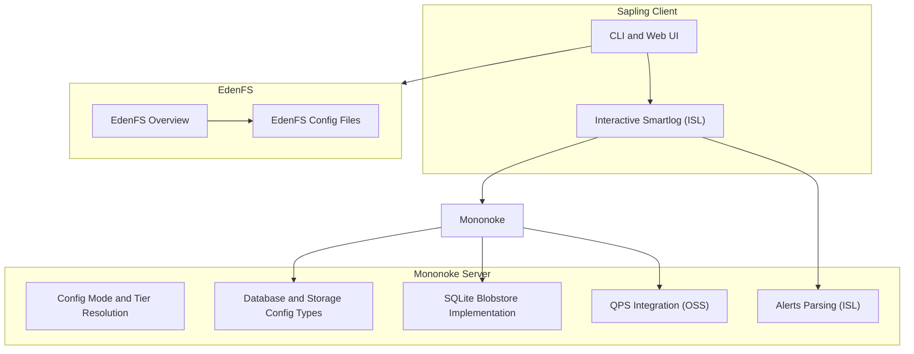
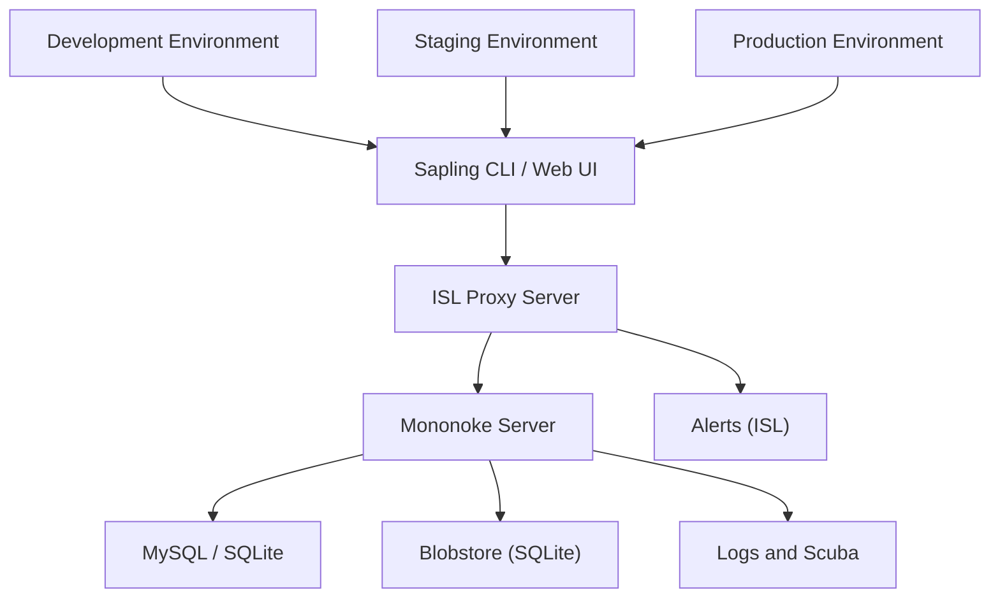
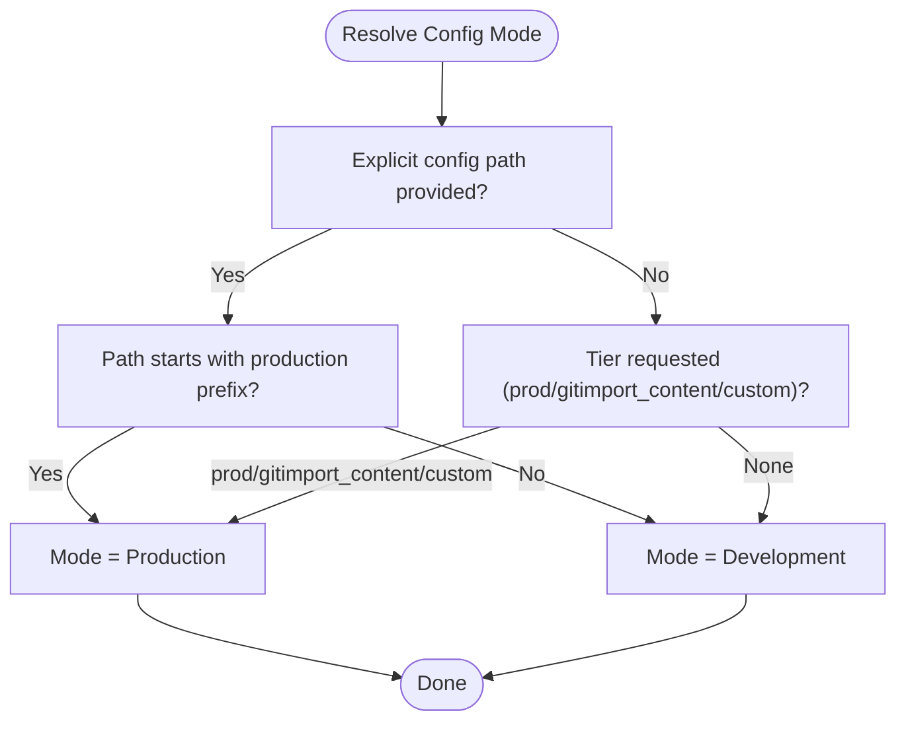
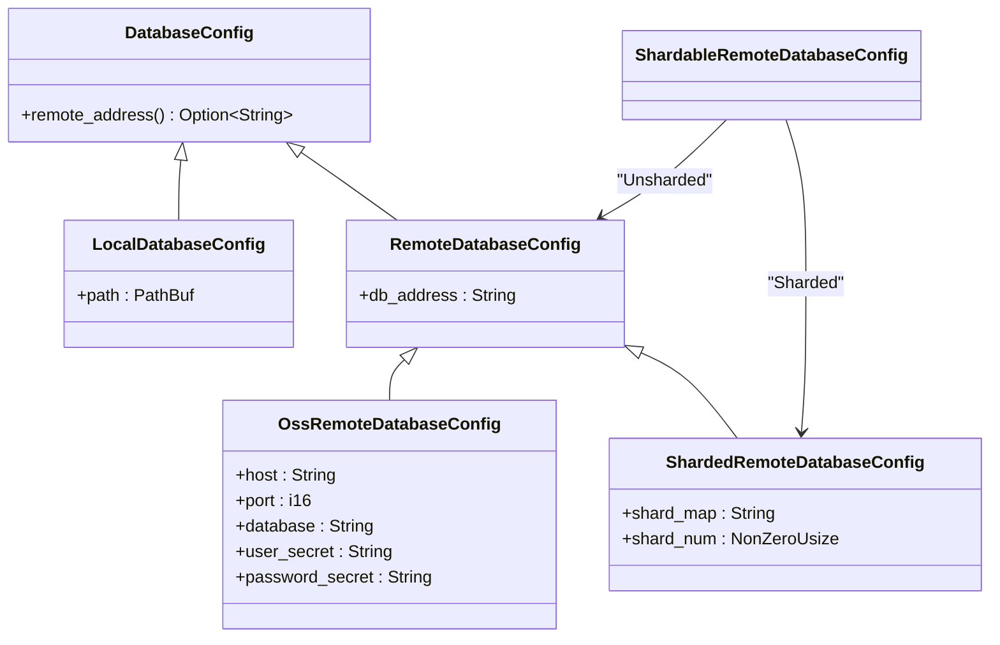
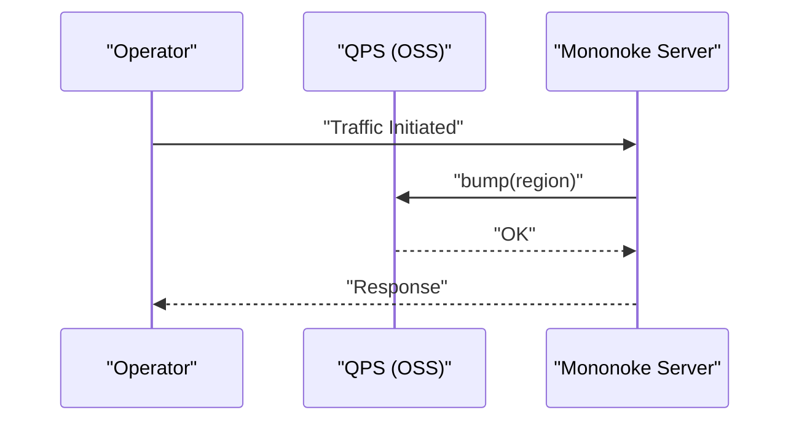
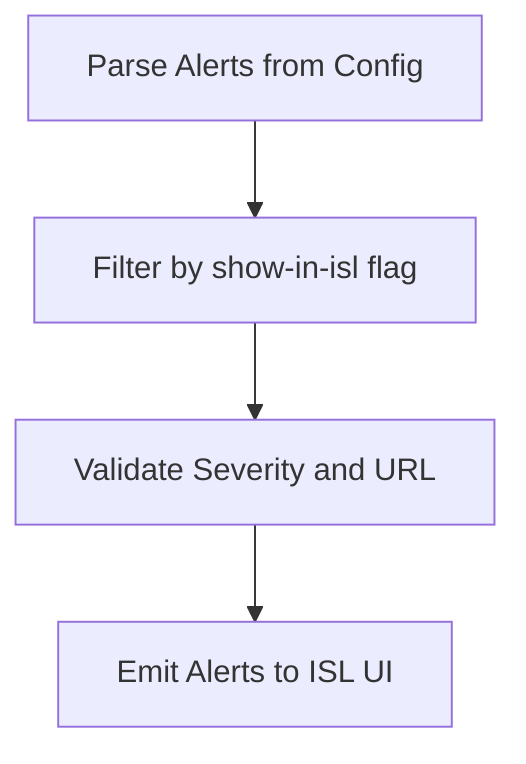
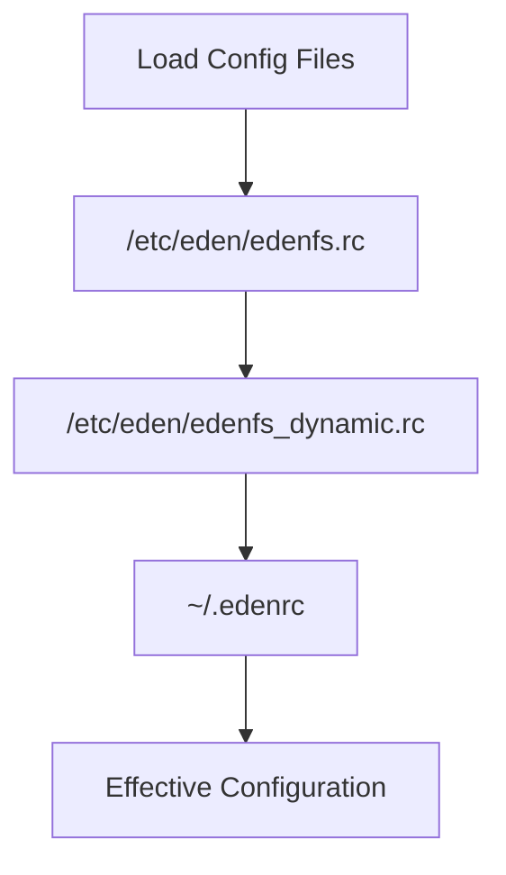
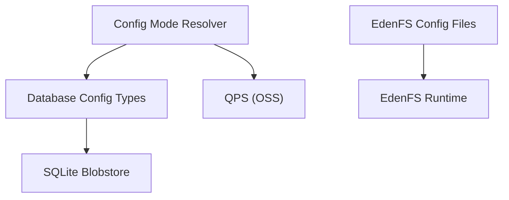

# Deployment and Operations

<cite>
**Referenced Files in This Document**
- [README.md](file://README.md)
- [eden/mononoke/README.md](file://eden/mononoke/README.md)
- [eden/fs/docs/Overview.md](file://eden/fs/docs/Overview.md)
- [eden/fs/docs/Config.md](file://eden/fs/docs/Config.md)
- [eden/mononoke/cmdlib/config_args/src/lib.rs](file://eden/mononoke/cmdlib/config_args/src/lib.rs)
- [eden/mononoke/metaconfig/types/src/lib.rs](file://eden/mononoke/metaconfig/types/src/lib.rs)
- [eden/mononoke/blobstore/sqlblob/src/lib.rs](file://eden/mononoke/blobstore/sqlblob/src/lib.rs)
- [eden/mononoke/servers/slapi/slapi_server/qps/src/oss.rs](file://eden/mononoke/servers/slapi/slapi_server/qps/src/oss.rs)
- [addons/isl-server/src/__tests__/alerts.test.ts](file://addons/isl-server/src/__tests__/alerts.test.ts)
- [addons/isl-server/proxy/server.ts](file://addons/isl-server/proxy/server.ts)
- [eden/scm/sapling/ext/commitcloud/background.py](file://eden/scm/sapling/ext/commitcloud/background.py)
- [eden/mononoke/common/memory_profiling/src/handler.rs](file://eden/mononoke/common/memory_profiling/src/handler.rs)
- [.devcontainer/devcontainer.json](file://.devcontainer/devcontainer.json)
</cite>

## Table of Contents
1. [Introduction](#introduction)
2. [Project Structure](#project-structure)
3. [Core Components](#core-components)
4. [Architecture Overview](#architecture-overview)
5. [Detailed Component Analysis](#detailed-component-analysis)
6. [Dependency Analysis](#dependency-analysis)
7. [Performance Considerations](#performance-considerations)
8. [Troubleshooting Guide](#troubleshooting-guide)
9. [Conclusion](#conclusion)
10. [Appendices](#appendices)

## Introduction
This document provides comprehensive guidance for deploying and operating SAPLING SCM across development, staging, and production environments. It covers server administration, backup and recovery, maintenance workflows, infrastructure requirements, scaling considerations, disaster recovery planning, monitoring and alerting, log management, troubleshooting, capacity planning, performance tuning, and security hardening for production deployments. The content is grounded in the repository’s source files and documentation to ensure accuracy and practical applicability.

## Project Structure
SAPLING SCM comprises three primary components:
- The Sapling client (CLI and web UI) for end-user interactions
- Mononoke (server-side component)
- EdenFS (virtual filesystem for efficient large-repository operations)

The repository includes:
- Build and development tooling
- Operational documentation for Mononoke and EdenFS
- Configuration and environment handling
- Example alerting and logging utilities

**Diagram sources**
- [README.md:14-28](file://README.md#L14-L28)
- [eden/mononoke/README.md:1-35](file://eden/mononoke/README.md#L1-L35)
- [eden/fs/docs/Overview.md:1-81](file://eden/fs/docs/Overview.md#L1-L81)
- [eden/fs/docs/Config.md:1-80](file://eden/fs/docs/Config.md#L1-L80)
- [eden/mononoke/cmdlib/config_args/src/lib.rs:45-87](file://eden/mononoke/cmdlib/config_args/src/lib.rs#L45-L87)
- [eden/mononoke/metaconfig/types/src/lib.rs:1183-1248](file://eden/mononoke/metaconfig/types/src/lib.rs#L1183-L1248)
- [eden/mononoke/blobstore/sqlblob/src/lib.rs:351-388](file://eden/mononoke/blobstore/sqlblob/src/lib.rs#L351-L388)
- [eden/mononoke/servers/slapi/slapi_server/qps/src/oss.rs:1-25](file://eden/mononoke/servers/slapi/slapi_server/qps/src/oss.rs#L1-L25)
- [addons/isl-server/src/__tests__/alerts.test.ts:40-78](file://addons/isl-server/src/__tests__/alerts.test.ts#L40-L78)

**Section sources**
- [README.md:14-28](file://README.md#L14-L28)
- [eden/mononoke/README.md:1-35](file://eden/mononoke/README.md#L1-L35)
- [eden/fs/docs/Overview.md:1-81](file://eden/fs/docs/Overview.md#L1-L81)
- [eden/fs/docs/Config.md:1-80](file://eden/fs/docs/Config.md#L1-L80)

## Core Components
- Configuration and Environment Modes
  - Mononoke determines configuration mode (development vs. production) based on arguments and prefixes, enabling environment-specific behavior.
  - Database configuration supports local SQLite and remote MySQL, including sharded configurations.
- Blobstore and Storage
  - SQLite-backed blobstore implementation demonstrates sharding and GC configuration handling.
- Monitoring and Metrics
  - QPS integration (OSS) provides a hook for traffic accounting.
- Logging and Alerts
  - ISL alert parsing tests demonstrate alert ingestion and filtering for the web UI.
- Filesystem Configuration
  - EdenFS configuration files define layered configuration precedence and dynamic rollout controls.

**Section sources**
- [eden/mononoke/cmdlib/config_args/src/lib.rs:45-87](file://eden/mononoke/cmdlib/config_args/src/lib.rs#L45-L87)
- [eden/mononoke/metaconfig/types/src/lib.rs:1183-1248](file://eden/mononoke/metaconfig/types/src/lib.rs#L1183-L1248)
- [eden/mononoke/blobstore/sqlblob/src/lib.rs:351-388](file://eden/mononoke/blobstore/sqlblob/src/lib.rs#L351-L388)
- [eden/mononoke/servers/slapi/slapi_server/qps/src/oss.rs:1-25](file://eden/mononoke/servers/slapi/slapi_server/qps/src/oss.rs#L1-L25)
- [addons/isl-server/src/__tests__/alerts.test.ts:40-78](file://addons/isl-server/src/__tests__/alerts.test.ts#L40-L78)
- [eden/fs/docs/Config.md:1-80](file://eden/fs/docs/Config.md#L1-L80)

## Architecture Overview
The operational architecture integrates client-facing components with backend services and storage, while leveraging configuration-driven modes and layered logging/alerting.

**Diagram sources**
- [README.md:14-28](file://README.md#L14-L28)
- [eden/mononoke/README.md:1-35](file://eden/mononoke/README.md#L1-L35)
- [eden/mononoke/metaconfig/types/src/lib.rs:1183-1248](file://eden/mononoke/metaconfig/types/src/lib.rs#L1183-L1248)
- [addons/isl-server/proxy/server.ts:1-44](file://addons/isl-server/proxy/server.ts#L1-L44)
- [addons/isl-server/src/__tests__/alerts.test.ts:40-78](file://addons/isl-server/src/__tests__/alerts.test.ts#L40-L78)

## Detailed Component Analysis

### Configuration and Environment Modes
- Purpose: Determine whether the system operates in development or production mode based on configuration inputs and prefixes.
- Key behaviors:
  - Tier resolution selects “prod”, “gitimport_content”, or a custom tier.
  - Production mode is inferred from explicit production prefix or requested tier.
  - Development mode applies otherwise.
- Implications:
  - Enables environment-specific configuration paths and behaviors.
  - Supports centralized configuration via configerator-backed paths.

**Diagram sources**
- [eden/mononoke/cmdlib/config_args/src/lib.rs:45-87](file://eden/mononoke/cmdlib/config_args/src/lib.rs#L45-L87)

**Section sources**
- [eden/mononoke/cmdlib/config_args/src/lib.rs:45-87](file://eden/mononoke/cmdlib/config_args/src/lib.rs#L45-L87)

### Database and Storage Configuration
- Supported configurations:
  - Local SQLite database
  - Remote MySQL database
  - Sharded remote MySQL database
- Behavior:
  - DatabaseConfig exposes remote_address for remote databases.
  - SQLite blobstore implementation demonstrates sharding and GC configuration retrieval.
- Implications:
  - Choose appropriate backend based on scale and availability requirements.
  - Sharding enables horizontal distribution for large-scale deployments.

**Diagram sources**
- [eden/mononoke/metaconfig/types/src/lib.rs:1183-1248](file://eden/mononoke/metaconfig/types/src/lib.rs#L1183-L1248)

**Section sources**
- [eden/mononoke/metaconfig/types/src/lib.rs:1183-1248](file://eden/mononoke/metaconfig/types/src/lib.rs#L1183-L1248)
- [eden/mononoke/blobstore/sqlblob/src/lib.rs:351-388](file://eden/mononoke/blobstore/sqlblob/src/lib.rs#L351-L388)

### Monitoring and QPS Integration
- Purpose: Provide a mechanism to track and account for traffic in OSS environments.
- Behavior:
  - QPS struct provides constructors and bump methods for region-based accounting.
- Implications:
  - Use for capacity planning and rate-limiting decisions.
  - Integrate with operational dashboards and alerting.

**Diagram sources**
- [eden/mononoke/servers/slapi/slapi_server/qps/src/oss.rs:1-25](file://eden/mononoke/servers/slapi/slapi_server/qps/src/oss.rs#L1-L25)

**Section sources**
- [eden/mononoke/servers/slapi/slapi_server/qps/src/oss.rs:1-25](file://eden/mononoke/servers/slapi/slapi_server/qps/src/oss.rs#L1-L25)

### Logging and Alerting
- ISL Alerts:
  - Tests demonstrate parsing and filtering of alerts for display in the ISL UI.
  - Alerts include keys, titles, descriptions, severities, URLs, and visibility flags.
- Commit Cloud Logging:
  - Background logging utilities manage per-user log directories and retention policies.
- Implications:
  - Centralize alert visibility and ensure proper filtering for UI surfaces.
  - Enforce log directory permissions and retention policies for auditability.

**Diagram sources**
- [addons/isl-server/src/__tests__/alerts.test.ts:40-78](file://addons/isl-server/src/__tests__/alerts.test.ts#L40-L78)

**Section sources**
- [addons/isl-server/src/__tests__/alerts.test.ts:40-78](file://addons/isl-server/src/__tests__/alerts.test.ts#L40-L78)
- [addons/isl-server/proxy/server.ts:1-44](file://addons/isl-server/proxy/server.ts#L1-L44)
- [eden/scm/sapling/ext/commitcloud/background.py:250-311](file://eden/scm/sapling/ext/commitcloud/background.py#L250-L311)

### EdenFS Configuration
- Purpose: Define layered configuration precedence and dynamic rollout controls.
- Key behaviors:
  - System configs in /etc/eden override defaults.
  - User config (~/.edenrc) overrides system settings.
  - Dynamic configs enable per-machine or per-user rollouts.
- Implications:
  - Use layered configs to separate concerns across environments.
  - Apply dynamic configs for gradual feature adoption.

**Diagram sources**
- [eden/fs/docs/Config.md:1-80](file://eden/fs/docs/Config.md#L1-L80)

**Section sources**
- [eden/fs/docs/Config.md:1-80](file://eden/fs/docs/Config.md#L1-L80)
- [eden/fs/docs/Overview.md:1-81](file://eden/fs/docs/Overview.md#L1-L81)

## Dependency Analysis
Operational dependencies span configuration resolution, database connectivity, storage backends, and monitoring/metrics.

**Diagram sources**
- [eden/mononoke/cmdlib/config_args/src/lib.rs:45-87](file://eden/mononoke/cmdlib/config_args/src/lib.rs#L45-L87)
- [eden/mononoke/metaconfig/types/src/lib.rs:1183-1248](file://eden/mononoke/metaconfig/types/src/lib.rs#L1183-L1248)
- [eden/mononoke/blobstore/sqlblob/src/lib.rs:351-388](file://eden/mononoke/blobstore/sqlblob/src/lib.rs#L351-L388)
- [eden/mononoke/servers/slapi/slapi_server/qps/src/oss.rs:1-25](file://eden/mononoke/servers/slapi/slapi_server/qps/src/oss.rs#L1-L25)
- [eden/fs/docs/Config.md:1-80](file://eden/fs/docs/Config.md#L1-L80)

**Section sources**
- [eden/mononoke/cmdlib/config_args/src/lib.rs:45-87](file://eden/mononoke/cmdlib/config_args/src/lib.rs#L45-L87)
- [eden/mononoke/metaconfig/types/src/lib.rs:1183-1248](file://eden/mononoke/metaconfig/types/src/lib.rs#L1183-L1248)
- [eden/mononoke/blobstore/sqlblob/src/lib.rs:351-388](file://eden/mononoke/blobstore/sqlblob/src/lib.rs#L351-L388)
- [eden/mononoke/servers/slapi/slapi_server/qps/src/oss.rs:1-25](file://eden/mononoke/servers/slapi/slapi_server/qps/src/oss.rs#L1-L25)
- [eden/fs/docs/Config.md:1-80](file://eden/fs/docs/Config.md#L1-L80)

## Performance Considerations
- Database Tuning
  - SQLite WAL mode improves write throughput and concurrency.
  - Temporary storage in memory reduces I/O overhead.
  - Exclusive locking mode minimizes lock contention for WAL databases.
- Blobstore Sharding
  - Sharded SQLite blobstore distributes load and simplifies GC configuration handling.
- Monitoring Hooks
  - QPS integration enables traffic accounting for capacity planning.
- Memory Profiling
  - Handlers validate profiling availability and access controls for performance analysis.

**Section sources**
- [eden/mononoke/blobstore/sqlblob/src/lib.rs:351-388](file://eden/mononoke/blobstore/sqlblob/src/lib.rs#L351-L388)
- [eden/mononoke/servers/slapi/slapi_server/qps/src/oss.rs:1-25](file://eden/mononoke/servers/slapi/slapi_server/qps/src/oss.rs#L1-L25)
- [eden/mononoke/common/memory_profiling/src/handler.rs:1-40](file://eden/mononoke/common/memory_profiling/src/handler.rs#L1-L40)

## Troubleshooting Guide
- Configuration Mode Misclassification
  - Verify explicit config path and production prefix to ensure correct mode selection.
- Database Connectivity
  - Confirm remote_address resolution for remote databases and shard configuration for sharded setups.
- Logging and Retention
  - Ensure log directory permissions and retention policies are enforced for per-user log directories.
- Alert Visibility
  - Validate alert parsing and filtering logic for ISL UI visibility.

**Section sources**
- [eden/mononoke/cmdlib/config_args/src/lib.rs:45-87](file://eden/mononoke/cmdlib/config_args/src/lib.rs#L45-L87)
- [eden/mononoke/metaconfig/types/src/lib.rs:1183-1248](file://eden/mononoke/metaconfig/types/src/lib.rs#L1183-L1248)
- [eden/scm/sapling/ext/commitcloud/background.py:250-311](file://eden/scm/sapling/ext/commitcloud/background.py#L250-L311)
- [addons/isl-server/src/__tests__/alerts.test.ts:40-78](file://addons/isl-server/src/__tests__/alerts.test.ts#L40-L78)

## Conclusion
This guide consolidates deployment and operational practices for SAPLING SCM across environments, emphasizing configuration-driven modes, robust storage backends, monitoring hooks, and disciplined logging/alerting. By aligning environment tiers with configuration paths, selecting appropriate databases and blobstores, and enforcing operational hygiene, teams can achieve reliable, scalable, and secure deployments.

## Appendices

### Containerized Development Environment
- A devcontainer configuration references a Dockerfile from the CI workflows and sets up a symlink for the CLI binary, enabling a reproducible development environment.

**Section sources**
- [.devcontainer/devcontainer.json:1-23](file://.devcontainer/devcontainer.json#L1-L23)