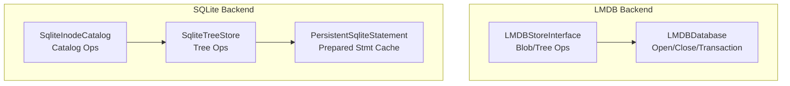
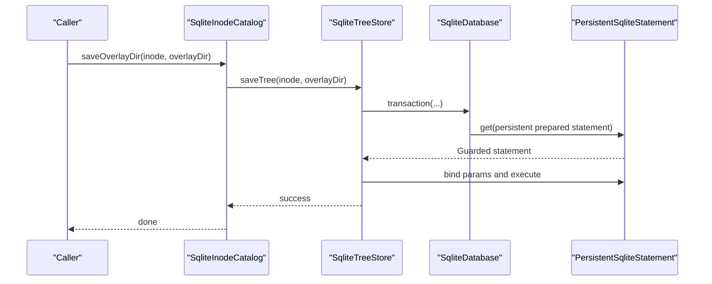
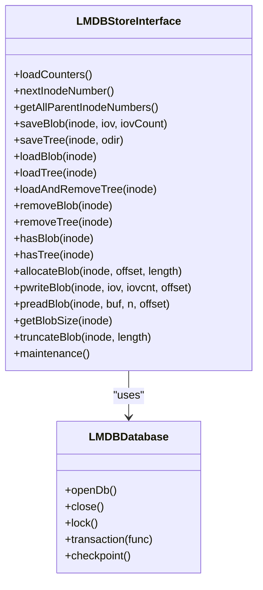
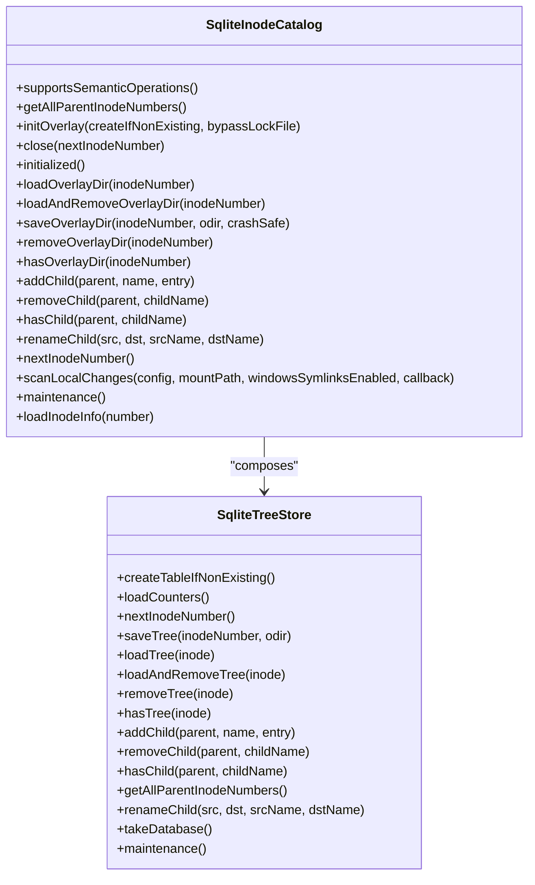
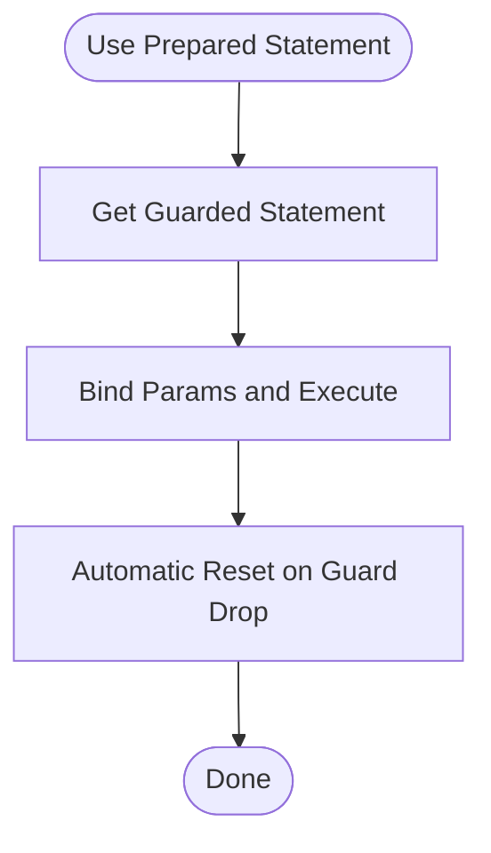
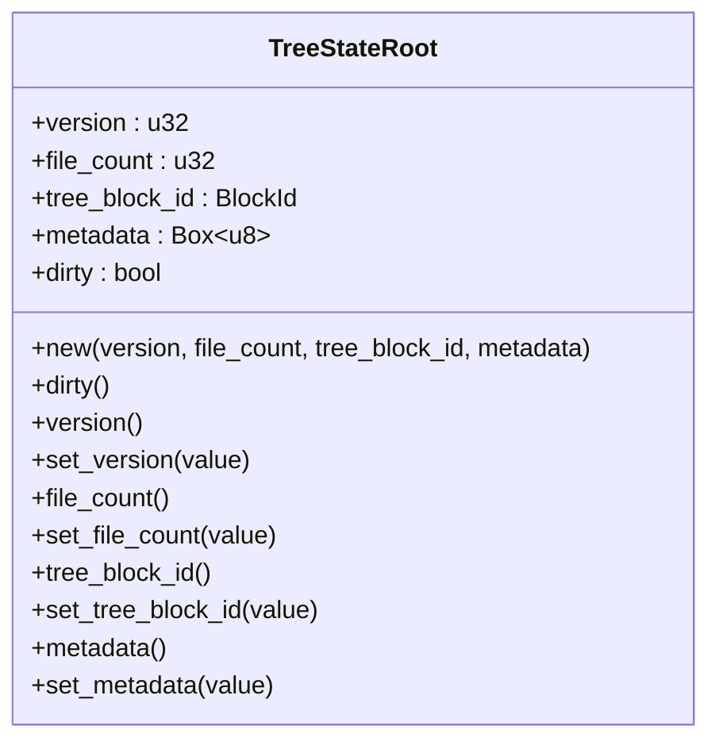
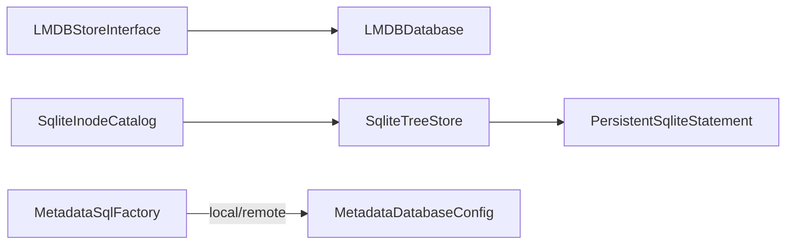

# Database Backends and Metadata Storage

<cite>
**Referenced Files in This Document**
- [LMDBDatabase.h](file://eden/fs/lmdb/LMDBDatabase.h)
- [LMDBDatabase.cpp](file://eden/fs/lmdb/LMDBDatabase.cpp)
- [LMDBStoreInterface.h](file://eden/fs/inodes/lmdbcatalog/LMDBStoreInterface.h)
- [LMDBStoreInterface.cpp](file://eden/fs/inodes/lmdbcatalog/LMDBStoreInterface.cpp)
- [SqliteInodeCatalog.h](file://eden/fs/inodes/sqlitecatalog/SqliteInodeCatalog.h)
- [SqliteTreeStore.h](file://eden/fs/inodes/sqlitecatalog/SqliteTreeStore.h)
- [PersistentSqliteStatement.h](file://eden/fs/sqlite/PersistentSqliteStatement.h)
- [SqliteConnection.h](file://eden/fs/sqlite/SqliteConnection.h)
- [sql.rs](file://eden/mononoke/blobstore/factory/src/sql.rs)
- [config.rs](file://eden/mononoke/common/sql_construct/src/config.rs)
- [construct.rs](file://eden/mononoke/common/sql_construct/src/construct.rs)
- [root.rs](file://eden/scm/lib/treestate/src/root.rs)
- [serialization.rs](file://eden/scm/lib/treestate/src/serialization.rs)
</cite>

## Table of Contents
1. [Introduction](#introduction)
2. [Project Structure](#project-structure)
3. [Core Components](#core-components)
4. [Architecture Overview](#architecture-overview)
5. [Detailed Component Analysis](#detailed-component-analysis)
6. [Dependency Analysis](#dependency-analysis)
7. [Performance Considerations](#performance-considerations)
8. [Troubleshooting Guide](#troubleshooting-guide)
9. [Conclusion](#conclusion)
10. [Appendices](#appendices)

## Introduction
This document explains the database backends and metadata storage systems used by EdenFS for persistent metadata. It focuses on the LMDB and SQLite implementations that back the inode catalog and tree storage, detailing schema design, indexing strategies, transaction handling, concurrency, and operational guidance. It also covers repository state serialization and highlights differences between LMDB and SQLite backends, along with migration and maintenance procedures.

## Project Structure
EdenFS implements two primary metadata storage backends:
- LMDB-backed inode catalog and blob storage for overlay metadata
- SQLite-backed inode catalog and tree store for overlay directory metadata

Key backend components and their roles:
- LMDB: Used for storing blob data keyed by inode numbers and for maintaining overlay directory metadata via a dedicated interface.
- SQLite: Used for inode catalog and tree store operations, with persistent prepared statements and synchronous modes.

**Diagram sources**
- [LMDBDatabase.h:26-101](file://eden/fs/lmdb/LMDBDatabase.h#L26-L101)
- [LMDBStoreInterface.h:47-211](file://eden/fs/inodes/lmdbcatalog/LMDBStoreInterface.h#L47-L211)
- [SqliteInodeCatalog.h:31-118](file://eden/fs/inodes/sqlitecatalog/SqliteInodeCatalog.h#L31-L118)
- [SqliteTreeStore.h:48-175](file://eden/fs/inodes/sqlitecatalog/SqliteTreeStore.h#L48-L175)
- [PersistentSqliteStatement.h:24-89](file://eden/fs/sqlite/PersistentSqliteStatement.h#L24-L89)

**Section sources**
- [LMDBDatabase.h:26-101](file://eden/fs/lmdb/LMDBDatabase.h#L26-L101)
- [LMDBStoreInterface.h:47-211](file://eden/fs/inodes/lmdbcatalog/LMDBStoreInterface.h#L47-L211)
- [SqliteInodeCatalog.h:31-118](file://eden/fs/inodes/sqlitecatalog/SqliteInodeCatalog.h#L31-L118)
- [SqliteTreeStore.h:48-175](file://eden/fs/inodes/sqlitecatalog/SqliteTreeStore.h#L48-L175)
- [PersistentSqliteStatement.h:24-89](file://eden/fs/sqlite/PersistentSqliteStatement.h#L24-L89)

## Core Components
- LMDBDatabase: Manages LMDB environment lifecycle, transactions, and checkpoints. It enforces single-writer semantics and exposes a transaction helper that opens a DBI per transaction.
- LMDBStoreInterface: Provides inode-number-keyed storage for blobs and trees, with operations like save/load/remove and allocation/truncation support.
- SqliteInodeCatalog: Implements the inode catalog interface using SQLite-backed tree store, supporting overlay directory operations and semantic operations.
- SqliteTreeStore: Specializes in storing and retrieving overlay directory trees, with table/index creation, child management, and maintenance routines.
- PersistentSqliteStatement: Caches prepared statements to reduce overhead and ensures proper reset semantics during use.
- SqliteConnection: Encapsulates SQLite connection state with synchronized access and status tracking.

**Section sources**
- [LMDBDatabase.h:26-101](file://eden/fs/lmdb/LMDBDatabase.h#L26-L101)
- [LMDBStoreInterface.h:47-211](file://eden/fs/inodes/lmdbcatalog/LMDBStoreInterface.h#L47-L211)
- [SqliteInodeCatalog.h:31-118](file://eden/fs/inodes/sqlitecatalog/SqliteInodeCatalog.h#L31-L118)
- [SqliteTreeStore.h:48-175](file://eden/fs/inodes/sqlitecatalog/SqliteTreeStore.h#L48-L175)
- [PersistentSqliteStatement.h:24-89](file://eden/fs/sqlite/PersistentSqliteStatement.h#L24-L89)
- [SqliteConnection.h:16-25](file://eden/fs/sqlite/SqliteConnection.h#L16-L25)

## Architecture Overview
The metadata storage architecture separates concerns between:
- Blob storage and inode counters (LMDB)
- Directory tree metadata (SQLite-backed stores)

**Diagram sources**
- [SqliteInodeCatalog.h:71-74](file://eden/fs/inodes/sqlitecatalog/SqliteInodeCatalog.h#L71-L74)
- [SqliteTreeStore.h:92-97](file://eden/fs/inodes/sqlitecatalog/SqliteTreeStore.h#L92-L97)
- [PersistentSqliteStatement.h:83-85](file://eden/fs/sqlite/PersistentSqliteStatement.h#L83-L85)

## Detailed Component Analysis

### LMDB Backend
LMDBDatabase manages:
- Environment creation and map sizing
- Transaction lifecycle (begin, commit, DBI open/close)
- Checkpointing for forced writes
- Error handling and logging

LMDBStoreInterface provides:
- Blob operations (save, load, remove, allocate, truncate, pwrite/pread)
- Tree operations (save, load, load-and-remove, remove, existence checks)
- Counter loading and next-inode generation
- Maintenance via checkpoint

**Diagram sources**
- [LMDBDatabase.h:26-101](file://eden/fs/lmdb/LMDBDatabase.h#L26-L101)
- [LMDBStoreInterface.h:47-211](file://eden/fs/inodes/lmdbcatalog/LMDBStoreInterface.h#L47-L211)

**Section sources**
- [LMDBDatabase.cpp:48-144](file://eden/fs/lmdb/LMDBDatabase.cpp#L48-L144)
- [LMDBStoreInterface.cpp:77-400](file://eden/fs/inodes/lmdbcatalog/LMDBStoreInterface.cpp#L77-L400)
- [LMDBStoreInterface.h:73-211](file://eden/fs/inodes/lmdbcatalog/LMDBStoreInterface.h#L73-L211)

### SQLite Backend
SqliteInodeCatalog and SqliteTreeStore implement:
- Table/index creation for overlay metadata
- Child management (add/remove/rename)
- Overlay directory load/save/remove
- Maintenance via checkpoint
- Synchronous modes (Off/Normal) for durability vs performance trade-offs

**Diagram sources**
- [SqliteInodeCatalog.h:31-118](file://eden/fs/inodes/sqlitecatalog/SqliteInodeCatalog.h#L31-L118)
- [SqliteTreeStore.h:48-175](file://eden/fs/inodes/sqlitecatalog/SqliteTreeStore.h#L48-L175)

**Section sources**
- [SqliteInodeCatalog.h:31-118](file://eden/fs/inodes/sqlitecatalog/SqliteInodeCatalog.h#L31-L118)
- [SqliteTreeStore.h:76-150](file://eden/fs/inodes/sqlitecatalog/SqliteTreeStore.h#L76-L150)

### Statement Caching and Concurrency
PersistentSqliteStatement caches prepared statements and resets them automatically, ensuring correctness and performance. SqliteConnection tracks connection state and is guarded by synchronized locks.

**Diagram sources**
- [PersistentSqliteStatement.h:83-85](file://eden/fs/sqlite/PersistentSqliteStatement.h#L83-L85)

**Section sources**
- [PersistentSqliteStatement.h:24-89](file://eden/fs/sqlite/PersistentSqliteStatement.h#L24-L89)
- [SqliteConnection.h:16-25](file://eden/fs/sqlite/SqliteConnection.h#L16-L25)

### Repository State Serialization
Tree state is represented by a root structure containing version, file count, tree block ID, and metadata. Serialization includes checksum verification and VLQ encoding for compactness.

**Diagram sources**
- [root.rs:10-70](file://eden/scm/lib/treestate/src/root.rs#L10-L70)

**Section sources**
- [serialization.rs:234-272](file://eden/scm/lib/treestate/src/serialization.rs#L234-L272)
- [root.rs:10-70](file://eden/scm/lib/treestate/src/root.rs#L10-L70)

## Dependency Analysis
- LMDBStoreInterface depends on LMDBDatabase for environment and transaction management.
- SqliteInodeCatalog composes SqliteTreeStore for tree operations.
- SqliteTreeStore depends on SqliteDatabase and uses PersistentSqliteStatement for prepared statements.
- Mononoke-side metadata database factory supports local SQLite and remote configurations, enabling flexible deployment choices.

**Diagram sources**
- [LMDBStoreInterface.h:205-211](file://eden/fs/inodes/lmdbcatalog/LMDBStoreInterface.h#L205-L211)
- [SqliteInodeCatalog.h:115-118](file://eden/fs/inodes/sqlitecatalog/SqliteInodeCatalog.h#L115-L118)
- [SqliteTreeStore.h:168-175](file://eden/fs/inodes/sqlitecatalog/SqliteTreeStore.h#L168-L175)
- [PersistentSqliteStatement.h:88-89](file://eden/fs/sqlite/PersistentSqliteStatement.h#L88-L89)
- [sql.rs:63-78](file://eden/mononoke/blobstore/factory/src/sql.rs#L63-L78)
- [config.rs:156-174](file://eden/mononoke/common/sql_construct/src/config.rs#L156-L174)

**Section sources**
- [LMDBStoreInterface.h:205-211](file://eden/fs/inodes/lmdbcatalog/LMDBStoreInterface.h#L205-L211)
- [SqliteInodeCatalog.h:115-118](file://eden/fs/inodes/sqlitecatalog/SqliteInodeCatalog.h#L115-L118)
- [SqliteTreeStore.h:168-175](file://eden/fs/inodes/sqlitecatalog/SqliteTreeStore.h#L168-L175)
- [PersistentSqliteStatement.h:88-89](file://eden/fs/sqlite/PersistentSqliteStatement.h#L88-L89)
- [sql.rs:63-78](file://eden/mononoke/blobstore/factory/src/sql.rs#L63-L78)
- [config.rs:156-174](file://eden/mononoke/common/sql_construct/src/config.rs#L156-L174)

## Performance Considerations
- LMDB
  - Uses MDB_NOLOCK/MDB_NOSYNC/MDB_NOMETASYNC for high throughput; durability is ACI with potential loss of last transactions depending on filesystem write guarantees.
  - Map size is fixed at initialization; ensure adequate sizing for expected metadata volume.
  - Transactions open/close DBIs per transaction; keep workloads small to minimize contention.
  - Use checkpoint to force OS buffer flush when durability requires it.
- SQLite
  - SynchronousMode controls durability vs performance; Normal balances safety and speed; Off maximizes throughput at the cost of durability.
  - Persistent prepared statements reduce preparation overhead for repeated operations.
  - Statement cache lifetime must precede database close to avoid leaks.

[No sources needed since this section provides general guidance]

## Troubleshooting Guide
- LMDB
  - Symptoms: open failures, transaction errors, or database corruption indicators.
  - Actions: inspect LMDB error logs, verify environment flags and map size, run checkpoint to flush buffers, and consider recreating the database if corruption is suspected.
  - Recovery: on Windows, automatic fallback attempts to remove and recreate the database when initial open fails.
- SQLite
  - Symptoms: statement preparation errors, connection state issues, or assertion failures due to improper statement lifetime.
  - Actions: ensure PersistentSqliteStatement lifetimes end before closing the database, verify synchronous mode matches durability needs, and run maintenance operations like checkpoint.
- Repository State
  - Symptoms: deserialization errors indicating checksum mismatch or unsupported version.
  - Actions: validate serialized data integrity, ensure version compatibility, and re-serialize if necessary.

**Section sources**
- [LMDBDatabase.cpp:18-38](file://eden/fs/lmdb/LMDBDatabase.cpp#L18-L38)
- [LMDBStoreInterface.cpp:44-52](file://eden/fs/inodes/lmdbcatalog/LMDBStoreInterface.cpp#L44-L52)
- [PersistentSqliteStatement.h:19-23](file://eden/fs/sqlite/PersistentSqliteStatement.h#L19-L23)
- [serialization.rs:240-248](file://eden/scm/lib/treestate/src/serialization.rs#L240-L248)

## Conclusion
EdenFS employs LMDB and SQLite to provide efficient, durable, and scalable metadata storage. LMDB excels at high-throughput blob and counter storage with careful durability tuning, while SQLite offers robust tree and catalog operations with prepared statement caching and configurable synchronous modes. Proper transaction handling, maintenance routines, and statement lifecycle management are essential for reliability and performance.

[No sources needed since this section summarizes without analyzing specific files]

## Appendices

### Schema Design and Indexing Strategies
- LMDB
  - Keys: inode numbers encoded as strings; values: serialized blob data.
  - Cursors used for enumeration and scanning; no secondary indices.
- SQLite
  - Tables for inode entries and tree nodes; indexes on parent-child relationships and inode identifiers to accelerate lookups and directory traversal.
  - Statement cache reduces repeated preparation costs for frequent operations.

**Section sources**
- [LMDBStoreInterface.cpp:133-155](file://eden/fs/inodes/lmdbcatalog/LMDBStoreInterface.cpp#L133-L155)
- [SqliteTreeStore.h:76-133](file://eden/fs/inodes/sqlitecatalog/SqliteTreeStore.h#L76-L133)
- [PersistentSqliteStatement.h:24-89](file://eden/fs/sqlite/PersistentSqliteStatement.h#L24-L89)

### Database Operations Examples
- LMDB
  - Save blob: [LMDBStoreInterface.cpp:157-170](file://eden/fs/inodes/lmdbcatalog/LMDBStoreInterface.cpp#L157-L170)
  - Load tree: [LMDBStoreInterface.cpp:105-108](file://eden/fs/inodes/lmdbcatalog/LMDBStoreInterface.cpp#L105-L108)
  - Allocate/truncate blob: [LMDBStoreInterface.cpp:155-200](file://eden/fs/inodes/lmdbcatalog/LMDBStoreInterface.cpp#L155-L200)
- SQLite
  - Save tree: [SqliteTreeStore.h:92-97](file://eden/fs/inodes/sqlitecatalog/SqliteTreeStore.h#L92-L97)
  - Add child: [SqliteTreeStore.h:119-122](file://eden/fs/inodes/sqlitecatalog/SqliteTreeStore.h#L119-L122)
  - Rename child: [SqliteTreeStore.h:140-144](file://eden/fs/inodes/sqlitecatalog/SqliteTreeStore.h#L140-L144)

**Section sources**
- [LMDBStoreInterface.cpp:157-200](file://eden/fs/inodes/lmdbcatalog/LMDBStoreInterface.cpp#L157-L200)
- [SqliteTreeStore.h:92-144](file://eden/fs/inodes/sqlitecatalog/SqliteTreeStore.h#L92-L144)

### Migration Procedures
- LMDB
  - Planned migrations should be coordinated with transaction boundaries; ensure backup before schema changes; validate counters and cursors after migration.
- SQLite
  - Use controlled maintenance windows; run schema upgrades within transactions; verify prepared statement cache validity after changes.

[No sources needed since this section provides general guidance]

### Backend Choice Guidance
- Choose LMDB when:
  - High-throughput blob and counter operations are critical.
  - Durability can be relaxed to ACI with periodic checkpointing.
- Choose SQLite when:
  - Complex tree and directory operations with prepared statements are preferred.
  - Configurable synchronous modes are desired for durability/performance tuning.

[No sources needed since this section provides general guidance]