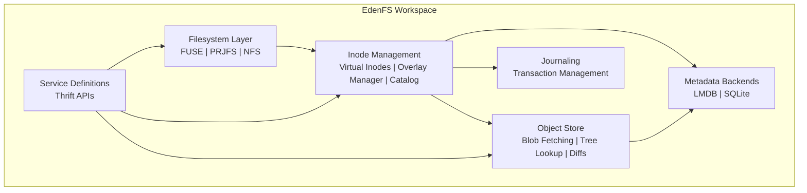
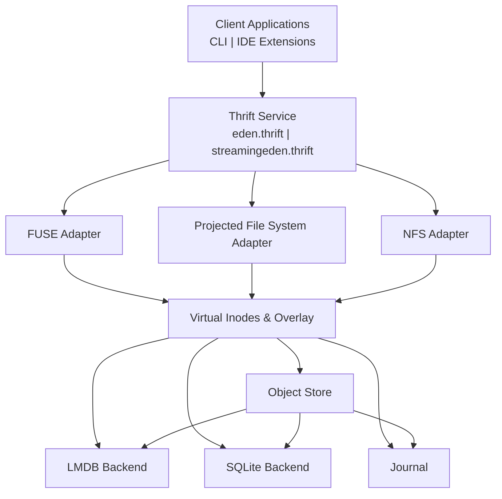
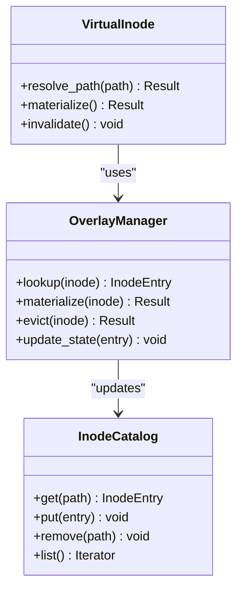
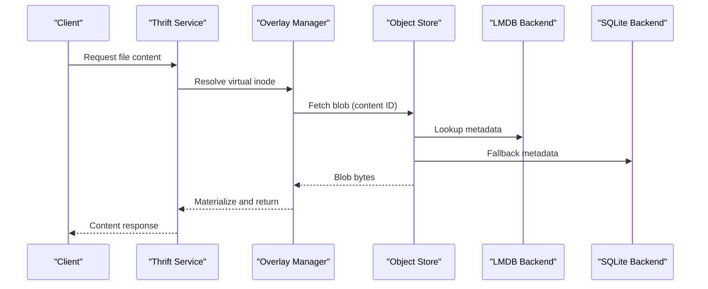
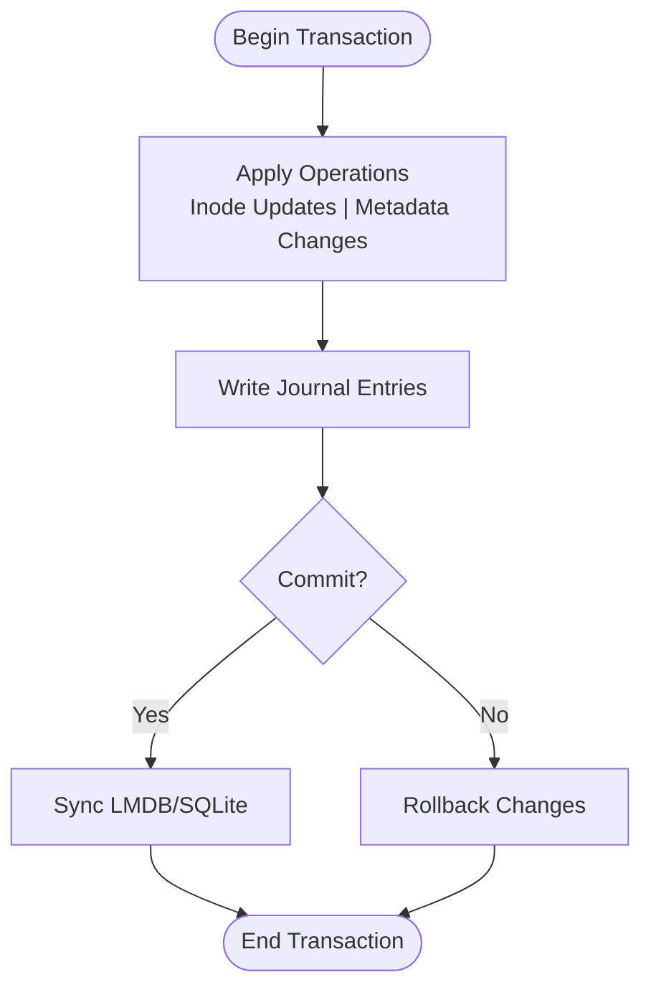
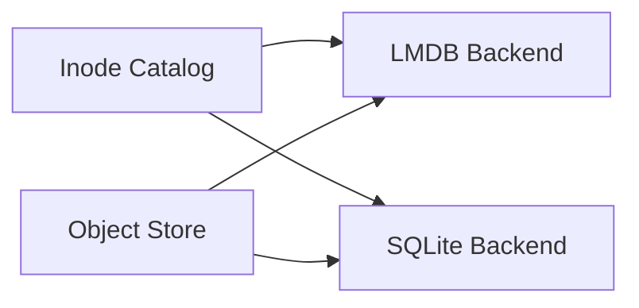
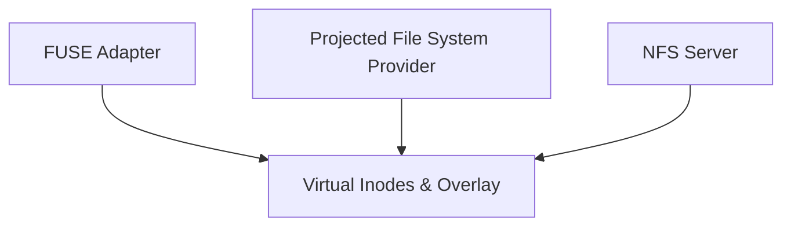
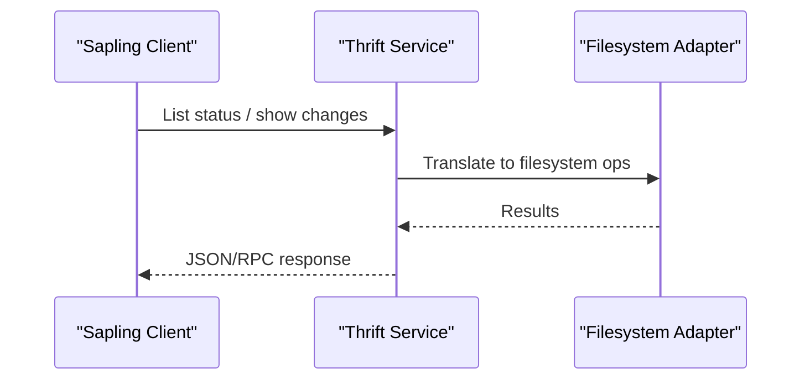
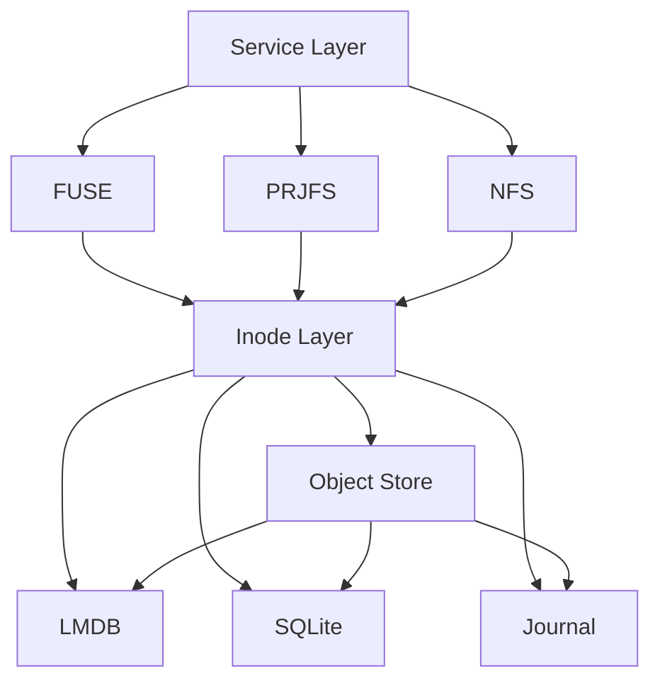

# EdenFS Virtual Filesystem

<cite>
**Referenced Files in This Document**
- [Cargo.toml](file://eden/Cargo.toml)
- [CMakeLists.txt](file://eden/fs/CMakeLists.txt)
- [ObjectFetchContext.h](file://eden/fs/store/ObjectFetchContext.h)
- [lmdb_env.h](file://eden/fs/lmdb/lmdb_env.h)
- [sqlite_db.h](file://eden/fs/sqlite/sqlite_db.h)
- [fuse_impl.h](file://eden/fs/fuse/fuse_impl.h)
- [prjfs_provider.h](file://eden/fs/prjfs/prjfs_provider.h)
- [nfs_server.h](file://eden/fs/nfs/nfs_server.h)
- [inode_catalog.h](file://eden/fs/inodes/inode_catalog.h)
- [virtual_inode.h](file://eden/fs/inodes/virtual_inode.h)
- [overlay_manager.h](file://eden/fs/inodes/overlay_manager.h)
- [journal.h](file://eden/fs/journal/journal.h)
- [eden.thrift](file://eden/fs/service/eden.thrift)
- [streamingeden.thrift](file://eden/fs/service/streamingeden.thrift)
- [edenfs-client](file://eden/fs/cli_rs/sapling-client/src/lib.rs)
- [status.rs](file://eden/fs/cli_rs/sapling-client/src/status.rs)
- [mergebase.rs](file://eden/fs/cli_rs/sapling-client/src/mergebase.rs)
- [README.md](file://eden/fs/docs/README.md)
</cite>

## Table of Contents
1. [Introduction](#introduction)
2. [Project Structure](#project-structure)
3. [Core Components](#core-components)
4. [Architecture Overview](#architecture-overview)
5. [Detailed Component Analysis](#detailed-component-analysis)
6. [Dependency Analysis](#dependency-analysis)
7. [Performance Considerations](#performance-considerations)
8. [Troubleshooting Guide](#troubleshooting-guide)
9. [Conclusion](#conclusion)

## Introduction
This document describes the EdenFS virtual filesystem architecture, focusing on its layered design that separates inode management, object storage, and caching mechanisms from the overlay filesystem implementation. It explains how virtual inodes enable lazy loading of repository contents, how the object store coordinates blob retrieval and tree operations, and how the journaling subsystem manages transactions. It also covers metadata storage backends (LMDB and SQLite), cross-platform filesystem abstractions (FUSE, Projected File System, NFS), and performance optimization strategies for large-scale operations.

## Project Structure
EdenFS is organized as a Rust workspace with multiple crates and platform-specific filesystem adapters. The core filesystem layer resides under eden/fs, while service definitions and client bindings live alongside it. The workspace includes:
- Filesystem layer: FUSE, Projected File System (PRJFS), and NFS adapters
- Metadata backends: LMDB and SQLite
- Object store and fetch contexts
- Inode management: virtual inode system, overlay manager, and inode catalog
- Journaling and service definitions

**Section sources**
- [Cargo.toml](file://eden/Cargo.toml)
- [CMakeLists.txt](file://eden/fs/CMakeLists.txt)

## Core Components
- Virtual inode system: lazily materializes repository contents on demand, backed by an inode catalog and overlay manager.
- Object store: retrieves blobs and performs tree operations, coordinating with backend databases for metadata.
- Journaling: ensures atomicity and durability for metadata updates.
- Metadata backends: LMDB for high-performance key-value storage; SQLite for compatibility and portability.
- Cross-platform filesystem adapters: FUSE for Unix-like systems, PRJFS for Windows, and NFS for network sharing.

**Section sources**
- [virtual_inode.h](file://eden/fs/inodes/virtual_inode.h)
- [inode_catalog.h](file://eden/fs/inodes/inode_catalog.h)
- [overlay_manager.h](file://eden/fs/inodes/overlay_manager.h)
- [ObjectFetchContext.h](file://eden/fs/store/ObjectFetchContext.h)
- [lmdb_env.h](file://eden/fs/lmdb/lmdb_env.h)
- [sqlite_db.h](file://eden/fs/sqlite/sqlite_db.h)
- [journal.h](file://eden/fs/journal/journal.h)
- [fuse_impl.h](file://eden/fs/fuse/fuse_impl.h)
- [prjfs_provider.h](file://eden/fs/prjfs/prjfs_provider.h)
- [nfs_server.h](file://eden/fs/nfs/nfs_server.h)

## Architecture Overview
The EdenFS architecture separates concerns across layers:
- Presentation and control: Thrift service definitions expose operations to clients and monitors.
- Filesystem interface: Platform-specific adapters translate OS calls into EdenFS operations.
- Inode layer: Virtual inodes and overlays manage repository state and lazy materialization.
- Storage layer: Object store resolves content identifiers and coordinates with metadata backends.
- Persistence: Journal records changes; LMDB/SQLite persist metadata.

**Diagram sources**
- [eden.thrift](file://eden/fs/service/eden.thrift)
- [streamingeden.thrift](file://eden/fs/service/streamingeden.thrift)
- [fuse_impl.h](file://eden/fs/fuse/fuse_impl.h)
- [prjfs_provider.h](file://eden/fs/prjfs/prjfs_provider.h)
- [nfs_server.h](file://eden/fs/nfs/nfs_server.h)
- [virtual_inode.h](file://eden/fs/inodes/virtual_inode.h)
- [overlay_manager.h](file://eden/fs/inodes/overlay_manager.h)
- [ObjectFetchContext.h](file://eden/fs/store/ObjectFetchContext.h)
- [lmdb_env.h](file://eden/fs/lmdb/lmdb_env.h)
- [sqlite_db.h](file://eden/fs/sqlite/sqlite_db.h)
- [journal.h](file://eden/fs/journal/journal.h)

## Detailed Component Analysis

### Virtual Inode System
The virtual inode system enables lazy loading of repository contents:
- Virtual inode: represents a file or directory entry without immediately materializing content.
- Overlay manager: maintains the working copy state and decides when to materialize or evict content.
- Inode catalog: maps logical paths to inode entries and tracks metadata such as content identifiers and timestamps.

**Diagram sources**
- [virtual_inode.h](file://eden/fs/inodes/virtual_inode.h)
- [overlay_manager.h](file://eden/fs/inodes/overlay_manager.h)
- [inode_catalog.h](file://eden/fs/inodes/inode_catalog.h)

**Section sources**
- [virtual_inode.h](file://eden/fs/inodes/virtual_inode.h)
- [overlay_manager.h](file://eden/fs/inodes/overlay_manager.h)
- [inode_catalog.h](file://eden/fs/inodes/inode_catalog.h)

### Object Store and Blob Retrieval
The object store coordinates blob retrieval and tree operations:
- Object fetch context: encapsulates fetching policies, concurrency limits, and cache interactions.
- Tree lookup processors: resolve directory listings and compute diffs between revisions.
- Diff operations: compare two tree states to produce incremental changes.

**Diagram sources**
- [eden.thrift](file://eden/fs/service/eden.thrift)
- [streamingeden.thrift](file://eden/fs/service/streamingeden.thrift)
- [overlay_manager.h](file://eden/fs/inodes/overlay_manager.h)
- [ObjectFetchContext.h](file://eden/fs/store/ObjectFetchContext.h)
- [lmdb_env.h](file://eden/fs/lmdb/lmdb_env.h)
- [sqlite_db.h](file://eden/fs/sqlite/sqlite_db.h)

**Section sources**
- [ObjectFetchContext.h](file://eden/fs/store/ObjectFetchContext.h)

### Journaling and Transaction Management
The journal ensures atomic metadata updates:
- Records ordered sequences of changes to inodes and metadata.
- Supports rollback and replay for crash recovery.
- Coordinates with LMDB/SQLite to maintain consistency.

**Diagram sources**
- [journal.h](file://eden/fs/journal/journal.h)
- [lmdb_env.h](file://eden/fs/lmdb/lmdb_env.h)
- [sqlite_db.h](file://eden/fs/sqlite/sqlite_db.h)

**Section sources**
- [journal.h](file://eden/fs/journal/journal.h)

### Metadata Backends: LMDB and SQLite
- LMDB backend: high-throughput key-value storage optimized for EdenFS metadata.
- SQLite backend: provides compatibility and portability for environments where LMDB is unavailable.

**Diagram sources**
- [lmdb_env.h](file://eden/fs/lmdb/lmdb_env.h)
- [sqlite_db.h](file://eden/fs/sqlite/sqlite_db.h)
- [inode_catalog.h](file://eden/fs/inodes/inode_catalog.h)
- [ObjectFetchContext.h](file://eden/fs/store/ObjectFetchContext.h)

**Section sources**
- [lmdb_env.h](file://eden/fs/lmdb/lmdb_env.h)
- [sqlite_db.h](file://eden/fs/sqlite/sqlite_db.h)

### Cross-Platform Filesystem Abstractions
EdenFS exposes a unified interface across platforms:
- FUSE adapter: mounts EdenFS on Unix-like systems.
- Projected File System (PRJFS) provider: integrates with Windows Projected File System.
- NFS server: enables network sharing of the mounted repository.

**Diagram sources**
- [fuse_impl.h](file://eden/fs/fuse/fuse_impl.h)
- [prjfs_provider.h](file://eden/fs/prjfs/prjfs_provider.h)
- [nfs_server.h](file://eden/fs/nfs/nfs_server.h)
- [virtual_inode.h](file://eden/fs/inodes/virtual_inode.h)

**Section sources**
- [fuse_impl.h](file://eden/fs/fuse/fuse_impl.h)
- [prjfs_provider.h](file://eden/fs/prjfs/prjfs_provider.h)
- [nfs_server.h](file://eden/fs/nfs/nfs_server.h)

### Service Layer and Client Integration
The service layer defines APIs consumed by clients:
- Thrift service definitions describe operations for EdenFS.
- Client bindings enable CLI and IDE integrations to interact with the service.

**Diagram sources**
- [eden.thrift](file://eden/fs/service/eden.thrift)
- [streamingeden.thrift](file://eden/fs/service/streamingeden.thrift)
- [edenfs-client](file://eden/fs/cli_rs/sapling-client/src/lib.rs)
- [status.rs](file://eden/fs/cli_rs/sapling-client/src/status.rs)
- [mergebase.rs](file://eden/fs/cli_rs/sapling-client/src/mergebase.rs)

**Section sources**
- [eden.thrift](file://eden/fs/service/eden.thrift)
- [streamingeden.thrift](file://eden/fs/service/streamingeden.thrift)
- [edenfs-client](file://eden/fs/cli_rs/sapling-client/src/lib.rs)
- [status.rs](file://eden/fs/cli_rs/sapling-client/src/status.rs)
- [mergebase.rs](file://eden/fs/cli_rs/sapling-client/src/mergebase.rs)

## Dependency Analysis
The EdenFS workspace organizes components into cohesive crates with clear boundaries:
- Filesystem adapters depend on the inode layer.
- The inode layer depends on the object store and metadata backends.
- The object store depends on metadata backends and the journal.
- The service layer provides an abstraction boundary between clients and the filesystem internals.

**Diagram sources**
- [Cargo.toml](file://eden/Cargo.toml)
- [fuse_impl.h](file://eden/fs/fuse/fuse_impl.h)
- [prjfs_provider.h](file://eden/fs/prjfs/prjfs_provider.h)
- [nfs_server.h](file://eden/fs/nfs/nfs_server.h)
- [virtual_inode.h](file://eden/fs/inodes/virtual_inode.h)
- [overlay_manager.h](file://eden/fs/inodes/overlay_manager.h)
- [ObjectFetchContext.h](file://eden/fs/store/ObjectFetchContext.h)
- [lmdb_env.h](file://eden/fs/lmdb/lmdb_env.h)
- [sqlite_db.h](file://eden/fs/sqlite/sqlite_db.h)
- [journal.h](file://eden/fs/journal/journal.h)

**Section sources**
- [Cargo.toml](file://eden/Cargo.toml)

## Performance Considerations
- Lazy materialization: Virtual inodes minimize memory usage by deferring content retrieval until accessed.
- Blob caching: Object fetch contexts coordinate caching to reduce repeated network or disk IO.
- Concurrency controls: Fetch contexts limit concurrent operations to balance throughput and resource usage.
- Efficient metadata storage: LMDB provides high-speed key-value operations; SQLite offers fallback compatibility.
- Platform-specific optimizations: FUSE, PRJFS, and NFS adapters leverage native filesystem capabilities for optimal performance.

[No sources needed since this section provides general guidance]

## Troubleshooting Guide
- Mount failures: Verify platform adapter availability and permissions; check logs from the service layer.
- Slow operations: Inspect object store fetch policies and cache hit rates; review journal replay logs for inconsistencies.
- Metadata corruption: Use journal recovery procedures; validate LMDB/SQLite integrity; re-index inode catalog if necessary.
- Client connectivity: Confirm Thrift service endpoints and TLS configuration; ensure client bindings match service definitions.

**Section sources**
- [journal.h](file://eden/fs/journal/journal.h)
- [lmdb_env.h](file://eden/fs/lmdb/lmdb_env.h)
- [sqlite_db.h](file://eden/fs/sqlite/sqlite_db.h)
- [eden.thrift](file://eden/fs/service/eden.thrift)

## Conclusion
EdenFS achieves scalability and responsiveness by separating the virtual inode layer, object store, and metadata backends from platform-specific filesystem adapters. Its journaling subsystem ensures reliable transaction management, while LMDB and SQLite provide efficient persistence. Clients integrate via Thrift-defined APIs, enabling consistent behavior across Unix, Windows, and network environments.

[No sources needed since this section summarizes without analyzing specific files]