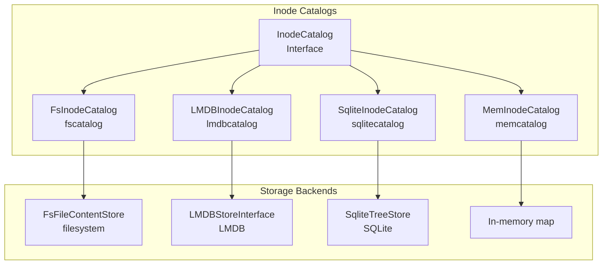
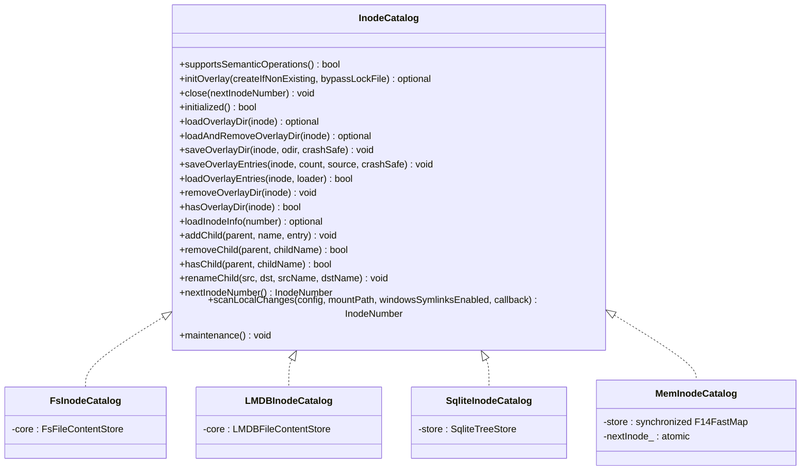
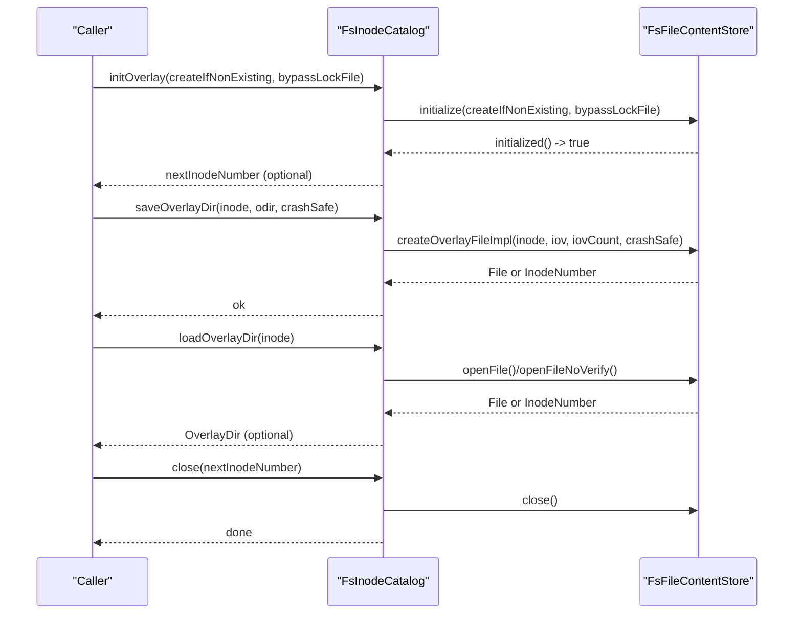
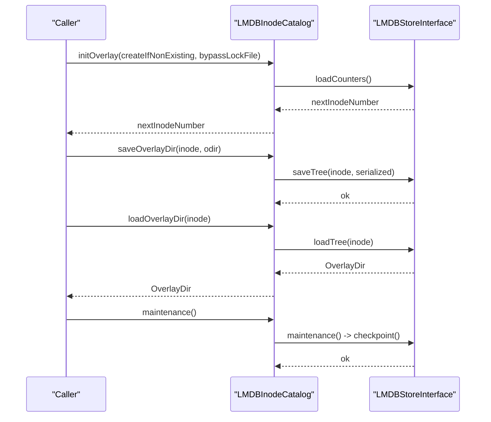
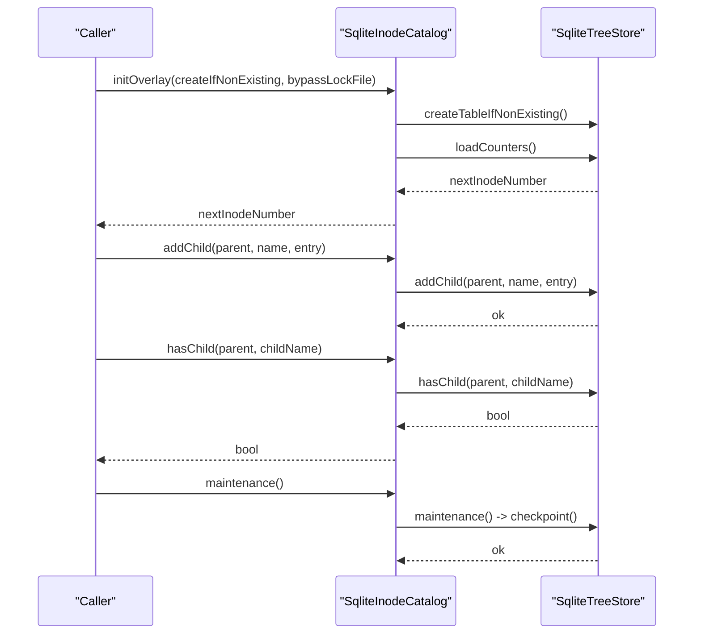
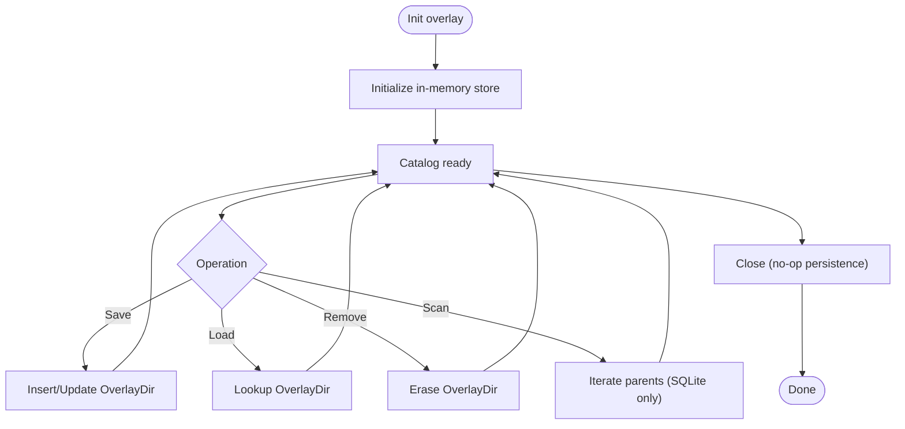
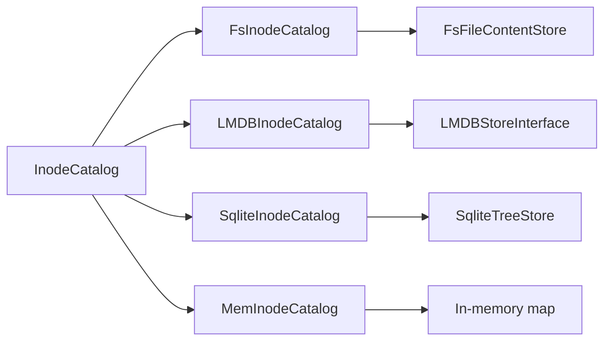

# Inode Catalog Implementations

<cite>
**Referenced Files in This Document**
- [InodeCatalog.h](file://eden/fs/inodes/InodeCatalog.h)
- [FileContentStore.h](file://eden/fs/inodes/FileContentStore.h)
- [InodeNumber.h](file://eden/fs/inodes/InodeNumber.h)
- [FsInodeCatalog.h](file://eden/fs/inodes/fscatalog/FsInodeCatalog.h)
- [EphemeralFsInodeCatalog.h](file://eden/fs/inodes/fscatalog/EphemeralFsInodeCatalog.h)
- [LMDBInodeCatalog.h](file://eden/fs/inodes/lmdbcatalog/LMDBInodeCatalog.h)
- [LMDBStoreInterface.h](file://eden/fs/inodes/lmdbcatalog/LMDBStoreInterface.h)
- [SqliteInodeCatalog.h](file://eden/fs/inodes/sqlitecatalog/SqliteInodeCatalog.h)
- [SqliteTreeStore.h](file://eden/fs/inodes/sqlitecatalog/SqliteTreeStore.h)
- [MemInodeCatalog.h](file://eden/fs/inodes/memcatalog/MemInodeCatalog.h)
</cite>

## Table of Contents
1. [Introduction](#introduction)
2. [Project Structure](#project-structure)
3. [Core Components](#core-components)
4. [Architecture Overview](#architecture-overview)
5. [Detailed Component Analysis](#detailed-component-analysis)
6. [Dependency Analysis](#dependency-analysis)
7. [Performance Considerations](#performance-considerations)
8. [Troubleshooting Guide](#troubleshooting-guide)
9. [Conclusion](#conclusion)
10. [Appendices](#appendices)

## Introduction
This document explains the inode catalog implementations within the EdenFS inode management system. It focuses on the four main catalog types:
- fscatalog: filesystem-backed overlay storage with on-disk files and directory metadata
- lmdbcatalog: LMDB-backed catalog for high-performance key-value storage
- sqlitecatalog: SQLite-backed catalog optimized for tree semantics and relational queries
- memcatalog: in-memory catalog for ephemeral or testing scenarios

It documents the catalog interfaces, data structures, query optimization strategies, performance characteristics, thread safety, concurrent access patterns, maintenance operations, and practical guidance for catalog selection, migration, and troubleshooting.

## Project Structure
The inode catalogs are defined under the inodes subsystem. Each catalog type encapsulates:
- A catalog class implementing the InodeCatalog interface
- A content store or storage backend (filesystem, LMDB, SQLite, or in-memory)
- Optional specialized stores for blobs or trees

**Diagram sources**
- [InodeCatalog.h:56-240](file://eden/fs/inodes/InodeCatalog.h#L56-L240)
- [FsInodeCatalog.h:271-337](file://eden/fs/inodes/fscatalog/FsInodeCatalog.h#L271-L337)
- [LMDBInodeCatalog.h:33-90](file://eden/fs/inodes/lmdbcatalog/LMDBInodeCatalog.h#L33-L90)
- [SqliteInodeCatalog.h:31-118](file://eden/fs/inodes/sqlitecatalog/SqliteInodeCatalog.h#L31-L118)
- [MemInodeCatalog.h:27-109](file://eden/fs/inodes/memcatalog/MemInodeCatalog.h#L27-L109)

**Section sources**
- [InodeCatalog.h:56-240](file://eden/fs/inodes/InodeCatalog.h#L56-L240)
- [FsInodeCatalog.h:271-337](file://eden/fs/inodes/fscatalog/FsInodeCatalog.h#L271-L337)
- [LMDBInodeCatalog.h:33-90](file://eden/fs/inodes/lmdbcatalog/LMDBInodeCatalog.h#L33-L90)
- [SqliteInodeCatalog.h:31-118](file://eden/fs/inodes/sqlitecatalog/SqliteInodeCatalog.h#L31-L118)
- [MemInodeCatalog.h:27-109](file://eden/fs/inodes/memcatalog/MemInodeCatalog.h#L27-L109)

## Core Components
- InodeCatalog: Base interface defining overlay lifecycle, directory operations, semantic operations, scanning, and maintenance hooks.
- FileContentStore: Interface for managing materialized file data (filesystem-backed operations).
- InodeNumber: Strongly typed 64-bit inode identifier with safe accessors and hashing.

Key capabilities exposed by catalogs:
- Overlay initialization and shutdown
- Directory load/save/remove with optional crash-safe writes
- Semantic operations (addChild/removeChild/hasChild/renameChild)
- Next inode number allocation
- Scanning for local changes (primarily Windows)
- Maintenance routines (checkpointing, compaction)

**Section sources**
- [InodeCatalog.h:56-240](file://eden/fs/inodes/InodeCatalog.h#L56-L240)
- [FileContentStore.h:33-104](file://eden/fs/inodes/FileContentStore.h#L33-L104)
- [InodeNumber.h:22-129](file://eden/fs/inodes/InodeNumber.h#L22-L129)

## Architecture Overview
The catalog architecture separates concerns between:
- Catalog interface: defines the contract for inode relationship and overlay management
- Storage backends: encapsulate persistence and concurrency
- Content stores: handle materialized file data (filesystem for fscatalog, LMDB/SQLite for structured stores)

**Diagram sources**
- [InodeCatalog.h:56-240](file://eden/fs/inodes/InodeCatalog.h#L56-L240)
- [FsInodeCatalog.h:271-337](file://eden/fs/inodes/fscatalog/FsInodeCatalog.h#L271-L337)
- [LMDBInodeCatalog.h:33-90](file://eden/fs/inodes/lmdbcatalog/LMDBInodeCatalog.h#L33-L90)
- [SqliteInodeCatalog.h:31-118](file://eden/fs/inodes/sqlitecatalog/SqliteInodeCatalog.h#L31-L118)
- [MemInodeCatalog.h:27-109](file://eden/fs/inodes/memcatalog/MemInodeCatalog.h#L27-L109)

## Detailed Component Analysis

### fscatalog: Filesystem-Based Catalog
- Purpose: Store overlay directory metadata and materialized file data on the local filesystem.
- Storage mechanism:
  - Directory metadata stored as serialized overlay entries
  - Files stored under sharded subdirectories for scalability
  - Crash-safe writes via temporary files and atomic renames
  - Lock file prevents concurrent access
- Data structures:
  - OverlayDir for directory entries
  - FsFileContentStore manages file-backed content and overlay directory lifecycle
- Thread safety:
  - Exclusive overlay lock via an info file descriptor
  - No concurrent access allowed while overlay is initialized
- Performance characteristics:
  - Good for large directory trees and high throughput reads/writes
  - Sharding reduces filesystem contention
  - Crash-safe writes add overhead; disable for performance-sensitive scenarios
- Use cases:
  - General-purpose overlay with persistent storage
  - Environments where filesystem metadata is preferred

**Diagram sources**
- [FsInodeCatalog.h:289-337](file://eden/fs/inodes/fscatalog/FsInodeCatalog.h#L289-L337)
- [FsInodeCatalog.h:37-264](file://eden/fs/inodes/fscatalog/FsInodeCatalog.h#L37-L264)

**Section sources**
- [FsInodeCatalog.h:271-337](file://eden/fs/inodes/fscatalog/FsInodeCatalog.h#L271-L337)
- [FsInodeCatalog.h:37-264](file://eden/fs/inodes/fscatalog/FsInodeCatalog.h#L37-L264)

### lmdbcatalog: LMDB Database Catalog
- Purpose: High-performance key-value storage for overlay metadata and file content.
- Storage mechanism:
  - LMDB key-value store for trees and blobs
  - Maintenance checkpointing for durability and compaction
- Data structures:
  - LMDBStoreInterface encapsulates LMDB operations and counter management
  - OverlayDir and blob operations mapped to LMDB keys
- Thread safety:
  - LMDB transactions and environment provide concurrency control
  - Catalog disables copy/move operators to prevent misuse
- Performance characteristics:
  - Extremely low latency for metadata operations
  - Efficient for frequent updates and scans
- Use cases:
  - High-frequency metadata updates
  - Environments requiring ACID-like semantics with high throughput

**Diagram sources**
- [LMDBInodeCatalog.h:53-86](file://eden/fs/inodes/lmdbcatalog/LMDBInodeCatalog.h#L53-L86)
- [LMDBStoreInterface.h:77-108](file://eden/fs/inodes/lmdbcatalog/LMDBStoreInterface.h#L77-L108)

**Section sources**
- [LMDBInodeCatalog.h:33-90](file://eden/fs/inodes/lmdbcatalog/LMDBInodeCatalog.h#L33-L90)
- [LMDBStoreInterface.h:47-212](file://eden/fs/inodes/lmdbcatalog/LMDBStoreInterface.h#L47-L212)

### sqlitecatalog: SQLite Database Catalog
- Purpose: Relational storage optimized for tree semantics and efficient queries.
- Storage mechanism:
  - SqliteTreeStore manages tables, indexes, and transactional operations
  - Supports synchronous modes for durability vs. performance trade-offs
  - Maintenance checkpointing for database hygiene
- Data structures:
  - OverlayDir persisted as rows with parent-child relationships
  - Statement caching for repeated operations
- Thread safety:
  - SQLite serialization and WAL modes govern concurrency
  - Catalog exposes semantic operations for efficient tree manipulation
- Performance characteristics:
  - Excellent for complex queries and cross-references
  - Good balance of durability and speed
- Use cases:
  - Scenarios needing robust tree operations and query flexibility
  - Overlay checker and diagnostics requiring full inode enumeration

**Diagram sources**
- [SqliteInodeCatalog.h:56-112](file://eden/fs/inodes/sqlitecatalog/SqliteInodeCatalog.h#L56-L112)
- [SqliteTreeStore.h:76-149](file://eden/fs/inodes/sqlitecatalog/SqliteTreeStore.h#L76-L149)

**Section sources**
- [SqliteInodeCatalog.h:31-118](file://eden/fs/inodes/sqlitecatalog/SqliteInodeCatalog.h#L31-L118)
- [SqliteTreeStore.h:48-176](file://eden/fs/inodes/sqlitecatalog/SqliteTreeStore.h#L48-L176)

### memcatalog: In-Memory Catalog
- Purpose: Fast, ephemeral storage for testing or transient overlays.
- Storage mechanism:
  - In-memory map guarded by a synchronized container
  - Atomic next inode allocator
- Data structures:
  - F14FastMap keyed by InodeNumber
- Thread safety:
  - folly::Synchronized ensures safe concurrent access
- Performance characteristics:
  - Lowest latency for read/write operations
  - No persistence across restarts
- Use cases:
  - Unit/integration tests
  - Temporary overlays or ephemeral environments

**Diagram sources**
- [MemInodeCatalog.h:27-109](file://eden/fs/inodes/memcatalog/MemInodeCatalog.h#L27-L109)

**Section sources**
- [MemInodeCatalog.h:27-109](file://eden/fs/inodes/memcatalog/MemInodeCatalog.h#L27-L109)

### EphemeralFsInodeCatalog: Hybrid In-Memory Directories with File Content Store
- Purpose: Combines in-memory directory tracking with filesystem-backed file content.
- Behavior:
  - Directories are ephemeral (lost on shutdown)
  - Files are still persisted via FsFileContentStore
- Use cases:
  - Testing scenarios where directory state should not persist
  - Prototyping or short-lived workloads

**Section sources**
- [EphemeralFsInodeCatalog.h:41-110](file://eden/fs/inodes/fscatalog/EphemeralFsInodeCatalog.h#L41-L110)

## Dependency Analysis
- InodeCatalog is the central abstraction; all catalogs implement it.
- fscatalog depends on FsFileContentStore for file-backed content and overlay directory management.
- lmdbcatalog depends on LMDBStoreInterface for key-value operations.
- sqlitecatalog depends on SqliteTreeStore for relational tree operations.
- memcatalog depends on synchronized in-memory containers.

**Diagram sources**
- [InodeCatalog.h:56-240](file://eden/fs/inodes/InodeCatalog.h#L56-L240)
- [FsInodeCatalog.h:271-337](file://eden/fs/inodes/fscatalog/FsInodeCatalog.h#L271-L337)
- [LMDBInodeCatalog.h:33-90](file://eden/fs/inodes/lmdbcatalog/LMDBInodeCatalog.h#L33-L90)
- [SqliteInodeCatalog.h:31-118](file://eden/fs/inodes/sqlitecatalog/SqliteInodeCatalog.h#L31-L118)
- [MemInodeCatalog.h:27-109](file://eden/fs/inodes/memcatalog/MemInodeCatalog.h#L27-L109)

**Section sources**
- [InodeCatalog.h:56-240](file://eden/fs/inodes/InodeCatalog.h#L56-L240)
- [FsInodeCatalog.h:271-337](file://eden/fs/inodes/fscatalog/FsInodeCatalog.h#L271-L337)
- [LMDBInodeCatalog.h:33-90](file://eden/fs/inodes/lmdbcatalog/LMDBInodeCatalog.h#L33-L90)
- [SqliteInodeCatalog.h:31-118](file://eden/fs/inodes/sqlitecatalog/SqliteInodeCatalog.h#L31-L118)
- [MemInodeCatalog.h:27-109](file://eden/fs/inodes/memcatalog/MemInodeCatalog.h#L27-L109)

## Performance Considerations
- fscatalog
  - Sharding reduces filesystem contention; choose appropriate mount and directory layout
  - Crash-safe writes add I/O overhead; consider disabling for performance-sensitive tasks
  - Large directory trees benefit from preallocation and batched saves
- lmdbcatalog
  - Low-latency KV operations; ensure adequate map size and page configuration
  - Regular maintenance checkpoints improve long-term stability
- sqlitecatalog
  - Choose synchronous mode based on durability needs
  - Indexes and prepared statements reduce query latency
  - Batch operations minimize transaction overhead
- memcatalog
  - Best-case performance; avoid for production persistence needs
  - Use for benchmarking and testing only

[No sources needed since this section provides general guidance]

## Troubleshooting Guide
Common issues and remedies:
- Overlay lock conflicts (fscatalog)
  - Symptoms: Initialization failures indicating another process holds the overlay
  - Resolution: Ensure no other EdenFS instance is running; check lock file presence and permissions
- Non-empty directory operations
  - Symptoms: Exceptions when attempting to remove non-empty directories
  - Resolution: Remove children first or use appropriate APIs that support cascading removal
- Inconsistent next inode number
  - Symptoms: Unexpected inode allocation or gaps
  - Resolution: Run overlay repair or fsck to reconcile counters
- Database corruption (lmdbcatalog/sqlitecatalog)
  - Symptoms: Transaction failures or inability to checkpoint
  - Resolution: Perform maintenance (checkpoint/compact), rebuild indices if needed, and restore from backups if available
- Memory leaks or excessive memory usage (memcatalog)
  - Symptoms: Growing memory footprint over time
  - Resolution: Limit dataset size or switch to persistent catalogs

**Section sources**
- [LMDBStoreInterface.h:28-42](file://eden/fs/inodes/lmdbcatalog/LMDBStoreInterface.h#L28-L42)
- [SqliteTreeStore.h:29-43](file://eden/fs/inodes/sqlitecatalog/SqliteTreeStore.h#L29-L43)
- [FsInodeCatalog.h:289-337](file://eden/fs/inodes/fscatalog/FsInodeCatalog.h#L289-L337)

## Conclusion
The four catalog types offer distinct trade-offs:
- fscatalog for broad compatibility and filesystem-native behavior
- lmdbcatalog for high-throughput metadata operations
- sqlitecatalog for relational semantics and query flexibility
- memcatalog for speed and ephemeral use cases

Selecting the right catalog depends on durability, concurrency, query needs, and operational constraints. Migration between catalogs typically involves exporting overlay data and reinitializing the target catalog, with careful attention to inode numbering and content persistence.

[No sources needed since this section summarizes without analyzing specific files]

## Appendices

### Catalog Selection Criteria
- Durability and persistence: sqlitecatalog or fscatalog
- High metadata throughput: lmdbcatalog
- Speed and simplicity: memcatalog (testing only)
- Mixed semantics: EphemeralFsInodeCatalog for directories plus filesystem-backed files

### Migration Between Catalog Types
- Export overlay data from source catalog
- Initialize target catalog with compatible configuration
- Import overlay entries and reconcile inode numbers
- Validate with fsck and monitor performance

### Thread Safety and Concurrency
- fscatalog: exclusive overlay lock; avoid concurrent access
- lmdbcatalog/sqlitecatalog: rely on backend transactional guarantees
- memcatalog: synchronized container; suitable for controlled concurrency

[No sources needed since this section provides general guidance]