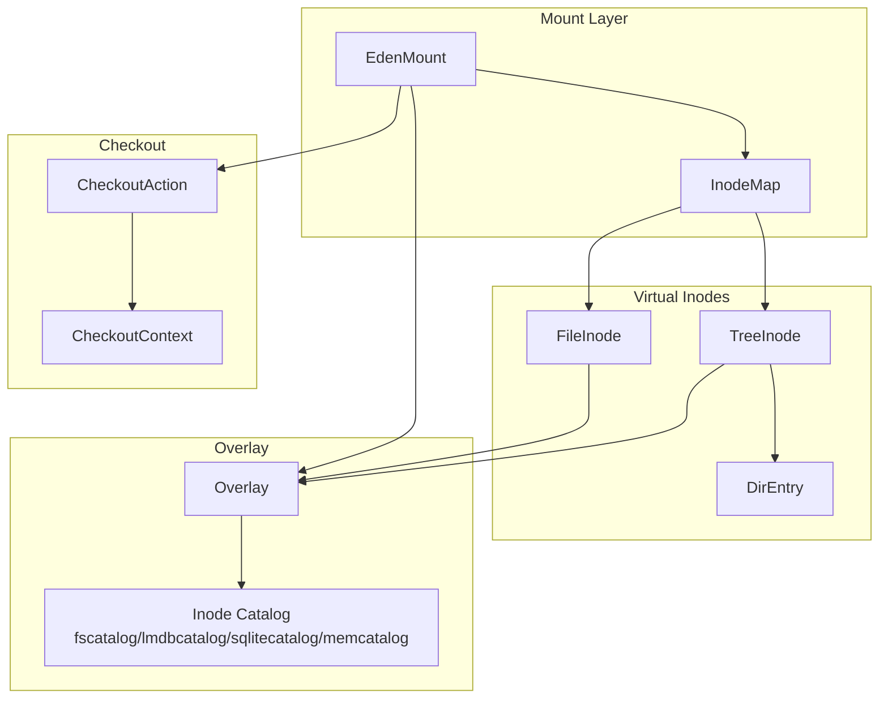
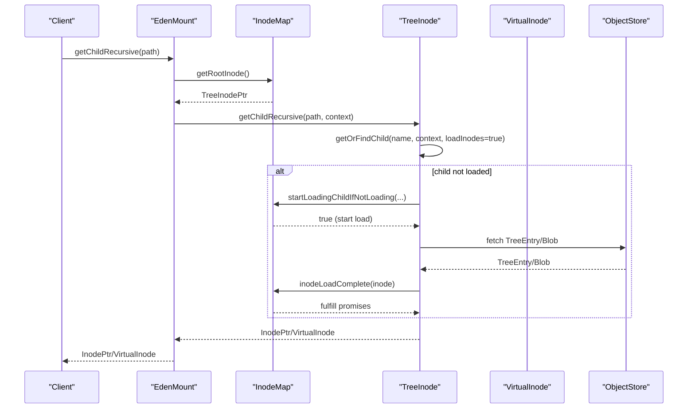
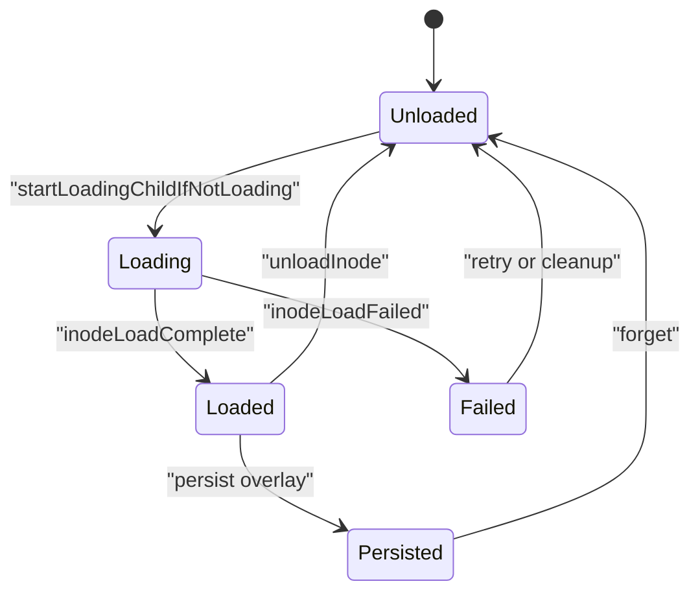
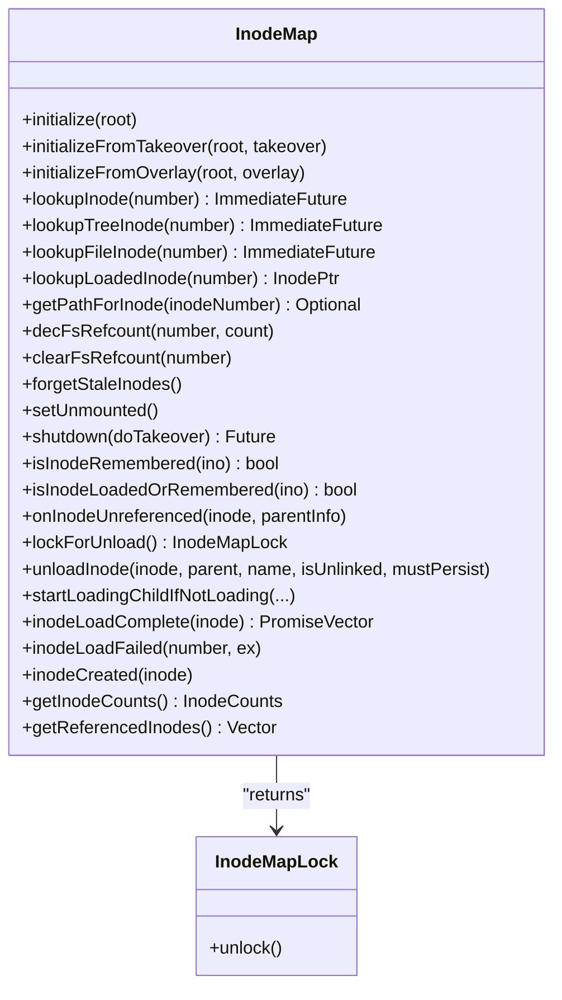
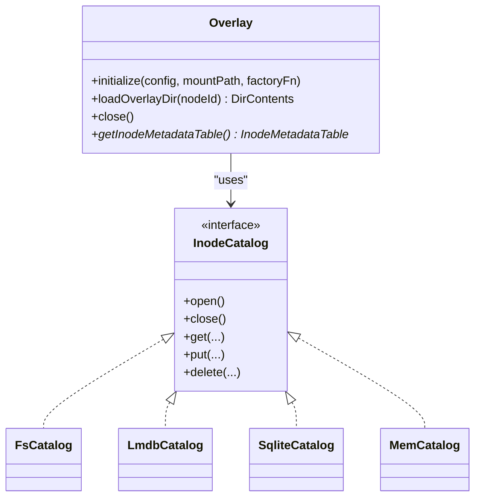
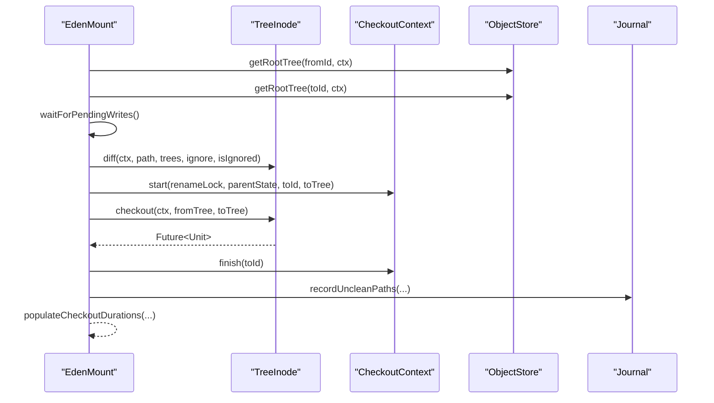
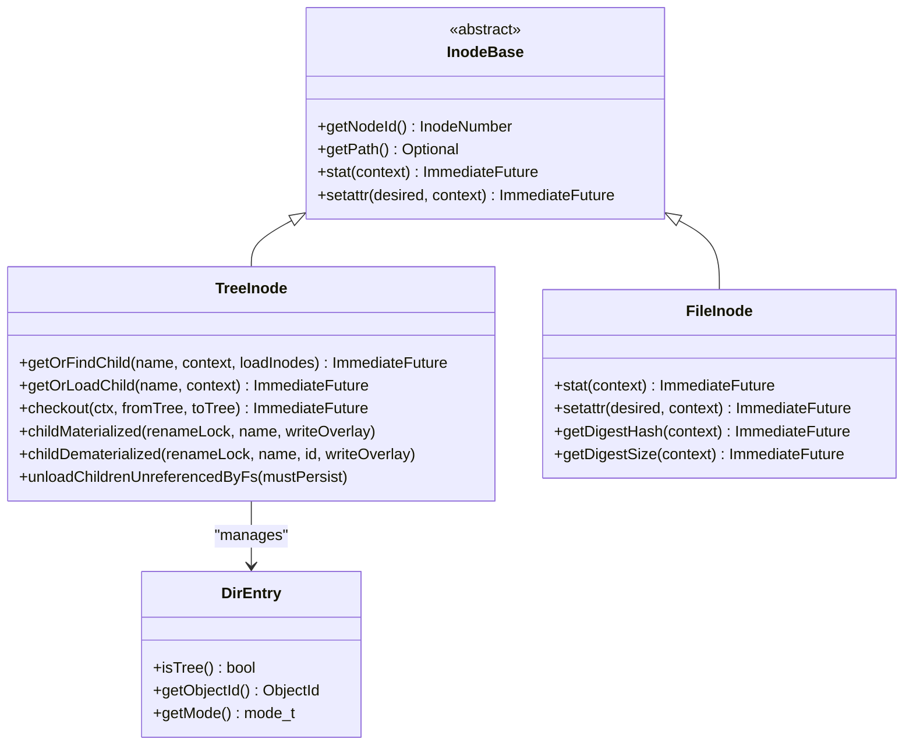
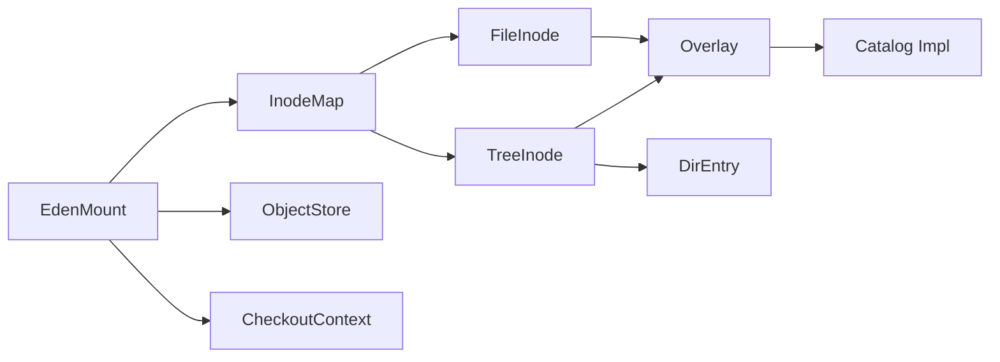

# Inode Management System

<cite>
**Referenced Files in This Document**
- [EdenMount.cpp](file://eden/fs/inodes/EdenMount.cpp)
- [InodeMap.h](file://eden/fs/inodes/InodeMap.h)
- [TreeInode.h](file://eden/fs/inodes/TreeInode.h)
- [Overlay.cpp](file://eden/fs/inodes/Overlay.cpp)
- [Overlay.h](file://eden/fs/inodes/Overlay.h)
- [FileInode.cpp](file://eden/fs/inodes/FileInode.cpp)
- [FileInode.h](file://eden/fs/inodes/FileInode.h)
- [DirEntry.cpp](file://eden/fs/inodes/DirEntry.cpp)
- [DirEntry.h](file://eden/fs/inodes/DirEntry.h)
- [CheckoutAction.cpp](file://eden/fs/inodes/CheckoutAction.cpp)
- [CheckoutAction.h](file://eden/fs/inodes/CheckoutAction.h)
- [CheckoutContext.cpp](file://eden/fs/inodes/CheckoutContext.cpp)
- [CheckoutContext.h](file://eden/fs/inodes/CheckoutContext.h)
- [EdenDispatcherFactory.cpp](file://eden/fs/inodes/EdenDispatcherFactory.cpp)
- [EdenDispatcherFactory.h](file://eden/fs/inodes/EdenDispatcherFactory.h)
- [InodeError.h](file://eden/fs/inodes/InodeError.h)
- [InodeTable.h](file://eden/fs/inodes/InodeTable.h)
- [InodeTable.cpp](file://eden/fs/inodes/InodeTable.cpp)
- [TreePrefetchLease.h](file://eden/fs/inodes/TreePrefetchLease.h)
- [TreePrefetchLease.cpp](file://eden/fs/inodes/TreePrefetchLease.cpp)
- [inode_tree.svg](file://eden/fs/docs/img/inode_tree.svg)
- [inode_contents.svg](file://eden/fs/docs/img/inode_contents.svg)
- [materialized_inode.svg](file://eden/fs/docs/img/materialized_inode.svg)
- [non_materialized_inode.svg](file://eden/fs/docs/img/non_materialized_inode.svg)
- [tree_inode_post_materialization.svg](file://eden/fs/docs/img/tree_inode_post_materialization.svg)
- [tree_inode_pre_materialization.svg](file://eden/fs/docs/img/tree_inode_pre_materialization.svg)
</cite>

## Table of Contents
1. [Introduction](#introduction)
2. [Project Structure](#project-structure)
3. [Core Components](#core-components)
4. [Architecture Overview](#architecture-overview)
5. [Detailed Component Analysis](#detailed-component-analysis)
6. [Dependency Analysis](#dependency-analysis)
7. [Performance Considerations](#performance-considerations)
8. [Troubleshooting Guide](#troubleshooting-guide)
9. [Conclusion](#conclusion)

## Introduction
This document explains the inode management system within EdenFS, focusing on the virtual inode architecture that enables lazy loading of repository contents. It covers the inode lifecycle from creation to destruction, including loading, materialization, and unloading processes. It documents the inode catalog implementations (fscatalog, lmdbcatalog, sqlitecatalog, memcatalog) and their performance characteristics, along with inode map management for thread-safe concurrent operations. Practical examples, optimization techniques, and cross-platform behavior differences are included.

## Project Structure
The inode management system centers around several key modules:
- EdenMount: orchestrates mount initialization, overlay setup, and checkout operations
- InodeMap: maintains thread-safe lookup and lifecycle of inodes
- TreeInode and FileInode: represent directory and file virtual inodes
- Overlay: provides the persistent storage layer for inode metadata and materialized content
- Catalog implementations: back the overlay with different storage engines

**Diagram sources**
- [EdenMount.cpp:254-307](file://eden/fs/inodes/EdenMount.cpp#L254-L307)
- [InodeMap.h:102-129](file://eden/fs/inodes/InodeMap.h#L102-L129)
- [TreeInode.h:78-118](file://eden/fs/inodes/TreeInode.h#L78-L118)
- [Overlay.cpp:1-50](file://eden/fs/inodes/Overlay.cpp#L1-L50)
- [Overlay.h:1-50](file://eden/fs/inodes/Overlay.h#L1-L50)

**Section sources**
- [EdenMount.cpp:254-307](file://eden/fs/inodes/EdenMount.cpp#L254-L307)
- [InodeMap.h:102-129](file://eden/fs/inodes/InodeMap.h#L102-L129)
- [TreeInode.h:78-118](file://eden/fs/inodes/TreeInode.h#L78-L118)
- [Overlay.cpp:1-50](file://eden/fs/inodes/Overlay.cpp#L1-L50)
- [Overlay.h:1-50](file://eden/fs/inodes/Overlay.h#L1-L50)

## Core Components
- EdenMount: constructs the overlay, initializes the inode map, manages checkout and diff operations, and coordinates filesystem channels (FUSE/NFS/ProjectedFS).
- InodeMap: thread-safe registry for loaded/unloaded inodes, tracks filesystem reference counts, and coordinates inode lifecycle transitions.
- TreeInode: directory virtual inode with lazy loading, materialization, and checkout semantics.
- FileInode: file virtual inode with lazy loading and materialization.
- Overlay: persistent storage for inode metadata and materialized content, with configurable catalog backends.
- Catalog implementations: fscatalog (filesystem-backed), lmdbcatalog (LMDB), sqlitecatalog (SQLite), memcatalog (in-memory).

**Section sources**
- [EdenMount.cpp:360-452](file://eden/fs/inodes/EdenMount.cpp#L360-L452)
- [InodeMap.h:102-281](file://eden/fs/inodes/InodeMap.h#L102-L281)
- [TreeInode.h:78-118](file://eden/fs/inodes/TreeInode.h#L78-L118)
- [Overlay.cpp:1-50](file://eden/fs/inodes/Overlay.cpp#L1-L50)

## Architecture Overview
The virtual inode architecture separates identity (inode numbers) from content (lazy-loaded Tree/File inodes). InodeMap assigns and tracks inode numbers, while TreeInode/FileInode lazily load from source control or overlay. Overlay persists materialized state and metadata, with configurable catalog backends.

**Diagram sources**
- [EdenMount.cpp:1369-1393](file://eden/fs/inodes/EdenMount.cpp#L1369-L1393)
- [TreeInode.h:143-192](file://eden/fs/inodes/TreeInode.h#L143-L192)
- [InodeMap.h:379-409](file://eden/fs/inodes/InodeMap.h#L379-L409)

## Detailed Component Analysis

### Virtual Inode Lifecycle
- Creation: Inode numbers are allocated on first lookup or child creation; TreeInode/FileInode objects are created when content is needed.
- Loading: InodeMap coordinates loading via startLoadingChildIfNotLoading; ObjectStore resolves TreeEntry/Blob; InodeMap fulfills promises on completion.
- Materialization: TreeInode ensures directories are materialized when children are created or when checkout requires it.
- Unloading: InodeMap decides based on reference counts and activity; unloaded inodes are tracked for future access.

**Diagram sources**
- [InodeMap.h:379-409](file://eden/fs/inodes/InodeMap.h#L379-L409)
- [TreeInode.h:419-442](file://eden/fs/inodes/TreeInode.h#L419-L442)

**Section sources**
- [InodeMap.h:379-409](file://eden/fs/inodes/InodeMap.h#L379-L409)
- [TreeInode.h:419-442](file://eden/fs/inodes/TreeInode.h#L419-L442)

### InodeMap Thread-Safe Access Patterns
- Synchronized data structures: loaded/unloaded inode maps guarded by a single mutex to prevent deadlock with inode locks.
- Reference counting: filesystem reference counts are tracked separately to avoid loading just to decrement counts.
- Locking protocol: InodeMapLock allows TreeInode to unload multiple children without repeated lock acquisitions.

**Diagram sources**
- [InodeMap.h:102-806](file://eden/fs/inodes/InodeMap.h#L102-L806)

**Section sources**
- [InodeMap.h:102-806](file://eden/fs/inodes/InodeMap.h#L102-L806)

### Overlay and Catalog Implementations
Overlay persists inode metadata and materialized content. Catalog backends provide storage:
- fscatalog: filesystem-backed catalog
- lmdbcatalog: LMDB-backed catalog
- sqlitecatalog: SQLite-backed catalog
- memcatalog: in-memory catalog

**Diagram sources**
- [Overlay.h:1-50](file://eden/fs/inodes/Overlay.h#L1-L50)
- [Overlay.cpp:1-50](file://eden/fs/inodes/Overlay.cpp#L1-L50)

**Section sources**
- [Overlay.h:1-50](file://eden/fs/inodes/Overlay.h#L1-L50)
- [Overlay.cpp:1-50](file://eden/fs/inodes/Overlay.cpp#L1-L50)

### Checkout and Diff Operations
Checkout aligns working copy with a source control commit, managing conflicts and journal updates. Diff computes differences between working directory and source control trees.

**Diagram sources**
- [EdenMount.cpp:1525-1955](file://eden/fs/inodes/EdenMount.cpp#L1525-L1955)
- [TreeInode.h:370-400](file://eden/fs/inodes/TreeInode.h#L370-L400)

**Section sources**
- [EdenMount.cpp:1525-1955](file://eden/fs/inodes/EdenMount.cpp#L1525-L1955)
- [TreeInode.h:370-400](file://eden/fs/inodes/TreeInode.h#L370-L400)

### Inode Types and Content Models
- TreeInode: directory with lazy-loaded entries; supports readdir, rename, unlink, mkdir, symlink, and checkout.
- FileInode: file with lazy loading and materialization; supports setattr, symlink handling, and digest retrieval.
- DirEntry: lightweight representation of directory entries for virtual inode resolution.

**Diagram sources**
- [TreeInode.h:78-118](file://eden/fs/inodes/TreeInode.h#L78-L118)
- [FileInode.h:1-80](file://eden/fs/inodes/FileInode.h#L1-L80)
- [DirEntry.h:1-80](file://eden/fs/inodes/DirEntry.h#L1-L80)

**Section sources**
- [TreeInode.h:78-118](file://eden/fs/inodes/TreeInode.h#L78-L118)
- [FileInode.h:1-80](file://eden/fs/inodes/FileInode.h#L1-L80)
- [DirEntry.h:1-80](file://eden/fs/inodes/DirEntry.h#L1-L80)

### Practical Examples
- Lazy loading a child inode: use TreeInode.getChildRecursive to resolve path segments, triggering InodeMap loading when needed.
- Materializing a directory: TreeInode.ensureMaterialized ensures overlay entries exist for newly created children.
- Performing a checkout: EdenMount.checkout computes diffs, acquires rename locks, and updates inodes atomically.

**Section sources**
- [EdenMount.cpp:1369-1393](file://eden/fs/inodes/EdenMount.cpp#L1369-L1393)
- [TreeInode.h:566-569](file://eden/fs/inodes/TreeInode.h#L566-L569)
- [EdenMount.cpp:1525-1955](file://eden/fs/inodes/EdenMount.cpp#L1525-L1955)

## Dependency Analysis
The inode subsystem exhibits clear layering:
- EdenMount depends on InodeMap, Overlay, ObjectStore, and CheckoutContext
- InodeMap depends on TreeInode/FileInode and Overlay
- TreeInode/FileInode depend on Overlay and ObjectStore
- Overlay depends on catalog implementations

**Diagram sources**
- [EdenMount.cpp:254-307](file://eden/fs/inodes/EdenMount.cpp#L254-L307)
- [InodeMap.h:102-129](file://eden/fs/inodes/InodeMap.h#L102-L129)
- [Overlay.cpp:1-50](file://eden/fs/inodes/Overlay.cpp#L1-L50)

**Section sources**
- [EdenMount.cpp:254-307](file://eden/fs/inodes/EdenMount.cpp#L254-L307)
- [InodeMap.h:102-129](file://eden/fs/inodes/InodeMap.h#L102-L129)
- [Overlay.cpp:1-50](file://eden/fs/inodes/Overlay.cpp#L1-L50)

## Performance Considerations
- Lazy loading minimizes memory footprint by deferring inode creation until access.
- Periodic unloading reduces memory pressure; TreeInode.unloadChildrenUnreferencedByFs selectively unloads unreferenced subtrees.
- Catalog choice impacts latency and throughput; SQLite offers durability, LMDB offers speed, memcatalog offers benchmarking.
- Checkout optimizes by unloading unreferenced inodes before applying changes.

**Section sources**
- [TreeInode.h:478-500](file://eden/fs/inodes/TreeInode.h#L478-L500)
- [EdenMount.cpp:1692-1721](file://eden/fs/inodes/EdenMount.cpp#L1692-L1721)

## Troubleshooting Guide
Common issues and resolutions:
- Checkout in progress: EdenMount.checkout prevents overlapping operations; wait or resume as advised.
- Checkout conflicts: Review reported conflicts and use sl go --clean or sl go --merge as appropriate.
- Stale inodes: Use EdenMount.forgetStaleInodes to evict inactive entries.
- Overlay corruption: Investigate catalog backend and overlay directory permissions; rebuild overlay if necessary.

**Section sources**
- [EdenMount.cpp:1525-1562](file://eden/fs/inodes/EdenMount.cpp#L1525-L1562)
- [EdenMount.cpp:1958-1960](file://eden/fs/inodes/EdenMount.cpp#L1958-L1960)

## Conclusion
EdenFS inode management leverages a robust virtual inode architecture with lazy loading, overlay persistence, and thread-safe lifecycle management. InodeMap coordinates identity and content, while TreeInode and FileInode encapsulate directory and file semantics. Overlay and configurable catalogs provide flexible storage backends. Checkout and diff operations are carefully orchestrated to maintain consistency and performance across platforms.