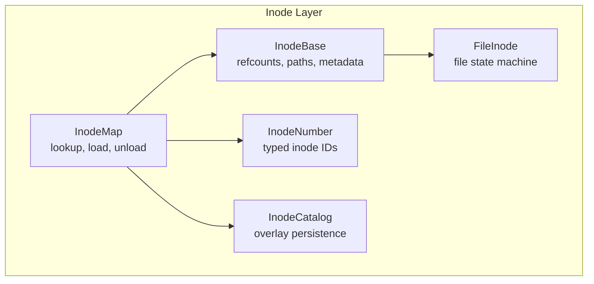
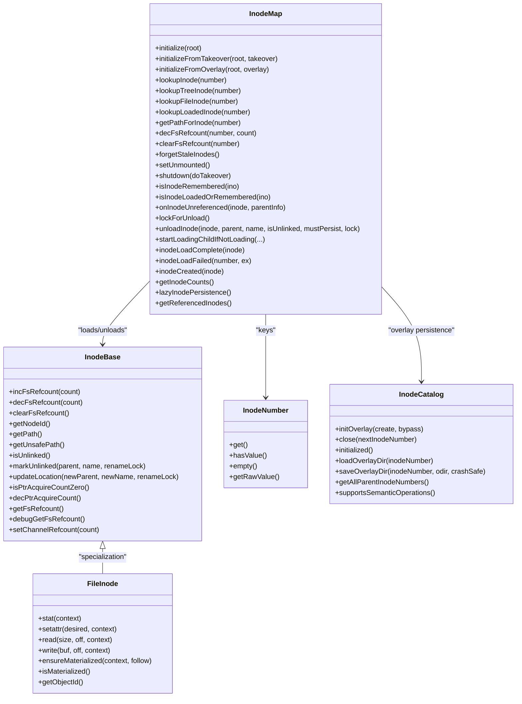
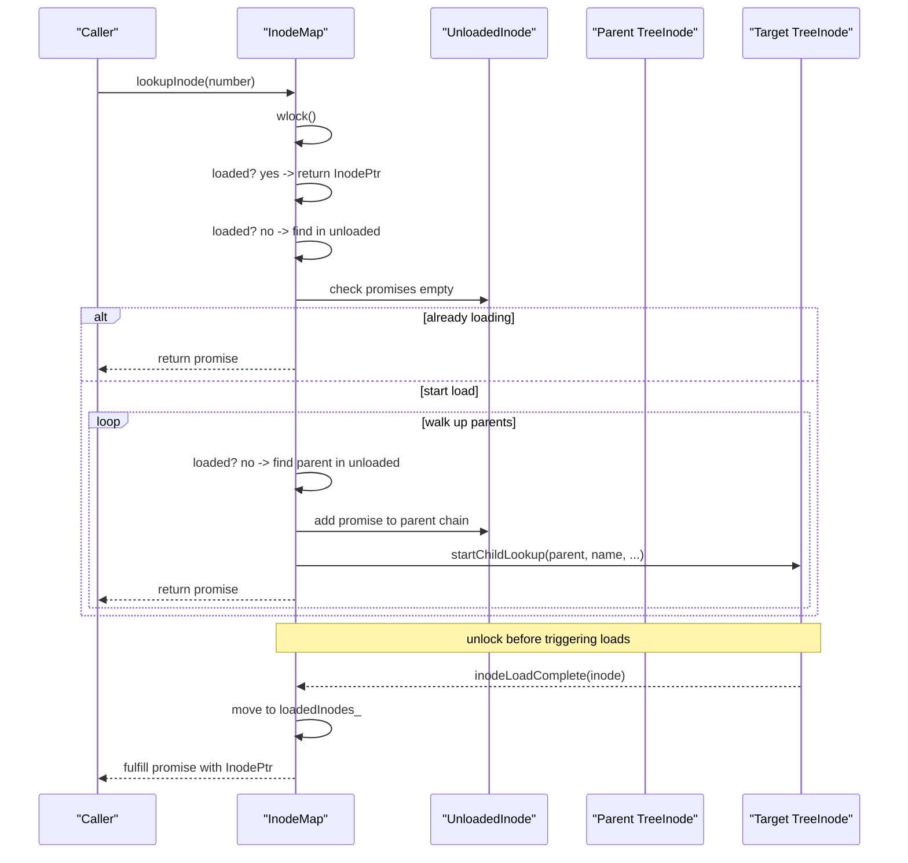
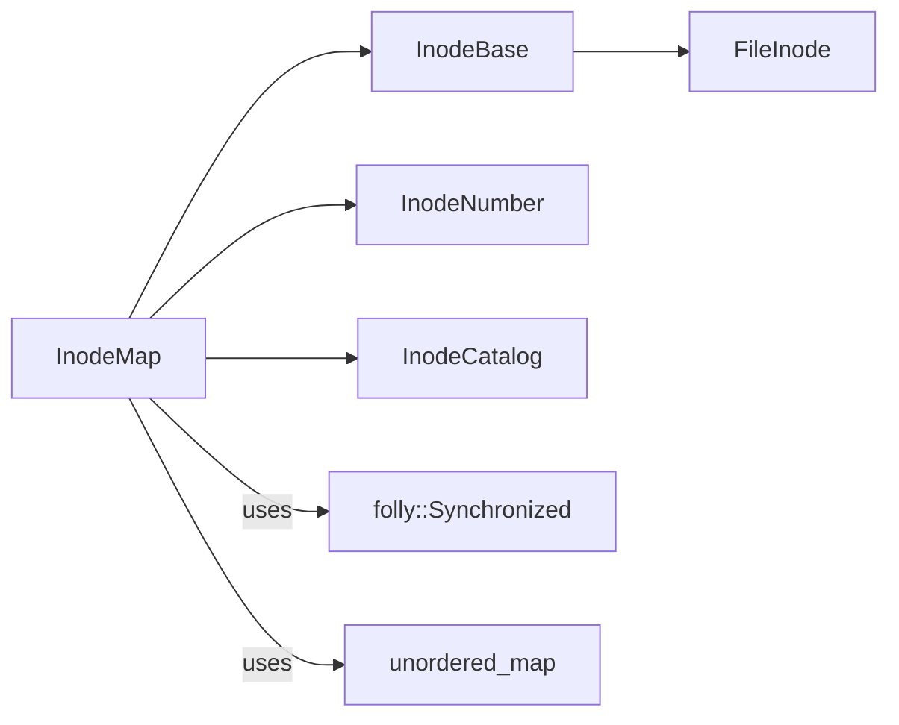

# Inode Map Management

<cite>
**Referenced Files in This Document**
- [InodeMap.h](file://eden/fs/inodes/InodeMap.h)
- [InodeMap.cpp](file://eden/fs/inodes/InodeMap.cpp)
- [InodeBase.h](file://eden/fs/inodes/InodeBase.h)
- [FileInode.h](file://eden/fs/inodes/FileInode.h)
- [InodeNumber.h](file://eden/fs/inodes/InodeNumber.h)
- [InodeCatalog.h](file://eden/fs/inodes/InodeCatalog.h)
</cite>

## Table of Contents
1. [Introduction](#introduction)
2. [Project Structure](#project-structure)
3. [Core Components](#core-components)
4. [Architecture Overview](#architecture-overview)
5. [Detailed Component Analysis](#detailed-component-analysis)
6. [Dependency Analysis](#dependency-analysis)
7. [Performance Considerations](#performance-considerations)
8. [Troubleshooting Guide](#troubleshooting-guide)
9. [Conclusion](#conclusion)

## Introduction
This document explains inode map management in EdenFS, focusing on how inodes are identified, stored, and accessed. It covers the inode table implementation, inode numbering schemes, lookup mechanisms, thread-safety, concurrency, and memory layout optimizations. Practical examples illustrate typical operations, and guidance is provided for performance tuning, resizing, garbage collection, and troubleshooting.

## Project Structure
EdenFS organizes inode-related functionality under the inodes subsystem. The inode map resides in the inodes module and coordinates with inode base classes, file inodes, and inode catalogs for overlay-backed persistence.

**Diagram sources**
- [InodeMap.h:102-442](file://eden/fs/inodes/InodeMap.h#L102-L442)
- [InodeBase.h:43-150](file://eden/fs/inodes/InodeBase.h#L43-L150)
- [FileInode.h:197-225](file://eden/fs/inodes/FileInode.h#L197-L225)
- [InodeNumber.h:22-78](file://eden/fs/inodes/InodeNumber.h#L22-L78)
- [InodeCatalog.h:56-106](file://eden/fs/inodes/InodeCatalog.h#L56-L106)

**Section sources**
- [InodeMap.h:1-130](file://eden/fs/inodes/InodeMap.h#L1-L130)
- [InodeBase.h:1-120](file://eden/fs/inodes/InodeBase.h#L1-L120)
- [FileInode.h:1-120](file://eden/fs/inodes/FileInode.h#L1-L120)
- [InodeNumber.h:1-80](file://eden/fs/inodes/InodeNumber.h#L1-L80)
- [InodeCatalog.h:1-80](file://eden/fs/inodes/InodeCatalog.h#L1-L80)

## Core Components
- InodeMap: Central registry for loaded/unloaded inodes, manages lookups, loading, and unloading, and maintains FS reference counts.
- InodeBase: Base class for inode objects with reference counting, path computation, and FS reference semantics.
- FileInode: Specialization for file content, including materialization and blob loading states.
- InodeNumber: Strongly typed inode identifier wrapper with nonzero guarantees and hashing.
- InodeCatalog: Overlay interface for persisting directory entries and inode metadata.

Key responsibilities:
- InodeMap: Two-tier storage (loaded and unloaded), promise-based loading, periodic unloading, and takeover/shutdown serialization.
- InodeBase: Pointer and FS reference counting, path resolution, and unlink/update lifecycle.
- FileInode: State machine for non-materialized/loading/materialized, caching, and overlay interactions.
- InodeNumber: Unique inode identity with equality/hash and formatting.
- InodeCatalog: Overlay directory persistence and semantic operations.

**Section sources**
- [InodeMap.h:102-442](file://eden/fs/inodes/InodeMap.h#L102-L442)
- [InodeBase.h:43-150](file://eden/fs/inodes/InodeBase.h#L43-L150)
- [FileInode.h:197-225](file://eden/fs/inodes/FileInode.h#L197-L225)
- [InodeNumber.h:22-78](file://eden/fs/inodes/InodeNumber.h#L22-L78)
- [InodeCatalog.h:56-106](file://eden/fs/inodes/InodeCatalog.h#L56-L106)

## Architecture Overview
The inode map is a thread-safe registry backed by synchronized members. It maintains:
- loadedInodes_: unordered_map from InodeNumber to loaded inode objects.
- unloadedInodes_: unordered_map from InodeNumber to metadata describing unloaded inodes (parent, name, mode, optional ObjectId, FS refcount, promises).
- Root TreeInode reference for path computation and initialization.
- Synchronization via folly::Synchronized<Members> to guard all mutations.

Thread-safety highlights:
- All public APIs acquire the data_ lock only briefly or defer heavy work outside the lock.
- Promise lists in UnloadedInode coordinate concurrent loaders without duplicating work.
- FS reference counts are updated atomically on InodeBase and via helpers on InodeMap for unloaded inodes.

**Diagram sources**
- [InodeMap.h:102-442](file://eden/fs/inodes/InodeMap.h#L102-L442)
- [InodeBase.h:43-150](file://eden/fs/inodes/InodeBase.h#L43-L150)
- [FileInode.h:197-225](file://eden/fs/inodes/FileInode.h#L197-L225)
- [InodeNumber.h:22-78](file://eden/fs/inodes/InodeNumber.h#L22-L78)
- [InodeCatalog.h:56-106](file://eden/fs/inodes/InodeCatalog.h#L56-L106)

## Detailed Component Analysis

### Inode Numbering and Identity
- InodeNumber wraps a nonzero 64-bit value and provides typed accessors and formatting.
- Equality and comparison operators are defined; hashing is provided for use in unordered containers.
- Root inode constant is defined for the mount’s root.

Operational notes:
- InodeNumber values are allocated by lookup operations and may be remembered even when inodes are not loaded.
- Zero is never a valid inode number; assertions and checks enforce this.

**Section sources**
- [InodeNumber.h:22-78](file://eden/fs/inodes/InodeNumber.h#L22-L78)
- [InodeNumber.h:110-129](file://eden/fs/inodes/InodeNumber.h#L110-L129)

### Inode Map Data Structures and Organization
- loadedInodes_: unordered_map<InodeNumber, LoadedInode> storing raw pointers to loaded inodes.
- unloadedInodes_: unordered_map<InodeNumber, UnloadedInode> storing metadata for inodes not currently loaded.
- Members include counters for Tree/File inodes, shutdown promise, and unmount flag.
- data_ is a folly::Synchronized<Members> protecting all mutation paths.

Hash-based indexing:
- Both maps use InodeNumber as key; std::hash<uint64_t> is specialized for InodeNumber.
- UnloadedInode metadata includes parent, name, mode, optional ObjectId, FS refcount, and pending promises.

Memory layout optimizations:
- Raw pointers in loadedInodes_ avoid extra indirection; InodeMap does not own loaded inodes.
- UnloadedInode stores minimal metadata to reconstruct inodes when needed.

**Section sources**
- [InodeMap.h:575-625](file://eden/fs/inodes/InodeMap.h#L575-L625)
- [InodeMap.h:449-540](file://eden/fs/inodes/InodeMap.h#L449-L540)

### Lookup Mechanisms and Promise Coordination
- lookupInode(number):
  - If loaded: return immediately with InodePtr.
  - If unloaded: collect ancestors walking upward until a loaded parent is found.
  - Register a promise in the UnloadedInode’s promise list; if not already loading, start the first ancestor load.
  - Release lock before triggering loads; publish trace events after unlocking.

- startLoadingChildIfNotLoading(...):
  - TreeInode API to avoid redundant loads; returns whether to proceed with load and attaches a promise.

- inodeLoadComplete(inode):
  - Moves inode from unloaded to loaded, fulfills all pending promises, publishes trace events, updates stats.

- inodeLoadFailed(number, ex):
  - Extracts pending promises and rejects them with the exception.

**Diagram sources**
- [InodeMap.cpp:277-426](file://eden/fs/inodes/InodeMap.cpp#L277-L426)
- [InodeMap.cpp:479-532](file://eden/fs/inodes/InodeMap.cpp#L479-L532)
- [InodeMap.cpp:428-448](file://eden/fs/inodes/InodeMap.cpp#L428-L448)
- [InodeMap.cpp:450-477](file://eden/fs/inodes/InodeMap.cpp#L450-L477)

**Section sources**
- [InodeMap.cpp:277-426](file://eden/fs/inodes/InodeMap.cpp#L277-L426)
- [InodeMap.cpp:479-532](file://eden/fs/inodes/InodeMap.cpp#L479-L532)
- [InodeMap.cpp:428-448](file://eden/fs/inodes/InodeMap.cpp#L428-L448)
- [InodeMap.cpp:450-477](file://eden/fs/inodes/InodeMap.cpp#L450-L477)

### Thread-Safe Access Patterns and Concurrency
- Lock discipline:
  - data_ lock must be held only briefly; heavy work (object creation, overlay I/O) occurs outside the lock.
  - InodeBase and TreeInode maintain their own internal locks; InodeMap avoids acquiring them to prevent deadlocks.
- Promise coordination:
  - UnloadedInode stores a vector of promises; multiple callers can await the same inode load.
- Reference counting:
  - FS reference counts are updated atomically on InodeBase; for unloaded inodes, InodeMap provides decFsRefcountHelper to avoid loading.

Concurrency safety:
- No nested acquisitions of InodeBase locks while holding InodeMap lock.
- Unload operations require both parent TreeInode contents lock and InodeMap lock.

**Section sources**
- [InodeMap.h:773-783](file://eden/fs/inodes/InodeMap.h#L773-L783)
- [InodeBase.h:99-136](file://eden/fs/inodes/InodeBase.h#L99-L136)
- [InodeMap.cpp:744-754](file://eden/fs/inodes/InodeMap.cpp#L744-L754)

### Initialization and Persistence
- initialize(root): Establishes root and inserts it into loadedInodes_.
- initializeFromTakeover(root, takeover): Restores unloaded inodes from serialized state.
- initializeFromOverlay(root, overlay): Scans overlay directories to populate unloaded inodes on persistent working copy platforms.

Lazy inode persistence:
- lazyInodePersistence() indicates whether directories are persisted to overlay on-demand during unloading.

**Section sources**
- [InodeMap.cpp:160-162](file://eden/fs/inodes/InodeMap.cpp#L160-L162)
- [InodeMap.cpp:181-224](file://eden/fs/inodes/InodeMap.cpp#L181-L224)
- [InodeMap.cpp:226-275](file://eden/fs/inodes/InodeMap.cpp#L226-L275)
- [InodeMap.h:432-434](file://eden/fs/inodes/InodeMap.h#L432-L434)

### Path Resolution and Memory Management
- getPathForInode(number): Computes path for loaded or unloaded inodes; for unloaded, recursively resolves parent names; returns std::nullopt if unlinked.
- unloadInode(...): Removes from loadedInodes_; if FS references remain, persists metadata to unloadedInodes_ and optionally persists directory entries to overlay.
- Periodic unloading counters track unlinked and linked inodes unloaded over time.

**Section sources**
- [InodeMap.h:224-298](file://eden/fs/inodes/InodeMap.h#L224-L298)
- [InodeMap.h:340-346](file://eden/fs/inodes/InodeMap.h#L340-L346)
- [InodeMap.h:785-800](file://eden/fs/inodes/InodeMap.h#L785-L800)

### File Inode State Machine
- FileInodeState: Tracks non-loading/loading/materialized states, cached sizes, and materialized hashes.
- FileInode: Provides stat, setattr, read/write, ensureMaterialized, and state transitions; integrates with overlay and blob cache.

**Section sources**
- [FileInode.h:57-195](file://eden/fs/inodes/FileInode.h#L57-L195)
- [FileInode.h:197-225](file://eden/fs/inodes/FileInode.h#L197-L225)

### Inode Catalog and Overlay Persistence
- InodeCatalog: Interface for overlay operations including directory load/save, existence checks, and semantic operations.
- Supports persistence of directory entries and inode metadata; used by InodeMap to persist directory placeholders during unloading when configured.

**Section sources**
- [InodeCatalog.h:56-106](file://eden/fs/inodes/InodeCatalog.h#L56-L106)
- [InodeCatalog.h:172-181](file://eden/fs/inodes/InodeCatalog.h#L172-L181)

## Dependency Analysis

**Diagram sources**
- [InodeMap.h:102-442](file://eden/fs/inodes/InodeMap.h#L102-L442)
- [InodeBase.h:43-150](file://eden/fs/inodes/InodeBase.h#L43-L150)
- [FileInode.h:197-225](file://eden/fs/inodes/FileInode.h#L197-L225)
- [InodeNumber.h:22-78](file://eden/fs/inodes/InodeNumber.h#L22-L78)
- [InodeCatalog.h:56-106](file://eden/fs/inodes/InodeCatalog.h#L56-L106)

**Section sources**
- [InodeMap.h:102-442](file://eden/fs/inodes/InodeMap.h#L102-L442)
- [InodeBase.h:43-150](file://eden/fs/inodes/InodeBase.h#L43-L150)
- [FileInode.h:197-225](file://eden/fs/inodes/FileInode.h#L197-L225)
- [InodeNumber.h:22-78](file://eden/fs/inodes/InodeNumber.h#L22-L78)
- [InodeCatalog.h:56-106](file://eden/fs/inodes/InodeCatalog.h#L56-L106)

## Performance Considerations
- Minimize lock contention:
  - Keep data_ lock scope minimal; release before triggering inode loads or fulfilling promises.
  - Use promise lists to batch fulfill multiple waiters efficiently.
- Optimize lookups:
  - Prefer keeping hot inodes loaded; leverage loadedInodes_ hit paths for fast lookups.
  - Use isInodeLoadedOrRemembered to short-circuit unnecessary work.
- Reduce overlay I/O:
  - Lazy inode persistence defers overlay writes until unloading; tune based on workload.
  - Batch directory saves via InodeCatalog saveOverlayEntries when possible.
- Memory footprint:
  - Periodic unloading reduces memory pressure; monitor periodic counters to assess effectiveness.
  - Avoid retaining unnecessary references; rely on FS refcounts to decide unload eligibility.

[No sources needed since this section provides general guidance]

## Troubleshooting Guide
Common issues and remedies:
- Unknown inode number:
  - lookupInode on unknown numbers logs errors and may throw; verify inode number validity and ensure proper initialization.
- Stale inode (NFS):
  - When configured, lookupInode may return ESTALE for missing inodes; handle gracefully and re-resolve paths.
- Load failures:
  - inodeLoadFailed publishes trace events and structured logs; inspect logs for root causes and retry strategies.
- Overly aggressive unloading:
  - Monitor periodic unloading counters and adjust policies; consider reducing periodic unloading frequency or increasing thresholds.
- Overlay inconsistencies:
  - Use InodeCatalog methods to validate and repair overlay directories; ensure crash-safe writes when applicable.

**Section sources**
- [InodeMap.cpp:296-313](file://eden/fs/inodes/InodeMap.cpp#L296-L313)
- [InodeMap.cpp:534-553](file://eden/fs/inodes/InodeMap.cpp#L534-L553)
- [InodeMap.h:255-257](file://eden/fs/inodes/InodeMap.h#L255-L257)

## Conclusion
EdenFS inode map management balances correctness, performance, and concurrency through a two-tier registry of loaded and unloaded inodes, typed inode identifiers, and robust promise-based loading. Thread-safety is achieved via brief lock scopes and careful coordination with inode and overlay subsystems. Tuning involves balancing eager loading versus lazy persistence, optimizing overlay I/O, and monitoring periodic unloading metrics to maintain responsiveness and memory efficiency.