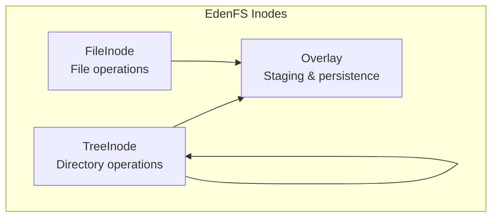
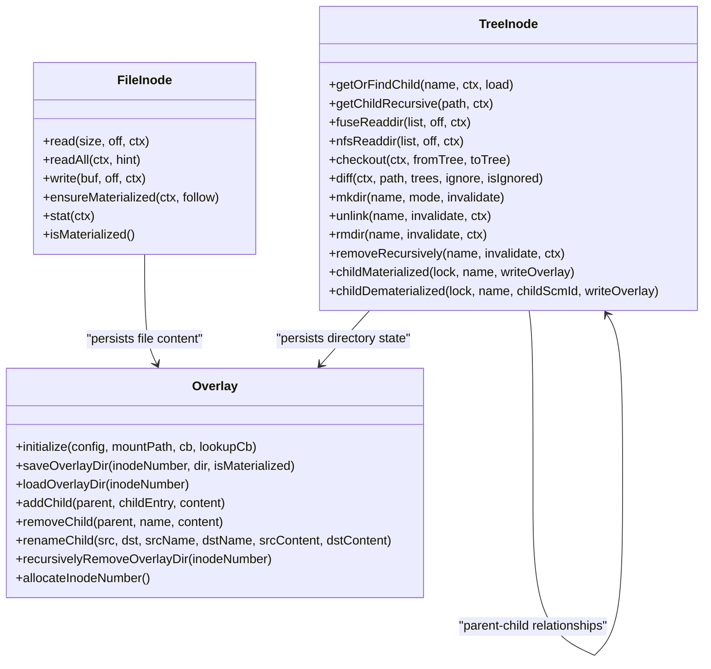
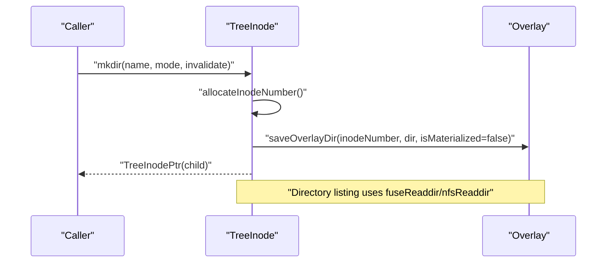
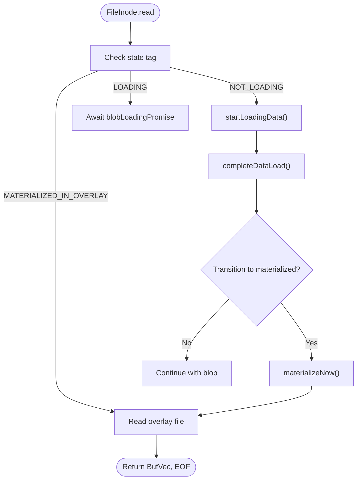
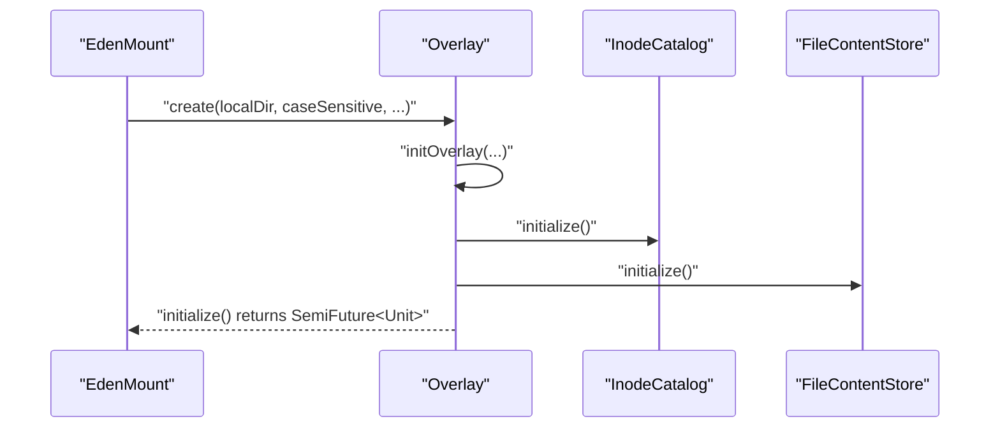
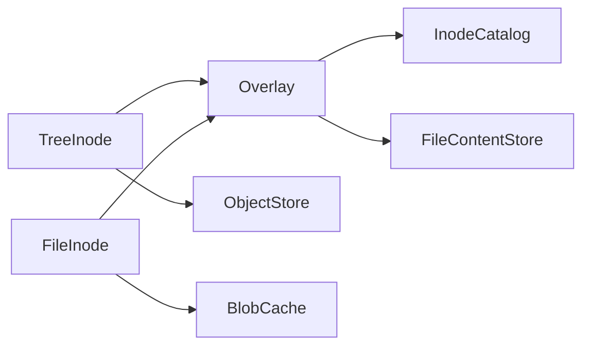

# Inode Type Specializations

<cite>
**Referenced Files in This Document**
- [TreeInode.h](file://eden/fs/inodes/TreeInode.h)
- [TreeInode.cpp](file://eden/fs/inodes/TreeInode.cpp)
- [FileInode.h](file://eden/fs/inodes/FileInode.h)
- [FileInode.cpp](file://eden/fs/inodes/FileInode.cpp)
- [Overlay.h](file://eden/fs/inodes/Overlay.h)
- [Overlay.cpp](file://eden/fs/inodes/Overlay.cpp)
- [TreeInodeTest.cpp](file://eden/fs/inodes/test/TreeInodeTest.cpp)
</cite>

## Table of Contents
1. [Introduction](#introduction)
2. [Project Structure](#project-structure)
3. [Core Components](#core-components)
4. [Architecture Overview](#architecture-overview)
5. [Detailed Component Analysis](#detailed-component-analysis)
6. [Dependency Analysis](#dependency-analysis)
7. [Performance Considerations](#performance-considerations)
8. [Troubleshooting Guide](#troubleshooting-guide)
9. [Conclusion](#conclusion)

## Introduction
This document explains the inode type specializations in the EdenFS system with a focus on:
- TreeInode for directory operations: tree traversal, directory listing, and subtree management
- FileInode for file operations: content access, streaming reads, and materialization strategies
- Overlay for local modifications and staging area functionality

It also covers practical usage patterns, performance characteristics, and troubleshooting strategies specific to each inode type, along with the relationships between inode types and their underlying data structures.

## Project Structure
The inode specializations live under the EdenFS inodes subsystem. The primary files involved are:
- TreeInode: directory inode implementation with directory listing, traversal, and checkout/diff support
- FileInode: file inode implementation with content access, streaming reads, and materialization
- Overlay: persistent staging area for local changes and directory/file metadata

**Diagram sources**
- [TreeInode.h:78-120](file://eden/fs/inodes/TreeInode.h#L78-L120)
- [FileInode.h:197-225](file://eden/fs/inodes/FileInode.h#L197-L225)
- [Overlay.h:80-120](file://eden/fs/inodes/Overlay.h#L80-L120)

**Section sources**
- [TreeInode.h:1-120](file://eden/fs/inodes/TreeInode.h#L1-L120)
- [FileInode.h:1-60](file://eden/fs/inodes/FileInode.h#L1-L60)
- [Overlay.h:1-80](file://eden/fs/inodes/Overlay.h#L1-L80)

## Core Components
- TreeInode: Represents directories. Provides directory enumeration, child lookup, structural mutations (create, unlink, rename), subtree traversal, checkout/diff against source control, and materialization of directory state into the overlay.
- FileInode: Represents files. Provides content access (read, readAll, write), streaming reads, materialization into the overlay, and metadata queries. It manages a state machine for non-loading/loading/materialized states.
- Overlay: Persistent staging area for local changes. Stores directory listings and file content, coordinates inode number allocation, and persists structural changes atomically.

**Section sources**
- [TreeInode.h:78-120](file://eden/fs/inodes/TreeInode.h#L78-L120)
- [FileInode.h:197-225](file://eden/fs/inodes/FileInode.h#L197-L225)
- [Overlay.h:80-120](file://eden/fs/inodes/Overlay.h#L80-L120)

## Architecture Overview
The inode specializations integrate with the mount, object store, and overlay to provide a virtual filesystem that merges source-controlled content with local modifications.

**Diagram sources**
- [TreeInode.h:135-420](file://eden/fs/inodes/TreeInode.h#L135-L420)
- [FileInode.h:325-390](file://eden/fs/inodes/FileInode.h#L325-L390)
- [Overlay.h:204-295](file://eden/fs/inodes/Overlay.h#L204-L295)

## Detailed Component Analysis

### TreeInode: Directory Operations
TreeInode encapsulates directory semantics and integrates with the overlay for persistence and with the object store for source-controlled content.

- Construction and state
  - Supports constructing from source control Tree or from overlay-backed DirContents
  - Tracks materialization state via TreeInodeState (unmaterialized vs materialized)
- Directory enumeration
  - fuseReaddir and nfsReaddir populate directory lists starting from an offset
  - Ensures . and .. are included for compatibility
- Child lookup and traversal
  - getOrFindChild/getOrLoadChild for lazy loading
  - getChildRecursive for nested lookups
- Structural mutations
  - mkdir, symlink, mknod, unlink, rmdir, removeRecursively
  - rename with invalidation and rename locks
- Checkout and diff
  - checkout compares current state against source control Trees and computes actions
  - diff computes differences between overlay and source control, respecting .gitignore
- Materialization and overlay integration
  - materialize ensures structural changes are persisted to overlay
  - childMaterialized/childDematerialized update parent’s overlay state when children change

**Diagram sources**
- [TreeInode.h:272-282](file://eden/fs/inodes/TreeInode.h#L272-L282)
- [TreeInode.h:218-235](file://eden/fs/inodes/TreeInode.h#L218-L235)
- [Overlay.h:211-215](file://eden/fs/inodes/Overlay.h#L211-L215)

**Section sources**
- [TreeInode.h:48-73](file://eden/fs/inodes/TreeInode.h#L48-L73)
- [TreeInode.h:135-192](file://eden/fs/inodes/TreeInode.h#L135-L192)
- [TreeInode.h:218-282](file://eden/fs/inodes/TreeInode.h#L218-L282)
- [TreeInode.h:370-401](file://eden/fs/inodes/TreeInode.h#L370-L401)
- [TreeInode.h:419-442](file://eden/fs/inodes/TreeInode.h#L419-L442)
- [TreeInode.cpp:151-191](file://eden/fs/inodes/TreeInode.cpp#L151-L191)

### FileInode: File Operations
FileInode manages file content and metadata, supporting streaming reads, writes, and materialization into the overlay.

- State machine
  - BLOB_NOT_LOADING, BLOB_LOADING, MATERIALIZED_IN_OVERLAY
  - Cached metadata (size, hashes) in materialized state
- Content access
  - read(size, off, ctx) returns BufVec and EOF indicator
  - readAll(ctx, hint) for small files
  - write(buf, off, ctx) for streaming writes
- Materialization
  - ensureMaterialized triggers materialization when needed
  - materializeNow copies blob into overlay
  - Windows: materialize marks as materialized
- Metadata and identity
  - stat, setattr, getMode, getObjectId, isMaterialized
  - isSameAs compares against source control blob identity

**Diagram sources**
- [FileInode.h:57-95](file://eden/fs/inodes/FileInode.h#L57-L95)
- [FileInode.h:356-358](file://eden/fs/inodes/FileInode.h#L356-L358)
- [FileInode.h:463-467](file://eden/fs/inodes/FileInode.h#L463-L467)
- [FileInode.h:521-525](file://eden/fs/inodes/FileInode.h#L521-L525)

**Section sources**
- [FileInode.h:57-195](file://eden/fs/inodes/FileInode.h#L57-L195)
- [FileInode.h:325-390](file://eden/fs/inodes/FileInode.h#L325-L390)
- [FileInode.cpp:59-171](file://eden/fs/inodes/FileInode.cpp#L59-L171)
- [FileInode.cpp:463-489](file://eden/fs/inodes/FileInode.cpp#L463-L489)

### Overlay: Local Modifications and Staging
Overlay is the persistent staging area for local changes. It manages:
- Initialization and lifecycle (initialize, close, hadCleanStartup)
- Directory persistence (saveOverlayDir, loadOverlayDir)
- Structural changes (addChild, removeChild, renameChild)
- Asynchronous cleanup (recursivelyRemoveOverlayDir, flushPendingAsync)
- Inode number allocation (allocateInodeNumber, allocateInodeNumbers)
- Catalog and content stores (platform-dependent inode catalogs and file content stores)

**Diagram sources**
- [Overlay.h:88-132](file://eden/fs/inodes/Overlay.h#L88-L132)
- [Overlay.cpp:170-200](file://eden/fs/inodes/Overlay.cpp#L170-L200)

**Section sources**
- [Overlay.h:80-120](file://eden/fs/inodes/Overlay.h#L80-L120)
- [Overlay.h:204-239](file://eden/fs/inodes/Overlay.h#L204-L239)
- [Overlay.cpp:46-165](file://eden/fs/inodes/Overlay.cpp#L46-L165)

## Dependency Analysis
- TreeInode depends on Overlay for persisting directory state and on ObjectStore for source control Trees and Blobs
- FileInode depends on Overlay for materialized content and on BlobCache/ObjectStore for non-materialized content
- Overlay depends on platform-specific inode catalogs and file content stores

**Diagram sources**
- [TreeInode.h:36-43](file://eden/fs/inodes/TreeInode.h#L36-L43)
- [FileInode.h:32-35](file://eden/fs/inodes/FileInode.h#L32-L35)
- [Overlay.h:41-49](file://eden/fs/inodes/Overlay.h#L41-L49)

**Section sources**
- [TreeInode.h:36-43](file://eden/fs/inodes/TreeInode.h#L36-L43)
- [FileInode.h:32-35](file://eden/fs/inodes/FileInode.h#L32-L35)
- [Overlay.h:41-49](file://eden/fs/inodes/Overlay.h#L41-L49)

## Performance Considerations
- TreeInode
  - Prefetching: Prefetch state tracks whether children’s auxiliary data has been prefetched to reduce subsequent loads
  - Directory listing: fuseReaddir/nfsReaddir support offsets and batched enumeration
  - Garbage collection: unloadChildrenNow/unloadChildrenUnreferencedByFs/unloadChildrenLastAccessedBefore optimize memory footprint
- FileInode
  - Streaming reads: read returns BufVec to minimize copies and overhead
  - Blob caching: BlobInterestHandle and cached metadata (size, hashes) improve repeated access performance
  - Materialization: ensureMaterialized defers expensive work until necessary
- Overlay
  - Catalog types: Sqlite/LMDB/legacy/in-memory catalogs offer trade-offs in durability, performance, and memory usage
  - Buffered vs synchronous modes: configurable for throughput vs safety
  - Asynchronous cleanup: flushPendingAsync and GC queue reduce blocking during heavy operations

**Section sources**
- [TreeInode.h:1046-1068](file://eden/fs/inodes/TreeInode.h#L1046-L1068)
- [FileInode.h:174-188](file://eden/fs/inodes/FileInode.h#L174-L188)
- [Overlay.cpp:50-142](file://eden/fs/inodes/Overlay.cpp#L50-L142)

## Troubleshooting Guide
- Directory listing anomalies
  - Verify fuseReaddir/nfsReaddir offsets and ordering; tests demonstrate expected behavior for . and ..
  - Ensure invalidation is triggered after structural changes to refresh kernel caches
- Checkout and diff issues
  - Confirm TreeInode.isMaterialized aligns with expectations; unmaterialized directories may require materialization before structural changes
  - Use diff with proper GitIgnoreStack to avoid false positives
- File read/write problems
  - For non-materialized files, ensure startLoadingData completes and materializeNow is invoked when needed
  - On Windows, use materialize to finalize materialization after writes
- Overlay corruption or startup issues
  - Check hadCleanStartup and initialization progress callbacks
  - Use recursivelyRemoveOverlayDir and flushPendingAsync for cleanup after structural changes

**Section sources**
- [TreeInodeTest.cpp:113-200](file://eden/fs/inodes/test/TreeInodeTest.cpp#L113-L200)
- [TreeInode.h:926-947](file://eden/fs/inodes/TreeInode.h#L926-L947)
- [FileInode.h:368-387](file://eden/fs/inodes/FileInode.h#L368-L387)
- [Overlay.h:155-157](file://eden/fs/inodes/Overlay.h#L155-L157)
- [Overlay.h:232-239](file://eden/fs/inodes/Overlay.h#L232-L239)

## Conclusion
TreeInode, FileInode, and Overlay form the core of EdenFS’s inode specializations. TreeInode manages directory semantics and checkout/diff against source control, FileInode provides efficient file content access and materialization, and Overlay persists local changes and coordinates inode lifecycles. Understanding their interactions and performance characteristics enables effective usage and troubleshooting of EdenFS mounts.