# Overlay File System

<cite>
**Referenced Files in This Document**
- [overlay.thrift](file://eden/fs/inodes/overlay/overlay.thrift)
- [OverlayChecker.h](file://eden/fs/inodes/overlay/OverlayChecker.h)
- [OverlayChecker.cpp](file://eden/fs/inodes/overlay/OverlayChecker.cpp)
- [InodeCatalog.h](file://eden/fs/inodes/InodeCatalog.h)
- [FsInodeCatalog.h](file://eden/fs/inodes\fscatalog\FsInodeCatalog.h)
- [FsInodeCatalogDev.h](file://eden/fs/inodes\fscatalog_dev\FsInodeCatalogDev.h)
- [OverlayFileAccess.cpp](file://eden/fs/inodes/OverlayFileAccess.cpp)
- [Overlay.cpp](file://eden/fs/inodes/Overlay.cpp)
- [TreeInode.cpp](file://eden/fs/inodes/TreeInode.cpp)
- [overlay.py](file://eden/fs/cli/overlay.py)
- [JournalDelta.h](file://eden/fs/journal/JournalDelta.h)
- [WindowsFsck.cpp](file://eden/fs/inodes/sqlitecatalog/WindowsFsck.cpp)
- [FsckTest.cpp](file://eden/fs/inodes\fscatalog\test\FsckTest.cpp)
</cite>

## Table of Contents
1. [Introduction](#introduction)
2. [Project Structure](#project-structure)
3. [Core Components](#core-components)
4. [Architecture Overview](#architecture-overview)
5. [Detailed Component Analysis](#detailed-component-analysis)
6. [Dependency Analysis](#dependency-analysis)
7. [Performance Considerations](#performance-considerations)
8. [Troubleshooting Guide](#troubleshooting-guide)
9. [Conclusion](#conclusion)

## Introduction
This document explains the overlay file system implementation within EdenFS. The overlay enables local file modifications while preserving repository integrity by storing per-inode metadata and content alongside the repository’s canonical state. It tracks directory contents, file content, and staging-like semantics through inode catalogs and content stores, and integrates with the broader inode management system to maintain correctness across materialization, dematerialization, and checkout operations.

## Project Structure
The overlay system spans several subsystems:
- Overlay schema and types define directory and entry structures.
- Inode catalog abstractions manage directory overlays and inode lifecycle.
- Content store manages per-inode file data with headers and hashing.
- Overlay access layer provides caching, hashing, and IO for files.
- Checker validates and repairs overlay consistency.
- Integration points connect to inode tree operations and journal deltas.

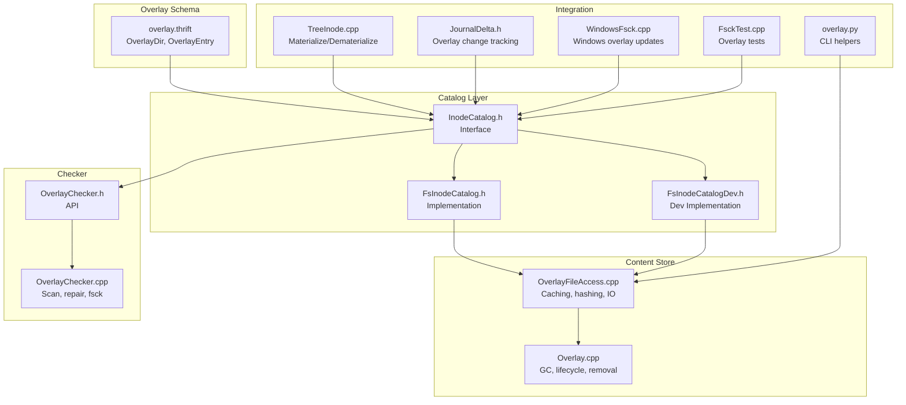

**Diagram sources**
- [overlay.thrift:31-48](file://eden/fs/inodes/overlay/overlay.thrift#L31-L48)
- [InodeCatalog.h:112-134](file://eden/fs/inodes/InodeCatalog.h#L112-L134)
- [FsInodeCatalog.h:92-129](file://eden/fs/inodes\fscatalog\FsInodeCatalog.h#L92-L129)
- [FsInodeCatalogDev.h:92-129](file://eden/fs/inodes\fscatalog_dev\FsInodeCatalogDev.h#L92-L129)
- [OverlayFileAccess.cpp:71-107](file://eden/fs/inodes/OverlayFileAccess.cpp#L71-L107)
- [Overlay.cpp:680-712](file://eden/fs/inodes/Overlay.cpp#L680-L712)
- [OverlayChecker.h:37-117](file://eden/fs/inodes/overlay/OverlayChecker.h#L37-L117)
- [OverlayChecker.cpp:777-800](file://eden/fs/inodes/overlay/OverlayChecker.cpp#L777-L800)
- [TreeInode.cpp:1259-1298](file://eden/fs/inodes/TreeInode.cpp#L1259-L1298)
- [JournalDelta.h:119-125](file://eden/fs/journal/JournalDelta.h#L119-L125)
- [WindowsFsck.cpp:144-171](file://eden/fs/inodes/sqlitecatalog/WindowsFsck.cpp#L144-L171)
- [FsckTest.cpp:149-175](file://eden/fs/inodes\fscatalog\test\FsckTest.cpp#L149-L175)
- [overlay.py:176-214](file://eden/fs/cli/overlay.py#L176-L214)

**Section sources**
- [overlay.thrift:1-49](file://eden/fs/inodes/overlay/overlay.thrift#L1-L49)
- [InodeCatalog.h:56-134](file://eden/fs/inodes/InodeCatalog.h#L56-L134)
- [OverlayFileAccess.cpp:1-377](file://eden/fs/inodes/OverlayFileAccess.cpp#L1-L377)
- [OverlayChecker.h:1-233](file://eden/fs/inodes/overlay/OverlayChecker.h#L1-L233)
- [OverlayChecker.cpp:1-800](file://eden/fs/inodes/overlay/OverlayChecker.cpp#L1-L800)
- [TreeInode.cpp:1259-1298](file://eden/fs/inodes/TreeInode.cpp#L1259-L1298)
- [JournalDelta.h:80-125](file://eden/fs/journal/JournalDelta.h#L80-L125)
- [WindowsFsck.cpp:144-171](file://eden/fs/inodes/sqlitecatalog/WindowsFsck.cpp#L144-L171)
- [FsckTest.cpp:149-175](file://eden/fs/inodes\fscatalog\test\FsckTest.cpp#L149-L175)
- [overlay.py:176-214](file://eden/fs/cli/overlay.py#L176-L214)

## Core Components
- Overlay schema: Defines OverlayDir and OverlayEntry to represent directory contents and per-child metadata (mode, inode number, hash).
- Inode catalog interface: Abstractions for initializing, saving/removing directories, and managing inode lifecycle.
- Overlay content access: Caching, hashing (SHA-1, BLAKE3), and IO operations for overlay files.
- Overlay checker: Scans and repairs overlay inconsistencies, orphaned inodes, and path computation.
- Integration points: Tree inode materialization/dematerialization, journal delta tracking, and Windows-specific overlay updates.

**Section sources**
- [overlay.thrift:31-48](file://eden/fs/inodes/overlay/overlay.thrift#L31-L48)
- [InodeCatalog.h:97-134](file://eden/fs/inodes/InodeCatalog.h#L97-L134)
- [OverlayFileAccess.cpp:71-107](file://eden/fs/inodes/OverlayFileAccess.cpp#L71-L107)
- [OverlayChecker.h:37-117](file://eden/fs/inodes/overlay/OverlayChecker.h#L37-L117)

## Architecture Overview
The overlay architecture separates concerns:
- Directory overlays are persisted via InodeCatalog implementations.
- Per-inode content is stored in the content store with a header and body.
- OverlayFileAccess caches entries and computes hashes efficiently.
- OverlayChecker runs offline scans and repairs.
- TreeInode orchestrates materialization/dematerialization and writes overlay updates.

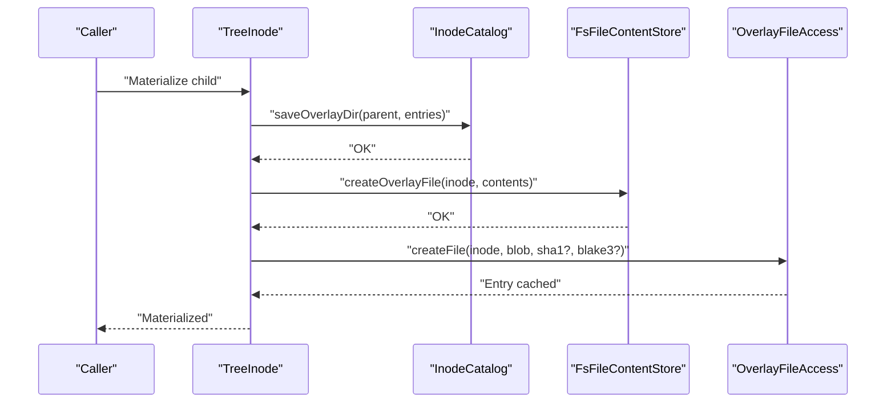

**Diagram sources**
- [TreeInode.cpp:1259-1298](file://eden/fs/inodes/TreeInode.cpp#L1259-L1298)
- [InodeCatalog.h:131-134](file://eden/fs/inodes/InodeCatalog.h#L131-L134)
- [Overlay.cpp:680-712](file://eden/fs/inodes/Overlay.cpp#L680-L712)
- [OverlayFileAccess.cpp:95-107](file://eden/fs/inodes/OverlayFileAccess.cpp#L95-L107)

## Detailed Component Analysis

### Overlay Schema and Data Model
- OverlayDir holds a map of child names to OverlayEntry.
- OverlayEntry carries mode, inode number, and optional hash for non-materialized entries.

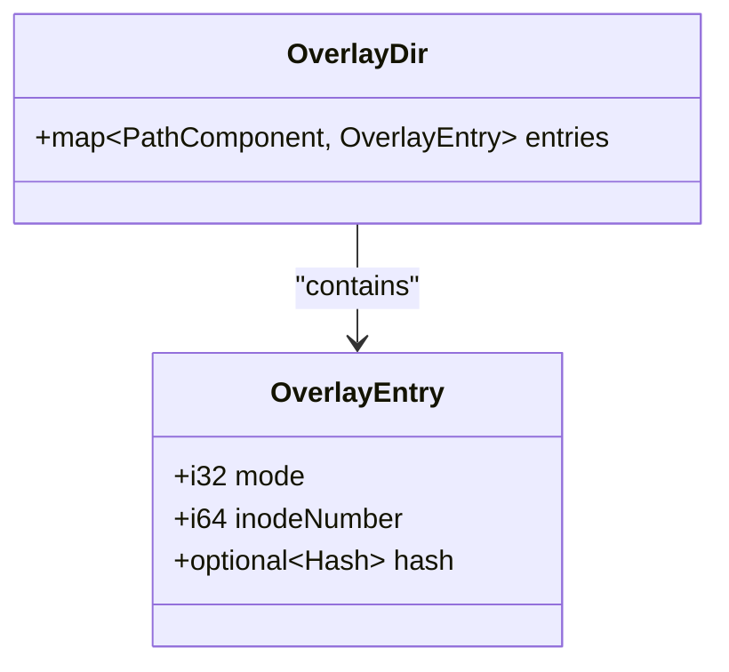

**Diagram sources**
- [overlay.thrift:31-48](file://eden/fs/inodes/overlay/overlay.thrift#L31-L48)

**Section sources**
- [overlay.thrift:21-48](file://eden/fs/inodes/overlay/overlay.thrift#L21-L48)

### Inode Catalog Interface and Implementations
- InodeCatalog defines initialization, directory save/remove/load, and semantic operations for children.
- FsInodeCatalog and FsInodeCatalogDev implement directory operations and file open helpers.

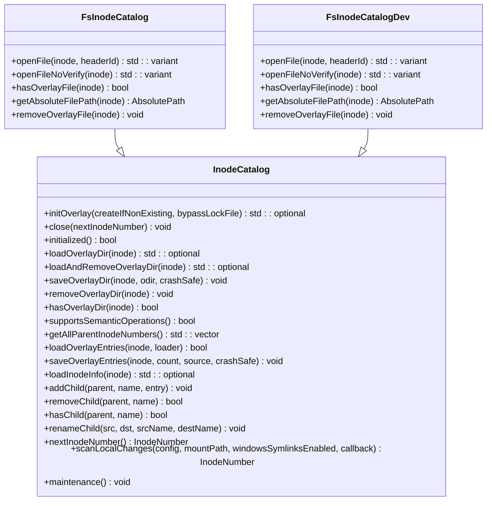

**Diagram sources**
- [InodeCatalog.h:56-240](file://eden/fs/inodes/InodeCatalog.h#L56-L240)
- [FsInodeCatalog.h:92-129](file://eden/fs/inodes\fscatalog\FsInodeCatalog.h#L92-L129)
- [FsInodeCatalogDev.h:92-129](file://eden/fs/inodes\fscatalog_dev\FsInodeCatalogDev.h#L92-L129)

**Section sources**
- [InodeCatalog.h:83-240](file://eden/fs/inodes/InodeCatalog.h#L83-L240)
- [FsInodeCatalog.h:92-129](file://eden/fs/inodes\fscatalog\FsInodeCatalog.h#L92-L129)
- [FsInodeCatalogDev.h:92-129](file://eden/fs/inodes\fscatalog_dev\FsInodeCatalogDev.h#L92-L129)

### Overlay Content Access and Hashing
- OverlayFileAccess caches entries keyed by inode number, lazily opening files and computing sizes/sha1/blake3 on demand.
- Writes and truncates invalidate cached metadata to keep consistency.
- Reads use pread to avoid changing file offsets.

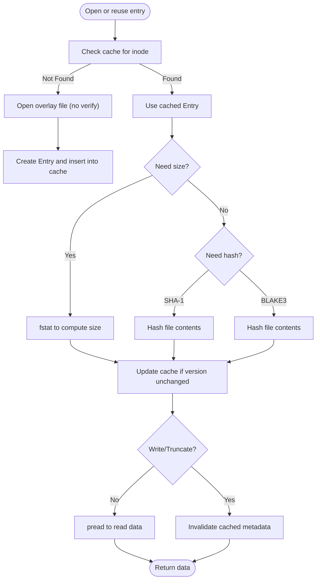

**Diagram sources**
- [OverlayFileAccess.cpp:349-372](file://eden/fs/inodes/OverlayFileAccess.cpp#L349-L372)
- [OverlayFileAccess.cpp:109-158](file://eden/fs/inodes/OverlayFileAccess.cpp#L109-L158)
- [OverlayFileAccess.cpp:160-228](file://eden/fs/inodes/OverlayFileAccess.cpp#L160-L228)
- [OverlayFileAccess.cpp:267-304](file://eden/fs/inodes/OverlayFileAccess.cpp#L267-L304)

**Section sources**
- [OverlayFileAccess.cpp:71-107](file://eden/fs/inodes/OverlayFileAccess.cpp#L71-L107)
- [OverlayFileAccess.cpp:109-228](file://eden/fs/inodes/OverlayFileAccess.cpp#L109-L228)
- [OverlayFileAccess.cpp:267-332](file://eden/fs/inodes/OverlayFileAccess.cpp#L267-L332)

### Overlay Lifecycle and Cleanup
- Removal operations free inode metadata and delete overlay files/directories.
- Close waits for outstanding IO and signals completion.

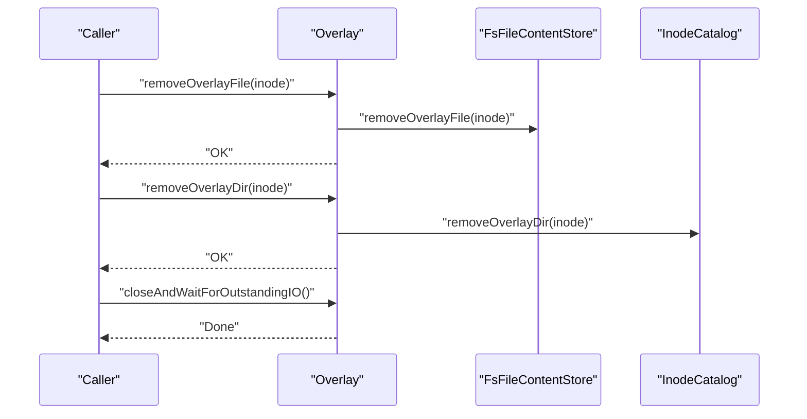

**Diagram sources**
- [Overlay.cpp:680-712](file://eden/fs/inodes/Overlay.cpp#L680-L712)
- [Overlay.cpp:916-926](file://eden/fs/inodes/Overlay.cpp#L916-L926)

**Section sources**
- [Overlay.cpp:680-712](file://eden/fs/inodes/Overlay.cpp#L680-L712)
- [Overlay.cpp:916-926](file://eden/fs/inodes/Overlay.cpp#L916-L926)

### Overlay Checker: Scanning, Repairing, and Path Computation
- Scans overlay shards, loads inodes, links children, detects orphans, and repairs by archiving or replacing data.
- Computes best-effort paths to inodes and logs repairs.

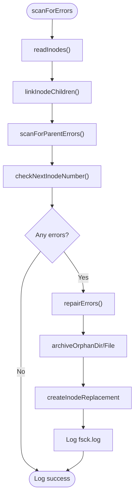

**Diagram sources**
- [OverlayChecker.cpp:777-800](file://eden/fs/inodes/overlay/OverlayChecker.cpp#L777-L800)
- [OverlayChecker.cpp:459-504](file://eden/fs/inodes/overlay/OverlayChecker.cpp#L459-L504)
- [OverlayChecker.cpp:583-659](file://eden/fs/inodes/overlay/OverlayChecker.cpp#L583-L659)

**Section sources**
- [OverlayChecker.h:81-117](file://eden/fs/inodes/overlay/OverlayChecker.h#L81-L117)
- [OverlayChecker.cpp:777-800](file://eden/fs/inodes/overlay/OverlayChecker.cpp#L777-L800)
- [OverlayChecker.cpp:459-504](file://eden/fs/inodes/overlay/OverlayChecker.cpp#L459-L504)
- [OverlayChecker.cpp:583-659](file://eden/fs/inodes/overlay/OverlayChecker.cpp#L583-L659)

### Materialization and Dematerialization Integration
- TreeInode coordinates materialization and writes overlay updates post-checkout.
- WindowsFsck updates overlay entries for SCM state and handles symlinks.

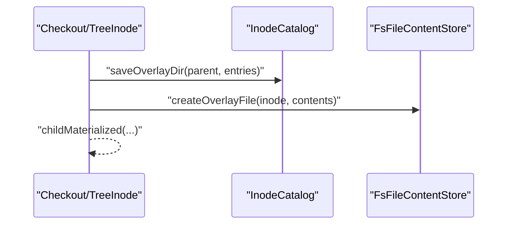

**Diagram sources**
- [TreeInode.cpp:1259-1298](file://eden/fs/inodes/TreeInode.cpp#L1259-L1298)
- [WindowsFsck.cpp:144-171](file://eden/fs/inodes/sqlitecatalog/WindowsFsck.cpp#L144-L171)

**Section sources**
- [TreeInode.cpp:1259-1298](file://eden/fs/inodes/TreeInode.cpp#L1259-L1298)
- [WindowsFsck.cpp:144-171](file://eden/fs/inodes/sqlitecatalog/WindowsFsck.cpp#L144-L171)

### Journal Delta Tracking for Overlay Changes
- JournalDelta exposes changed files in overlay and distinguishes single-file vs rename/replace semantics.

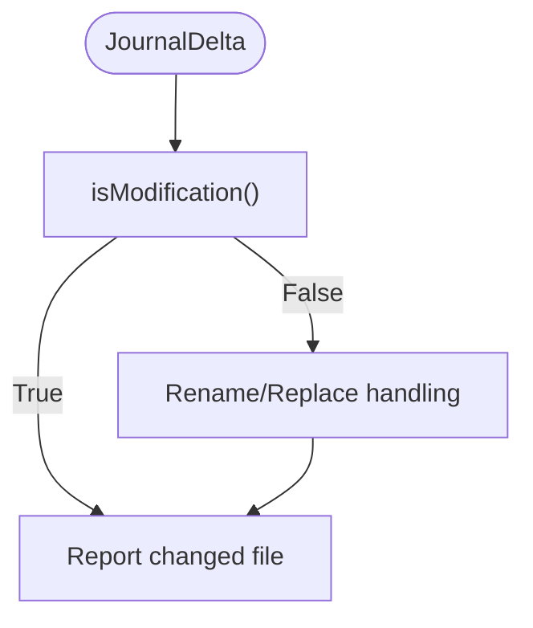

**Diagram sources**
- [JournalDelta.h:119-125](file://eden/fs/journal/JournalDelta.h#L119-L125)

**Section sources**
- [JournalDelta.h:80-125](file://eden/fs/journal/JournalDelta.h#L80-L125)

### CLI Overlay Helpers
- Provides locking, path computation, and header validation for overlay files.

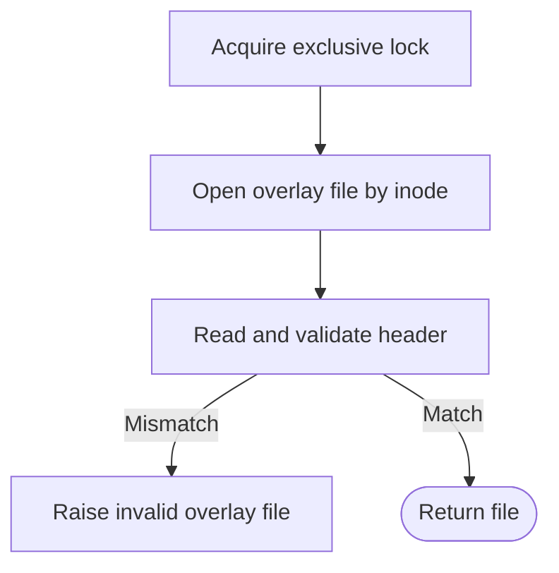

**Diagram sources**
- [overlay.py:176-214](file://eden/fs/cli/overlay.py#L176-L214)

**Section sources**
- [overlay.py:176-214](file://eden/fs/cli/overlay.py#L176-L214)

## Dependency Analysis
- Overlay schema drives InodeCatalog operations.
- InodeCatalog implementations depend on FsFileContentStore for file operations.
- OverlayFileAccess depends on Overlay and content store for IO.
- OverlayChecker depends on InodeCatalog and content store to inspect and repair.
- TreeInode and WindowsFsck coordinate overlay updates during checkout and SCM state synchronization.

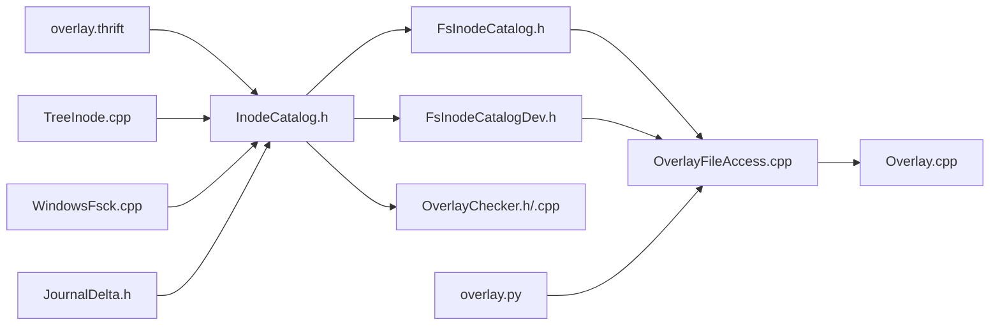

**Diagram sources**
- [overlay.thrift:31-48](file://eden/fs/inodes/overlay/overlay.thrift#L31-L48)
- [InodeCatalog.h:112-134](file://eden/fs/inodes/InodeCatalog.h#L112-L134)
- [FsInodeCatalog.h:92-129](file://eden/fs/inodes\fscatalog\FsInodeCatalog.h#L92-L129)
- [FsInodeCatalogDev.h:92-129](file://eden/fs/inodes\fscatalog_dev\FsInodeCatalogDev.h#L92-L129)
- [OverlayFileAccess.cpp:71-107](file://eden/fs/inodes/OverlayFileAccess.cpp#L71-L107)
- [Overlay.cpp:680-712](file://eden/fs/inodes/Overlay.cpp#L680-L712)
- [OverlayChecker.h:37-117](file://eden/fs/inodes/overlay/OverlayChecker.h#L37-L117)
- [OverlayChecker.cpp:777-800](file://eden/fs/inodes/overlay/OverlayChecker.cpp#L777-L800)
- [TreeInode.cpp:1259-1298](file://eden/fs/inodes/TreeInode.cpp#L1259-L1298)
- [WindowsFsck.cpp:144-171](file://eden/fs/inodes/sqlitecatalog/WindowsFsck.cpp#L144-L171)
- [JournalDelta.h:119-125](file://eden/fs/journal/JournalDelta.h#L119-L125)
- [overlay.py:176-214](file://eden/fs/cli/overlay.py#L176-L214)

**Section sources**
- [overlay.thrift:31-48](file://eden/fs/inodes/overlay/overlay.thrift#L31-L48)
- [InodeCatalog.h:112-134](file://eden/fs/inodes/InodeCatalog.h#L112-L134)
- [OverlayFileAccess.cpp:71-107](file://eden/fs/inodes/OverlayFileAccess.cpp#L71-L107)
- [OverlayChecker.cpp:777-800](file://eden/fs/inodes/overlay/OverlayChecker.cpp#L777-L800)
- [TreeInode.cpp:1259-1298](file://eden/fs/inodes/TreeInode.cpp#L1259-L1298)
- [WindowsFsck.cpp:144-171](file://eden/fs/inodes/sqlitecatalog/WindowsFsck.cpp#L144-L171)
- [JournalDelta.h:119-125](file://eden/fs/journal/JournalDelta.h#L119-L125)
- [overlay.py:176-214](file://eden/fs/cli/overlay.py#L176-L214)

## Performance Considerations
- Minimize IO while holding locks: OverlayFileAccess avoids IO under locks except for rare operations like readAllContents.
- Efficient hashing: Hash computations stream file content in chunks to reduce overhead.
- Crash-safe saves: InodeCatalog.saveOverlayDir supports crash-safe writes via temp-file plus rename.
- Concurrency: Separate state lock from IO operations to improve throughput under concurrent access.
- Windows-specific scanning: InodeCatalog.scanLocalChanges supports overlay scans when ProjectedFS allows local changes.

[No sources needed since this section provides general guidance]

## Troubleshooting Guide
Common issues and resolutions:
- Corrupted overlay file: OverlayFileAccess detects truncated files and raises corruption errors; use OverlayChecker to repair or replace.
- Orphaned inodes: OverlayChecker archives orphaned subtrees and removes overlay records; verify lost+found contents.
- Unexpected overlay files: OverlayChecker reports unexpected files; investigate and remove if safe.
- Missing materialized inode: OverlayChecker replaces missing files/dirs with empty placeholders or dematerializes entries from SCM.
- Windows local changes: Use InodeCatalog.scanLocalChanges to reconcile local edits under ProjectedFS.

**Section sources**
- [OverlayFileAccess.cpp:134-147](file://eden/fs/inodes/OverlayFileAccess.cpp#L134-L147)
- [OverlayChecker.cpp:459-504](file://eden/fs/inodes/overlay/OverlayChecker.cpp#L459-L504)
- [OverlayChecker.cpp:583-659](file://eden/fs/inodes/overlay/OverlayChecker.cpp#L583-L659)
- [OverlayChecker.cpp:408-451](file://eden/fs/inodes/overlay/OverlayChecker.cpp#L408-L451)
- [InodeCatalog.h:229-235](file://eden/fs/inodes/InodeCatalog.h#L229-L235)

## Conclusion
The overlay file system in EdenFS provides a robust mechanism for local file modifications while preserving repository integrity. Through a clear separation of directory overlays, per-inode content, and content access, combined with offline checking and repair, it ensures correctness and resilience. Integration with inode lifecycle operations and platform-specific scanning further strengthens its reliability across platforms.