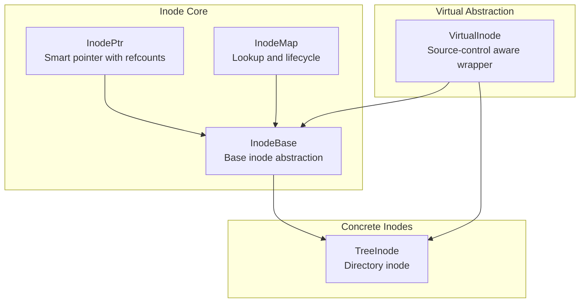
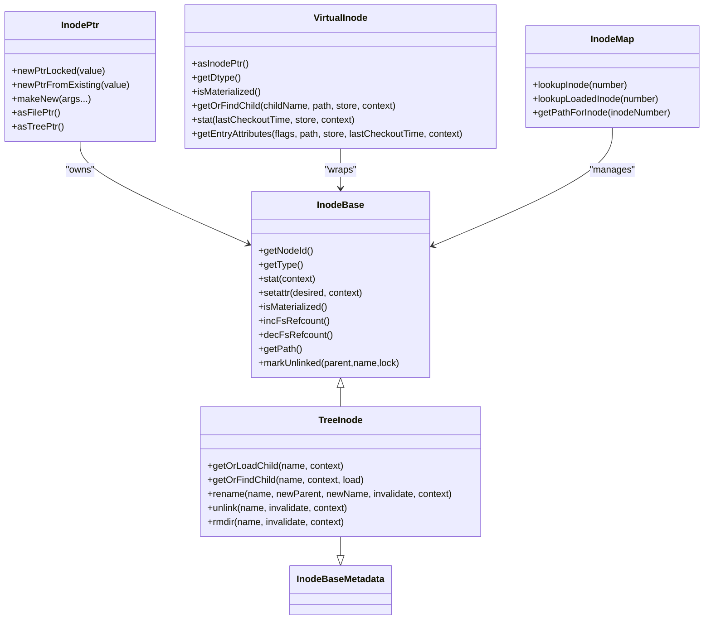
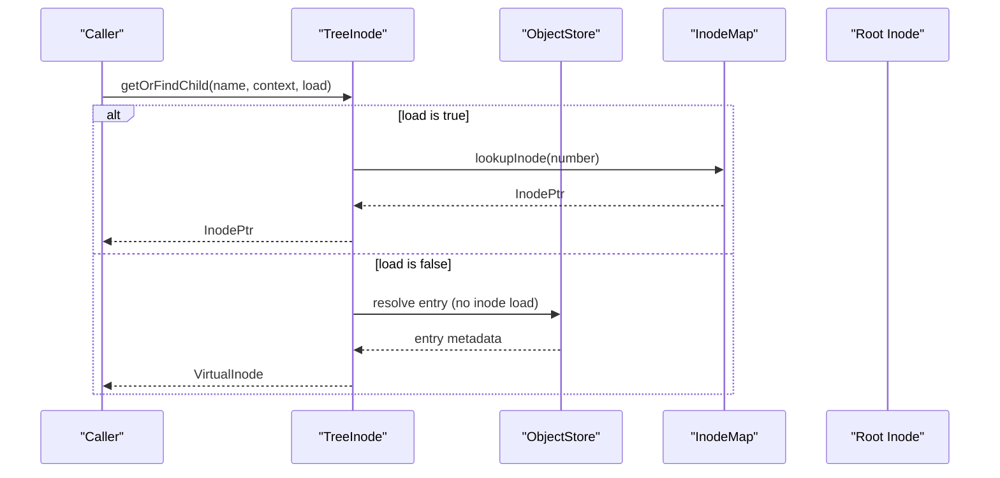
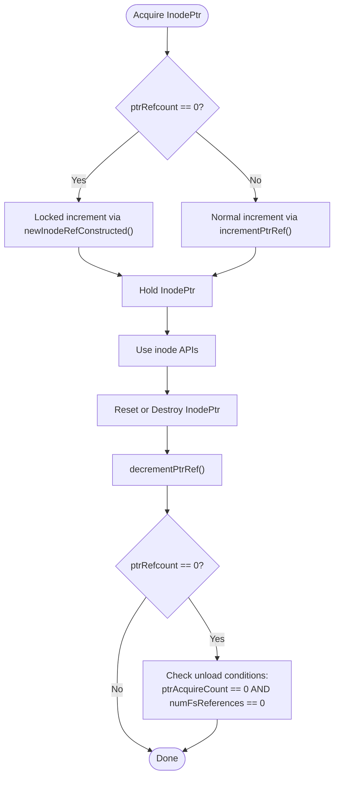
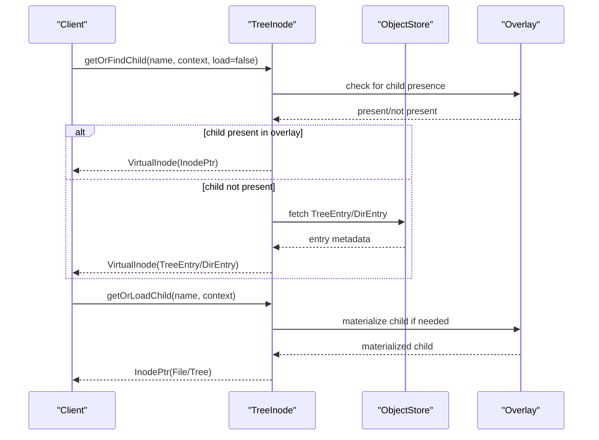
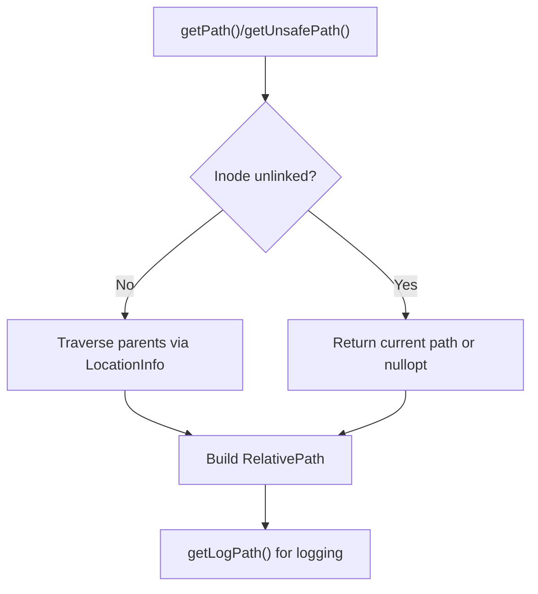
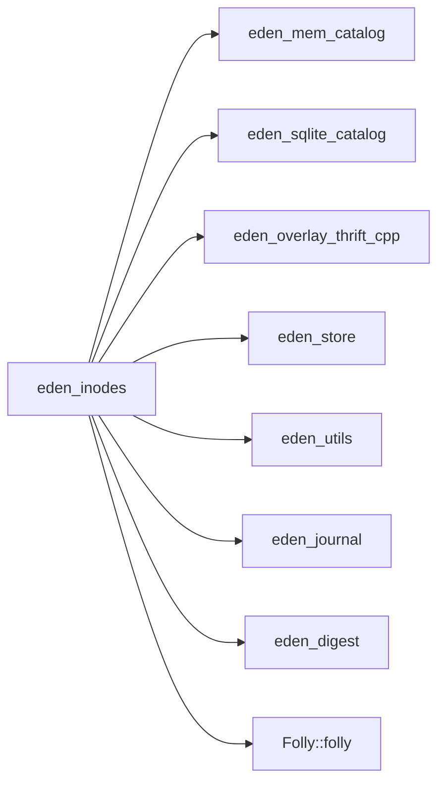

# Virtual Inode Operations

<cite>
**Referenced Files in This Document**
- [InodeBase.h](file://eden/fs/inodes/InodeBase.h)
- [InodeBase.cpp](file://eden/fs/inodes/InodeBase.cpp)
- [InodePtr.h](file://eden/fs/inodes/InodePtr.h)
- [InodePtr.cpp](file://eden/fs/inodes/InodePtr.cpp)
- [TreeInode.h](file://eden/fs/inodes/TreeInode.h)
- [TreeInode.cpp](file://eden/fs/inodes/TreeInode.cpp)
- [VirtualInode.h](file://eden/fs/inodes/VirtualInode.h)
- [VirtualInode.cpp](file://eden/fs/inodes/VirtualInode.cpp)
- [InodeMap.h](file://eden/fs/inodes/InodeMap.h)
- [InodeMap.cpp](file://eden/fs/inodes/InodeMap.cpp)
- [CMakeLists.txt](file://eden/fs/inodes/CMakeLists.txt)
</cite>

## Table of Contents
1. [Introduction](#introduction)
2. [Project Structure](#project-structure)
3. [Core Components](#core-components)
4. [Architecture Overview](#architecture-overview)
5. [Detailed Component Analysis](#detailed-component-analysis)
6. [Dependency Analysis](#dependency-analysis)
7. [Performance Considerations](#performance-considerations)
8. [Troubleshooting Guide](#troubleshooting-guide)
9. [Conclusion](#conclusion)

## Introduction
This document explains the virtual inode architecture in EdenFS that enables lazy loading and efficient memory usage. It covers inode lifecycle management, reference counting, pointer semantics, and thread-safe access patterns. It also documents the virtual inode abstraction that allows read-only operations against source control or overlay-backed state without forcing full materialization.

## Project Structure
The virtual inode subsystem resides under eden/fs/inodes and is composed of:
- Base inode abstractions and pointer management
- Directory and file inode specializations
- Virtual inode wrapper for source-control-aware operations
- Inode map for lifecycle and lookup
- Build configuration linking required libraries

**Diagram sources**
- [InodeBase.h:43-800](file://eden/fs/inodes/InodeBase.h#L43-L800)
- [InodePtr.h:31-376](file://eden/fs/inodes/InodePtr.h#L31-L376)
- [InodeMap.h:199-234](file://eden/fs/inodes/InodeMap.h#L199-L234)
- [TreeInode.h:78-200](file://eden/fs/inodes/TreeInode.h#L78-L200)
- [VirtualInode.h:46-268](file://eden/fs/inodes/VirtualInode.h#L46-L268)

**Section sources**
- [CMakeLists.txt:28-86](file://eden/fs/inodes/CMakeLists.txt#L28-L86)

## Core Components
- InodeBase: Defines the base interface and lifecycle fields (reference counts, location, timestamps). Provides stat/setattr hooks and path computation utilities.
- InodePtr: A smart pointer managing inode ownership and reference counts, with specialized constructors for lazy-loading contexts.
- TreeInode: Directory inode that manages children, loads/unloads entries, and exposes operations like getOrLoadChild and rename.
- VirtualInode: A wrapper that presents a uniform interface over loaded inodes, source-control entries, or overlay-backed data without forcing materialization.
- InodeMap: Manages inode lookup by inode number, lifecycle transitions, and path resolution for loaded/unloaded state.

Key responsibilities:
- Lazy loading: TreeInode resolves child VirtualInode entries without loading full inodes when unnecessary.
- Reference counting: Atomic refcounts guard unload decisions and ensure safe destruction.
- Thread safety: Synchronized locations and atomic counters coordinate access across rename and unload paths.

**Section sources**
- [InodeBase.h:43-800](file://eden/fs/inodes/InodeBase.h#L43-L800)
- [InodeBase.cpp:26-47](file://eden/fs/inodes/InodeBase.cpp#L26-L47)
- [InodePtr.h:31-184](file://eden/fs/inodes/InodePtr.h#L31-L184)
- [TreeInode.h:78-200](file://eden/fs/inodes/TreeInode.h#L78-L200)
- [VirtualInode.h:46-120](file://eden/fs/inodes/VirtualInode.h#L46-L120)
- [InodeMap.h:199-234](file://eden/fs/inodes/InodeMap.h#L199-L234)

## Architecture Overview
The virtual inode architecture separates concerns between:
- Source-control-backed state (trees, blobs) for read-only queries
- Overlay-backed materialized state for mutable operations
- Lazy transitions: VirtualInode operations avoid loading full inodes until necessary

**Diagram sources**
- [InodeBase.h:43-800](file://eden/fs/inodes/InodeBase.h#L43-L800)
- [InodePtr.h:31-326](file://eden/fs/inodes/InodePtr.h#L31-L326)
- [TreeInode.h:78-200](file://eden/fs/inodes/TreeInode.h#L78-L200)
- [VirtualInode.h:46-120](file://eden/fs/inodes/VirtualInode.h#L46-L120)
- [InodeMap.h:199-234](file://eden/fs/inodes/InodeMap.h#L199-L234)

## Detailed Component Analysis

### InodeBase: Base Abstractions and Lifecycle
- Reference counts:
  - ptrRefcount_: Tracks pointer references for safe unload decisions.
  - ptrAcquireCount_: Tracks acquisition transitions to ensure single deletion.
  - numFsReferences_: Tracks kernel-visible references (FUSE/ProjectedFS).
- Location tracking:
  - LocationInfo with parent pointer and name; synchronized for rename safety.
- Path computation:
  - getPath/getUnsafePath/getLogPath utilities for diagnostics and logging.
- Metadata and access:
  - stat/setattr hooks; ensureMaterialized for NFS; access logging and journal updates.

Thread-safety highlights:
- Atomic counters with acquire/release semantics.
- Location guarded by a synchronized structure; rename lock ordering enforced externally.

**Section sources**
- [InodeBase.h:63-150](file://eden/fs/inodes/InodeBase.h#L63-L150)
- [InodeBase.h:293-356](file://eden/fs/inodes/InodeBase.h#L293-L356)
- [InodeBase.h:409-451](file://eden/fs/inodes/InodeBase.h#L409-L451)
- [InodeBase.cpp:26-47](file://eden/fs/inodes/InodeBase.cpp#L26-L47)

### InodePtr: Pointer Management and Conversions
- Smart pointer semantics:
  - Copy/move constructors and assignment with proper refcount updates.
  - reset() decrements refcount and clears value.
- Construction APIs:
  - newPtrLocked/newPtrFromExisting/makeNew for controlled acquisition.
  - takeOwnership for transferring unique_ptr ownership.
- Type conversions:
  - asFilePtr/asTreePtr and variants to safely cast to specialized inode types.

Safety:
- Prevents refcount transitions from 0 to 1 except during controlled acquisition.
- Provides manualDecRef/resetNoDecRef for shutdown scenarios.

**Section sources**
- [InodePtr.h:31-184](file://eden/fs/inodes/InodePtr.h#L31-L184)
- [InodePtr.h:192-326](file://eden/fs/inodes/InodePtr.h#L192-L326)
- [InodePtr.cpp:42-83](file://eden/fs/inodes/InodePtr.cpp#L42-L83)

### TreeInode: Directory Inode and Child Management
- Child resolution:
  - getOrFindChild/getOrLoadChild: resolve VirtualInode entries without forcing full inode load.
  - getChildren: batch retrieval of child VirtualInodes.
- Materialization:
  - isMaterialized checks overlay-backed state; ensureMaterialized forces recursion on NFS.
- Renames and deletions:
  - rename updates location under rename locks.
  - unlink/rmdir remove children and may trigger immediate unload.
- Recursive operations:
  - getChildRecursive and checkout/diff enable bulk operations.

Concurrency:
- Uses synchronized contents_ and rename locks to maintain consistency during modifications.

**Section sources**
- [TreeInode.h:135-206](file://eden/fs/inodes/TreeInode.h#L135-L206)
- [TreeInode.h:243-247](file://eden/fs/inodes/TreeInode.h#L243-L247)
- [TreeInode.h:272-318](file://eden/fs/inodes/TreeInode.h#L272-L318)

### VirtualInode: Source-Control Aware Wrapper
- Purpose:
  - Provide inode-like interface independent of whether the underlying object is loaded.
  - Avoid loading inodes for read-only operations by consulting ObjectStore or source-control entries.
- Variants:
  - Holds InodePtr, UnmaterializedUnloadedBlobDirEntry, TreePtr, or TreeEntry.
- Operations:
  - getOrFindChild: prefers overlay-backed child if available, otherwise queries ObjectStore.
  - stat: emulates stat using overlay or source-control metadata.
  - getEntryAttributes: computes hashes, sizes, modes, and timestamps without loading.

Use cases:
- Diff, checkout, and attribute queries benefit from avoiding inode materialization.

**Section sources**
- [VirtualInode.h:46-120](file://eden/fs/inodes/VirtualInode.h#L46-L120)
- [VirtualInode.h:160-225](file://eden/fs/inodes/VirtualInode.h#L160-L225)

### InodeMap: Lookup and Lifecycle Coordination
- Lookup:
  - lookupInode returns InodePtr for a given inode number; may construct/loading if needed.
  - lookupLoadedInode returns only already-loaded inodes.
- Path resolution:
  - getPathForInode builds path for loaded/unloaded state, including unlinked nodes.
- Shutdown:
  - manualDecRef/resetNoDecRef assist controlled teardown.

Integration:
- Coordinates with TreeInode and InodeBase to enforce safe unload conditions.

**Section sources**
- [InodeMap.h:199-234](file://eden/fs/inodes/InodeMap.h#L199-L234)

## Architecture Overview

**Diagram sources**
- [TreeInode.h:135-146](file://eden/fs/inodes/TreeInode.h#L135-L146)
- [InodeMap.h:199-234](file://eden/fs/inodes/InodeMap.h#L199-L234)
- [VirtualInode.h:105-128](file://eden/fs/inodes/VirtualInode.h#L105-L128)

## Detailed Component Analysis

### Inode Lifecycle and Reference Counting

**Diagram sources**
- [InodeBase.h:567-611](file://eden/fs/inodes/InodeBase.h#L567-L611)
- [InodeBase.h:689-727](file://eden/fs/inodes/InodeBase.h#L689-L727)
- [InodePtr.h:175-184](file://eden/fs/inodes/InodePtr.h#L175-L184)

**Section sources**
- [InodeBase.h:567-611](file://eden/fs/inodes/InodeBase.h#L567-L611)
- [InodeBase.h:689-727](file://eden/fs/inodes/InodeBase.h#L689-L727)
- [InodePtr.h:175-184](file://eden/fs/inodes/InodePtr.h#L175-L184)

### Virtual Inode Creation and Materialization

**Diagram sources**
- [TreeInode.h:135-192](file://eden/fs/inodes/TreeInode.h#L135-L192)
- [VirtualInode.h:105-128](file://eden/fs/inodes/VirtualInode.h#L105-L128)

**Section sources**
- [TreeInode.h:135-192](file://eden/fs/inodes/TreeInode.h#L135-L192)
- [VirtualInode.h:105-128](file://eden/fs/inodes/VirtualInode.h#L105-L128)

### Path Resolution and Unlink Semantics

**Diagram sources**
- [InodeBase.h:214-247](file://eden/fs/inodes/InodeBase.h#L214-L247)
- [InodeBase.h:409-451](file://eden/fs/inodes/InodeBase.h#L409-L451)

**Section sources**
- [InodeBase.h:214-247](file://eden/fs/inodes/InodeBase.h#L214-L247)
- [InodeBase.h:409-451](file://eden/fs/inodes/InodeBase.h#L409-L451)

## Dependency Analysis
The inodes library links to catalogs, overlays, stores, and dispatchers depending on platform. The core virtual inode logic depends on:
- InodeBase and InodePtr for lifecycle and ownership
- TreeInode for directory operations and child resolution
- VirtualInode for source-control-aware queries
- InodeMap for lookup and path resolution

**Diagram sources**
- [CMakeLists.txt:44-85](file://eden/fs/inodes/CMakeLists.txt#L44-L85)

**Section sources**
- [CMakeLists.txt:44-85](file://eden/fs/inodes/CMakeLists.txt#L44-L85)

## Performance Considerations
- Prefer VirtualInode operations for read-only workloads to avoid loading inodes.
- Use getOrFindChild with load=false to defer materialization.
- Batch child operations via getChildren to reduce overhead.
- Keep rename locks held only for short durations to minimize contention.
- Monitor numFsReferences to ensure timely unload on platforms without kernel forget callbacks.

## Troubleshooting Guide
Common issues and remedies:
- Stale path or wrong type errors:
  - Verify inode type via getType() and use asFilePtr/asTreePtr appropriately.
- Unlink races:
  - Use rename locks when computing paths; prefer getUnsafePath only when necessary.
- Excessive memory usage:
  - Inspect ptrRefcount and ptrAcquireCount; ensure no lingering InodePtrs.
- Platform-specific reference counting:
  - On non-Linux, numFsReferences treated as binary flag; ensure clearFsRefcount is used when appropriate.

**Section sources**
- [InodeBase.h:99-136](file://eden/fs/inodes/InodeBase.h#L99-L136)
- [InodePtr.h:151-166](file://eden/fs/inodes/InodePtr.h#L151-L166)
- [TreeInode.h:210-234](file://eden/fs/inodes/TreeInode.h#L210-L234)

## Conclusion
EdenFS virtual inode architecture achieves lazy loading and efficient memory usage by separating source-control-backed state from overlay-backed materialized state. InodeBase and InodePtr provide robust reference-counted ownership, TreeInode orchestrates directory operations and child resolution, VirtualInode enables read-only queries without materialization, and InodeMap coordinates lookup and lifecycle. Together, these components deliver scalable, thread-safe access patterns suitable for large repositories.