# Journaling and Transaction Management

<cite>
**Referenced Files in This Document**
- [Journal.h](file://eden/fs/journal/Journal.h)
- [Journal.cpp](file://eden/fs/journal/Journal.cpp)
- [JournalDelta.h](file://eden/fs/journal/JournalDelta.h)
- [JournalDelta.cpp](file://eden/fs/journal/JournalDelta.cpp)
- [lib.rs](file://eden/scm/lib/journal/src/lib.rs)
- [journal.py](file://eden/scm/sapling/ext/journal.py)
- [journal.rs](file://eden/fs/cli_rs/edenfs-client/src/journal.rs)
- [eden_journal_test.py](file://eden/integration/hg/eden_journal_test.py)
- [journal_test.py](file://eden/integration/hg/journal_test.py)
- [EdenMountHandle.cpp](file://eden/fs/inodes/EdenMountHandle.cpp)
- [InodeMap.h](file://eden/fs/inodes/InodeMap.h)
</cite>

## Table of Contents
1. [Introduction](#introduction)
2. [Project Structure](#project-structure)
3. [Core Components](#core-components)
4. [Architecture Overview](#architecture-overview)
5. [Detailed Component Analysis](#detailed-component-analysis)
6. [Dependency Analysis](#dependency-analysis)
7. [Performance Considerations](#performance-considerations)
8. [Troubleshooting Guide](#troubleshooting-guide)
9. [Conclusion](#conclusion)

## Introduction
This document explains the journaling and transaction management system in EdenFS. It covers how the journal tracks filesystem operations, maintains consistency under concurrent access, encodes journal deltas, manages transactions and rollbacks, and coordinates with inode management and object storage. It also provides examples of journal operations, discusses performance characteristics, and offers troubleshooting guidance.

## Project Structure
EdenFS implements journaling across multiple layers:
- Core C++ journal and delta model for tracking overlay changes and root transitions
- Rust journal library for Mercurial-style journaling with persistent storage
- Python extension for Mercurial integration and command hooks
- Client-side Rust APIs for streaming journal changes
- Integration tests validating journal behavior with the service and filesystem

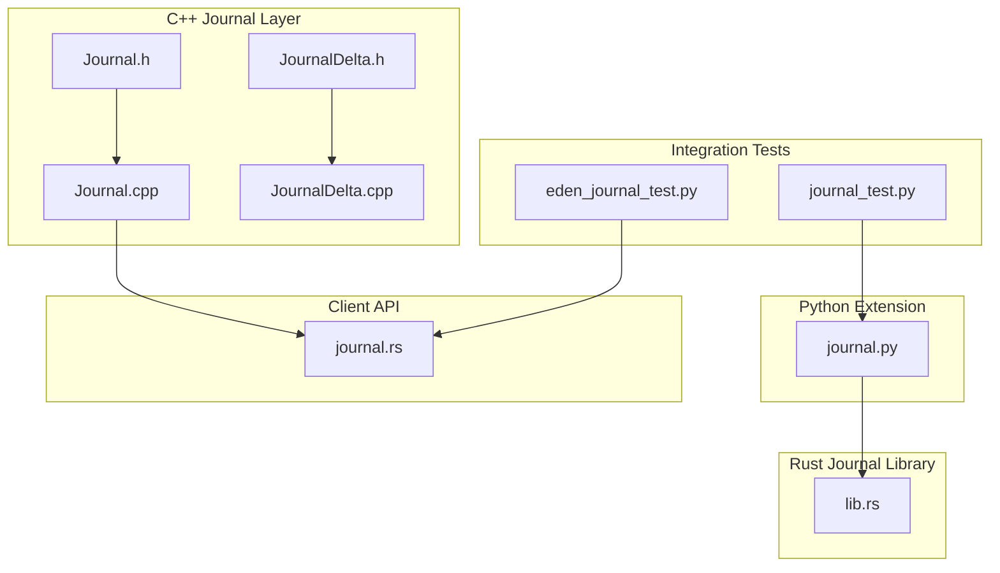

**Diagram sources**
- [Journal.h:1-387](file://eden/fs/journal/Journal.h#L1-L387)
- [Journal.cpp:1-641](file://eden/fs/journal/Journal.cpp#L1-L641)
- [JournalDelta.h:1-231](file://eden/fs/journal/JournalDelta.h#L1-L231)
- [JournalDelta.cpp:1-167](file://eden/fs/journal/JournalDelta.cpp#L1-L167)
- [lib.rs:1-183](file://eden/scm/lib/journal/src/lib.rs#L1-L183)
- [journal.py:1-552](file://eden/scm/sapling/ext/journal.py#L1-L552)
- [journal.rs:1-63](file://eden/fs/cli_rs/edenfs-client/src/journal.rs#L1-L63)
- [eden_journal_test.py:1-275](file://eden/integration/hg/eden_journal_test.py#L1-L275)
- [journal_test.py:1-57](file://eden/integration/hg/journal_test.py#L1-L57)

**Section sources**
- [Journal.h:1-387](file://eden/fs/journal/Journal.h#L1-L387)
- [Journal.cpp:1-641](file://eden/fs/journal/Journal.cpp#L1-L641)
- [JournalDelta.h:1-231](file://eden/fs/journal/JournalDelta.h#L1-L231)
- [JournalDelta.cpp:1-167](file://eden/fs/journal/JournalDelta.cpp#L1-L167)
- [lib.rs:1-183](file://eden/scm/lib/journal/src/lib.rs#L1-L183)
- [journal.py:1-552](file://eden/scm/sapling/ext/journal.py#L1-L552)
- [journal.rs:1-63](file://eden/fs/cli_rs/edenfs-client/src/journal.rs#L1-L63)
- [eden_journal_test.py:1-275](file://eden/integration/hg/eden_journal_test.py#L1-L275)
- [journal_test.py:1-57](file://eden/integration/hg/journal_test.py#L1-L57)

## Core Components
- Journal: Thread-safe in-memory tracker of filesystem changes and root updates. Provides subscription, accumulation, and statistics.
- JournalDelta family: Encodes individual file change and root update events with sequence IDs and timestamps.
- Rust journal library: Persistent Mercurial-style journal with serialization and locking.
- Python extension: Hooks into Mercurial commands and dirstate to record journal entries.
- Client APIs: Expose journal position and streaming journal changes to clients.

Key responsibilities:
- Track overlay file changes (created, removed, changed, renamed, replaced)
- Track root transitions and unclean paths
- Compact and truncate deltas to control memory usage
- Notify subscribers and expose accumulation ranges for change streams
- Persist journal entries for Mercurial repositories

**Section sources**
- [Journal.h:46-210](file://eden/fs/journal/Journal.h#L46-L210)
- [Journal.cpp:104-159](file://eden/fs/journal/Journal.cpp#L104-L159)
- [JournalDelta.h:54-155](file://eden/fs/journal/JournalDelta.h#L54-L155)
- [JournalDelta.cpp:14-133](file://eden/fs/journal/JournalDelta.cpp#L14-L133)
- [lib.rs:21-182](file://eden/scm/lib/journal/src/lib.rs#L21-L182)
- [journal.py:55-178](file://eden/scm/sapling/ext/journal.py#L55-L178)

## Architecture Overview
The journal system comprises:
- C++ Journal: Maintains ordered sequences of FileChange and RootUpdate deltas, with compaction and truncation policies.
- JournalDelta: Defines the structure and semantics of each delta, including path change metadata and root transitions.
- Rust journal library: Provides persistent storage for Mercurial-style journal entries with versioning and locking.
- Python extension: Integrates with Mercurial to record bookmark and working copy parent changes.
- Client APIs: Allow clients to query current journal position and stream changes since a given position.

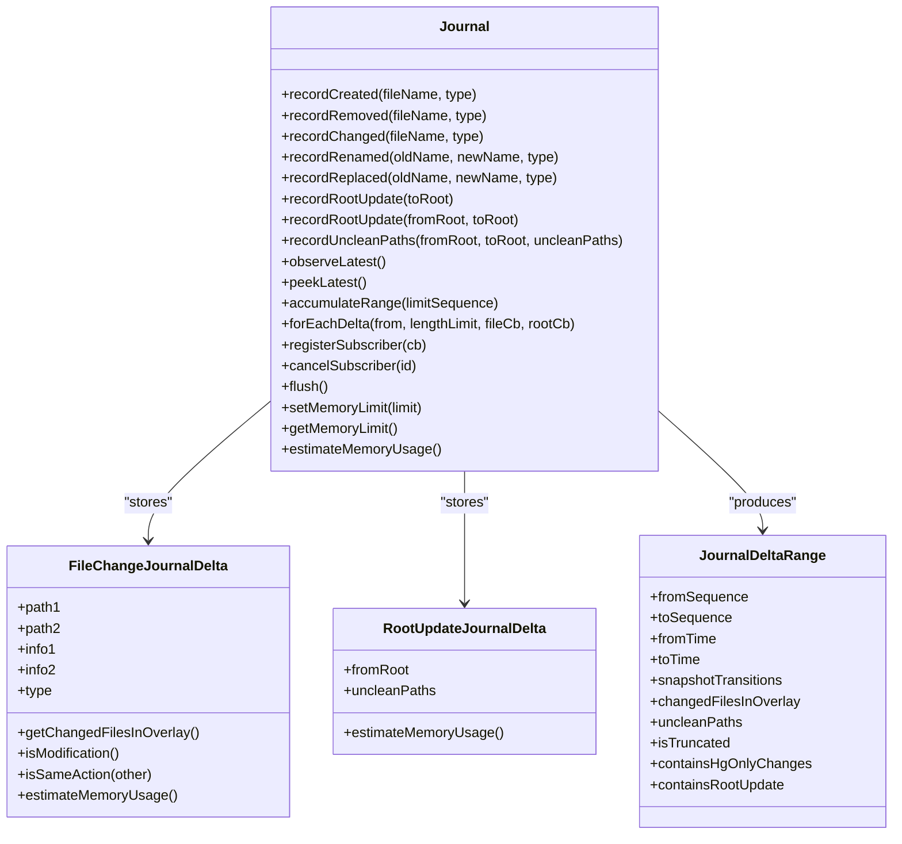

**Diagram sources**
- [Journal.h:62-210](file://eden/fs/journal/Journal.h#L62-L210)
- [Journal.cpp:234-261](file://eden/fs/journal/Journal.cpp#L234-L261)
- [JournalDelta.h:64-155](file://eden/fs/journal/JournalDelta.h#L64-L155)
- [JournalDelta.cpp:111-133](file://eden/fs/journal/JournalDelta.cpp#L111-L133)

**Section sources**
- [Journal.h:46-210](file://eden/fs/journal/Journal.h#L46-L210)
- [Journal.cpp:104-159](file://eden/fs/journal/Journal.cpp#L104-L159)
- [JournalDelta.h:54-155](file://eden/fs/journal/JournalDelta.h#L54-L155)
- [JournalDelta.cpp:14-133](file://eden/fs/journal/JournalDelta.cpp#L14-L133)

## Detailed Component Analysis

### C++ Journal: Recording and Accumulation
- Recording operations:
  - File change operations call addDelta with constructed FileChangeJournalDelta.
  - Root updates call addDelta with RootUpdateJournalDelta and update current root.
- Compaction:
  - Adjacent modification deltas for the same path are compacted to reduce memory and improve aggregation.
- Truncation:
  - When memory exceeds limits, the oldest deltas are dropped from the front.
- Accumulation:
  - accumulateRange merges deltas from a given sequence into a JournalDeltaRange, aggregating changed files and root transitions.
- Subscriptions:
  - Subscribers receive callbacks when new deltas are added; notification coalescing avoids redundant notifications.

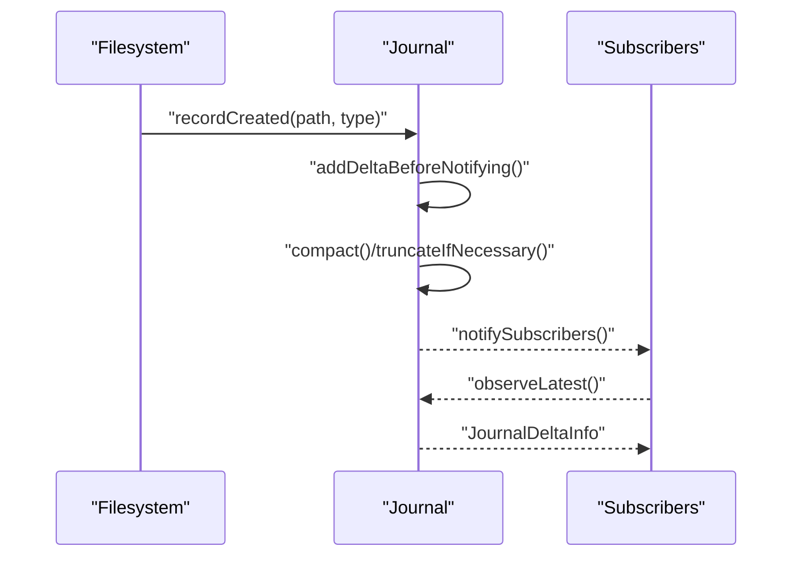

**Diagram sources**
- [Journal.cpp:104-159](file://eden/fs/journal/Journal.cpp#L104-L159)
- [Journal.cpp:191-225](file://eden/fs/journal/Journal.cpp#L191-L225)
- [Journal.cpp:227-242](file://eden/fs/journal/Journal.cpp#L227-L242)

**Section sources**
- [Journal.cpp:104-159](file://eden/fs/journal/Journal.cpp#L104-L159)
- [Journal.cpp:161-189](file://eden/fs/journal/Journal.cpp#L161-L189)
- [Journal.cpp:414-511](file://eden/fs/journal/Journal.cpp#L414-L511)

### Journal Delta Format and Encoding
- FileChangeJournalDelta:
  - Stores up to two paths and their existence before/after states.
  - Supports creation, removal, change, rename, and replace semantics.
  - Provides helpers to compute changed files and detect same-action compaction.
- RootUpdateJournalDelta:
  - Tracks fromRoot and uncleanPaths for checkout-like operations.
- JournalDeltaRange:
  - Aggregates changes across a sequence range, capturing snapshot transitions and changed files.

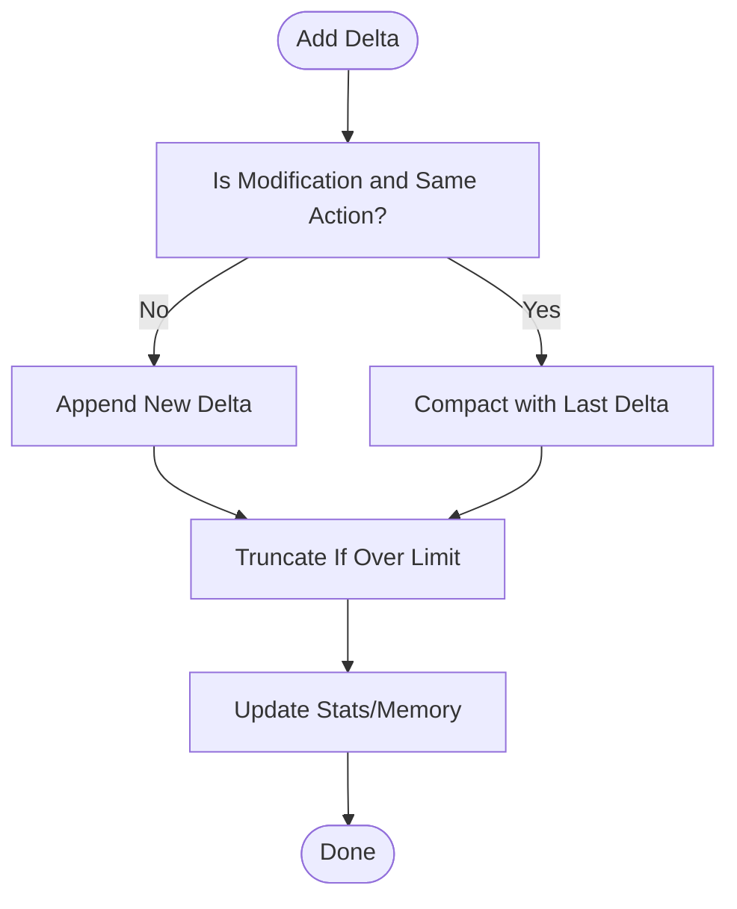

**Diagram sources**
- [Journal.cpp:191-225](file://eden/fs/journal/Journal.cpp#L191-L225)
- [Journal.cpp:161-189](file://eden/fs/journal/Journal.cpp#L161-L189)
- [JournalDelta.cpp:123-133](file://eden/fs/journal/JournalDelta.cpp#L123-L133)

**Section sources**
- [JournalDelta.h:64-155](file://eden/fs/journal/JournalDelta.h#L64-L155)
- [JournalDelta.cpp:14-133](file://eden/fs/journal/JournalDelta.cpp#L14-L133)
- [JournalDelta.h:183-228](file://eden/fs/journal/JournalDelta.h#L183-L228)

### Transaction Management and Rollback
- Root transitions:
  - recordRootUpdate(fromRoot, toRoot) captures transitions and uncleanPaths for recovery scenarios.
- Flush:
  - flush resets the journal while preserving the current root to keep downstream consumers (e.g., Watchman) consistent.
- No explicit rollback API:
  - The journal is append-only and designed for forward accumulation; recovery relies on root transitions and unclean paths.

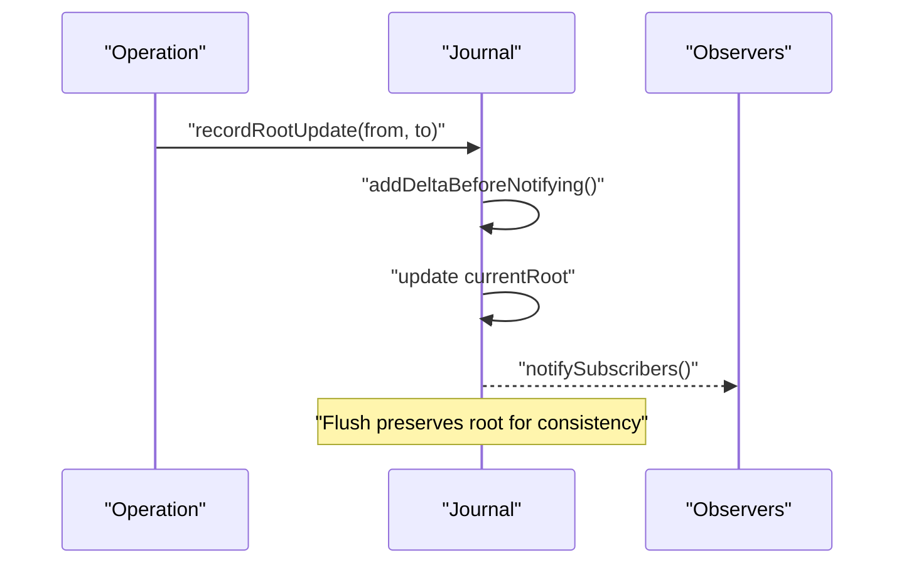

**Diagram sources**
- [Journal.cpp:245-261](file://eden/fs/journal/Journal.cpp#L245-L261)
- [Journal.cpp:388-412](file://eden/fs/journal/Journal.cpp#L388-L412)

**Section sources**
- [Journal.cpp:135-159](file://eden/fs/journal/Journal.cpp#L135-L159)
- [Journal.cpp:388-412](file://eden/fs/journal/Journal.cpp#L388-L412)

### Concurrency Model and Synchronization
- SharedMutex and Synchronized protect delta state and subscribers.
- Notification coalescing uses atomic flags to avoid redundant subscriber invocations.
- forEachDelta iterates in reverse chronological order across interleaved delta types.

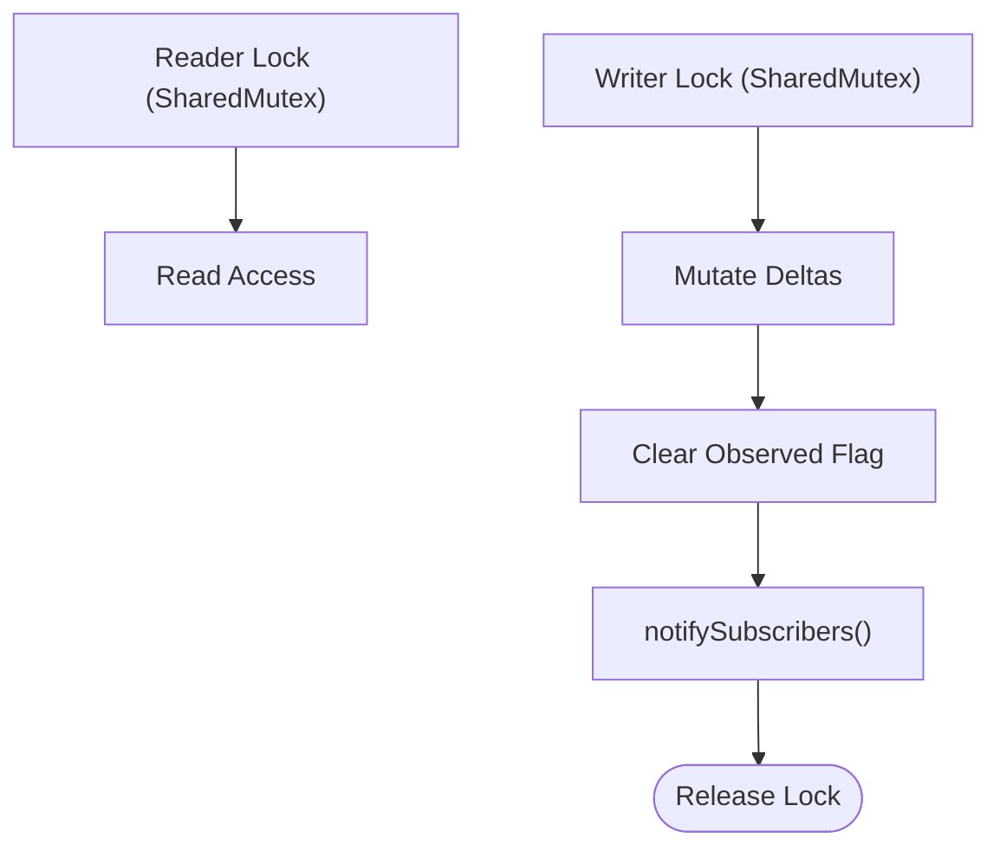

**Diagram sources**
- [Journal.h:328-382](file://eden/fs/journal/Journal.h#L328-L382)
- [Journal.cpp:227-242](file://eden/fs/journal/Journal.cpp#L227-L242)

**Section sources**
- [Journal.h:305-327](file://eden/fs/journal/Journal.h#L305-L327)
- [Journal.cpp:227-242](file://eden/fs/journal/Journal.cpp#L227-L242)

### Relationship to Inode Management and Object Storage
- EdenMountHandle exposes Journal& for subsystems to record changes.
- InodeMap describes loading inodes from ObjectStore; journaling complements this by tracking overlay changes and root transitions used to derive filesets.

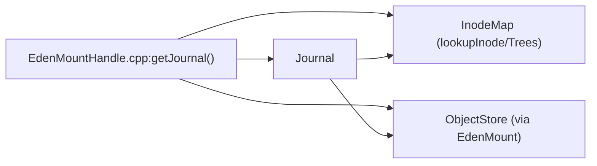

**Diagram sources**
- [EdenMountHandle.cpp:21-23](file://eden/fs/inodes/EdenMountHandle.cpp#L21-L23)
- [InodeMap.h:168-202](file://eden/fs/inodes/InodeMap.h#L168-L202)

**Section sources**
- [EdenMountHandle.cpp:1-25](file://eden/fs/inodes/EdenMountHandle.cpp#L1-L25)
- [InodeMap.h:168-202](file://eden/fs/inodes/InodeMap.h#L168-L202)

### Client Integration and Streaming
- Client APIs:
  - getCurrentJournalPosition retrieves the current journal position.
  - streamJournalChanged streams journal position updates asynchronously.
- Integration tests:
  - Verify journal position advances after writes and that streaming APIs return expected changes.

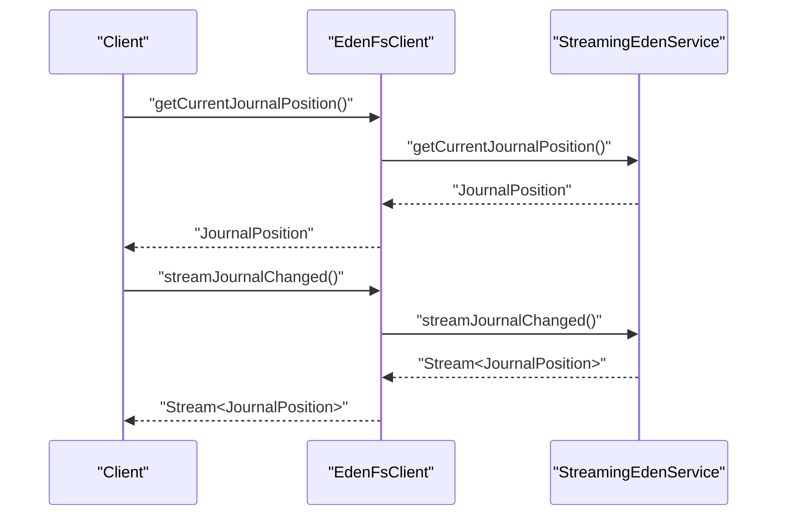

**Diagram sources**
- [journal.rs:24-61](file://eden/fs/cli_rs/edenfs-client/src/journal.rs#L24-L61)
- [eden_journal_test.py:38-51](file://eden/integration/hg/eden_journal_test.py#L38-L51)

**Section sources**
- [journal.rs:24-61](file://eden/fs/cli_rs/edenfs-client/src/journal.rs#L24-L61)
- [eden_journal_test.py:38-51](file://eden/integration/hg/eden_journal_test.py#L38-L51)

### Mercurial Journal Persistence (Rust)
- Persistent journal entries with versioning and locking.
- Serialization format separates fields with newlines and hashes with commas.
- Records command, user, namespace/name, and old/new hash tuples.

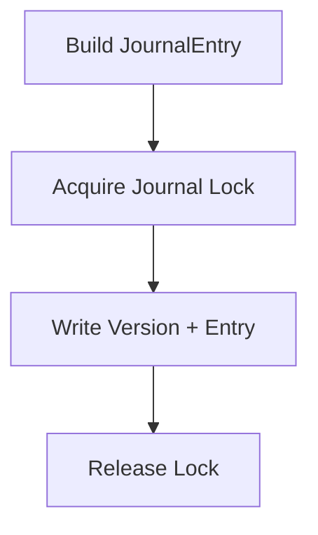

**Diagram sources**
- [lib.rs:125-182](file://eden/scm/lib/journal/src/lib.rs#L125-L182)

**Section sources**
- [lib.rs:21-182](file://eden/scm/lib/journal/src/lib.rs#L21-L182)

### Python Extension Hooks (Mercurial)
- Hooks into Mercurial commands and dirstate to record journal entries.
- Supports shared working copy journal propagation and filtering by namespace/name.

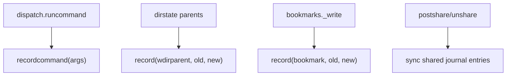

**Diagram sources**
- [journal.py:55-178](file://eden/scm/sapling/ext/journal.py#L55-L178)

**Section sources**
- [journal.py:55-178](file://eden/scm/sapling/ext/journal.py#L55-L178)

## Dependency Analysis
- Journal depends on:
  - JournalDelta types for representation
  - folly::Synchronized and SharedMutex for concurrency
  - EdenStats for metrics
- Client APIs depend on Thrift-generated types and streaming clients.
- Python extension depends on Rust journal library for serialization.

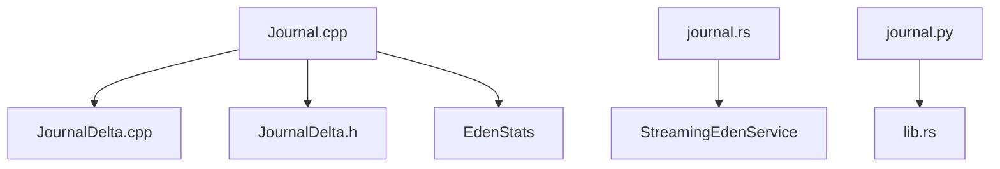

**Diagram sources**
- [Journal.cpp:1-20](file://eden/fs/journal/Journal.cpp#L1-L20)
- [JournalDelta.cpp:1-10](file://eden/fs/journal/JournalDelta.cpp#L1-L10)
- [journal.rs:18-22](file://eden/fs/cli_rs/edenfs-client/src/journal.rs#L18-L22)
- [journal.py:17-17](file://eden/scm/sapling/ext/journal.py#L17-L17)

**Section sources**
- [Journal.cpp:1-20](file://eden/fs/journal/Journal.cpp#L1-L20)
- [JournalDelta.cpp:1-10](file://eden/fs/journal/JournalDelta.cpp#L1-L10)
- [journal.rs:18-22](file://eden/fs/cli_rs/edenfs-client/src/journal.rs#L18-L22)
- [journal.py:17-17](file://eden/scm/sapling/ext/journal.py#L17-L17)

## Performance Considerations
- Memory control:
  - Memory limit enforced via truncateIfNecessary; compaction reduces memory footprint for repeated modifications.
- Iteration cost:
  - forEachDelta traverses interleaved deques in reverse; lengthLimit can constrain traversal.
- Metrics:
  - Journal tracks files accumulated and duration of accumulateRange for diagnostics.

Recommendations:
- Tune memory limits for workloads with frequent small changes.
- Use accumulateRange with appropriate fromSequence to avoid scanning entire history.
- Monitor truncated reads and filesAccumulated counters to assess coverage.

**Section sources**
- [Journal.cpp:161-189](file://eden/fs/journal/Journal.cpp#L161-L189)
- [Journal.cpp:513-533](file://eden/fs/journal/Journal.cpp#L513-L533)
- [Journal.cpp:414-511](file://eden/fs/journal/Journal.cpp#L414-L511)

## Troubleshooting Guide
Common issues and resolutions:
- Journal appears truncated:
  - Occurs when requested fromSequence precedes remembered history; accumulateRange sets isTruncated accordingly.
- Corrupted journal entries (Mercurial):
  - Python extension skips malformed entries and warns; re-open or repair as needed.
- Deadlocks or slow notifications:
  - Keep subscriber callbacks lightweight; avoid heavy work inside callbacks.
- Streaming not advancing:
  - Ensure getCurrentJournalPosition reflects changes and streamJournalChanged is subscribed.

Operational checks:
- Verify journal position advances after writes.
- Inspect journal entries via Mercurial journal command.
- Monitor truncatedReads and filesAccumulated metrics.

**Section sources**
- [Journal.cpp:423-425](file://eden/fs/journal/Journal.cpp#L423-L425)
- [journal.py:442-444](file://eden/scm/sapling/ext/journal.py#L442-L444)
- [eden_journal_test.py:38-51](file://eden/integration/hg/eden_journal_test.py#L38-L51)

## Conclusion
EdenFS journaling provides a robust, thread-safe mechanism for tracking filesystem changes and root transitions. Its delta-based design enables efficient accumulation and streaming, while compaction and truncation keep memory usage manageable. The system integrates with inode management and object storage to maintain consistency across the filesystem layer. For Mercurial repositories, a separate persistent journal ensures long-term auditability. Together, these components deliver reliable transaction-like semantics for change tracking and recovery.