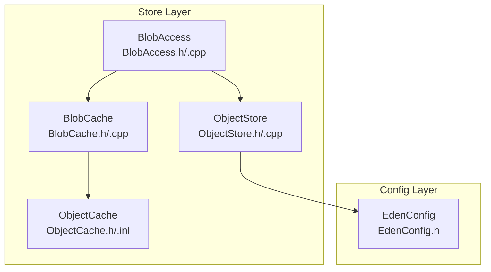
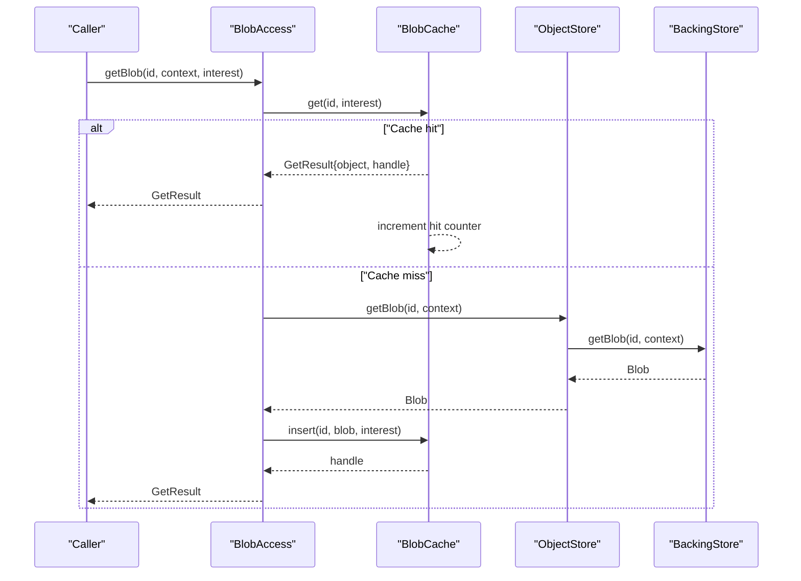
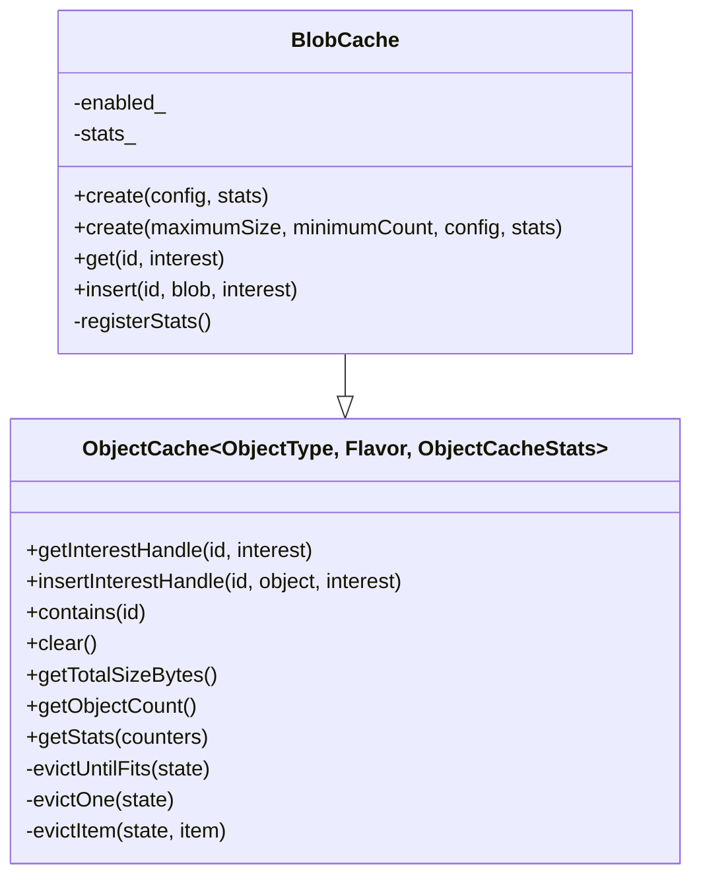
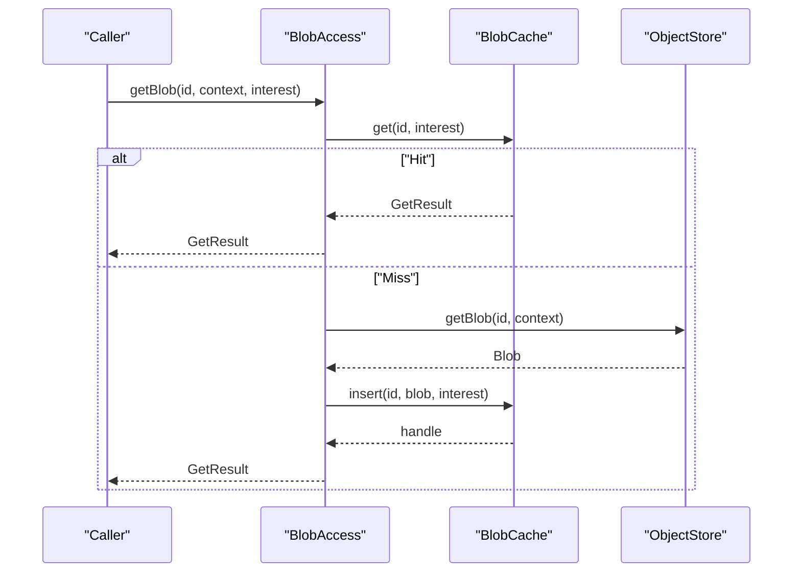
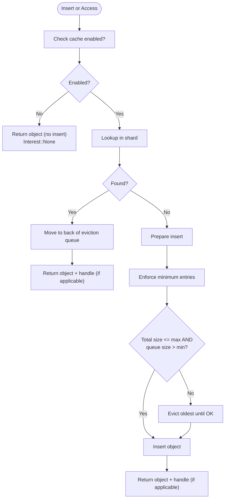
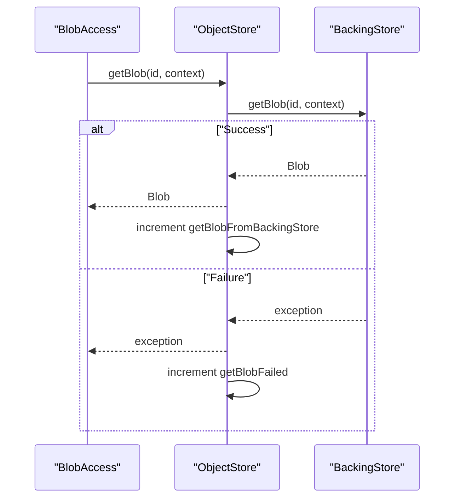
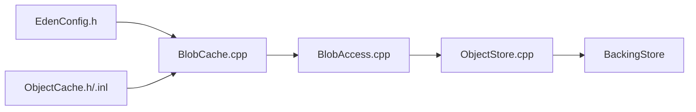

# Blob Cache System

<cite>
**Referenced Files in This Document**
- [BlobCache.h](file://eden/fs/store/BlobCache.h)
- [BlobCache.cpp](file://eden/fs/store/BlobCache.cpp)
- [BlobAccess.h](file://eden/fs/store/BlobAccess.h)
- [BlobAccess.cpp](file://eden/fs/store/BlobAccess.cpp)
- [ObjectCache.h](file://eden/fs/store/ObjectCache.h)
- [ObjectCache-inl.h](file://eden/fs/store/ObjectCache-inl.h)
- [ObjectStore.h](file://eden/fs/store/ObjectStore.h)
- [ObjectStore.cpp](file://eden/fs/store/ObjectStore.cpp)
- [EdenConfig.h](file://eden/fs/config/EdenConfig.h)
- [BlobCacheTest.cpp](file://eden/fs/store/test/BlobCacheTest.cpp)
- [BlobAccessTest.cpp](file://eden/fs/store/test/BlobAccessTest.cpp)
</cite>

## Table of Contents
1. [Introduction](#introduction)
2. [Project Structure](#project-structure)
3. [Core Components](#core-components)
4. [Architecture Overview](#architecture-overview)
5. [Detailed Component Analysis](#detailed-component-analysis)
6. [Dependency Analysis](#dependency-analysis)
7. [Performance Considerations](#performance-considerations)
8. [Troubleshooting Guide](#troubleshooting-guide)
9. [Conclusion](#conclusion)

## Introduction
This document explains the blob cache system in EdenFS object store architecture. It covers the BlobCache class, cache storage strategies, memory management, eviction policies, and integration with the ObjectStore. It also documents cache lookup procedures, hit/miss scenarios, performance optimization techniques, memory usage patterns, configuration options, and troubleshooting strategies for cache-related issues.

## Project Structure
The blob cache system is implemented in the store subsystem and integrates with the broader object store and configuration layers:
- BlobCache: in-memory LRU cache specialized for Blob objects
- BlobAccess: client-facing API for blob retrieval with cache-aware semantics
- ObjectCache: generic LRU cache base class with InterestHandle flavor
- ObjectStore: orchestrates backing store access and integrates BlobCache
- EdenConfig: exposes cache-related configuration settings

**Diagram sources**
- [BlobCache.h:32-35](file://eden/fs/store/BlobCache.h#L32-L35)
- [BlobCache.cpp:37-64](file://eden/fs/store/BlobCache.cpp#L37-L64)
- [BlobAccess.h:34-84](file://eden/fs/store/BlobAccess.h#L34-L84)
- [BlobAccess.cpp:18-53](file://eden/fs/store/BlobAccess.cpp#L18-L53)
- [ObjectCache.h:118-123](file://eden/fs/store/ObjectCache.h#L118-L123)
- [ObjectStore.h:507-514](file://eden/fs/store/ObjectStore.h#L507-L514)
- [EdenConfig.h:1669-1689](file://eden/fs/config/EdenConfig.h#L1669-L1689)

**Section sources**
- [BlobCache.h:1-113](file://eden/fs/store/BlobCache.h#L1-L113)
- [BlobCache.cpp:1-81](file://eden/fs/store/BlobCache.cpp#L1-L81)
- [BlobAccess.h:1-87](file://eden/fs/store/BlobAccess.h#L1-L87)
- [BlobAccess.cpp:1-56](file://eden/fs/store/BlobAccess.cpp#L1-L56)
- [ObjectCache.h:1-444](file://eden/fs/store/ObjectCache.h#L1-L444)
- [ObjectStore.h:431-519](file://eden/fs/store/ObjectStore.h#L431-L519)
- [EdenConfig.h:1664-1689](file://eden/fs/config/EdenConfig.h#L1664-L1689)

## Core Components
- BlobCache
  - Purpose: in-memory LRU cache for Blob objects with dual constraints: maximum cache size (bytes) and minimum entry count
  - Behavior: respects Interest hints to influence eviction; honors global enablement flag
  - Exposes get() and insert() APIs; registers dynamic counters for memory and item counts
- BlobAccess
  - Purpose: centralized blob access interface that checks BlobCache first, falls back to ObjectStore, and inserts results back into BlobCache
  - Supports both immediate and coroutine-based retrieval
- ObjectCache (base)
  - Purpose: generic LRU cache with InterestHandle flavor
  - Features: per-object reference counting, generation-based safety for interest handles, sharded state for concurrency, eviction loop with minimum entry enforcement
- ObjectStore
  - Purpose: retrieves blobs from backing store and integrates with BlobCache via BlobAccess
- EdenConfig
  - Purpose: provides runtime configuration for enabling in-memory blob caching and cache sizing

Key configuration options:
- blobcache:enable-in-memory-blob-caching (boolean)
- blobcache:cache-size (bytes)
- blobcache:minimum-items (count)

**Section sources**
- [BlobCache.h:20-97](file://eden/fs/store/BlobCache.h#L20-L97)
- [BlobCache.cpp:17-78](file://eden/fs/store/BlobCache.cpp#L17-L78)
- [BlobAccess.h:23-76](file://eden/fs/store/BlobAccess.h#L23-L76)
- [BlobAccess.cpp:25-53](file://eden/fs/store/BlobAccess.cpp#L25-L53)
- [ObjectCache.h:92-116](file://eden/fs/store/ObjectCache.h#L92-L116)
- [ObjectStore.h:507-514](file://eden/fs/store/ObjectStore.h#L507-L514)
- [EdenConfig.h:1669-1689](file://eden/fs/config/EdenConfig.h#L1669-L1689)

## Architecture Overview
The blob cache sits between BlobAccess and ObjectStore, and optionally interacts with the backing store depending on cache hit/miss outcomes.

**Diagram sources**
- [BlobAccess.cpp:25-53](file://eden/fs/store/BlobAccess.cpp#L25-L53)
- [ObjectStore.cpp:543-560](file://eden/fs/store/ObjectStore.cpp#L543-L560)
- [BlobCache.cpp:17-35](file://eden/fs/store/BlobCache.cpp#L17-L35)

## Detailed Component Analysis

### BlobCache
BlobCache extends the generic ObjectCache with Blob-specific semantics and configuration-driven behavior.

- Construction
  - Can be created from ReloadableConfig (reads cache size, minimum items, and enablement)
  - Can be created with explicit maximum size and minimum count
- Lookup
  - get(id, interest) checks enabled flag and delegates to base getInterestHandle
  - Increments memory hit counter when a cached object is returned
- Insertion
  - insert(id, blob, interest) respects enabled flag and delegates to base insertInterestHandle
- Telemetry
  - Registers dynamic counters for memory usage and item count
- Configuration
  - Controlled by enableInMemoryBlobCaching, inMemoryBlobCacheSize, inMemoryBlobCacheMinimumItems

**Diagram sources**
- [ObjectCache.h:118-123](file://eden/fs/store/ObjectCache.h#L118-L123)
- [BlobCache.h:32-35](file://eden/fs/store/BlobCache.h#L32-L35)
- [BlobCache.cpp:37-64](file://eden/fs/store/BlobCache.cpp#L37-L64)

**Section sources**
- [BlobCache.h:38-110](file://eden/fs/store/BlobCache.h#L38-L110)
- [BlobCache.cpp:17-78](file://eden/fs/store/BlobCache.cpp#L17-L78)
- [EdenConfig.h:1669-1689](file://eden/fs/config/EdenConfig.h#L1669-L1689)

### BlobAccess
BlobAccess encapsulates blob retrieval with cache awareness:
- getBlob(): immediate retrieval path
- co_getBlob(): coroutine-based retrieval path
- First checks BlobCache; if miss, retrieves via ObjectStore and inserts into BlobCache
- Returns both the blob and an interest handle for cache lifecycle management

**Diagram sources**
- [BlobAccess.cpp:25-53](file://eden/fs/store/BlobAccess.cpp#L25-L53)

**Section sources**
- [BlobAccess.h:59-76](file://eden/fs/store/BlobAccess.h#L59-L76)
- [BlobAccess.cpp:25-53](file://eden/fs/store/BlobAccess.cpp#L25-L53)

### ObjectCache Base (LRU Engine)
ObjectCache implements the core LRU eviction engine:
- Dual flavor support: Simple and InterestHandle
- InterestHandle flavor augments cache with reference counting and generation-based safety
- Sharded state for concurrency control
- Eviction policy:
  - Evicts from the front of the LRU queue
  - Continues evicting until total size <= maximum size AND queue size > minimum entry count
  - Minimum entry count ensures frequently accessed large blobs are preserved

**Diagram sources**
- [ObjectCache-inl.h:517-542](file://eden/fs/store/ObjectCache-inl.h#L517-L542)
- [ObjectCache-inl.h:548-564](file://eden/fs/store/ObjectCache-inl.h#L548-L564)

**Section sources**
- [ObjectCache.h:92-116](file://eden/fs/store/ObjectCache.h#L92-L116)
- [ObjectCache-inl.h:517-564](file://eden/fs/store/ObjectCache-inl.h#L517-L564)

### ObjectStore Integration
ObjectStore retrieves blobs from the backing store and updates telemetry:
- getBlobImpl() forwards to backing store and increments counters for backing store hits and failures
- co_getBlob() provides coroutine variant
- Integrates with BlobAccess for cache-aware retrieval

**Diagram sources**
- [ObjectStore.cpp:543-560](file://eden/fs/store/ObjectStore.cpp#L543-L560)

**Section sources**
- [ObjectStore.h:458-464](file://eden/fs/store/ObjectStore.h#L458-L464)
- [ObjectStore.cpp:543-560](file://eden/fs/store/ObjectStore.cpp#L543-L560)

## Dependency Analysis
BlobCache depends on:
- ObjectCache base for LRU mechanics
- EdenConfig for runtime configuration
- EdenStats for telemetry counters

BlobAccess depends on:
- BlobCache for cache operations
- ObjectStore for backing store retrieval

ObjectStore depends on:
- BackingStore for physical retrieval
- EdenConfig for metadata cache tuning

**Diagram sources**
- [BlobCache.cpp:37-64](file://eden/fs/store/BlobCache.cpp#L37-L64)
- [ObjectCache.h:118-123](file://eden/fs/store/ObjectCache.h#L118-L123)
- [BlobAccess.cpp:18-21](file://eden/fs/store/BlobAccess.cpp#L18-L21)
- [ObjectStore.cpp:46-64](file://eden/fs/store/ObjectStore.cpp#L46-L64)

**Section sources**
- [BlobCache.cpp:37-64](file://eden/fs/store/BlobCache.cpp#L37-L64)
- [BlobAccess.cpp:18-21](file://eden/fs/store/BlobAccess.cpp#L18-L21)
- [ObjectStore.cpp:46-64](file://eden/fs/store/ObjectStore.cpp#L46-L64)

## Performance Considerations
- Cache sizing
  - Set blobcache:cache-size to bound memory usage
  - Use blobcache:minimum-items to protect frequently accessed large blobs
- Interest hints
  - Prefer WantHandle for short-lived bursts to allow precise eviction when handles drop
  - Use LikelyNeededAgain for sustained reuse to avoid repeated insertions
  - Use UnlikelyNeededAgain to bypass caching when blobs are used once
- Concurrency
  - ObjectCache uses sharded state to reduce contention; ensure appropriate shard count via related configuration
- Telemetry
  - Monitor dynamic counters for blob_cache.memory and blob_cache.items to track utilization
- Backing store pressure
  - Misses increment getBlobFromBackingStore; tune cache size and interest hints to improve hit rates

[No sources needed since this section provides general guidance]

## Troubleshooting Guide
Common issues and resolutions:
- Cache disabled unexpectedly
  - Symptom: get() always returns empty; insert() does not increase memory usage
  - Cause: blobcache:enable-in-memory-blob-caching is false
  - Resolution: enable the setting or construct BlobCache with explicit parameters
  - Evidence: BlobCache constructor logs and tests demonstrate disabled behavior
- Frequent cache misses
  - Symptom: high backing store fetches
  - Actions: increase cache size, raise minimum items, adjust interest hints to LikelyNeededAgain or WantHandle
- Memory growth beyond expectations
  - Symptom: blob_cache.memory near or exceeding cache-size
  - Actions: reduce cache size, increase minimum items to preserve hot objects, drop interest handles promptly
- Eviction timing
  - Symptom: hot large blobs evicted
  - Actions: increase minimum items to protect frequently accessed large blobs

Validation references:
- Disabled caching behavior and counters
  - [BlobCache.cpp:61-63](file://eden/fs/store/BlobCache.cpp#L61-L63)
  - [BlobCacheTest.cpp:130-159](file://eden/fs/store/test/BlobCacheTest.cpp#L130-L159)
- Eviction and minimum entry enforcement
  - [ObjectCache-inl.h:517-542](file://eden/fs/store/ObjectCache-inl.h#L517-L542)
  - [BlobCacheTest.cpp:74-86](file://eden/fs/store/test/BlobCacheTest.cpp#L74-L86)
- Interest handle lifecycle and eviction
  - [ObjectCache-inl.h:480-511](file://eden/fs/store/ObjectCache-inl.h#L480-L511)
  - [BlobCacheTest.cpp:103-128](file://eden/fs/store/test/BlobCacheTest.cpp#L103-L128)

**Section sources**
- [BlobCache.cpp:61-63](file://eden/fs/store/BlobCache.cpp#L61-L63)
- [BlobCacheTest.cpp:130-159](file://eden/fs/store/test/BlobCacheTest.cpp#L130-L159)
- [ObjectCache-inl.h:517-542](file://eden/fs/store/ObjectCache-inl.h#L517-L542)
- [BlobCacheTest.cpp:74-86](file://eden/fs/store/test/BlobCacheTest.cpp#L74-L86)
- [ObjectCache-inl.h:480-511](file://eden/fs/store/ObjectCache-inl.h#L480-L511)

## Conclusion
The EdenFS blob cache system provides a robust, configurable, and thread-safe LRU cache tailored for Blob objects. BlobCache leverages ObjectCache’s InterestHandle flavor to balance hit rate and memory usage, integrating tightly with BlobAccess and ObjectStore. Proper configuration of enablement, cache size, and minimum items, combined with thoughtful use of interest hints, yields optimal performance and predictable memory behavior.