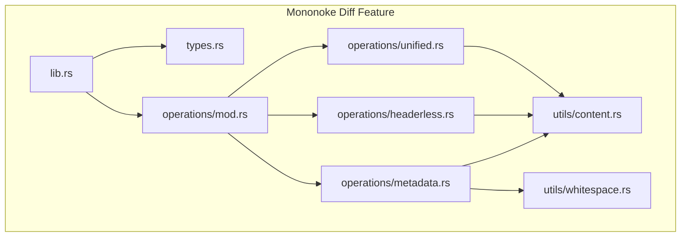
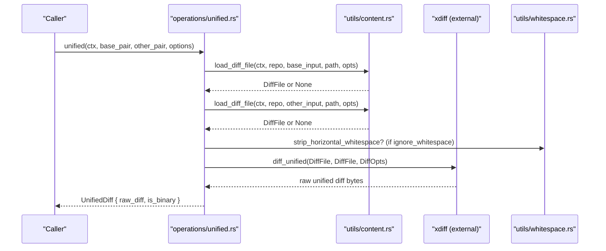
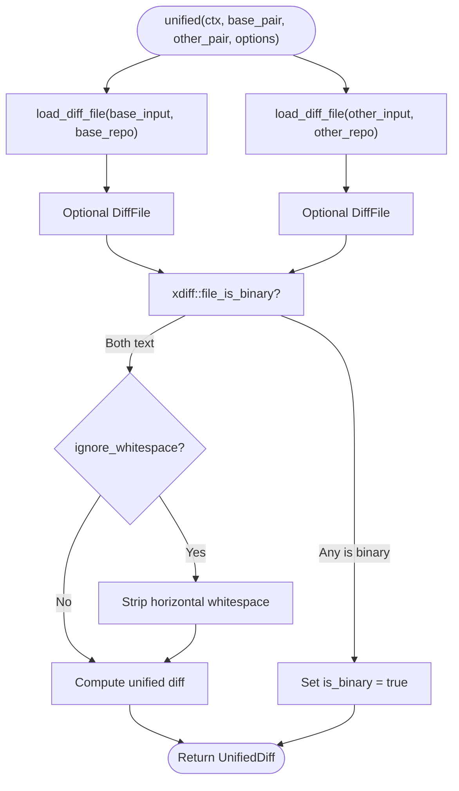
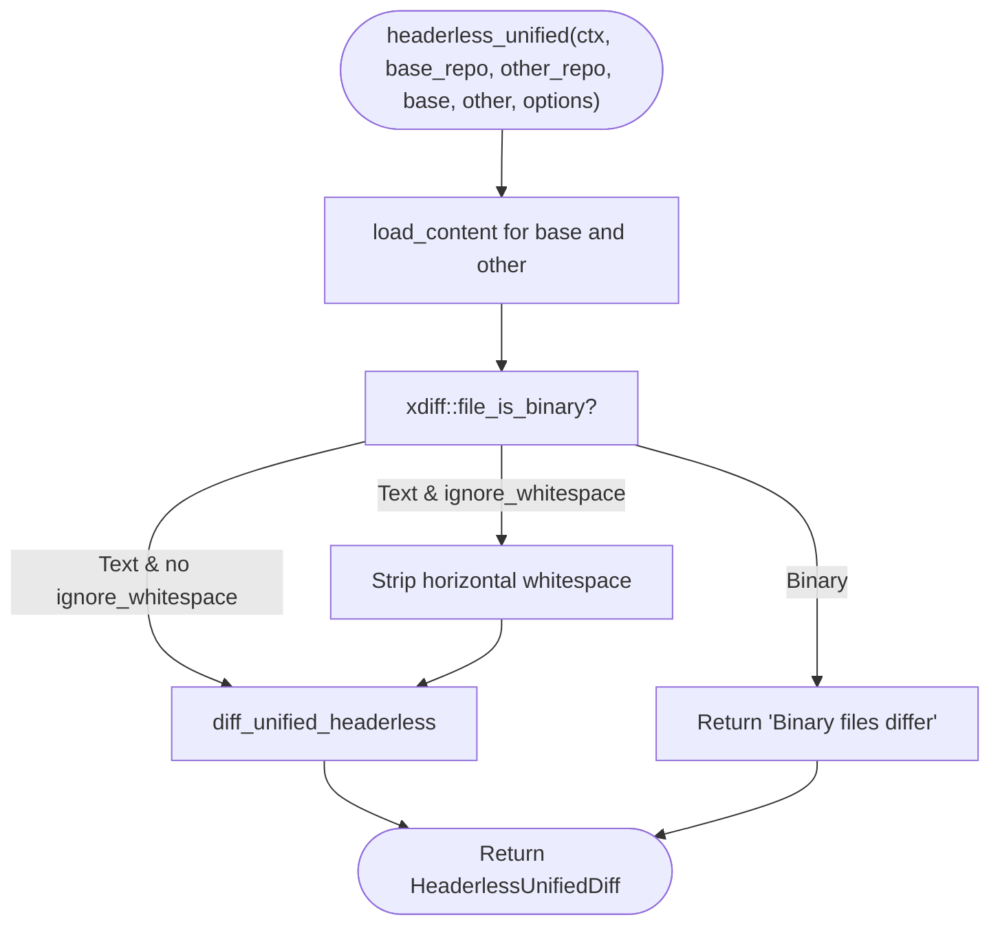
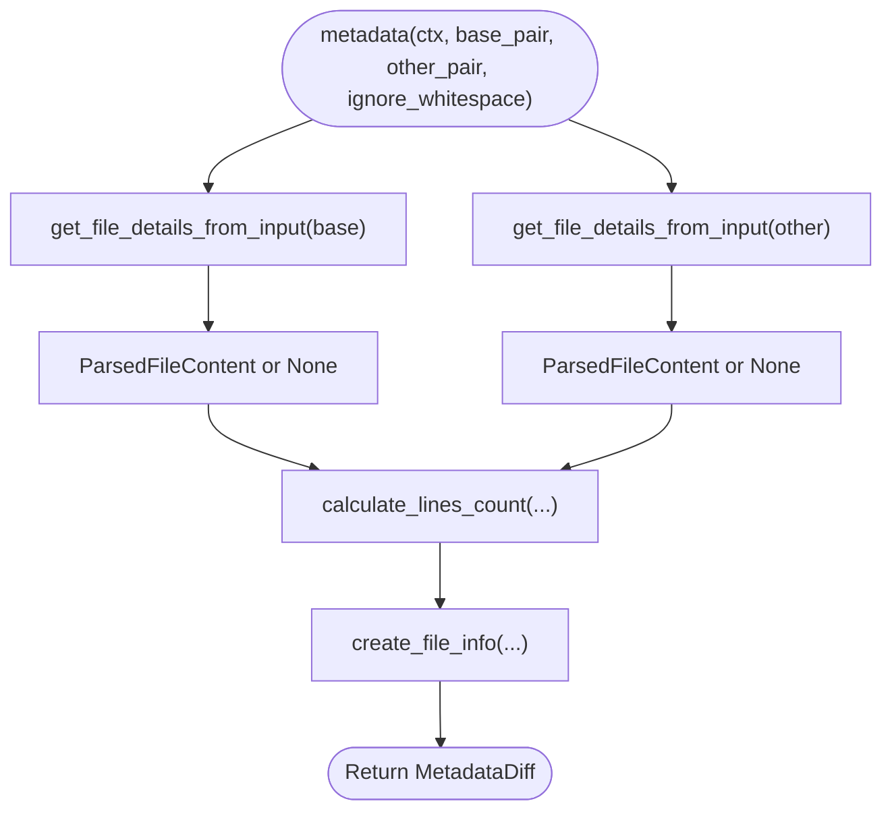
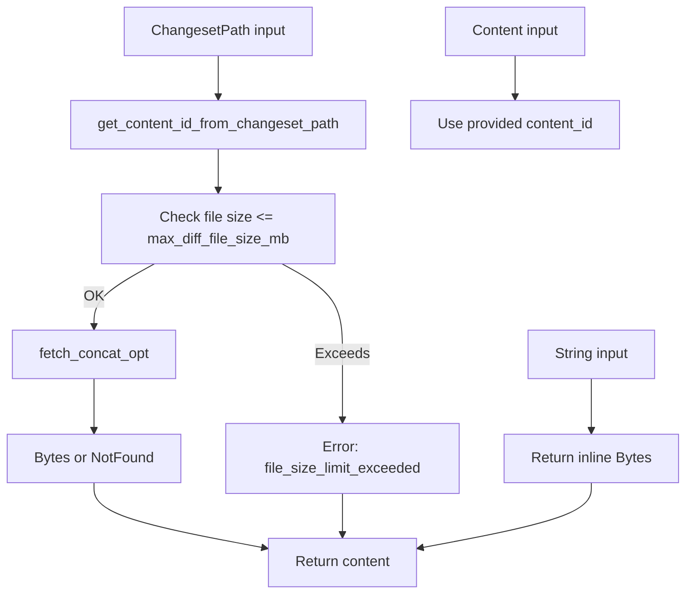
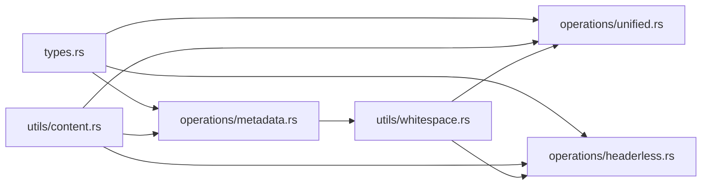

# Diff Operations

<cite>
**Referenced Files in This Document**
- [lib.rs](file://eden/mononoke/features/diff/src/lib.rs)
- [types.rs](file://eden/mononoke/features/diff/src/types.rs)
- [operations/mod.rs](file://eden/mononoke/features/diff/src/operations/mod.rs)
- [operations/unified.rs](file://eden/mononoke/features/diff/src/operations/unified.rs)
- [operations/headerless.rs](file://eden/mononoke/features/diff/src/operations/headerless.rs)
- [operations/metadata.rs](file://eden/mononoke/features/diff/src/operations/metadata.rs)
- [utils/content.rs](file://eden/mononoke/features/diff/src/utils/content.rs)
- [utils/whitespace.rs](file://eden/mononoke/features/diff/src/utils/whitespace.rs)
</cite>

## Table of Contents
1. [Introduction](#introduction)
2. [Project Structure](#project-structure)
3. [Core Components](#core-components)
4. [Architecture Overview](#architecture-overview)
5. [Detailed Component Analysis](#detailed-component-analysis)
6. [Dependency Analysis](#dependency-analysis)
7. [Performance Considerations](#performance-considerations)
8. [Troubleshooting Guide](#troubleshooting-guide)
9. [Conclusion](#conclusion)

## Introduction
This document explains the diff operations in the Mononoke diff feature crate that powers unified and headerless diff computation, metadata diffing, and related utilities. It focuses on how the system compares content across repositories, handles file types and LFS pointers, strips whitespace for whitespace-insensitive comparisons, and computes metadata such as line counts and generated status. It also covers performance characteristics, memory-aware loading, and integration points with repository state and derived data.

## Project Structure
The diff feature crate is organized into modules that encapsulate distinct responsibilities:
- operations: high-level diff entry points (unified, headerless, metadata)
- types: domain types and conversions for diff inputs, options, and results
- utils: content loading, LFS pointer detection, and whitespace normalization

**Diagram sources**
- [lib.rs:1-20](file://eden/mononoke/features/diff/src/lib.rs#L1-L20)
- [types.rs:1-268](file://eden/mononoke/features/diff/src/types.rs#L1-L268)
- [operations/mod.rs:1-12](file://eden/mononoke/features/diff/src/operations/mod.rs#L1-L12)
- [operations/unified.rs:1-809](file://eden/mononoke/features/diff/src/operations/unified.rs#L1-L809)
- [operations/headerless.rs:1-586](file://eden/mononoke/features/diff/src/operations/headerless.rs#L1-L586)
- [operations/metadata.rs:1-1449](file://eden/mononoke/features/diff/src/operations/metadata.rs#L1-L1449)
- [utils/content.rs:1-418](file://eden/mononoke/features/diff/src/utils/content.rs#L1-L418)
- [utils/whitespace.rs:1-55](file://eden/mononoke/features/diff/src/utils/whitespace.rs#L1-L55)

**Section sources**
- [lib.rs:1-20](file://eden/mononoke/features/diff/src/lib.rs#L1-L20)
- [operations/mod.rs:1-12](file://eden/mononoke/features/diff/src/operations/mod.rs#L1-L12)

## Core Components
- Unified diff: Computes a unified diff between two inputs (base and other), supporting cross-repository scenarios and optional LFS inspection and content omission.
- Headerless unified diff: Computes a unified diff without headers, useful for contexts where headers are not desired.
- Metadata diff: Computes file type, content type, generated status, and line counts (added/deleted/significant) for two inputs.
- Content loader: Loads content by content ID, detects LFS pointers, enforces size limits, and resolves file info from changesets.
- Whitespace utilities: Strips horizontal whitespace for whitespace-insensitive diffs while preserving line boundaries.

Key types:
- DiffSingleInput variants: ChangesetPath, Content, String
- UnifiedDiffOpts and HeaderlessDiffOpts: Options controlling context, copy info, file type, LFS inspection, content omission, and whitespace handling
- Metadata structures: FileInfo, LinesCount, Generated status, and conversion helpers

**Section sources**
- [operations/unified.rs:24-86](file://eden/mononoke/features/diff/src/operations/unified.rs#L24-L86)
- [operations/headerless.rs:20-90](file://eden/mononoke/features/diff/src/operations/headerless.rs#L20-L90)
- [operations/metadata.rs:428-477](file://eden/mononoke/features/diff/src/operations/metadata.rs#L428-L477)
- [utils/content.rs:43-102](file://eden/mononoke/features/diff/src/utils/content.rs#L43-L102)
- [utils/whitespace.rs:10-22](file://eden/mononoke/features/diff/src/utils/whitespace.rs#L10-L22)
- [types.rs:18-268](file://eden/mononoke/features/diff/src/types.rs#L18-L268)

## Architecture Overview
The diff pipeline follows a layered design:
- Inputs: DiffSingleInput supports three modes: changeset path (resolves content via derived data), content ID (direct blobstore fetch), and string (inline content).
- Loading: Content loader resolves content IDs, checks sizes, and optionally detects LFS pointers.
- Computation: Unified and headerless diff compute textual diffs using an underlying xdiff engine; metadata diff computes file characteristics and line counts.
- Output: Results are returned as structured types with optional binary detection and content omission.

**Diagram sources**
- [operations/unified.rs:28-86](file://eden/mononoke/features/diff/src/operations/unified.rs#L28-L86)
- [utils/content.rs:350-417](file://eden/mononoke/features/diff/src/utils/content.rs#L350-L417)
- [utils/whitespace.rs:94-112](file://eden/mononoke/features/diff/src/utils/whitespace.rs#L94-L112)

## Detailed Component Analysis

### Unified Diff
Computes a unified diff between two inputs with support for:
- Cross-bubble diffs via separate repos for base and other
- Optional LFS pointer inspection and content omission
- Whitespace-insensitive diffs by stripping horizontal whitespace prior to diffing
- Binary detection and appropriate handling

Processing logic:
- Resolve base and other inputs concurrently
- Detect binary content; if not binary and ignore_whitespace is set, strip whitespace from inline content
- Convert options to xdiff::DiffOpts and spawn blocking computation
- Return UnifiedDiff with raw bytes and binary flag

**Diagram sources**
- [operations/unified.rs:28-86](file://eden/mononoke/features/diff/src/operations/unified.rs#L28-L86)
- [utils/whitespace.rs:94-112](file://eden/mononoke/features/diff/src/utils/whitespace.rs#L94-L112)

**Section sources**
- [operations/unified.rs:24-86](file://eden/mononoke/features/diff/src/operations/unified.rs#L24-L86)

### Headerless Unified Diff
Computes a headerless unified diff between two inputs:
- Loads raw bytes for base and other
- Detects binary content
- Optionally strips horizontal whitespace when ignore_whitespace is enabled
- Uses xdiff::diff_unified_headerless for non-binary content

**Diagram sources**
- [operations/headerless.rs:24-90](file://eden/mononoke/features/diff/src/operations/headerless.rs#L24-L90)

**Section sources**
- [operations/headerless.rs:20-90](file://eden/mononoke/features/diff/src/operations/headerless.rs#L20-L90)

### Metadata Diff
Computes metadata about files and line counts:
- Resolves file info from inputs (changeset path, content, or string)
- Detects file type, content type, and generated status
- Computes added/deleted/significant line counts using xdiff hunks
- Handles special cases like binary, non-UTF-8, LFS pointers, and Git submodules

**Diagram sources**
- [operations/metadata.rs:428-477](file://eden/mononoke/features/diff/src/operations/metadata.rs#L428-L477)

**Section sources**
- [operations/metadata.rs:428-477](file://eden/mononoke/features/diff/src/operations/metadata.rs#L428-L477)

### Content Loading and LFS Pointer Detection
Responsibilities:
- Load content by content ID from blobstore with size limit enforcement
- Resolve content ID from changeset path via derived data manifests
- Detect LFS pointers and extract metadata when configured
- Support string inputs and omitted content for large/binary/LFS scenarios

**Diagram sources**
- [utils/content.rs:43-102](file://eden/mononoke/features/diff/src/utils/content.rs#L43-L102)
- [utils/content.rs:104-123](file://eden/mononoke/features/diff/src/utils/content.rs#L104-L123)
- [utils/content.rs:303-329](file://eden/mononoke/features/diff/src/utils/content.rs#L303-L329)

**Section sources**
- [utils/content.rs:39-102](file://eden/mononoke/features/diff/src/utils/content.rs#L39-L102)
- [utils/content.rs:104-169](file://eden/mononoke/features/diff/src/utils/content.rs#L104-L169)
- [utils/content.rs:303-329](file://eden/mononoke/features/diff/src/utils/content.rs#L303-L329)

### Whitespace Handling
- Strips horizontal whitespace (space, tab, carriage return) while preserving newlines
- Applied before diffing when ignore_whitespace is enabled
- Used in both unified and headerless diff computations

**Section sources**
- [utils/whitespace.rs:10-22](file://eden/mononoke/features/diff/src/utils/whitespace.rs#L10-L22)
- [operations/unified.rs:67-74](file://eden/mononoke/features/diff/src/operations/unified.rs#L67-L74)
- [operations/headerless.rs:68-72](file://eden/mononoke/features/diff/src/operations/headerless.rs#L68-L72)

## Dependency Analysis
- operations/unified.rs depends on utils/content.rs for loading DiffFile and on utils/whitespace.rs for optional whitespace stripping
- operations/headerless.rs depends on utils/content.rs for loading raw Bytes and on utils/whitespace.rs for optional whitespace stripping
- operations/metadata.rs depends on utils/content.rs for resolving file info and content metadata, and on utils/whitespace.rs for line counting with whitespace ignored
- types.rs defines conversion traits and option structs bridging the crate’s types to xdiff types

**Diagram sources**
- [types.rs:107-267](file://eden/mononoke/features/diff/src/types.rs#L107-L267)
- [operations/unified.rs:15-22](file://eden/mononoke/features/diff/src/operations/unified.rs#L15-L22)
- [operations/headerless.rs:17-18](file://eden/mononoke/features/diff/src/operations/headerless.rs#L17-L18)
- [operations/metadata.rs:32-34](file://eden/mononoke/features/diff/src/operations/metadata.rs#L32-L34)
- [utils/content.rs:344-348](file://eden/mononoke/features/diff/src/utils/content.rs#L344-L348)

**Section sources**
- [types.rs:107-267](file://eden/mononoke/features/diff/src/types.rs#L107-L267)
- [operations/unified.rs:15-22](file://eden/mononoke/features/diff/src/operations/unified.rs#L15-L22)
- [operations/headerless.rs:17-18](file://eden/mononoke/features/diff/src/operations/headerless.rs#L17-L18)
- [operations/metadata.rs:32-34](file://eden/mononoke/features/diff/src/operations/metadata.rs#L32-L34)
- [utils/content.rs:344-348](file://eden/mononoke/features/diff/src/utils/content.rs#L344-L348)

## Performance Considerations
- Concurrency: Base and other inputs are loaded concurrently to reduce latency.
- Blocking computation: xdiff operations are executed in a blocking task to avoid blocking async runtime threads.
- Memory efficiency:
  - Enforce a maximum diff file size to prevent out-of-memory conditions.
  - Omit content when inspecting LFS pointers is disabled or when content is large/binary, returning an omitted representation instead of raw bytes.
- Binary detection: Early detection avoids expensive text processing for binary files.
- Whitespace stripping: Applied only when ignore_whitespace is enabled and content is text, minimizing unnecessary work.

[No sources needed since this section provides general guidance]

## Troubleshooting Guide
Common issues and resolutions:
- Empty inputs: Unified and headerless diff return an error when both inputs are None.
- Content not found: Loading fails with a content-not-found error if content IDs resolve to missing blobs.
- File size limit exceeded: Loading fails when file size exceeds configured maximum.
- Binary files: Unified and headerless diff mark results as binary and skip textual diff computation.
- LFS pointer inspection: When inspect_lfs_pointers is false, diffs compare LFS pointer content rather than actual content.

**Section sources**
- [operations/unified.rs:61-63](file://eden/mononoke/features/diff/src/operations/unified.rs#L61-L63)
- [operations/headerless.rs:51-52](file://eden/mononoke/features/diff/src/operations/headerless.rs#L51-L52)
- [utils/content.rs:77-83](file://eden/mononoke/features/diff/src/utils/content.rs#L77-L83)
- [utils/content.rs:384-395](file://eden/mononoke/features/diff/src/utils/content.rs#L384-L395)

## Conclusion
The Mononoke diff feature provides robust, configurable diff computation across repositories with careful attention to performance and correctness. It supports unified and headerless formats, metadata extraction, and LFS-aware behavior, while guarding against resource exhaustion and ensuring accurate binary detection. The modular design enables incremental improvements and clear separation of concerns across loading, computation, and output.