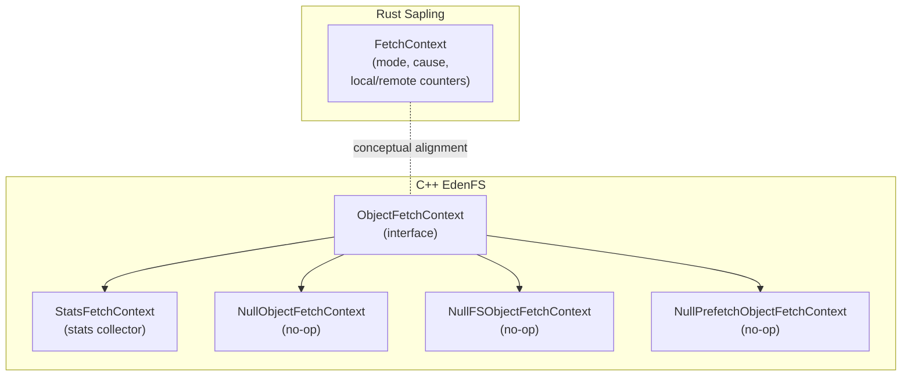
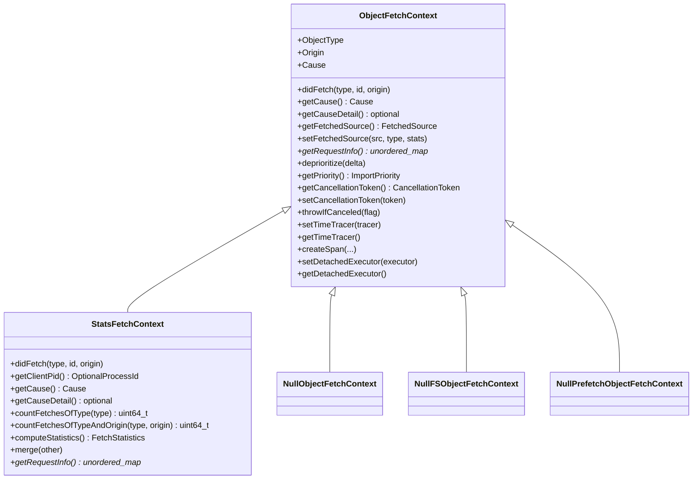
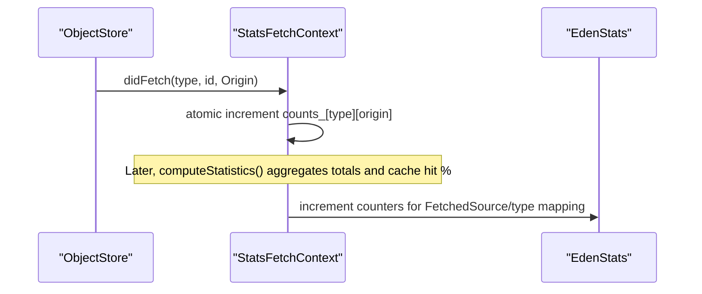
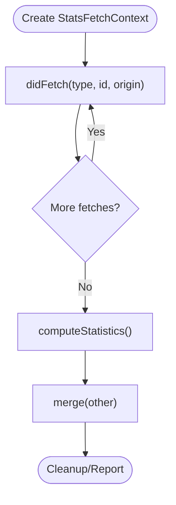
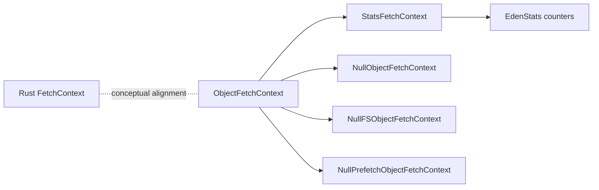

# Object Fetch Context

<cite>
**Referenced Files in This Document**
- [ObjectFetchContext.h](file://eden/fs/store/ObjectFetchContext.h)
- [ObjectFetchContext.cpp](file://eden/fs/store/ObjectFetchContext.cpp)
- [StatsFetchContext.h](file://eden/fs/store/StatsFetchContext.h)
- [StatsFetchContext.cpp](file://eden/fs/store/StatsFetchContext.cpp)
- [fetch_context.rs](file://eden/scm/lib/types/src/fetch_context.rs)
</cite>

## Table of Contents
1. [Introduction](#introduction)
2. [Project Structure](#project-structure)
3. [Core Components](#core-components)
4. [Architecture Overview](#architecture-overview)
5. [Detailed Component Analysis](#detailed-component-analysis)
6. [Dependency Analysis](#dependency-analysis)
7. [Performance Considerations](#performance-considerations)
8. [Troubleshooting Guide](#troubleshooting-guide)
9. [Conclusion](#conclusion)

## Introduction
This document explains the object fetch context system in the EdenFS object store architecture. It focuses on the ObjectFetchContext pattern, covering fetch tracking, priority management via causes, origin detection, lifecycle, dependency tracking, batching strategies, resource allocation, and integration with heavy fetch detection. It also documents the StatsFetchContext implementation for performance monitoring and statistics collection, and clarifies the relationship between fetch contexts and caching strategies, including cache hit/miss tracking and performance optimization.

## Project Structure
The object fetch context system spans two primary areas:
- C++ EdenFS object store: defines the base ObjectFetchContext interface and the StatsFetchContext implementation for runtime statistics.
- Rust Sapling types: defines a lightweight FetchContext for higher-level fetch orchestration and statistics.

**Diagram sources**
- [ObjectFetchContext.h:36-313](file://eden/fs/store/ObjectFetchContext.h#L36-L313)
- [ObjectFetchContext.cpp:16-94](file://eden/fs/store/ObjectFetchContext.cpp#L16-L94)
- [StatsFetchContext.h:43-93](file://eden/fs/store/StatsFetchContext.h#L43-L93)
- [StatsFetchContext.cpp:13-145](file://eden/fs/store/StatsFetchContext.cpp#L13-L145)
- [fetch_context.rs:20-95](file://eden/scm/lib/types/src/fetch_context.rs#L20-L95)

**Section sources**
- [ObjectFetchContext.h:36-313](file://eden/fs/store/ObjectFetchContext.h#L36-L313)
- [ObjectFetchContext.cpp:16-94](file://eden/fs/store/ObjectFetchContext.cpp#L16-L94)
- [StatsFetchContext.h:43-93](file://eden/fs/store/StatsFetchContext.h#L43-L93)
- [StatsFetchContext.cpp:13-145](file://eden/fs/store/StatsFetchContext.cpp#L13-L145)
- [fetch_context.rs:20-95](file://eden/scm/lib/types/src/fetch_context.rs#L20-L95)

## Core Components
- ObjectFetchContext (C++): Base interface for tracking object fetches, including cause, origin, cancellation, priority, request info, and optional tracing/executor hooks.
- StatsFetchContext (C++): Implements ObjectFetchContext to collect per-object-type and per-origin fetch counts, compute cache hit rates, and merge statistics.
- NullObjectFetchContext family (C++): No-op implementations for testing and scenarios where tracking is not desired.
- FetchContext (Rust): Lightweight context for higher-level fetch orchestration with mode, cause, and counters for local/remote fetches and CAS attempts.

Key responsibilities:
- Fetch tracking: didFetch with object type and origin.
- Priority management: Cause enum drives priority order and affects backing store behavior.
- Origin detection: Tracks whether data came from memory/disk/network caches or a network fetch.
- Lifecycle: Creation, optional cancellation, tracing, and cleanup.
- Statistics: Counters and cache hit rate computation for blobs, trees, and auxiliary data.

**Section sources**
- [ObjectFetchContext.h:36-111](file://eden/fs/store/ObjectFetchContext.h#L36-L111)
- [ObjectFetchContext.h:102-111](file://eden/fs/store/ObjectFetchContext.h#L102-L111)
- [ObjectFetchContext.h:165-179](file://eden/fs/store/ObjectFetchContext.h#L165-L179)
- [ObjectFetchContext.h:188-189](file://eden/fs/store/ObjectFetchContext.h#L188-L189)
- [ObjectFetchContext.h:201](file://eden/fs/store/ObjectFetchContext.h#L201)
- [ObjectFetchContext.cpp:16-66](file://eden/fs/store/ObjectFetchContext.cpp#L16-L66)
- [StatsFetchContext.h:43-93](file://eden/fs/store/StatsFetchContext.h#L43-L93)
- [StatsFetchContext.cpp:65-105](file://eden/fs/store/StatsFetchContext.cpp#L65-L105)
- [StatsFetchContext.cpp:107-130](file://eden/fs/store/StatsFetchContext.cpp#L107-L130)
- [fetch_context.rs:20-95](file://eden/scm/lib/types/src/fetch_context.rs#L20-L95)

## Architecture Overview
The ObjectFetchContext pattern enables consistent fetch tracking across EdenFS. Backing stores and higher-level systems pass around a context object to record:
- Why a fetch occurred (Cause)
- Where the data came from (Origin)
- How to prioritize and throttle (priority)
- Whether the operation was canceled (cancellation token)
- Optional tracing and detached-executor usage

**Diagram sources**
- [ObjectFetchContext.h:36-313](file://eden/fs/store/ObjectFetchContext.h#L36-L313)
- [ObjectFetchContext.cpp:16-66](file://eden/fs/store/ObjectFetchContext.cpp#L16-L66)
- [StatsFetchContext.h:43-93](file://eden/fs/store/StatsFetchContext.h#L43-L93)
- [StatsFetchContext.cpp:13-145](file://eden/fs/store/StatsFetchContext.cpp#L13-L145)

## Detailed Component Analysis

### ObjectFetchContext (Base Interface)
- Purpose: Central contract for fetch tracking across the object store.
- Fetch tracking: didFetch accepts object type and origin; subclasses record counts and derive statistics.
- Priority management: Cause enum defines priority order; backing stores can adjust behavior accordingly.
- Origin detection: FetchedSource indicates whether data came from local, remote, or is unknown.
- Cancellation: Optional cancellation token and helper to check/throw on cancel.
- Tracing and executors: Optional MiniTracer integration and a dedicated executor for detached tasks.
- Request info: Optional key-value metadata for correlation and diagnostics.
- Deprioritize hook: Allows adjusting priority for heavy fetchers.

Usage examples (paths):
- Creating a null context for testing: [ObjectFetchContext.cpp:72-91](file://eden/fs/store/ObjectFetchContext.cpp#L72-L91)
- Getting a null FS context: [ObjectFetchContext.cpp:83-86](file://eden/fs/store/ObjectFetchContext.cpp#L83-L86)
- Getting a null prefetch context: [ObjectFetchContext.cpp:88-91](file://eden/fs/store/ObjectFetchContext.cpp#L88-L91)
- Priority getter: [ObjectFetchContext.h:161-163](file://eden/fs/store/ObjectFetchContext.h#L161-L163)
- Cancellation helpers: [ObjectFetchContext.h:136-159](file://eden/fs/store/ObjectFetchContext.h#L136-L159)
- Tracing and executors: [ObjectFetchContext.h:233-269](file://eden/fs/store/ObjectFetchContext.h#L233-L269)

**Section sources**
- [ObjectFetchContext.h:36-111](file://eden/fs/store/ObjectFetchContext.h#L36-L111)
- [ObjectFetchContext.h:102-111](file://eden/fs/store/ObjectFetchContext.h#L102-L111)
- [ObjectFetchContext.h:161-179](file://eden/fs/store/ObjectFetchContext.h#L161-L179)
- [ObjectFetchContext.h:188-189](file://eden/fs/store/ObjectFetchContext.h#L188-L189)
- [ObjectFetchContext.h:201](file://eden/fs/store/ObjectFetchContext.h#L201)
- [ObjectFetchContext.cpp:72-91](file://eden/fs/store/ObjectFetchContext.cpp#L72-L91)

### StatsFetchContext (Statistics Collector)
- Purpose: Collect per-object-type and per-origin fetch counts, compute cache hit rates, and merge statistics.
- Data structures: Atomic counters for each ObjectType × Origin combination.
- Methods:
  - didFetch: atomically increments counters.
  - countFetchesOfType: sums across origins for a given type.
  - countFetchesOfTypeAndOrigin: retrieves a specific counter.
  - computeStatistics: produces Access metrics with accessCount, fetchCount, and cacheHitRate.
  - merge: adds another context’s counts into this one.

**Diagram sources**
- [StatsFetchContext.cpp:65-74](file://eden/fs/store/StatsFetchContext.cpp#L65-L74)
- [StatsFetchContext.cpp:107-130](file://eden/fs/store/StatsFetchContext.cpp#L107-L130)
- [ObjectFetchContext.h:291-306](file://eden/fs/store/ObjectFetchContext.h#L291-L306)

Usage examples (paths):
- Constructor with pid/cause/detail/requestInfo: [StatsFetchContext.cpp:13-22](file://eden/fs/store/StatsFetchContext.cpp#L13-L22)
- didFetch: [StatsFetchContext.cpp:65-74](file://eden/fs/store/StatsFetchContext.cpp#L65-L74)
- countFetchesOfType: [StatsFetchContext.cpp:76-85](file://eden/fs/store/StatsFetchContext.cpp#L76-L85)
- countFetchesOfTypeAndOrigin: [StatsFetchContext.cpp:97-105](file://eden/fs/store/StatsFetchContext.cpp#L97-L105)
- computeStatistics: [StatsFetchContext.cpp:107-130](file://eden/fs/store/StatsFetchContext.cpp#L107-L130)
- merge: [StatsFetchContext.cpp:87-95](file://eden/fs/store/StatsFetchContext.cpp#L87-L95)

**Section sources**
- [StatsFetchContext.h:43-93](file://eden/fs/store/StatsFetchContext.h#L43-L93)
- [StatsFetchContext.cpp:13-145](file://eden/fs/store/StatsFetchContext.cpp#L13-L145)
- [ObjectFetchContext.h:291-306](file://eden/fs/store/ObjectFetchContext.h#L291-L306)

### NullObjectFetchContext Family (No-op)
- NullObjectFetchContext: Unknown cause with optional causeDetail; no-op request info.
- NullFSObjectFetchContext: Cause::Fs; no-op request info.
- NullPrefetchObjectFetchContext: Cause::Prefetch; no-op request info.

These are useful for tests and when tracking is not desired.

Usage examples (paths):
- Null contexts creation: [ObjectFetchContext.cpp:72-91](file://eden/fs/store/ObjectFetchContext.cpp#L72-L91)

**Section sources**
- [ObjectFetchContext.cpp:16-66](file://eden/fs/store/ObjectFetchContext.cpp#L16-L66)
- [ObjectFetchContext.cpp:72-91](file://eden/fs/store/ObjectFetchContext.cpp#L72-L91)

### Rust FetchContext (Higher-level Orchestration)
- Fields: mode, cause, local_fetch_count, remote_fetch_count, fetch_from_cas_attempted.
- Methods: constructors with defaults and prefetch variants, incrementors for local/remote, and getters for counters and CAS flag.

This context complements the C++ ObjectFetchContext by providing higher-level fetch orchestration and counters aligned with local/remote behavior.

Usage examples (paths):
- Constructors and defaults: [fetch_context.rs:30-54](file://eden/scm/lib/types/src/fetch_context.rs#L30-L54)
- Prefetch variant: [fetch_context.rs:39-44](file://eden/scm/lib/types/src/fetch_context.rs#L39-L44)
- Incrementors: [fetch_context.rs:64-75](file://eden/scm/lib/types/src/fetch_context.rs#L64-L75)
- Getters: [fetch_context.rs:77-87](file://eden/scm/lib/types/src/fetch_context.rs#L77-L87)

**Section sources**
- [fetch_context.rs:20-95](file://eden/scm/lib/types/src/fetch_context.rs#L20-L95)

### Fetch Context Lifecycle and Control Flow
- Creation: Construct a StatsFetchContext with pid, cause, optional detail, and request info.
- During fetch: Call didFetch for each object with its type and origin.
- After fetch: Optionally compute statistics and merge with other contexts.
- Cancellation: Use setCancellationToken and throwIfCanceled during long-running operations.
- Tracing: Optionally attach a MiniTracer and create spans around expensive operations.
- Detached work: Use setDetachedExecutor for exceptional async tasks.

**Diagram sources**
- [StatsFetchContext.cpp:65-74](file://eden/fs/store/StatsFetchContext.cpp#L65-L74)
- [StatsFetchContext.cpp:107-130](file://eden/fs/store/StatsFetchContext.cpp#L107-L130)
- [StatsFetchContext.cpp:87-95](file://eden/fs/store/StatsFetchContext.cpp#L87-L95)

**Section sources**
- [StatsFetchContext.cpp:13-145](file://eden/fs/store/StatsFetchContext.cpp#L13-L145)
- [ObjectFetchContext.h:136-159](file://eden/fs/store/ObjectFetchContext.h#L136-L159)
- [ObjectFetchContext.h:233-269](file://eden/fs/store/ObjectFetchContext.h#L233-L269)

### Priority Management and Heavy Fetch Detection
- Cause priorities: Unknown < Prefetch < Thrift < Fs (highest).
- Backing stores can use Cause to adjust scheduling and throttling.
- Deprioritize hook allows reducing priority for processes doing excessive fetches; logs can capture unexpected multi-use of contexts.

Usage examples (paths):
- Cause enum and priority semantics: [ObjectFetchContext.h:102-111](file://eden/fs/store/ObjectFetchContext.h#L102-L111)
- Deprioritize declaration: [ObjectFetchContext.h:201](file://eden/fs/store/ObjectFetchContext.h#L201)

**Section sources**
- [ObjectFetchContext.h:102-111](file://eden/fs/store/ObjectFetchContext.h#L102-L111)
- [ObjectFetchContext.h:201](file://eden/fs/store/ObjectFetchContext.h#L201)

### Dependency Tracking, Batching, and Resource Allocation
- Dependency tracking: Origin enum distinguishes memory/disk/network sources; FetchedSource tracks final outcome for stats mapping.
- Batching: StatsFetchContext aggregates counts per type and origin; computeStatistics derives cache hit rates across origins.
- Resource allocation: Detached executor is provided for exceptional async tasks; cancellation token ensures cooperative cancellation.

Usage examples (paths):
- Origin and FetchedSource enums: [ObjectFetchContext.h:84-94](file://eden/fs/store/ObjectFetchContext.h#L84-L94)
- setFetchedSource mapping: [ObjectFetchContext.h:165-179](file://eden/fs/store/ObjectFetchContext.h#L165-L179)
- Stats aggregation: [StatsFetchContext.cpp:76-105](file://eden/fs/store/StatsFetchContext.cpp#L76-L105)
- Detached executor: [ObjectFetchContext.h:259-269](file://eden/fs/store/ObjectFetchContext.h#L259-L269)

**Section sources**
- [ObjectFetchContext.h:84-94](file://eden/fs/store/ObjectFetchContext.h#L84-L94)
- [ObjectFetchContext.h:165-179](file://eden/fs/store/ObjectFetchContext.h#L165-L179)
- [StatsFetchContext.cpp:76-105](file://eden/fs/store/StatsFetchContext.cpp#L76-L105)
- [ObjectFetchContext.h:259-269](file://eden/fs/store/ObjectFetchContext.h#L259-L269)

### Relationship to Caching Strategies and Performance Optimization
- Cache hit/miss tracking: computeStatistics reports accessCount, fetchCount, and cacheHitRate derived from memory/disk/network origins.
- Performance optimization: Use cache hit rates to tune prefetching, adjust Cause priorities, and apply deprioritize for hotspots.

Usage examples (paths):
- computeStatistics: [StatsFetchContext.cpp:107-130](file://eden/fs/store/StatsFetchContext.cpp#L107-L130)
- Origin constants: [ObjectFetchContext.h:84-94](file://eden/fs/store/ObjectFetchContext.h#L84-L94)

**Section sources**
- [StatsFetchContext.cpp:107-130](file://eden/fs/store/StatsFetchContext.cpp#L107-L130)
- [ObjectFetchContext.h:84-94](file://eden/fs/store/ObjectFetchContext.h#L84-L94)

## Dependency Analysis
- ObjectFetchContext is the central dependency for all fetch tracking.
- StatsFetchContext depends on ObjectFetchContext and EdenStats counters for mapping FetchedSource/type to specific stats.
- NullObjectFetchContext family depends on ObjectFetchContext for no-op behavior.
- Rust FetchContext is conceptually aligned with ObjectFetchContext’s Cause/mode semantics.

**Diagram sources**
- [ObjectFetchContext.h:36-313](file://eden/fs/store/ObjectFetchContext.h#L36-L313)
- [ObjectFetchContext.cpp:16-66](file://eden/fs/store/ObjectFetchContext.cpp#L16-L66)
- [StatsFetchContext.h:43-93](file://eden/fs/store/StatsFetchContext.h#L43-L93)
- [StatsFetchContext.cpp:107-130](file://eden/fs/store/StatsFetchContext.cpp#L107-L130)
- [fetch_context.rs:20-95](file://eden/scm/lib/types/src/fetch_context.rs#L20-L95)

**Section sources**
- [ObjectFetchContext.h:36-313](file://eden/fs/store/ObjectFetchContext.h#L36-L313)
- [ObjectFetchContext.cpp:16-66](file://eden/fs/store/ObjectFetchContext.cpp#L16-L66)
- [StatsFetchContext.h:43-93](file://eden/fs/store/StatsFetchContext.h#L43-L93)
- [StatsFetchContext.cpp:107-130](file://eden/fs/store/StatsFetchContext.cpp#L107-L130)
- [fetch_context.rs:20-95](file://eden/scm/lib/types/src/fetch_context.rs#L20-L95)

## Performance Considerations
- Use computeStatistics to monitor cache hit rates and identify underperforming origins.
- Prefer Cause::Fs for interactive operations to ensure highest priority.
- Apply deprioritize for processes with excessive fetch activity to prevent starvation.
- Use cancellation tokens to abort long-running operations cooperatively.
- Attach MiniTracer spans around expensive fetch sequences for profiling.

[No sources needed since this section provides general guidance]

## Troubleshooting Guide
- Unexpected null context: Use getNullContextWithCauseDetail to log cause details and locate missing context initialization.
- Cancellation errors: Ensure throwIfCanceled(true) is called after checking getCancellationToken().
- Excessive fetches: Investigate by merging multiple StatsFetchContext instances and reviewing computeStatistics results.
- Incorrect priority: Verify Cause ordering and backing store priority handling.

**Section sources**
- [ObjectFetchContext.cpp:77-81](file://eden/fs/store/ObjectFetchContext.cpp#L77-L81)
- [ObjectFetchContext.h:136-159](file://eden/fs/store/ObjectFetchContext.h#L136-L159)
- [StatsFetchContext.cpp:87-95](file://eden/fs/store/StatsFetchContext.cpp#L87-L95)
- [StatsFetchContext.cpp:107-130](file://eden/fs/store/StatsFetchContext.cpp#L107-L130)

## Conclusion
The ObjectFetchContext system provides a robust foundation for tracking, prioritizing, and optimizing object fetches in EdenFS. StatsFetchContext delivers actionable performance insights via cache hit rates and per-origin accounting. Combined with Cause-driven priority, cancellation support, and tracing, it enables efficient integration with backing stores and higher-level orchestration, including heavy fetch detection and resource allocation strategies.