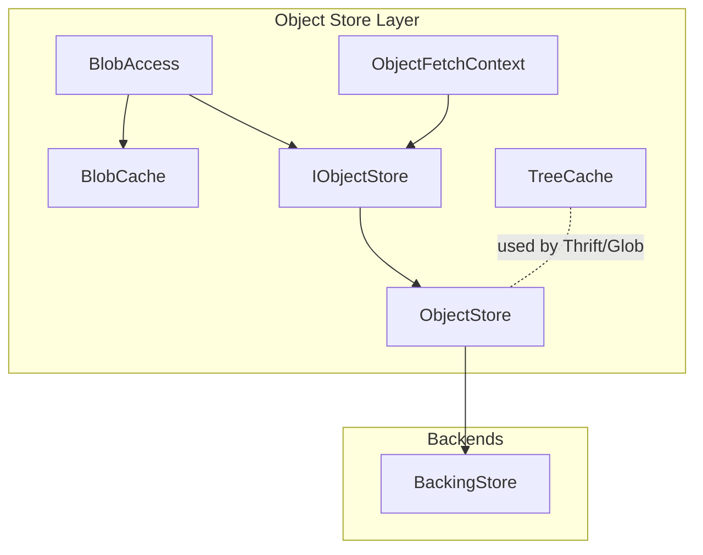
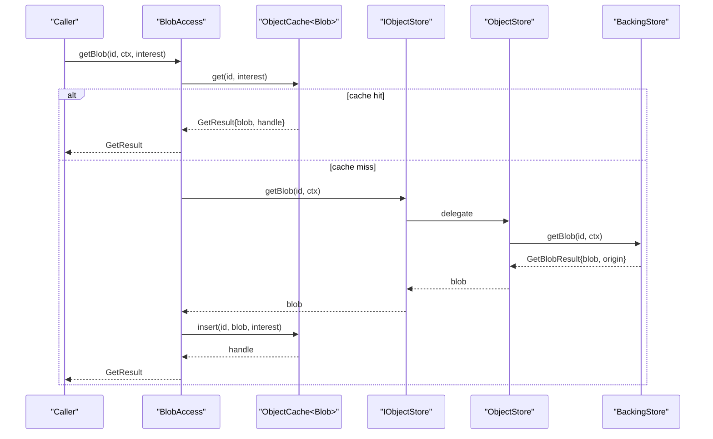
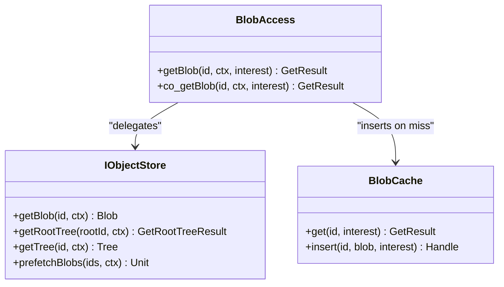
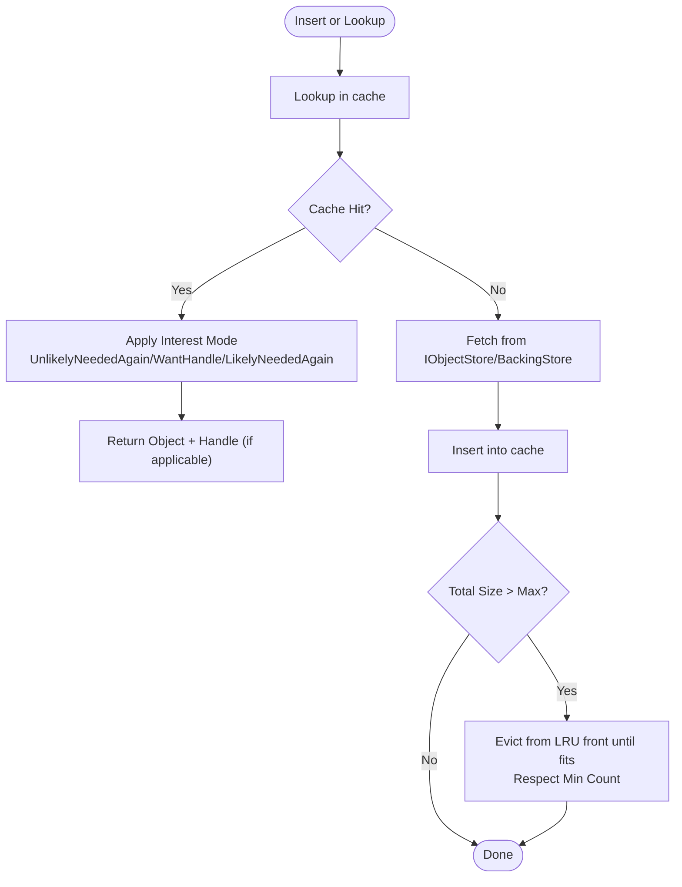
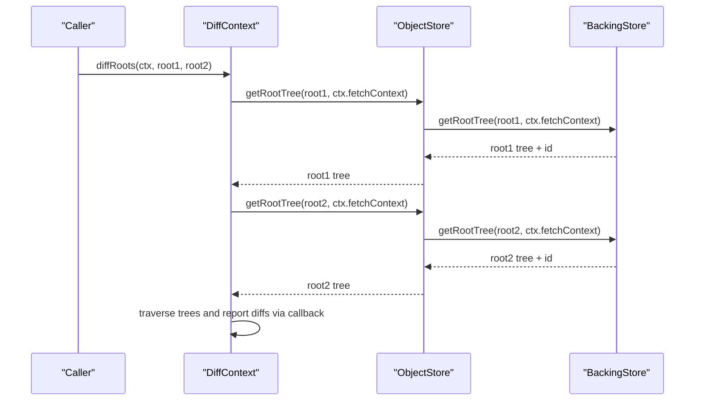
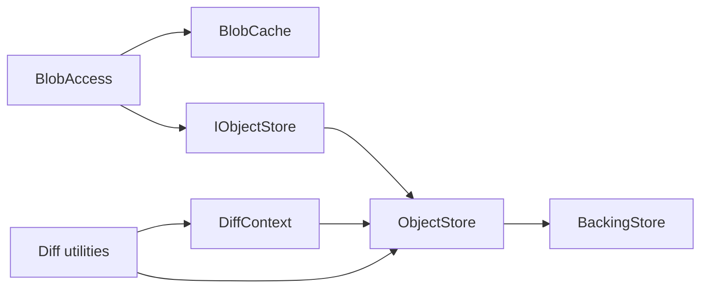

# Object Store Architecture

<cite>
**Referenced Files in This Document**
- [BlobAccess.h](file://eden/fs/store/BlobAccess.h)
- [BlobCache.h](file://eden/fs/store/BlobCache.h)
- [ObjectCache.h](file://eden/fs/store/ObjectCache.h)
- [TreeCache.h](file://eden/fs/store/TreeCache.h)
- [ObjectFetchContext.h](file://eden/fs/store/ObjectFetchContext.h)
- [IObjectStore.h](file://eden/fs/store/IObjectStore.h)
- [Diff.h](file://eden/fs/store/Diff.h)
- [DiffContext.h](file://eden/fs/store/DiffContext.h)
- [BackingStore.h](file://eden/fs/store/BackingStore.h)
- [ObjectStore.h](file://eden/fs/store/ObjectStore.h)
- [ObjectStore.cpp](file://eden/fs/store/ObjectStore.cpp)
</cite>

## Table of Contents
1. [Introduction](#introduction)
2. [Project Structure](#project-structure)
3. [Core Components](#core-components)
4. [Architecture Overview](#architecture-overview)
5. [Detailed Component Analysis](#detailed-component-analysis)
6. [Dependency Analysis](#dependency-analysis)
7. [Performance Considerations](#performance-considerations)
8. [Troubleshooting Guide](#troubleshooting-guide)
9. [Conclusion](#conclusion)

## Introduction
This document explains the object store architecture in EdenFS with a focus on blob and tree object storage, content-addressable storage principles, and retrieval mechanisms. It documents the blob cache and tree cache implementations, including caching strategies, eviction policies, and memory management. It also covers the object store interfaces, including BlobAccess and ObjectFetchContext patterns, and describes diff operations for change detection. Finally, it outlines performance optimization techniques, cache hit ratios, storage efficiency measures, and integration with repository storage backends.

## Project Structure
The object store lives under the Eden filesystem store module. Key components include:
- Interfaces and abstractions: IObjectStore, BackingStore, ObjectFetchContext
- Retrieval and caching: BlobAccess, BlobCache, TreeCache
- Change detection: Diff and DiffContext
- Coordination: ObjectStore (composition of caches and backing store)

**Diagram sources**
- [IObjectStore.h:37-87](file://eden/fs/store/IObjectStore.h#L37-L87)
- [ObjectStore.h](file://eden/fs/store/ObjectStore.h)
- [ObjectStore.cpp](file://eden/fs/store/ObjectStore.cpp)
- [BlobAccess.h:34-84](file://eden/fs/store/BlobAccess.h#L34-L84)
- [BlobCache.h:32-110](file://eden/fs/store/BlobCache.h#L32-L110)
- [TreeCache.h:35-78](file://eden/fs/store/TreeCache.h#L35-L78)
- [ObjectFetchContext.h:36-312](file://eden/fs/store/ObjectFetchContext.h#L36-L312)
- [BackingStore.h:58-328](file://eden/fs/store/BackingStore.h#L58-L328)

**Section sources**
- [IObjectStore.h:37-87](file://eden/fs/store/IObjectStore.h#L37-L87)
- [ObjectStore.h](file://eden/fs/store/ObjectStore.h)
- [ObjectStore.cpp](file://eden/fs/store/ObjectStore.cpp)
- [BlobAccess.h:34-84](file://eden/fs/store/BlobAccess.h#L34-L84)
- [BlobCache.h:32-110](file://eden/fs/store/BlobCache.h#L32-L110)
- [TreeCache.h:35-78](file://eden/fs/store/TreeCache.h#L35-L78)
- [ObjectFetchContext.h:36-312](file://eden/fs/store/ObjectFetchContext.h#L36-L312)
- [BackingStore.h:58-328](file://eden/fs/store/BackingStore.h#L58-L328)

## Core Components
- Content-addressable storage: Objects are identified by cryptographic digests (ObjectIds), enabling deduplication and efficient caching.
- BlobAccess: Centralized interface for blob retrieval with interest-driven caching semantics.
- BlobCache: Thread-safe, LRU-style cache for blobs with size and minimum-count constraints and interest handles for eviction hints.
- TreeCache: Thread-safe, LRU-style cache for trees (used mainly for Thrift/glob operations).
- ObjectFetchContext: Captures fetch provenance, priority, cancellation, and telemetry for tracing and statistics.
- IObjectStore: Abstraction for retrieving blobs and trees and prefetching.
- BackingStore: Implementation of external storage backends (local/disk, remote/network) with optional object comparison shortcuts.
- Diff/DiffContext: Utilities for computing differences between roots and trees, with cancellation and callback-based reporting.

**Section sources**
- [BlobAccess.h:34-84](file://eden/fs/store/BlobAccess.h#L34-L84)
- [BlobCache.h:32-110](file://eden/fs/store/BlobCache.h#L32-L110)
- [TreeCache.h:35-78](file://eden/fs/store/TreeCache.h#L35-L78)
- [ObjectFetchContext.h:36-312](file://eden/fs/store/ObjectFetchContext.h#L36-L312)
- [IObjectStore.h:37-87](file://eden/fs/store/IObjectStore.h#L37-L87)
- [BackingStore.h:58-328](file://eden/fs/store/BackingStore.h#L58-L328)
- [Diff.h:22-92](file://eden/fs/store/Diff.h#L22-L92)
- [DiffContext.h:37-118](file://eden/fs/store/DiffContext.h#L37-L118)

## Architecture Overview
The object store composes a cache layer (BlobCache, TreeCache) with a retrieval layer (BlobAccess, IObjectStore) and a backend layer (BackingStore). Fetches flow from callers through BlobAccess to IObjectStore, which coordinates caches and backends. Diff operations use Tree and Blob accessors to compare roots and trees.

**Diagram sources**
- [BlobAccess.h:59-76](file://eden/fs/store/BlobAccess.h#L59-L76)
- [ObjectCache.h:193-226](file://eden/fs/store/ObjectCache.h#L193-L226)
- [IObjectStore.h:70-76](file://eden/fs/store/IObjectStore.h#L70-L76)
- [ObjectStore.cpp](file://eden/fs/store/ObjectStore.cpp)
- [BackingStore.h:274-289](file://eden/fs/store/BackingStore.h#L274-L289)

## Detailed Component Analysis

### Blob Access and Retrieval
BlobAccess encapsulates blob retrieval and interest-driven caching. It delegates to IObjectStore for missing objects and inserts results into BlobCache with an interest handle. Interest hints influence eviction behavior.

Key behaviors:
- Stateless access pattern to amortize per-read costs.
- Interest modes: UnlikelyNeededAgain, WantHandle, LikelyNeededAgain, None.
- Async variants: ImmediateFuture and coro::now_task for compatibility.

**Diagram sources**
- [BlobAccess.h:34-84](file://eden/fs/store/BlobAccess.h#L34-L84)
- [IObjectStore.h:64-86](file://eden/fs/store/IObjectStore.h#L64-L86)
- [BlobCache.h:82-97](file://eden/fs/store/BlobCache.h#L82-L97)

**Section sources**
- [BlobAccess.h:34-84](file://eden/fs/store/BlobAccess.h#L34-L84)
- [IObjectStore.h:64-86](file://eden/fs/store/IObjectStore.h#L64-L86)

### Blob Cache: LRU, Interest Handles, and Eviction
BlobCache extends ObjectCache with interest-aware eviction. It maintains:
- Maximum cache size in bytes
- Minimum entry count to protect large, frequently accessed blobs
- Per-object reference counts and generations tracked via ObjectInterestHandle
- Sharded state for concurrency

Eviction policy:
- Evict from the front of the LRU queue when total size exceeds maximum and minimum count constraints are satisfied.
- Respect interest handles: items with zero outstanding handles are eligible for eviction sooner.

**Diagram sources**
- [ObjectCache.h:341-413](file://eden/fs/store/ObjectCache.h#L341-L413)
- [BlobCache.h:32-110](file://eden/fs/store/BlobCache.h#L32-L110)

**Section sources**
- [ObjectCache.h:118-439](file://eden/fs/store/ObjectCache.h#L118-L439)
- [BlobCache.h:32-110](file://eden/fs/store/BlobCache.h#L32-L110)

### Tree Cache: Directory Structure Caching
TreeCache is a simpler, flavor-specific cache for Tree objects. It is primarily used by Thrift endpoints to accelerate glob evaluation and similar operations. It supports get and insert with the same size and minimum-count constraints as BlobCache.

Usage:
- Used by higher-level services to avoid repeated deserialization and traversal of directory structures.

**Section sources**
- [TreeCache.h:35-78](file://eden/fs/store/TreeCache.h#L35-L78)

### ObjectFetchContext: Fetch Tracking, Priority, and Telemetry
ObjectFetchContext captures:
- Cause (Fs, Thrift, Prefetch, Unknown) with priority ordering
- Origin (memory, disk, network) for statistics
- Cancellation token and optional time tracer
- Request metadata (e.g., session identifiers) for backend correlation

It is passed through the retrieval pipeline to annotate fetches and enable prioritization and cancellation.

**Section sources**
- [ObjectFetchContext.h:36-312](file://eden/fs/store/ObjectFetchContext.h#L36-L312)

### Diff Operations: Change Detection and Reporting
Diff utilities compute differences between roots and trees:
- diffRoots computes changes between two RootIds
- diffTrees compares a source-control Tree against working-directory state
- diffAddedTree and diffRemovedTree mark subtrees as added or removed

DiffContext carries:
- Callback for incremental reporting
- Cancellation token and optional throwing behavior
- Case sensitivity and symlink settings
- Associated ObjectFetchContext for provenance and tracing

**Diagram sources**
- [Diff.h:31-32](file://eden/fs/store/Diff.h#L31-L32)
- [DiffContext.h:37-99](file://eden/fs/store/DiffContext.h#L37-L99)
- [ObjectStore.cpp](file://eden/fs/store/ObjectStore.cpp)
- [BackingStore.h:238-245](file://eden/fs/store/BackingStore.h#L238-L245)

**Section sources**
- [Diff.h:22-92](file://eden/fs/store/Diff.h#L22-L92)
- [DiffContext.h:37-118](file://eden/fs/store/DiffContext.h#L37-L118)

### BackingStore Integration: Repository Storage Backends
BackingStore abstracts external storage:
- compareObjectsById and compareRootsById allow short-circuiting when IDs are known equal/different
- getRootTree, getTree, getBlob, getBlobAuxData, getTreeAuxData return both object and origin
- Optional prefetchBlobs and getGlobFiles for performance
- Memory optimization via stripObjectId

ObjectStore mediates between caches and backends, applying priorities and origins.

**Section sources**
- [BackingStore.h:58-328](file://eden/fs/store/BackingStore.h#L58-L328)
- [ObjectStore.cpp](file://eden/fs/store/ObjectStore.cpp)

## Dependency Analysis
The object store exhibits layered dependencies:
- BlobAccess depends on BlobCache and IObjectStore
- IObjectStore coordinates with ObjectStore and BackingStore
- ObjectCache is generic over object type and flavor
- Diff utilities depend on Tree and Blob accessors and rely on ObjectFetchContext for provenance

**Diagram sources**
- [BlobAccess.h:34-84](file://eden/fs/store/BlobAccess.h#L34-L84)
- [IObjectStore.h:37-87](file://eden/fs/store/IObjectStore.h#L37-L87)
- [ObjectStore.h](file://eden/fs/store/ObjectStore.h)
- [ObjectStore.cpp](file://eden/fs/store/ObjectStore.cpp)
- [BackingStore.h:58-328](file://eden/fs/store/BackingStore.h#L58-L328)
- [Diff.h:22-92](file://eden/fs/store/Diff.h#L22-L92)
- [DiffContext.h:37-118](file://eden/fs/store/DiffContext.h#L37-L118)

**Section sources**
- [BlobAccess.h:34-84](file://eden/fs/store/BlobAccess.h#L34-L84)
- [IObjectStore.h:37-87](file://eden/fs/store/IObjectStore.h#L37-L87)
- [ObjectStore.h](file://eden/fs/store/ObjectStore.h)
- [ObjectStore.cpp](file://eden/fs/store/ObjectStore.cpp)
- [BackingStore.h:58-328](file://eden/fs/store/BackingStore.h#L58-L328)
- [Diff.h:22-92](file://eden/fs/store/Diff.h#L22-L92)
- [DiffContext.h:37-118](file://eden/fs/store/DiffContext.h#L37-L118)

## Performance Considerations
- Cache sizing and minimum counts: Tune maximum size and minimum count to balance hit rate and memory footprint. Large, frequently accessed blobs are preserved by minimum count.
- Interest handles: Use WantHandle for short-lived bursts to keep objects hot; use LikelyNeededAgain for sustained access; use UnlikelyNeededAgain to avoid cache pollution.
- Sharding: ObjectCache shards improve concurrency; ensure adequate shard count for high contention workloads.
- Prefetching: Use prefetchBlobs to warm caches proactively during high-probability access patterns.
- Origins and statistics: Track origins (memory, disk, network) to identify bottlenecks and optimize backend placement.
- Diff efficiency: Disable ignored-file reporting when not needed to skip expensive ignore-tree traversals.

[No sources needed since this section provides general guidance]

## Troubleshooting Guide
- Fetch cancellation: Ensure ObjectFetchContext cancellation tokens are checked and propagated to avoid wasted work.
- Over-eager eviction: If large blobs are evicted frequently, increase minimum count or maximum size.
- Slow diffs: Verify case sensitivity and ignore-list settings; consider disabling ignored reporting for faster runs.
- Backend misconfiguration: Confirm BackingStore compareObjectsById/compareRootsById correctness to avoid unnecessary fetches.

**Section sources**
- [ObjectFetchContext.h:135-159](file://eden/fs/store/ObjectFetchContext.h#L135-L159)
- [ObjectCache.h:409-413](file://eden/fs/store/ObjectCache.h#L409-L413)
- [DiffContext.h:66-72](file://eden/fs/store/DiffContext.h#L66-L72)

## Conclusion
EdenFS’s object store leverages content-addressable storage and layered caching to deliver efficient blob and tree access. BlobAccess and BlobCache coordinate retrieval and retention with interest-aware eviction, while TreeCache accelerates directory operations. ObjectFetchContext provides rich provenance and telemetry, and BackingStore abstracts diverse storage backends. Diff utilities enable fast change detection with cancellation and reporting. Together, these components form a robust, observable, and scalable object storage system.