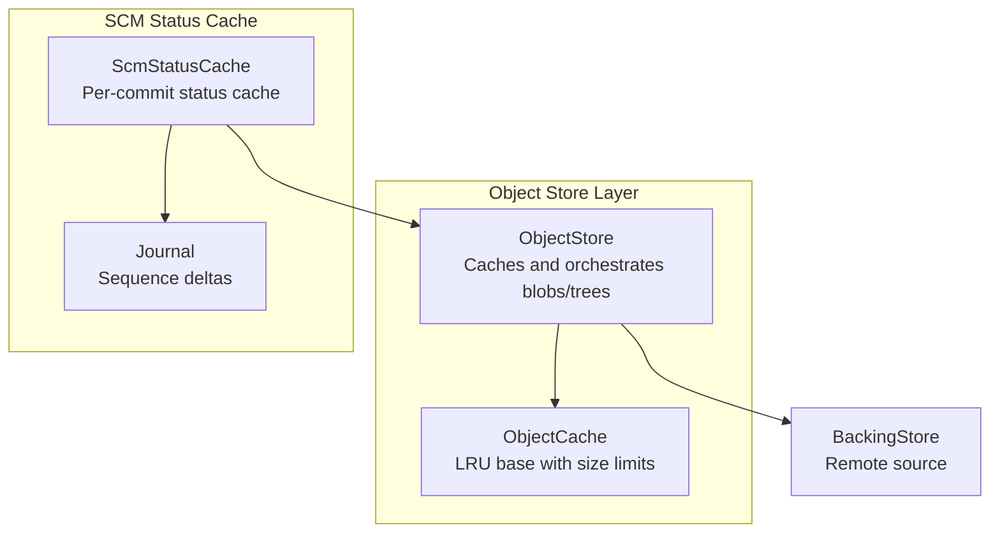
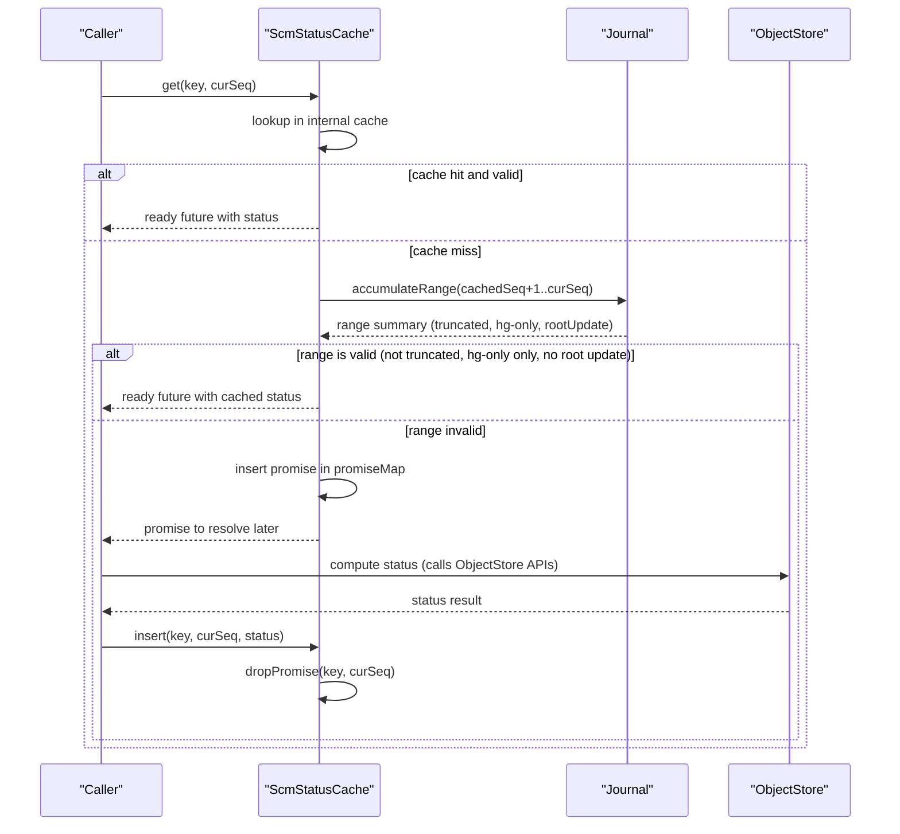
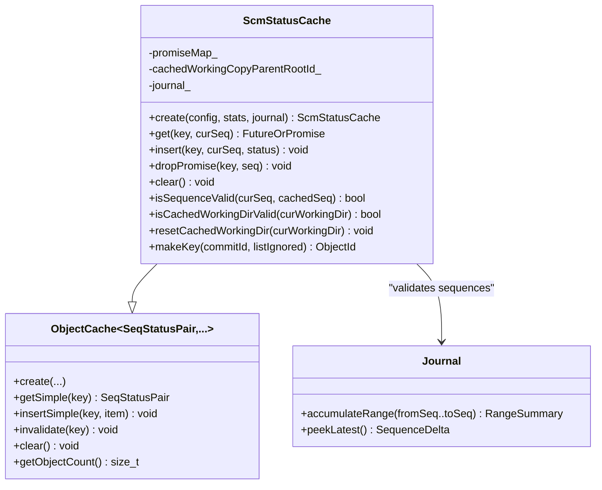
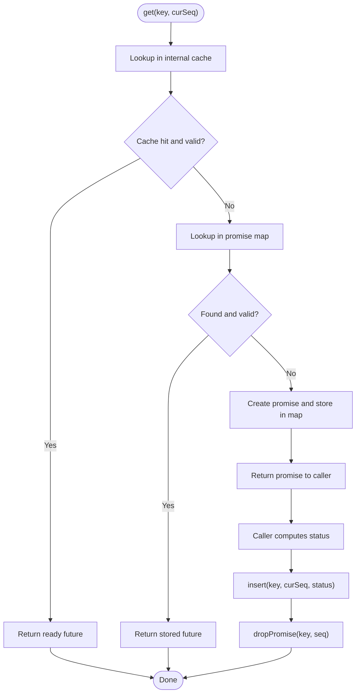
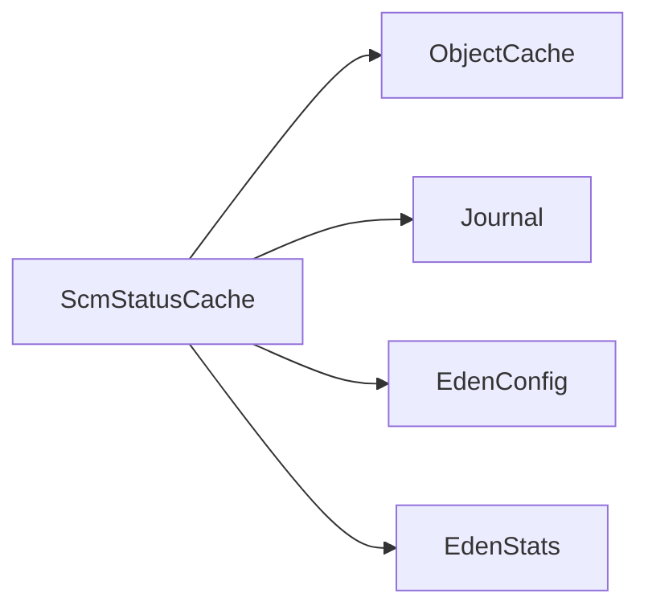

# SCM Status Cache

<cite>
**Referenced Files in This Document**
- [ScmStatusCache.h](file://eden/fs/store/ScmStatusCache.h)
- [ScmStatusCache.cpp](file://eden/fs/store/ScmStatusCache.cpp)
- [ObjectStore.h](file://eden/fs/store/ObjectStore.h)
- [ObjectStore.cpp](file://eden/fs/store/ObjectStore.cpp)
- [ScmStatusCacheTest.cpp](file://eden/fs/store/test/ScmStatusCacheTest.cpp)
- [status_test.py](file://eden/integration/hg/status_test.py)
- [ObjectCache.h](file://eden/fs/store/ObjectCache.h)
</cite>

## Table of Contents
1. [Introduction](#introduction)
2. [Project Structure](#project-structure)
3. [Core Components](#core-components)
4. [Architecture Overview](#architecture-overview)
5. [Detailed Component Analysis](#detailed-component-analysis)
6. [Dependency Analysis](#dependency-analysis)
7. [Performance Considerations](#performance-considerations)
8. [Troubleshooting Guide](#troubleshooting-guide)
9. [Conclusion](#conclusion)

## Introduction
This document explains the SCM status cache system in the EdenFS object store architecture. It focuses on how working directory state is tracked and change detection is performed, how the ScmStatusCache class implements caching and concurrency, and how it integrates with the broader object store. It also covers cache invalidation strategies, performance optimizations, memory management, configuration options, and troubleshooting.

## Project Structure
The SCM status cache lives in the object store subsystem and interacts with the journal for change detection. The ObjectStore coordinates access to backing stores and caches, while the ScmStatusCache provides a specialized cache for SCM status results keyed by commit and listing preferences.

**Diagram sources**
- [ObjectStore.h:110-125](file://eden/fs/store/ObjectStore.h#L110-L125)
- [ObjectStore.cpp:46-94](file://eden/fs/store/ObjectStore.cpp#L46-L94)
- [ScmStatusCache.h:58-76](file://eden/fs/store/ScmStatusCache.h#L58-L76)
- [ScmStatusCache.cpp:22-32](file://eden/fs/store/ScmStatusCache.cpp#L22-L32)

**Section sources**
- [ObjectStore.h:110-125](file://eden/fs/store/ObjectStore.h#L110-L125)
- [ObjectStore.cpp:46-94](file://eden/fs/store/ObjectStore.cpp#L46-L94)
- [ScmStatusCache.h:58-76](file://eden/fs/store/ScmStatusCache.h#L58-L76)
- [ScmStatusCache.cpp:22-32](file://eden/fs/store/ScmStatusCache.cpp#L22-L32)

## Core Components
- ScmStatusCache: A per-commit status cache keyed by commit RootId and a boolean flag indicating whether ignored files are included. It stores a sequence number and the status result, and coordinates promise-based concurrent requests.
- ObjectStore: Provides the higher-level object store interface and caches (trees, auxiliary data). It is the integration point for status cache usage in the broader system.
- Journal: Supplies sequence ranges and change detection to determine cache validity.

Key responsibilities:
- Track working directory parent root ID to ensure cache reuse is valid across working copy changes.
- Determine whether cached status can be reused based on journal sequence ranges (excluding .hg-only changes and root updates).
- Manage concurrent callers via a promise map to avoid duplicate computations.
- Enforce cache size and minimum items constraints.

**Section sources**
- [ScmStatusCache.h:58-185](file://eden/fs/store/ScmStatusCache.h#L58-L185)
- [ScmStatusCache.cpp:34-161](file://eden/fs/store/ScmStatusCache.cpp#L34-L161)
- [ObjectStore.h:110-125](file://eden/fs/store/ObjectStore.h#L110-L125)
- [ObjectStore.cpp:46-94](file://eden/fs/store/ObjectStore.cpp#L46-L94)

## Architecture Overview
The status cache sits alongside the object store’s other caches (blob, tree, and auxiliary data). It is keyed by a composite key derived from the target commit and listing preferences. It uses the journal to validate that cached results remain accurate despite ongoing filesystem changes.

**Diagram sources**
- [ScmStatusCache.cpp:34-102](file://eden/fs/store/ScmStatusCache.cpp#L34-L102)
- [ScmStatusCache.cpp:109-134](file://eden/fs/store/ScmStatusCache.cpp#L109-L134)
- [ScmStatusCache.h:109-136](file://eden/fs/store/ScmStatusCache.h#L109-L136)

## Detailed Component Analysis

### ScmStatusCache Class
The ScmStatusCache extends a generic object cache with a simple flavor and maintains:
- An internal cache of per-key status results with associated sequence numbers.
- A promise map to coordinate concurrent requests for the same key.
- A cached working directory parent RootId to guard against cross-working-copy reuse.
- A Journal pointer to validate sequence ranges.

Key methods and behaviors:
- get(key, curSeq): returns either a ready future (cache hit) or a promise (cache miss). It checks both the internal cache and the promise map, updating sequence numbers to avoid redundant recomputation.
- insert(key, curSeq, status): inserts only if curSeq is larger than the cached sequence number, ensuring freshness.
- dropPromise(key, seq): removes a promise from the map when the caller finishes, preventing unbounded growth.
- isSequenceValid(curSeq, cachedSeq): validates cache reuse by checking the journal range from cachedSeq+1 to curSeq. Cache is valid if the range is not truncated, contains only .hg-only changes, and does not include a root update.
- isCachedWorkingDirValid(curWorkingDir) and resetCachedWorkingDir(curWorkingDir): manage working directory parent root ID to ensure cache isolation across working copies.

**Diagram sources**
- [ScmStatusCache.h:58-185](file://eden/fs/store/ScmStatusCache.h#L58-L185)
- [ScmStatusCache.cpp:22-32](file://eden/fs/store/ScmStatusCache.cpp#L22-L32)
- [ObjectCache.h:94-120](file://eden/fs/store/ObjectCache.h#L94-L120)

**Section sources**
- [ScmStatusCache.h:58-185](file://eden/fs/store/ScmStatusCache.h#L58-L185)
- [ScmStatusCache.cpp:34-161](file://eden/fs/store/ScmStatusCache.cpp#L34-L161)

### Working Directory State Tracking and Change Detection
- Working directory parent root ID: The cache stores a cached working directory parent RootId. If the current working directory differs, the cache is considered invalid and must be recalculated.
- Journal-based validation: isSequenceValid checks the journal range between cached and current sequence numbers. Cache reuse is allowed only if:
  - The range is not truncated.
  - The range contains only .hg-only changes.
  - The range does not include a root update.

These guards ensure correctness when the working directory changes or when non-user-visible changes occur.

**Section sources**
- [ScmStatusCache.cpp:148-159](file://eden/fs/store/ScmStatusCache.cpp#L148-L159)
- [ScmStatusCache.cpp:109-134](file://eden/fs/store/ScmStatusCache.cpp#L109-L134)

### Status Update Procedures and Concurrency
- Cache hit: If a valid cached entry exists, a ready future is returned immediately.
- Cache miss: A promise is created and stored in the promise map. Concurrent callers requesting the same key receive futures resolved by the same promise.
- Completion: After computing the status, the caller inserts the result and drops the promise to clean up.
- Freshness: insert replaces cached entries only when the new sequence number is larger than the cached one.

**Diagram sources**
- [ScmStatusCache.cpp:34-102](file://eden/fs/store/ScmStatusCache.cpp#L34-L102)
- [ScmStatusCache.h:109-136](file://eden/fs/store/ScmStatusCache.h#L109-L136)

**Section sources**
- [ScmStatusCache.cpp:34-102](file://eden/fs/store/ScmStatusCache.cpp#L34-L102)
- [ScmStatusCache.h:109-136](file://eden/fs/store/ScmStatusCache.h#L109-L136)

### Integration with Object Store
- ObjectStore manages caches for trees and auxiliary data and exposes APIs for blobs and trees. While the status cache is not part of the tree/blob caches, it is conceptually integrated at the mount level to accelerate SCM status operations.
- ObjectStore construction initializes caches and statistics; the status cache is created and managed independently but can be used by higher-level components to avoid recomputing status frequently.

**Section sources**
- [ObjectStore.cpp:46-94](file://eden/fs/store/ObjectStore.cpp#L46-L94)
- [ObjectStore.h:110-125](file://eden/fs/store/ObjectStore.h#L110-L125)

### Cache Invalidation Strategies
- Size-based eviction: Controlled by configuration for maximum cache size and minimum items. When inserting causes the cache to exceed size limits, eviction occurs while preserving the minimum items.
- Sequence-based invalidation: insert replaces cached entries only when the new sequence number is larger than the cached one.
- Clear: Clears both the internal cache and the promise map, resets cached working directory parent RootId.
- Journal-based invalidation: isSequenceValid returns false if the accumulated range includes non-.hg-only changes or root updates.

**Section sources**
- [ScmStatusCache.cpp:70-91](file://eden/fs/store/ScmStatusCache.cpp#L70-L91)
- [ScmStatusCache.cpp:136-146](file://eden/fs/store/ScmStatusCache.cpp#L136-L146)
- [ScmStatusCache.cpp:109-134](file://eden/fs/store/ScmStatusCache.cpp#L109-L134)

### Performance Optimization Techniques
- Promise-based deduplication: Multiple concurrent requests for the same key share a single computation via a shared promise, reducing redundant work.
- Ready futures on cache hits: Valid cached results are returned immediately without blocking.
- Size-aware eviction: Minimum items ensure frequently accessed large status results are retained when they exceed the per-entry size budget.
- Journal range validation: Avoids unnecessary recomputation by leveraging journal deltas to confirm safety.

**Section sources**
- [ScmStatusCache.h:109-136](file://eden/fs/store/ScmStatusCache.h#L109-L136)
- [ScmStatusCache.cpp:34-68](file://eden/fs/store/ScmStatusCache.cpp#L34-L68)
- [ObjectCache.h:94-120](file://eden/fs/store/ObjectCache.h#L94-L120)

### Memory Management
- Item sizing: SeqStatusPair reports its size in bytes, including the key and dynamic status entries, enabling precise memory accounting.
- Eviction policy: Evicts least-recently-used entries while honoring the minimum items constraint to balance memory usage and performance.

**Section sources**
- [ScmStatusCache.h:32-47](file://eden/fs/store/ScmStatusCache.h#L32-L47)
- [ObjectCache.h:94-120](file://eden/fs/store/ObjectCache.h#L94-L120)

### Examples of Status Cache Operations
- Basic insert and retrieval: Insert a status for a key at a given sequence, then retrieve it later with a valid sequence to reuse the cached result.
- Eviction under size pressure: Insert enough items to exceed the configured maximum size; observe eviction of older entries while preserving the minimum.
- Promise sharing: Multiple callers request the same key concurrently; they receive futures backed by a single shared promise.
- Journal validation: After non-.hg-only changes or a root update, subsequent requests trigger cache misses and recomputation.

**Section sources**
- [ScmStatusCacheTest.cpp:35-73](file://eden/fs/store/test/ScmStatusCacheTest.cpp#L35-L73)
- [ScmStatusCacheTest.cpp:75-111](file://eden/fs/store/test/ScmStatusCacheTest.cpp#L75-L111)
- [ScmStatusCacheTest.cpp:156-188](file://eden/fs/store/test/ScmStatusCacheTest.cpp#L156-L188)
- [ScmStatusCacheTest.cpp:245-285](file://eden/fs/store/test/ScmStatusCacheTest.cpp#L245-L285)

### Cache Configuration Options
- scmStatusCacheMaxSize: Maximum memory footprint for the status cache.
- scmStatusCacheMinimumItems: Minimum number of entries to keep even when exceeding the maximum size.

These options are read by the cache constructor to initialize the underlying LRU cache behavior.

**Section sources**
- [ScmStatusCache.cpp:22-32](file://eden/fs/store/ScmStatusCache.cpp#L22-L32)

### Troubleshooting Common Issues
- Unexpected cache misses after commits: Verify that the working directory parent RootId has not changed and that the journal range validation allows reuse. If root updates occurred, the cache is intentionally invalidated.
- High memory usage: Increase scmStatusCacheMinimumItems to protect large frequent results, or reduce scmStatusCacheMaxSize.
- Stalled concurrent requests: Ensure dropPromise is called after fulfilling a promise to prevent accumulation of unresolved promises.
- Integration with status operations: When testing, confirm that status operations are invoked with the correct commit and listIgnored flag to ensure proper keying.

**Section sources**
- [ScmStatusCache.cpp:136-146](file://eden/fs/store/ScmStatusCache.cpp#L136-L146)
- [ScmStatusCache.cpp:93-102](file://eden/fs/store/ScmStatusCache.cpp#L93-L102)
- [status_test.py:392-413](file://eden/integration/hg/status_test.py#L392-L413)

## Dependency Analysis
The status cache depends on:
- ObjectCache for LRU eviction and size management.
- Journal for sequence range validation.
- EdenConfig and EdenStats for configuration and telemetry.

**Diagram sources**
- [ScmStatusCache.cpp:22-32](file://eden/fs/store/ScmStatusCache.cpp#L22-L32)
- [ObjectCache.h:94-120](file://eden/fs/store/ObjectCache.h#L94-L120)

**Section sources**
- [ScmStatusCache.cpp:22-32](file://eden/fs/store/ScmStatusCache.cpp#L22-L32)
- [ObjectCache.h:94-120](file://eden/fs/store/ObjectCache.h#L94-L120)

## Performance Considerations
- Prefer reusing cached results when possible by ensuring the working directory parent RootId remains unchanged and that journal ranges are free of non-.hg-only changes and root updates.
- Tune scmStatusCacheMaxSize and scmStatusCacheMinimumItems to balance memory usage and hit rates for your workload.
- Use promise-based concurrency to avoid duplicate computations during bursts of status requests.

[No sources needed since this section provides general guidance]

## Troubleshooting Guide
- Symptom: Frequent cache misses after commits.
  - Cause: Working directory parent RootId changed or journal range includes non-.hg-only changes/root updates.
  - Action: Recompute status; verify working directory state and commit operations.
- Symptom: Memory growth over time.
  - Cause: Large status results or low minimum items.
  - Action: Adjust scmStatusCacheMinimumItems or scmStatusCacheMaxSize.
- Symptom: Slow response to concurrent status requests.
  - Cause: Missing dropPromise leading to unresolved promises.
  - Action: Ensure dropPromise(key, seq) is called after insert.

**Section sources**
- [ScmStatusCache.cpp:136-146](file://eden/fs/store/ScmStatusCache.cpp#L136-L146)
- [ScmStatusCache.cpp:93-102](file://eden/fs/store/ScmStatusCache.cpp#L93-L102)

## Conclusion
The SCM status cache provides efficient, validated caching of SCM status results keyed by commit and listing preferences. By combining sequence-based validation with journal range checks and promise-based concurrency, it minimizes redundant computations while ensuring correctness across working directory changes. Proper tuning of cache size and minimum items, along with correct integration patterns, yields strong performance and reliability.