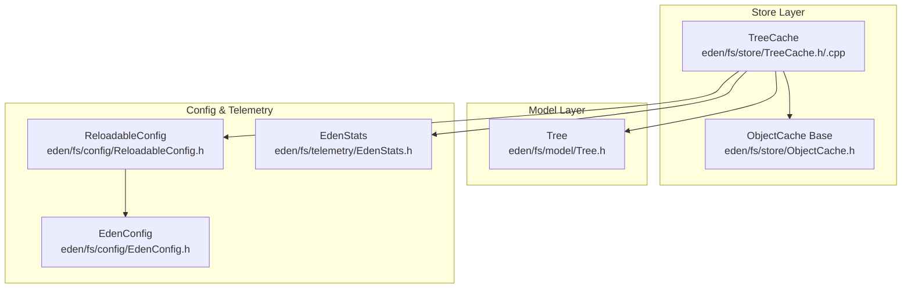
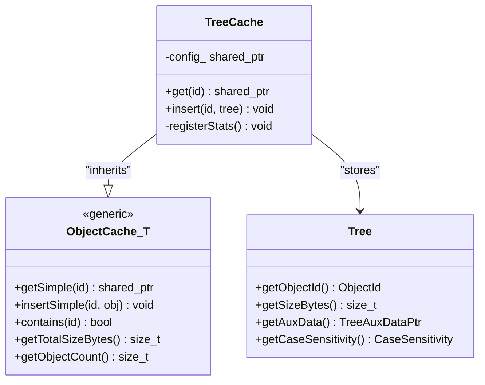
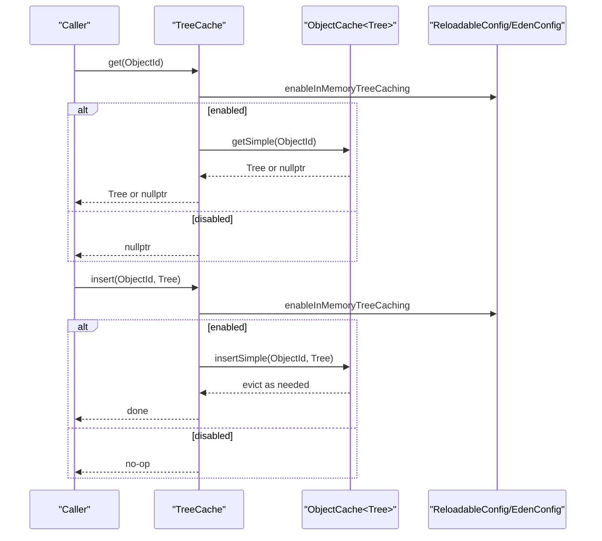
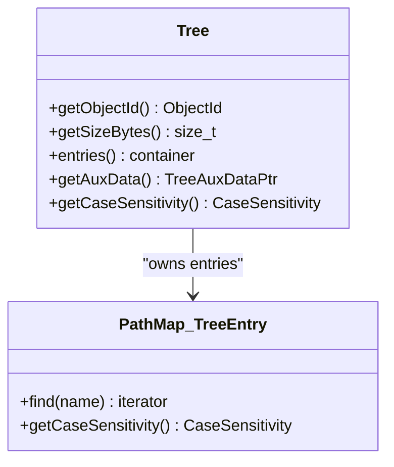
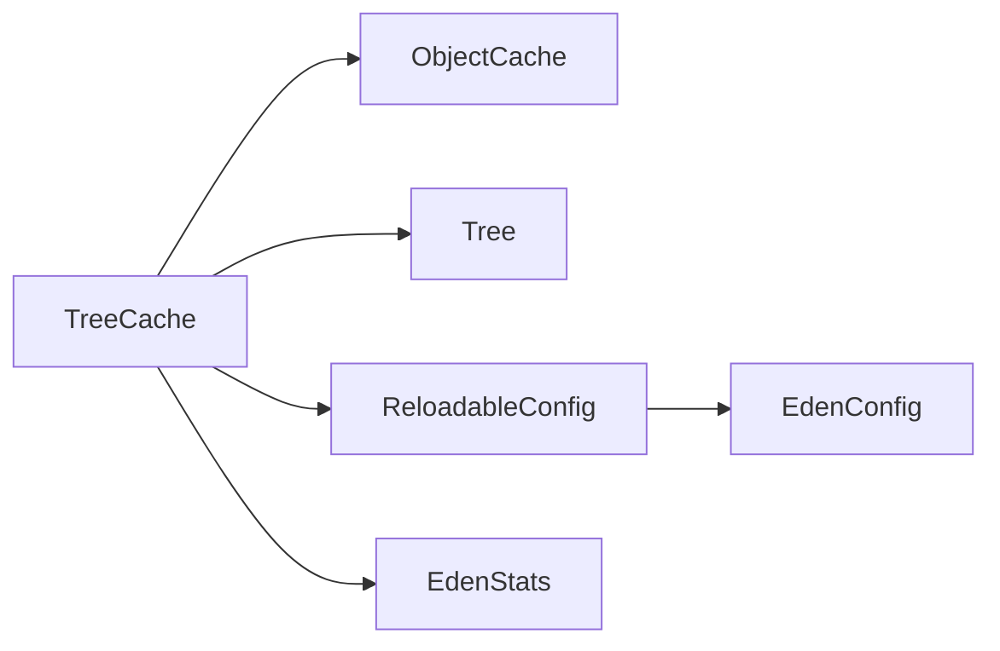

# Tree Cache System

<cite>
**Referenced Files in This Document**
- [TreeCache.h](file://eden/fs/store/TreeCache.h)
- [TreeCache.cpp](file://eden/fs/store/TreeCache.cpp)
- [Tree.h](file://eden/fs/model/Tree.h)
- [ObjectCache.h](file://eden/fs/store/ObjectCache.h)
- [TreeCacheTest.cpp](file://eden/fs/store/test/TreeCacheTest.cpp)
</cite>

## Table of Contents
1. [Introduction](#introduction)
2. [Project Structure](#project-structure)
3. [Core Components](#core-components)
4. [Architecture Overview](#architecture-overview)
5. [Detailed Component Analysis](#detailed-component-analysis)
6. [Dependency Analysis](#dependency-analysis)
7. [Performance Considerations](#performance-considerations)
8. [Troubleshooting Guide](#troubleshooting-guide)
9. [Conclusion](#conclusion)

## Introduction
This document describes the tree cache system in EdenFS object store architecture. It explains how directory structure caching works, how tree objects are cached and retrieved, and how auxiliary data is integrated. It also covers cache insertion and retrieval procedures, case sensitivity handling, cache invalidation, memory management, performance optimization, and the relationship between the tree cache and the backing store, including cache warming and consistency maintenance.

## Project Structure
The tree cache system resides in the EdenFS store layer and interacts with the model layer (Tree) and the generic object cache infrastructure. The primary files involved are:
- TreeCache interface and implementation
- Tree model definition and auxiliary data support
- Generic object cache base class
- Unit tests validating cache behavior

**Diagram sources**
- [TreeCache.h:35-78](file://eden/fs/store/TreeCache.h#L35-L78)
- [TreeCache.cpp:31-47](file://eden/fs/store/TreeCache.cpp#L31-L47)
- [Tree.h:24-135](file://eden/fs/model/Tree.h#L24-L135)
- [ObjectCache.h](file://eden/fs/store/ObjectCache.h)

**Section sources**
- [TreeCache.h:17-34](file://eden/fs/store/TreeCache.h#L17-L34)
- [TreeCache.cpp:31-47](file://eden/fs/store/TreeCache.cpp#L31-L47)
- [Tree.h:24-101](file://eden/fs/model/Tree.h#L24-L101)

## Core Components
- TreeCache: An LRU-style in-memory cache for Tree objects. It delegates storage and eviction to a generic object cache base and integrates with configuration and telemetry.
- Tree: Represents a directory structure with entries and optional auxiliary data. It exposes a memory footprint estimator used by the cache to enforce size limits.
- ObjectCache: Provides the generic LRU cache behavior, including size-based eviction and minimum item retention guarantees.
- Tests: Validate cache sizing, overflow behavior, and large object handling.

Key responsibilities:
- Insert and retrieve Tree objects by ObjectId
- Enforce cache size and minimum item constraints
- Respect configuration flags for enabling caching
- Expose cache statistics via telemetry

**Section sources**
- [TreeCache.h:54-78](file://eden/fs/store/TreeCache.h#L54-L78)
- [TreeCache.cpp:18-29](file://eden/fs/store/TreeCache.cpp#L18-L29)
- [Tree.h:63-101](file://eden/fs/model/Tree.h#L63-L101)

## Architecture Overview
TreeCache extends a generic object cache specialized for Tree objects. It reads configuration for cache size, minimum items, and sharding, and registers dynamic telemetry counters for memory usage and item counts.

**Diagram sources**
- [TreeCache.h:35-78](file://eden/fs/store/TreeCache.h#L35-L78)
- [TreeCache.cpp:31-47](file://eden/fs/store/TreeCache.cpp#L31-L47)
- [Tree.h:24-101](file://eden/fs/model/Tree.h#L24-L101)

## Detailed Component Analysis

### TreeCache Class
TreeCache encapsulates in-memory caching of Tree objects. It:
- Delegates get/insert to the generic cache when enabled by configuration
- Uses configuration values for maximum cache size and minimum retained items
- Adjusts shard count based on prefetch optimizations
- Registers dynamic counters for memory usage and item counts

**Diagram sources**
- [TreeCache.cpp:18-29](file://eden/fs/store/TreeCache.cpp#L18-L29)
- [TreeCache.h:58-65](file://eden/fs/store/TreeCache.h#L58-L65)

**Section sources**
- [TreeCache.h:35-78](file://eden/fs/store/TreeCache.h#L35-L78)
- [TreeCache.cpp:31-47](file://eden/fs/store/TreeCache.cpp#L31-L47)

### Tree Model and Auxiliary Data
Tree stores directory entries and optional auxiliary data. It:
- Exposes a memory footprint estimator used by the cache
- Supports case sensitivity queries
- Stores auxiliary data pointers for extended metadata

**Diagram sources**
- [Tree.h:24-101](file://eden/fs/model/Tree.h#L24-L101)

**Section sources**
- [Tree.h:46-101](file://eden/fs/model/Tree.h#L46-L101)

### Cache Insertion and Retrieval Procedures
- Insertion: If caching is enabled, the Tree is inserted into the generic cache. The cache enforces size limits and minimum item retention, potentially evicting older entries.
- Retrieval: If caching is enabled, the Tree is fetched from the cache; otherwise, nullptr is returned.
- Containment check: The cache supports existence checks for a given ObjectId.

Validation and behavior are demonstrated in unit tests:
- Multiple inserts succeed and remain retrievable
- Size overflow evicts least-fit entries while honoring minimum items
- Large trees exceeding cache size are retained only if minimum items allows

**Section sources**
- [TreeCache.cpp:18-29](file://eden/fs/store/TreeCache.cpp#L18-L29)
- [TreeCacheTest.cpp:125-179](file://eden/fs/store/test/TreeCacheTest.cpp#L125-L179)

### Case Sensitivity Handling
Tree exposes a case sensitivity indicator derived from its internal PathMap. This affects how directory entries are looked up and compared. Case sensitivity is part of the Tree’s identity and influences cache key semantics when used in higher-level operations.

**Section sources**
- [Tree.h:99-101](file://eden/fs/model/Tree.h#L99-L101)

### Cache Invalidation and Memory Management
- Invalidation: TreeCache relies on the generic cache’s eviction policy. There is no explicit invalidation method; evictions occur based on size thresholds and minimum item retention.
- Memory management: The cache estimates memory usage via Tree.getSizeBytes() and tracks total bytes and item counts. Sharding is adjusted based on prefetch optimizations to improve concurrency.

**Section sources**
- [TreeCache.cpp:31-47](file://eden/fs/store/TreeCache.cpp#L31-L47)
- [Tree.h:63](file://eden/fs/model/Tree.h#L63)

### Performance Optimization Techniques
- Sharded cache: The number of shards is dynamically set based on prefetch optimizations and configuration, improving concurrent access.
- Minimum retained items: Ensures frequently accessed large trees are preserved even if they exceed the cache size limit, reducing reload overhead.
- Telemetry: Dynamic counters expose current memory usage and item counts for monitoring and tuning.

**Section sources**
- [TreeCache.cpp:36-44](file://eden/fs/store/TreeCache.cpp#L36-L44)
- [TreeCache.cpp:55-61](file://eden/fs/store/TreeCache.cpp#L55-L61)

### Examples of Tree Cache Operations
- Insert multiple small trees and verify retrievability
- Trigger size overflow and observe eviction behavior
- Insert a large tree and confirm retention under minimum items
- Retrieve non-existent entries return nullptr

These scenarios are validated by the test suite.

**Section sources**
- [TreeCacheTest.cpp:125-179](file://eden/fs/store/test/TreeCacheTest.cpp#L125-L179)

### Cache Configuration Options
- Enable in-memory tree caching flag
- Maximum cache size in bytes
- Minimum number of items to retain
- Prefetch optimizations affecting shard count
- Optional tree cache shard count override

These options are read from ReloadableConfig and EdenConfig during TreeCache construction.

**Section sources**
- [TreeCache.cpp:32-44](file://eden/fs/store/TreeCache.cpp#L32-L44)
- [TreeCache.h:17-34](file://eden/fs/store/TreeCache.h#L17-L34)

### Integration with Tree Auxiliary Data Caching
Tree objects may carry auxiliary data via TreeAuxDataPtr. While the TreeCache itself caches Tree objects, auxiliary data is associated with Tree instances and can be accessed via Tree.getAuxData(). This enables caching of directory metadata alongside directory structures.

**Section sources**
- [Tree.h:55-57](file://eden/fs/model/Tree.h#L55-L57)

### Relationship Between Tree Cache and Backing Store
- Backing store: Trees are typically materialized from the backing store on demand. The TreeCache acts as a short-term in-memory buffer to reduce repeated deserialization and computation.
- Cache warming: Frequent access patterns can warm the cache with commonly used Tree objects.
- Consistency: Cache reads are gated by the enablement flag. When disabled, operations bypass the cache and fetch fresh data from the backing store.

**Section sources**
- [TreeCache.h:17-21](file://eden/fs/store/TreeCache.h#L17-L21)
- [TreeCache.cpp:18-23](file://eden/fs/store/TreeCache.cpp#L18-L23)

## Dependency Analysis
TreeCache depends on:
- ObjectCache generics for LRU behavior
- Tree model for object representation and memory estimation
- Configuration subsystem for runtime tuning
- Telemetry for dynamic counters

**Diagram sources**
- [TreeCache.h:35-78](file://eden/fs/store/TreeCache.h#L35-L78)
- [TreeCache.cpp:31-47](file://eden/fs/store/TreeCache.cpp#L31-L47)
- [Tree.h:24-101](file://eden/fs/model/Tree.h#L24-L101)

**Section sources**
- [TreeCache.h:35-78](file://eden/fs/store/TreeCache.h#L35-L78)
- [TreeCache.cpp:31-47](file://eden/fs/store/TreeCache.cpp#L31-L47)

## Performance Considerations
- Prefer enabling the cache when working with frequent directory scans or glob operations to reduce deserialization overhead.
- Tune inMemoryTreeCacheSize and inMemoryTreeCacheMinimumItems to balance hit rate and memory usage.
- Monitor tree_cache.memory and tree_cache.items counters to validate effectiveness.
- Use prefetch optimizations to increase shard count for improved concurrency under heavy loads.

[No sources needed since this section provides general guidance]

## Troubleshooting Guide
Common issues and diagnostics:
- Cache appears empty: Verify enableInMemoryTreeCaching is true.
- Evictions occur too aggressively: Increase inMemoryTreeCacheSize or inMemoryTreeCacheMinimumItems.
- Memory pressure: Inspect tree_cache.memory and adjust cache size or disable caching selectively.
- Large trees not retained: Ensure minimum items is at least 1 to allow oversized trees to stay.

**Section sources**
- [TreeCache.cpp:18-29](file://eden/fs/store/TreeCache.cpp#L18-L29)
- [TreeCache.cpp:55-61](file://eden/fs/store/TreeCache.cpp#L55-L61)

## Conclusion
The TreeCache system provides efficient, configurable in-memory caching for Tree objects in EdenFS. It leverages a generic object cache base to enforce size limits and minimum retention, integrates with configuration and telemetry, and supports auxiliary data through the Tree model. Proper tuning of cache size and minimum items, combined with monitoring, ensures strong performance for directory-heavy workloads while maintaining consistency with the backing store.