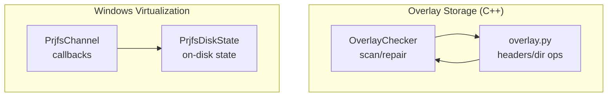
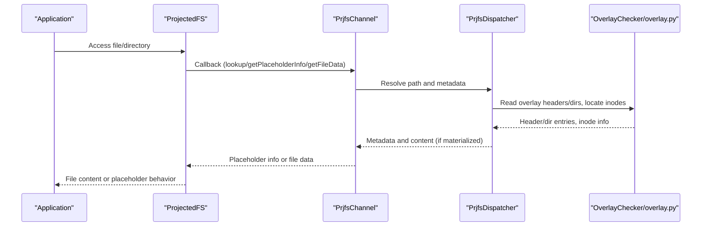
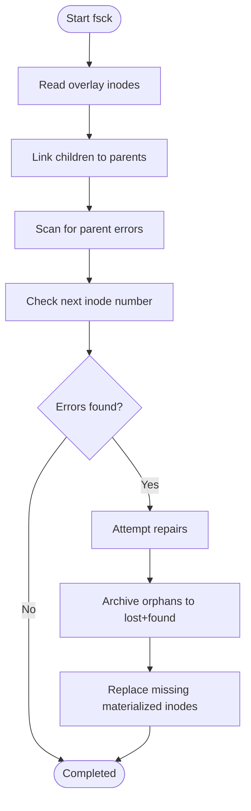
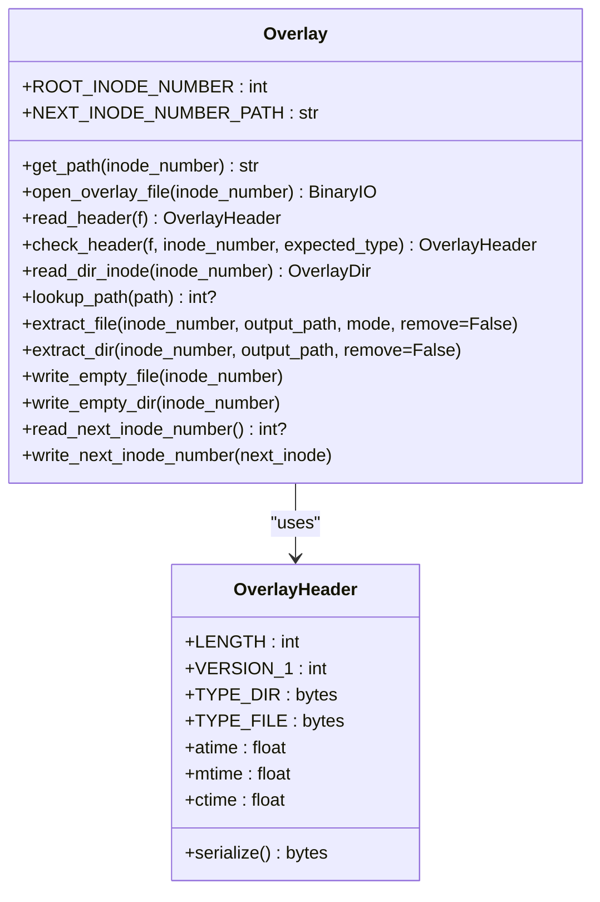
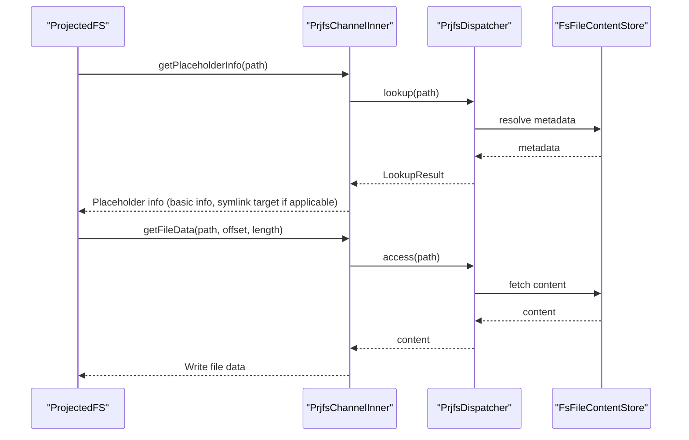
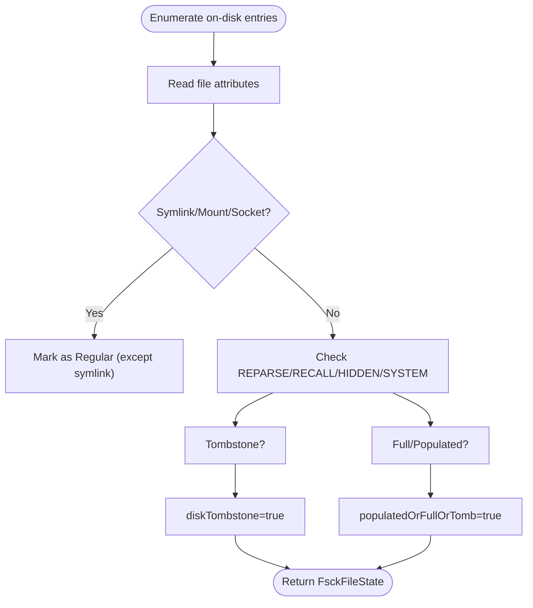
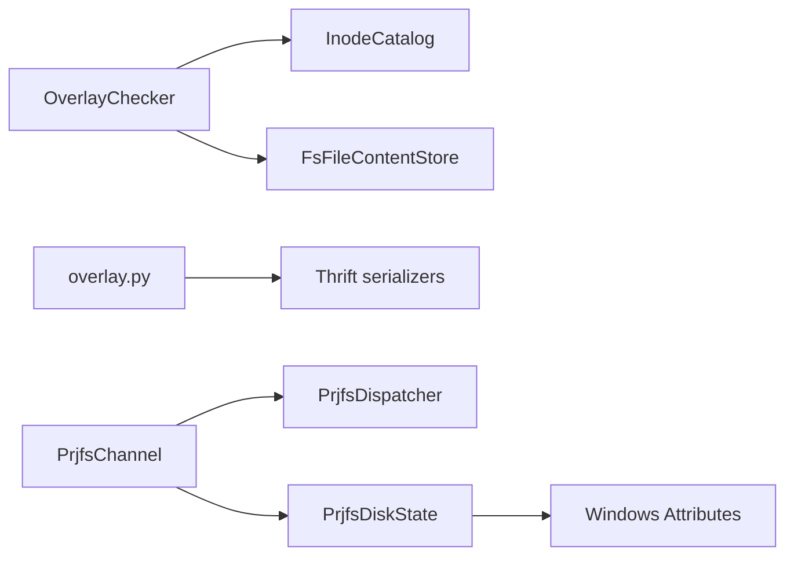

# Overlay Filesystem Implementation

<cite>
**Referenced Files in This Document**
- [OverlayChecker.h](file://eden/fs/inodes/overlay/OverlayChecker.h)
- [OverlayChecker.cpp](file://eden/fs/inodes/overlay/OverlayChecker.cpp)
- [overlay.py](file://eden/fs/cli/overlay.py)
- [PrjfsChannel.h](file://eden/fs/prjfs/PrjfsChannel.h)
- [PrjfsChannel.cpp](file://eden/fs/prjfs/PrjfsChannel.cpp)
- [PrjfsDiskState.h](file://eden/fs/prjfs/PrjfsDiskState.h)
- [PrjfsDiskState.cpp](file://eden/fs/prjfs/PrjfsDiskState.cpp)
</cite>

## Table of Contents
1. [Introduction](#introduction)
2. [Project Structure](#project-structure)
3. [Core Components](#core-components)
4. [Architecture Overview](#architecture-overview)
5. [Detailed Component Analysis](#detailed-component-analysis)
6. [Dependency Analysis](#dependency-analysis)
7. [Performance Considerations](#performance-considerations)
8. [Troubleshooting Guide](#troubleshooting-guide)
9. [Conclusion](#conclusion)

## Introduction
This document explains the overlay filesystem implementation in EdenFS. The overlay filesystem separates local working copy changes from repository-managed content, enabling lazy loading of files and directories. It tracks materialized files, maintains an on-disk inode table, and coordinates with platform-specific virtualization layers (ProjectedFS on Windows) to materialize content on demand. The document covers overlay operations, checkout actions, access patterns, platform differences, performance considerations, and troubleshooting.

## Project Structure
The overlay implementation spans several modules:
- Overlay checker and on-disk inode storage (C++): validates and repairs overlay state.
- Python overlay client: reads/writes overlay headers, directories, and inode data.
- Windows ProjectedFS channel: integrates with the virtualization provider to lazily materialize files and directories.
- Disk state utilities (Windows): inspect on-disk placeholders and tombstones.

**Diagram sources**
- [OverlayChecker.h:37-117](file://eden/fs/inodes/overlay/OverlayChecker.h#L37-L117)
- [OverlayChecker.cpp:760-799](file://eden/fs/inodes/overlay/OverlayChecker.cpp#L760-L799)
- [overlay.py:162-456](file://eden/fs/cli/overlay.py#L162-L456)
- [PrjfsChannel.h:168-428](file://eden/fs/prjfs/PrjfsChannel.h#L168-L428)
- [PrjfsChannel.cpp:406-672](file://eden/fs/prjfs/PrjfsChannel.cpp#L406-L672)
- [PrjfsDiskState.h:32-63](file://eden/fs/prjfs/PrjfsDiskState.h#L32-L63)
- [PrjfsDiskState.cpp:184-238](file://eden/fs/prjfs/PrjfsDiskState.cpp#L184-L238)

**Section sources**
- [OverlayChecker.h:31-117](file://eden/fs/inodes/overlay/OverlayChecker.h#L31-L117)
- [overlay.py:162-456](file://eden/fs/cli/overlay.py#L162-L456)
- [PrjfsChannel.h:168-428](file://eden/fs/prjfs/PrjfsChannel.h#L168-L428)
- [PrjfsDiskState.h:32-63](file://eden/fs/prjfs/PrjfsDiskState.h#L32-L63)

## Core Components
- OverlayChecker: Scans the on-disk overlay for inconsistencies, records errors, and supports repair actions.
- overlay.py: Provides overlay file header parsing, directory and file inode serialization/deserialization, and extraction utilities.
- PrjfsChannel: Bridges ProjectedFS callbacks to EdenFS operations, including directory enumeration, placeholder creation, and file data retrieval.
- PrjfsDiskState: Interprets Windows file attributes to determine on-disk state (placeholder, full, tombstone, symlink, etc.).

Key responsibilities:
- Lazy loading: Overlay stores directory entries and metadata; content is materialized on access.
- Change tracking: Overlay tracks local modifications and materialized state independently from repository content.
- Platform-specific virtualization: Windows ProjectedFS uses placeholders and tombstones to manage virtualized files.

**Section sources**
- [OverlayChecker.h:37-117](file://eden/fs/inodes/overlay/OverlayChecker.h#L37-L117)
- [OverlayChecker.cpp:777-799](file://eden/fs/inodes/overlay/OverlayChecker.cpp#L777-L799)
- [overlay.py:162-456](file://eden/fs/cli/overlay.py#L162-L456)
- [PrjfsChannel.h:168-428](file://eden/fs/prjfs/PrjfsChannel.h#L168-L428)
- [PrjfsDiskState.h:32-63](file://eden/fs/prjfs/PrjfsDiskState.h#L32-L63)

## Architecture Overview
The overlay architecture separates repository-managed content from local working copy state:
- Repository content: managed by the backing store and SCM model.
- Overlay: stores directory metadata, inode headers, and materialized file data.
- Virtualization layer (Windows): ProjectedFS invokes callbacks to resolve placeholders and materialize content.

**Diagram sources**
- [PrjfsChannel.cpp:585-672](file://eden/fs/prjfs/PrjfsChannel.cpp#L585-L672)
- [PrjfsChannel.h:229-251](file://eden/fs/prjfs/PrjfsChannel.h#L229-L251)
- [OverlayChecker.cpp:777-799](file://eden/fs/inodes/overlay/OverlayChecker.cpp#L777-L799)
- [overlay.py:162-456](file://eden/fs/cli/overlay.py#L162-L456)

## Detailed Component Analysis

### Overlay Checker and On-Disk Overlay
The overlay checker validates overlay integrity and repairs issues:
- Scans inodes, verifies headers, and detects missing or inconsistent materialized files.
- Computes best-effort paths for inodes and archives orphans.
- Repairs by moving bad data to a dedicated repair directory and recreating overlay entries.

**Diagram sources**
- [OverlayChecker.cpp:777-800](file://eden/fs/inodes/overlay/OverlayChecker.cpp#L777-L800)
- [OverlayChecker.h:84-117](file://eden/fs/inodes/overlay/OverlayChecker.h#L84-L117)

Key operations:
- Overlay header parsing and validation.
- Directory traversal to locate materialized files and detect missing entries.
- Orphan detection and archival to preserve data safely.

**Section sources**
- [OverlayChecker.h:37-117](file://eden/fs/inodes/overlay/OverlayChecker.h#L37-L117)
- [OverlayChecker.cpp:777-800](file://eden/fs/inodes/overlay/OverlayChecker.cpp#L777-L800)

### Overlay Python Client
The Python overlay client handles overlay file headers and directory structures:
- OverlayHeader: Defines overlay file format, timestamps, and type markers.
- Overlay: Manages inode file paths, opens overlay files, reads headers, and parses directory entries.
- Path lookup: Traverses overlay directories to resolve paths and detect non-materialized nodes.
- Extraction: Copies materialized files/directories out of the overlay and optionally removes them.

**Diagram sources**
- [overlay.py:49-160](file://eden/fs/cli/overlay.py#L49-L160)
- [overlay.py:162-456](file://eden/fs/cli/overlay.py#L162-L456)

**Section sources**
- [overlay.py:162-456](file://eden/fs/cli/overlay.py#L162-L456)

### Windows ProjectedFS Channel
The Windows channel integrates with ProjectedFS:
- Callbacks: startEnumeration, getEnumerationData, getPlaceholderInfo, queryFileName, getFileData.
- Notifications: file creation, overwrite, rename, delete, hardlink, convert-to-full.
- Placeholder state: Uses Windows attributes to distinguish placeholders, full files, tombstones, and symlinks.
- Telemetry: Tracks outstanding requests and logs long-running operations.

**Diagram sources**
- [PrjfsChannel.cpp:585-672](file://eden/fs/prjfs/PrjfsChannel.cpp#L585-L672)
- [PrjfsChannel.h:229-251](file://eden/fs/prjfs/PrjfsChannel.h#L229-L251)

**Section sources**
- [PrjfsChannel.h:168-428](file://eden/fs/prjfs/PrjfsChannel.h#L168-L428)
- [PrjfsChannel.cpp:406-672](file://eden/fs/prjfs/PrjfsChannel.cpp#L406-L672)

### Windows Disk State Utilities
These utilities interpret Windows file attributes to determine on-disk state:
- Detects placeholders, full files, tombstones, and empty placeholders.
- Supports symlink detection and renamed placeholders.
- Builds a map of on-disk entries for verification against overlay and SCM.

**Diagram sources**
- [PrjfsDiskState.cpp:90-177](file://eden/fs/prjfs/PrjfsDiskState.cpp#L90-L177)
- [PrjfsDiskState.h:32-63](file://eden/fs/prjfs/PrjfsDiskState.h#L32-L63)

**Section sources**
- [PrjfsDiskState.h:32-63](file://eden/fs/prjfs/PrjfsDiskState.h#L32-L63)
- [PrjfsDiskState.cpp:184-238](file://eden/fs/prjfs/PrjfsDiskState.cpp#L184-L238)

## Dependency Analysis
- OverlayChecker depends on InodeCatalog and FsFileContentStore to traverse overlay data and repair issues.
- overlay.py depends on Thrift serializers to parse OverlayDir and OverlayEntry structures.
- PrjfsChannel bridges ProjectedFS callbacks to dispatcher and overlay storage.
- PrjfsDiskState interprets Windows file attributes to infer virtualization state.

**Diagram sources**
- [OverlayChecker.h:28-30](file://eden/fs/inodes/overlay/OverlayChecker.h#L28-L30)
- [overlay.py:23-25](file://eden/fs/cli/overlay.py#L23-L25)
- [PrjfsChannel.h:168-180](file://eden/fs/prjfs/PrjfsChannel.h#L168-L180)
- [PrjfsDiskState.h:18-22](file://eden/fs/prjfs/PrjfsDiskState.h#L18-L22)

**Section sources**
- [OverlayChecker.h:28-30](file://eden/fs/inodes/overlay/OverlayChecker.h#L28-L30)
- [overlay.py:23-25](file://eden/fs/cli/overlay.py#L23-L25)
- [PrjfsChannel.h:168-180](file://eden/fs/prjfs/PrjfsChannel.h#L168-L180)
- [PrjfsDiskState.h:18-22](file://eden/fs/prjfs/PrjfsDiskState.h#L18-L22)

## Performance Considerations
- Lazy loading minimizes disk IO by materializing only accessed content.
- Overlay scanning uses parallel threads to discover errors efficiently.
- Windows ProjectedFS chunked writes and placeholder alignment optimize large file transfers.
- Negative path caching and placeholder enforcement reduce unnecessary callbacks for newly created directories.

Recommendations:
- Prefer incremental checkout and targeted materialization for large repositories.
- Monitor long-running FS requests via telemetry to identify hotspots.
- Use overlay fsck to proactively detect and repair inconsistencies.

[No sources needed since this section provides general guidance]

## Troubleshooting Guide
Common issues and resolutions:
- Overlay corruption: Run overlay fsck to detect and repair missing or inconsistent materialized files. The checker archives orphans and replaces missing entries.
- Windows placeholder mismatches: Use disk state utilities to verify placeholder/full/tombstone states and reconcile discrepancies.
- Locked files preventing eviction: Remove cached files only when safe; failures often indicate user locks.
- Misbehaving applications: ProjectedFS blocks known applications that force overfetch; adjust policies or exclude problematic tools.

Operational tips:
- Use overlay path lookup to verify materialization status.
- Extract materialized content for diagnostics when needed.
- Inspect telemetry logs for long-running operations and error rates.

**Section sources**
- [OverlayChecker.cpp:777-800](file://eden/fs/inodes/overlay/OverlayChecker.cpp#L777-L800)
- [PrjfsChannel.cpp:100-124](file://eden/fs/prjfs/PrjfsChannel.cpp#L100-L124)
- [PrjfsDiskState.cpp:184-238](file://eden/fs/prjfs/PrjfsDiskState.cpp#L184-L238)

## Conclusion
EdenFS overlay filesystem separates repository-managed content from local working copy state, enabling efficient lazy loading and robust change tracking. The overlay checker ensures data integrity, the Python overlay client provides low-level inode operations, and the Windows ProjectedFS channel integrates virtualization callbacks with overlay storage. Together, these components deliver scalable, cross-platform performance and reliability for large repositories.