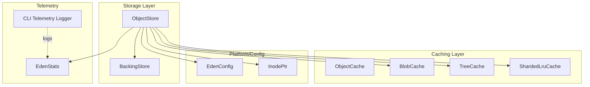
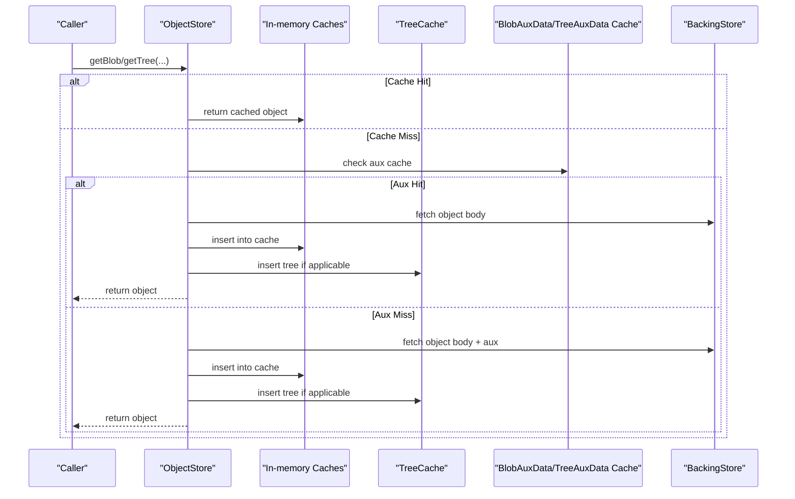
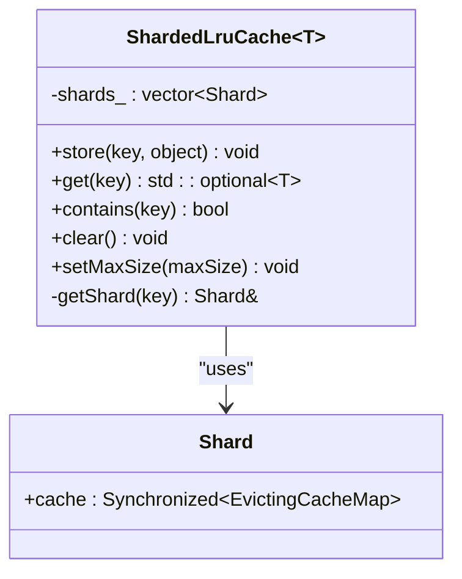
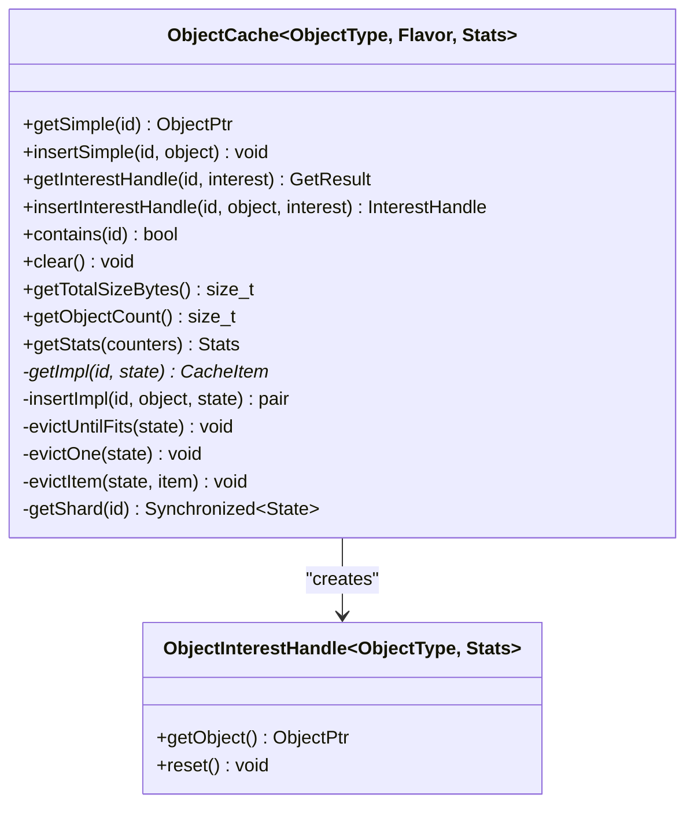
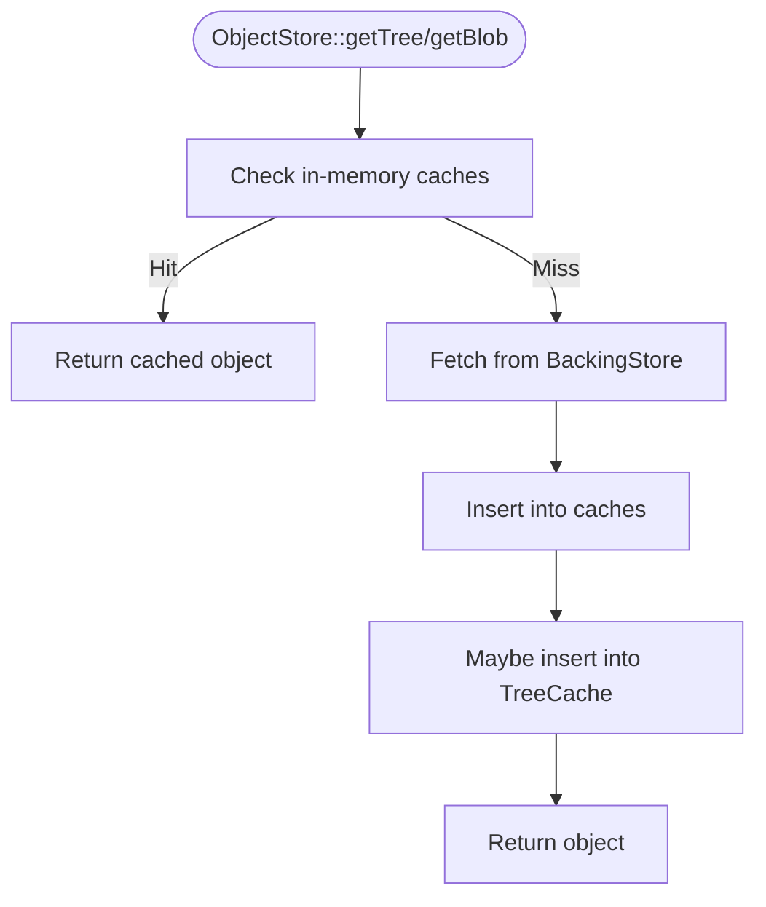
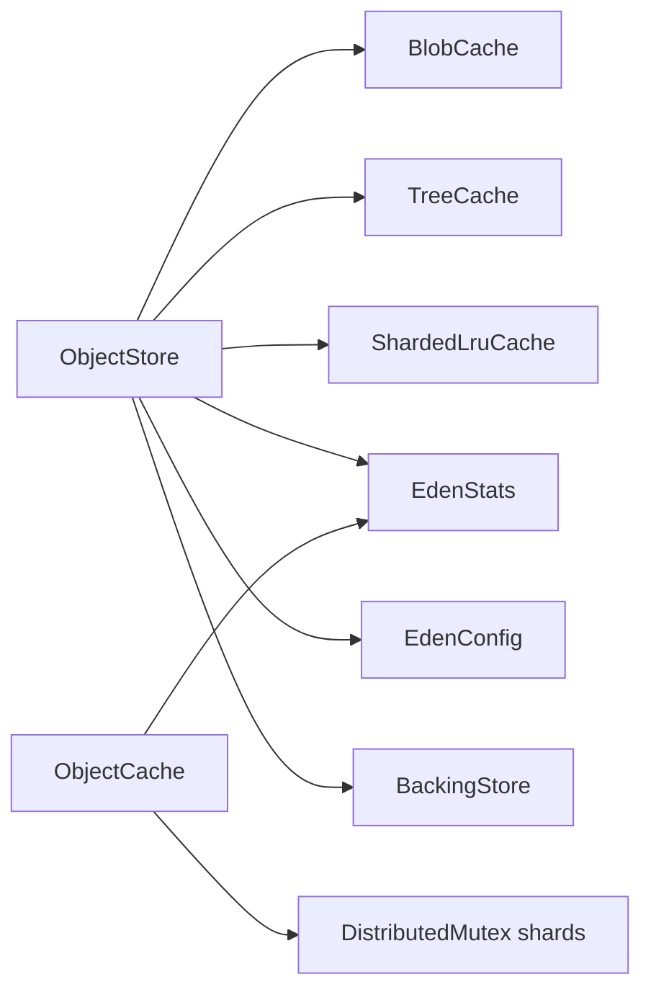

# Performance Optimization and Memory Management

<cite>
**Referenced Files in This Document**
- [ShardedLruCache.h](file://eden/fs/utils/ShardedLruCache.h)
- [ObjectCache.h](file://eden/fs/store/ObjectCache.h)
- [ObjectCache-inl.h](file://eden/fs/store/ObjectCache-inl.h)
- [BlobCache.h](file://eden/fs/store/BlobCache.h)
- [TreeCache.h](file://eden/fs/store/TreeCache.h)
- [TreeCache.cpp](file://eden/fs/store/TreeCache.cpp)
- [ObjectStore.h](file://eden/fs/store/ObjectStore.h)
- [EdenStats.h](file://eden/fs/telemetry/EdenStats.h)
- [telemetry.py](file://eden/fs/cli/telemetry.py)
- [telemetry_test.py](file://eden/fs/cli/test/telemetry_test.py)
- [InodePtr.h](file://eden/fs/inodes/InodePtr.h)
- [EdenConfig.h](file://eden/fs/config/EdenConfig.h)
- [lru_cache.cpp](file://eden/fs/benchmarks/lru_cache.cpp)
- [ShardedLruCacheTest.cpp](file://eden/fs/utils/test/ShardedLruCacheTest.cpp)
- [BlobCacheTest.cpp](file://eden/fs/store/test/BlobCacheTest.cpp)
- [TreeCacheTest.cpp](file://eden/fs/store/test/TreeCacheTest.cpp)
</cite>

## Table of Contents
1. [Introduction](#introduction)
2. [Project Structure](#project-structure)
3. [Core Components](#core-components)
4. [Architecture Overview](#architecture-overview)
5. [Detailed Component Analysis](#detailed-component-analysis)
6. [Dependency Analysis](#dependency-analysis)
7. [Performance Considerations](#performance-considerations)
8. [Troubleshooting Guide](#troubleshooting-guide)
9. [Conclusion](#conclusion)
10. [Appendices](#appendices)

## Introduction
This document explains performance optimization and memory management strategies in EdenFS. It focuses on the lazy-loading architecture, caching layers (inode, blob, tree), sharded LRU caches, memory-efficient data structures, and telemetry-driven bottleneck identification. It also covers platform-specific optimizations, threading models, and concurrent access patterns that influence performance at scale.

## Project Structure
EdenFS organizes performance-critical components across several subsystems:
- Storage and caching: ObjectStore, BlobCache, TreeCache, ObjectCache base template
- Concurrency and memory: ShardedLruCache, thread-local stats, per-thread utilities
- Telemetry and monitoring: EdenStats, CLI telemetry utilities
- Platform and configuration: EdenConfig, inode lifecycle, case sensitivity, prefetch settings

**Diagram sources**
- [ObjectStore.h:110-123](file://eden/fs/store/ObjectStore.h#L110-L123)
- [BlobCache.h:32-56](file://eden/fs/store/BlobCache.h#L32-L56)
- [TreeCache.h:35-78](file://eden/fs/store/TreeCache.h#L35-L78)
- [ShardedLruCache.h:28-41](file://eden/fs/utils/ShardedLruCache.h#L28-L41)
- [EdenStats.h:45-99](file://eden/fs/telemetry/EdenStats.h#L45-L99)
- [EdenConfig.h:598-723](file://eden/fs/config/EdenConfig.h#L598-L723)
- [InodePtr.h:31-184](file://eden/fs/inodes/InodePtr.h#L31-L184)

**Section sources**
- [ObjectStore.h:110-123](file://eden/fs/store/ObjectStore.h#L110-L123)
- [EdenStats.h:45-99](file://eden/fs/telemetry/EdenStats.h#L45-L99)
- [EdenConfig.h:598-723](file://eden/fs/config/EdenConfig.h#L598-L723)

## Core Components
- Sharded LRU Cache: Reduces lock contention by sharding an LRU across multiple buckets keyed by ObjectId hash. Supports pruning hooks and dynamic max size.
- ObjectCache Template: Base LRU cache with per-shard state, reference-counted interest handles, and minimum-entry eviction policy.
- BlobCache: Interest-handle flavor of ObjectCache for blobs with per-thread stats and eviction hooks.
- TreeCache: Simple flavor of ObjectCache for trees, gated by configuration and registered with stats.
- ObjectStore: Orchestrates memory caches (blob/tree aux data), tree cache, and backing store, with process-aware fetch throttling and telemetry.
- EdenStats: Thread-local stats groups for Fuse/NFS/Prjfs/ObjectStore/etc., aggregated to fb303.
- CLI Telemetry: JSON logger and sample builders for collecting runtime telemetry.

**Section sources**
- [ShardedLruCache.h:28-121](file://eden/fs/utils/ShardedLruCache.h#L28-L121)
- [ObjectCache.h:118-444](file://eden/fs/store/ObjectCache.h#L118-L444)
- [ObjectCache-inl.h:63-581](file://eden/fs/store/ObjectCache-inl.h#L63-L581)
- [BlobCache.h:32-113](file://eden/fs/store/BlobCache.h#L32-L113)
- [TreeCache.h:35-81](file://eden/fs/store/TreeCache.h#L35-L81)
- [TreeCache.cpp:18-31](file://eden/fs/store/TreeCache.cpp#L18-L31)
- [ObjectStore.h:488-536](file://eden/fs/store/ObjectStore.h#L488-L536)
- [EdenStats.h:45-199](file://eden/fs/telemetry/EdenStats.h#L45-L199)
- [telemetry.py:52-379](file://eden/fs/cli/telemetry.py#L52-L379)

## Architecture Overview
EdenFS employs a layered architecture:
- Lazy loading: Objects are fetched on demand from the backing store and cached in memory.
- Inode lifecycle: Inodes maintain reference counts; they are not destroyed immediately upon refcount drop but become eligible for unload.
- Caching tiers:
  - ObjectStore in-memory caches for blob/tree auxiliary data.
  - TreeCache for trees used by Thrift/Glob operations.
  - Sharded LRU caches to minimize contention.
- Telemetry: Thread-local stats and CLI telemetry capture durations and counters for bottleneck detection.

**Diagram sources**
- [ObjectStore.h:282-311](file://eden/fs/store/ObjectStore.h#L282-L311)
- [ObjectStore.h:440-476](file://eden/fs/store/ObjectStore.h#L440-L476)
- [TreeCache.cpp:18-31](file://eden/fs/store/TreeCache.cpp#L18-L31)
- [BlobCache.h:82-97](file://eden/fs/store/BlobCache.h#L82-L97)

## Detailed Component Analysis

### Sharded LRU Cache
- Purpose: Scalable LRU for high-concurrency scenarios by sharding on ObjectId hash.
- Behavior: Each shard maintains its own EvictingCacheMap with optional prune hook. Max size is split across shards; zero disables eviction.
- Contention reduction: Lock per shard minimizes hot-spot contention compared to a single global LRU.

**Diagram sources**
- [ShardedLruCache.h:28-121](file://eden/fs/utils/ShardedLruCache.h#L28-L121)

**Section sources**
- [ShardedLruCache.h:28-121](file://eden/fs/utils/ShardedLruCache.h#L28-L121)
- [lru_cache.cpp:14-51](file://eden/fs/benchmarks/lru_cache.cpp#L14-L51)
- [ShardedLruCacheTest.cpp:17-129](file://eden/fs/utils/test/ShardedLruCacheTest.cpp#L17-L129)

### ObjectCache Template and Interest Handles
- Purpose: Generic LRU cache with configurable maximum size and minimum entry count. Supports two flavors:
  - Simple: Basic LRU for straightforward get/insert.
  - InterestHandle: Adds reference-counting and interest handles to reduce churn and enable precise eviction hints.
- Minimum entry policy: Ensures frequently accessed large objects are retained even if they exceed cache size.
- Sharding: DistributedMutex-based shards keyed by ObjectId hash.
- Stats: Thread-local counters for hits, misses, evictions, and drops.

**Diagram sources**
- [ObjectCache.h:118-444](file://eden/fs/store/ObjectCache.h#L118-L444)
- [ObjectCache-inl.h:63-581](file://eden/fs/store/ObjectCache-inl.h#L63-L581)

**Section sources**
- [ObjectCache.h:92-117](file://eden/fs/store/ObjectCache.h#L92-L117)
- [ObjectCache-inl.h:517-564](file://eden/fs/store/ObjectCache-inl.h#L517-L564)
- [ObjectCache-inl.h:145-179](file://eden/fs/store/ObjectCache-inl.h#L145-L179)

### BlobCache
- Flavor: InterestHandle.
- Policy: Uses ObjectCache with maximum size and minimum entry count. Enables/disables based on configuration.
- Stats: Tracks hits, misses, evictions, and drops via BlobCacheStats.

**Section sources**
- [BlobCache.h:32-113](file://eden/fs/store/BlobCache.h#L32-L113)
- [EdenStats.h:654-659](file://eden/fs/telemetry/EdenStats.h#L654-L659)

### TreeCache
- Flavor: Simple.
- Policy: Controlled by configuration; inserts trees only when enabled. Maintains size and minimum entry constraints.
- Stats: Tracks hits, misses, evictions, and drops via TreeCacheStats.

**Section sources**
- [TreeCache.h:35-81](file://eden/fs/store/TreeCache.h#L35-L81)
- [TreeCache.cpp:18-31](file://eden/fs/store/TreeCache.cpp#L18-L31)
- [EdenStats.h:661-666](file://eden/fs/telemetry/EdenStats.h#L661-L666)

### ObjectStore Caching and Prefetch
- In-memory caches:
  - blobAuxDataCache_: Sharded LRU for blob auxiliary data.
  - treeAuxDataCache_: Sharded LRU for tree auxiliary data.
- Tree cache: Shared TreeCache for Thrift/Glob operations.
- Prefetch: Configurable maximum tree prefetches and metadata cache size/shards.
- Process-aware throttling: Tracks per-process fetch counts and can deprioritize heavy fetchers.

**Diagram sources**
- [ObjectStore.h:440-476](file://eden/fs/store/ObjectStore.h#L440-L476)
- [ObjectStore.h:488-507](file://eden/fs/store/ObjectStore.h#L488-L507)

**Section sources**
- [ObjectStore.h:488-536](file://eden/fs/store/ObjectStore.h#L488-L536)
- [EdenConfig.h:619-651](file://eden/fs/config/EdenConfig.h#L619-L651)

### Inode Lifecycle and Memory Efficiency
- InodePtr manages reference counts and delayed destruction semantics, allowing controlled unload of inodes to bound memory.
- Case sensitivity and platform flags influence tree retrieval and caching behavior.

**Section sources**
- [InodePtr.h:31-184](file://eden/fs/inodes/InodePtr.h#L31-L184)
- [ObjectStore.h:530-535](file://eden/fs/store/ObjectStore.h#L530-L535)

## Dependency Analysis
- ObjectStore depends on:
  - BlobCache and TreeCache for caching.
  - ShardedLruCache for auxiliary data caches.
  - EdenStats for telemetry.
  - EdenConfig for runtime settings.
  - BackingStore for authoritative data.
- ObjectCache uses:
  - DistributedMutex-based shards.
  - Intrusive lists and F14NodeMap for efficient eviction and indexing.
- CLI telemetry integrates with EdenStats for logging and sampling.

**Diagram sources**
- [ObjectStore.h:110-123](file://eden/fs/store/ObjectStore.h#L110-L123)
- [ObjectCache.h:435-439](file://eden/fs/store/ObjectCache.h#L435-L439)
- [EdenStats.h:45-99](file://eden/fs/telemetry/EdenStats.h#L45-L99)

**Section sources**
- [ObjectStore.h:110-123](file://eden/fs/store/ObjectStore.h#L110-L123)
- [ObjectCache.h:435-439](file://eden/fs/store/ObjectCache.h#L435-L439)

## Performance Considerations
- Sharding and contention:
  - ShardedLruCache reduces lock contention for high-throughput workloads.
  - ObjectCache shards use DistributedMutex to balance fairness and locality.
- Eviction policies:
  - ObjectCache enforces a minimum entry count to avoid reloading frequently accessed large objects.
  - Evictions occur when total size exceeds maximum and queue length exceeds minimum count.
- Memory footprint:
  - Auxiliary data caches use ShardedLruCache to cap memory usage.
  - TreeCache and BlobCache expose total size and object count for monitoring.
- Throughput knobs:
  - EdenConfig controls prefetch concurrency and metadata cache size/shards.
  - ObjectStore tracks per-process fetch counts and can deprioritize heavy fetchers.

**Section sources**
- [ShardedLruCache.h:28-41](file://eden/fs/utils/ShardedLruCache.h#L28-L41)
- [ObjectCache-inl.h:517-530](file://eden/fs/store/ObjectCache-inl.h#L517-L530)
- [ObjectStore.h:488-507](file://eden/fs/store/ObjectStore.h#L488-L507)
- [EdenConfig.h:619-651](file://eden/fs/config/EdenConfig.h#L619-L651)

## Troubleshooting Guide
- Cache behavior verification:
  - ShardedLruCache tests validate store/get, eviction, and LRU ordering.
  - BlobCache and TreeCache tests validate eviction thresholds and size overflow behavior.
- Telemetry and logging:
  - CLI telemetry supports JSON logging and sample tagging; tests validate field emission and session metadata.
  - EdenStats aggregates thread-local counters to fb303-compatible stats groups.

**Section sources**
- [ShardedLruCacheTest.cpp:17-129](file://eden/fs/utils/test/ShardedLruCacheTest.cpp#L17-L129)
- [BlobCacheTest.cpp:47-69](file://eden/fs/store/test/BlobCacheTest.cpp#L47-L69)
- [TreeCacheTest.cpp:125-169](file://eden/fs/store/test/TreeCacheTest.cpp#L125-L169)
- [telemetry_test.py:18-57](file://eden/fs/cli/test/telemetry_test.py#L18-L57)
- [EdenStats.h:45-199](file://eden/fs/telemetry/EdenStats.h#L45-L199)

## Conclusion
EdenFS achieves strong performance and memory efficiency through:
- Lazy loading with robust caching layers (blob, tree, auxiliary data).
- Sharded LRU caches minimizing lock contention.
- Interest-handle caches reducing churn and enabling precise eviction.
- Thread-local telemetry for bottleneck identification.
- Configurable prefetch and metadata caching tuned for large-scale repositories.

## Appendices

### Benchmarks and Tests
- LRU cache benchmark harness demonstrates shard and key generation patterns.
- Unit tests validate eviction, ordering, and size limits across caches.

**Section sources**
- [lru_cache.cpp:14-51](file://eden/fs/benchmarks/lru_cache.cpp#L14-L51)
- [ShardedLruCacheTest.cpp:17-129](file://eden/fs/utils/test/ShardedLruCacheTest.cpp#L17-L129)
- [BlobCacheTest.cpp:47-69](file://eden/fs/store/test/BlobCacheTest.cpp#L47-L69)
- [TreeCacheTest.cpp:125-169](file://eden/fs/store/test/TreeCacheTest.cpp#L125-L169)