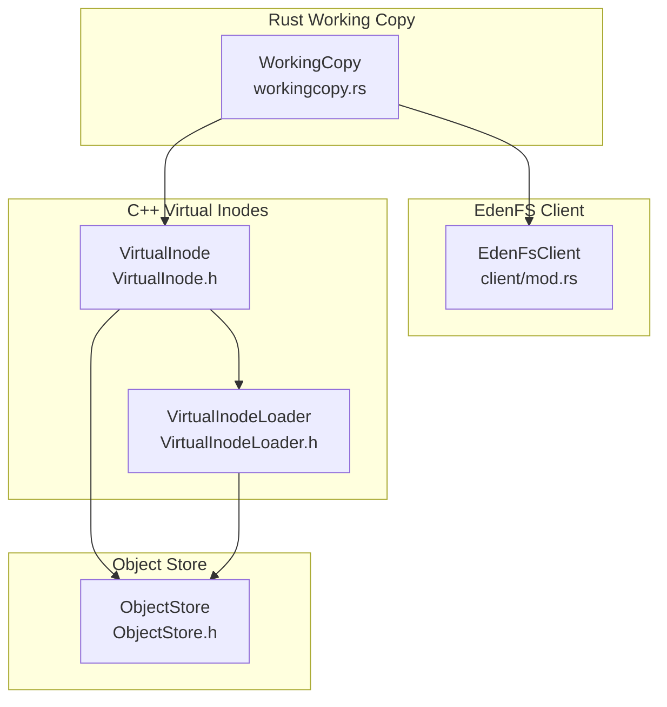
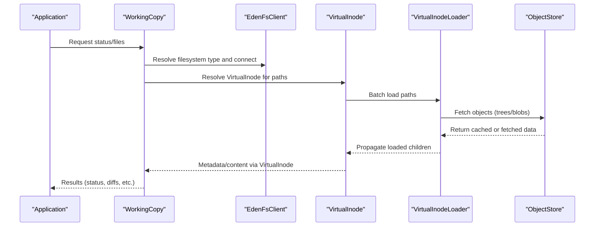
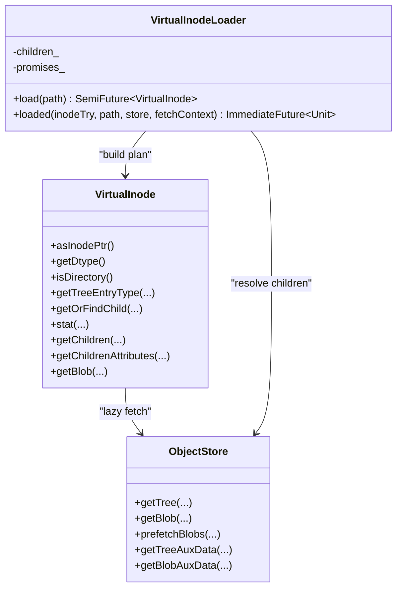
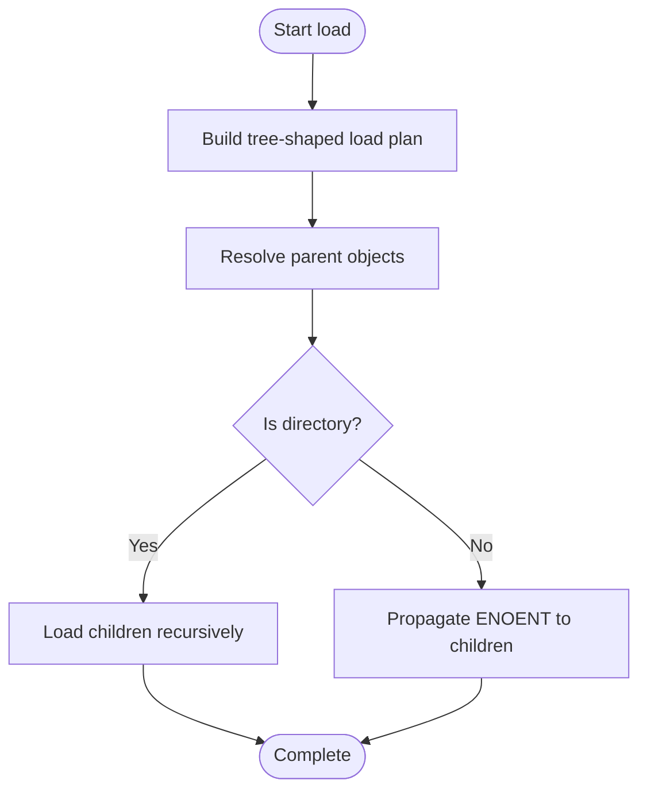
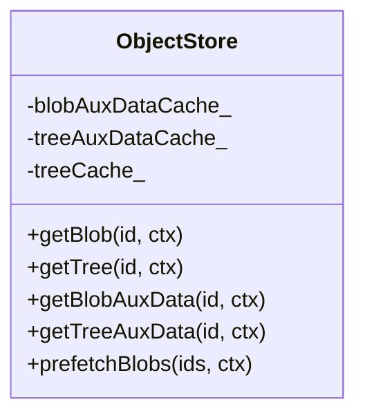
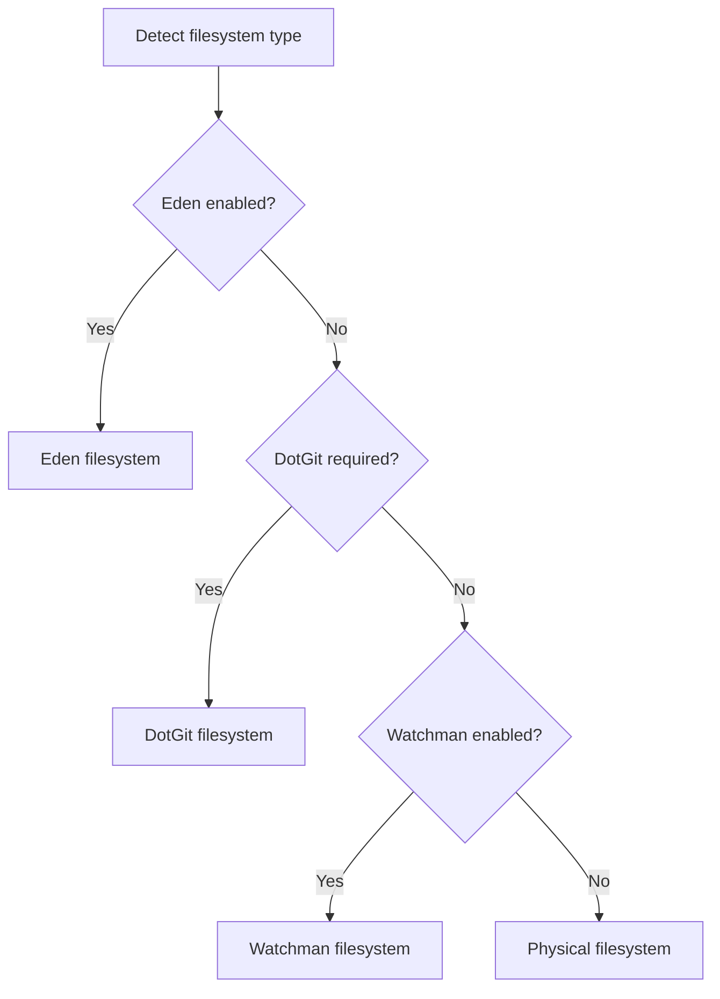
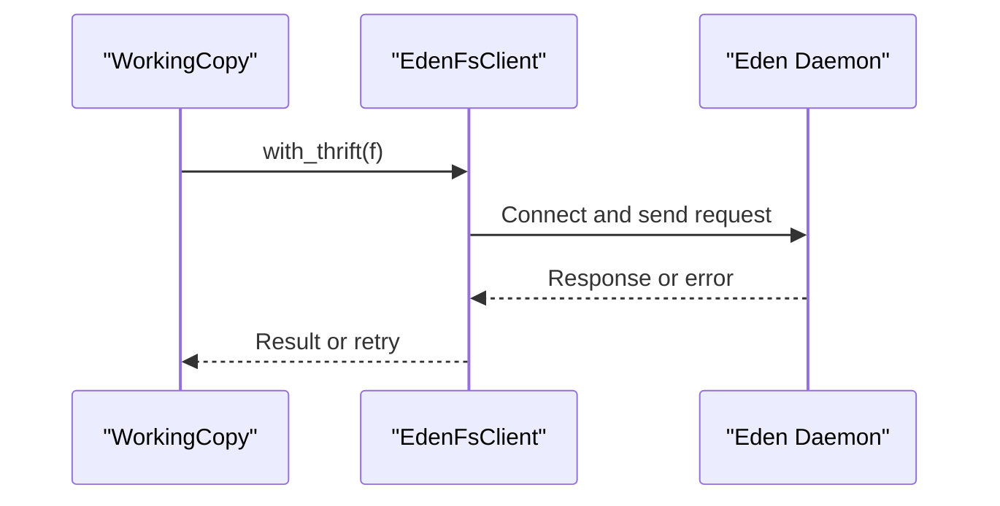
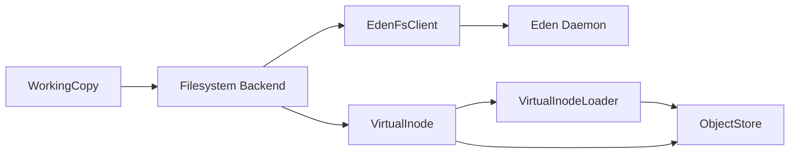

# Filesystem Integration

<cite>
**Referenced Files in This Document**
- [VirtualInodeLoader.h](file://eden/fs/inodes/VirtualInodeLoader.h)
- [VirtualInode.h](file://eden/fs/inodes/VirtualInode.h)
- [ObjectStore.h](file://eden/fs/store/ObjectStore.h)
- [workingcopy.rs](file://eden/scm/lib/workingcopy/src/workingcopy.rs)
- [mod.rs](file://eden/fs/cli_rs/edenfs-client/src/client/mod.rs)
- [VirtualInodeLoaderTest.cpp](file://eden/fs/inodes/test/VirtualInodeLoaderTest.cpp)
- [VirtualInodeTest.cpp](file://eden/fs/inodes/test/VirtualInodeTest.cpp)
</cite>

## Table of Contents
1. [Introduction](#introduction)
2. [Project Structure](#project-structure)
3. [Core Components](#core-components)
4. [Architecture Overview](#architecture-overview)
5. [Detailed Component Analysis](#detailed-component-analysis)
6. [Dependency Analysis](#dependency-analysis)
7. [Performance Considerations](#performance-considerations)
8. [Troubleshooting Guide](#troubleshooting-guide)
9. [Conclusion](#conclusion)

## Introduction
This document explains the SAPLING SCM filesystem integration with the EdenFS virtual filesystem. EdenFS enables lazy loading of repository contents to improve performance in large repositories by deferring materialization of files until they are accessed. The integration centers around virtual inode management, memory-efficient caches, and cross-platform abstractions that allow the working copy to operate transparently across different platforms while leveraging repository storage efficiently.

## Project Structure
The filesystem integration spans several subsystems:
- Rust working copy layer that selects and configures the appropriate filesystem abstraction (Eden, DotGit, Watchman, or Physical).
- EdenFS client that communicates with the Eden daemon via Thrift.
- C++ virtual inode layer that lazily resolves repository objects and exposes a unified interface for file and directory metadata.
- Object store layer that caches auxiliary data and coordinates with the backing store for on-demand retrieval.

**Diagram sources**
- [workingcopy.rs:300-356](file://eden/scm/lib/workingcopy/src/workingcopy.rs#L300-L356)
- [mod.rs:149-192](file://eden/fs/cli_rs/edenfs-client/src/client/mod.rs#L149-L192)
- [VirtualInode.h:46-268](file://eden/fs/inodes/VirtualInode.h#L46-L268)
- [VirtualInodeLoader.h:29-194](file://eden/fs/inodes/VirtualInodeLoader.h#L29-L194)
- [ObjectStore.h:110-539](file://eden/fs/store/ObjectStore.h#L110-L539)

**Section sources**
- [workingcopy.rs:111-223](file://eden/scm/lib/workingcopy/src/workingcopy.rs#L111-L223)
- [workingcopy.rs:300-356](file://eden/scm/lib/workingcopy/src/workingcopy.rs#L300-L356)

## Core Components
- VirtualInode: A polymorphic handle that represents a file or directory entry without requiring an on-disk inode. It can resolve to an actual inode, an unloaded entry, a tree, or a tree entry, enabling transparent access to repository metadata.
- VirtualInodeLoader: A hierarchical loader that minimizes redundant object loads by batching path resolution and propagating load outcomes to children.
- ObjectStore: A content-addressed store with in-memory caches for blobs and trees, coordinating with the backing store for on-demand retrieval and prefetching.
- EdenFsClient: A Thrift-based client that manages connections to the Eden daemon, retries, and timeouts.

Key responsibilities:
- Lazy loading: VirtualInode defers materialization until attributes or content are requested.
- Memory efficiency: ObjectStore maintains LRU caches for blob and tree auxiliary data and trees to reduce repeated disk access.
- Cross-platform abstraction: WorkingCopy selects the filesystem type based on configuration and environment, ensuring consistent behavior across platforms.

**Section sources**
- [VirtualInode.h:46-268](file://eden/fs/inodes/VirtualInode.h#L46-L268)
- [VirtualInodeLoader.h:29-194](file://eden/fs/inodes/VirtualInodeLoader.h#L29-L194)
- [ObjectStore.h:110-539](file://eden/fs/store/ObjectStore.h#L110-L539)
- [workingcopy.rs:111-223](file://eden/scm/lib/workingcopy/src/workingcopy.rs#L111-L223)

## Architecture Overview
The EdenFS integration follows a layered design:
- WorkingCopy chooses the filesystem type and constructs the appropriate backend (Eden, DotGit, Watchman, or Physical).
- EdenFsClient communicates with the Eden daemon to manage mounts and checkouts.
- VirtualInode and VirtualInodeLoader coordinate with ObjectStore to lazily fetch repository objects and expose metadata and content.
- ObjectStore maintains caches and interacts with the backing store for persistent storage.

**Diagram sources**
- [workingcopy.rs:300-356](file://eden/scm/lib/workingcopy/src/workingcopy.rs#L300-L356)
- [mod.rs:149-192](file://eden/fs/cli_rs/edenfs-client/src/client/mod.rs#L149-L192)
- [VirtualInodeLoader.h:29-194](file://eden/fs/inodes/VirtualInodeLoader.h#L29-L194)
- [ObjectStore.h:110-539](file://eden/fs/store/ObjectStore.h#L110-L539)

## Detailed Component Analysis

### Virtual Inode Management
VirtualInode encapsulates a union of possible representations (loaded inode, unloaded entry, tree, or tree entry) and exposes methods to query attributes and content without forcing materialization. VirtualInodeLoader builds a tree-shaped plan to minimize redundant loads and propagates outcomes to children, ensuring efficient traversal of directory hierarchies.

**Diagram sources**
- [VirtualInode.h:46-268](file://eden/fs/inodes/VirtualInode.h#L46-L268)
- [VirtualInodeLoader.h:29-194](file://eden/fs/inodes/VirtualInodeLoader.h#L29-L194)
- [ObjectStore.h:110-539](file://eden/fs/store/ObjectStore.h#L110-L539)

**Section sources**
- [VirtualInode.h:46-268](file://eden/fs/inodes/VirtualInode.h#L46-L268)
- [VirtualInodeLoader.h:29-194](file://eden/fs/inodes/VirtualInodeLoader.h#L29-L194)

### Lazy Loading Strategies
- Path-based batching: VirtualInodeLoader traverses path components to build a tree-shaped load plan, reducing repeated lookups to the backing store.
- Conditional materialization: VirtualInode defers resolving to an inode until necessary; otherwise, it queries metadata from the ObjectStore or tree entries.
- Attribute-driven fetching: Methods like getEntryAttributes and getChildrenAttributes request only the needed metadata, avoiding unnecessary content reads.

**Diagram sources**
- [VirtualInodeLoader.h:29-194](file://eden/fs/inodes/VirtualInodeLoader.h#L29-L194)

**Section sources**
- [VirtualInodeLoader.h:29-194](file://eden/fs/inodes/VirtualInodeLoader.h#L29-L194)

### Caching Mechanisms
- BlobAuxData and TreeAuxData caches: ObjectStore maintains LRU caches for auxiliary data to avoid repeated disk access during frequent attribute queries.
- Tree cache: A shared cache for trees reduces repeated lookups of directory structures.
- Prefetching: ObjectStore supports prefetching of blobs to overlap I/O with computation.

**Diagram sources**
- [ObjectStore.h:110-539](file://eden/fs/store/ObjectStore.h#L110-L539)

**Section sources**
- [ObjectStore.h:110-539](file://eden/fs/store/ObjectStore.h#L110-L539)

### Cross-Platform Filesystem Abstractions
- WorkingCopy selects the filesystem type based on repository requirements and environment:
  - Eden: Uses EdenFsClient and VirtualInode-based lazy loading.
  - DotGit: Uses a Git-compatible filesystem abstraction.
  - Watchman: Uses a file-state monitoring backend.
  - Normal: Uses a physical filesystem abstraction.
- Platform-specific features:
  - Windows symlink support is configurable and controlled via environment and repository requirements.
  - Case sensitivity is handled consistently across platforms.

**Diagram sources**
- [workingcopy.rs:111-223](file://eden/scm/lib/workingcopy/src/workingcopy.rs#L111-L223)

**Section sources**
- [workingcopy.rs:111-223](file://eden/scm/lib/workingcopy/src/workingcopy.rs#L111-L223)

### Native Filesystem Operations and Thrift Integration
- EdenFsClient provides a high-level interface to the Eden daemon, handling connection management, retries, and timeouts.
- The client forwards operations to the daemon via Thrift, enabling remote orchestration of mounts and checkouts.

**Diagram sources**
- [mod.rs:149-192](file://eden/fs/cli_rs/edenfs-client/src/client/mod.rs#L149-L192)

**Section sources**
- [mod.rs:149-192](file://eden/fs/cli_rs/edenfs-client/src/client/mod.rs#L149-L192)

## Dependency Analysis
- WorkingCopy depends on VFS and selects the filesystem backend based on configuration and environment.
- VirtualInode relies on ObjectStore for metadata and content retrieval and uses VirtualInodeLoader to batch and propagate loads.
- ObjectStore coordinates with the backing store and caches to optimize performance.
- EdenFsClient abstracts communication with the Eden daemon.

**Diagram sources**
- [workingcopy.rs:300-356](file://eden/scm/lib/workingcopy/src/workingcopy.rs#L300-L356)
- [VirtualInodeLoader.h:29-194](file://eden/fs/inodes/VirtualInodeLoader.h#L29-L194)
- [ObjectStore.h:110-539](file://eden/fs/store/ObjectStore.h#L110-L539)
- [mod.rs:149-192](file://eden/fs/cli_rs/edenfs-client/src/client/mod.rs#L149-L192)

**Section sources**
- [workingcopy.rs:300-356](file://eden/scm/lib/workingcopy/src/workingcopy.rs#L300-L356)
- [VirtualInodeLoader.h:29-194](file://eden/fs/inodes/VirtualInodeLoader.h#L29-L194)
- [ObjectStore.h:110-539](file://eden/fs/store/ObjectStore.h#L110-L539)
- [mod.rs:149-192](file://eden/fs/cli_rs/edenfs-client/src/client/mod.rs#L149-L192)

## Performance Considerations
- Lazy loading reduces I/O by deferring materialization until attributes or content are accessed.
- Batching path loads minimizes redundant lookups and improves throughput for directory traversals.
- In-memory caches for auxiliary data and trees reduce repeated disk access and speed up attribute queries.
- Prefetching overlaps I/O with computation, improving responsiveness for large repositories.
- Case sensitivity and platform-specific features are configured to avoid unnecessary overhead.

[No sources needed since this section provides general guidance]

## Troubleshooting Guide
Common issues and remedies:
- Status computation errors indicating stale parent commits: The working copy parses error messages and can repair the dirstate by setting the parent commit to the current value when configured to do so.
- Repairs and retries: When enabled, the system attempts to recover from transient errors by adjusting internal state and retrying operations.

**Section sources**
- [workingcopy.rs:358-396](file://eden/scm/lib/workingcopy/src/workingcopy.rs#L358-L396)
- [workingcopy.rs:767-775](file://eden/scm/lib/workingcopy/src/workingcopy.rs#L767-L775)

## Conclusion
The SAPLING SCM filesystem integration leverages a virtual inode architecture to enable lazy loading of repository contents, significantly improving performance in large repositories. By combining a robust ObjectStore with memory-efficient caches, a hierarchical VirtualInodeLoader, and a cross-platform filesystem abstraction, the system delivers transparent and efficient access to source-controlled files and directories. The EdenFs client and Thrift-based integration provide reliable communication with the Eden daemon, while platform-specific configurations ensure compatibility and optimal behavior across environments.