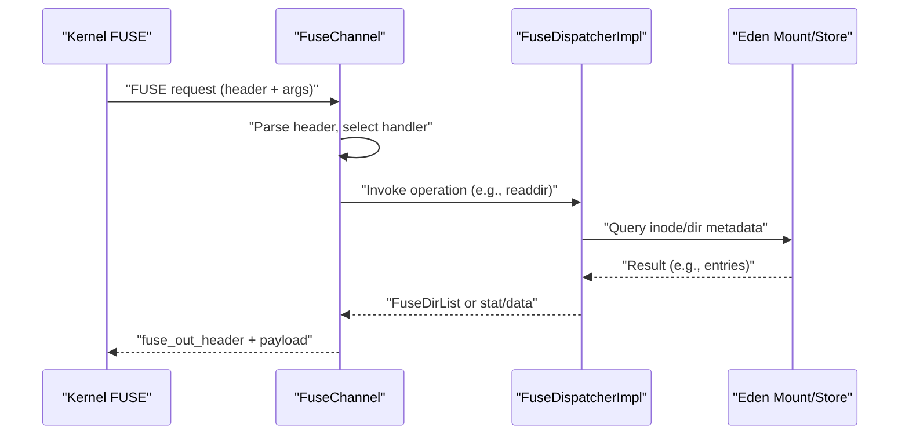
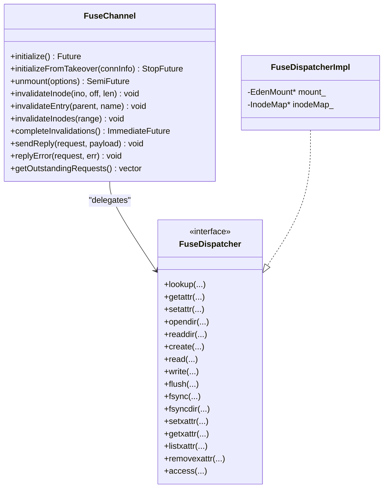
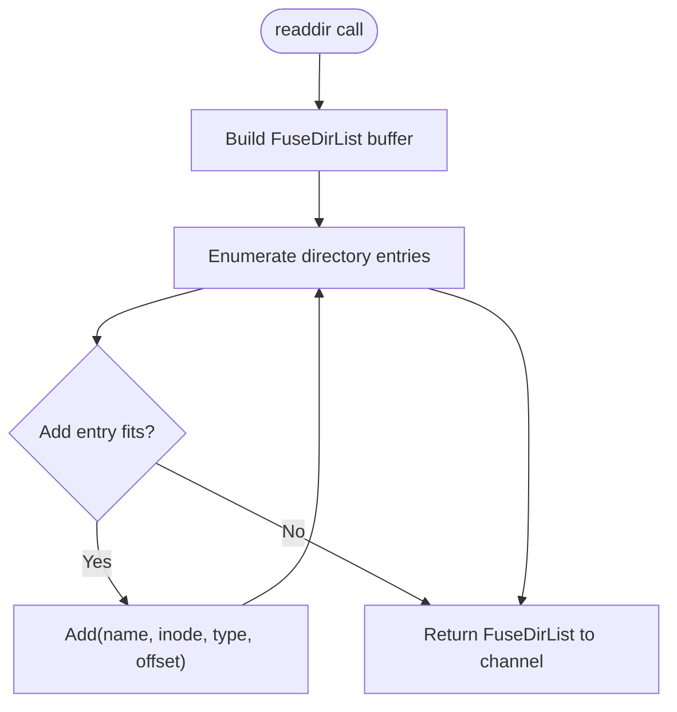
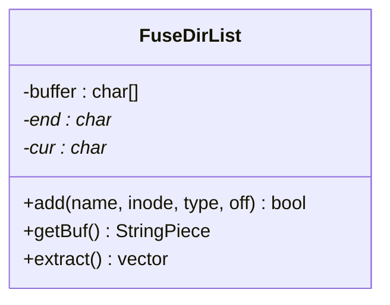
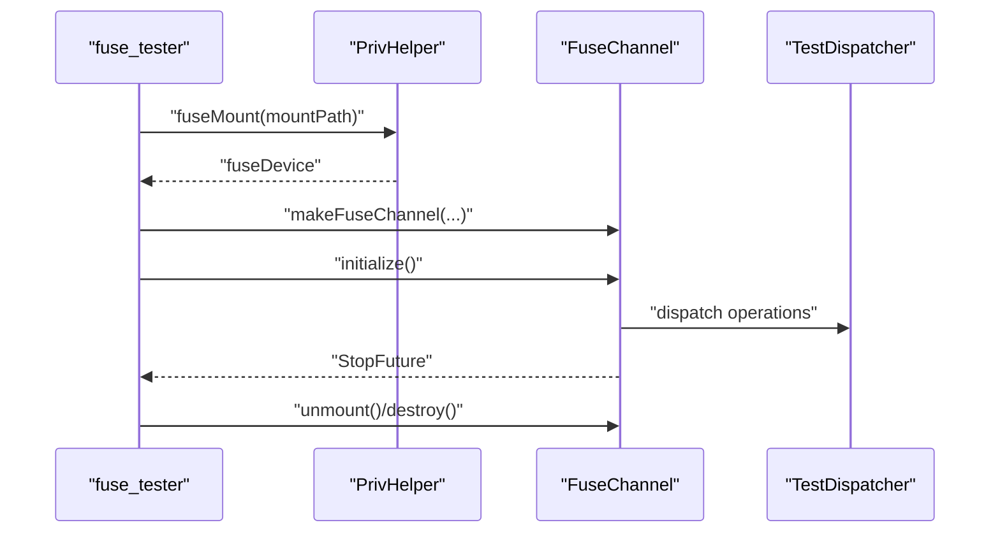
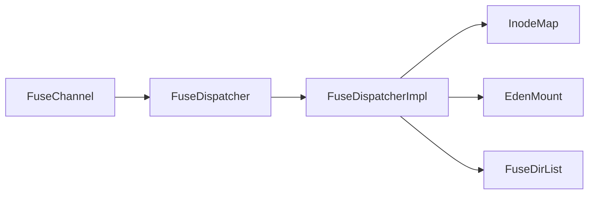

# FUSE Integration

<cite>
**Referenced Files in This Document**
- [FuseChannel.h](file://eden/fs/fuse/FuseChannel.h)
- [FuseChannel.cpp](file://eden/fs/fuse/FuseChannel.cpp)
- [FuseDispatcher.h](file://eden/fs/fuse/FuseDispatcher.h)
- [FuseDirList.h](file://eden/fs/fuse/FuseDirList.h)
- [FuseDispatcherImpl.h](file://eden/fs/inodes/FuseDispatcherImpl.h)
- [FuseDispatcherImpl.cpp](file://eden/fs/inodes/FuseDispatcherImpl.cpp)
- [main.cpp](file://eden/fs/fuse/fuse_tester/main.cpp)
- [FuseChannelTest.cpp](file://eden/fs/fuse/test/FuseChannelTest.cpp)
</cite>

## Table of Contents
1. [Introduction](#introduction)
2. [Project Structure](#project-structure)
3. [Core Components](#core-components)
4. [Architecture Overview](#architecture-overview)
5. [Detailed Component Analysis](#detailed-component-analysis)
6. [Dependency Analysis](#dependency-analysis)
7. [Performance Considerations](#performance-considerations)
8. [Troubleshooting Guide](#troubleshooting-guide)
9. [Conclusion](#conclusion)
10. [Appendices](#appendices)

## Introduction
This document explains the FUSE (Filesystem in Userspace) integration in the repository, focusing on the user-space communication channel, dispatcher architecture, and directory listing mechanisms. It covers the FuseChannel class for kernel communication, the FuseDispatcher interface and its concrete implementation, and the FuseDirList helper for efficient directory traversal. It also documents the testing framework, including the fuse_tester utility and integration tests, and provides setup guidance, configuration options, performance considerations, and troubleshooting tips.

## Project Structure
The FUSE integration spans several modules:
- Channel layer: FuseChannel handles kernel FUSE protocol messages, dispatching to the dispatcher and replying to the kernel.
- Dispatcher layer: FuseDispatcher defines the filesystem operation interface; FuseDispatcherImpl implements it against the Eden mount.
- Directory listing: FuseDirList encapsulates directory entries for readdir responses.
- Testing: fuse_tester demonstrates a minimal FUSE mount for manual verification; integration tests validate channel behavior.

```mermaid
graph TB
subgraph "Kernel Space"
K["Linux Kernel FUSE Module"]
end
subgraph "User Space"
FC["FuseChannel<br/>Handles FUSE IO, replies"]
FD["FuseDispatcher<br/>Interface"]
FDI["FuseDispatcherImpl<br/>Concrete implementation"]
FDL["FuseDirList<br/>Directory builder"]
end
K <- --> FC
FC --> FD
FD --> FDI
FDI --> FDL
```

**Diagram sources**
- [FuseChannel.h:173-370](file://eden/fs/fuse/FuseChannel.h#L173-L370)
- [FuseDispatcher.h:40-498](file://eden/fs/fuse/FuseDispatcher.h#L40-L498)
- [FuseDispatcherImpl.h:23-137](file://eden/fs/inodes/FuseDispatcherImpl.h#L23-L137)
- [FuseDirList.h:19-52](file://eden/fs/fuse/FuseDirList.h#L19-L52)

**Section sources**
- [FuseChannel.h:173-370](file://eden/fs/fuse/FuseChannel.h#L173-L370)
- [FuseDispatcher.h:40-498](file://eden/fs/fuse/FuseDispatcher.h#L40-L498)
- [FuseDispatcherImpl.h:23-137](file://eden/fs/inodes/FuseDispatcherImpl.h#L23-L137)
- [FuseDirList.h:19-52](file://eden/fs/fuse/FuseDirList.h#L19-L52)

## Core Components
- FuseChannel: Manages the FUSE device, reads/writes kernel requests/responses, tracks in-flight requests, and delegates operations to the dispatcher. It exposes initialization, teardown, and invalidation APIs.
- FuseDispatcher: Abstract interface for filesystem operations (lookup, getattr, setattr, open/release, readdir, xattr, etc.). Provides connection lifecycle hooks and statistics.
- FuseDispatcherImpl: Concrete implementation that bridges the dispatcher interface to the Eden mount’s inode system and stores.
- FuseDirList: Efficient builder for directory entries returned by readdir, packing entries into a buffer and supporting extraction.

Key responsibilities:
- FuseChannel: Protocol parsing, handler dispatch, reply construction, telemetry, and graceful shutdown.
- FuseDispatcher/FuseDispatcherImpl: Business logic for filesystem operations, metadata retrieval, and directory enumeration.
- FuseDirList: Buffer management and entry encoding for directory traversal.

**Section sources**
- [FuseChannel.h:173-580](file://eden/fs/fuse/FuseChannel.h#L173-L580)
- [FuseChannel.cpp:280-570](file://eden/fs/fuse/FuseChannel.cpp#L280-L570)
- [FuseDispatcher.h:40-498](file://eden/fs/fuse/FuseDispatcher.h#L40-L498)
- [FuseDispatcherImpl.h:23-137](file://eden/fs/inodes/FuseDispatcherImpl.h#L23-L137)
- [FuseDirList.h:19-52](file://eden/fs/fuse/FuseDirList.h#L19-L52)

## Architecture Overview
The FUSE integration follows a layered design:
- Kernel FUSE module communicates with a user-space device file handled by FuseChannel.
- FuseChannel parses incoming requests, selects a handler, and invokes the dispatcher.
- The dispatcher performs the operation against the Eden mount and returns results.
- FuseChannel constructs and sends replies back to the kernel.



**Diagram sources**
- [FuseChannel.cpp:280-570](file://eden/fs/fuse/FuseChannel.cpp#L280-L570)
- [FuseDispatcherImpl.cpp:95-155](file://eden/fs/inodes/FuseDispatcherImpl.cpp#L95-L155)
- [FuseDirList.h:19-52](file://eden/fs/fuse/FuseDirList.h#L19-L52)

## Detailed Component Analysis

### FuseChannel: Kernel Communication and Dispatch
FuseChannel is the primary bridge between the kernel and user-space. It:
- Initializes the FUSE session, negotiates capabilities, and starts worker threads.
- Maintains state for in-flight requests, invalidation queues, and stop conditions.
- Implements a handler table mapping FUSE opcodes to member functions that delegate to the dispatcher.
- Provides reply helpers for various payload types and error responses.

Notable behaviors:
- Initialization and takeover paths, including negotiating connection settings and configuring read-ahead.
- Request telemetry and tracing via a trace bus.
- Invalidation APIs to notify the kernel to drop caches for inodes or directory entries.
- Reply construction using scatter-gather vectors to minimize copies.



**Diagram sources**
- [FuseChannel.h:173-580](file://eden/fs/fuse/FuseChannel.h#L173-L580)
- [FuseDispatcher.h:40-498](file://eden/fs/fuse/FuseDispatcher.h#L40-L498)
- [FuseDispatcherImpl.h:23-137](file://eden/fs/inodes/FuseDispatcherImpl.h#L23-L137)

**Section sources**
- [FuseChannel.h:225-580](file://eden/fs/fuse/FuseChannel.h#L225-L580)
- [FuseChannel.cpp:280-570](file://eden/fs/fuse/FuseChannel.cpp#L280-L570)

### FuseDispatcher and FuseDispatcherImpl: Operation Handlers
FuseDispatcher defines the filesystem operation contract. FuseDispatcherImpl implements it against the Eden mount:
- Lookup: Resolves a directory entry and returns an inode with attributes and TTLs.
- Directory operations: opendir/releasedir are stateless in this implementation; readdir streams entries via FuseDirList.
- Metadata: getattr/setattr translate to inode queries and updates with privilege checks.
- Data: read/write integrate with the store and overlay.
- Extended attributes: get/list/set/remove support.
- Synchronization: flush/fsync/fsyncdir ensure durability semantics.



**Diagram sources**
- [FuseDispatcher.h:386-399](file://eden/fs/fuse/FuseDispatcher.h#L386-L399)
- [FuseDirList.h:19-52](file://eden/fs/fuse/FuseDirList.h#L19-L52)
- [FuseDispatcherImpl.cpp:115-120](file://eden/fs/inodes/FuseDispatcherImpl.cpp#L115-L120)

**Section sources**
- [FuseDispatcher.h:40-498](file://eden/fs/fuse/FuseDispatcher.h#L40-L498)
- [FuseDispatcherImpl.h:23-137](file://eden/fs/inodes/FuseDispatcherImpl.h#L23-L137)
- [FuseDispatcherImpl.cpp:95-155](file://eden/fs/inodes/FuseDispatcherImpl.cpp#L95-L155)

### FuseDirList: Directory Traversal Builder
FuseDirList manages a compact buffer of directory entries for readdir responses:
- add(name, inode, type, offset) appends entries when space allows.
- getBuf() returns the packed buffer for transmission.
- extract() parses the buffer back into structured entries for inspection.



**Diagram sources**
- [FuseDirList.h:19-52](file://eden/fs/fuse/FuseDirList.h#L19-L52)

**Section sources**
- [FuseDirList.h:19-52](file://eden/fs/fuse/FuseDirList.h#L19-L52)

### Testing Framework: fuse_tester and Integration Tests
- fuse_tester: A minimal standalone program that mounts a FUSE device, creates a TestDispatcher, and runs FuseChannel in a controlled environment. It validates basic initialization and teardown flows.
- Integration tests: FuseChannelTest exercises channel-specific behaviors such as invalidation and request tracking.



**Diagram sources**
- [main.cpp:123-167](file://eden/fs/fuse/fuse_tester/main.cpp#L123-L167)
- [FuseChannel.h:349-400](file://eden/fs/fuse/FuseChannel.h#L349-L400)
- [FuseChannelTest.cpp:66-120](file://eden/fs/fuse/test/FuseChannelTest.cpp#L66-L120)

**Section sources**
- [main.cpp:80-167](file://eden/fs/fuse/fuse_tester/main.cpp#L80-L167)
- [FuseChannelTest.cpp:66-120](file://eden/fs/fuse/test/FuseChannelTest.cpp#L66-L120)

## Dependency Analysis
- FuseChannel depends on:
  - FuseDispatcher for operation implementations.
  - PrivHelper for privileged mount operations.
  - ProcessInfoCache, FsEventLogger, StructuredLogger for diagnostics.
  - TraceBus for request tracing and telemetry.
- FuseDispatcherImpl depends on:
  - EdenMount and InodeMap for inode resolution and metadata.
  - Overlay and store for data retrieval.
- FuseDirList is a pure utility used by readdir implementations.



**Diagram sources**
- [FuseChannel.h:300-321](file://eden/fs/fuse/FuseChannel.h#L300-L321)
- [FuseDispatcherImpl.h:23-137](file://eden/fs/inodes/FuseDispatcherImpl.h#L23-L137)
- [FuseDirList.h:19-52](file://eden/fs/fuse/FuseDirList.h#L19-L52)

**Section sources**
- [FuseChannel.h:300-321](file://eden/fs/fuse/FuseChannel.h#L300-L321)
- [FuseDispatcherImpl.h:23-137](file://eden/fs/inodes/FuseDispatcherImpl.h#L23-L137)

## Performance Considerations
- Concurrency and throughput:
  - Configure the number of worker threads to match workload characteristics.
  - Tune maximum in-flight requests to prevent overload and backpressure.
- Kernel interaction:
  - Use cache hints (e.g., FOPEN_KEEP_CACHE, FOPEN_CACHE_DIR) to improve read performance when supported.
  - Adjust background request limits to avoid saturating the kernel’s readahead.
- Telemetry and tracing:
  - Enable detailed tracing selectively to avoid overhead.
  - Monitor long-running requests and high in-flight thresholds to detect bottlenecks.
- Memory and buffers:
  - FuseDirList minimizes allocations by using a pre-sized buffer; ensure maxSize aligns with typical directory sizes.

[No sources needed since this section provides general guidance]

## Troubleshooting Guide
Common issues and remedies:
- Initialization failures:
  - Verify kernel compatibility and capability negotiation. Check logs for handshake errors.
- Excessive in-flight requests:
  - Increase maximum in-flight requests or reduce concurrent client operations.
- Long-running requests:
  - Investigate slow store operations or heavy directory enumerations; adjust thresholds and logging intervals.
- Directory listing anomalies:
  - Ensure FuseDirList is properly sized and entries are added in order; confirm offsets and types are correct.
- Teardown and unmount:
  - Use unmount() to trigger orderly shutdown; inspect StopReason to diagnose causes.

Operational tips:
- Use the trace bus and structured logs to correlate kernel requests with user-space processing.
- Validate invalidation flows to ensure cache coherency after mutations.

**Section sources**
- [FuseChannel.h:175-223](file://eden/fs/fuse/FuseChannel.h#L175-L223)
- [FuseChannel.cpp:280-570](file://eden/fs/fuse/FuseChannel.cpp#L280-L570)

## Conclusion
The FUSE integration cleanly separates kernel communication (FuseChannel), filesystem operations (FuseDispatcher and FuseDispatcherImpl), and directory enumeration (FuseDirList). The testing framework and integration tests provide confidence in correctness and performance. Proper configuration of concurrency, caching, and tracing enables robust operation across diverse workloads.

[No sources needed since this section summarizes without analyzing specific files]

## Appendices

### Setup Procedures
- Prerequisites:
  - Root privileges for mounting; fuse_tester enforces running as root.
  - A clean, empty mount point.
- Steps:
  - Start PrivHelper and drop privileges.
  - Mount the FUSE device at the target path.
  - Create a dispatcher (e.g., TestDispatcher or FuseDispatcherImpl).
  - Instantiate FuseChannel with appropriate options and initialize.
  - Run until signaled or unmounted.

**Section sources**
- [main.cpp:94-167](file://eden/fs/fuse/fuse_tester/main.cpp#L94-L167)

### Configuration Options
Key FuseChannel constructor parameters:
- Thread pool and worker threads: controls concurrency.
- Request timeout: internal timeout for lower-level processing.
- Case sensitivity and UTF-8 path enforcement: mount behavior flags.
- Maximum background and in-flight requests: rate limiting and backpressure.
- Logging and tracing: structured logger, trace bus capacity, and thresholds.

**Section sources**
- [FuseChannel.h:300-321](file://eden/fs/fuse/FuseChannel.h#L300-L321)

### Example Operation Handlers
Representative handler invocations delegated by FuseChannel:
- Lookup, Forget, GetAttr, SetAttr
- ReadLink, Symlink, Mknod, Mkdir, Unlink, Rmdir, Rename, Link
- Open, Read, Write, Release, Flush, Fsync
- OpenDir, ReadDir, ReleaseDir, FsyncDir
- Access, Create, Bmap, Fallocate
- XAttr operations (set/get/list/remove)

These are selected by opcode and forwarded to the dispatcher for implementation.

**Section sources**
- [FuseChannel.cpp:280-570](file://eden/fs/fuse/FuseChannel.cpp#L280-L570)