# Filesystem Utilities and Abstractions

<cite>
**Referenced Files in This Document**
- [lib.rs](file://eden/scm/lib/util/procutil/src/lib.rs)
- [lib.rs](file://eden/scm/lib/util/src/file.rs)
- [lib.rs](file://eden/scm/lib/minibench/src/measure/procfs.rs)
- [lib.rs](file://eden/scm/lib/walkdetector/src/lib.rs)
- [lib.rs](file://eden/scm/lib/commands/debugcommands/cmddebugwalkdetector/src/lib.rs)
- [lib.rs](file://eden/scm/saplingnative/bindings/modules/pyfs/src/lib.rs)
- [osutil.c](file://eden/scm/sapling/cext/osutil.c)
- [osfs.py](file://eden/scm/sapling/testing/sh/osfs.py)
- [testfs.py](file://eden/scm/sapling/testing/sh/testfs.py)
- [streamhash.rs](file://eden/mononoke/repo_attributes/filestore/src/streamhash.rs)
</cite>

## Table of Contents
1. [Introduction](#introduction)
2. [Project Structure](#project-structure)
3. [Core Components](#core-components)
4. [Architecture Overview](#architecture-overview)
5. [Detailed Component Analysis](#detailed-component-analysis)
6. [Dependency Analysis](#dependency-analysis)
7. [Performance Considerations](#performance-considerations)
8. [Troubleshooting Guide](#troubleshooting-guide)
9. [Conclusion](#conclusion)

## Introduction
This document describes filesystem utilities and abstraction layers across the repository, focusing on cross-platform compatibility, process utilities, hashing, pattern matching, concurrency helpers, and performance tracing. It covers:
- Process utilities for cross-platform lifecycle management
- Filesystem utilities for atomic writes and retries
- Hashing utilities for content identification
- Pattern matching via globbing abstractions
- Concurrency helpers for filesystem operations
- Performance tracing for filesystem walks
- Platform-specific implementations and integration points

## Project Structure
The filesystem utilities and abstractions span multiple languages and layers:
- Rust libraries for process utilities, file operations, hashing, and performance measurement
- Python bindings for filesystem introspection and testing abstractions
- C extensions for low-level OS utilities
- Debug and benchmarking tools for walk detection and IO measurement

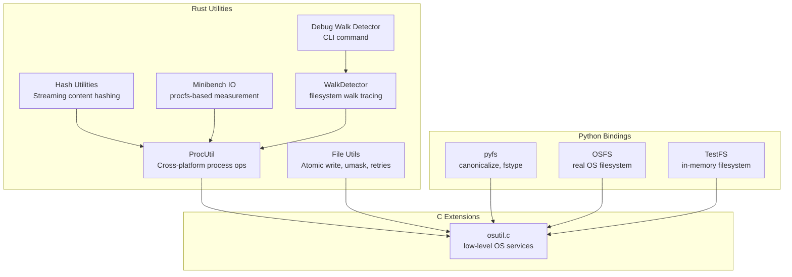

**Diagram sources**
- [lib.rs:1-263](file://eden/scm/lib/util/procutil/src/lib.rs#L1-L263)
- [lib.rs:1-55](file://eden/scm/lib/util/src/file.rs#L1-L55)
- [streamhash.rs:158-193](file://eden/mononoke/repo_attributes/filestore/src/streamhash.rs#L158-L193)
- [lib.rs:1-51](file://eden/scm/lib/minibench/src/measure/procfs.rs#L1-L51)
- [lib.rs:860-1154](file://eden/scm/lib/walkdetector/src/lib.rs#L860-L1154)
- [lib.rs:130-179](file://eden/scm/lib/commands/debugcommands/cmddebugwalkdetector/src/lib.rs#L130-L179)
- [lib.rs:1-34](file://eden/scm/saplingnative/bindings/modules/pyfs/src/lib.rs#L1-L34)
- [osutil.c:1-57](file://eden/scm/sapling/cext/osutil.c#L1-L57)
- [osfs.py:1-44](file://eden/scm/sapling/testing/sh/osfs.py#L1-L44)
- [testfs.py:1-50](file://eden/scm/sapling/testing/sh/testfs.py#L1-L50)

**Section sources**
- [lib.rs:1-263](file://eden/scm/lib/util/procutil/src/lib.rs#L1-L263)
- [lib.rs:1-55](file://eden/scm/lib/util/src/file.rs#L1-L55)
- [streamhash.rs:158-193](file://eden/mononoke/repo_attributes/filestore/src/streamhash.rs#L158-L193)
- [lib.rs:1-51](file://eden/scm/lib/minibench/src/measure/procfs.rs#L1-L51)
- [lib.rs:860-1154](file://eden/scm/lib/walkdetector/src/lib.rs#L860-L1154)
- [lib.rs:130-179](file://eden/scm/lib/commands/debugcommands/cmddebugwalkdetector/src/lib.rs#L130-L179)
- [lib.rs:1-34](file://eden/scm/saplingnative/bindings/modules/pyfs/src/lib.rs#L1-L34)
- [osutil.c:1-57](file://eden/scm/sapling/cext/osutil.c#L1-L57)
- [osfs.py:1-44](file://eden/scm/sapling/testing/sh/osfs.py#L1-L44)
- [testfs.py:1-50](file://eden/scm/sapling/testing/sh/testfs.py#L1-L50)

## Core Components
- ProcUtil: Cross-platform process existence checks, waits, termination, and process groups on Windows
- File Utils: Atomic write, umask application, and configurable IO retries
- Hash Utilities: Streaming content hashing for large data streams
- Minibench IO: procfs-based IO measurement for performance profiling
- WalkDetector: Tracing and GC of filesystem walks with PID propagation and thresholds
- pyfs: Python bindings for canonicalizing paths and detecting filesystem types
- OSFS/TestFS: Python filesystem abstractions for real and in-memory operations
- osutil.c: Low-level OS utilities bridging Python and native code

**Section sources**
- [lib.rs:14-84](file://eden/scm/lib/util/procutil/src/lib.rs#L14-L84)
- [lib.rs:23-55](file://eden/scm/lib/util/src/file.rs#L23-L55)
- [streamhash.rs:158-193](file://eden/mononoke/repo_attributes/filestore/src/streamhash.rs#L158-L193)
- [lib.rs:26-50](file://eden/scm/lib/minibench/src/measure/procfs.rs#L26-L50)
- [lib.rs:880-906](file://eden/scm/lib/walkdetector/src/lib.rs#L880-L906)
- [lib.rs:130-179](file://eden/scm/lib/commands/debugcommands/cmddebugwalkdetector/src/lib.rs#L130-L179)
- [lib.rs:12-34](file://eden/scm/saplingnative/bindings/modules/pyfs/src/lib.rs#L12-L34)
- [osfs.py:15-44](file://eden/scm/sapling/testing/sh/osfs.py#L15-L44)
- [testfs.py:14-50](file://eden/scm/sapling/testing/sh/testfs.py#L14-L50)
- [osutil.c:17-57](file://eden/scm/sapling/cext/osutil.c#L17-L57)

## Architecture Overview
The filesystem utilities layer integrates platform-specific capabilities with cross-language bindings:
- Rust utilities provide portable abstractions for process and file operations
- Python bindings expose filesystem introspection and testing utilities
- C extensions bridge Python and OS APIs for low-level operations
- Debug and benchmarking tools observe and measure filesystem behavior

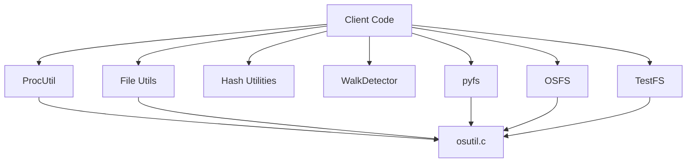

**Diagram sources**
- [lib.rs:14-84](file://eden/scm/lib/util/procutil/src/lib.rs#L14-L84)
- [lib.rs:23-55](file://eden/scm/lib/util/src/file.rs#L23-L55)
- [streamhash.rs:158-193](file://eden/mononoke/repo_attributes/filestore/src/streamhash.rs#L158-L193)
- [lib.rs:880-906](file://eden/scm/lib/walkdetector/src/lib.rs#L880-L906)
- [lib.rs:12-34](file://eden/scm/saplingnative/bindings/modules/pyfs/src/lib.rs#L12-L34)
- [osfs.py:15-44](file://eden/scm/sapling/testing/sh/osfs.py#L15-L44)
- [testfs.py:14-50](file://eden/scm/sapling/testing/sh/testfs.py#L14-L50)
- [osutil.c:17-57](file://eden/scm/sapling/cext/osutil.c#L17-L57)

## Detailed Component Analysis

### ProcUtil: Cross-Platform Process Operations
ProcUtil provides:
- Process existence checks via platform-specific mechanisms
- Wait loops with deadlines and sleep intervals
- Termination sequences with graceful periods and fallback signals
- Windows-specific process groups and job objects for tree termination

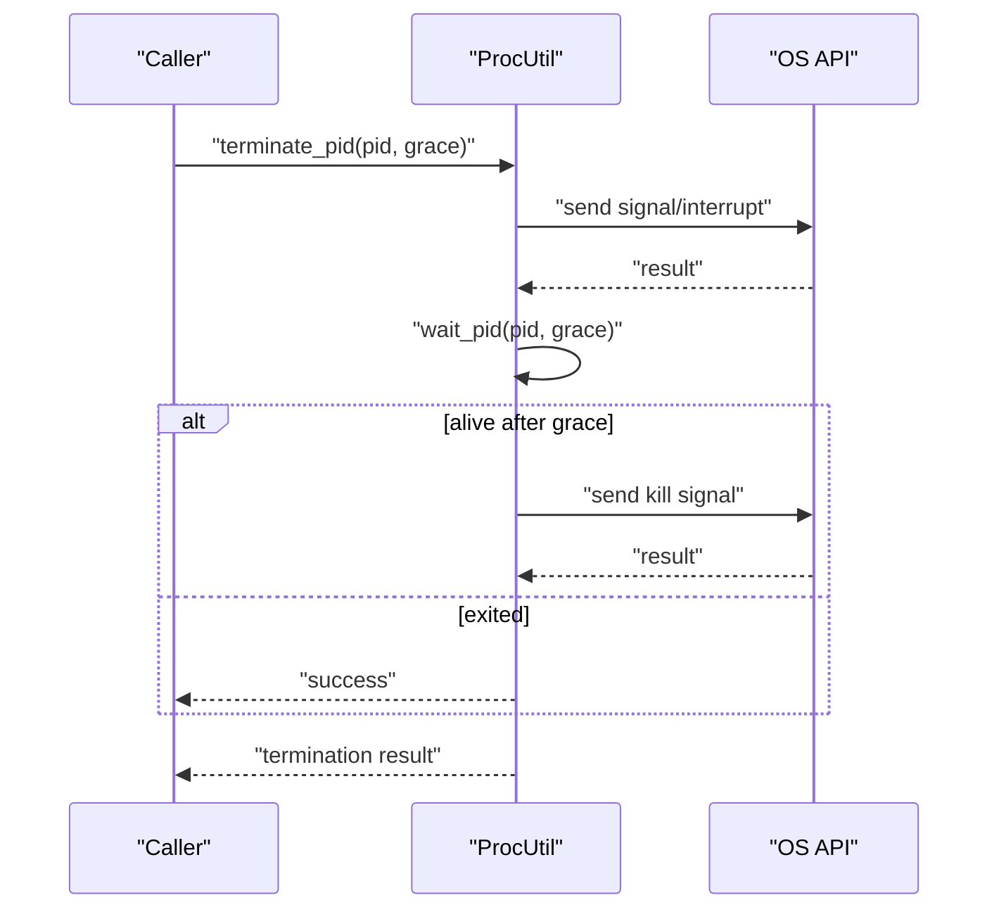

**Diagram sources**
- [lib.rs:54-84](file://eden/scm/lib/util/procutil/src/lib.rs#L54-L84)
- [lib.rs:32-46](file://eden/scm/lib/util/procutil/src/lib.rs#L32-L46)

Key behaviors:
- Graceful termination with platform-appropriate signals
- Optional timeouts and polling intervals
- Windows process groups for subtree termination

**Section sources**
- [lib.rs:14-84](file://eden/scm/lib/util/procutil/src/lib.rs#L14-L84)
- [lib.rs:86-232](file://eden/scm/lib/util/procutil/src/lib.rs#L86-L232)
- [lib.rs:237-263](file://eden/scm/lib/util/procutil/src/lib.rs#L237-L263)

### File Utils: Atomic Writes and Retries
File Utils centralizes safe file creation and permission handling:
- Atomic write with a closure to avoid partial writes
- Umask discovery and application to modes
- Configurable IO retry count via environment variable

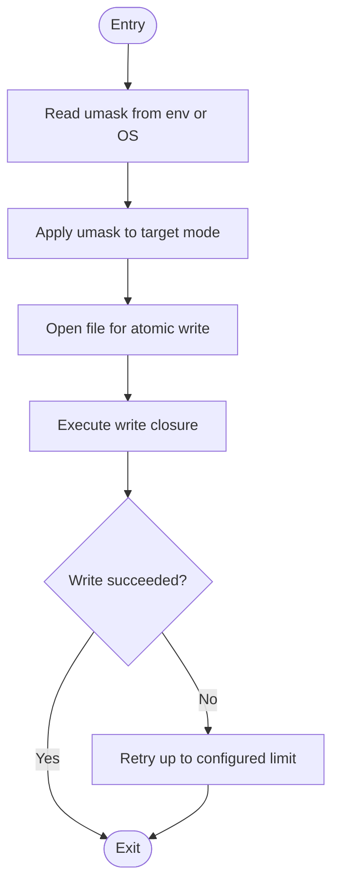

**Diagram sources**
- [lib.rs:23-55](file://eden/scm/lib/util/src/file.rs#L23-L55)

Operational notes:
- Umask is cached via lazy initialization
- Retry count is configurable via environment variable
- Uses OS-specific APIs for file operations

**Section sources**
- [lib.rs:23-55](file://eden/scm/lib/util/src/file.rs#L23-L55)

### Hash Utilities: Streaming Content Hashing
Streaming hashing supports large data streams and produces fixed-size identifiers:
- Incremental hasher interface for streaming
- Stream-based hashing with async-friendly composition
- Deterministic content IDs for verification

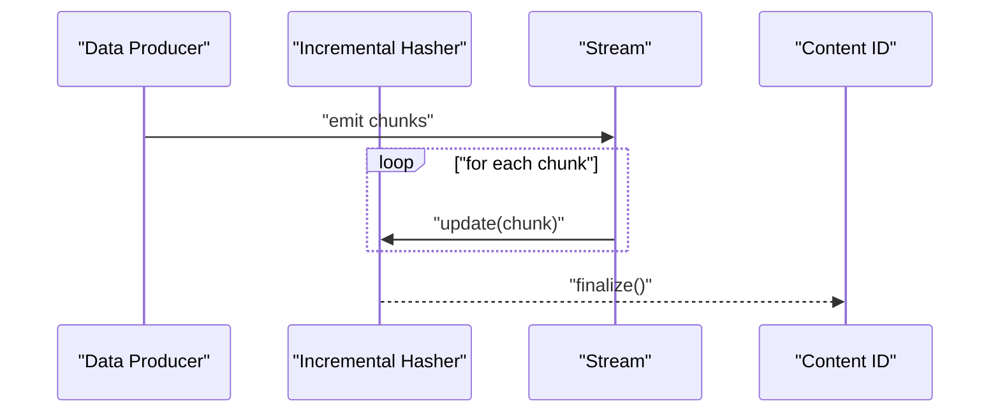

**Diagram sources**
- [streamhash.rs:158-193](file://eden/mononoke/repo_attributes/filestore/src/streamhash.rs#L158-L193)

Usage patterns:
- Chunked hashing for memory efficiency
- Integration with async streams
- Deterministic identifiers for deduplication and verification

**Section sources**
- [streamhash.rs:158-193](file://eden/mononoke/repo_attributes/filestore/src/streamhash.rs#L158-L193)

### Minibench IO: procfs-Based Measurement
Minibench measures IO characteristics using procfs:
- Reads rchar/wchar from /proc/self/io
- Computes deltas and overhead adjustments
- Supports measurement of read/write bytes during operations

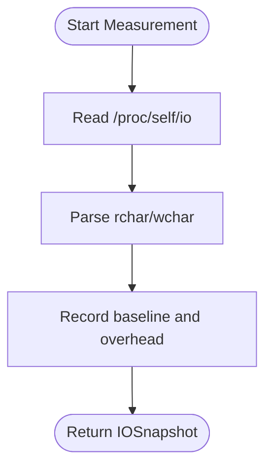

**Diagram sources**
- [lib.rs:26-50](file://eden/scm/lib/minibench/src/measure/procfs.rs#L26-L50)

**Section sources**
- [lib.rs:1-51](file://eden/scm/lib/minibench/src/measure/procfs.rs#L1-L51)

### WalkDetector: Filesystem Walk Tracing and GC
WalkDetector tracks filesystem walks, aggregates counts, and performs garbage collection:
- Tracks file and directory loads, reads, and preloads
- Maintains per-walk metadata including PID and duration
- Periodic GC to remove inactive walks while preserving important metadata

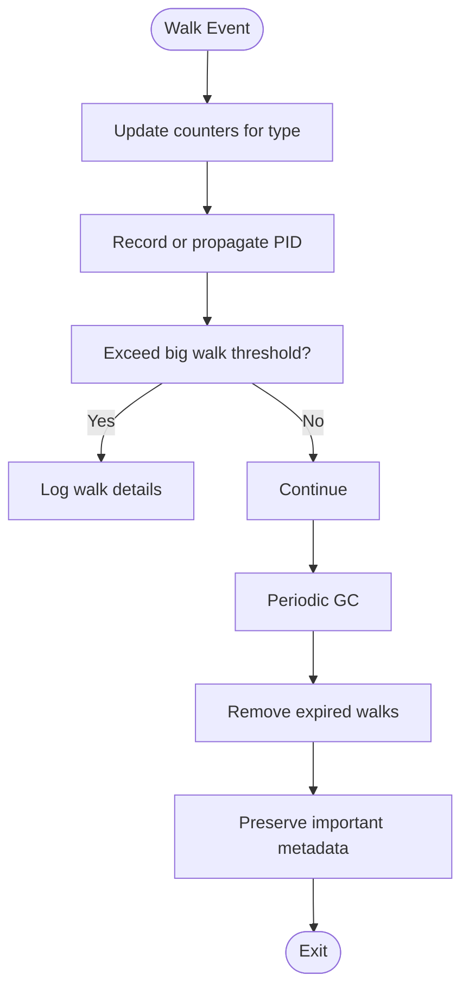

**Diagram sources**
- [lib.rs:880-906](file://eden/scm/lib/walkdetector/src/lib.rs#L880-L906)
- [lib.rs:1110-1130](file://eden/scm/lib/walkdetector/src/lib.rs#L1110-L1130)

Integration:
- Debug command exposes walk roots and depths
- Supports waiting for GC completion

**Section sources**
- [lib.rs:860-1154](file://eden/scm/lib/walkdetector/src/lib.rs#L860-L1154)
- [lib.rs:130-179](file://eden/scm/lib/commands/debugcommands/cmddebugwalkdetector/src/lib.rs#L130-L179)

### Python Bindings: pyfs
pyfs exposes filesystem introspection to Python:
- Canonicalize paths using OS-specific resolution
- Detect filesystem types for given paths

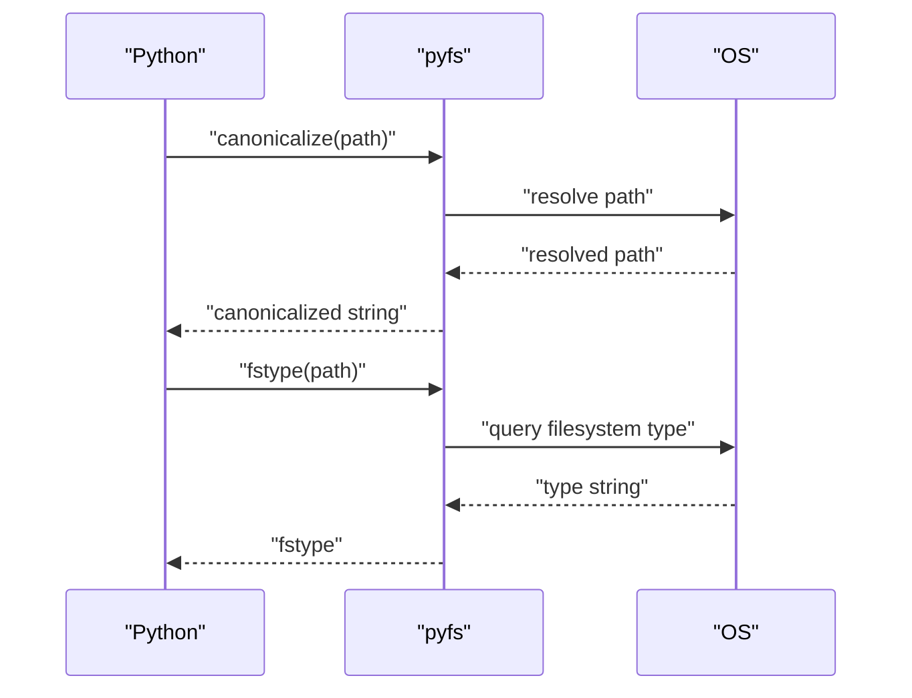

**Diagram sources**
- [lib.rs:12-34](file://eden/scm/saplingnative/bindings/modules/pyfs/src/lib.rs#L12-L34)

**Section sources**
- [lib.rs:12-34](file://eden/scm/saplingnative/bindings/modules/pyfs/src/lib.rs#L12-L34)

### Python Filesystem Abstractions: OSFS and TestFS
Two filesystem implementations demonstrate abstraction patterns:
- OSFS: Real OS-backed filesystem with globbing and path normalization
- TestFS: In-memory filesystem for deterministic testing

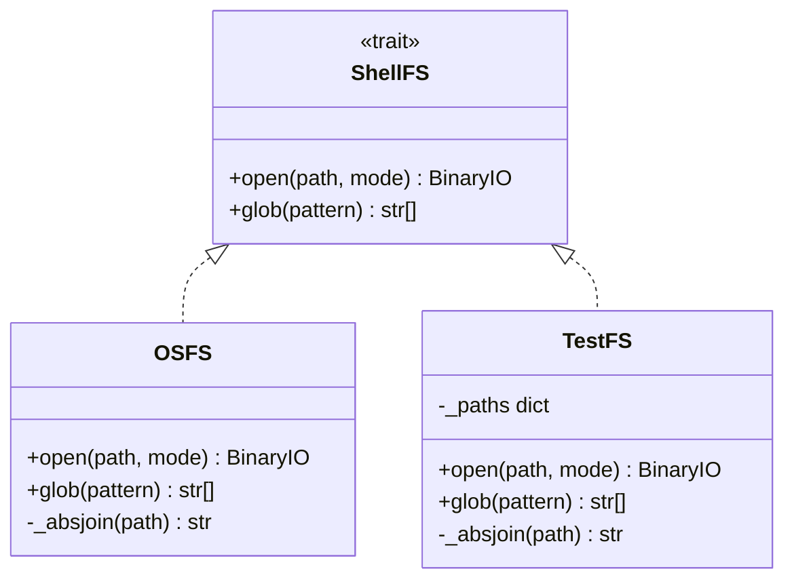

**Diagram sources**
- [osfs.py:15-44](file://eden/scm/sapling/testing/sh/osfs.py#L15-L44)
- [testfs.py:14-50](file://eden/scm/sapling/testing/sh/testfs.py#L14-L50)

**Section sources**
- [osfs.py:15-44](file://eden/scm/sapling/testing/sh/osfs.py#L15-L44)
- [testfs.py:14-50](file://eden/scm/sapling/testing/sh/testfs.py#L14-L50)

### C Extension: osutil.c
osutil.c bridges Python and OS APIs for low-level operations:
- Platform-specific stat structures and compatibility
- Path handling and OS capability definitions

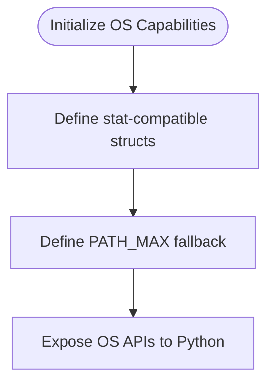

**Diagram sources**
- [osutil.c:17-57](file://eden/scm/sapling/cext/osutil.c#L17-L57)

**Section sources**
- [osutil.c:17-57](file://eden/scm/sapling/cext/osutil.c#L17-L57)

## Dependency Analysis
High-level dependencies:
- ProcUtil depends on OS APIs and platform-specific modules
- File Utils depends on OS filesystem APIs and environment configuration
- Hash Utilities integrate with async streams and incremental hashing
- Minibench IO relies on procfs availability
- WalkDetector integrates with process utilities and timing
- pyfs depends on OS filesystem queries
- OSFS/TestFS depend on Python’s filesystem and globbing

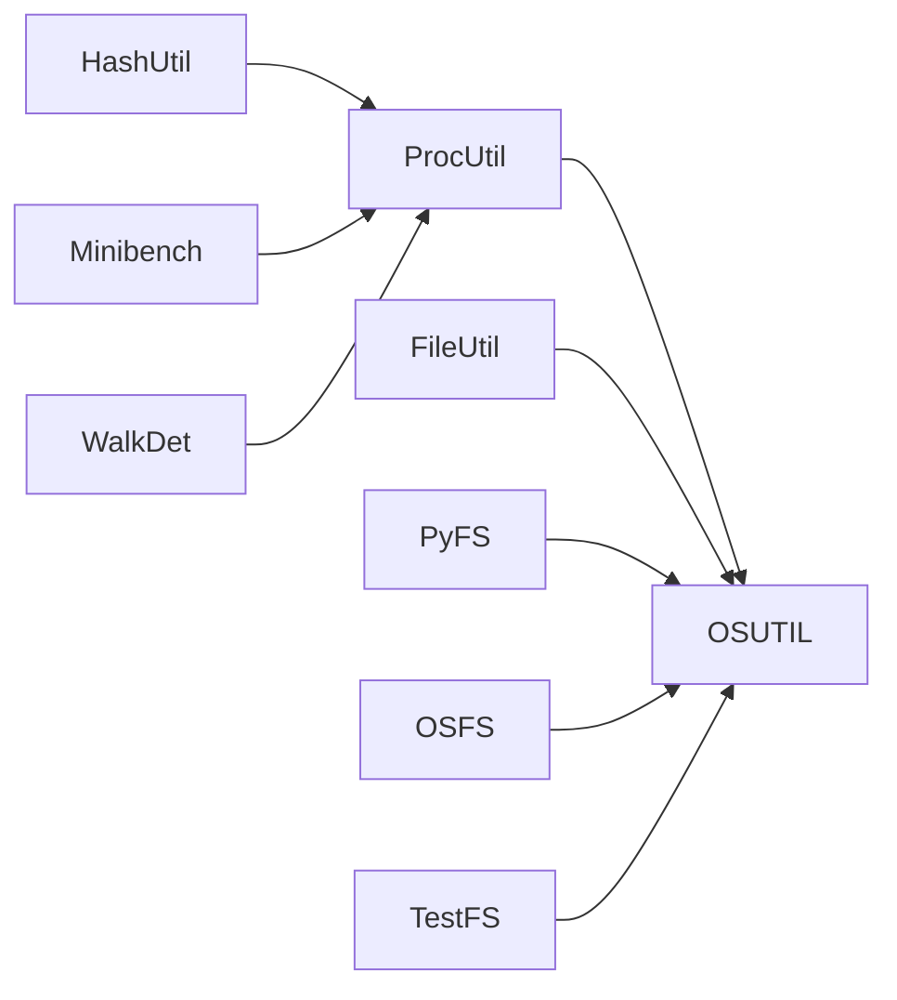

**Diagram sources**
- [lib.rs:14-84](file://eden/scm/lib/util/procutil/src/lib.rs#L14-L84)
- [lib.rs:23-55](file://eden/scm/lib/util/src/file.rs#L23-L55)
- [streamhash.rs:158-193](file://eden/mononoke/repo_attributes/filestore/src/streamhash.rs#L158-L193)
- [lib.rs:26-50](file://eden/scm/lib/minibench/src/measure/procfs.rs#L26-L50)
- [lib.rs:880-906](file://eden/scm/lib/walkdetector/src/lib.rs#L880-L906)
- [lib.rs:12-34](file://eden/scm/saplingnative/bindings/modules/pyfs/src/lib.rs#L12-L34)
- [osfs.py:15-44](file://eden/scm/sapling/testing/sh/osfs.py#L15-L44)
- [testfs.py:14-50](file://eden/scm/sapling/testing/sh/testfs.py#L14-L50)
- [osutil.c:17-57](file://eden/scm/sapling/cext/osutil.c#L17-L57)

**Section sources**
- [lib.rs:14-84](file://eden/scm/lib/util/procutil/src/lib.rs#L14-L84)
- [lib.rs:23-55](file://eden/scm/lib/util/src/file.rs#L23-L55)
- [streamhash.rs:158-193](file://eden/mononoke/repo_attributes/filestore/src/streamhash.rs#L158-L193)
- [lib.rs:26-50](file://eden/scm/lib/minibench/src/measure/procfs.rs#L26-L50)
- [lib.rs:880-906](file://eden/scm/lib/walkdetector/src/lib.rs#L880-L906)
- [lib.rs:12-34](file://eden/scm/saplingnative/bindings/modules/pyfs/src/lib.rs#L12-L34)
- [osfs.py:15-44](file://eden/scm/sapling/testing/sh/osfs.py#L15-L44)
- [testfs.py:14-50](file://eden/scm/sapling/testing/sh/testfs.py#L14-L50)
- [osutil.c:17-57](file://eden/scm/sapling/cext/osutil.c#L17-L57)

## Performance Considerations
- Use atomic writes to avoid partial file states and reduce retries
- Configure IO retries judiciously to balance resilience and latency
- Prefer streaming hashing for large files to limit memory usage
- Use procfs measurements sparingly due to overhead; cache snapshots when appropriate
- Leverage WalkDetector to identify slow or large walks and tune thresholds
- On Windows, use process groups for reliable subtree termination to prevent resource leaks

[No sources needed since this section provides general guidance]

## Troubleshooting Guide
Common issues and resolutions:
- Process termination failures: Verify platform-specific signals and permissions; use graceful periods before force termination
- File write errors: Check umask and permissions; enable retries via environment variable
- Hash mismatches: Ensure consistent chunking and hasher configuration across runs
- WalkDetector false positives/negatives: Adjust thresholds and GC intervals based on workload
- Python path canonicalization failures: Validate UTF-8 encoding and OS-specific path semantics

**Section sources**
- [lib.rs:54-84](file://eden/scm/lib/util/procutil/src/lib.rs#L54-L84)
- [lib.rs:23-55](file://eden/scm/lib/util/src/file.rs#L23-L55)
- [lib.rs:880-906](file://eden/scm/lib/walkdetector/src/lib.rs#L880-L906)

## Conclusion
The filesystem utilities and abstractions provide a robust, cross-platform foundation for process lifecycle management, safe file operations, content hashing, and performance tracing. They integrate seamlessly across Rust, Python, and C layers, enabling higher-level filesystem operations with reliability and observability.

[No sources needed since this section summarizes without analyzing specific files]