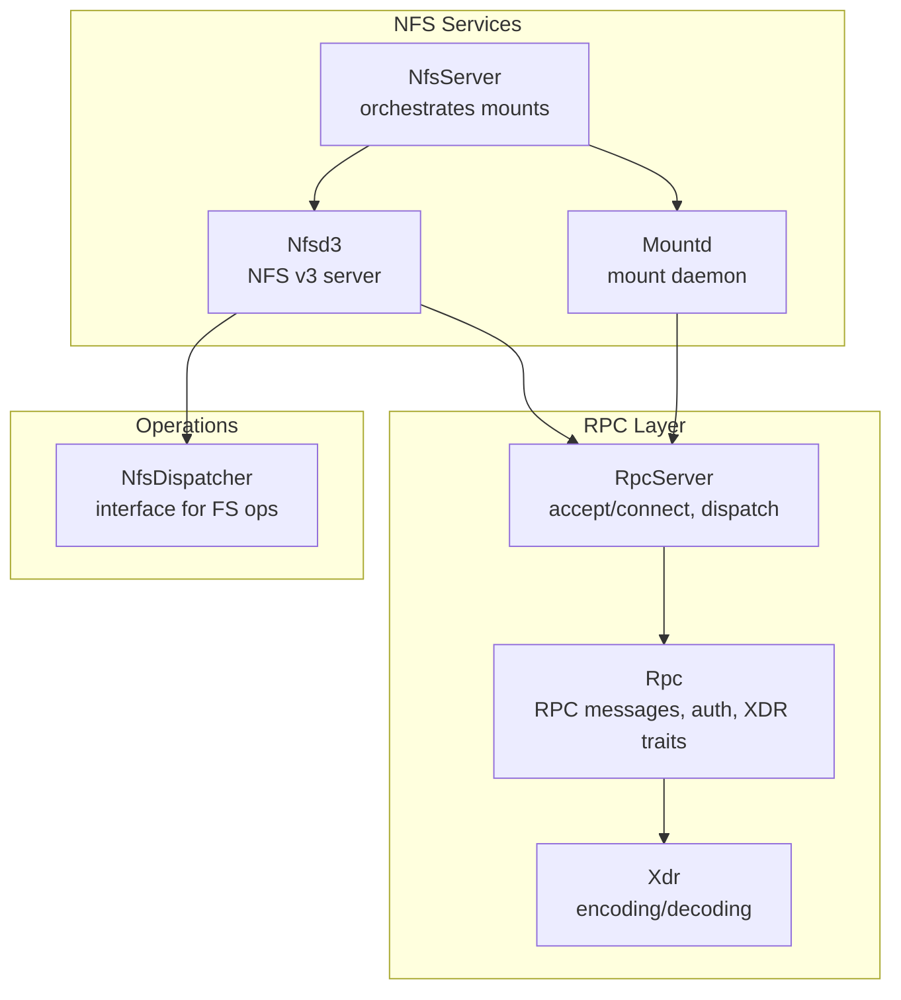
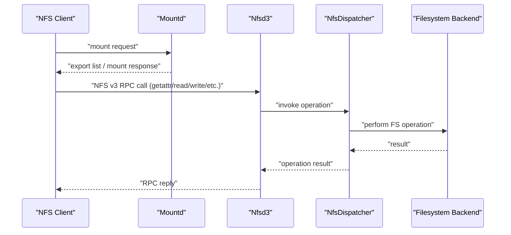
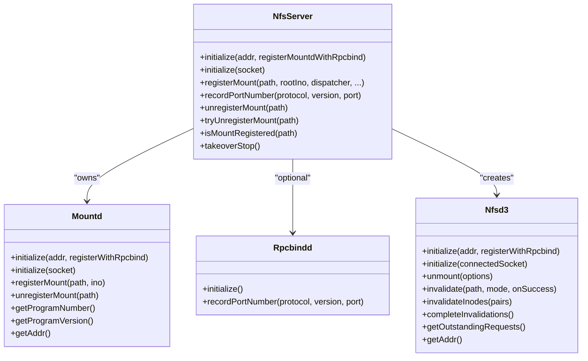
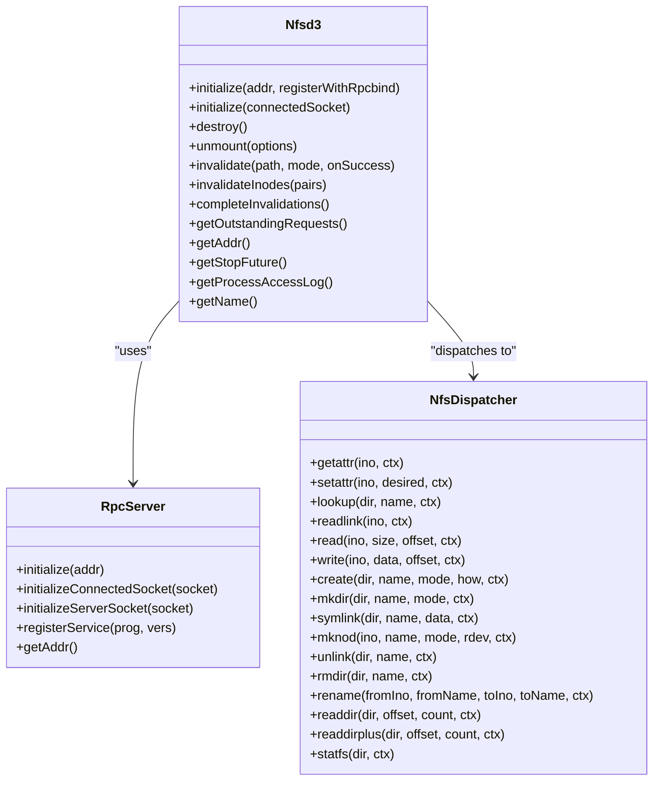
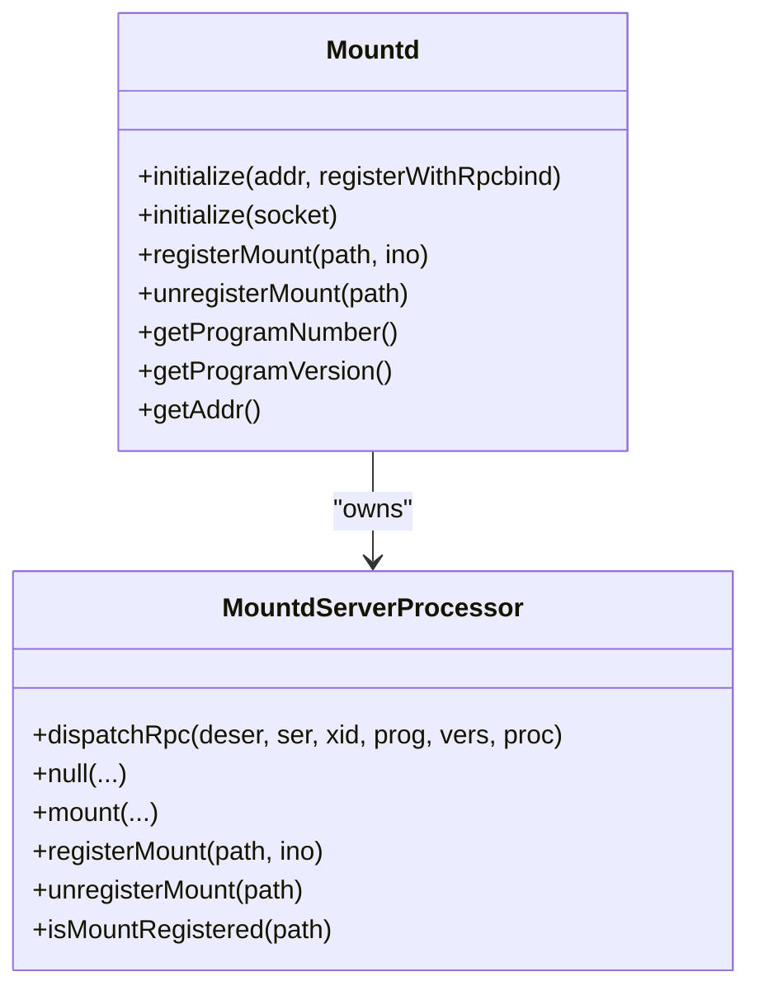
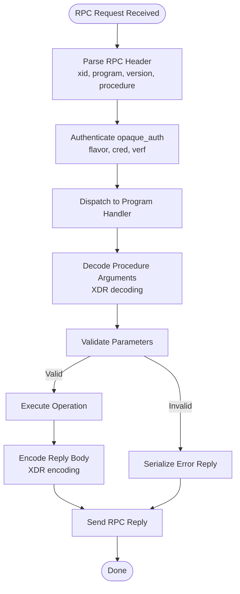
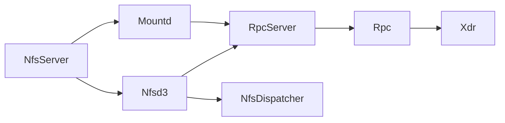

# NFS Support

<cite>
**Referenced Files in This Document**
- [NfsServer.cpp](file://eden/fs/nfs/NfsServer.cpp)
- [Nfsd3.h](file://eden/fs/nfs/Nfsd3.h)
- [Mountd.cpp](file://eden/fs/nfs/Mountd.cpp)
- [MountdRpc.h](file://eden/fs/nfs/MountdRpc.h)
- [NfsDispatcher.h](file://eden/fs/nfs/NfsDispatcher.h)
- [RpcServer.h](file://eden/fs/nfs/rpc/RpcServer.h)
- [Rpc.h](file://eden/fs/nfs/rpc/Rpc.h)
- [Xdr.h](file://eden/fs/nfs/xdr/Xdr.h)
- [nfs_test.py](file://eden/fs/cli/doctor/test/nfs_test.py)
</cite>

## Table of Contents
1. [Introduction](#introduction)
2. [Project Structure](#project-structure)
3. [Core Components](#core-components)
4. [Architecture Overview](#architecture-overview)
5. [Detailed Component Analysis](#detailed-component-analysis)
6. [Dependency Analysis](#dependency-analysis)
7. [Performance Considerations](#performance-considerations)
8. [Troubleshooting Guide](#troubleshooting-guide)
9. [Conclusion](#conclusion)

## Introduction
This document explains the Network File System (NFS) support and implementation in the repository, focusing on:
- NfsServer: orchestrates the NFS service lifecycle and mounts
- Nfsd3: the NFS v3 server that serves file operations over RPC
- Mountd: the mount daemon that handles client mount requests
- RPC communication patterns and XDR encoding used by NFS
- Export configuration, client authentication, and network filesystem management
- Examples of operation handlers, mount procedures, and troubleshooting guidance

The implementation integrates with an event-driven RPC framework, uses XDR for wire encoding, and exposes a dispatcher interface for pluggable backend operations.

## Project Structure
The NFS subsystem resides under eden/fs/nfs and is composed of:
- Server orchestration and lifecycle: NfsServer
- NFS v3 server: Nfsd3
- Mount daemon: Mountd
- RPC infrastructure: RpcServer, Rpc
- XDR encoding utilities: Xdr
- Operation dispatcher interface: NfsDispatcher
- Mountd RPC definitions: MountdRpc

**Diagram sources**
- [NfsServer.cpp:15-139](file://eden/fs/nfs/NfsServer.cpp#L15-L139)
- [Nfsd3.h:111-326](file://eden/fs/nfs/Nfsd3.h#L111-L326)
- [Mountd.cpp:23-280](file://eden/fs/nfs/Mountd.cpp#L23-L280)
- [RpcServer.h:286-430](file://eden/fs/nfs/rpc/RpcServer.h#L286-L430)
- [Rpc.h:16-203](file://eden/fs/nfs/rpc/Rpc.h#L16-L203)
- [Xdr.h:182-722](file://eden/fs/nfs/xdr/Xdr.h#L182-L722)
- [NfsDispatcher.h:40-390](file://eden/fs/nfs/NfsDispatcher.h#L40-L390)

**Section sources**
- [NfsServer.cpp:15-139](file://eden/fs/nfs/NfsServer.cpp#L15-L139)
- [Nfsd3.h:111-326](file://eden/fs/nfs/Nfsd3.h#L111-L326)
- [Mountd.cpp:23-280](file://eden/fs/nfs/Mountd.cpp#L23-L280)
- [RpcServer.h:286-430](file://eden/fs/nfs/rpc/RpcServer.h#L286-L430)
- [Rpc.h:16-203](file://eden/fs/nfs/rpc/Rpc.h#L16-L203)
- [Xdr.h:182-722](file://eden/fs/nfs/xdr/Xdr.h#L182-L722)
- [NfsDispatcher.h:40-390](file://eden/fs/nfs/NfsDispatcher.h#L40-L390)

## Core Components
- NfsServer: constructs and initializes Mountd and Nfsd3, registers mount points, and optionally registers with rpcbind.
- Nfsd3: the NFS v3 program that accepts connections, decodes RPC calls, routes to NfsDispatcher, and replies via RpcServer.
- Mountd: handles mount requests, maintains a mount map, and registers/unregisters mount points.
- RpcServer: generic RPC server that accepts connections, parses RPC messages, and dispatches to processors.
- Rpc: defines RPC message structures, authentication flavors, and reply semantics.
- Xdr: provides XDR serialization/deserialization for RPC payloads and discriminated unions.
- NfsDispatcher: abstract interface for file system operations (getattr, setattr, read, write, create, mkdir, symlink, mknod, unlink, rmdir, rename, readdir/readdirplus, statfs).

Key responsibilities:
- NfsServer coordinates initialization, port registration, and mount lifecycle.
- Nfsd3 and Mountd share RpcServer for transport and XDR for encoding.
- NfsDispatcher enables pluggable backend implementations for file operations.

**Section sources**
- [NfsServer.cpp:15-139](file://eden/fs/nfs/NfsServer.cpp#L15-L139)
- [Nfsd3.h:111-326](file://eden/fs/nfs/Nfsd3.h#L111-L326)
- [Mountd.cpp:23-280](file://eden/fs/nfs/Mountd.cpp#L23-L280)
- [RpcServer.h:286-430](file://eden/fs/nfs/rpc/RpcServer.h#L286-L430)
- [Rpc.h:16-203](file://eden/fs/nfs/rpc/Rpc.h#L16-L203)
- [Xdr.h:182-722](file://eden/fs/nfs/xdr/Xdr.h#L182-L722)
- [NfsDispatcher.h:40-390](file://eden/fs/nfs/NfsDispatcher.h#L40-L390)

## Architecture Overview
The NFS stack composes a layered RPC architecture:
- Transport: Tcp/TLS sockets managed by RpcServer
- RPC framing: call and reply messages with XID, program, version, procedure
- Authentication: opaque_auth with flavors (e.g., AUTH_SYS)
- Encoding: XDR big-endian primitives, arrays, vectors, strings, variants, and lists
- Dispatch: Mountd handles mount requests; Nfsd3 handles file operations
- Operations: NfsDispatcher abstracts filesystem operations

**Diagram sources**
- [Mountd.cpp:23-280](file://eden/fs/nfs/Mountd.cpp#L23-L280)
- [Nfsd3.h:111-326](file://eden/fs/nfs/Nfsd3.h#L111-L326)
- [NfsDispatcher.h:40-390](file://eden/fs/nfs/NfsDispatcher.h#L40-L390)
- [Rpc.h:16-203](file://eden/fs/nfs/rpc/Rpc.h#L16-L203)
- [Xdr.h:182-722](file://eden/fs/nfs/xdr/Xdr.h#L182-L722)

## Detailed Component Analysis

### NfsServer
Responsibilities:
- Initialize Mountd and optionally rpcbindd
- Register mount points and expose Nfsd3 instances
- Record port numbers for rpcbind registration when appropriate
- Manage takeover and unmount lifecycle

Key behaviors:
- Initializes Mountd with a listening address and optional rpcbind registration
- Creates Nfsd3 with a dispatcher and operational parameters
- Registers mount path and root inode with Mountd
- Records program/version/port with rpcbindd if enabled

**Diagram sources**
- [NfsServer.cpp:15-139](file://eden/fs/nfs/NfsServer.cpp#L15-L139)
- [Mountd.cpp:237-280](file://eden/fs/nfs/Mountd.cpp#L237-L280)
- [Nfsd3.h:129-326](file://eden/fs/nfs/Nfsd3.h#L129-L326)

**Section sources**
- [NfsServer.cpp:15-139](file://eden/fs/nfs/NfsServer.cpp#L15-L139)

### Nfsd3 (NFS v3 Server)
Responsibilities:
- Serve NFS v3 RPC requests on a socket
- Decode RPC call headers and route to NfsDispatcher
- Encode replies using XDR
- Track outstanding requests and publish telemetry
- Invalidate client caches via chmod trick and background executor

Highlights:
- Exposes program number/version and listening address
- Supports manual takeover and graceful stop
- Provides detailed tracing and argument capture via TraceBus

**Diagram sources**
- [Nfsd3.h:111-326](file://eden/fs/nfs/Nfsd3.h#L111-L326)
- [RpcServer.h:286-430](file://eden/fs/nfs/rpc/RpcServer.h#L286-L430)
- [NfsDispatcher.h:40-390](file://eden/fs/nfs/NfsDispatcher.h#L40-L390)

**Section sources**
- [Nfsd3.h:111-326](file://eden/fs/nfs/Nfsd3.h#L111-L326)

### Mountd (Mount Daemon)
Responsibilities:
- Handle mount requests and maintain a mount map
- Route RPC procedures via a processor that dispatches to handlers
- Register/unregister mount points and expose program metadata

Key behaviors:
- Processes mount and null procedures
- Validates program/version/procedure and dispatches to handler
- Maintains an internal map of registered paths to inode numbers

**Diagram sources**
- [Mountd.cpp:23-280](file://eden/fs/nfs/Mountd.cpp#L23-L280)

**Section sources**
- [Mountd.cpp:23-280](file://eden/fs/nfs/Mountd.cpp#L23-L280)

### RPC Communication Patterns and XDR Encoding
RPC layer:
- Defines RPC message types, call/reply bodies, accept/reject variants, and authentication
- Provides serialization helpers and traits for XDR encoding

XDR encoding:
- Big-endian integers, booleans, enums, arrays, vectors, strings, IOBuf
- Discriminated unions and optional data modeled via variants and optional wrappers
- Padding rules for 4-byte alignment

**Diagram sources**
- [Rpc.h:16-203](file://eden/fs/nfs/rpc/Rpc.h#L16-L203)
- [Xdr.h:182-722](file://eden/fs/nfs/xdr/Xdr.h#L182-L722)

**Section sources**
- [Rpc.h:16-203](file://eden/fs/nfs/rpc/Rpc.h#L16-L203)
- [Xdr.h:182-722](file://eden/fs/nfs/xdr/Xdr.h#L182-L722)

### Operation Handlers and Mount Procedures
Operation handlers:
- NfsDispatcher defines the contract for file operations (getattr, setattr, read, write, create, mkdir, symlink, mknod, unlink, rmdir, rename, readdir/readdirplus, statfs)
- Nfsd3 routes decoded RPC calls to NfsDispatcher and encodes results using XDR

Mount procedures:
- Mountd processes mount requests and returns export lists
- NfsServer registers mount points and exposes Nfsd3 address for client consumption

Examples of handler responsibilities (described):
- getattr/setattr: fetch/update file attributes atomically
- read/write: streaming I/O with offsets and size limits
- create/mkdir/symlink/mknod: create file system objects with pre/post directory stats
- unlink/rmdir/rename: move/remove files/directories with directory pre/post stats
- readdir/readdirplus: enumerate directory entries with continuation offsets
- statfs: report filesystem statistics

**Section sources**
- [NfsDispatcher.h:40-390](file://eden/fs/nfs/NfsDispatcher.h#L40-L390)
- [Mountd.cpp:23-280](file://eden/fs/nfs/Mountd.cpp#L23-L280)
- [NfsServer.cpp:74-108](file://eden/fs/nfs/NfsServer.cpp#L74-L108)

## Dependency Analysis
- NfsServer depends on Mountd and optionally Rpcbindd; creates Nfsd3 instances
- Nfsd3 depends on RpcServer for transport and Xdr for encoding
- Mountd depends on RpcServer and MountdRpc for mount procedures
- RpcServer depends on Rpc for message structures and Xdr for payload encoding
- NfsDispatcher is an abstraction consumed by Nfsd3

**Diagram sources**
- [NfsServer.cpp:15-139](file://eden/fs/nfs/NfsServer.cpp#L15-L139)
- [Nfsd3.h:111-326](file://eden/fs/nfs/Nfsd3.h#L111-L326)
- [Mountd.cpp:23-280](file://eden/fs/nfs/Mountd.cpp#L23-L280)
- [RpcServer.h:286-430](file://eden/fs/nfs/rpc/RpcServer.h#L286-L430)
- [Rpc.h:16-203](file://eden/fs/nfs/rpc/Rpc.h#L16-L203)
- [Xdr.h:182-722](file://eden/fs/nfs/xdr/Xdr.h#L182-L722)
- [NfsDispatcher.h:40-390](file://eden/fs/nfs/NfsDispatcher.h#L40-L390)

**Section sources**
- [NfsServer.cpp:15-139](file://eden/fs/nfs/NfsServer.cpp#L15-L139)
- [Nfsd3.h:111-326](file://eden/fs/nfs/Nfsd3.h#L111-L326)
- [Mountd.cpp:23-280](file://eden/fs/nfs/Mountd.cpp#L23-L280)
- [RpcServer.h:286-430](file://eden/fs/nfs/rpc/RpcServer.h#L286-L430)
- [Rpc.h:16-203](file://eden/fs/nfs/rpc/Rpc.h#L16-L203)
- [Xdr.h:182-722](file://eden/fs/nfs/xdr/Xdr.h#L182-L722)
- [NfsDispatcher.h:40-390](file://eden/fs/nfs/NfsDispatcher.h#L40-L390)

## Performance Considerations
- Concurrency and threading:
  - RpcConnectionHandler uses a thread pool to process requests off the event base, preventing socket reads/writes from blocking
  - Nfsd3 invalidation uses a serial executor to ensure parent invalidations occur after children
- Backpressure and logging:
  - RpcServer tracks pending requests and logs high-volume scenarios at intervals to avoid spam
  - Maximum in-flight requests are tracked (currently not enforced)
- Telemetry:
  - Nfsd3 maintains outstanding request telemetry and exposes a TraceBus for detailed argument tracing
- Client caching:
  - Nfsd3 triggers cache invalidation via chmod to force kernel cache refresh, minimizing stale data exposure

Recommendations:
- Tune thread pool sizing based on workload characteristics
- Monitor high pending request thresholds and adjust timeouts accordingly
- Use traceDetailedArguments sparingly due to overhead

**Section sources**
- [RpcServer.h:93-284](file://eden/fs/nfs/rpc/RpcServer.h#L93-L284)
- [Nfsd3.h:294-321](file://eden/fs/nfs/Nfsd3.h#L294-L321)

## Troubleshooting Guide
Common issues and diagnostics:
- Mount failures:
  - Verify Mountd is initialized and registered with rpcbind if applicable
  - Confirm program/version/procedure availability and mismatch handling
- RPC parsing errors:
  - RpcParsingError indicates malformed RPC messages; inspect procedure context
- Authentication problems:
  - auth_flavor and opaque_auth must be correctly formed; check credentials and verifier
- Client cache inconsistencies:
  - Use invalidate/invalidateInodes to trigger kernel cache refresh; ensure completion via completeInvalidations
- Operational checks:
  - Use the NFS doctor test harness to validate mount and operation behavior

Diagnostic aids:
- RpcServer logs anomalies and structured logs for fleet-wide monitoring
- Nfsd3 exposes outstanding requests and tracing facilities for debugging

**Section sources**
- [Rpc.h:180-203](file://eden/fs/nfs/rpc/Rpc.h#L180-L203)
- [RpcServer.h:31-67](file://eden/fs/nfs/rpc/RpcServer.h#L31-L67)
- [Nfsd3.h:209-242](file://eden/fs/nfs/Nfsd3.h#L209-L242)
- [nfs_test.py](file://eden/fs/cli/doctor/test/nfs_test.py)

## Conclusion
The NFS implementation provides a robust, event-driven RPC stack for serving NFS v3 operations and managing mounts. It leverages XDR for wire compatibility, RpcServer for transport, and a dispatcher abstraction for filesystem operations. With built-in telemetry, invalidation mechanisms, and structured logging, it supports reliable deployment and troubleshooting. For production, ensure proper authentication configuration, monitor request volumes, and leverage tracing and invalidation APIs to maintain cache coherence and performance.