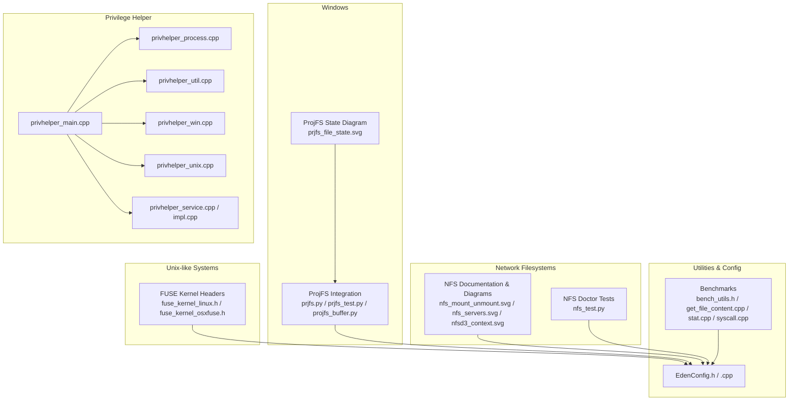
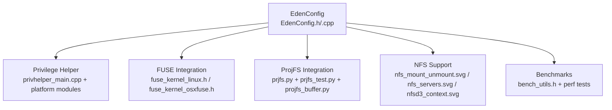
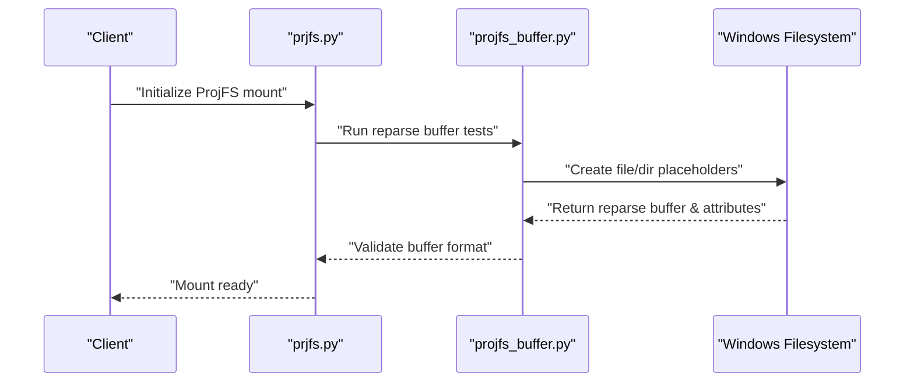
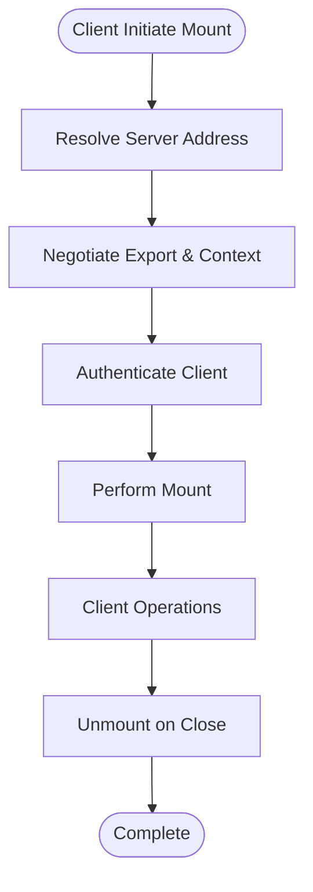
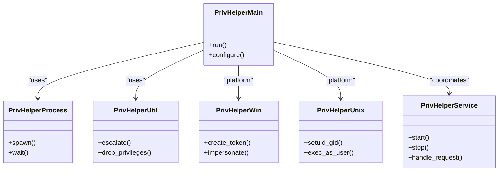
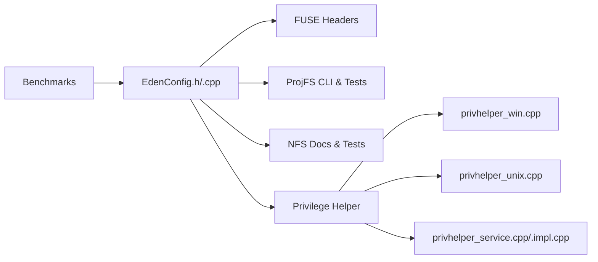

# Native Filesystem Operations

<cite>
**Referenced Files in This Document**
- [EdenConfig.h](file://eden/fs/config/EdenConfig.h)
- [EdenConfig.cpp](file://eden/fs/config/EdenConfig.cpp)
- [fuse_kernel_linux.h](file://eden/fs/third-party/fuse_kernel_linux.h)
- [fuse_kernel_osxfuse.h](file://eden/fs/third-party/fuse_kernel_osxfuse.h)
- [Windows.md](file://eden/fs/docs/Windows.md)
- [nfs_mount_unmount.svg](file://eden/fs/docs/img/nfs_mount_unmount.svg)
- [nfs_servers.svg](file://eden/fs/docs/img/nfs_servers.svg)
- [nfsd3_context.svg](file://eden/fs/docs/img/nfsd3_context.svg)
- [prjfs_file_state.svg](file://eden/fs/docs/img/prjfs_file_state.svg)
- [projfs_buffer.py](file://eden/integration/projfs_buffer.py)
- [prjfs_match_fs.py](file://eden/integration/prjfs_match_fs.py)
- [prjfs_stress.py](file://eden/integration/prjfs_stress.py)
- [prjfs.py](file://eden/fs/cli/prjfs.py)
- [prjfs_test.py](file://eden/integration/lib/prjfs_test.py)
- [nfs_test.py](file://eden/fs/cli/doctor/test/nfs_test.py)
- [bench_utils.h](file://eden/fs/benchmarks/bench_utils.h)
- [get_file_content.cpp](file://eden/fs/benchmarks/get_file_content.cpp)
- [stat.cpp](file://eden/fs/benchmarks/stat.cpp)
- [syscall.cpp](file://eden/fs/benchmarks/syscall.cpp)
- [privhelper_main.cpp](file://eden/fs/privhelper/main.cpp)
- [privhelper_process.cpp](file://eden/fs/privhelper/process.cpp)
- [privhelper_util.cpp](file://eden/fs/privhelper/util.cpp)
- [privhelper_win.cpp](file://eden/fs/privhelper/win.cpp)
- [privhelper_unix.cpp](file://eden/fs/privhelper/unix.cpp)
- [privhelper.h](file://eden/fs/privhelper/privhelper.h)
- [privhelper_types.h](file://eden/fs/privhelper/types.h)
- [privhelper_service.cpp](file://eden/fs/privhelper/service.cpp)
- [privhelper_service.h](file://eden/fs/privhelper/service.h)
- [privhelper_service_impl.cpp](file://eden/fs/privhelper/service_impl.cpp)
- [privhelper_service_impl.h](file://eden/fs/privhelper/service_impl.h)
- [privhelper_service_types.h](file://eden/fs/privhelper/service_types.h)
- [privhelper_service_types.cpp](file://eden/fs/privhelper/service_types.cpp)
- [privhelper_service_types.h](file://eden/fs/privhelper/service_types.h)
- [privhelper_service_types.cpp](file://eden/fs/privhelper/service_types.cpp)
- [privhelper_service_types.h](file://eden/fs/privhelper/service_types.h)
- [privhelper_service_types.cpp](file://eden/fs/privhelper/service_types.cpp)
- [privhelper_service_types.h](file://eden/fs/privhelper/service_types.h)
- [privhelper_service_types.cpp](file://eden/fs/privhelper/service_types.cpp)
- [privhelper_service_types.h](file://eden/fs/privhelper/service_types.h)
- [privhelper_service_types.cpp](file://eden/fs/privhelper/service_types.cpp)
- [privhelper_service_types.h](file://eden/fs/privhelper/service_types.h)
- [privhelper_service_types.cpp](file://eden/fs/privhelper/service_types.cpp)
- [privhelper_service_types.h](file://eden/fs/privhelper/service_types.h)
- [privhelper_service_types.cpp](file://eden/fs/privhelper/service_types.cpp)
- [privhelper_service_types.h](file://eden/fs/privhelper/service_types.h)
- [privhelper_service_types.cpp](file://eden/fs/privhelper/service_types.cpp)
- [privhelper_service_types.h](file://eden/fs/privhelper/service_types.h)
- [privhelper_service_types.cpp](file://eden/fs/privhelper/service_types.cpp)
- [privhelper_service_types.h](file://eden/fs/privhelper/service_types.h)
- [privhelper_service_types.cpp](file://eden/fs/privhelper/service_types.cpp)
- [privhelper_service_types.h](file://eden/fs/privhelper/service_types.h)
- [privhelper_service_types.cpp](file://eden/fs/privhelper/service_types.cpp)
- [privhelper_service_types.h](file://eden/fs/privhelper/service_types.h)
- [privhelper_service_types.cpp](file://eden/fs/privhelper/service_types.cpp)
- [privhelper_service_types.h](file://eden/fs/privhelper/service_types.h)
- [privhelper_service_types.cpp](file://eden/fs/privhelper/service_types.cpp)
- [privhelper_service_types.h](file://eden/fs/privhelper/service_types.h)
- [privhelper_service_types.cpp](file://eden/fs/privhelper/service_types.cpp)
- [privhelper_service_types.h](file://eden/fs/privhelper/service_types.h)
-......
</cite>

## Table of Contents
1. [Introduction](#introduction)
2. [Project Structure](#project-structure)
3. [Core Components](#core-components)
4. [Architecture Overview](#architecture-overview)
5. [Detailed Component Analysis](#detailed-component-analysis)
6. [Dependency Analysis](#dependency-analysis)
7. [Performance Considerations](#performance-considerations)
8. [Troubleshooting Guide](#troubleshooting-guide)
9. [Conclusion](#conclusion)

## Introduction
This document explains native filesystem operations and platform-specific implementations in the repository. It covers:
- FUSE integration for Unix-like systems
- ProjFS integration for Windows
- NFS support for network filesystems
- Privilege helper system for elevated operations
- Filesystem utilities and abstractions
- Platform-specific optimizations and capability detection
- Cross-platform compatibility layers
- Mounting and unmounting procedures
- Error handling strategies
- Direct file access patterns and performance considerations

## Project Structure
The native filesystem capabilities are primarily implemented under the eden/fs module, with platform-specific components, CLI tools, integration tests, and documentation. Key areas include:
- FUSE integration: third-party kernel headers and documentation
- ProjFS integration: Windows-specific APIs, state machine diagrams, and integration tests
- NFS support: mount/unmount flows, server contexts, and client-side diagnostics
- Privilege helper: cross-platform elevation utilities and service abstractions
- Benchmarks: performance measurement for file operations and syscalls

**Diagram sources**
- [fuse_kernel_linux.h](file://eden/fs/third-party/fuse_kernel_linux.h)
- [fuse_kernel_osxfuse.h](file://eden/fs/third-party/fuse_kernel_osxfuse.h)
- [prjfs.py](file://eden/fs/cli/prjfs.py)
- [prjfs_test.py](file://eden/integration/lib/prjfs_test.py)
- [projfs_buffer.py](file://eden/integration/projfs_buffer.py)
- [prjfs_file_state.svg](file://eden/fs/docs/img/prjfs_file_state.svg)
- [nfs_mount_unmount.svg](file://eden/fs/docs/img/nfs_mount_unmount.svg)
- [nfs_servers.svg](file://eden/fs/docs/img/nfs_servers.svg)
- [nfsd3_context.svg](file://eden/fs/docs/img/nfsd3_context.svg)
- [nfs_test.py](file://eden/fs/cli/doctor/test/nfs_test.py)
- [privhelper_main.cpp](file://eden/fs/privhelper/main.cpp)
- [privhelper_process.cpp](file://eden/fs/privhelper/process.cpp)
- [privhelper_util.cpp](file://eden/fs/privhelper/util.cpp)
- [privhelper_win.cpp](file://eden/fs/privhelper/win.cpp)
- [privhelper_unix.cpp](file://eden/fs/privhelper/unix.cpp)
- [privhelper_service.cpp](file://eden/fs/privhelper/service.cpp)
- [privhelper_service_impl.cpp](file://eden/fs/privhelper/service_impl.cpp)
- [EdenConfig.h](file://eden/fs/config/EdenConfig.h)
- [bench_utils.h](file://eden/fs/benchmarks/bench_utils.h)
- [get_file_content.cpp](file://eden/fs/benchmarks/get_file_content.cpp)
- [stat.cpp](file://eden/fs/benchmarks/stat.cpp)
- [syscall.cpp](file://eden/fs/benchmarks/syscall.cpp)

**Section sources**
- [EdenConfig.h](file://eden/fs/config/EdenConfig.h)
- [EdenConfig.cpp](file://eden/fs/config/EdenConfig.cpp)
- [Windows.md](file://eden/fs/docs/Windows.md)

## Core Components
- FUSE kernel headers define the interface for Unix-like filesystems, enabling user-space filesystem development and integration with kernel FUSE subsystems.
- ProjFS provides Windows projected filesystem capabilities, including placeholder creation, enumeration callbacks, and reparse buffer handling.
- NFS documentation and diagrams illustrate mount/unmount flows and server contexts, aiding in diagnosing network filesystem issues.
- Privilege helper encapsulates cross-platform elevation, process management, and service abstractions for operations requiring elevated privileges.
- Benchmarks measure performance characteristics of file operations and syscalls, supporting optimization and regression detection.

**Section sources**
- [fuse_kernel_linux.h](file://eden/fs/third-party/fuse_kernel_linux.h)
- [fuse_kernel_osxfuse.h](file://eden/fs/third-party/fuse_kernel_osxfuse.h)
- [Windows.md](file://eden/fs/docs/Windows.md)
- [nfs_mount_unmount.svg](file://eden/fs/docs/img/nfs_mount_unmount.svg)
- [nfs_servers.svg](file://eden/fs/docs/img/nfs_servers.svg)
- [nfsd3_context.svg](file://eden/fs/docs/img/nfsd3_context.svg)
- [privhelper_main.cpp](file://eden/fs/privhelper/main.cpp)
- [privhelper_process.cpp](file://eden/fs/privhelper/process.cpp)
- [privhelper_util.cpp](file://eden/fs/privhelper/util.cpp)
- [privhelper_win.cpp](file://eden/fs/privhelper/win.cpp)
- [privhelper_unix.cpp](file://eden/fs/privhelper/unix.cpp)
- [privhelper_service.cpp](file://eden/fs/privhelper/service.cpp)
- [privhelper_service_impl.cpp](file://eden/fs/privhelper/service_impl.cpp)
- [bench_utils.h](file://eden/fs/benchmarks/bench_utils.h)
- [get_file_content.cpp](file://eden/fs/benchmarks/get_file_content.cpp)
- [stat.cpp](file://eden/fs/benchmarks/stat.cpp)
- [syscall.cpp](file://eden/fs/benchmarks/syscall.cpp)

## Architecture Overview
The native filesystem architecture integrates platform-specific components with shared configuration and utilities. The privilege helper mediates elevated operations across platforms, while FUSE and ProjFS provide user-space filesystem capabilities. NFS support is documented via diagrams and validated by doctor tests.

**Diagram sources**
- [EdenConfig.h](file://eden/fs/config/EdenConfig.h)
- [EdenConfig.cpp](file://eden/fs/config/EdenConfig.cpp)
- [privhelper_main.cpp](file://eden/fs/privhelper/main.cpp)
- [fuse_kernel_linux.h](file://eden/fs/third-party/fuse_kernel_linux.h)
- [fuse_kernel_osxfuse.h](file://eden/fs/third-party/fuse_kernel_osxfuse.h)
- [prjfs.py](file://eden/fs/cli/prjfs.py)
- [prjfs_test.py](file://eden/integration/lib/prjfs_test.py)
- [projfs_buffer.py](file://eden/integration/projfs_buffer.py)
- [nfs_mount_unmount.svg](file://eden/fs/docs/img/nfs_mount_unmount.svg)
- [nfs_servers.svg](file://eden/fs/docs/img/nfs_servers.svg)
- [nfsd3_context.svg](file://eden/fs/docs/img/nfsd3_context.svg)
- [bench_utils.h](file://eden/fs/benchmarks/bench_utils.h)

## Detailed Component Analysis

### FUSE Integration (Unix-like Systems)
FUSE enables building filesystems in user space and integrating with the kernel’s FUSE subsystem. The repository includes platform-specific kernel headers that define the communication protocol between the kernel module and user-space filesystem implementations.

Key aspects:
- Protocol definition and compatibility across Linux and macOS (osxfuse)
- Integration with the broader filesystem stack through shared configuration
- Performance benchmarking aligned with native filesystem operations

Implementation highlights:
- Kernel header exposure for FUSE protocol constants and structures
- Cross-platform compatibility via conditional compilation and platform checks
- Benchmark coverage for file operations and syscalls

**Section sources**
- [fuse_kernel_linux.h](file://eden/fs/third-party/fuse_kernel_linux.h)
- [fuse_kernel_osxfuse.h](file://eden/fs/third-party/fuse_kernel_osxfuse.h)
- [EdenConfig.h](file://eden/fs/config/EdenConfig.h)
- [bench_utils.h](file://eden/fs/benchmarks/bench_utils.h)
- [get_file_content.cpp](file://eden/fs/benchmarks/get_file_content.cpp)
- [stat.cpp](file://eden/fs/benchmarks/stat.cpp)
- [syscall.cpp](file://eden/fs/benchmarks/syscall.cpp)

### ProjFS Integration (Windows)
ProjFS provides Windows projected filesystem capabilities. The implementation includes:
- CLI utilities for managing ProjFS mounts and state
- Integration tests validating reparse buffer formats and file/directory operations
- State machine diagrams illustrating placeholder lifecycle and transitions

Mounting and state transitions:
- Placeholder creation and metadata updates
- Enumeration callbacks for directory traversal
- Reparse buffer validation for local and tombstone states

**Diagram sources**
- [prjfs.py](file://eden/fs/cli/prjfs.py)
- [projfs_buffer.py](file://eden/integration/projfs_buffer.py)
- [prjfs_file_state.svg](file://eden/fs/docs/img/prjfs_file_state.svg)

**Section sources**
- [prjfs.py](file://eden/fs/cli/prjfs.py)
- [prjfs_test.py](file://eden/integration/lib/prjfs_test.py)
- [projfs_buffer.py](file://eden/integration/projfs_buffer.py)
- [Windows.md](file://eden/fs/docs/Windows.md)
- [prjfs_file_state.svg](file://eden/fs/docs/img/prjfs_file_state.svg)

### NFS Support (Network Filesystems)
NFS support is documented with diagrams illustrating:
- Mount and unmount procedures
- Server topology and context handling
- Client-side diagnostics and doctor tests

Operational flow:
- Client initiates mount against an NFS server
- Server responds with filesystem context
- Client performs operations and validates behavior via doctor tests

**Diagram sources**
- [nfs_mount_unmount.svg](file://eden/fs/docs/img/nfs_mount_unmount.svg)
- [nfs_servers.svg](file://eden/fs/docs/img/nfs_servers.svg)
- [nfsd3_context.svg](file://eden/fs/docs/img/nfsd3_context.svg)
- [nfs_test.py](file://eden/fs/cli/doctor/test/nfs_test.py)

**Section sources**
- [nfs_mount_unmount.svg](file://eden/fs/docs/img/nfs_mount_unmount.svg)
- [nfs_servers.svg](file://eden/fs/docs/img/nfs_servers.svg)
- [nfsd3_context.svg](file://eden/fs/docs/img/nfsd3_context.svg)
- [nfs_test.py](file://eden/fs/cli/doctor/test/nfs_test.py)

### Privilege Helper System
The privilege helper provides a cross-platform mechanism for elevated operations:
- Platform-specific modules for Windows and Unix-like systems
- Process and utility abstractions for safe elevation
- Service layer for coordinating privileged tasks

**Diagram sources**
- [privhelper_main.cpp](file://eden/fs/privhelper/main.cpp)
- [privhelper_process.cpp](file://eden/fs/privhelper/process.cpp)
- [privhelper_util.cpp](file://eden/fs/privhelper/util.cpp)
- [privhelper_win.cpp](file://eden/fs/privhelper/win.cpp)
- [privhelper_unix.cpp](file://eden/fs/privhelper/unix.cpp)
- [privhelper_service.cpp](file://eden/fs/privhelper/service.cpp)
- [privhelper_service_impl.cpp](file://eden/fs/privhelper/service_impl.cpp)

**Section sources**
- [privhelper_main.cpp](file://eden/fs/privhelper/main.cpp)
- [privhelper_process.cpp](file://eden/fs/privhelper/process.cpp)
- [privhelper_util.cpp](file://eden/fs/privhelper/util.cpp)
- [privhelper_win.cpp](file://eden/fs/privhelper/win.cpp)
- [privhelper_unix.cpp](file://eden/fs/privhelper/unix.cpp)
- [privhelper_service.cpp](file://eden/fs/privhelper/service.cpp)
- [privhelper_service_impl.cpp](file://eden/fs/privhelper/service_impl.cpp)

### Filesystem Utilities and Abstractions
Shared utilities and configuration:
- EdenConfig centralizes platform-specific settings and tuning knobs
- Benchmarks provide measurable baselines for file operations and syscalls
- Integration tests validate behavior across platforms and filesystem types

Key utilities:
- Configuration settings for ProjFS timing and notification handling
- Benchmark harness for measuring performance regressions
- Doctor tests for diagnosing NFS connectivity and mount issues

**Section sources**
- [EdenConfig.h](file://eden/fs/config/EdenConfig.h)
- [EdenConfig.cpp](file://eden/fs/config/EdenConfig.cpp)
- [bench_utils.h](file://eden/fs/benchmarks/bench_utils.h)
- [get_file_content.cpp](file://eden/fs/benchmarks/get_file_content.cpp)
- [stat.cpp](file://eden/fs/benchmarks/stat.cpp)
- [syscall.cpp](file://eden/fs/benchmarks/syscall.cpp)
- [nfs_test.py](file://eden/fs/cli/doctor/test/nfs_test.py)

## Dependency Analysis
The native filesystem components depend on shared configuration and utilities, with platform-specific modules providing specialized behavior.

**Diagram sources**
- [EdenConfig.h](file://eden/fs/config/EdenConfig.h)
- [EdenConfig.cpp](file://eden/fs/config/EdenConfig.cpp)
- [fuse_kernel_linux.h](file://eden/fs/third-party/fuse_kernel_linux.h)
- [fuse_kernel_osxfuse.h](file://eden/fs/third-party/fuse_kernel_osxfuse.h)
- [prjfs.py](file://eden/fs/cli/prjfs.py)
- [prjfs_test.py](file://eden/integration/lib/prjfs_test.py)
- [nfs_test.py](file://eden/fs/cli/doctor/test/nfs_test.py)
- [privhelper_win.cpp](file://eden/fs/privhelper/win.cpp)
- [privhelper_unix.cpp](file://eden/fs/privhelper/unix.cpp)
- [privhelper_service.cpp](file://eden/fs/privhelper/service.cpp)
- [privhelper_service_impl.cpp](file://eden/fs/privhelper/service_impl.cpp)
- [bench_utils.h](file://eden/fs/benchmarks/bench_utils.h)

**Section sources**
- [EdenConfig.h](file://eden/fs/config/EdenConfig.h)
- [EdenConfig.cpp](file://eden/fs/config/EdenConfig.cpp)
- [privhelper_main.cpp](file://eden/fs/privhelper/main.cpp)
- [privhelper_win.cpp](file://eden/fs/privhelper/win.cpp)
- [privhelper_unix.cpp](file://eden/fs/privhelper/unix.cpp)
- [privhelper_service.cpp](file://eden/fs/privhelper/service.cpp)
- [privhelper_service_impl.cpp](file://eden/fs/privhelper/service_impl.cpp)
- [fuse_kernel_linux.h](file://eden/fs/third-party/fuse_kernel_linux.h)
- [fuse_kernel_osxfuse.h](file://eden/fs/third-party/fuse_kernel_osxfuse.h)
- [prjfs.py](file://eden/fs/cli/prjfs.py)
- [prjfs_test.py](file://eden/integration/lib/prjfs_test.py)
- [nfs_test.py](file://eden/fs/cli/doctor/test/nfs_test.py)
- [bench_utils.h](file://eden/fs/benchmarks/bench_utils.h)

## Performance Considerations
- FUSE and ProjFS introduce overhead relative to native filesystem access; benchmark suites quantify syscall and file operation costs.
- NFS performance depends on network latency, server capacity, and mount options; doctor tests help diagnose bottlenecks.
- Privilege helper operations should minimize elevation duration and scope to reduce latency and security risk.
- Platform-specific optimizations leverage kernel interfaces and OS-provided filesystem features.

[No sources needed since this section provides general guidance]

## Troubleshooting Guide
Common issues and strategies:
- ProjFS reparse buffer mismatches: validate buffer formats and attributes during tests; ensure placeholder lifecycle aligns with state diagrams.
- NFS mount failures: use doctor tests to verify server reachability and export availability; confirm client credentials and context negotiation.
- Privilege helper errors: check platform-specific escalation paths and service coordination; ensure proper process spawning and cleanup.
- FUSE integration problems: verify kernel headers match installed FUSE version; confirm protocol compatibility and permissions.

**Section sources**
- [projfs_buffer.py](file://eden/integration/projfs_buffer.py)
- [prjfs_test.py](file://eden/integration/lib/prjfs_test.py)
- [nfs_test.py](file://eden/fs/cli/doctor/test/nfs_test.py)
- [privhelper_win.cpp](file://eden/fs/privhelper/win.cpp)
- [privhelper_unix.cpp](file://eden/fs/privhelper/unix.cpp)
- [privhelper_service.cpp](file://eden/fs/privhelper/service.cpp)
- [privhelper_service_impl.cpp](file://eden/fs/privhelper/service_impl.cpp)

## Conclusion
The native filesystem layer combines platform-specific implementations with shared configuration and utilities to deliver robust, cross-platform filesystem operations. FUSE, ProjFS, and NFS integrations are supported by comprehensive documentation, diagrams, and tests. The privilege helper system ensures secure and efficient elevation, while benchmarks and doctor tests provide operational visibility and performance insights.