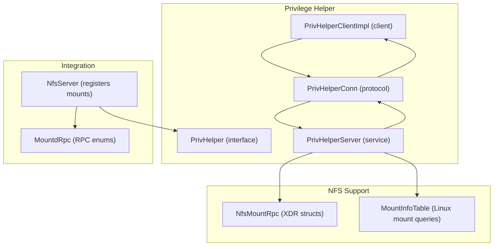
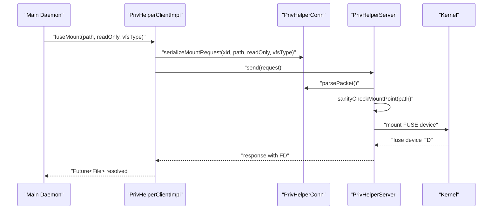
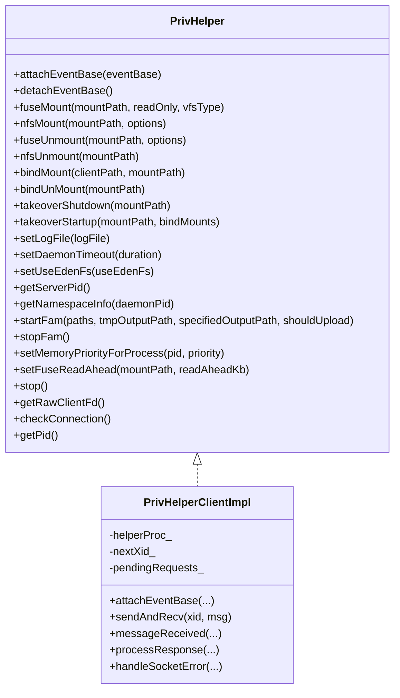
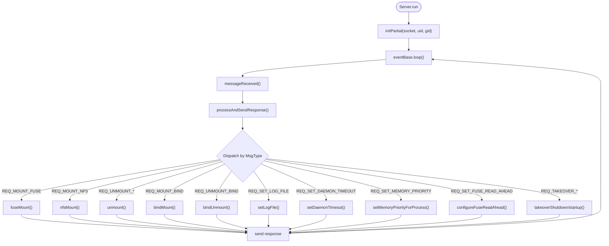
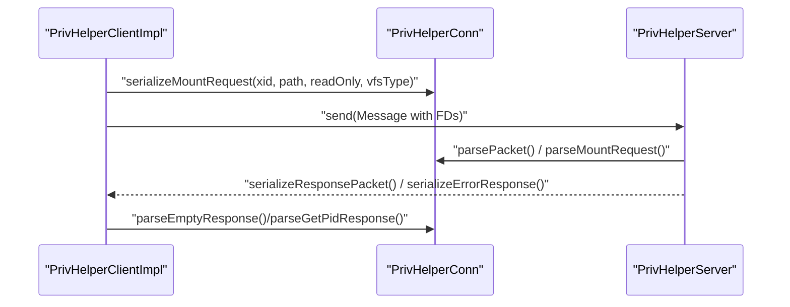
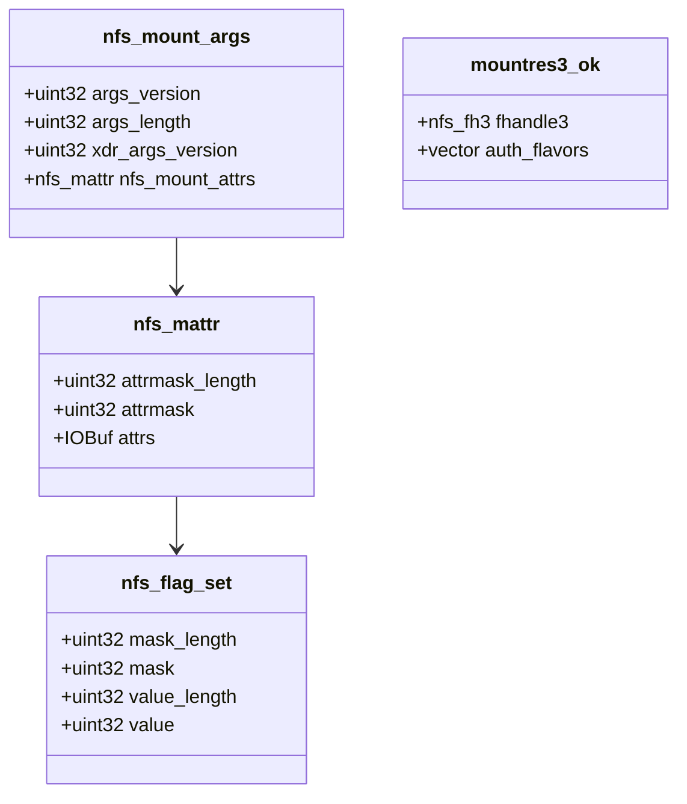
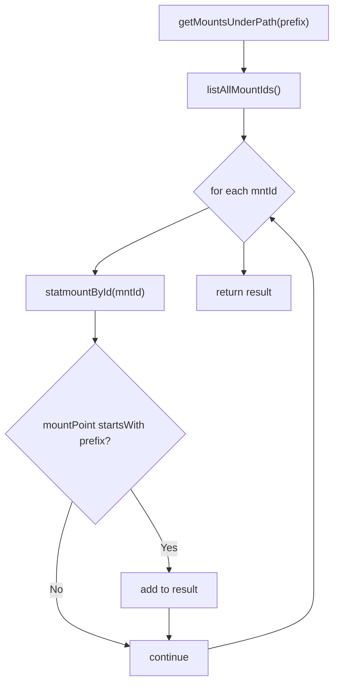
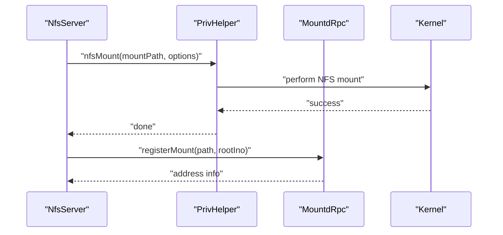
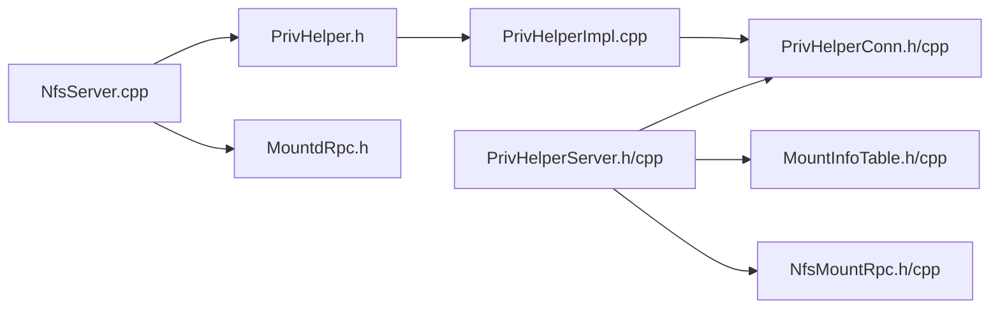

# Privilege Helper System

<cite>
**Referenced Files in This Document**
- [PrivHelper.h](file://eden/fs/privhelper/PrivHelper.h)
- [PrivHelperImpl.h](file://eden/fs/privhelper/PrivHelperImpl.h)
- [PrivHelperImpl.cpp](file://eden/fs/privhelper/PrivHelperImpl.cpp)
- [PrivHelperServer.h](file://eden/fs/privhelper/PrivHelperServer.h)
- [PrivHelperServer.cpp](file://eden/fs/privhelper/PrivHelperServer.cpp)
- [PrivHelperConn.h](file://eden/fs/privhelper/PrivHelperConn.h)
- [PrivHelperConn.cpp](file://eden/fs/privhelper/PrivHelperConn.cpp)
- [NfsMountRpc.h](file://eden/fs/privhelper/NfsMountRpc.h)
- [NfsMountRpc.cpp](file://eden/fs/privhelper/NfsMountRpc.cpp)
- [MountInfoTable.h](file://eden/fs/privhelper/MountInfoTable.h)
- [MountInfoTable.cpp](file://eden/fs/privhelper/MountInfoTable.cpp)
- [NfsServer.cpp](file://eden/fs/nfs/NfsServer.cpp)
- [MountdRpc.h](file://eden/fs/nfs/MountdRpc.h)
- [MountdRpc.cpp](file://eden/fs/nfs/MountdRpc.cpp)
</cite>

## Table of Contents
1. [Introduction](#introduction)
2. [Project Structure](#project-structure)
3. [Core Components](#core-components)
4. [Architecture Overview](#architecture-overview)
5. [Detailed Component Analysis](#detailed-component-analysis)
6. [Dependency Analysis](#dependency-analysis)
7. [Performance Considerations](#performance-considerations)
8. [Troubleshooting Guide](#troubleshooting-guide)
9. [Conclusion](#conclusion)

## Introduction
This document explains the privilege helper system used by EdenFS to safely perform elevated filesystem operations. The system isolates privileged tasks (such as mounting FUSE/NFS filesystems, managing bind mounts, and configuring kernel interfaces) inside a dedicated helper process, while the main EdenFS daemon communicates securely via a local Unix socket. The documentation covers the PrivHelper interface and client implementation, the PrivHelperServer service, the message protocol (PrivHelperConn), NFS mount support (NfsMountRpc), mount state tracking (MountInfoTable), and integration points with the broader filesystem subsystem.

## Project Structure
The privilege helper system spans several files organized by responsibility:
- Interface and client: PrivHelper.h, PrivHelperImpl.h/cpp
- Server and lifecycle: PrivHelperServer.h/cpp
- Protocol and messaging: PrivHelperConn.h/cpp
- NFS support: NfsMountRpc.h/cpp
- Mount state and diagnostics: MountInfoTable.h/cpp
- Integration with NFS stack: NfsServer.cpp and related mountd RPC definitions

**Diagram sources**
- [PrivHelper.h:86-292](file://eden/fs/privhelper/PrivHelper.h#L86-L292)
- [PrivHelperImpl.cpp:52-388](file://eden/fs/privhelper/PrivHelperImpl.cpp#L52-L388)
- [PrivHelperServer.cpp:71-175](file://eden/fs/privhelper/PrivHelperServer.cpp#L71-L175)
- [PrivHelperConn.h:37-266](file://eden/fs/privhelper/PrivHelperConn.h#L37-L266)
- [NfsMountRpc.h:21-257](file://eden/fs/privhelper/NfsMountRpc.h#L21-L257)
- [MountInfoTable.h:18-47](file://eden/fs/privhelper/MountInfoTable.h#L18-L47)
- [NfsServer.cpp:74-108](file://eden/fs/nfs/NfsServer.cpp#L74-L108)
- [MountdRpc.h:18-57](file://eden/fs/nfs/MountdRpc.h#L18-L57)

**Section sources**
- [PrivHelper.h:86-292](file://eden/fs/privhelper/PrivHelper.h#L86-L292)
- [PrivHelperImpl.h:31-42](file://eden/fs/privhelper/PrivHelperImpl.h#L31-L42)
- [PrivHelperServer.h:49-175](file://eden/fs/privhelper/PrivHelperServer.h#L49-L175)
- [PrivHelperConn.h:37-266](file://eden/fs/privhelper/PrivHelperConn.h#L37-L266)
- [NfsMountRpc.h:21-257](file://eden/fs/privhelper/NfsMountRpc.h#L21-L257)
- [MountInfoTable.h:18-47](file://eden/fs/privhelper/MountInfoTable.h#L18-L47)
- [NfsServer.cpp:74-108](file://eden/fs/nfs/NfsServer.cpp#L74-L108)
- [MountdRpc.h:18-57](file://eden/fs/nfs/MountdRpc.h#L18-L57)

## Core Components
- PrivHelper: The public interface for the main daemon to request privileged operations such as fuseMount, nfsMount, fuseUnmount, nfsUnmount, bindMount/bindUnMount, takeover lifecycle, logging, daemon timeout, FUSE read-ahead tuning, and process priority controls.
- PrivHelperImpl: Provides the client implementation and factory functions to spawn/connect to the helper process. It encapsulates Unix socket communication, request/response serialization, and error propagation.
- PrivHelperServer: Runs the privileged helper process, initializes logging and event loops, validates mount paths, performs privileged operations, and handles takeover and FAM lifecycle.
- PrivHelperConn: Defines the wire protocol, message types, and serialization/deserialization routines for requests and responses, including file descriptor passing via SCM_RIGHTS.
- NfsMountRpc: Declares XDR structures for NFS mount arguments and related attributes used by the NFS stack.
- MountInfoTable: On Linux, enumerates and queries mount information using statmount/listmount syscalls to support diagnostics and mount state tracking.
- Integration with NFS: NfsServer registers mounts and coordinates with PrivHelper; MountdRpc defines mount protocol procedures and statuses.

**Section sources**
- [PrivHelper.h:86-292](file://eden/fs/privhelper/PrivHelper.h#L86-L292)
- [PrivHelperImpl.cpp:52-388](file://eden/fs/privhelper/PrivHelperImpl.cpp#L52-L388)
- [PrivHelperServer.h:49-175](file://eden/fs/privhelper/PrivHelperServer.h#L49-L175)
- [PrivHelperConn.h:37-266](file://eden/fs/privhelper/PrivHelperConn.h#L37-L266)
- [NfsMountRpc.h:21-257](file://eden/fs/privhelper/NfsMountRpc.h#L21-L257)
- [MountInfoTable.h:18-47](file://eden/fs/privhelper/MountInfoTable.h#L18-L47)
- [NfsServer.cpp:74-108](file://eden/fs/nfs/NfsServer.cpp#L74-L108)
- [MountdRpc.h:18-57](file://eden/fs/nfs/MountdRpc.h#L18-L57)

## Architecture Overview
The privilege helper architecture enforces least-privilege by delegating sensitive operations to a separate process. The main daemon communicates with the helper over a Unix domain socket using a custom binary protocol. Requests are serialized with typed fields and optional data, and responses carry either success payloads or structured error information. The server validates requests, performs privileged actions, and maintains a set of active mount points.

**Diagram sources**
- [PrivHelperImpl.cpp:390-400](file://eden/fs/privhelper/PrivHelperImpl.cpp#L390-L400)
- [PrivHelperConn.cpp:48-66](file://eden/fs/privhelper/PrivHelperConn.cpp#L48-L66)
- [PrivHelperServer.cpp:1456-1476](file://eden/fs/privhelper/PrivHelperServer.cpp#L1456-L1476)
- [PrivHelper.h:112-121](file://eden/fs/privhelper/PrivHelper.h#L112-L121)

**Section sources**
- [PrivHelperImpl.cpp:214-258](file://eden/fs/privhelper/PrivHelperImpl.cpp#L214-L258)
- [PrivHelperServer.cpp:1456-1476](file://eden/fs/privhelper/PrivHelperServer.cpp#L1456-L1476)
- [PrivHelperConn.cpp:48-66](file://eden/fs/privhelper/PrivHelperConn.cpp#L48-L66)

## Detailed Component Analysis

### PrivHelper Interface and Client
- Responsibilities:
  - Define privileged operations (mounts, unmounts, bind mounts, takeover, logging, daemon timeout, FUSE read-ahead, process priority).
  - Manage EventBase attachment/detachment for asynchronous I/O.
  - Provide blocking variants for early initialization scenarios.
- Implementation highlights:
  - Client attaches to an EventBase and queues requests with unique transaction IDs.
  - Requests are serialized with PrivHelperConn and sent asynchronously; responses resolve promises.
  - Error responses are parsed and rethrown as structured exceptions.

**Diagram sources**
- [PrivHelper.h:86-292](file://eden/fs/privhelper/PrivHelper.h#L86-L292)
- [PrivHelperImpl.cpp:52-388](file://eden/fs/privhelper/PrivHelperImpl.cpp#L52-L388)

**Section sources**
- [PrivHelper.h:86-292](file://eden/fs/privhelper/PrivHelper.h#L86-L292)
- [PrivHelperImpl.cpp:52-388](file://eden/fs/privhelper/PrivHelperImpl.cpp#L52-L388)

### PrivHelperServer: Service Management and Privileged Operations
- Responsibilities:
  - Initialize logging and event loop, attach to Unix socket.
  - Validate mount points and enforce access checks.
  - Perform privileged operations (FUSE/NFS mounts, unmounts, bind mounts, logging, daemon timeout, process priority).
  - Track active mount points and clean up on shutdown or takeover.
  - Handle takeover lifecycle and stale mount detection/cleanup.
- Implementation highlights:
  - Single-threaded event loop with UnixSocket callbacks.
  - Virtual methods enable test overrides for mount/unmount/bind operations.
  - On macOS, supports both MacFUSE and OSXFUSE; on Linux, opens /dev/fuse and passes credentials and FD to kernel.
  - Writes to /sys/class/bdi for FUSE read-ahead tuning on Linux.

**Diagram sources**
- [PrivHelperServer.cpp:71-175](file://eden/fs/privhelper/PrivHelperServer.cpp#L71-L175)
- [PrivHelperServer.cpp:1456-1476](file://eden/fs/privhelper/PrivHelperServer.cpp#L1456-L1476)
- [PrivHelperConn.h:39-59](file://eden/fs/privhelper/PrivHelperConn.h#L39-L59)

**Section sources**
- [PrivHelperServer.h:49-175](file://eden/fs/privhelper/PrivHelperServer.h#L49-L175)
- [PrivHelperServer.cpp:71-175](file://eden/fs/privhelper/PrivHelperServer.cpp#L71-L175)
- [PrivHelperServer.cpp:552-606](file://eden/fs/privhelper/PrivHelperServer.cpp#L552-L606)
- [PrivHelperServer.cpp:511-550](file://eden/fs/privhelper/PrivHelperServer.cpp#L511-L550)

### PrivHelperConn: Protocol, Serialization, and Error Handling
- Responsibilities:
  - Define message types for all privileged operations.
  - Serialize/deserialize request/response payloads.
  - Pass file descriptors using SCM_RIGHTS for FUSE device FDs.
  - Encode/decode NFS mount options and other structured data.
- Implementation highlights:
  - Fixed-size packet header with version and metadata.
  - Optional fields for backward compatibility.
  - Error responses include exception type and message for robust client-side handling.

**Diagram sources**
- [PrivHelperConn.h:37-266](file://eden/fs/privhelper/PrivHelperConn.h#L37-L266)
- [PrivHelperConn.cpp:48-66](file://eden/fs/privhelper/PrivHelperConn.cpp#L48-L66)
- [PrivHelperImpl.cpp:269-286](file://eden/fs/privhelper/PrivHelperImpl.cpp#L269-L286)

**Section sources**
- [PrivHelperConn.h:37-266](file://eden/fs/privhelper/PrivHelperConn.h#L37-L266)
- [PrivHelperConn.cpp:48-200](file://eden/fs/privhelper/PrivHelperConn.cpp#L48-L200)

### NfsMountRpc: NFS Mount Argument Structures
- Responsibilities:
  - Define XDR-compatible structures for NFS mount arguments and attributes.
  - Support mount flags, timeouts, read/write sizes, and security-related options.
- Implementation highlights:
  - Bitmask-based attribute encoding for efficient serialization.
  - Enums for lock modes and mount status values.

**Diagram sources**
- [NfsMountRpc.h:21-257](file://eden/fs/privhelper/NfsMountRpc.h#L21-L257)

**Section sources**
- [NfsMountRpc.h:21-257](file://eden/fs/privhelper/NfsMountRpc.h#L21-L257)
- [NfsMountRpc.cpp:12-31](file://eden/fs/privhelper/NfsMountRpc.cpp#L12-L31)

### MountInfoTable: Linux Mount State Tracking
- Responsibilities:
  - Enumerate and query mount points using statmount/listmount syscalls.
  - Return device major/minor, mount point, filesystem type, and source for a given path.
- Implementation highlights:
  - Handles buffer growth for statmount when EOVERFLOW occurs.
  - Supports prefix-based queries for nested mount discovery.

**Diagram sources**
- [MountInfoTable.cpp:42-154](file://eden/fs/privhelper/MountInfoTable.cpp#L42-L154)

**Section sources**
- [MountInfoTable.h:18-47](file://eden/fs/privhelper/MountInfoTable.h#L18-L47)
- [MountInfoTable.cpp:29-154](file://eden/fs/privhelper/MountInfoTable.cpp#L29-L154)

### Integration with Filesystem Drivers and NFS
- NfsServer registers mounts with PrivHelper and coordinates RPC ports and dispatchers.
- MountdRpc defines mount protocol procedures and status codes used by the mount daemon.

**Diagram sources**
- [NfsServer.cpp:74-108](file://eden/fs/nfs/NfsServer.cpp#L74-L108)
- [MountdRpc.h:18-57](file://eden/fs/nfs/MountdRpc.h#L18-L57)

**Section sources**
- [NfsServer.cpp:74-108](file://eden/fs/nfs/NfsServer.cpp#L74-L108)
- [MountdRpc.h:18-57](file://eden/fs/nfs/MountdRpc.h#L18-L57)
- [MountdRpc.cpp:1-14](file://eden/fs/nfs/MountdRpc.cpp#L1-L14)

## Dependency Analysis
- Coupling:
  - PrivHelperImpl depends on PrivHelperConn for serialization and UnixSocket for I/O.
  - PrivHelperServer depends on PrivHelperConn for protocol parsing and on platform-specific mount routines.
  - MountInfoTable is Linux-only and used by PrivHelperServer for diagnostics and cleanup.
  - NfsMountRpc is consumed by PrivHelperServer and NFS stack components.
- Cohesion:
  - Each component focuses on a single responsibility: interface, client, server, protocol, NFS structures, or mount state.
- External dependencies:
  - Folly for async primitives, logging, and utilities.
  - Platform-specific kernel interfaces (mount/unmount, statmount/listmount, FUSE devices).
  - XDR serialization for NFS structures.

**Diagram sources**
- [PrivHelper.h:86-292](file://eden/fs/privhelper/PrivHelper.h#L86-L292)
- [PrivHelperImpl.cpp:52-388](file://eden/fs/privhelper/PrivHelperImpl.cpp#L52-L388)
- [PrivHelperServer.cpp:71-175](file://eden/fs/privhelper/PrivHelperServer.cpp#L71-L175)
- [PrivHelperConn.h:37-266](file://eden/fs/privhelper/PrivHelperConn.h#L37-L266)
- [MountInfoTable.h:18-47](file://eden/fs/privhelper/MountInfoTable.h#L18-L47)
- [NfsMountRpc.h:21-257](file://eden/fs/privhelper/NfsMountRpc.h#L21-L257)
- [NfsServer.cpp:74-108](file://eden/fs/nfs/NfsServer.cpp#L74-L108)
- [MountdRpc.h:18-57](file://eden/fs/nfs/MountdRpc.h#L18-L57)

**Section sources**
- [PrivHelperImpl.cpp:52-388](file://eden/fs/privhelper/PrivHelperImpl.cpp#L52-L388)
- [PrivHelperServer.cpp:71-175](file://eden/fs/privhelper/PrivHelperServer.cpp#L71-L175)
- [PrivHelperConn.h:37-266](file://eden/fs/privhelper/PrivHelperConn.h#L37-L266)
- [MountInfoTable.h:18-47](file://eden/fs/privhelper/MountInfoTable.h#L18-L47)
- [NfsMountRpc.h:21-257](file://eden/fs/privhelper/NfsMountRpc.h#L21-L257)
- [NfsServer.cpp:74-108](file://eden/fs/nfs/NfsServer.cpp#L74-L108)
- [MountdRpc.h:18-57](file://eden/fs/nfs/MountdRpc.h#L18-L57)

## Performance Considerations
- Asynchronous I/O: All client-server communication is asynchronous and event-driven, minimizing blocking and enabling high concurrency.
- Single-threaded server: The server’s single-threaded design simplifies state management and avoids contention, but limits parallelism of long-running operations.
- FUSE read-ahead tuning: On Linux, read-ahead is configured post-mount to optimize I/O throughput.
- Syscall efficiency: Linux mount state queries use statmount/listmount to minimize overhead compared to parsing /proc/mounts.

[No sources needed since this section provides general guidance]

## Troubleshooting Guide
- Connection failures:
  - Symptoms: Requests fail immediately or socket errors occur.
  - Causes: Helper process died, EventBase detached, or socket closed.
  - Actions: Re-attach EventBase, restart helper, inspect logs.
- Mount validation errors:
  - Symptoms: Exceptions indicating insufficient permissions or invalid paths.
  - Causes: Missing write access to path components or stale mount detection.
  - Actions: Fix permissions, unmount stale mounts, retry.
- NFS mount issues:
  - Symptoms: Mount fails with protocol or timeout errors.
  - Causes: Incorrect addresses, unsupported flags, or kernel limitations.
  - Actions: Verify mountd/nfsd addresses, adjust options, retry.
- Audit and logging:
  - Enable structured logging in the helper process and main daemon to capture privileged operation outcomes and errors.

**Section sources**
- [PrivHelperImpl.cpp:327-362](file://eden/fs/privhelper/PrivHelperImpl.cpp#L327-L362)
- [PrivHelperServer.cpp:1456-1476](file://eden/fs/privhelper/PrivHelperServer.cpp#L1456-L1476)
- [PrivHelperServer.h:140-150](file://eden/fs/privhelper/PrivHelperServer.h#L140-L150)

## Security Considerations and Best Practices
- Least privilege:
  - Privileged operations are isolated in a dedicated process with restricted capabilities.
- Authentication and isolation:
  - Communication is over a local Unix socket; only the main daemon can communicate with the helper.
- Input validation:
  - Mount paths are validated against user permissions and filesystem state.
- Error containment:
  - Structured error responses prevent leaking internal state; exceptions are propagated with sanitized messages.
- Audit logging:
  - Log privileged operations and outcomes for compliance and debugging.
- Safe defaults:
  - Mount options are controlled centrally to avoid unsafe configurations.

[No sources needed since this section provides general guidance]

## Conclusion
The privilege helper system provides a secure, extensible framework for performing elevated filesystem operations. By separating concerns between the main daemon and the privileged server, and by enforcing strict validation and logging, the system ensures safety and reliability. The modular design allows incremental additions (e.g., new mount options, process priority controls) while maintaining a clear protocol and strong security boundaries.