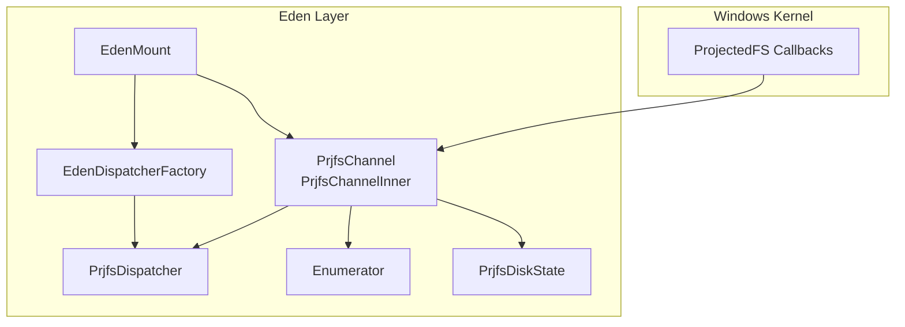
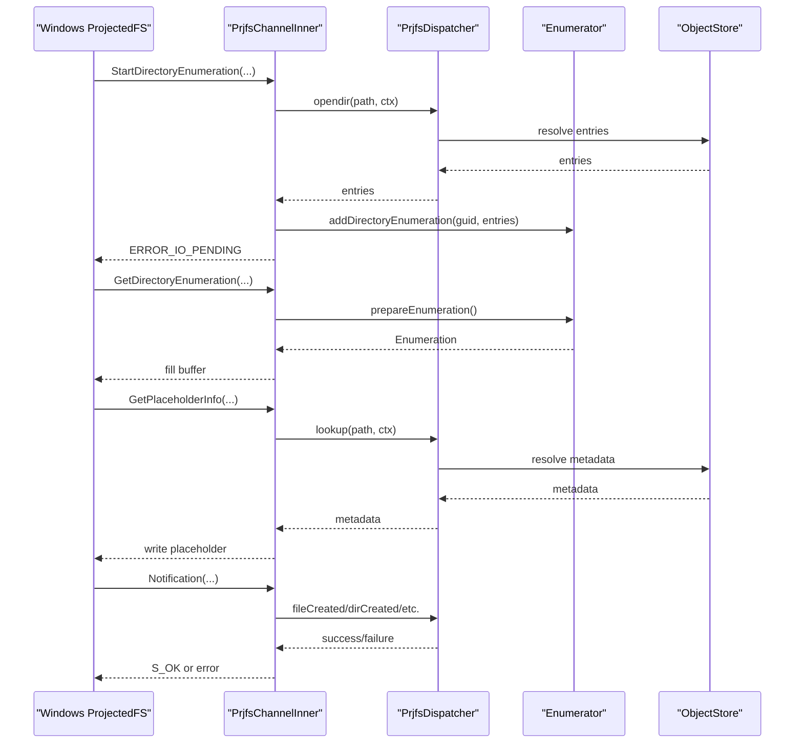
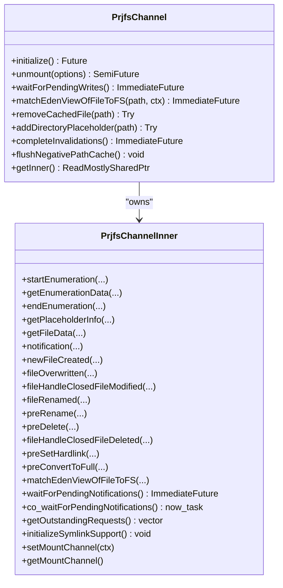
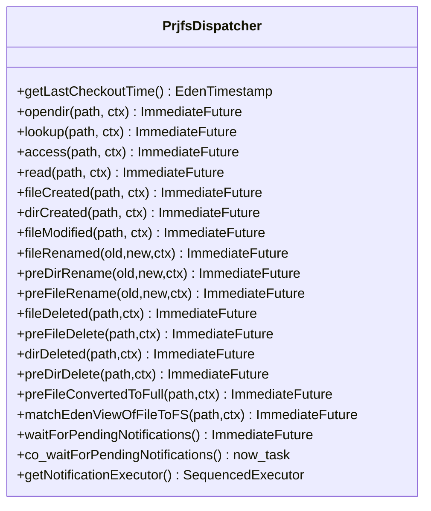
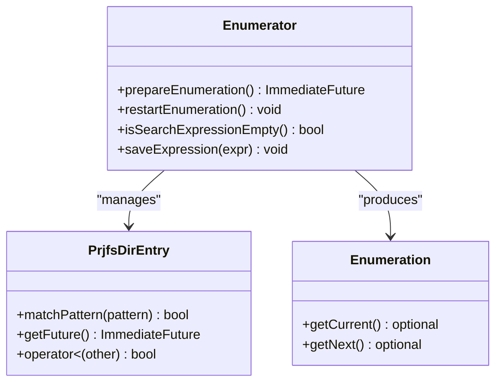
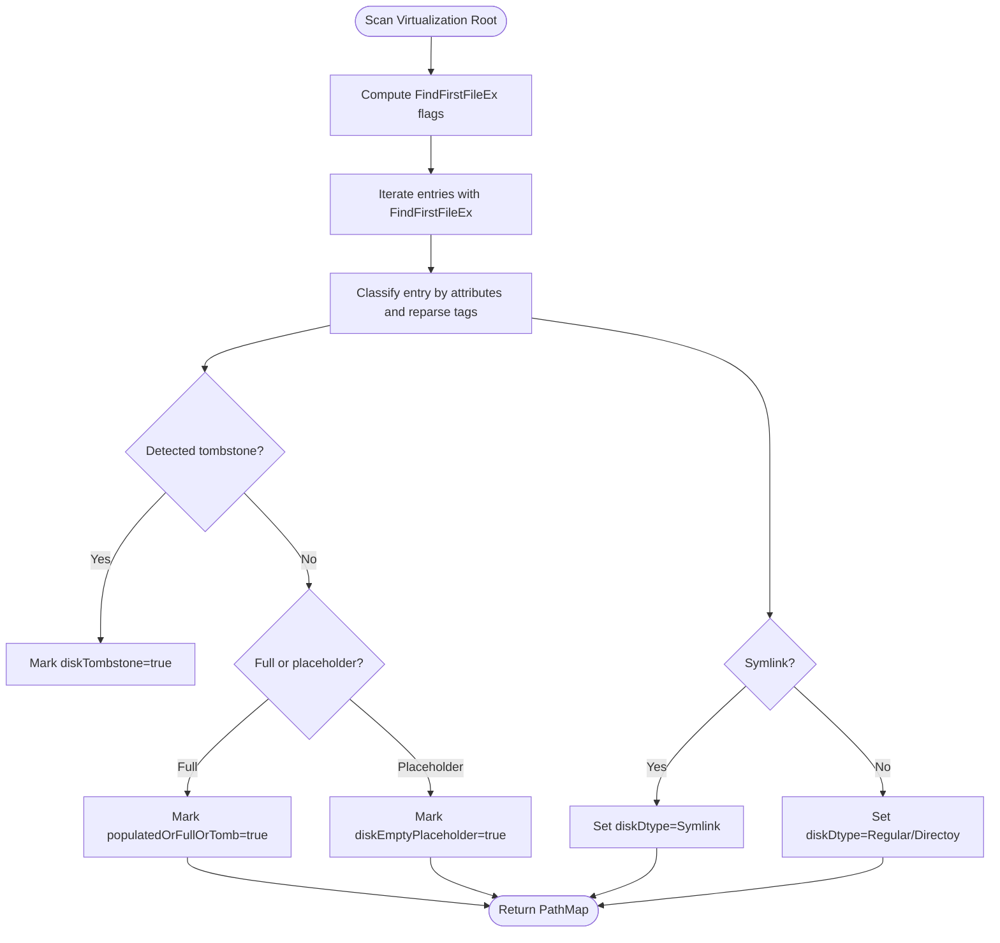
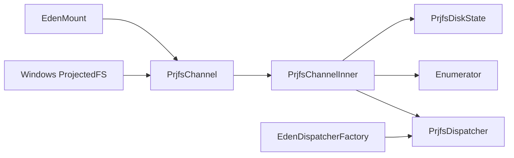

# ProjFS Integration

<cite>
**Referenced Files in This Document**
- [PrjfsChannel.h](file://eden/fs/prjfs/PrjfsChannel.h)
- [PrjfsChannel.cpp](file://eden/fs/prjfs/PrjfsChannel.cpp)
- [PrjfsDispatcher.h](file://eden/fs/prjfs/PrjfsDispatcher.h)
- [PrjfsDispatcher.cpp](file://eden/fs/prjfs/PrjfsDispatcher.cpp)
- [Enumerator.h](file://eden/fs/prjfs/Enumerator.h)
- [Enumerator.cpp](file://eden/fs/prjfs/Enumerator.cpp)
- [PrjfsDiskState.h](file://eden/fs/prjfs/PrjfsDiskState.h)
- [PrjfsDiskState.cpp](file://eden/fs/prjfs/PrjfsDiskState.cpp)
- [EdenMount.h](file://eden/fs/inodes/EdenMount.h)
- [EdenMount.cpp](file://eden/fs/inodes/EdenMount.cpp)
- [EdenDispatcherFactory.h](file://eden/fs/inodes/EdenDispatcherFactory.h)
- [EdenDispatcherFactory.cpp](file://eden/fs/inodes/EdenDispatcherFactory.cpp)
- [InodeGarbageCollection.md](file://eden/fs/docs/InodeGarbageCollection.md)
- [Threading.md](file://eden/fs/docs/Threading.md)
- [projfs_buffer.py](file://eden/integration/projfs_buffer.py)
- [projfs_enumeration.py](file://eden/integration/projfs_enumeration.py)
- [prjfs_match_fs.py](file://eden/integration/prjfs_match_fs.py)
- [prjfs_stress.py](file://eden/integration/prjfs_stress.py)
</cite>

## Table of Contents
1. [Introduction](#introduction)
2. [Project Structure](#project-structure)
3. [Core Components](#core-components)
4. [Architecture Overview](#architecture-overview)
5. [Detailed Component Analysis](#detailed-component-analysis)
6. [Dependency Analysis](#dependency-analysis)
7. [Performance Considerations](#performance-considerations)
8. [Troubleshooting Guide](#troubleshooting-guide)
9. [Conclusion](#conclusion)
10. [Appendices](#appendices)

## Introduction
This document explains the Windows ProjFS integration in the repository, focusing on the kernel communication channel, operation dispatching, file enumeration, disk state management, and Windows-specific filesystem projection techniques. It covers configuration, registration, performance optimization, error handling patterns, and integration with Windows filesystem APIs. Practical examples of operation handlers and debugging techniques are included to help developers integrate and troubleshoot ProjFS effectively.

## Project Structure
The ProjFS implementation is primarily located under eden/fs/prjfs with supporting components in eden/fs/inodes and integration tests under eden/integration. Key areas:
- Channel and kernel callbacks: PrjfsChannel and PrjfsChannelInner manage Windows ProjectedFS callbacks and lifecycle.
- Dispatcher abstraction: PrjfsDispatcher defines the handler interface for file operations and notifications.
- Enumeration engine: Enumerator manages directory enumeration and entry preparation.
- Disk state inspection: PrjfsDiskState provides on-disk state queries for Windows filesystem consistency.
- Mount integration: EdenMount and EdenDispatcherFactory wire the channel into the broader filesystem stack.

**Diagram sources**
- [PrjfsChannel.h:519-661](file://eden/fs/prjfs/PrjfsChannel.h#L519-L661)
- [PrjfsChannel.cpp:1508-1630](file://eden/fs/prjfs/PrjfsChannel.cpp#L1508-L1630)
- [PrjfsDispatcher.h:42-256](file://eden/fs/prjfs/PrjfsDispatcher.h#L42-L256)
- [Enumerator.h:118-160](file://eden/fs/prjfs/Enumerator.h#L118-L160)
- [PrjfsDiskState.h:26-83](file://eden/fs/prjfs/PrjfsDiskState.h#L26-L83)
- [EdenMount.h:475-475](file://eden/fs/inodes/EdenMount.h#L475-L475)
- [EdenDispatcherFactory.h:26-26](file://eden/fs/inodes/EdenDispatcherFactory.h#L26-L26)

**Section sources**
- [PrjfsChannel.h:1-661](file://eden/fs/prjfs/PrjfsChannel.h#L1-L661)
- [PrjfsChannel.cpp:1-1808](file://eden/fs/prjfs/PrjfsChannel.cpp#L1-L1808)
- [PrjfsDispatcher.h:1-256](file://eden/fs/prjfs/PrjfsDispatcher.h#L1-L256)
- [Enumerator.h:1-160](file://eden/fs/prjfs/Enumerator.h#L1-L160)
- [PrjfsDiskState.h:1-83](file://eden/fs/prjfs/PrjfsDiskState.h#L1-L83)
- [EdenMount.h:475-475](file://eden/fs/inodes/EdenMount.h#L475-L475)
- [EdenDispatcherFactory.h:26-26](file://eden/fs/inodes/EdenDispatcherFactory.h#L26-L26)

## Core Components
- PrjfsChannel and PrjfsChannelInner: Bridge between Windows ProjectedFS and Eden’s filesystem layer. They register callbacks, manage mount lifecycle, and orchestrate asynchronous operations with telemetry and tracing.
- PrjfsDispatcher: Abstract interface for file operations and notifications. Provides a sequenced executor for out-of-order notifications and exposes methods for lookup, read, enumeration, and various rename/delete events.
- Enumerator: Manages directory enumeration sessions, prepares entries asynchronously, and supports pattern matching and ordering.
- PrjfsDiskState: Inspects on-disk state of files and directories in the ProjFS virtualization root, including placeholder states, tombstones, and symlink detection.

**Section sources**
- [PrjfsChannel.h:519-661](file://eden/fs/prjfs/PrjfsChannel.h#L519-L661)
- [PrjfsChannel.cpp:1508-1630](file://eden/fs/prjfs/PrjfsChannel.cpp#L1508-L1630)
- [PrjfsDispatcher.h:42-256](file://eden/fs/prjfs/PrjfsDispatcher.h#L42-L256)
- [Enumerator.h:118-160](file://eden/fs/prjfs/Enumerator.h#L118-L160)
- [PrjfsDiskState.h:26-83](file://eden/fs/prjfs/PrjfsDiskState.h#L26-L83)

## Architecture Overview
The Windows ProjFS integration follows a layered design:
- Windows ProjectedFS invokes callbacks into PrjfsChannelInner via function pointers.
- PrjfsChannelInner delegates to PrjfsDispatcher for business logic and to Enumerator for directory enumeration.
- Disk state queries are handled by PrjfsDiskState to maintain consistency with the virtualization root.
- The mount is integrated into EdenMount and created via EdenDispatcherFactory.

**Diagram sources**
- [PrjfsChannel.cpp:177-314](file://eden/fs/prjfs/PrjfsChannel.cpp#L177-L314)
- [PrjfsChannel.cpp:406-583](file://eden/fs/prjfs/PrjfsChannel.cpp#L406-L583)
- [PrjfsChannel.cpp:585-672](file://eden/fs/prjfs/PrjfsChannel.cpp#L585-L672)
- [PrjfsChannel.cpp:1406-1479](file://eden/fs/prjfs/PrjfsChannel.cpp#L1406-L1479)
- [PrjfsDispatcher.h:69-199](file://eden/fs/prjfs/PrjfsDispatcher.h#L69-L199)
- [Enumerator.cpp:90-107](file://eden/fs/prjfs/Enumerator.cpp#L90-L107)

**Section sources**
- [PrjfsChannel.cpp:177-314](file://eden/fs/prjfs/PrjfsChannel.cpp#L177-L314)
- [PrjfsChannel.cpp:406-583](file://eden/fs/prjfs/PrjfsChannel.cpp#L406-L583)
- [PrjfsChannel.cpp:585-672](file://eden/fs/prjfs/PrjfsChannel.cpp#L585-L672)
- [PrjfsChannel.cpp:1406-1479](file://eden/fs/prjfs/PrjfsChannel.cpp#L1406-L1479)
- [PrjfsDispatcher.h:69-199](file://eden/fs/prjfs/PrjfsDispatcher.h#L69-L199)
- [Enumerator.cpp:90-107](file://eden/fs/prjfs/Enumerator.cpp#L90-L107)

## Detailed Component Analysis

### PrjfsChannel and PrjfsChannelInner
Responsibilities:
- Register ProjectedFS callbacks and start/stop the virtualization instance.
- Translate Windows callbacks into asynchronous operations with telemetry.
- Manage directory enumeration sessions and buffer filling.
- Handle file data reads with chunking and torn-read protection.
- Route notifications to PrjfsDispatcher and enforce pre-* denial policies.
- Support symlink placeholders when enabled.

Key behaviors:
- Callback registration and mount initialization in initialize().
- Directory enumeration lifecycle: startEnumeration, getEnumerationData, endEnumeration.
- Placeholder creation via getPlaceholderInfo and file data retrieval via getFileData.
- Notification routing via notification() to pre-* and post-* handlers.
- Negative path cache flushing and placeholder directory marking.

**Diagram sources**
- [PrjfsChannel.h:519-661](file://eden/fs/prjfs/PrjfsChannel.h#L519-L661)
- [PrjfsChannel.cpp:1508-1630](file://eden/fs/prjfs/PrjfsChannel.cpp#L1508-L1630)
- [PrjfsChannel.cpp:340-404](file://eden/fs/prjfs/PrjfsChannel.cpp#L340-L404)

**Section sources**
- [PrjfsChannel.h:519-661](file://eden/fs/prjfs/PrjfsChannel.h#L519-L661)
- [PrjfsChannel.cpp:1508-1630](file://eden/fs/prjfs/PrjfsChannel.cpp#L1508-L1630)
- [PrjfsChannel.cpp:340-404](file://eden/fs/prjfs/PrjfsChannel.cpp#L340-L404)

### PrjfsDispatcher
Responsibilities:
- Define the handler interface for filesystem operations and notifications.
- Provide a sequenced executor to serialize out-of-order notifications.
- Expose methods for opendir, lookup, access, read, and all rename/delete variants.

**Diagram sources**
- [PrjfsDispatcher.h:42-256](file://eden/fs/prjfs/PrjfsDispatcher.h#L42-L256)
- [PrjfsDispatcher.cpp:17-31](file://eden/fs/prjfs/PrjfsDispatcher.cpp#L17-L31)

**Section sources**
- [PrjfsDispatcher.h:42-256](file://eden/fs/prjfs/PrjfsDispatcher.h#L42-L256)
- [PrjfsDispatcher.cpp:17-31](file://eden/fs/prjfs/PrjfsDispatcher.cpp#L17-L31)

### Enumerator
Responsibilities:
- Maintain a sorted list of PrjfsDirEntry items with asynchronous size and symlink target resolution.
- Prepare enumerations with pattern filtering and produce ordered Enumeration instances for buffer filling.

**Diagram sources**
- [Enumerator.h:21-160](file://eden/fs/prjfs/Enumerator.h#L21-L160)
- [Enumerator.cpp:21-107](file://eden/fs/prjfs/Enumerator.cpp#L21-L107)

**Section sources**
- [Enumerator.h:21-160](file://eden/fs/prjfs/Enumerator.h#L21-L160)
- [Enumerator.cpp:21-107](file://eden/fs/prjfs/Enumerator.cpp#L21-L107)

### PrjfsDiskState
Responsibilities:
- Inspect on-disk entries in the ProjFS virtualization root.
- Determine placeholder states, tombstones, symlink types, and directory fullness.
- Support scanning with on-disk entries only to avoid triggering materialization.

**Diagram sources**
- [PrjfsDiskState.cpp:184-243](file://eden/fs/prjfs/PrjfsDiskState.cpp#L184-L243)
- [PrjfsDiskState.cpp:90-177](file://eden/fs/prjfs/PrjfsDiskState.cpp#L90-L177)

**Section sources**
- [PrjfsDiskState.h:26-83](file://eden/fs/prjfs/PrjfsDiskState.h#L26-L83)
- [PrjfsDiskState.cpp:90-177](file://eden/fs/prjfs/PrjfsDiskState.cpp#L90-L177)
- [PrjfsDiskState.cpp:184-243](file://eden/fs/prjfs/PrjfsDiskState.cpp#L184-L243)

### Windows-Specific Filesystem Projection Techniques
- Placeholder creation and metadata: getPlaceholderInfo writes placeholder info with timestamps and optional symlink extended info.
- Directory enumeration: startEnumeration/opendir builds an Enumerator session keyed by GUID; getEnumerationData fills buffers with entries and optional symlink targets.
- File data streaming: getFileData reads content via dispatcher and streams aligned chunks to the kernel, with torn-read protection and cleanup.
- Notification handling: notification routes to pre-* and post-* handlers; pre-* handlers can deny operations; post-* handlers update inodes.
- Negative path caching: flushNegativePathCache clears Windows’ negative path cache to recover from stale negative results.
- Placeholder directories: addDirectoryPlaceholder marks directories as placeholders to ensure ProjectedFS invokes callbacks on readdir.

**Section sources**
- [PrjfsChannel.cpp:585-672](file://eden/fs/prjfs/PrjfsChannel.cpp#L585-L672)
- [PrjfsChannel.cpp:406-583](file://eden/fs/prjfs/PrjfsChannel.cpp#L406-L583)
- [PrjfsChannel.cpp:844-1095](file://eden/fs/prjfs/PrjfsChannel.cpp#L844-L1095)
- [PrjfsChannel.cpp:1406-1479](file://eden/fs/prjfs/PrjfsChannel.cpp#L1406-L1479)
- [PrjfsChannel.cpp:1684-1784](file://eden/fs/prjfs/PrjfsChannel.cpp#L1684-L1784)
- [PrjfsChannel.cpp:1708-1755](file://eden/fs/prjfs/PrjfsChannel.cpp#L1708-L1755)

## Dependency Analysis
- PrjfsChannelInner depends on PrjfsDispatcher for business logic and on Enumerator for directory enumeration.
- PrjfsChannel integrates with EdenMount and EdenDispatcherFactory to create and manage the channel.
- Windows ProjectedFS callbacks are registered in PrjfsChannel::initialize and routed to PrjfsChannelInner methods.
- Telemetry and tracing are maintained in PrjfsChannelInner with a TraceBus subscription.

**Diagram sources**
- [PrjfsChannel.cpp:1551-1630](file://eden/fs/prjfs/PrjfsChannel.cpp#L1551-L1630)
- [EdenMount.cpp:2573-2576](file://eden/fs/inodes/EdenMount.cpp#L2573-L2576)
- [EdenDispatcherFactory.cpp:26-28](file://eden/fs/inodes/EdenDispatcherFactory.cpp#L26-L28)

**Section sources**
- [PrjfsChannel.cpp:1551-1630](file://eden/fs/prjfs/PrjfsChannel.cpp#L1551-L1630)
- [EdenMount.cpp:2573-2576](file://eden/fs/inodes/EdenMount.cpp#L2573-L2576)
- [EdenDispatcherFactory.cpp:26-28](file://eden/fs/inodes/EdenDispatcherFactory.cpp#L26-L28)

## Performance Considerations
- Chunked file reads: getFileData aligns chunk sizes to the virtualization instance’s write alignment and splits large reads into multiple PrjWriteFileData calls.
- Telemetry thresholds: Long-running requests are logged when exceeding a configurable threshold; adjust longRunningFSRequestThreshold via configuration.
- Negative path caching: Enabling PRJ_FLAG_USE_NEGATIVE_PATH_CACHE reduces repeated lookups; flush when needed to recover from stale results.
- Out-of-order notifications: PrjfsDispatcher uses a sequenced executor to serialize notifications and avoid deadlocks.
- Telemetry bus sizing: TraceBus capacity is bounded to limit memory usage per mount.

**Section sources**
- [PrjfsChannel.cpp:1057-1077](file://eden/fs/prjfs/PrjfsChannel.cpp#L1057-L1077)
- [PrjfsChannel.h:376-378](file://eden/fs/prjfs/PrjfsChannel.h#L376-L378)
- [PrjfsChannel.cpp:1583-1586](file://eden/fs/prjfs/PrjfsChannel.cpp#L1583-L1586)
- [PrjfsDispatcher.cpp:17-31](file://eden/fs/prjfs/PrjfsDispatcher.cpp#L17-L31)
- [PrjfsChannel.h:364-368](file://eden/fs/prjfs/PrjfsChannel.h#L364-L368)

## Troubleshooting Guide
Common issues and resolutions:
- Torn reads during checkout: getFileData detects when requested length exceeds available content and logs torn-read events; it triggers an invalidation after a delay to clear kernel caches.
- Hardlink denial: preSetHardlink denies hardlink creation with an access-denied error; hardlinks are not supported.
- Recursive callbacks: Notifications from the same process are blocked to prevent deadlocks; errors are logged when detected.
- Negative path cache stuck: Use flushNegativePathCache to clear Windows’ negative path cache entries.
- Misbehaving applications: Known applications are blocked from accessing the repository to prevent overfetching.
- Symlink support: If symlink placeholders are requested but the system lacks PrjFS symlink support, initialization fails early with a descriptive error.

Operational references:
- Torn read handling and cleanup: [getFileData:888-1012](file://eden/fs/prjfs/PrjfsChannel.cpp#L888-L1012)
- Hardlink denial: [preSetHardlink:1398-1396](file://eden/fs/prjfs/PrjfsChannel.cpp#L1398-L1396)
- Recursive callback guard: [notification:1431-1434](file://eden/fs/prjfs/PrjfsChannel.cpp#L1431-L1434)
- Negative path cache flush: [flushNegativePathCache:1765-1784](file://eden/fs/prjfs/PrjfsChannel.cpp#L1765-L1784)
- Misbehaving app blocking: [disallowMisbehavingApplications:100-124](file://eden/fs/prjfs/PrjfsChannel.cpp#L100-L124)
- Symlink support initialization: [initializeSymlinkSupport:1786-1803](file://eden/fs/prjfs/PrjfsChannel.cpp#L1786-L1803)

**Section sources**
- [PrjfsChannel.cpp:888-1012](file://eden/fs/prjfs/PrjfsChannel.cpp#L888-L1012)
- [PrjfsChannel.cpp:1398-1396](file://eden/fs/prjfs/PrjfsChannel.cpp#L1398-L1396)
- [PrjfsChannel.cpp:1431-1434](file://eden/fs/prjfs/PrjfsChannel.cpp#L1431-L1434)
- [PrjfsChannel.cpp:1765-1784](file://eden/fs/prjfs/PrjfsChannel.cpp#L1765-L1784)
- [PrjfsChannel.cpp:100-124](file://eden/fs/prjfs/PrjfsChannel.cpp#L100-L124)
- [PrjfsChannel.cpp:1786-1803](file://eden/fs/prjfs/PrjfsChannel.cpp#L1786-L1803)

## Conclusion
The ProjFS integration leverages a clean separation of concerns: Windows callbacks are bridged by PrjfsChannelInner, business logic is encapsulated in PrjfsDispatcher, enumeration is managed by Enumerator, and disk state is inspected by PrjfsDiskState. The design emphasizes asynchronous processing, robust error handling, and Windows-specific optimizations such as chunked reads, symlink placeholders, and negative path cache management. Proper configuration and monitoring enable reliable and performant filesystem projection on Windows.

## Appendices

### Configuration and Registration
- Mount initialization registers ProjectedFS callbacks and starts the virtualization instance with notification mappings and optional negative path cache flag.
- Symlink support is initialized dynamically if requested; otherwise, the mount proceeds without symlink placeholders.
- The mount point is marked as a placeholder and started with PrjStartVirtualizing.

References:
- [initialize:1551-1630](file://eden/fs/prjfs/PrjfsChannel.cpp#L1551-L1630)
- [initializeSymlinkSupport:1786-1803](file://eden/fs/prjfs/PrjfsChannel.cpp#L1786-L1803)

**Section sources**
- [PrjfsChannel.cpp:1551-1630](file://eden/fs/prjfs/PrjfsChannel.cpp#L1551-L1630)
- [PrjfsChannel.cpp:1786-1803](file://eden/fs/prjfs/PrjfsChannel.cpp#L1786-L1803)

### Integration with Windows Filesystem APIs
- Placeholder info and symlink extended info are written using PrjWritePlaceholderInfo/PrjWritePlaceholderInfo2.
- Directory entries are filled using PrjFillDirEntryBuffer/PrjFillDirEntryBuffer2.
- File data is streamed using PrjWriteFileData with aligned buffers.
- Negative path cache is flushed using PrjClearNegativePathCache.
- Virtualization instance info is queried using PrjGetVirtualizationInstanceInfo.

References:
- [getPlaceholderInfo:624-647](file://eden/fs/prjfs/PrjfsChannel.cpp#L624-L647)
- [getEnumerationData:547-552](file://eden/fs/prjfs/PrjfsChannel.cpp#L547-L552)
- [getFileData:1057-1077](file://eden/fs/prjfs/PrjfsChannel.cpp#L1057-L1077)
- [flushNegativePathCache:1775-1780](file://eden/fs/prjfs/PrjfsChannel.cpp#L1775-L1780)

**Section sources**
- [PrjfsChannel.cpp:624-647](file://eden/fs/prjfs/PrjfsChannel.cpp#L624-L647)
- [PrjfsChannel.cpp:547-552](file://eden/fs/prjfs/PrjfsChannel.cpp#L547-L552)
- [PrjfsChannel.cpp:1057-1077](file://eden/fs/prjfs/PrjfsChannel.cpp#L1057-L1077)
- [PrjfsChannel.cpp:1775-1780](file://eden/fs/prjfs/PrjfsChannel.cpp#L1775-L1780)

### Example Operation Handlers
- Directory enumeration: startEnumeration, getEnumerationData, endEnumeration.
- Metadata and content: getPlaceholderInfo, getFileData.
- Notifications: newFileCreated, fileOverwritten, fileHandleClosedFileModified, fileRenamed, preRename, preDelete, fileHandleClosedFileDeleted, preSetHardlink, preConvertToFull.

References:
- [startEnumeration/getEnumerationData/endEnumeration:406-583](file://eden/fs/prjfs/PrjfsChannel.cpp#L406-L583)
- [getPlaceholderInfo:585-672](file://eden/fs/prjfs/PrjfsChannel.cpp#L585-L672)
- [getFileData:844-1095](file://eden/fs/prjfs/PrjfsChannel.cpp#L844-L1095)
- [notification handlers:1303-1404](file://eden/fs/prjfs/PrjfsChannel.cpp#L1303-L1404)

**Section sources**
- [PrjfsChannel.cpp:406-583](file://eden/fs/prjfs/PrjfsChannel.cpp#L406-L583)
- [PrjfsChannel.cpp:585-672](file://eden/fs/prjfs/PrjfsChannel.cpp#L585-L672)
- [PrjfsChannel.cpp:844-1095](file://eden/fs/prjfs/PrjfsChannel.cpp#L844-L1095)
- [PrjfsChannel.cpp:1303-1404](file://eden/fs/prjfs/PrjfsChannel.cpp#L1303-L1404)

### Integration Tests and Utilities
- Buffer behavior and stress scenarios: projfs_buffer.py, prjfs_stress.py.
- Enumeration behavior: projfs_enumeration.py.
- Matching FS state to Eden: prjfs_match_fs.py.

References:
- [projfs_buffer.py](file://eden/integration/projfs_buffer.py)
- [projfs_stress.py](file://eden/integration/prjfs_stress.py)
- [projfs_enumeration.py](file://eden/integration/projfs_enumeration.py)
- [prjfs_match_fs.py](file://eden/integration/prjfs_match_fs.py)

**Section sources**
- [projfs_buffer.py](file://eden/integration/projfs_buffer.py)
- [projfs_stress.py](file://eden/integration/prjfs_stress.py)
- [projfs_enumeration.py](file://eden/integration/projfs_enumeration.py)
- [prjfs_match_fs.py](file://eden/integration/prjfs_match_fs.py)