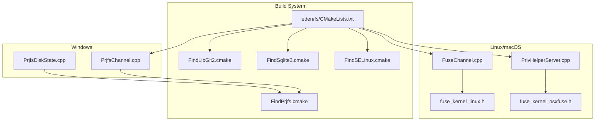
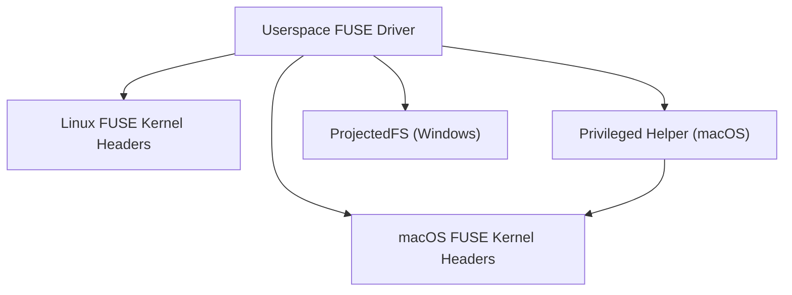
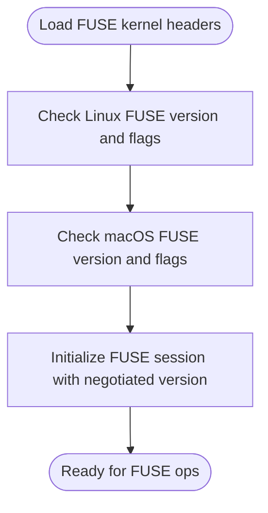
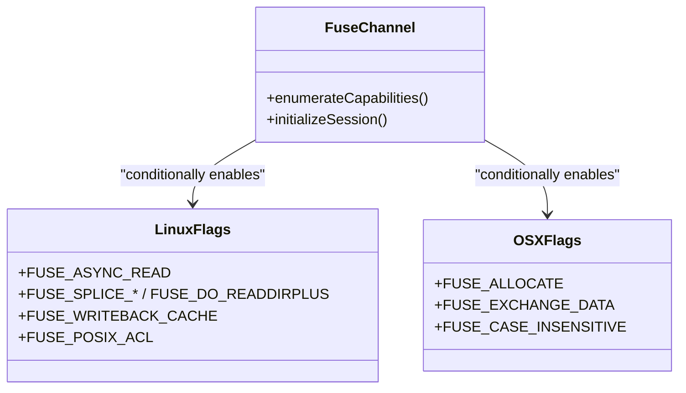
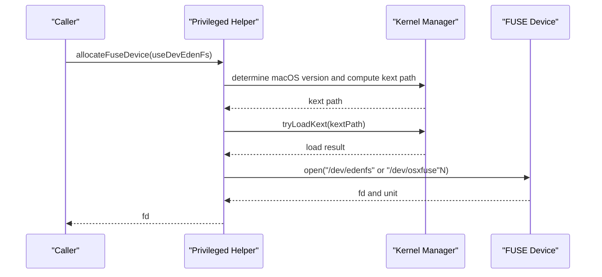
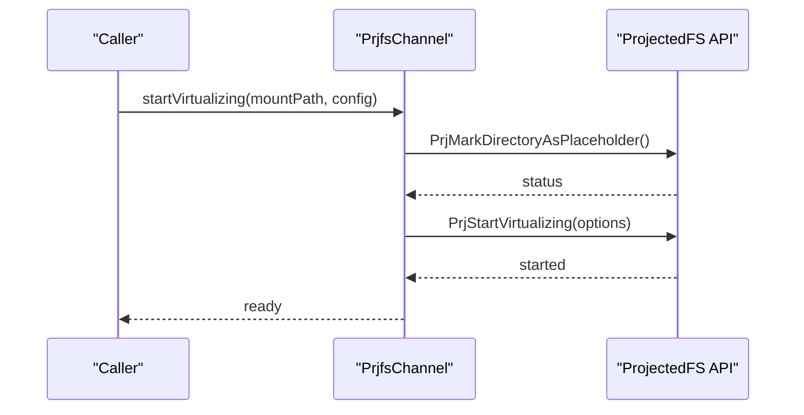
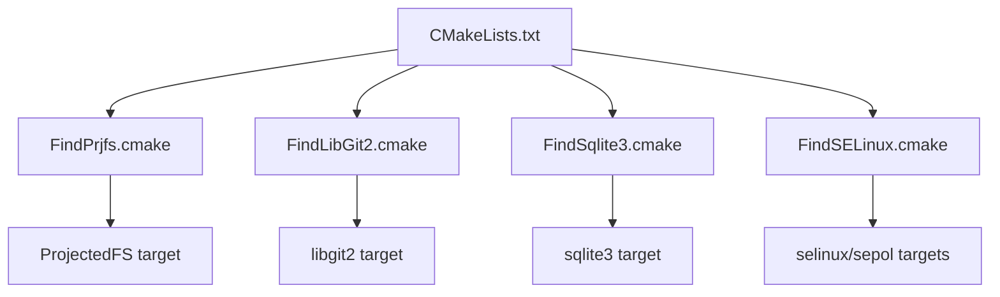
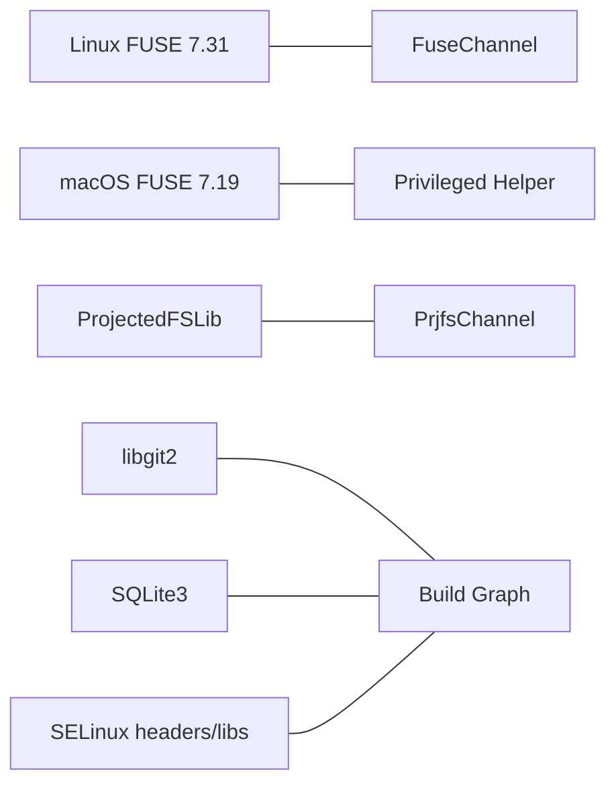

# Third-Party Library Integrations

<cite>
**Referenced Files in This Document**
- [fuse_kernel_linux.h](file://eden/fs/third-party/fuse_kernel_linux.h)
- [fuse_kernel_osxfuse.h](file://eden/fs/third-party/fuse_kernel_osxfuse.h)
- [FuseChannel.cpp](file://eden/fs/fuse/FuseChannel.cpp)
- [PrivHelperServer.cpp](file://eden/fs/privhelper/PrivHelperServer.cpp)
- [PrjfsChannel.cpp](file://eden/fs/prjfs/PrjfsChannel.cpp)
- [PrjfsDiskState.cpp](file://eden/fs/prjfs/PrjfsDiskState.cpp)
- [FindPrjfs.cmake](file://CMake/FindPrjfs.cmake)
- [FindLibGit2.cmake](file://CMake/FindLibGit2.cmake)
- [FindSqlite3.cmake](file://CMake/FindSqlite3.cmake)
- [FindSELinux.cmake](file://CMake/FindSELinux.cmake)
- [eden_fs_CMakeLists.txt](file://eden/fs/CMakeLists.txt)
</cite>

## Table of Contents
1. [Introduction](#introduction)
2. [Project Structure](#project-structure)
3. [Core Components](#core-components)
4. [Architecture Overview](#architecture-overview)
5. [Detailed Component Analysis](#detailed-component-analysis)
6. [Dependency Analysis](#dependency-analysis)
7. [Performance Considerations](#performance-considerations)
8. [Troubleshooting Guide](#troubleshooting-guide)
9. [Conclusion](#conclusion)

## Introduction
This document describes third-party library integrations and external dependencies used in native filesystem operations within the repository. It focuses on:
- FUSE kernel headers for Linux and OSXFUSE/macFUSE
- Platform-specific filesystem integrations (ProjectedFS on Windows)
- Build-time dependency discovery and linking
- Licensing considerations, version compatibility, and integration patterns
- Practical guidance for updates, compatibility testing, and maintenance

## Project Structure
The filesystem-related third-party integrations are primarily located under:
- eden/fs/third-party: FUSE kernel headers for Linux and macOS
- eden/fs/fuse: FUSE channel implementation and feature flags
- eden/fs/privhelper: macOS kernel extension loading and device allocation
- eden/fs/prjfs: Windows Projected File System (ProjectedFS) integration
- CMake/: CMake find-modules for third-party libraries

**Diagram sources**
- [fuse_kernel_linux.h:1-210](file://eden/fs/third-party/fuse_kernel_linux.h#L1-L210)
- [fuse_kernel_osxfuse.h:1-125](file://eden/fs/third-party/fuse_kernel_osxfuse.h#L1-L125)
- [FuseChannel.cpp:588-626](file://eden/fs/fuse/FuseChannel.cpp#L588-L626)
- [PrivHelperServer.cpp:120-255](file://eden/fs/privhelper/PrivHelperServer.cpp#L120-L255)
- [PrjfsChannel.cpp:1508-1606](file://eden/fs/prjfs/PrjfsChannel.cpp#L1508-L1606)
- [PrjfsDiskState.cpp:1-38](file://eden/fs/prjfs/PrjfsDiskState.cpp#L1-L38)
- [FindPrjfs.cmake:1-28](file://CMake/FindPrjfs.cmake#L1-L28)
- [FindLibGit2.cmake:1-20](file://CMake/FindLibGit2.cmake#L1-L20)
- [FindSqlite3.cmake:1-17](file://CMake/FindSqlite3.cmake#L1-L17)
- [FindSELinux.cmake:1-26](file://CMake/FindSELinux.cmake#L1-L26)
- [eden_fs_CMakeLists.txt:1-74](file://eden/fs/CMakeLists.txt#L1-L74)

**Section sources**
- [eden_fs_CMakeLists.txt:1-74](file://eden/fs/CMakeLists.txt#L1-L74)

## Core Components
- FUSE kernel headers:
  - Linux: Defines protocol version, flags, and wire structures for the Linux kernel FUSE interface.
  - macOS (OSXFUSE/macFUSE): Defines protocol version and platform-specific flags and structures.
- FUSE channel:
  - Uses compile-time feature flags to gate platform-specific capabilities and initializes the FUSE connection.
- Privileged helper (macOS):
  - Loads kernel extensions, allocates FUSE devices, and mounts the filesystem using either OSXFUSE or eden.fs.
- ProjectedFS (Windows):
  - Integrates with the Windows Projected File System APIs to expose virtualized content.
- Build-time discovery:
  - CMake find-modules locate and link against ProjectedFS, libgit2, SQLite3, and SELinux libraries.

**Section sources**
- [fuse_kernel_linux.h:202-210](file://eden/fs/third-party/fuse_kernel_linux.h#L202-L210)
- [fuse_kernel_osxfuse.h:118-125](file://eden/fs/third-party/fuse_kernel_osxfuse.h#L118-L125)
- [FuseChannel.cpp:588-626](file://eden/fs/fuse/FuseChannel.cpp#L588-L626)
- [PrivHelperServer.cpp:217-393](file://eden/fs/privhelper/PrivHelperServer.cpp#L217-L393)
- [PrjfsChannel.cpp:1508-1606](file://eden/fs/prjfs/PrjfsChannel.cpp#L1508-L1606)
- [FindPrjfs.cmake:1-28](file://CMake/FindPrjfs.cmake#L1-L28)
- [FindLibGit2.cmake:1-20](file://CMake/FindLibGit2.cmake#L1-L20)
- [FindSqlite3.cmake:1-17](file://CMake/FindSqlite3.cmake#L1-L17)
- [FindSELinux.cmake:1-26](file://CMake/FindSELinux.cmake#L1-L26)

## Architecture Overview
The filesystem stack integrates platform-native virtualization with a unified FUSE-based userspace driver on Linux/macOS and ProjectedFS on Windows. Build configuration locates and links required libraries.

**Diagram sources**
- [fuse_kernel_linux.h:177-210](file://eden/fs/third-party/fuse_kernel_linux.h#L177-L210)
- [fuse_kernel_osxfuse.h:88-125](file://eden/fs/third-party/fuse_kernel_osxfuse.h#L88-L125)
- [PrivHelperServer.cpp:217-393](file://eden/fs/privhelper/PrivHelperServer.cpp#L217-L393)
- [PrjfsChannel.cpp:1508-1606](file://eden/fs/prjfs/PrjfsChannel.cpp#L1508-L1606)

## Detailed Component Analysis

### FUSE Kernel Interfaces
- Linux FUSE protocol version and capability flags are defined in the Linux header. These drive feature availability and wire protocol behavior.
- macOS FUSE protocol version and platform-specific flags are defined in the OSXFUSE header. These differ from Linux and inform platform-specific behavior.

**Diagram sources**
- [fuse_kernel_linux.h:182-200](file://eden/fs/third-party/fuse_kernel_linux.h#L182-L200)
- [fuse_kernel_osxfuse.h:98-116](file://eden/fs/third-party/fuse_kernel_osxfuse.h#L98-L116)

**Section sources**
- [fuse_kernel_linux.h:182-200](file://eden/fs/third-party/fuse_kernel_linux.h#L182-L200)
- [fuse_kernel_osxfuse.h:98-116](file://eden/fs/third-party/fuse_kernel_osxfuse.h#L98-L116)

### FUSE Channel Feature Flags
- The FUSE channel enumerates capability flags and conditionally enables platform-specific features. This ensures the runtime only advertises and uses features supported by the current platform and kernel.

**Diagram sources**
- [FuseChannel.cpp:588-626](file://eden/fs/fuse/FuseChannel.cpp#L588-L626)

**Section sources**
- [FuseChannel.cpp:588-626](file://eden/fs/fuse/FuseChannel.cpp#L588-L626)

### Privileged Helper (macOS)
- Determines macOS version and selects appropriate kernel extension paths.
- Loads the eden.fs or OSXFUSE kernel extension and allocates a FUSE device (/dev/edenfs or /dev/osxfuse).
- Mounts the filesystem using either OSXFUSE or eden.fs, with platform-specific arguments and protocol handling.

**Diagram sources**
- [PrivHelperServer.cpp:120-255](file://eden/fs/privhelper/PrivHelperServer.cpp#L120-L255)

**Section sources**
- [PrivHelperServer.cpp:120-255](file://eden/fs/privhelper/PrivHelperServer.cpp#L120-L255)

### ProjectedFS (Windows)
- Initializes ProjectedFS with notification mappings and flags, marks the placeholder directory, and starts virtualization.
- Handles callbacks for file access, rename, delete, and other events, integrating with the broader filesystem layer.

**Diagram sources**
- [PrjfsChannel.cpp:1508-1606](file://eden/fs/prjfs/PrjfsChannel.cpp#L1508-L1606)

**Section sources**
- [PrjfsChannel.cpp:1508-1606](file://eden/fs/prjfs/PrjfsChannel.cpp#L1508-L1606)
- [PrjfsDiskState.cpp:1-38](file://eden/fs/prjfs/PrjfsDiskState.cpp#L1-L38)

### Build-Time Discovery and Linking
- ProjectedFS: CMake finds ProjectedFSLib headers and library and exposes a target for consumers.
- libgit2: Discovered via pkg-config and imported as an INTERFACE target alias.
- SQLite3: Found via standard find modules and marked advanced.
- SELinux: Header and libraries discovered and combined into a single target list.

**Diagram sources**
- [FindPrjfs.cmake:1-28](file://CMake/FindPrjfs.cmake#L1-L28)
- [FindLibGit2.cmake:1-20](file://CMake/FindLibGit2.cmake#L1-L20)
- [FindSqlite3.cmake:1-17](file://CMake/FindSqlite3.cmake#L1-L17)
- [FindSELinux.cmake:1-26](file://CMake/FindSELinux.cmake#L1-L26)
- [eden_fs_CMakeLists.txt:1-74](file://eden/fs/CMakeLists.txt#L1-L74)

**Section sources**
- [FindPrjfs.cmake:1-28](file://CMake/FindPrjfs.cmake#L1-L28)
- [FindLibGit2.cmake:1-20](file://CMake/FindLibGit2.cmake#L1-L20)
- [FindSqlite3.cmake:1-17](file://CMake/FindSqlite3.cmake#L1-L17)
- [FindSELinux.cmake:1-26](file://CMake/FindSELinux.cmake#L1-L26)
- [eden_fs_CMakeLists.txt:1-74](file://eden/fs/CMakeLists.txt#L1-L74)

## Dependency Analysis
- FUSE protocol compatibility:
  - Linux: Uses protocol version 7.31 as defined in the header.
  - macOS: Uses protocol version 7.19 as defined in the header.
  - The channel’s capability enumeration reflects platform differences.
- macOS kernel extension management:
  - Kernel extension paths are computed based on macOS version.
  - The helper loads eden.fs or OSXFUSE depending on configuration and availability.
- Windows ProjectedFS:
  - Uses ProjectedFSLib headers and library discovered by the find module.
  - Starts virtualization with notification mappings and flags configured at startup.
- Other libraries:
  - libgit2, SQLite3, and SELinux are discovered via CMake modules and linked into the build graph.

**Diagram sources**
- [fuse_kernel_linux.h:202-206](file://eden/fs/third-party/fuse_kernel_linux.h#L202-L206)
- [fuse_kernel_osxfuse.h:118-122](file://eden/fs/third-party/fuse_kernel_osxfuse.h#L118-L122)
- [FuseChannel.cpp:588-626](file://eden/fs/fuse/FuseChannel.cpp#L588-L626)
- [PrivHelperServer.cpp:120-146](file://eden/fs/privhelper/PrivHelperServer.cpp#L120-L146)
- [PrjfsChannel.cpp:1508-1606](file://eden/fs/prjfs/PrjfsChannel.cpp#L1508-L1606)
- [FindPrjfs.cmake:1-28](file://CMake/FindPrjfs.cmake#L1-L28)
- [FindLibGit2.cmake:1-20](file://CMake/FindLibGit2.cmake#L1-L20)
- [FindSqlite3.cmake:1-17](file://CMake/FindSqlite3.cmake#L1-L17)
- [FindSELinux.cmake:1-26](file://CMake/FindSELinux.cmake#L1-L26)

**Section sources**
- [fuse_kernel_linux.h:202-206](file://eden/fs/third-party/fuse_kernel_linux.h#L202-L206)
- [fuse_kernel_osxfuse.h:118-122](file://eden/fs/third-party/fuse_kernel_osxfuse.h#L118-L122)
- [FuseChannel.cpp:588-626](file://eden/fs/fuse/FuseChannel.cpp#L588-L626)
- [PrivHelperServer.cpp:120-146](file://eden/fs/privhelper/PrivHelperServer.cpp#L120-L146)
- [PrjfsChannel.cpp:1508-1606](file://eden/fs/prjfs/PrjfsChannel.cpp#L1508-L1606)
- [FindPrjfs.cmake:1-28](file://CMake/FindPrjfs.cmake#L1-L28)
- [FindLibGit2.cmake:1-20](file://CMake/FindLibGit2.cmake#L1-L20)
- [FindSqlite3.cmake:1-17](file://CMake/FindSqlite3.cmake#L1-L17)
- [FindSELinux.cmake:1-26](file://CMake/FindSELinux.cmake#L1-L26)

## Performance Considerations
- FUSE flags:
  - Linux flags such as FUSE_ASYNC_READ, FUSE_WRITEBACK_CACHE, and FUSE_DO_READDIRPLUS influence throughput and latency characteristics.
  - macOS flags such as FUSE_ALLOCATE and FUSE_CASE_INSENSITIVE impact file attribute handling and case behavior.
- Windows ProjectedFS:
  - Notification mappings and negative path caching flags affect responsiveness and cache hit rates.
- Device allocation and mounting:
  - Proper device allocation and mount timeouts are essential to avoid blocking and improve reliability.

[No sources needed since this section provides general guidance]

## Troubleshooting Guide
- macOS kernel extension loading:
  - Verify kernel extension paths and existence for eden.fs and OSXFUSE. Ensure the correct version path is selected based on macOS version.
  - Confirm that the privileged helper can load the kext and allocate a device; errors indicate missing kexts or permissions.
- Device allocation failures:
  - If all devices are busy or the kernel module is not loaded, the helper throws an error. Ensure the appropriate FUSE kernel extension is installed and loaded.
- Windows ProjectedFS:
  - Ensure ProjectedFSLib is discoverable and that the placeholder directory is marked correctly before starting virtualization.
  - Validate notification mappings and flags to prevent unexpected behavior.

**Section sources**
- [PrivHelperServer.cpp:120-255](file://eden/fs/privhelper/PrivHelperServer.cpp#L120-L255)
- [PrjfsChannel.cpp:1508-1606](file://eden/fs/prjfs/PrjfsChannel.cpp#L1508-L1606)

## Conclusion
The repository integrates platform-native filesystem virtualization through:
- FUSE kernel headers for Linux and macOS with version-specific flags
- A FUSE channel that conditionally enables platform capabilities
- A macOS privileged helper that manages kernel extensions and device allocation
- Windows ProjectedFS integration via ProjectedFSLib
- Robust CMake discovery modules for libgit2, SQLite3, SELinux, and ProjectedFS

Maintaining compatibility involves careful adherence to protocol versions, platform-specific flags, and build-time discovery. Regular updates should validate kernel extension availability on macOS, ProjectedFS presence on Windows, and library versions on all platforms.