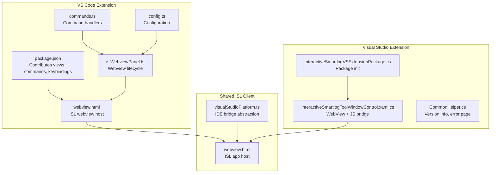
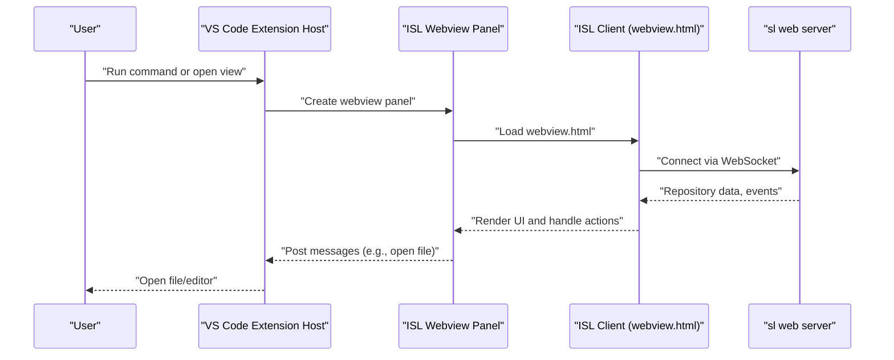
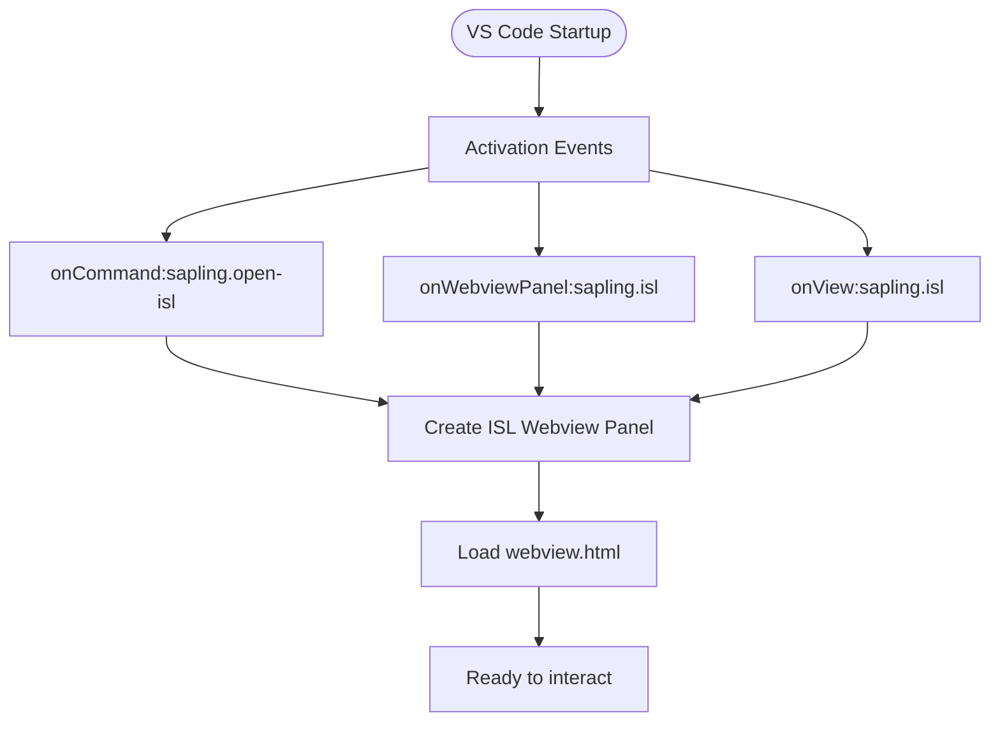
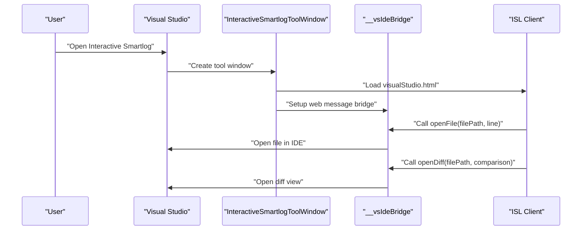
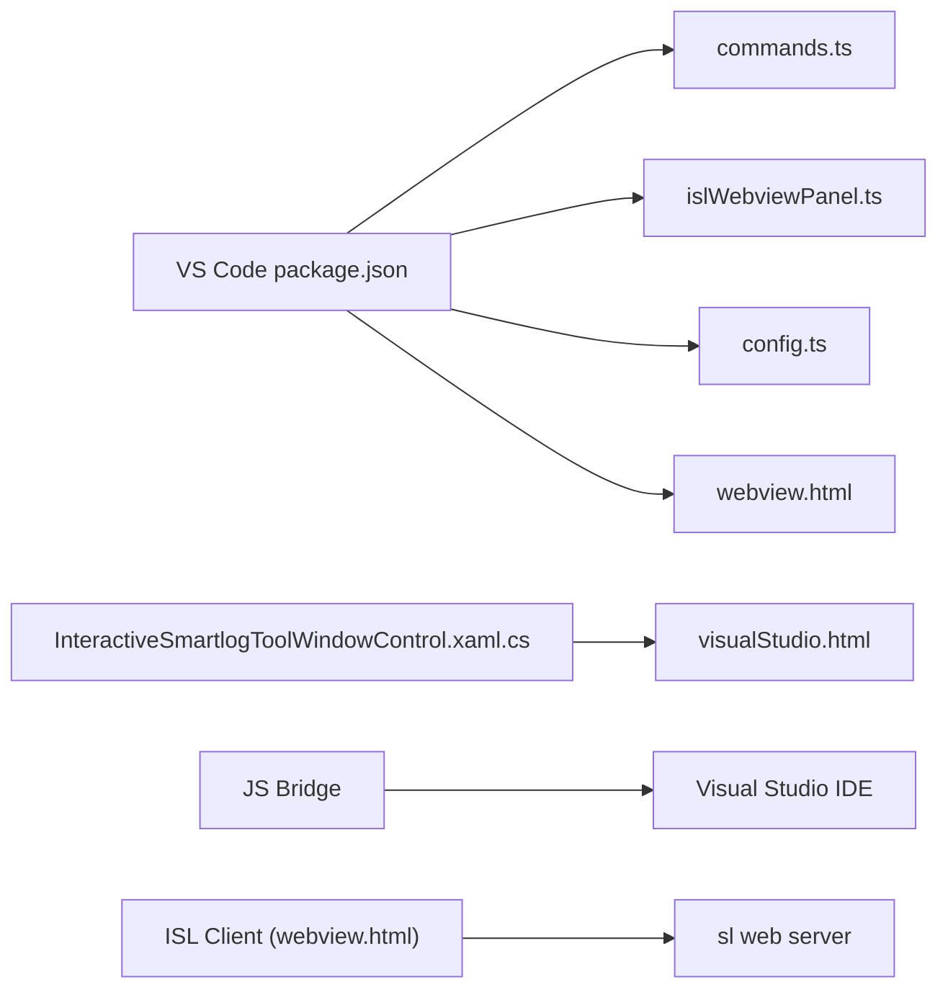

# IDE Integrations

<cite>
**Referenced Files in This Document**
- [README.md](file://README.md)
- [vscode/README.md](file://addons/vscode/README.md)
- [vs/README.md](file://addons/vs/README.md)
- [package.json](file://addons/vscode/package.json)
- [htmlForWebview.ts](file://addons/vscode/extension/htmlForWebview.ts)
- [extension.ts](file://addons/vscode/extension/extension.ts)
- [islWebviewPanel.ts](file://addons/vscode/extension/islWebviewPanel.ts)
- [commands.ts](file://addons/vscode/extension/commands.ts)
- [config.ts](file://addons/vscode/extension/config.ts)
- [InlineCommentPanelWebview.html](file://addons/vscode/InlineCommentPanelWebview.html)
- [DiffCommentPanelWebview.html](file://addons/vscode/extension/DiffCommentPanelWebview.html)
- [inlineCommentWebview.html](file://addons/vscode/inlineCommentWebview.html)
- [diffSignalWebview.html](file://addons/vscode/diffSignalWebview.html)
- [webview.html](file://addons/vscode/webview.html)
- [visualStudio.html](file://addons/isl/visualStudio.html)
- [visualStudioPlatform.ts](file://addons/isl/src/platform/visualStudioPlatform.ts)
- [InteractiveSmartlogToolWindowControl.xaml.cs](file://addons/vs/InteractiveSmartlogVSExtension/InteractiveSmartlogVSExtension/ToolWindows/InteractiveSmartlogToolWindowControl.xaml.cs)
- [InteractiveSmartlogVSExtensionPackage.cs](file://addons/vs/InteractiveSmartlogVSExtension/InteractiveSmartlogVSExtension/InteractiveSmartlogVSExtensionPackage.cs)
- [CommonHelper.cs](file://addons/vs/InteractiveSmartlogVSExtension/InteractiveSmartlogVSExtension/Helpers/CommonHelper.cs)
- [isl/README.md](file://addons/isl/README.md)
</cite>

## Table of Contents
1. [Introduction](#introduction)
2. [Project Structure](#project-structure)
3. [Core Components](#core-components)
4. [Architecture Overview](#architecture-overview)
5. [Detailed Component Analysis](#detailed-component-analysis)
6. [Dependency Analysis](#dependency-analysis)
7. [Performance Considerations](#performance-considerations)
8. [Troubleshooting Guide](#troubleshooting-guide)
9. [Conclusion](#conclusion)
10. [Appendices](#appendices)

## Introduction
This document explains the SAPLING SCM IDE integrations across VS Code and Visual Studio. It covers installation, setup, feature capabilities (webview panels, inline comments, blame integration, and command integration), configuration options, customization settings, and troubleshooting guidance. It also describes the underlying architecture enabling IDE integration, including webview communication and command execution, and provides examples of common workflows and best practices.

## Project Structure
The IDE integrations are implemented as two separate extensions:
- VS Code extension: Provides an Interactive Smartlog (ISL) webview, inline comments, blame integration, and a suite of commands and keybindings.
- Visual Studio extension: Embeds the ISL webview via a tool window and communicates with the IDE through a JavaScript bridge.

Key directories and files:
- VS Code extension: addons/vscode (manifest, webview HTML, extension entry, webview panel, commands, configuration)
- Visual Studio extension: addons/vs/InteractiveSmartlogVSExtension (C# tool window, bridge, package, helpers)
- Shared ISL client: addons/isl (webview HTML, platform abstraction for IDEs)

**Diagram sources**
- [package.json:37-306](file://addons/vscode/package.json#L37-L306)
- [webview.html](file://addons/vscode/webview.html)
- [commands.ts](file://addons/vscode/extension/commands.ts)
- [config.ts](file://addons/vscode/extension/config.ts)
- [islWebviewPanel.ts](file://addons/vscode/extension/islWebviewPanel.ts)
- [webview.html](file://addons/isl/webview.html)
- [visualStudioPlatform.ts:37-74](file://addons/isl/src/platform/visualStudioPlatform.ts#L37-L74)
- [InteractiveSmartlogVSExtensionPackage.cs:54-72](file://addons/vs/InteractiveSmartlogVSExtension/InteractiveSmartlogVSExtension/InteractiveSmartlogVSExtensionPackage.cs#L54-L72)
- [InteractiveSmartlogToolWindowControl.xaml.cs:300-389](file://addons/vs/InteractiveSmartlogVSExtension/InteractiveSmartlogVSExtension/ToolWindows/InteractiveSmartlogToolWindowControl.xaml.cs#L300-L389)
- [CommonHelper.cs:84-152](file://addons/vs/InteractiveSmartlogVSExtension/InteractiveSmartlogVSExtension/Helpers/CommonHelper.cs#L84-L152)

**Section sources**
- [vscode/README.md:1-16](file://addons/vscode/README.md#L1-L16)
- [vs/README.md:1-16](file://addons/vs/README.md#L1-L16)
- [package.json:1-342](file://addons/vscode/package.json#L1-L342)
- [isl/README.md:14-23](file://addons/isl/README.md#L14-L23)

## Core Components
- VS Code extension
  - Manifest contributes:
    - Views: ISL webview panel, Code Review Comments side panel
    - Commands: Open ISL, open diffs, open comparisons, revert file, toggle inline comments, focus sidebar
    - Keybindings: Global shortcuts for ISL and comparison views; alt-shift-G for comments
    - Configuration: Command path, inline blame, diff comments, diff view mode, conflict resolution behavior, comparison panel mode, ISL placement and editor title button visibility
  - Webview hosting and options: Script-enabled, retains context, local resource roots, port mapping for dev
  - Webview HTML assets: ISL, inline comments, diff comment panels, diff signal, and generic webview host
- Visual Studio extension
  - Tool window hosting the ISL webview
  - JavaScript bridge exposing functions to open files and diffs, show/log messages
  - Package initialization and options for diff tool integration
  - Helpers for IDE and extension version detection, error page rendering

**Section sources**
- [package.json:37-306](file://addons/vscode/package.json#L37-L306)
- [htmlForWebview.ts:14-28](file://addons/vscode/extension/htmlForWebview.ts#L14-L28)
- [InlineCommentPanelWebview.html](file://addons/vscode/InlineCommentPanelWebview.html)
- [DiffCommentPanelWebview.html](file://addons/vscode/extension/DiffCommentPanelWebview.html)
- [inlineCommentWebview.html](file://addons/vscode/inlineCommentWebview.html)
- [diffSignalWebview.html](file://addons/vscode/diffSignalWebview.html)
- [webview.html](file://addons/vscode/webview.html)
- [visualStudio.html](file://addons/isl/visualStudio.html)
- [visualStudioPlatform.ts:37-74](file://addons/isl/src/platform/visualStudioPlatform.ts#L37-L74)
- [InteractiveSmartlogToolWindowControl.xaml.cs:300-389](file://addons/vs/InteractiveSmartlogVSExtension/InteractiveSmartlogVSExtension/ToolWindows/InteractiveSmartlogToolWindowControl.xaml.cs#L300-L389)
- [InteractiveSmartlogVSExtensionPackage.cs:54-72](file://addons/vs/InteractiveSmartlogVSExtension/InteractiveSmartlogVSExtension/InteractiveSmartlogVSExtensionPackage.cs#L54-L72)
- [CommonHelper.cs:84-152](file://addons/vs/InteractiveSmartlogVSExtension/InteractiveSmartlogVSExtension/Helpers/CommonHelper.cs#L84-L152)

## Architecture Overview
The integrations share a common ISL client that runs in a browser-like context. The VS Code extension embeds the ISL webview directly, while the Visual Studio extension hosts it in a tool window and bridges messages to the IDE.

**Diagram sources**
- [package.json:14-19](file://addons/vscode/package.json#L14-L19)
- [webview.html](file://addons/vscode/webview.html)
- [webview.html](file://addons/isl/webview.html)
- [htmlForWebview.ts:14-28](file://addons/vscode/extension/htmlForWebview.ts#L14-L28)

## Detailed Component Analysis

### VS Code Extension
- Installation and setup
  - Install the extension from the marketplace; ensure the Sapling CLI is installed separately.
  - Launch ISL via command palette or keybinding; the extension activates on startup and on specific commands/webviews.
- Webview panels
  - ISL webview panel: configurable placement (sidebar or beside), editor title button support, and focus command.
  - Code Review Comments panel: toggled via commands and keybindings when enabled.
- Inline comments and blame
  - Inline blame can be enabled/disabled; inline comments panel can be opened/toggled.
  - Diff view mode supports Unified or Split layouts.
- Commands and keybindings
  - Commands include opening ISL, diffs, comparisons, reverting files, and managing comments.
  - Keybindings are provided for ISL, comparison views, and comments.
- Configuration
  - Command path override, inline blame visibility, diff comments visibility, diff view mode, conflict resolution behavior, comparison panel mode, and ISL placement/editor title button visibility.

**Diagram sources**
- [package.json:14-19](file://addons/vscode/package.json#L14-L19)
- [webview.html](file://addons/vscode/webview.html)

**Section sources**
- [vscode/README.md:1-16](file://addons/vscode/README.md#L1-L16)
- [package.json:37-306](file://addons/vscode/package.json#L37-L306)
- [htmlForWebview.ts:14-28](file://addons/vscode/extension/htmlForWebview.ts#L14-L28)
- [webview.html](file://addons/vscode/webview.html)

### Visual Studio Extension
- Installation and setup
  - Install the extension from the marketplace; ensure the Sapling CLI is installed.
  - Access ISL via View > Other Windows > Interactive Smartlog or via Ctrl+Shift+I.
- Webview hosting and bridge
  - The tool window loads an HTML document containing the ISL app.
  - A JavaScript bridge exposes functions to open files/diffs and log/show messages.
  - The bridge receives messages from the webview and invokes IDE actions.
- Platform abstraction
  - The ISL client defines a platform interface; the Visual Studio platform uses the bridge to integrate with the IDE.

**Diagram sources**
- [vs/README.md:1-16](file://addons/vs/README.md#L1-L16)
- [visualStudio.html](file://addons/isl/visualStudio.html)
- [InteractiveSmartlogToolWindowControl.xaml.cs:300-389](file://addons/vs/InteractiveSmartlogVSExtension/InteractiveSmartlogVSExtension/ToolWindows/InteractiveSmartlogToolWindowControl.xaml.cs#L300-L389)
- [visualStudioPlatform.ts:37-74](file://addons/isl/src/platform/visualStudioPlatform.ts#L37-L74)

**Section sources**
- [vs/README.md:1-16](file://addons/vs/README.md#L1-L16)
- [InteractiveSmartlogToolWindowControl.xaml.cs:300-389](file://addons/vs/InteractiveSmartlogVSExtension/InteractiveSmartlogVSExtension/ToolWindows/InteractiveSmartlogToolWindowControl.xaml.cs#L300-L389)
- [visualStudioPlatform.ts:37-74](file://addons/isl/src/platform/visualStudioPlatform.ts#L37-L74)

### Configuration Options and Customization
- VS Code
  - sapling.commandPath: Override the path to the Sapling CLI executable.
  - sapling.showInlineBlame: Toggle inline blame in editors.
  - sapling.showDiffComments: Toggle the inline comments panel.
  - sapling.inlineCommentDiffViewMode: Choose Unified or Split diff view mode.
  - sapling.markConflictingFilesResolvedOnSave: Automatically mark merge conflicts resolved on save.
  - sapling.comparisonPanelMode: Auto or Always Separate Panel for comparison views.
  - sapling.isl.openBeside: Open ISL beside the current editor.
  - sapling.isl.showInSidebar: Show ISL in the sidebar.
  - sapling.isl.showOpenOrFocusButtonOnEditorTitle: Show an ISL button in the editor title bar.
- Visual Studio
  - Options page integrates with the IDE’s settings; supports choosing a diff tool and custom arguments.

**Section sources**
- [package.json:38-98](file://addons/vscode/package.json#L38-L98)
- [InteractiveSmartlogVSExtensionPackage.cs:54-72](file://addons/vs/InteractiveSmartlogVSExtension/InteractiveSmartlogVSExtension/InteractiveSmartlogVSExtensionPackage.cs#L54-L72)

### Command Integration
- VS Code
  - Commands include opening ISL, opening diffs/head/stack comparisons, reverting files, opening/copying remote links, toggling inline comments, and focusing the ISL sidebar.
  - Menus and SCM context menus integrate these commands into the editor and source control views.
- Visual Studio
  - Commands are exposed via the tool window and IDE menu; the bridge forwards actions to the IDE.

**Section sources**
- [package.json:140-219](file://addons/vscode/package.json#L140-L219)
- [package.json:252-305](file://addons/vscode/package.json#L252-L305)

### Webview Communication
- VS Code
  - Webview options enable scripts and restrict content to extension resources; port mapping supports development.
  - The webview loads the ISL app and communicates with the sl web server.
- Visual Studio
  - The tool window sets up a JavaScript bridge to send/receive messages from the webview.
  - Messages include openFile, openDiff, showMessage, and logMessage.

**Section sources**
- [htmlForWebview.ts:14-28](file://addons/vscode/extension/htmlForWebview.ts#L14-L28)
- [webview.html](file://addons/isl/webview.html)
- [InteractiveSmartlogToolWindowControl.xaml.cs:300-389](file://addons/vs/InteractiveSmartlogVSExtension/InteractiveSmartlogVSExtension/ToolWindows/InteractiveSmartlogToolWindowControl.xaml.cs#L300-L389)

## Dependency Analysis
- VS Code extension depends on:
  - Manifest contributions for views, commands, keybindings, and configuration
  - Webview hosting utilities and HTML assets
  - Commands and configuration modules
- Visual Studio extension depends on:
  - Tool window infrastructure and WebView2
  - Platform abstraction for IDE integration
  - Package initialization and options page

**Diagram sources**
- [package.json:37-306](file://addons/vscode/package.json#L37-L306)
- [commands.ts](file://addons/vscode/extension/commands.ts)
- [islWebviewPanel.ts](file://addons/vscode/extension/islWebviewPanel.ts)
- [config.ts](file://addons/vscode/extension/config.ts)
- [webview.html](file://addons/vscode/webview.html)
- [webview.html](file://addons/isl/webview.html)
- [InteractiveSmartlogToolWindowControl.xaml.cs:300-389](file://addons/vs/InteractiveSmartlogVSExtension/InteractiveSmartlogVSExtension/ToolWindows/InteractiveSmartlogToolWindowControl.xaml.cs#L300-L389)
- [visualStudio.html](file://addons/isl/visualStudio.html)

**Section sources**
- [package.json:37-306](file://addons/vscode/package.json#L37-L306)
- [webview.html](file://addons/isl/webview.html)

## Performance Considerations
- Keep the webview panel hidden when not in use to reduce overhead.
- Prefer Unified diff view mode for smaller payloads when reviewing changes.
- Limit frequent re-initialization of the webview; reuse panels where possible.
- Use the sidebar placement option to avoid splitting the editor unnecessarily.

## Troubleshooting Guide
- VS Code
  - Ensure the Sapling CLI is installed and accessible; configure sapling.commandPath if needed.
  - If the ISL panel does not appear, check activation events and configuration for sidebar/editor title button visibility.
  - For inline comments, verify that the comments panel is enabled and that the keybinding is not shadowed by another active panel.
- Visual Studio
  - Verify the extension is installed and the tool window opens; check the IDE version and extension version via helpers.
  - If messages are not received, confirm the JavaScript bridge is initialized and the webview is loaded with the correct HTML.
  - For errors, use the error page rendering helper to surface actionable messages.

**Section sources**
- [vscode/README.md:14-16](file://addons/vscode/README.md#L14-L16)
- [vs/README.md:14-16](file://addons/vs/README.md#L14-L16)
- [CommonHelper.cs:84-152](file://addons/vs/InteractiveSmartlogVSExtension/InteractiveSmartlogVSExtension/Helpers/CommonHelper.cs#L84-L152)

## Conclusion
The SAPLING SCM IDE integrations provide a cohesive, web-based ISL experience in both VS Code and Visual Studio. They leverage shared client code, consistent configuration, and robust command/keybinding systems. By understanding the architecture and configuration options, developers can optimize their workflows and troubleshoot effectively.

## Appendices
- Example workflows
  - Open ISL from the command palette or keybinding, navigate commits, and open files directly from the webview.
  - Toggle inline comments to collaborate on code review; use comparison views to inspect changes against head or stack.
  - Configure sidebar placement and editor title button to streamline access.
- Best practices
  - Keep the Sapling CLI updated and configured via sapling.commandPath.
  - Use the sidebar for persistent access and editor title button for quick focus.
  - Enable inline blame and comments to improve code visibility and collaboration.