# Command Registration and Handlers

<cite>
**Referenced Files in This Document**
- [commands.ts](file://addons/vscode/extension/commands.ts)
- [extension.ts](file://addons/vscode/extension/extension.ts)
- [package.json](file://addons/vscode/package.json)
- [config.ts](file://addons/vscode/extension/config.ts)
- [islWebviewPanel.ts](file://addons/vscode/extension/islWebviewPanel.ts)
- [vscodePlatform.ts](file://addons/vscode/extension/vscodePlatform.ts)
- [VSCodeRepo.ts](file://addons/vscode/extension/VSCodeRepo.ts)
- [api.ts](file://addons/vscode/extension/api/api.ts)
- [types.ts](file://addons/vscode/extension/api/types.ts)
- [Internal.ts](file://addons/vscode/extension/Internal.ts)
- [commands.test.ts](file://addons/vscode/extension/__tests__/commands.test.ts)
</cite>

## Table of Contents
1. [Introduction](#introduction)
2. [Project Structure](#project-structure)
3. [Core Components](#core-components)
4. [Architecture Overview](#architecture-overview)
5. [Detailed Component Analysis](#detailed-component-analysis)
6. [Dependency Analysis](#dependency-analysis)
7. [Performance Considerations](#performance-considerations)
8. [Troubleshooting Guide](#troubleshooting-guide)
9. [Conclusion](#conclusion)
10. [Appendices](#appendices)

## Introduction
This document explains the VS Code extension’s command system, covering how commands are registered, how handlers are implemented, and how they integrate with SAPLING CLI commands. It details the command lifecycle, parameter handling, error management, the extension API, public command interfaces, and integration with VS Code’s command palette. It also provides examples for creating custom commands, handling asynchronous operations, implementing validation, optimizing performance, providing user feedback, and debugging command-related issues.

## Project Structure
The command system spans several files:
- Command definitions and registration live in the commands module.
- Extension activation wires up repositories, providers, and registers commands.
- Package contributions declare commands, menus, keybindings, and command palette entries.
- Configuration controls runtime behavior like CLI path and UI preferences.
- Platform integration bridges webview messages to VS Code commands.
- API exposes repository operations to other extensions.

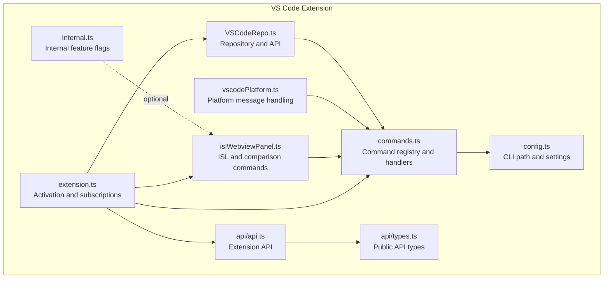

**Diagram sources**
- [extension.ts:31-109](file://addons/vscode/extension/extension.ts#L31-L109)
- [commands.ts:149-164](file://addons/vscode/extension/commands.ts#L149-L164)
- [config.ts:18-29](file://addons/vscode/extension/config.ts#L18-L29)
- [islWebviewPanel.ts:217-369](file://addons/vscode/extension/islWebviewPanel.ts#L217-L369)
- [vscodePlatform.ts:50-448](file://addons/vscode/extension/vscodePlatform.ts#L50-L448)
- [VSCodeRepo.ts:47-171](file://addons/vscode/extension/VSCodeRepo.ts#L47-L171)
- [api.ts:15-37](file://addons/vscode/extension/api/api.ts#L15-L37)
- [types.ts:31-47](file://addons/vscode/extension/api/types.ts#L31-L47)
- [Internal.ts:27-29](file://addons/vscode/extension/Internal.ts#L27-L29)

**Section sources**
- [extension.ts:31-109](file://addons/vscode/extension/extension.ts#L31-L109)
- [package.json:14-306](file://addons/vscode/package.json#L14-L306)

## Core Components
- Command registry and handlers: Defines VS Code commands and wraps handlers to accept URIs, ResourceState, or programmatic invocations.
- Command registration: Registers commands with VS Code and wraps them in a tracker for error reporting.
- Programmatic command execution: Type-safe wrapper around VS Code command execution.
- SAPLING CLI integration: Resolves CLI path from configuration and passes it to repository contexts.
- ISL and comparison commands: Open ISL webviews and comparison panels with typed parameters.
- Extension API: Exposes repository operations and UI state to other extensions.

**Section sources**
- [commands.ts:36-164](file://addons/vscode/extension/commands.ts#L36-L164)
- [commands.ts:123-129](file://addons/vscode/extension/commands.ts#L123-L129)
- [config.ts:18-29](file://addons/vscode/extension/config.ts#L18-L29)
- [islWebviewPanel.ts:217-369](file://addons/vscode/extension/islWebviewPanel.ts#L217-L369)
- [api.ts:15-37](file://addons/vscode/extension/api/api.ts#L15-L37)

## Architecture Overview
The command system follows a layered pattern:
- Activation creates a RepositoryContext with CLI command and logger.
- Commands are registered with VS Code and wrapped in a tracker.
- Handlers resolve the repository from the file path and delegate to repository operations or VS Code APIs.
- ISL and comparison commands create or focus webviews and pass typed parameters.
- Platform message handling translates webview actions into VS Code commands.

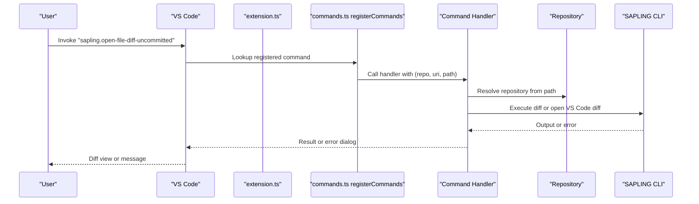

**Diagram sources**
- [extension.ts:95](file://addons/vscode/extension/extension.ts#L95)
- [commands.ts:149-164](file://addons/vscode/extension/commands.ts#L149-L164)
- [commands.ts:173-202](file://addons/vscode/extension/commands.ts#L173-L202)
- [config.ts:18-24](file://addons/vscode/extension/config.ts#L18-L24)

## Detailed Component Analysis

### Command Registry and Handlers
- Command definitions: Centralized in a record keyed by command identifiers. Handlers accept either a URI, ResourceState, or are invoked programmatically.
- Parameter normalization: A wrapper resolves the active file, URI, or ResourceState into a consistent shape and extracts the repository and repo-relative path.
- Error handling: Handlers surface meaningful errors via VS Code dialogs and guard against missing repositories or active editors.
- Diff view opening: Handlers compute left/right URIs and delegate to VS Code’s diff command with optional side-by-side view configuration.

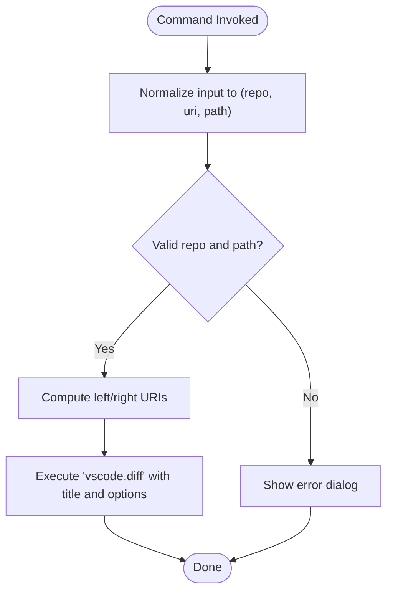

**Diagram sources**
- [commands.ts:265-297](file://addons/vscode/extension/commands.ts#L265-L297)
- [commands.ts:173-202](file://addons/vscode/extension/commands.ts#L173-L202)

**Section sources**
- [commands.ts:36-72](file://addons/vscode/extension/commands.ts#L36-L72)
- [commands.ts:265-297](file://addons/vscode/extension/commands.ts#L265-L297)
- [commands.ts:173-202](file://addons/vscode/extension/commands.ts#L173-L202)

### Command Registration and Lifecycle
- Registration: The extension registers commands by iterating the command map and wrapping each handler in a tracker that logs successes and failures.
- Lifecycle: Disposables returned by registration are added to the extension context, ensuring cleanup on deactivation.
- Tracker integration: Errors are captured and reported through the extension tracker.

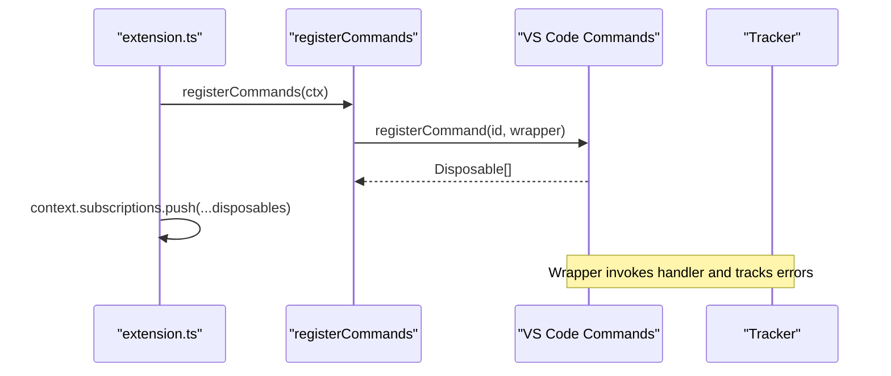

**Diagram sources**
- [extension.ts:95](file://addons/vscode/extension/extension.ts#L95)
- [commands.ts:149-164](file://addons/vscode/extension/commands.ts#L149-L164)

**Section sources**
- [extension.ts:95](file://addons/vscode/extension/extension.ts#L95)
- [commands.ts:149-164](file://addons/vscode/extension/commands.ts#L149-L164)

### Programmatic Command Execution
- Type-safe wrapper: A generic function executes VS Code commands with strong typing for both command ID and arguments.
- External command typing: An interface aggregates built-in and third-party VS Code commands to ensure type safety across the extension.

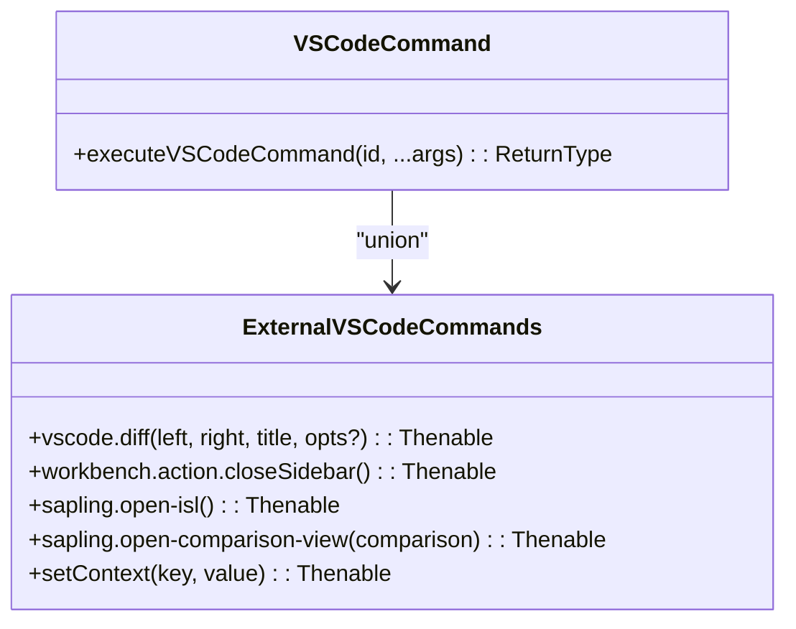

**Diagram sources**
- [commands.ts:123-129](file://addons/vscode/extension/commands.ts#L123-L129)
- [commands.ts:79-113](file://addons/vscode/extension/commands.ts#L79-L113)

**Section sources**
- [commands.ts:123-129](file://addons/vscode/extension/commands.ts#L123-L129)
- [commands.ts:79-113](file://addons/vscode/extension/commands.ts#L79-L113)

### SAPLING CLI Integration
- CLI resolution: The CLI command is resolved from configuration, defaulting to platform-specific values.
- Context propagation: The resolved CLI command is included in the RepositoryContext passed to all command handlers.
- Repository operations: Handlers use repository instances to run queued operations and diff generation.

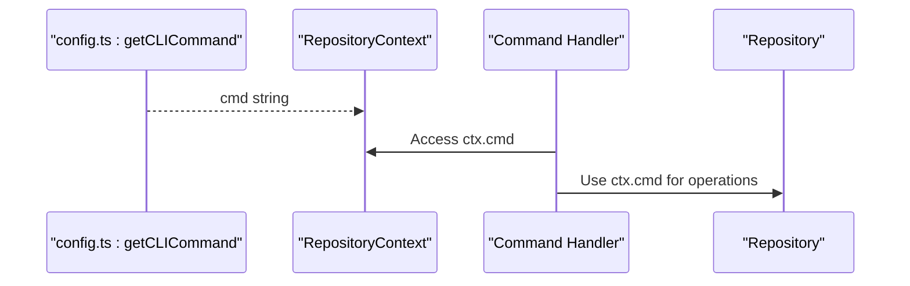

**Diagram sources**
- [config.ts:18-24](file://addons/vscode/extension/config.ts#L18-L24)
- [extension.ts:43-48](file://addons/vscode/extension/extension.ts#L43-L48)
- [commands.ts:131-147](file://addons/vscode/extension/commands.ts#L131-L147)

**Section sources**
- [config.ts:18-24](file://addons/vscode/extension/config.ts#L18-L24)
- [extension.ts:43-48](file://addons/vscode/extension/extension.ts#L43-L48)
- [commands.ts:131-147](file://addons/vscode/extension/commands.ts#L131-L147)

### ISL and Comparison Commands
- ISL commands: Open or focus the ISL webview or sidebar, optionally passing commit message updates.
- Comparison commands: Open comparison webviews for uncommitted/head/stack changes or a provided comparison object.
- Webview lifecycle: Handles orphaned windows, serialization/deserialization, and ready signaling.

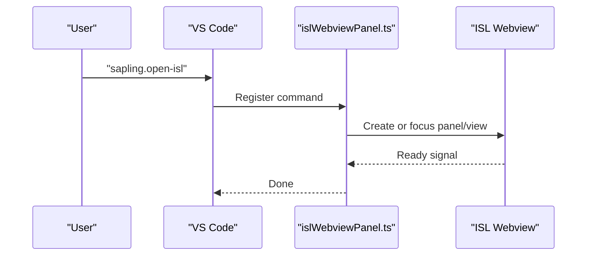

**Diagram sources**
- [islWebviewPanel.ts:217-369](file://addons/vscode/extension/islWebviewPanel.ts#L217-L369)

**Section sources**
- [islWebviewPanel.ts:217-369](file://addons/vscode/extension/islWebviewPanel.ts#L217-L369)

### Extension API and Public Interfaces
- Public API: Exposes repository operations, change observation, and UI state manipulation to other extensions.
- Repository operations: Methods for running read-only commands, retrieving commit info, diffs, and uncommitted changes.
- Context exposure: Enables changing the active repository displayed in the ISL webview.

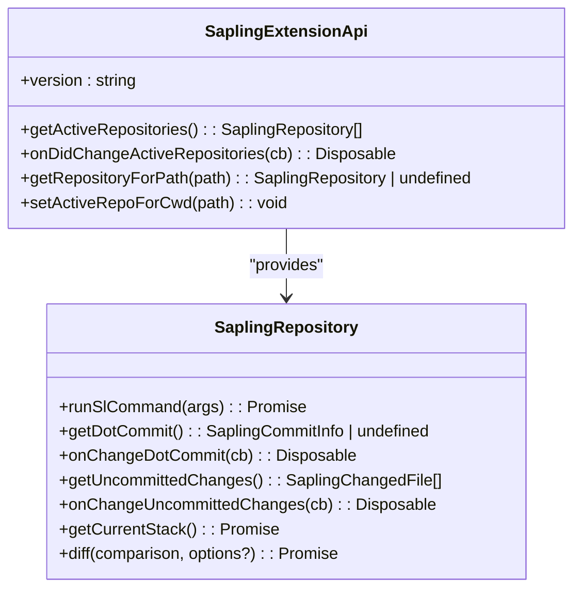

**Diagram sources**
- [api.ts:15-37](file://addons/vscode/extension/api/api.ts#L15-L37)
- [types.ts:31-148](file://addons/vscode/extension/api/types.ts#L31-L148)

**Section sources**
- [api.ts:15-37](file://addons/vscode/extension/api/api.ts#L15-L37)
- [types.ts:31-148](file://addons/vscode/extension/api/types.ts#L31-L148)

### Command Palette and Menus
- Contributions: Commands, menus, keybindings, and command palette entries are declared in package.json.
- Categories and icons: Commands are grouped and labeled for discoverability.
- Enabling conditions: Menus and commands can be conditionally enabled based on repository state or configuration.

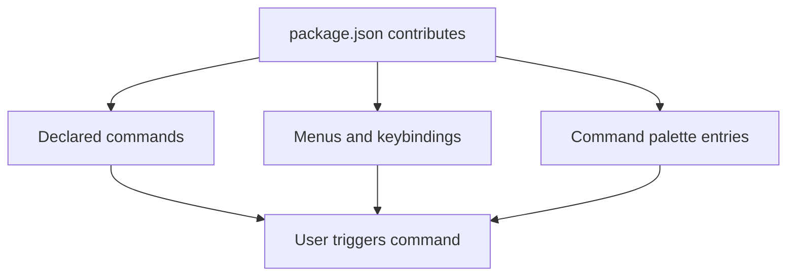

**Diagram sources**
- [package.json:140-305](file://addons/vscode/package.json#L140-L305)

**Section sources**
- [package.json:140-305](file://addons/vscode/package.json#L140-L305)

### Command Validation and Error Management
- Validation: Handlers validate presence of active editor, repository existence, and valid selections.
- Error surfacing: Errors are shown via VS Code dialogs; tracker captures structured errors for analytics.
- Async handling: Diff computation and webview creation are asynchronous; handlers await promises and propagate errors.

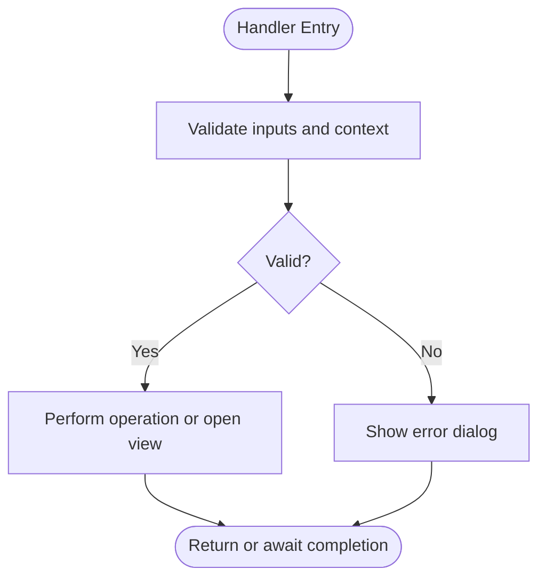

**Diagram sources**
- [commands.ts:265-297](file://addons/vscode/extension/commands.ts#L265-L297)
- [commands.ts:173-202](file://addons/vscode/extension/commands.ts#L173-L202)

**Section sources**
- [commands.ts:265-297](file://addons/vscode/extension/commands.ts#L265-L297)
- [commands.ts:173-202](file://addons/vscode/extension/commands.ts#L173-L202)

## Dependency Analysis
- Coupling: Commands depend on configuration, repository cache, and VS Code APIs. ISL commands depend on webview lifecycle utilities.
- Cohesion: Each module encapsulates a responsibility—registration, handlers, API, or platform integration.
- External dependencies: VS Code APIs, SAPLING CLI, and optional internal features.

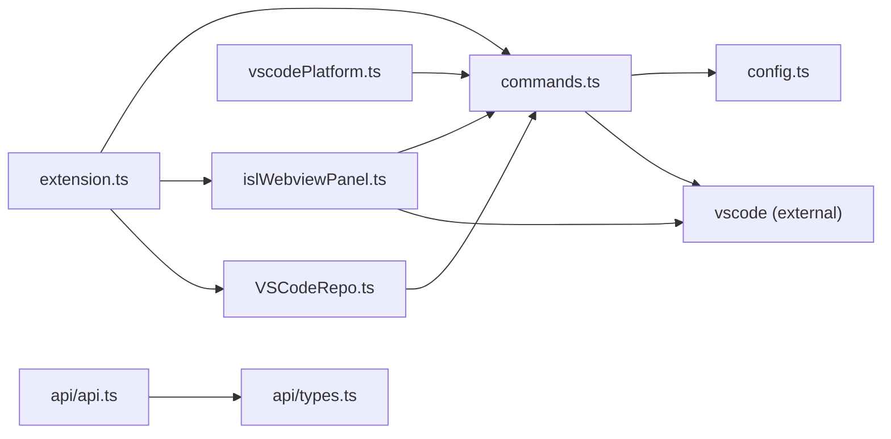

**Diagram sources**
- [commands.ts:15-31](file://addons/vscode/extension/commands.ts#L15-L31)
- [config.ts:8-29](file://addons/vscode/extension/config.ts#L8-L29)
- [islWebviewPanel.ts:24-35](file://addons/vscode/extension/islWebviewPanel.ts#L24-L35)
- [vscodePlatform.ts:25-29](file://addons/vscode/extension/vscodePlatform.ts#L25-L29)
- [VSCodeRepo.ts:26-43](file://addons/vscode/extension/VSCodeRepo.ts#L26-L43)
- [extension.ts:17-29](file://addons/vscode/extension/extension.ts#L17-L29)
- [api.ts:8-11](file://addons/vscode/extension/api/api.ts#L8-L11)
- [types.ts:17](file://addons/vscode/extension/api/types.ts#L17)

**Section sources**
- [commands.ts:15-31](file://addons/vscode/extension/commands.ts#L15-L31)
- [config.ts:8-29](file://addons/vscode/extension/config.ts#L8-L29)
- [islWebviewPanel.ts:24-35](file://addons/vscode/extension/islWebviewPanel.ts#L24-L35)
- [vscodePlatform.ts:25-29](file://addons/vscode/extension/vscodePlatform.ts#L25-L29)
- [VSCodeRepo.ts:26-43](file://addons/vscode/extension/VSCodeRepo.ts#L26-L43)
- [extension.ts:17-29](file://addons/vscode/extension/extension.ts#L17-L29)
- [api.ts:8-11](file://addons/vscode/extension/api/api.ts#L8-L11)
- [types.ts:17](file://addons/vscode/extension/api/types.ts#L17)

## Performance Considerations
- Defer heavy initialization: The extension defers non-essential features to reduce first-load latency.
- Queue operations: Repository operations are queued and tracked to avoid blocking the UI and to provide progress.
- Minimize filesystem checks: Diff view logic avoids unnecessary file existence checks by leveraging repository state.
- Webview reuse: ISL webviews are reused when possible to reduce overhead.

[No sources needed since this section provides general guidance]

## Troubleshooting Guide
- No active file found: Occurs when invoking commands from the palette without an active editor; ensure an editor is open.
- No repository found: Triggered when the file path is outside any known repository; ensure the workspace includes the repository root.
- Remote link unsupported: Happens when the code review provider does not expose remote URLs; verify provider configuration.
- Diff view errors: Errors opening diff views often relate to missing files or invalid revisions; confirm file existence and revision validity.
- Command palette not showing: Verify command contributions and activation events in package.json.

**Section sources**
- [commands.ts:282-291](file://addons/vscode/extension/commands.ts#L282-L291)
- [commands.ts:220-229](file://addons/vscode/extension/commands.ts#L220-L229)
- [package.json:14-19](file://addons/vscode/package.json#L14-L19)

## Conclusion
The VS Code extension’s command system is modular, type-safe, and robust. It integrates SAPLING CLI commands through a centralized context, supports programmatic invocation, and provides clear user feedback. The registration and lifecycle management ensure reliable operation, while the extension API enables interoperability with other extensions. Following the patterns documented here will help you create custom commands, handle asynchronous operations, implement validation, optimize performance, and debug issues effectively.

[No sources needed since this section summarizes without analyzing specific files]

## Appendices

### Creating Custom Commands
- Define a handler that accepts normalized parameters (repo, uri, path).
- Register the command using the registry and wrap with the tracker.
- Use the programmatic command executor for cross-command invocations.
- Add contributions in package.json for menus, keybindings, and command palette entries.

**Section sources**
- [commands.ts:149-164](file://addons/vscode/extension/commands.ts#L149-L164)
- [commands.ts:123-129](file://addons/vscode/extension/commands.ts#L123-L129)
- [package.json:140-305](file://addons/vscode/package.json#L140-L305)

### Handling Asynchronous Operations
- Await promises for diff computations and webview creation.
- Surface errors via VS Code dialogs and track failures.
- Use deferred signals for webview readiness when integrating with external commands.

**Section sources**
- [commands.ts:173-202](file://addons/vscode/extension/commands.ts#L173-L202)
- [islWebviewPanel.ts:247-279](file://addons/vscode/extension/islWebviewPanel.ts#L247-L279)

### Implementing Command Validation
- Validate active editor presence and repository availability.
- Guard against invalid selections and unsupported scenarios (e.g., unsupported remote links).
- Provide clear error messages and context-aware guidance.

**Section sources**
- [commands.ts:265-297](file://addons/vscode/extension/commands.ts#L265-L297)
- [commands.ts:220-229](file://addons/vscode/extension/commands.ts#L220-L229)

### Command Performance Optimization
- Defer non-critical initialization during activation.
- Reuse webviews and panels to minimize creation overhead.
- Queue repository operations to avoid UI contention.

**Section sources**
- [extension.ts:49-56](file://addons/vscode/extension/extension.ts#L49-L56)
- [islWebviewPanel.ts:103-134](file://addons/vscode/extension/islWebviewPanel.ts#L103-L134)

### User Feedback Mechanisms
- Use VS Code dialogs for warnings and errors.
- Provide informative titles for diff and comparison views.
- Update context keys to enable/disable UI elements based on state.

**Section sources**
- [commands.ts:62-69](file://addons/vscode/extension/commands.ts#L62-L69)
- [commands.ts:176](file://addons/vscode/extension/commands.ts#L176)
- [VSCodeRepo.ts:112-119](file://addons/vscode/extension/VSCodeRepo.ts#L112-L119)

### Debugging Command-Related Issues
- Inspect activation events and ensure commands are properly contributed.
- Use the output channel logger to capture diagnostics.
- Validate CLI path configuration and repository detection.

**Section sources**
- [extension.ts:111-132](file://addons/vscode/extension/extension.ts#L111-L132)
- [config.ts:18-24](file://addons/vscode/extension/config.ts#L18-L24)
- [package.json:14-19](file://addons/vscode/package.json#L14-L19)