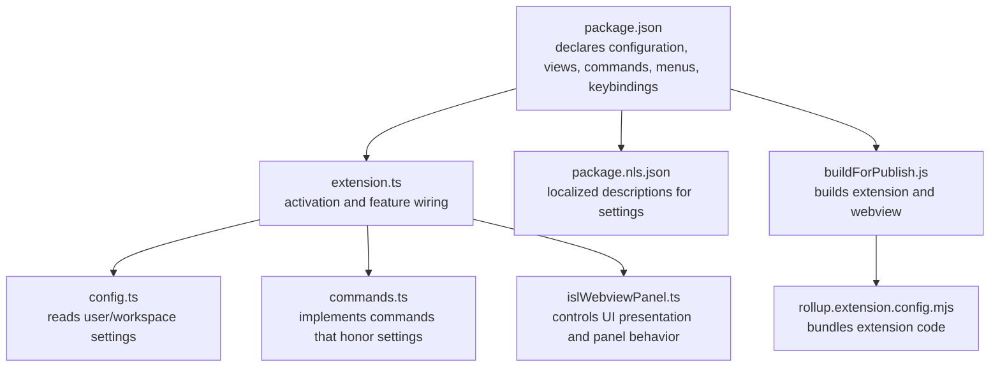
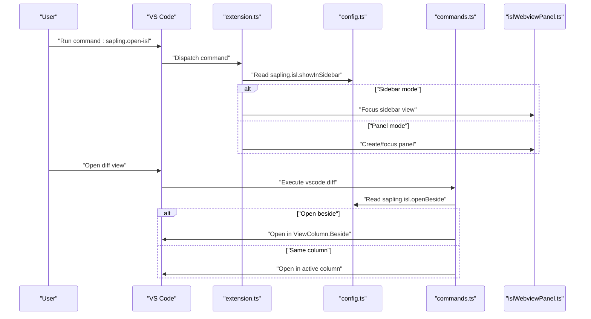
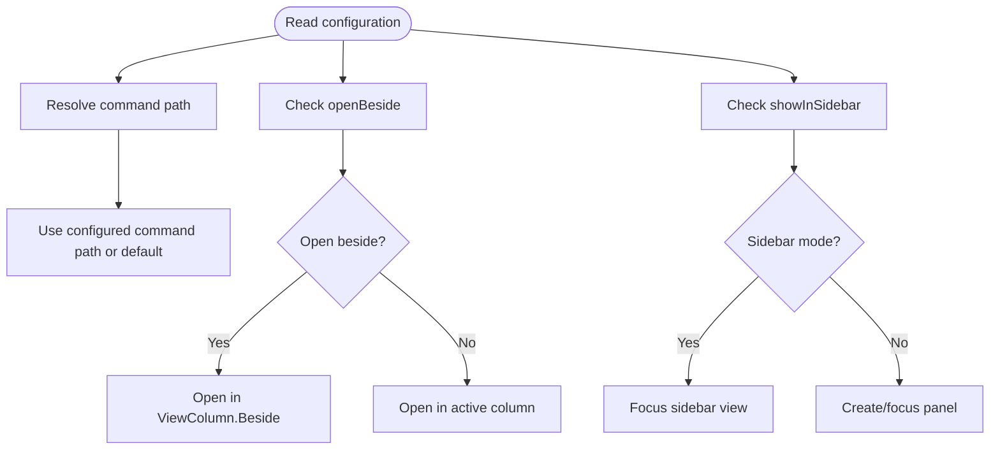
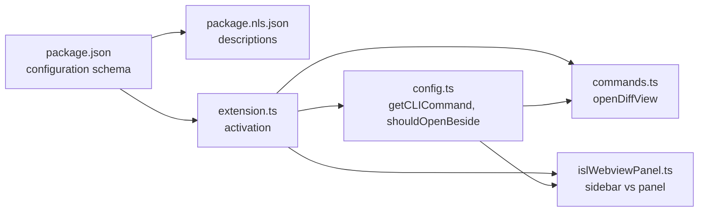

# Configuration and Customization

<cite>
**Referenced Files in This Document**
- [package.json](file://addons/vscode/package.json)
- [config.ts](file://addons/vscode/extension/config.ts)
- [extension.ts](file://addons/vscode/extension/extension.ts)
- [commands.ts](file://addons/vscode/extension/commands.ts)
- [islWebviewPanel.ts](file://addons/vscode/extension/islWebviewPanel.ts)
- [package.nls.json](file://addons/vscode/package.nls.json)
- [README.md](file://addons/vscode/README.md)
- [buildForPublish.js](file://addons/vscode/buildForPublish.js)
- [rollup.extension.config.mjs](file://addons/vscode/rollup.extension.config.mjs)
</cite>

## Table of Contents
1. [Introduction](#introduction)
2. [Project Structure](#project-structure)
3. [Core Components](#core-components)
4. [Architecture Overview](#architecture-overview)
5. [Detailed Component Analysis](#detailed-component-analysis)
6. [Dependency Analysis](#dependency-analysis)
7. [Performance Considerations](#performance-considerations)
8. [Troubleshooting Guide](#troubleshooting-guide)
9. [Conclusion](#conclusion)
10. [Appendices](#appendices)

## Introduction
This document explains how to configure and customize the VS Code extension for Sapling SCM. It covers all available configuration options, their effects, and recommended settings for different use cases. It also explains workspace-specific configurations, user preferences, and extension-specific settings, and provides guidance for integrating the extension with your workflow, including advanced scenarios, troubleshooting, and best practices for consistent settings across teams.

## Project Structure
The VS Code extension is implemented as a VSIX packaged by the extension’s package definition and build pipeline. The configuration surface is declared in the extension manifest and consumed at runtime by the extension code.

**Diagram sources**
- [package.json:37-306](file://addons/vscode/package.json#L37-L306)
- [extension.ts:31-109](file://addons/vscode/extension/extension.ts#L31-L109)
- [config.ts:18-29](file://addons/vscode/extension/config.ts#L18-L29)
- [commands.ts:173-179](file://addons/vscode/extension/commands.ts#L173-L179)
- [islWebviewPanel.ts:166-168](file://addons/vscode/extension/islWebviewPanel.ts#L166-L168)
- [package.nls.json:12-22](file://addons/vscode/package.nls.json#L12-L22)
- [buildForPublish.js:27-40](file://addons/vscode/buildForPublish.js#L27-L40)
- [rollup.extension.config.mjs:28-65](file://addons/vscode/rollup.extension.config.mjs#L28-L65)

**Section sources**
- [package.json:1-342](file://addons/vscode/package.json#L1-L342)
- [README.md:1-16](file://addons/vscode/README.md#L1-L16)

## Core Components
- Configuration declarations and defaults are defined in the extension manifest.
- Runtime behavior is controlled by reading configuration values and applying them to commands and UI.
- Localization provides human-readable descriptions for settings.

Key runtime consumers:
- CLI command resolution and panel/column behavior are governed by configuration.
- UI presentation toggles whether the ISL appears as a sidebar view or a panel.

**Section sources**
- [package.json:38-98](file://addons/vscode/package.json#L38-L98)
- [config.ts:18-29](file://addons/vscode/extension/config.ts#L18-L29)
- [islWebviewPanel.ts:166-168](file://addons/vscode/extension/islWebviewPanel.ts#L166-L168)

## Architecture Overview
The extension reads configuration at activation and applies it to commands and UI. The following sequence illustrates how configuration influences the interactive smartlog (ISL) UI and diff behavior.

**Diagram sources**
- [extension.ts:31-109](file://addons/vscode/extension/extension.ts#L31-L109)
- [config.ts:27-29](file://addons/vscode/extension/config.ts#L27-L29)
- [commands.ts:173-179](file://addons/vscode/extension/commands.ts#L173-L179)
- [islWebviewPanel.ts:235-246](file://addons/vscode/extension/islWebviewPanel.ts#L235-L246)

## Detailed Component Analysis

### Configuration Options Reference
All settings are defined under the “Sapling” configuration scope and are localized for readability.

- sapling.commandPath
  - Type: string
  - Default: empty (resolved to platform-specific executable)
  - Effect: Controls which executable is used to run Sapling commands. Requires restart to take effect.
  - Related usage: CLI command resolution for repository operations.

- sapling.showInlineBlame
  - Type: boolean
  - Default: true
  - Effect: Enables inline blame annotations when browsing files in Sapling repositories.

- sapling.showDiffComments
  - Type: boolean
  - Default: true
  - Effect: Enables display of Phabricator diff comments and inline code suggestions.

- sapling.inlineCommentDiffViewMode
  - Type: string
  - Enum: "Unified", "Split"
  - Default: "Unified"
  - Effect: Chooses the diff view mode for inline comments.

- sapling.markConflictingFilesResolvedOnSave
  - Type: boolean
  - Default: true
  - Effect: Automatically marks merge conflict files as resolved when saved without conflict markers.

- sapling.comparisonPanelMode
  - Type: string
  - Enum: "Auto", "Always Separate Panel"
  - Default: "Auto"
  - Effect: Controls whether comparison views open inside the ISL window or in a separate panel.

- sapling.isl.openBeside
  - Type: boolean
  - Default: false
  - Effect: When true, files, diffs, and comparisons open beside the existing ISL panel instead of in the same view column.

- sapling.isl.showInSidebar
  - Type: boolean
  - Default: false
  - Effect: When true, the Interactive Smartlog appears as a sidebar view. Restart required to fully take effect.

- sapling.isl.showOpenOrFocusButtonOnEditorTitle
  - Type: boolean
  - Default: true
  - Effect: Adds a button to the active editor’s title bar to open or focus the ISL.

**Section sources**
- [package.json:38-98](file://addons/vscode/package.json#L38-L98)
- [package.nls.json:12-27](file://addons/vscode/package.nls.json#L12-L27)
- [config.ts:18-29](file://addons/vscode/extension/config.ts#L18-L29)

### How Settings Are Used at Runtime
- CLI command path resolution:
  - The extension reads the configured command path and falls back to platform-specific defaults.
  - This value is used when initializing repository contexts and running operations.

- Opening beside behavior:
  - The extension checks the “open beside” setting to decide the view column for diff and comparison views.

- Sidebar vs panel:
  - The extension switches between a sidebar view provider and a panel depending on the “show in sidebar” setting.

**Diagram sources**
- [config.ts:18-29](file://addons/vscode/extension/config.ts#L18-L29)
- [commands.ts:173-179](file://addons/vscode/extension/commands.ts#L173-L179)
- [islWebviewPanel.ts:166-168](file://addons/vscode/extension/islWebviewPanel.ts#L166-L168)

**Section sources**
- [config.ts:18-29](file://addons/vscode/extension/config.ts#L18-L29)
- [commands.ts:173-179](file://addons/vscode/extension/commands.ts#L173-L179)
- [islWebviewPanel.ts:166-168](file://addons/vscode/extension/islWebviewPanel.ts#L166-L168)

### Workspace-Specific vs User Preferences vs Extension Settings
- Workspace-specific:
  - The extension contributes configuration properties under the “Sapling” configuration scope. These are user-editable and can be set per workspace.
  - Example: comparison panel mode, inline comment diff view mode, and whether to open beside.

- User preferences:
  - Users can set defaults for configuration values in their user settings. These apply across workspaces unless overridden.

- Extension-specific:
  - Some settings are read at activation and influence how the extension initializes features (e.g., enabling blame or comments).

**Section sources**
- [package.json:38-98](file://addons/vscode/package.json#L38-L98)
- [extension.ts:51-55](file://addons/vscode/extension/extension.ts#L51-L55)

### UI Elements and Behavior Modifications
- Sidebar view:
  - Enabling “show in sidebar” makes the ISL appear as a persistent sidebar view. The extension registers a provider and switches behavior accordingly.

- Editor title bar button:
  - Enabling “showOpenOrFocusButtonOnEditorTitle” adds a button to quickly open or focus the ISL from the active editor tab.

- Diff and comparison behavior:
  - The “open beside” setting controls whether diffs and comparisons open next to the active editor or replace it.

- Comparison panel mode:
  - “Auto” keeps comparisons inside the ISL when active; “Always Separate Panel” forces a dedicated panel.

**Section sources**
- [package.json:100-139](file://addons/vscode/package.json#L100-L139)
- [package.json:220-251](file://addons/vscode/package.json#L220-L251)
- [islWebviewPanel.ts:166-168](file://addons/vscode/extension/islWebviewPanel.ts#L166-L168)
- [commands.ts:173-179](file://addons/vscode/extension/commands.ts#L173-L179)

### Integration Preferences
- Command path:
  - Configure the executable used to run Sapling commands. Useful when multiple versions are installed or when using wrappers.

- Inline blame and comments:
  - Enable/disable inline blame and comments to match your review and navigation workflow.

- Diff view mode:
  - Choose between unified and split diff modes for inline comments to improve readability.

- Conflict resolution:
  - Enable automatic marking of resolved conflicts on save to streamline merge workflows.

**Section sources**
- [package.json:41-69](file://addons/vscode/package.json#L41-L69)
- [package.nls.json:15-22](file://addons/vscode/package.nls.json#L15-L22)

### Advanced Configuration Scenarios
- Team-wide policy enforcement:
  - Use repository-local settings to enforce “show in sidebar” and “open beside” for consistency across contributors.

- Developer ergonomics:
  - Set “open beside” to true for power users who want to keep ISL visible while working in adjacent editors.

- Review-centric workflow:
  - Enable “showDiffComments” and choose “Unified” or “Split” diff view mode to suit your code review preferences.

- Conflict-heavy branches:
  - Keep “markConflictingFilesResolvedOnSave” enabled to reduce manual steps when resolving merge conflicts.

**Section sources**
- [package.json:65-82](file://addons/vscode/package.json#L65-L82)
- [package.nls.json:15-22](file://addons/vscode/package.nls.json#L15-L22)

## Dependency Analysis
The extension’s configuration is consumed by several modules. The following diagram shows how configuration flows through the extension.

**Diagram sources**
- [package.json:37-98](file://addons/vscode/package.json#L37-L98)
- [package.nls.json:1-29](file://addons/vscode/package.nls.json#L1-L29)
- [extension.ts:31-109](file://addons/vscode/extension/extension.ts#L31-L109)
- [config.ts:18-29](file://addons/vscode/extension/config.ts#L18-L29)
- [commands.ts:173-179](file://addons/vscode/extension/commands.ts#L173-L179)
- [islWebviewPanel.ts:166-168](file://addons/vscode/extension/islWebviewPanel.ts#L166-L168)

**Section sources**
- [package.json:37-98](file://addons/vscode/package.json#L37-L98)
- [extension.ts:31-109](file://addons/vscode/extension/extension.ts#L31-L109)

## Performance Considerations
- Minimizing configuration reload impact:
  - The extension reads configuration at activation and caches values where appropriate. Avoid frequent changes to settings that trigger heavy UI rebuilds.

- Build-time bundling:
  - The extension is bundled with Rollup and optionally minified for production. This reduces runtime overhead and improves startup performance.

- Webview persistence:
  - The extension retains webview context when hidden, reducing reinitialization costs.

[No sources needed since this section provides general guidance]

## Troubleshooting Guide
- Command path issues:
  - Symptom: Commands fail or use unexpected executables.
  - Resolution: Set “sapling.commandPath” to the desired executable and restart VS Code.

- ISL not appearing in sidebar:
  - Symptom: Expecting sidebar view but seeing a panel instead.
  - Resolution: Enable “sapling.isl.showInSidebar” and restart VS Code.

- Comparisons not opening beside ISL:
  - Symptom: Comparisons open in the active column instead of beside.
  - Resolution: Enable “sapling.isl.openBeside”.

- Conflicts not marked resolved:
  - Symptom: Merge conflict markers removed but status remains conflicted.
  - Resolution: Enable “sapling.markConflictingFilesResolvedOnSave”.

- Localization descriptions missing:
  - Symptom: Settings show placeholder keys instead of descriptions.
  - Resolution: Ensure the extension is installed from a published package with localization assets.

**Section sources**
- [package.json:41-69](file://addons/vscode/package.json#L41-L69)
- [package.nls.json:12-22](file://addons/vscode/package.nls.json#L12-L22)
- [config.ts:18-29](file://addons/vscode/extension/config.ts#L18-L29)
- [islWebviewPanel.ts:166-168](file://addons/vscode/extension/islWebviewPanel.ts#L166-L168)

## Conclusion
The VS Code extension for Sapling SCM exposes a focused set of configuration options that control CLI integration, UI presentation, and behavior. By understanding how these settings are applied at runtime, you can tailor the extension to your workflow and maintain consistent configurations across teams. Use workspace settings for environment-specific policies, leverage user preferences for personal defaults, and rely on the extension’s localized descriptions for clarity.

[No sources needed since this section summarizes without analyzing specific files]

## Appendices

### Recommended Settings by Use Case
- New users:
  - Keep defaults for inline blame and comments enabled.
  - Leave “open beside” disabled until comfortable with the UI.

- Power users:
  - Enable “open beside” and “show in sidebar” for continuous visibility.
  - Set “comparisonPanelMode” to “Always Separate Panel” for dedicated comparison sessions.

- Review-focused teams:
  - Enable “showDiffComments” and choose “Unified” or “Split” diff view mode based on preference.

- Teams with frequent merges:
  - Enable “markConflictingFilesResolvedOnSave” to streamline conflict resolution.

**Section sources**
- [package.json:46-82](file://addons/vscode/package.json#L46-L82)
- [package.nls.json:15-22](file://addons/vscode/package.nls.json#L15-L22)

### Build and Publishing Notes
- Production build:
  - The extension and webview are built via scripts and Rollup configuration.
  - Publishing script enforces open-source-only publishing and cleans distribution artifacts.

**Section sources**
- [buildForPublish.js:27-58](file://addons/vscode/buildForPublish.js#L27-L58)
- [rollup.extension.config.mjs:28-65](file://addons/vscode/rollup.extension.config.mjs#L28-L65)