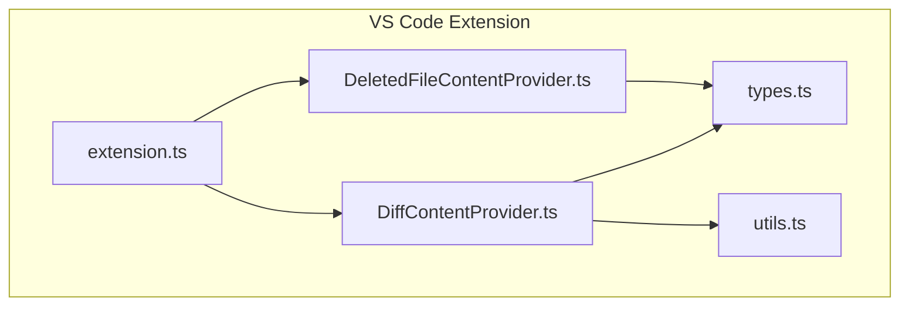
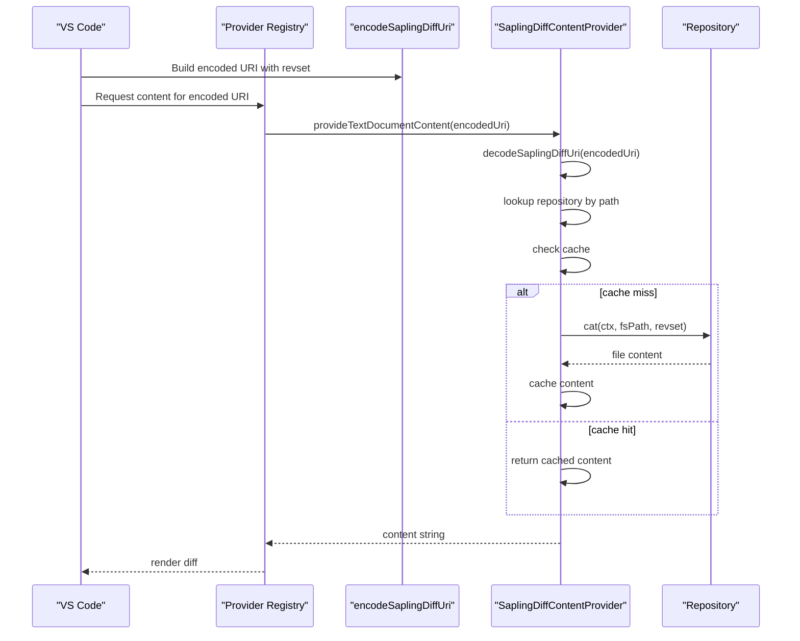
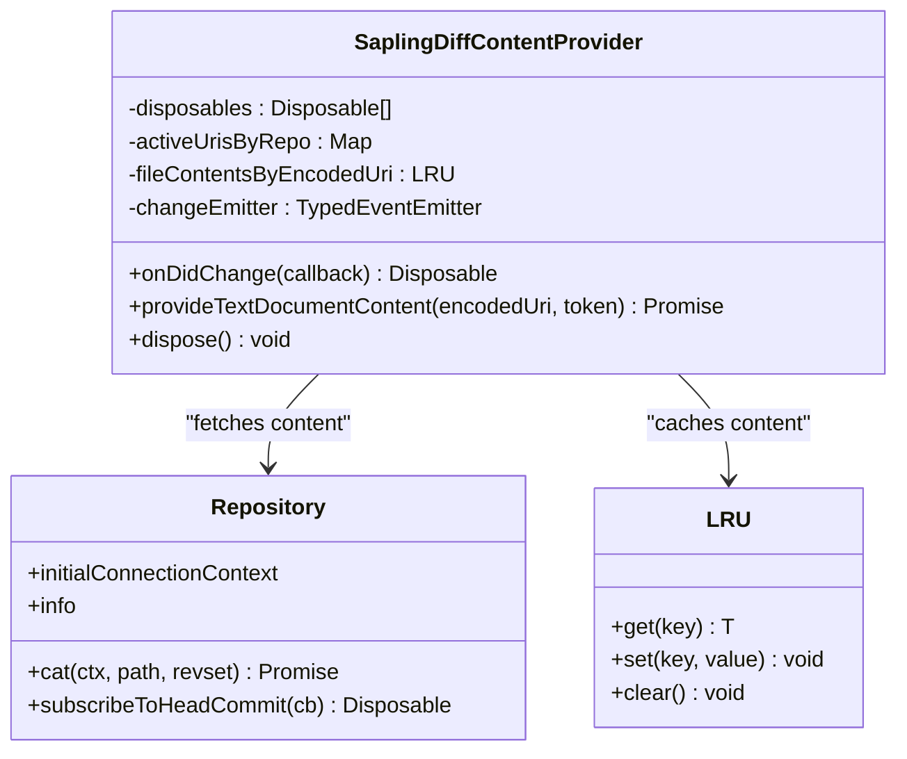
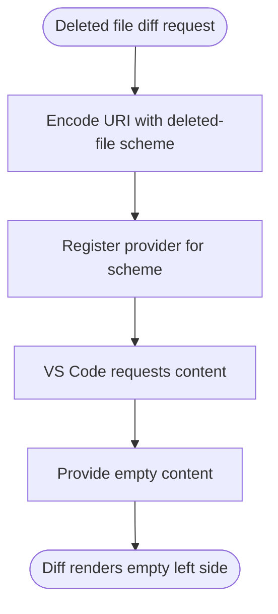
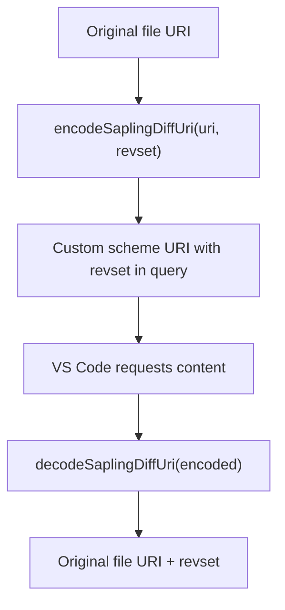
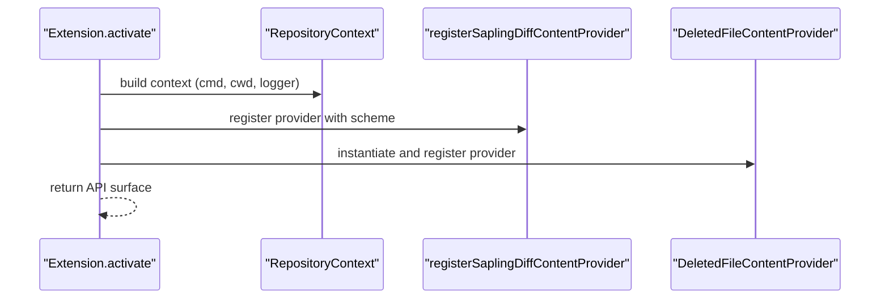
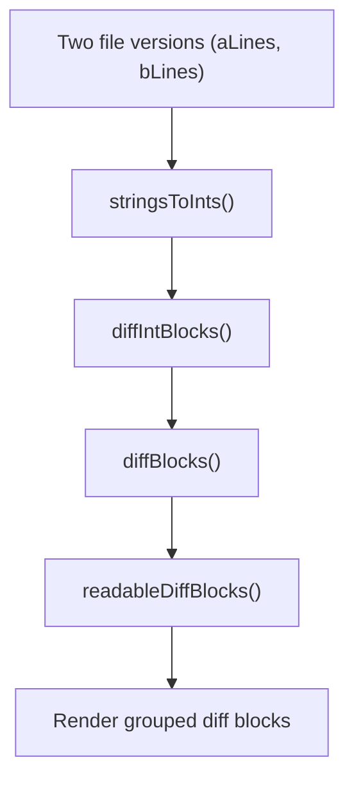
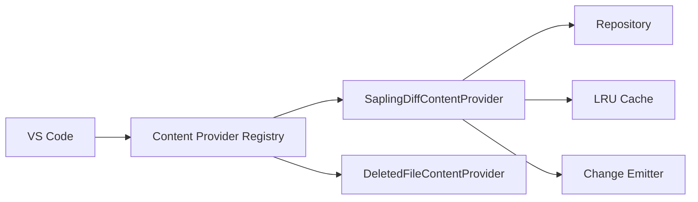

# Diff Content Provider

<cite>
**Referenced Files in This Document**
- [DiffContentProvider.ts](file://addons/vscode/extension/DiffContentProvider.ts)
- [DeletedFileContentProvider.ts](file://addons/vscode/extension/DeletedFileContentProvider.ts)
- [extension.ts](file://addons/vscode/extension/extension.ts)
- [README.md](file://addons/vscode/README.md)
- [types.ts](file://addons/vscode/extension/types.ts)
- [utils.ts](file://addons/vscode/extension/utils.ts)
- [diff.ts](file://addons/shared/diff.ts)
</cite>

## Table of Contents
1. [Introduction](#introduction)
2. [Project Structure](#project-structure)
3. [Core Components](#core-components)
4. [Architecture Overview](#architecture-overview)
5. [Detailed Component Analysis](#detailed-component-analysis)
6. [Dependency Analysis](#dependency-analysis)
7. [Performance Considerations](#performance-considerations)
8. [Troubleshooting Guide](#troubleshooting-guide)
9. [Conclusion](#conclusion)

## Introduction
This document explains the diff content provider system used by the SAPLING VS Code extension. It covers how the extension integrates with VS Code’s diff viewer, provides custom diff rendering for file content at historical revisions, and handles deleted files. It documents the content provider registration, URI scheme handling, and data fetching mechanisms. It also outlines how to extend the diff provider, handle edge cases, and optimize performance for large files and repositories.

## Project Structure
The diff-related functionality lives in the VS Code extension module:
- Diff content provider implementation
- Deleted file content provider for empty content in diffs
- Extension activation and registration
- Supporting types and utilities

**Diagram sources**
- [extension.ts:31-109](file://addons/vscode/extension/extension.ts#L31-L109)
- [DiffContentProvider.ts:26-181](file://addons/vscode/extension/DiffContentProvider.ts#L26-L181)
- [DeletedFileContentProvider.ts:15-42](file://addons/vscode/extension/DeletedFileContentProvider.ts#L15-L42)
- [types.ts:14-29](file://addons/vscode/extension/types.ts#L14-L29)
- [utils.ts:12-14](file://addons/vscode/extension/utils.ts#L12-L14)

**Section sources**
- [README.md:1-16](file://addons/vscode/README.md#L1-L16)
- [extension.ts:31-109](file://addons/vscode/extension/extension.ts#L31-L109)

## Core Components
- SaplingDiffContentProvider: Implements VS Code’s TextDocumentContentProvider to serve “original” file content for diffs using the repository’s cat operation at a given revision set.
- DeletedFileContentProvider: Supplies empty content for deleted files so they render properly in diff views.
- Registration: Both providers are registered during extension activation.

Key responsibilities:
- URI encoding/decoding for diff URIs
- Repository-aware content fetching
- Caching and invalidation
- Head commit change propagation

**Section sources**
- [DiffContentProvider.ts:26-181](file://addons/vscode/extension/DiffContentProvider.ts#L26-L181)
- [DeletedFileContentProvider.ts:15-42](file://addons/vscode/extension/DeletedFileContentProvider.ts#L15-L42)
- [extension.ts:64-65](file://addons/vscode/extension/extension.ts#L64-L65)

## Architecture Overview
The extension augments VS Code’s Quick Diff mechanism by registering custom content providers for specific URI schemes. The diff viewer requests content for the “original” side of a diff using an encoded URI. The provider resolves the repository, caches content, and fetches historical content via the repository interface.

**Diagram sources**
- [DiffContentProvider.ts:128-168](file://addons/vscode/extension/DiffContentProvider.ts#L128-L168)
- [DiffContentProvider.ts:199-224](file://addons/vscode/extension/DiffContentProvider.ts#L199-L224)

## Detailed Component Analysis

### SaplingDiffContentProvider
Implements VS Code’s content provider interface to supply historical file content for diffing.

- Lifecycle and subscriptions
  - Tracks active URIs per repository to invalidate on changes.
  - Subscribes to head commit changes to clear caches and emit change events.
  - Listens to document close events to prune tracked URIs.
- Content retrieval
  - Decodes the encoded URI to recover the original file path and revset.
  - Resolves the repository for the path and uses the repository’s cat operation to fetch content.
  - Falls back to empty content when the file does not exist at the target revision.
- Caching and invalidation
  - Uses an LRU cache keyed by the encoded URI string.
  - Clears cache on head commit changes and re-emits change events for tracked URIs.

**Diagram sources**
- [DiffContentProvider.ts:26-181](file://addons/vscode/extension/DiffContentProvider.ts#L26-L181)

**Section sources**
- [DiffContentProvider.ts:26-181](file://addons/vscode/extension/DiffContentProvider.ts#L26-L181)

### DeletedFileContentProvider
Provides empty content for deleted files so they can participate in diff views.

- Registers a dedicated URI scheme for deleted files.
- Encodes the original scheme in the query for restoration when needed.
- Returns empty content for diff rendering.

**Diagram sources**
- [DeletedFileContentProvider.ts:15-42](file://addons/vscode/extension/DeletedFileContentProvider.ts#L15-L42)

**Section sources**
- [DeletedFileContentProvider.ts:15-42](file://addons/vscode/extension/DeletedFileContentProvider.ts#L15-L42)

### URI Encoding/Decoding Utilities
- encodeSaplingDiffUri: Transforms a file URI into a custom scheme URI carrying a revset in the query.
- decodeSaplingDiffUri: Extracts the original file URI and revset from the encoded URI.

**Diagram sources**
- [DiffContentProvider.ts:199-224](file://addons/vscode/extension/DiffContentProvider.ts#L199-L224)

**Section sources**
- [DiffContentProvider.ts:199-224](file://addons/vscode/extension/DiffContentProvider.ts#L199-L224)

### Extension Activation and Registration
- During activation, the extension creates a repository context, loads features, and registers:
  - The Sapling diff content provider
  - The deleted-file content provider
- Feature flags control which parts of the extension are enabled.

**Diagram sources**
- [extension.ts:31-109](file://addons/vscode/extension/extension.ts#L31-L109)
- [extension.ts:64-65](file://addons/vscode/extension/extension.ts#L64-L65)

**Section sources**
- [extension.ts:31-109](file://addons/vscode/extension/extension.ts#L31-L109)
- [types.ts:14-29](file://addons/vscode/extension/types.ts#L14-L29)
- [utils.ts:12-14](file://addons/vscode/extension/utils.ts#L12-L14)

### Comparison Algorithms and Rendering
- The shared diff library provides block-based diffing and readability-focused diffing for generating human-friendly diff blocks.
- These utilities support rendering and grouping of differences in views built on top of the content providers.

**Diagram sources**
- [diff.ts:72-97](file://addons/shared/diff.ts#L72-L97)

**Section sources**
- [diff.ts:72-97](file://addons/shared/diff.ts#L72-L97)

## Dependency Analysis
- Providers depend on:
  - VS Code TextDocumentContentProvider interface
  - Repository abstraction for content retrieval
  - LRU caching for performance
  - Event emitters for change propagation
- Extension activation composes providers and registers them with VS Code.

**Diagram sources**
- [DiffContentProvider.ts:26-181](file://addons/vscode/extension/DiffContentProvider.ts#L26-L181)
- [DeletedFileContentProvider.ts:15-42](file://addons/vscode/extension/DeletedFileContentProvider.ts#L15-L42)

**Section sources**
- [DiffContentProvider.ts:26-181](file://addons/vscode/extension/DiffContentProvider.ts#L26-L181)
- [DeletedFileContentProvider.ts:15-42](file://addons/vscode/extension/DeletedFileContentProvider.ts#L15-L42)

## Performance Considerations
- Caching
  - LRU cache keyed by encoded URI prevents repeated repository queries for the same diff view.
  - Cache is cleared on head commit changes to ensure correctness.
- Repository subscription
  - Subscribes to head changes to invalidate diffs across repositories efficiently.
- Error handling
  - On cat failures (e.g., file added after the left side), falls back to empty content to keep diffs usable.
- Large files and repositories
  - Prefer caching and avoid unnecessary recomputation.
  - Keep diff view focus minimal to reduce repeated fetches.

[No sources needed since this section provides general guidance]

## Troubleshooting Guide
- No content in diff view
  - Verify the provider is registered during activation.
  - Ensure the encoded URI uses the correct scheme and includes a valid revset.
- Incorrect or stale content
  - Confirm head commit change invalidation clears caches and emits change events.
  - Check that the repository context matches the workspace path.
- Deleted files not rendering
  - Use the deleted-file provider scheme to ensure empty content is supplied.

**Section sources**
- [extension.ts:64-65](file://addons/vscode/extension/extension.ts#L64-L65)
- [DiffContentProvider.ts:81-96](file://addons/vscode/extension/DiffContentProvider.ts#L81-L96)
- [DeletedFileContentProvider.ts:15-42](file://addons/vscode/extension/DeletedFileContentProvider.ts#L15-L42)

## Conclusion
The diff content provider system integrates tightly with VS Code’s diff viewer by registering custom content providers for encoded URIs. It leverages repository APIs to fetch historical content, caches results for performance, and propagates changes on repository updates. The deleted-file provider ensures deleted files render correctly. Together, these components enable robust, efficient diffing within VS Code using SAPLING.