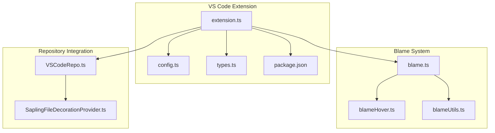
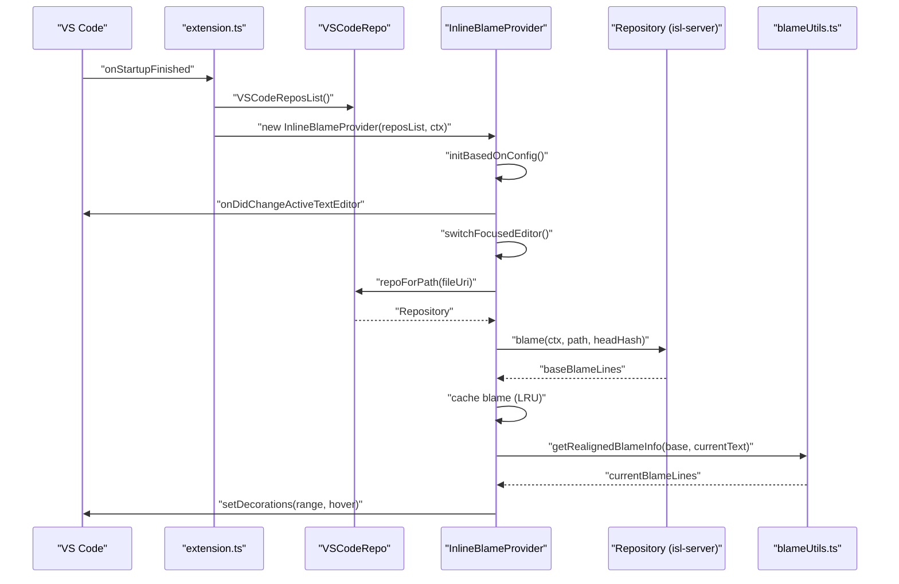
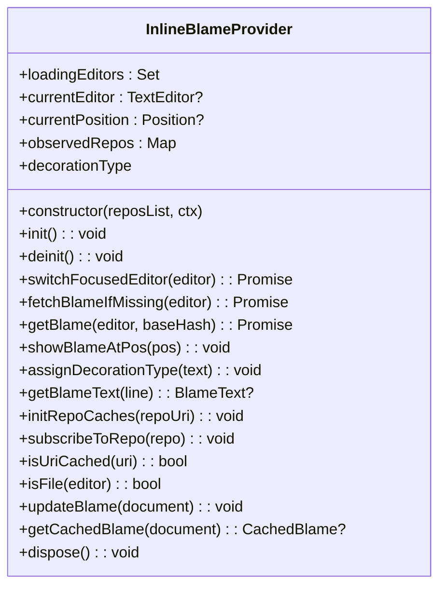
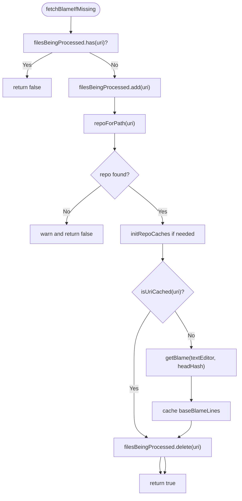
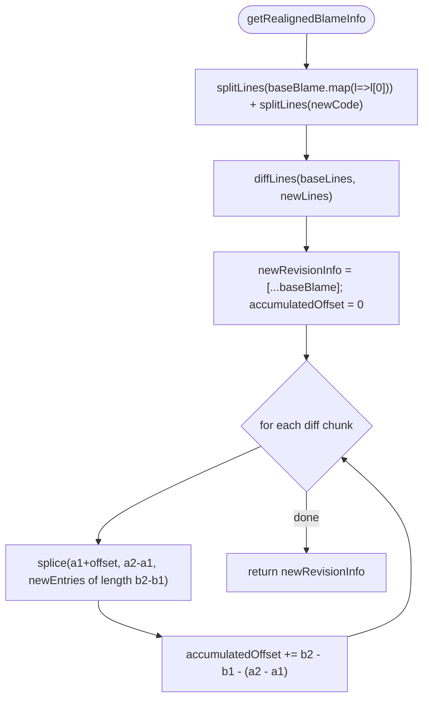
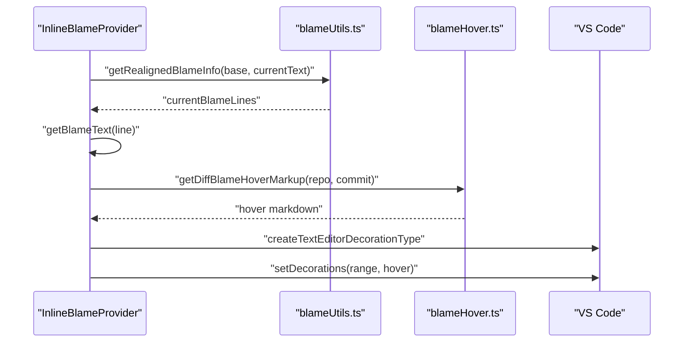
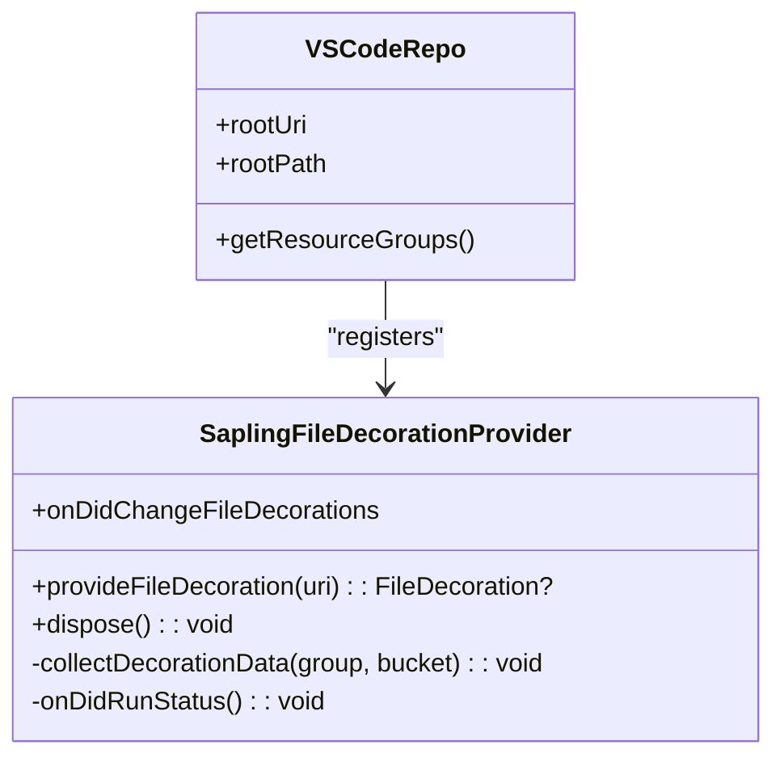
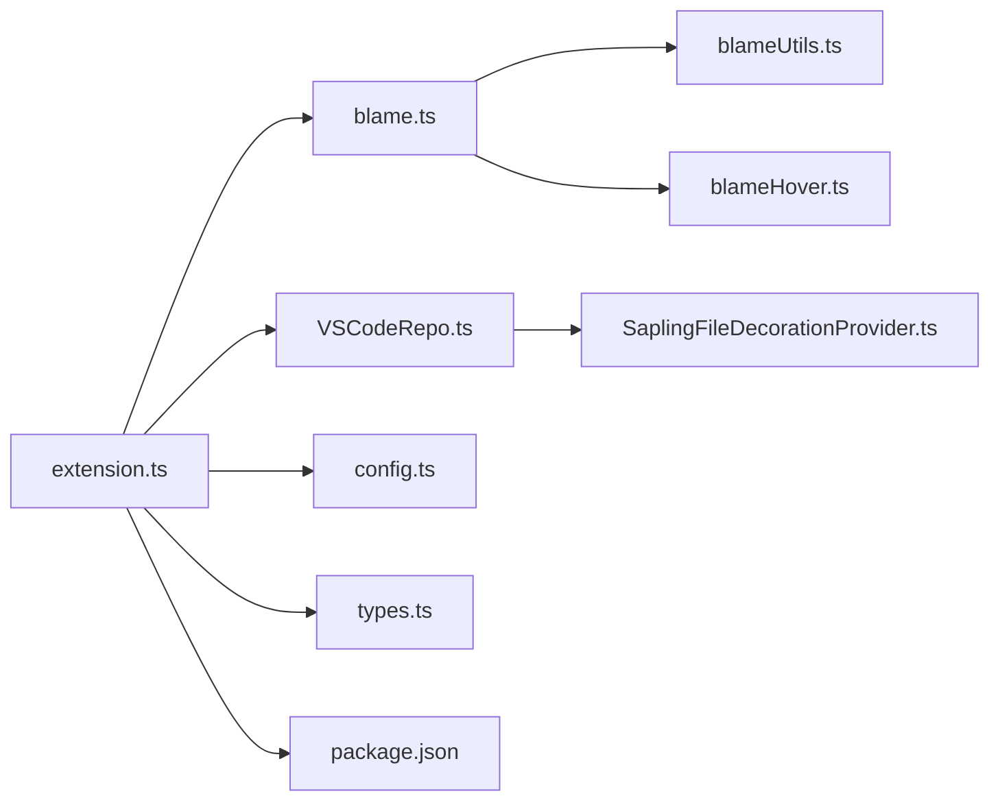

# Inline Blame Integration

<cite>
**Referenced Files in This Document**
- [extension.ts](file://addons/vscode/extension/extension.ts)
- [VSCodeRepo.ts](file://addons/vscode/extension/VSCodeRepo.ts)
- [SaplingFileDecorationProvider.ts](file://addons/vscode/extension/SaplingFileDecorationProvider.ts)
- [blame.ts](file://addons/vscode/extension/blame/blame.ts)
- [blameHover.ts](file://addons/vscode/extension/blame/blameHover.ts)
- [blameUtils.ts](file://addons/vscode/extension/blame/blameUtils.ts)
- [config.ts](file://addons/vscode/extension/config.ts)
- [types.ts](file://addons/vscode/extension/types.ts)
- [package.json](file://addons/vscode/package.json)
- [blame.test.ts](file://addons/vscode/extension/blame/__tests__/blame.test.ts)
</cite>

## Table of Contents
1. [Introduction](#introduction)
2. [Project Structure](#project-structure)
3. [Core Components](#core-components)
4. [Architecture Overview](#architecture-overview)
5. [Detailed Component Analysis](#detailed-component-analysis)
6. [Dependency Analysis](#dependency-analysis)
7. [Performance Considerations](#performance-considerations)
8. [Troubleshooting Guide](#troubleshooting-guide)
9. [Conclusion](#conclusion)

## Introduction
This document explains the inline blame functionality in the VS Code extension. It covers how blame information is fetched from the underlying repository, cached locally, and rendered as inline annotations in the editor. It also documents the file decoration system, integration with VS Code’s native blame features, configuration options, customization of blame annotations, performance characteristics for large repositories, troubleshooting steps, and best practices.

## Project Structure
The inline blame feature spans several modules:
- Extension activation wires the blame provider into VS Code when enabled.
- The blame provider manages fetching, caching, and rendering blame annotations.
- Utilities handle realignment of blame to reflect local changes and hover rendering.
- VS Code repository integration provides repository access and subscription to head changes.
- Configuration and settings define how blame is enabled and displayed.

**Diagram sources**
- [extension.ts:31-109](file://addons/vscode/extension/extension.ts#L31-L109)
- [blame.ts:71-197](file://addons/vscode/extension/blame/blame.ts#L71-L197)
- [VSCodeRepo.ts:183-241](file://addons/vscode/extension/VSCodeRepo.ts#L183-L241)
- [SaplingFileDecorationProvider.ts:21-76](file://addons/vscode/extension/SaplingFileDecorationProvider.ts#L21-L76)
- [blameHover.ts:13-36](file://addons/vscode/extension/blame/blameHover.ts#L13-L36)
- [blameUtils.ts:12-52](file://addons/vscode/extension/blame/blameUtils.ts#L12-L52)
- [config.ts:18-29](file://addons/vscode/extension/config.ts#L18-L29)
- [types.ts:8-29](file://addons/vscode/extension/types.ts#L8-L29)
- [package.json:46-50](file://addons/vscode/package.json#L46-L50)

**Section sources**
- [extension.ts:31-109](file://addons/vscode/extension/extension.ts#L31-L109)
- [package.json:46-50](file://addons/vscode/package.json#L46-L50)

## Core Components
- InlineBlameProvider: Orchestrates blame fetching, caching, and rendering. It subscribes to repository head changes, manages per-file caches, and updates blame in response to editor focus, selection, and text changes.
- VSCodeRepo and VSCodeReposList: Provide repository access, head commit subscriptions, and repository lifecycle management.
- blameHover: Generates hover content markup including author, commit metadata, and links to code review systems.
- blameUtils: Implements line-by-line diff-based realignment of blame to reflect local edits.
- SaplingFileDecorationProvider: Integrates with VS Code’s file decoration provider to surface repository status icons and badges.

**Section sources**
- [blame.ts:71-488](file://addons/vscode/extension/blame/blame.ts#L71-L488)
- [VSCodeRepo.ts:47-171](file://addons/vscode/extension/VSCodeRepo.ts#L47-L171)
- [blameHover.ts:13-36](file://addons/vscode/extension/blame/blameHover.ts#L13-L36)
- [blameUtils.ts:12-52](file://addons/vscode/extension/blame/blameUtils.ts#L12-L52)
- [SaplingFileDecorationProvider.ts:21-76](file://addons/vscode/extension/SaplingFileDecorationProvider.ts#L21-L76)

## Architecture Overview
Inline blame is activated when the “sapling.showInlineBlame” setting is true. The extension creates an InlineBlameProvider that:
- Listens to active editor changes and selection updates.
- Fetches blame for the current file via the repository interface.
- Caches blame per repository and per file.
- Realigns blame to local changes using a line diff algorithm.
- Renders a single-line inline annotation next to the cursor with a hover tooltip.

**Diagram sources**
- [extension.ts:59-63](file://addons/vscode/extension/extension.ts#L59-L63)
- [blame.ts:199-291](file://addons/vscode/extension/blame/blame.ts#L199-L291)
- [blameUtils.ts:12-39](file://addons/vscode/extension/blame/blameUtils.ts#L12-L39)
- [VSCodeRepo.ts:123-133](file://addons/vscode/extension/VSCodeRepo.ts#L123-L133)

## Detailed Component Analysis

### InlineBlameProvider
Responsibilities:
- Initialize and teardown listeners for editor focus, selection, and document changes.
- Fetch blame for the active file using the repository interface.
- Maintain per-repository LRU cache keyed by file path.
- Invalidate and refresh blame when the head commit changes.
- Realignment of blame to reflect local edits using line diff.
- Render a single-line inline annotation and hover tooltip.

Key behaviors:
- Debounced editor switching to avoid excessive processing.
- Debounced selection and text change handlers to balance responsiveness and performance.
- Uses a dedicated decoration type to render inline text with theme-aware colors.
- Supports toggling via configuration and gracefully handles missing repositories or empty blame.

**Diagram sources**
- [blame.ts:71-488](file://addons/vscode/extension/blame/blame.ts#L71-L488)

**Section sources**
- [blame.ts:83-197](file://addons/vscode/extension/blame/blame.ts#L83-L197)
- [blame.ts:199-291](file://addons/vscode/extension/blame/blame.ts#L199-L291)
- [blame.ts:306-391](file://addons/vscode/extension/blame/blame.ts#L306-L391)
- [blame.ts:412-437](file://addons/vscode/extension/blame/blame.ts#L412-L437)
- [blame.ts:452-478](file://addons/vscode/extension/blame/blame.ts#L452-L478)

### Blame Fetching and Caching
- Per-repository cache initialized with an LRU of fixed capacity.
- Head commit subscription invalidates cache on change and triggers reload.
- Fetch occurs only when the file is not cached or when the repository is newly observed.
- Errors are tracked and logged; benign “No Blame” errors are handled gracefully.

**Diagram sources**
- [blame.ts:218-291](file://addons/vscode/extension/blame/blame.ts#L218-L291)
- [blame.ts:404-410](file://addons/vscode/extension/blame/blame.ts#L404-L410)
- [blame.ts:439-446](file://addons/vscode/extension/blame/blame.ts#L439-L446)

**Section sources**
- [blame.ts:293-304](file://addons/vscode/extension/blame/blame.ts#L293-L304)
- [blame.ts:404-410](file://addons/vscode/extension/blame/blame.ts#L404-L410)
- [blame.ts:412-437](file://addons/vscode/extension/blame/blame.ts#L412-L437)

### Realignment of Blame to Local Changes
- Converts base blame lines and current document text into arrays of strings.
- Computes line diffs to determine insertions, deletions, and modifications.
- Applies splice operations to adjust blame indices accordingly, preserving attribution for unchanged regions and marking edited lines as local changes.

**Diagram sources**
- [blameUtils.ts:12-39](file://addons/vscode/extension/blame/blameUtils.ts#L12-L39)

**Section sources**
- [blameUtils.ts:12-39](file://addons/vscode/extension/blame/blameUtils.ts#L12-L39)

### Hover and Annotation Rendering
- Inline text includes author hint (you or shortened author), relative date, and commit title.
- Hover content composes author, diff/commit link, relative date, and full commit title/description.
- Author hint respects internal policy to hide author names except for the current user.

**Diagram sources**
- [blame.ts:351-391](file://addons/vscode/extension/blame/blame.ts#L351-L391)
- [blameHover.ts:13-36](file://addons/vscode/extension/blame/blameHover.ts#L13-L36)
- [blameUtils.ts:12-39](file://addons/vscode/extension/blame/blameUtils.ts#L12-L39)

**Section sources**
- [blame.ts:306-325](file://addons/vscode/extension/blame/blame.ts#L306-L325)
- [blame.ts:351-391](file://addons/vscode/extension/blame/blame.ts#L351-L391)
- [blameHover.ts:13-36](file://addons/vscode/extension/blame/blameHover.ts#L13-L36)

### File Decoration Provider Integration
- The extension registers a FileDecorationProvider to surface repository status icons and badges for files.
- This complements inline blame by providing a broader SCM status view in the Explorer.

**Diagram sources**
- [SaplingFileDecorationProvider.ts:21-76](file://addons/vscode/extension/SaplingFileDecorationProvider.ts#L21-L76)
- [VSCodeRepo.ts:230-239](file://addons/vscode/extension/VSCodeRepo.ts#L230-L239)

**Section sources**
- [SaplingFileDecorationProvider.ts:21-76](file://addons/vscode/extension/SaplingFileDecorationProvider.ts#L21-L76)
- [VSCodeRepo.ts:230-239](file://addons/vscode/extension/VSCodeRepo.ts#L230-L239)

## Dependency Analysis
- Activation depends on configuration and feature flags. The extension checks whether blame is enabled and constructs the provider accordingly.
- The provider depends on VSCodeRepo for repository access and head commit subscriptions.
- Rendering depends on VS Code’s decoration APIs and MarkdownString for hover content.
- Utilities encapsulate realignment logic and author name shortening.

**Diagram sources**
- [extension.ts:59-63](file://addons/vscode/extension/extension.ts#L59-L63)
- [blame.ts:71-197](file://addons/vscode/extension/blame/blame.ts#L71-L197)
- [VSCodeRepo.ts:183-241](file://addons/vscode/extension/VSCodeRepo.ts#L183-L241)
- [SaplingFileDecorationProvider.ts:21-76](file://addons/vscode/extension/SaplingFileDecorationProvider.ts#L21-L76)
- [blameHover.ts:13-36](file://addons/vscode/extension/blame/blameHover.ts#L13-L36)
- [blameUtils.ts:12-52](file://addons/vscode/extension/blame/blameUtils.ts#L12-L52)
- [config.ts:18-29](file://addons/vscode/extension/config.ts#L18-L29)
- [types.ts:8-29](file://addons/vscode/extension/types.ts#L8-L29)
- [package.json:46-50](file://addons/vscode/package.json#L46-L50)

**Section sources**
- [extension.ts:59-63](file://addons/vscode/extension/extension.ts#L59-L63)
- [blame.ts:71-197](file://addons/vscode/extension/blame/blame.ts#L71-L197)
- [VSCodeRepo.ts:183-241](file://addons/vscode/extension/VSCodeRepo.ts#L183-L241)

## Performance Considerations
- Debouncing: Editor switching, selection changes, and text document changes are debounced to reduce churn and improve responsiveness.
- Caching: An LRU cache limits the number of files cached per repository, preventing memory growth.
- Realignment cost: Line diff realignment runs synchronously; very large files may impact responsiveness. Consider disabling inline blame or optimizing further for extremely large files.
- Head invalidation: Cache clears on head changes, ensuring correctness at the cost of re-fetching blame.

Recommendations:
- Keep “sapling.showInlineBlame” enabled only when needed.
- Prefer focusing one file at a time to minimize concurrent realignments.
- For very large files, consider reviewing the realignment logic or disabling inline blame.

**Section sources**
- [blame.ts:116-132](file://addons/vscode/extension/blame/blame.ts#L116-L132)
- [blame.ts:135-155](file://addons/vscode/extension/blame/blame.ts#L135-L155)
- [blame.ts:158-178](file://addons/vscode/extension/blame/blame.ts#L158-L178)
- [blame.ts:51](file://addons/vscode/extension/blame/blame.ts#L51)
- [blameUtils.ts:16](file://addons/vscode/extension/blame/blameUtils.ts#L16)

## Troubleshooting Guide
Common issues and resolutions:
- No blame displayed:
  - Verify the file belongs to a recognized repository. The provider logs a warning when no repository is found for a path.
  - Ensure “sapling.showInlineBlame” is enabled.
  - Confirm the repository is attached and the file is under the workspace root.
- Blame not updating:
  - Head commit changes trigger cache invalidation. Wait for the provider to refetch blame.
  - If the file remains unchanged, realignment may not alter blame lines.
- Hover shows commit hash fallback:
  - Some commits lack a linked diff ID; the hover falls back to a short commit hash link.
- Author name not shown:
  - Internal policy may suppress author names in inline blame except for the current user.

Diagnostic steps:
- Check the extension output channel for logs and error events.
- Confirm repository head subscription is active and cache is being cleared on head changes.
- Validate that the active editor is a file:// scheme document.

**Section sources**
- [blame.ts:227-231](file://addons/vscode/extension/blame/blame.ts#L227-L231)
- [blame.ts:262-269](file://addons/vscode/extension/blame/blame.ts#L262-L269)
- [blameHover.ts:16-28](file://addons/vscode/extension/blame/blameHover.ts#L16-L28)
- [blame.ts:397-402](file://addons/vscode/extension/blame/blame.ts#L397-L402)

## Conclusion
The inline blame integration combines repository-driven blame fetching, per-file caching, and precise realignment to local changes. It renders concise inline annotations with rich hover tooltips, integrates with VS Code’s decoration system, and respects configuration and performance constraints. By understanding the provider lifecycle, caching strategy, and realignment mechanics, users and developers can effectively troubleshoot and optimize blame performance in large repositories.