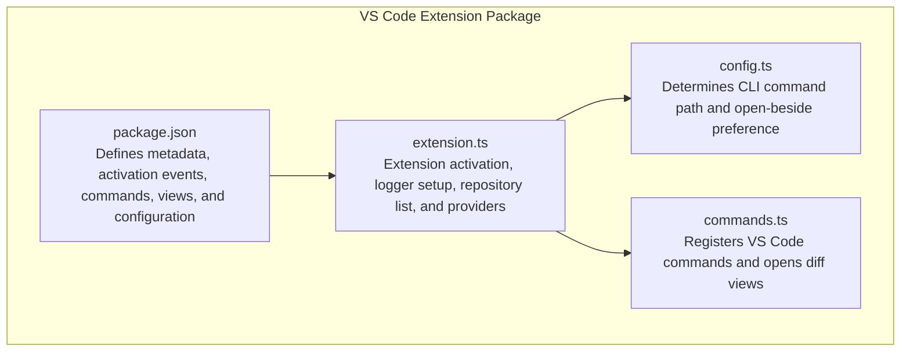
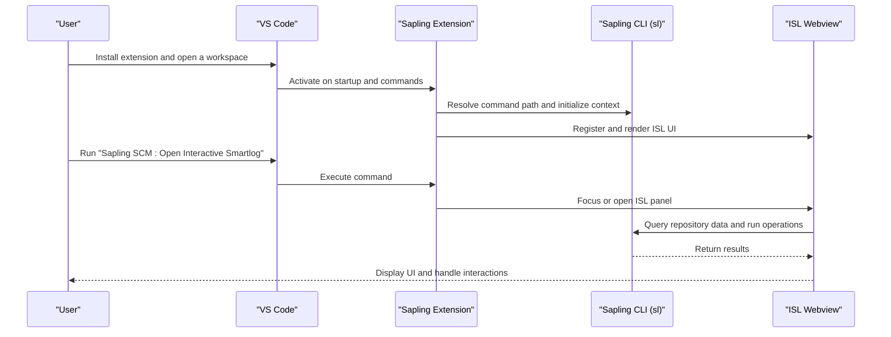
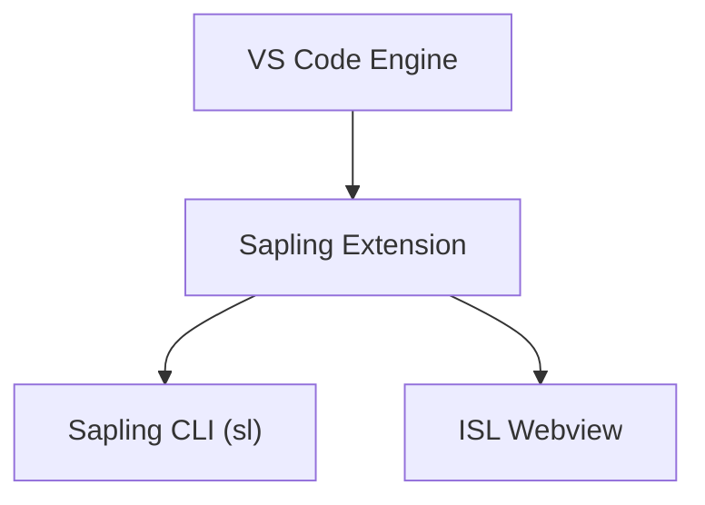

# Installation and Setup

<cite>
**Referenced Files in This Document**
- [package.json](file://addons/vscode/package.json)
- [README.md](file://addons/vscode/README.md)
- [extension.ts](file://addons/vscode/extension/extension.ts)
- [config.ts](file://addons/vscode/extension/config.ts)
- [commands.ts](file://addons/vscode/extension/commands.ts)
- [CHANGELOG.md](file://addons/vscode/CHANGELOG.md)
- [installation.md](file://website/docs/introduction/installation.md)
- [README.md](file://addons/vs/README.md)
- [CONTRIBUTING.md](file://addons/vs/CONTRIBUTING.md)
- [requirements_ubuntu.txt](file://requirements_ubuntu.txt)
</cite>

## Table of Contents
1. [Introduction](#introduction)
2. [Project Structure](#project-structure)
3. [Core Components](#core-components)
4. [Architecture Overview](#architecture-overview)
5. [Detailed Component Analysis](#detailed-component-analysis)
6. [Dependency Analysis](#dependency-analysis)
7. [Performance Considerations](#performance-considerations)
8. [Troubleshooting Guide](#troubleshooting-guide)
9. [Conclusion](#conclusion)
10. [Appendices](#appendices)

## Introduction
This document provides comprehensive installation and setup guidance for the SAPLING SCM VS Code extension. It covers:
- How to install the extension via the VS Code Marketplace
- How to manually install from source
- Prerequisite requirements, including installing the Sapling CLI
- Initial configuration options and workspace setup
- Verification steps to confirm a successful installation
- Troubleshooting common installation issues, dependency conflicts, and platform-specific considerations for Windows, macOS, and Linux
- Guidance on updating the extension and handling version compatibility issues

## Project Structure
The SAPLING SCM VS Code extension is organized as a VS Code extension package with a clear separation of concerns:
- Extension entry point and activation logic
- Configuration and command registration
- Webview-based UI integration
- Build and packaging scripts

**Diagram sources**
- [package.json:1-342](file://addons/vscode/package.json#L1-L342)
- [extension.ts:31-109](file://addons/vscode/extension/extension.ts#L31-L109)
- [config.ts:18-24](file://addons/vscode/extension/config.ts#L18-L24)
- [commands.ts:36-164](file://addons/vscode/extension/commands.ts#L36-L164)

**Section sources**
- [package.json:1-342](file://addons/vscode/package.json#L1-L342)
- [extension.ts:31-109](file://addons/vscode/extension/extension.ts#L31-L109)
- [config.ts:18-24](file://addons/vscode/extension/config.ts#L18-L24)
- [commands.ts:36-164](file://addons/vscode/extension/commands.ts#L36-L164)

## Core Components
- Extension metadata and activation:
  - Activation events include startup completion, specific commands, webview panels, and a dedicated view
  - Extension kind is workspace-scoped
  - Main entry point points to a compiled distribution file
- Configuration:
  - Provides settings for CLI command path, inline blame visibility, diff comments, comparison panel mode, and ISL display preferences
- Commands and UI:
  - Registers commands for opening the Interactive Smartlog (ISL) webview, comparison views, and SCM-related actions
  - Supports keybindings and context menus for convenient access
- Platform-specific behavior:
  - CLI command defaults to platform-appropriate values (e.g., Windows vs. Unix-like systems)

Key configuration options include:
- sapling.commandPath: Override the CLI command used to invoke the Sapling executable
- sapling.showInlineBlame: Toggle inline blame annotations
- sapling.showDiffComments: Toggle diff comments panel
- sapling.inlineCommentDiffViewMode: Choose Unified or Split diff view mode
- sapling.markConflictingFilesResolvedOnSave: Auto-mark merge conflicts as resolved when saving
- sapling.comparisonPanelMode: Choose Auto or Always Separate Panel
- sapling.isl.openBeside: Open files/diffs beside the ISL window
- sapling.isl.showInSidebar: Show ISL in the sidebar instead of the editor area
- sapling.isl.showOpenOrFocusButtonOnEditorTitle: Show an editor title button to open or focus ISL

**Section sources**
- [package.json:38-98](file://addons/vscode/package.json#L38-L98)
- [package.json:140-219](file://addons/vscode/package.json#L140-L219)
- [package.json:220-251](file://addons/vscode/package.json#L220-L251)
- [config.ts:18-24](file://addons/vscode/extension/config.ts#L18-L24)

## Architecture Overview
The extension integrates with VS Code’s SCM API and launches a webview-based UI for the Interactive Smartlog. It communicates with the Sapling CLI to fetch repository data and executes operations.

**Diagram sources**
- [extension.ts:31-109](file://addons/vscode/extension/extension.ts#L31-L109)
- [config.ts:18-24](file://addons/vscode/extension/config.ts#L18-L24)
- [package.json:14-19](file://addons/vscode/package.json#L14-L19)
- [package.json:140-169](file://addons/vscode/package.json#L140-L169)

## Detailed Component Analysis

### Installation via VS Code Marketplace
- Open VS Code and go to the Extensions view
- Search for “Sapling SCM”
- Install the extension published by “meta”
- Restart VS Code if prompted

Verification:
- Open a folder that is part of a Sapling repository
- Run the command “Sapling SCM: Open Interactive Smartlog” from the command palette
- Alternatively, use the keyboard shortcut configured for the command

**Section sources**
- [README.md:7-11](file://addons/vscode/README.md#L7-L11)
- [package.json:1-10](file://addons/vscode/package.json#L1-L10)

### Manual Installation from Source
- Clone the repository and open the VS Code extension project
- Install dependencies using the project’s build scripts
- Build the extension locally and install the resulting package into VS Code

Notes:
- The extension defines build scripts for watching and production builds
- Publishing-time preparation is handled by a dedicated script

**Section sources**
- [package.json:307-315](file://addons/vscode/package.json#L307-L315)

### Prerequisites and Sapling CLI Installation
- Install the Sapling CLI according to platform-specific instructions
- On Windows, ensure the CLI executable is discoverable and optionally configure the command path setting
- On macOS, follow the Homebrew or prebuilt bottle instructions
- On Linux, use the provided package manager or Homebrew installation method

Platform-specific notes:
- Windows: The CLI executable name differs from the shell built-in; configure PowerShell aliases if needed
- macOS: If downloaded via a browser, remove quarantine attributes before running
- Linux: Adjust system limits for large repositories if necessary

**Section sources**
- [README.md:14-15](file://addons/vscode/README.md#L14-L15)
- [installation.md:17-121](file://website/docs/introduction/installation.md#L17-L121)

### Initial Configuration Options
- sapling.commandPath: Override the CLI command used by the extension
- sapling.showInlineBlame: Enable inline blame annotations
- sapling.showDiffComments: Toggle the diff comments panel
- sapling.inlineCommentDiffViewMode: Choose Unified or Split diff view mode
- sapling.markConflictingFilesResolvedOnSave: Auto-mark merge conflicts as resolved on save
- sapling.comparisonPanelMode: Choose Auto or Always Separate Panel
- sapling.isl.openBeside: Open files/diffs beside the ISL window
- sapling.isl.showInSidebar: Show ISL in the sidebar instead of the editor area
- sapling.isl.showOpenOrFocusButtonOnEditorTitle: Show an editor title button to open or focus ISL

Workspace setup:
- Open a folder that is part of a valid Sapling repository
- Optionally configure the CLI command path if the CLI is not on PATH or named differently

**Section sources**
- [package.json:38-98](file://addons/vscode/package.json#L38-L98)
- [config.ts:18-24](file://addons/vscode/extension/config.ts#L18-L24)

### Workspace Setup and Verification
- Open a workspace containing a Sapling repository
- Verify the extension activates and registers commands
- Open the ISL webview and confirm it renders without errors
- Use commands to open diff views and compare changes
- Check the “Sapling ISL” output channel for logs if issues arise

**Section sources**
- [extension.ts:31-109](file://addons/vscode/extension/extension.ts#L31-L109)
- [extension.ts:111-132](file://addons/vscode/extension/extension.ts#L111-L132)

### Updating the Extension and Version Compatibility
- The extension declares a minimum VS Code engine version; ensure your VS Code meets or exceeds this requirement
- Review the changelog for breaking changes, new features, and fixes
- After updating, verify that the ISL UI and commands remain functional

Compatibility notes:
- The extension targets a specific VS Code engine version
- Some features may require a compatible Sapling CLI version

**Section sources**
- [package.json:8-10](file://addons/vscode/package.json#L8-L10)
- [CHANGELOG.md:1-10](file://addons/vscode/CHANGELOG.md#L1-L10)

## Dependency Analysis
The extension depends on:
- VS Code APIs for commands, SCM integration, and webview panels
- The Sapling CLI for repository operations and data retrieval
- Optional platform tools (e.g., WebView2 runtime for the legacy Visual Studio extension)

**Diagram sources**
- [package.json:8-10](file://addons/vscode/package.json#L8-L10)
- [extension.ts:43-48](file://addons/vscode/extension/extension.ts#L43-L48)

**Section sources**
- [package.json:8-10](file://addons/vscode/package.json#L8-L10)
- [extension.ts:43-48](file://addons/vscode/extension/extension.ts#L43-L48)

## Performance Considerations
- The extension includes performance improvements and reduced fetching frequency in recent versions
- Prefer “Unified” diff view mode for smaller screens and “Split” for wider displays
- Keep the extension updated to benefit from ongoing optimizations

[No sources needed since this section provides general guidance]

## Troubleshooting Guide

Common issues and resolutions:
- Extension does not activate or ISL does not open:
  - Ensure the workspace contains a valid Sapling repository
  - Check the “Sapling ISL” output channel for errors
- CLI not found or incorrect command:
  - Configure the CLI command path setting to point to the correct executable
  - On Windows, ensure the executable name is used and not the shell built-in alias
- Diff views not opening or showing unexpected content:
  - Verify the comparison view mode and open-beside preference
  - Confirm the file exists on disk for editable right-side diffs
- Merge conflicts not resolving:
  - Use the provided commands to mark conflicts as resolved on save
  - Ensure the CLI version supports conflict resolution features
- Platform-specific issues:
  - Windows: Add the CLI installation directory to PATH and manage PowerShell aliases
  - macOS: Remove quarantine attributes if downloaded via browser
  - Linux: Adjust system limits for large repositories

**Section sources**
- [config.ts:18-24](file://addons/vscode/extension/config.ts#L18-L24)
- [commands.ts:173-202](file://addons/vscode/extension/commands.ts#L173-L202)
- [CHANGELOG.md:1-10](file://addons/vscode/CHANGELOG.md#L1-L10)
- [installation.md:66-92](file://website/docs/introduction/installation.md#L66-L92)

## Conclusion
By following this guide, you can successfully install, configure, and troubleshoot the SAPLING SCM VS Code extension. Ensure the Sapling CLI is installed and discoverable, configure the extension settings as needed, and keep both the extension and CLI updated for optimal performance and compatibility.

[No sources needed since this section summarizes without analyzing specific files]

## Appendices

### Appendix A: Platform-Specific Installation References
- Windows: CLI installation and PATH configuration, PowerShell alias management
- macOS: Homebrew and prebuilt bottles, quarantine removal
- Linux: Ubuntu packages, Arch AUR, and Homebrew on Linux

**Section sources**
- [installation.md:66-121](file://website/docs/introduction/installation.md#L66-L121)

### Appendix B: Legacy Visual Studio Extension Notes
- The legacy Visual Studio extension requires WebView2 runtime and a valid Sapling repository
- Tool window access and reloading are supported

**Section sources**
- [README.md:14-15](file://addons/vs/README.md#L14-L15)
- [CONTRIBUTING.md:21-25](file://addons/vs/CONTRIBUTING.md#L21-L25)
- [CONTRIBUTING.md:47-50](file://addons/vs/CONTRIBUTING.md#L47-L50)

### Appendix C: Build Dependencies (Linux)
- Required packages for building from source on Linux distributions

**Section sources**
- [requirements_ubuntu.txt:1-9](file://requirements_ubuntu.txt#L1-L9)