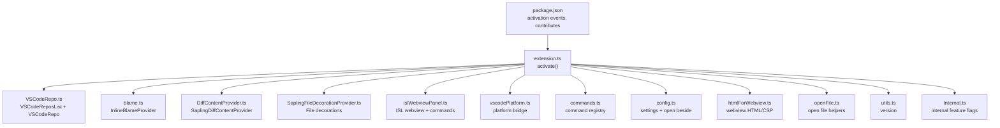
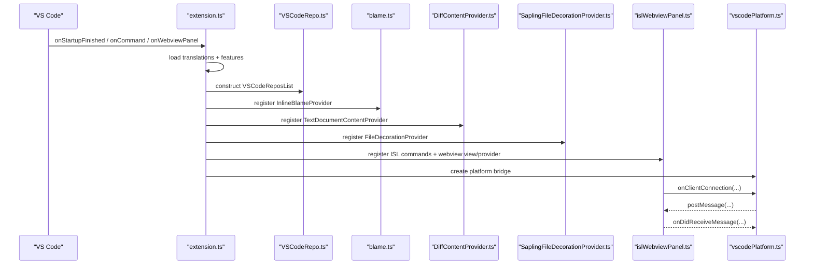
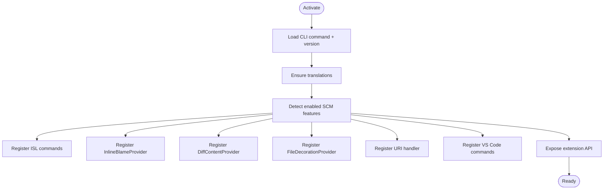
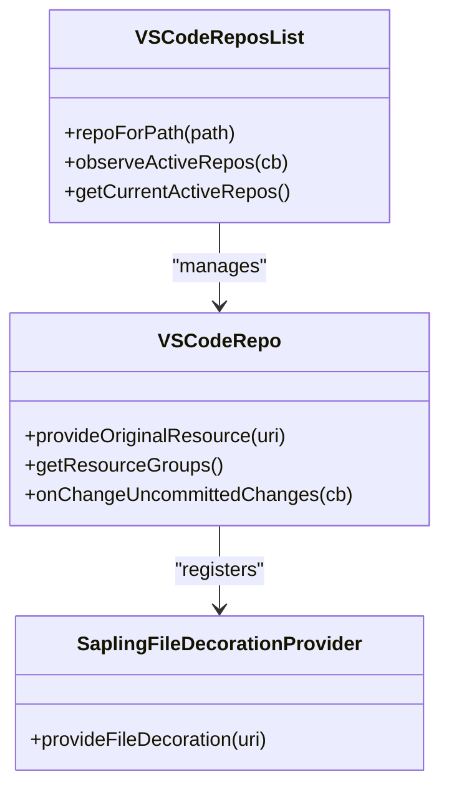
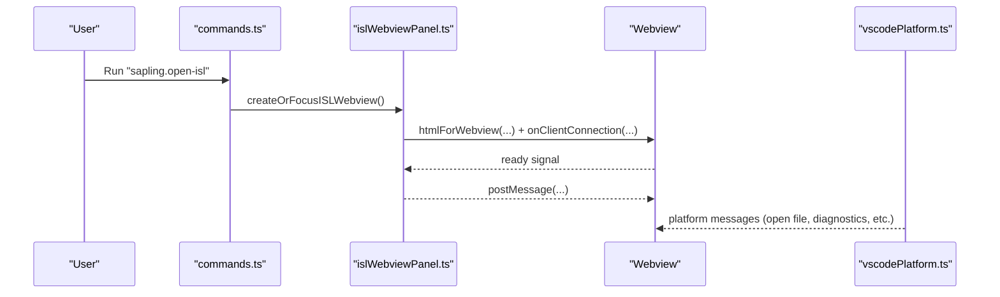
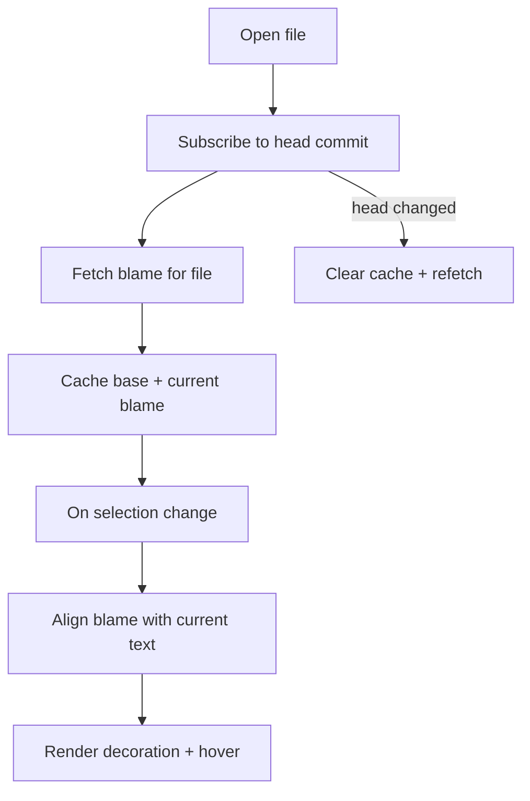
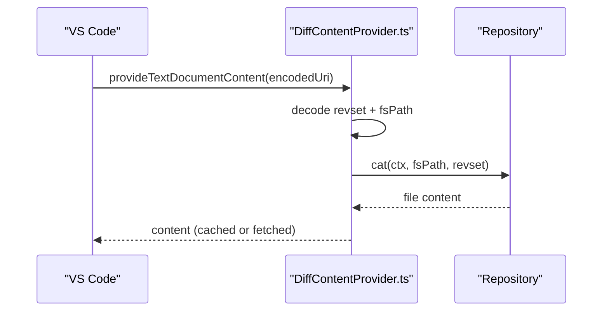
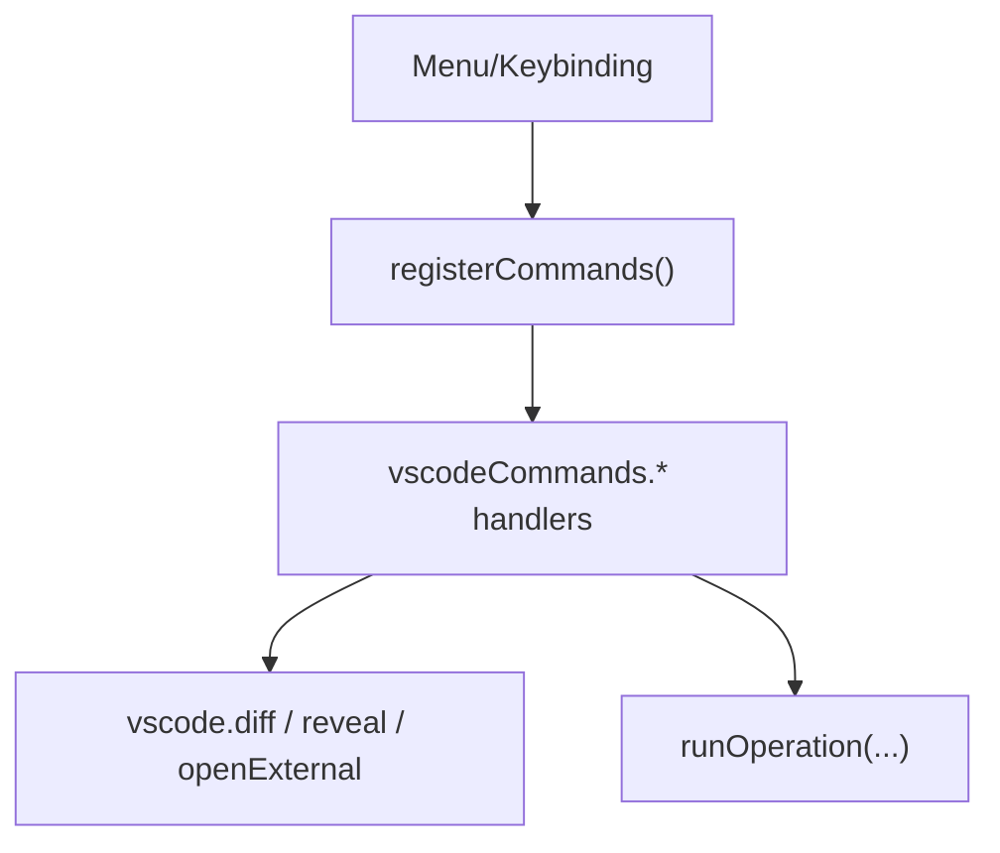
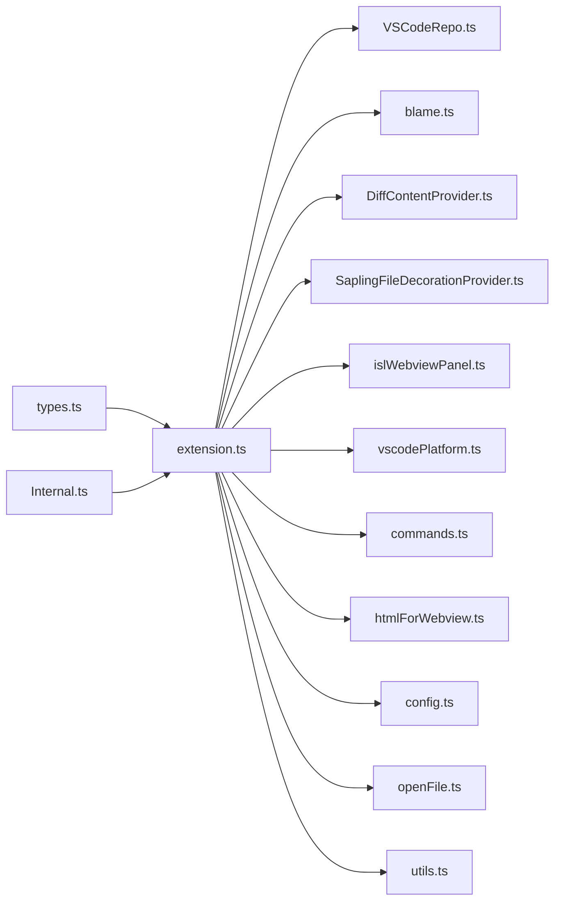

# VS Code Extension

<cite>
**Referenced Files in This Document**
- [package.json](file://addons/vscode/package.json)
- [extension.ts](file://addons/vscode/extension/extension.ts)
- [config.ts](file://addons/vscode/extension/config.ts)
- [commands.ts](file://addons/vscode/extension/commands.ts)
- [types.ts](file://addons/vscode/extension/types.ts)
- [blame.ts](file://addons/vscode/extension/blame/blame.ts)
- [DiffContentProvider.ts](file://addons/vscode/extension/DiffContentProvider.ts)
- [SaplingFileDecorationProvider.ts](file://addons/vscode/extension/SaplingFileDecorationProvider.ts)
- [islWebviewPanel.ts](file://addons/vscode/extension/islWebviewPanel.ts)
- [VSCodeRepo.ts](file://addons/vscode/extension/VSCodeRepo.ts)
- [htmlForWebview.ts](file://addons/vscode/extension/htmlForWebview.ts)
- [vscodePlatform.ts](file://addons/vscode/extension/vscodePlatform.ts)
- [openFile.ts](file://addons/vscode/extension/openFile.ts)
- [utils.ts](file://addons/vscode/extension/utils.ts)
- [Internal.ts](file://addons/vscode/extension/Internal.ts)
</cite>

## Table of Contents
1. [Introduction](#introduction)
2. [Project Structure](#project-structure)
3. [Core Components](#core-components)
4. [Architecture Overview](#architecture-overview)
5. [Detailed Component Analysis](#detailed-component-analysis)
6. [Dependency Analysis](#dependency-analysis)
7. [Performance Considerations](#performance-considerations)
8. [Troubleshooting Guide](#troubleshooting-guide)
9. [Conclusion](#conclusion)
10. [Appendices](#appendices)

## Introduction
This document describes the SAPLING SCM VS Code extension, focusing on its activation lifecycle, initialization workflow, and core features. It covers the webview panel integration, inline blame functionality, diff content provider, and file decoration system. It also documents installation, configuration, command registration, URI handler integration, and best practices for extending the extension.

## Project Structure
The extension is organized around a small set of TypeScript modules that integrate with VS Code’s SCM, webview, and content provider APIs. Key areas:
- Activation and initialization: extension bootstrap, platform setup, and feature toggles
- SCM integration: VS Code Source Control sidebar, resource groups, and decorations
- Webview: ISL interactive smartlog panel and comparison views
- Inline blame: live blame annotations and hover tooltips
- Diff provider: custom scheme for “before” content in VS Code diff views
- Commands and menus: command registration, keyboard shortcuts, and context menus
- Utilities: configuration, platform bridge, and file opening helpers

**Diagram sources**
- [package.json:14-306](file://addons/vscode/package.json#L14-L306)
- [extension.ts:31-109](file://addons/vscode/extension/extension.ts#L31-L109)
- [VSCodeRepo.ts:47-171](file://addons/vscode/extension/VSCodeRepo.ts#L47-L171)
- [blame.ts:71-488](file://addons/vscode/extension/blame/blame.ts#L71-L488)
- [DiffContentProvider.ts:26-225](file://addons/vscode/extension/DiffContentProvider.ts#L26-L225)
- [SaplingFileDecorationProvider.ts:21-76](file://addons/vscode/extension/SaplingFileDecorationProvider.ts#L21-L76)
- [islWebviewPanel.ts:217-369](file://addons/vscode/extension/islWebviewPanel.ts#L217-L369)
- [vscodePlatform.ts:50-448](file://addons/vscode/extension/vscodePlatform.ts#L50-L448)
- [commands.ts:149-164](file://addons/vscode/extension/commands.ts#L149-L164)
- [config.ts:18-29](file://addons/vscode/extension/config.ts#L18-L29)
- [htmlForWebview.ts:14-221](file://addons/vscode/extension/htmlForWebview.ts#L14-L221)
- [openFile.ts:25-94](file://addons/vscode/extension/openFile.ts#L25-L94)
- [utils.ts:12-14](file://addons/vscode/extension/utils.ts#L12-L14)
- [Internal.ts:27-30](file://addons/vscode/extension/Internal.ts#L27-L30)

**Section sources**
- [package.json:14-306](file://addons/vscode/package.json#L14-L306)
- [extension.ts:31-109](file://addons/vscode/extension/extension.ts#L31-L109)

## Core Components
- Activation and initialization
  - Reads CLI command path and extension version
  - Loads translations and determines enabled SCM API features
  - Registers ISL commands, diff content provider, inline blame, file decorations, and URI handler
  - Exposes extension API for other consumers
- VS Code SCM integration
  - Creates Source Control provider and resource groups for changes, untracked, unresolved, resolved
  - Provides quick diff for “before” content via custom scheme
  - Applies file decorations for status and conflict state
- Webview panel
  - Creates and manages ISL panel or sidebar view
  - Serializers/deserializers for persistence across reloads
  - Injects persisted state and passes messages to/from the client
- Inline blame
  - Fetches blame per file and aligns with local edits
  - Renders decorations and hover tooltips with commit metadata
- Diff content provider
  - Encodes file URIs with revsets and serves “before” content via custom scheme
  - Caches content and invalidates on head changes
- Commands and menus
  - Registers commands for opening diffs, reverting files, and managing ISL
  - Provides keyboard shortcuts and context menus
- Platform bridge
  - Bridges client-side messages to VS Code actions (open files, diagnostics, config updates)
  - Integrates with AI agents and internal features via Internal module

**Section sources**
- [extension.ts:31-109](file://addons/vscode/extension/extension.ts#L31-L109)
- [VSCodeRepo.ts:183-353](file://addons/vscode/extension/VSCodeRepo.ts#L183-L353)
- [islWebviewPanel.ts:217-369](file://addons/vscode/extension/islWebviewPanel.ts#L217-L369)
- [blame.ts:71-488](file://addons/vscode/extension/blame/blame.ts#L71-L488)
- [DiffContentProvider.ts:26-225](file://addons/vscode/extension/DiffContentProvider.ts#L26-L225)
- [commands.ts:149-298](file://addons/vscode/extension/commands.ts#L149-L298)
- [vscodePlatform.ts:50-448](file://addons/vscode/extension/vscodePlatform.ts#L50-L448)

## Architecture Overview
The extension initializes on activation, constructs a platform bridge, and registers multiple subsystems. The ISL webview communicates via a message bus, while VS Code SCM integrates with the repository abstraction.

**Diagram sources**
- [extension.ts:31-109](file://addons/vscode/extension/extension.ts#L31-L109)
- [VSCodeRepo.ts:47-171](file://addons/vscode/extension/VSCodeRepo.ts#L47-L171)
- [blame.ts:71-181](file://addons/vscode/extension/blame/blame.ts#L71-L181)
- [DiffContentProvider.ts:26-181](file://addons/vscode/extension/DiffContentProvider.ts#L26-L181)
- [SaplingFileDecorationProvider.ts:21-76](file://addons/vscode/extension/SaplingFileDecorationProvider.ts#L21-L76)
- [islWebviewPanel.ts:217-503](file://addons/vscode/extension/islWebviewPanel.ts#L217-L503)
- [vscodePlatform.ts:50-448](file://addons/vscode/extension/vscodePlatform.ts#L50-L448)

## Detailed Component Analysis

### Activation and Initialization
- Determines CLI command path and extension version
- Loads translations and feature flags
- Constructs platform bridge and repository list
- Registers commands, providers, and URI handler
- Tracks activation metrics and exposes API

**Diagram sources**
- [extension.ts:31-109](file://addons/vscode/extension/extension.ts#L31-L109)
- [utils.ts:12-14](file://addons/vscode/extension/utils.ts#L12-L14)
- [config.ts:18-24](file://addons/vscode/extension/config.ts#L18-L24)

**Section sources**
- [extension.ts:31-109](file://addons/vscode/extension/extension.ts#L31-L109)
- [utils.ts:12-14](file://addons/vscode/extension/utils.ts#L12-L14)
- [config.ts:18-24](file://addons/vscode/extension/config.ts#L18-L24)

### VS Code SCM Integration
- Creates Source Control provider and resource groups
- Provides quick diff via custom scheme
- Updates resource groups on status and conflict changes
- Applies decorations for file status and conflict resolution

**Diagram sources**
- [VSCodeRepo.ts:47-171](file://addons/vscode/extension/VSCodeRepo.ts#L47-L171)
- [VSCodeRepo.ts:183-353](file://addons/vscode/extension/VSCodeRepo.ts#L183-L353)
- [SaplingFileDecorationProvider.ts:21-76](file://addons/vscode/extension/SaplingFileDecorationProvider.ts#L21-L76)

**Section sources**
- [VSCodeRepo.ts:183-353](file://addons/vscode/extension/VSCodeRepo.ts#L183-L353)
- [SaplingFileDecorationProvider.ts:21-76](file://addons/vscode/extension/SaplingFileDecorationProvider.ts#L21-L76)

### Webview Panel Integration
- Creates or focuses ISL panel or sidebar view
- Manages serialization/deserialization and persisted state injection
- Handles ready signals and messaging with the client
- Supports comparison views and split view commands

**Diagram sources**
- [commands.ts:149-164](file://addons/vscode/extension/commands.ts#L149-L164)
- [islWebviewPanel.ts:217-503](file://addons/vscode/extension/islWebviewPanel.ts#L217-L503)
- [htmlForWebview.ts:120-221](file://addons/vscode/extension/htmlForWebview.ts#L120-L221)
- [vscodePlatform.ts:50-448](file://addons/vscode/extension/vscodePlatform.ts#L50-L448)

**Section sources**
- [islWebviewPanel.ts:217-503](file://addons/vscode/extension/islWebviewPanel.ts#L217-L503)
- [htmlForWebview.ts:120-221](file://addons/vscode/extension/htmlForWebview.ts#L120-L221)
- [vscodePlatform.ts:50-448](file://addons/vscode/extension/vscodePlatform.ts#L50-L448)

### Inline Blame
- Fetches blame per file and caches per-repo
- Realigns blame with local edits on text changes
- Renders decorations and hover tooltips
- Subscribes to head changes to invalidate caches

**Diagram sources**
- [blame.ts:71-488](file://addons/vscode/extension/blame/blame.ts#L71-L488)

**Section sources**
- [blame.ts:71-488](file://addons/vscode/extension/blame/blame.ts#L71-L488)

### Diff Content Provider
- Encodes file URIs with revset queries
- Serves “before” content via custom scheme
- Caches content and invalidates on head changes
- Tracks active URIs and notifies VS Code on changes

**Diagram sources**
- [DiffContentProvider.ts:26-181](file://addons/vscode/extension/DiffContentProvider.ts#L26-L181)

**Section sources**
- [DiffContentProvider.ts:26-181](file://addons/vscode/extension/DiffContentProvider.ts#L26-L181)

### Commands and Menus
- Registers commands for opening diffs, reverting files, and managing ISL
- Provides keyboard shortcuts and context menus
- Wraps handlers to accept URIs, resource states, or active editor

**Diagram sources**
- [commands.ts:149-298](file://addons/vscode/extension/commands.ts#L149-L298)

**Section sources**
- [commands.ts:149-298](file://addons/vscode/extension/commands.ts#L149-L298)

### URI Handler Integration
- Registers a URI handler to process external links
- Delegates to internal handler if available

**Section sources**
- [extension.ts:87-93](file://addons/vscode/extension/extension.ts#L87-L93)

### Platform Bridge
- Bridges client messages to VS Code actions
- Handles open file/diff, diagnostics, config updates, and AI prompts
- Manages persisted state and configuration subscriptions

**Section sources**
- [vscodePlatform.ts:50-448](file://addons/vscode/extension/vscodePlatform.ts#L50-L448)

## Dependency Analysis
- Feature flags control availability of blame, sidebar, diffview, comments, and AI features
- Internal module enables non-OSS features and hooks
- Webview HTML generation depends on dev/prod modes and CSP
- Commands depend on repository cache and VS Code APIs

**Diagram sources**
- [types.ts:14-29](file://addons/vscode/extension/types.ts#L14-L29)
- [extension.ts:31-109](file://addons/vscode/extension/extension.ts#L31-L109)
- [Internal.ts:27-30](file://addons/vscode/extension/Internal.ts#L27-L30)
- [VSCodeRepo.ts:47-171](file://addons/vscode/extension/VSCodeRepo.ts#L47-L171)
- [blame.ts:71-488](file://addons/vscode/extension/blame/blame.ts#L71-L488)
- [DiffContentProvider.ts:26-225](file://addons/vscode/extension/DiffContentProvider.ts#L26-L225)
- [SaplingFileDecorationProvider.ts:21-76](file://addons/vscode/extension/SaplingFileDecorationProvider.ts#L21-L76)
- [islWebviewPanel.ts:217-503](file://addons/vscode/extension/islWebviewPanel.ts#L217-L503)
- [vscodePlatform.ts:50-448](file://addons/vscode/extension/vscodePlatform.ts#L50-L448)
- [commands.ts:149-298](file://addons/vscode/extension/commands.ts#L149-L298)
- [htmlForWebview.ts:120-221](file://addons/vscode/extension/htmlForWebview.ts#L120-L221)
- [config.ts:18-29](file://addons/vscode/extension/config.ts#L18-L29)
- [openFile.ts:25-94](file://addons/vscode/extension/openFile.ts#L25-L94)
- [utils.ts:12-14](file://addons/vscode/extension/utils.ts#L12-L14)

**Section sources**
- [types.ts:14-29](file://addons/vscode/extension/types.ts#L14-L29)
- [extension.ts:31-109](file://addons/vscode/extension/extension.ts#L31-L109)

## Performance Considerations
- Debounce and throttle:
  - Inline blame debounces selection and text change events to reduce repaints
  - LRU caching for blame and diff content avoids repeated CLI calls
- Minimize work in critical path:
  - Feature detection and translation loading occur early but are lightweight
- Efficient invalidation:
  - Diff provider clears caches on head changes; blame clears on head/hash changes
- UI responsiveness:
  - Webview retains context and uses deferred ready signals
- Memory hygiene:
  - Disposes disposables and decorations when switching editors or deactivating

[No sources needed since this section provides general guidance]

## Troubleshooting Guide
- Extension fails to activate
  - Check CLI path configuration and ensure the command is available on PATH
  - Verify activation events and that the extension kind is workspace
- Webview not loading or blank
  - Confirm dev/prod mode and CSP settings
  - Check persisted state injection and migration logic
- Inline blame not appearing
  - Ensure feature flag is enabled and repository is recognized
  - Verify head commit subscription and cache population
- Diff view shows empty or incorrect content
  - Confirm custom scheme encoding and revset correctness
  - Check repository cache and head change invalidation
- SCM sidebar not showing
  - Verify feature flag for sidebar and repository presence
  - Ensure resource groups update on status/conflict changes
- Auto-resolve on save not working
  - Confirm setting is enabled and merge conflict markers are detected

**Section sources**
- [config.ts:18-24](file://addons/vscode/extension/config.ts#L18-L24)
- [package.json:14-306](file://addons/vscode/package.json#L14-L306)
- [islWebviewPanel.ts:547-634](file://addons/vscode/extension/islWebviewPanel.ts#L547-L634)
- [blame.ts:108-181](file://addons/vscode/extension/blame/blame.ts#L108-L181)
- [DiffContentProvider.ts:48-118](file://addons/vscode/extension/DiffContentProvider.ts#L48-L118)
- [VSCodeRepo.ts:204-241](file://addons/vscode/extension/VSCodeRepo.ts#L204-L241)
- [VSCodeRepo.ts:257-293](file://addons/vscode/extension/VSCodeRepo.ts#L257-L293)

## Conclusion
The SAPLING SCM VS Code extension integrates tightly with VS Code’s SCM, webview, and content provider APIs. Its modular design separates concerns across activation, SCM integration, webview communication, inline blame, diff serving, and command orchestration. With robust caching, debouncing, and configuration-driven feature flags, it balances performance and usability. The platform bridge and Internal module enable extensibility and integration with AI and internal systems.

[No sources needed since this section summarizes without analyzing specific files]

## Appendices

### Installation and Setup
- Install from marketplace or build locally
- Ensure the SAPLING CLI is installed and discoverable by the extension
- Configure the CLI path if not in PATH

**Section sources**
- [package.json:8-10](file://addons/vscode/package.json#L8-L10)
- [config.ts:18-24](file://addons/vscode/extension/config.ts#L18-L24)

### Configuration Options
- sapling.commandPath: override default CLI name
- sapling.showInlineBlame: toggle inline blame
- sapling.showDiffComments: toggle inline comments
- sapling.inlineCommentDiffViewMode: Unified or Split
- sapling.markConflictingFilesResolvedOnSave: auto-resolve on save
- sapling.comparisonPanelMode: Auto or Always Separate Panel
- sapling.isl.openBeside: open ISL/comparison beside current editor
- sapling.isl.showInSidebar: show ISL in sidebar
- sapling.isl.showOpenOrFocusButtonOnEditorTitle: show ISL button in editor title

**Section sources**
- [package.json:38-99](file://addons/vscode/package.json#L38-L99)
- [config.ts:27-29](file://addons/vscode/extension/config.ts#L27-L29)

### Command Registration and Menus
- Commands include open-diff variants, revert-file, open-isl, open-comparison-view, and more
- Menus: editor/context, editor/title, explorer/context, commandPalette, and SCM menus
- Keybindings: convenient shortcuts for ISL, comparison, comments, and toggles

**Section sources**
- [package.json:140-305](file://addons/vscode/package.json#L140-L305)
- [commands.ts:149-298](file://addons/vscode/extension/commands.ts#L149-L298)

### URI Handler Functionality
- Registers a URI handler for external links
- Delegates to internal handler if present

**Section sources**
- [extension.ts:87-93](file://addons/vscode/extension/extension.ts#L87-L93)

### Extending the Extension
- Add new commands via registerCommands and contribute them in package.json
- Extend platform bridge by adding new message types in vscodePlatform.ts
- Integrate with Internal module for non-OSS features
- Customize webview HTML/CSP via htmlForWebview.ts for dev/prod differences

**Section sources**
- [commands.ts:149-164](file://addons/vscode/extension/commands.ts#L149-L164)
- [vscodePlatform.ts:50-448](file://addons/vscode/extension/vscodePlatform.ts#L50-L448)
- [htmlForWebview.ts:120-221](file://addons/vscode/extension/htmlForWebview.ts#L120-L221)
- [Internal.ts:27-30](file://addons/vscode/extension/Internal.ts#L27-L30)