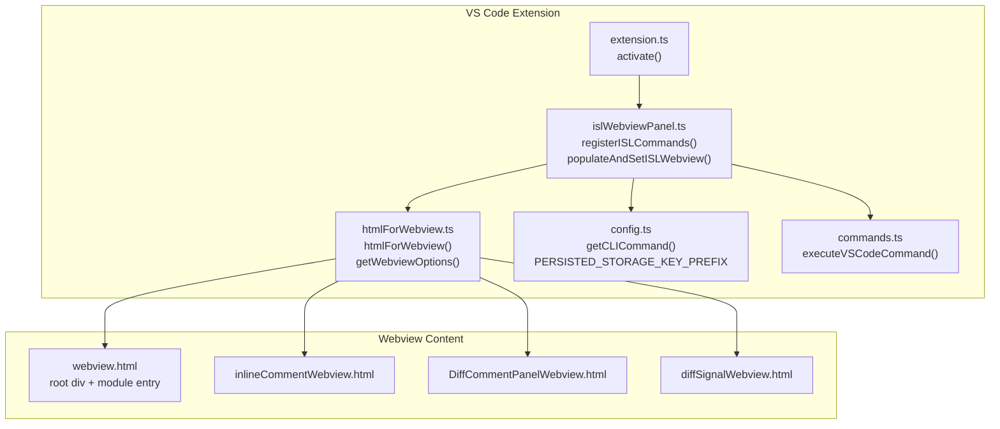
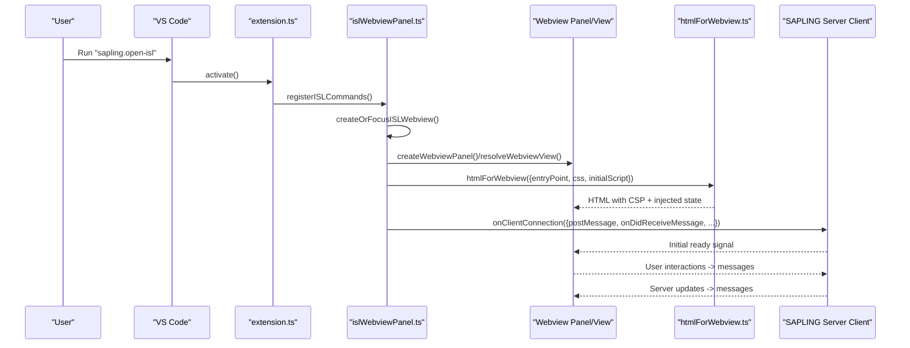
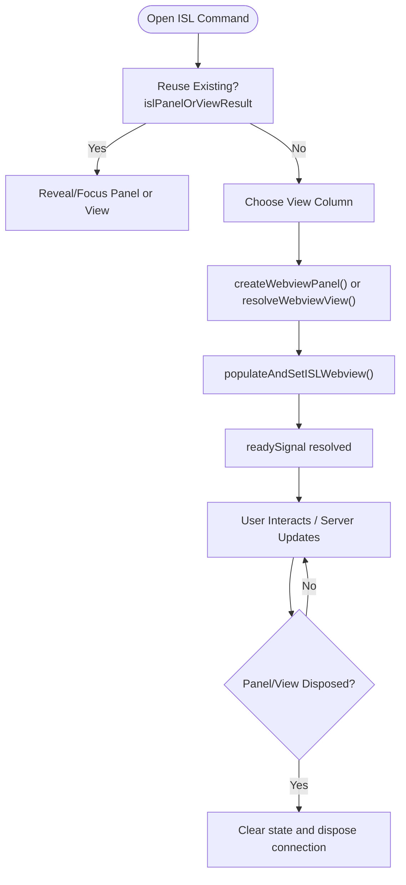
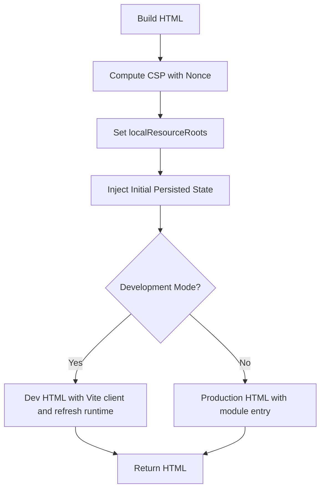
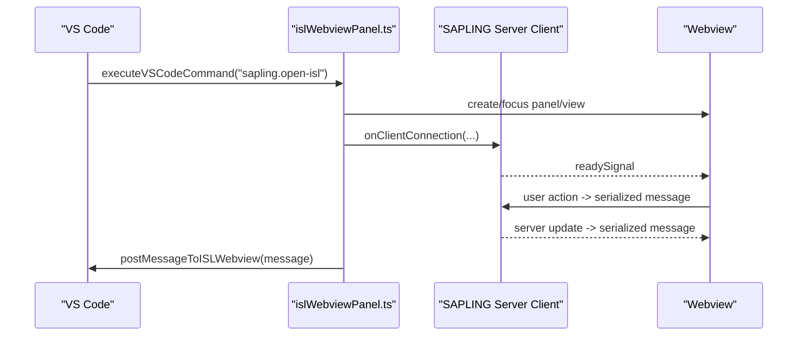
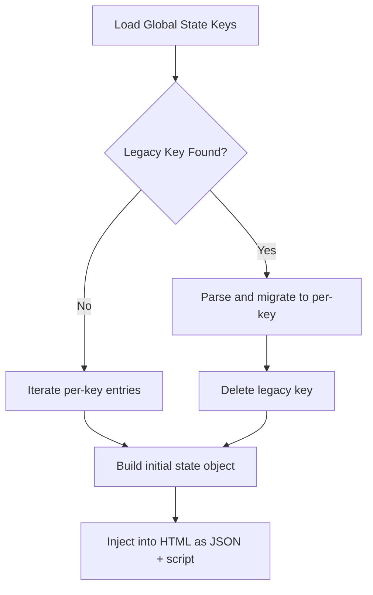
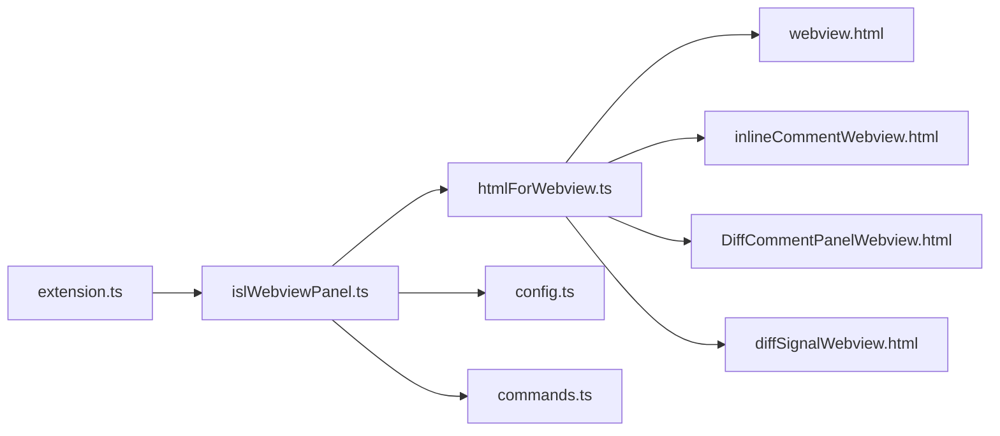

# Webview Panel Integration

<cite>
**Referenced Files in This Document**
- [islWebviewPanel.ts](file://addons/vscode/extension/islWebviewPanel.ts)
- [extension.ts](file://addons/vscode/extension/extension.ts)
- [htmlForWebview.ts](file://addons/vscode/extension/htmlForWebview.ts)
- [config.ts](file://addons/vscode/extension/config.ts)
- [commands.ts](file://addons/vscode/extension/commands.ts)
- [webview.html](file://addons/vscode/webview.html)
- [inlineCommentWebview.html](file://addons/vscode/inlineCommentWebview.html)
- [DiffCommentPanelWebview.html](file://addons/vscode/DiffCommentPanelWebview.html)
- [diffSignalWebview.html](file://addons/vscode/diffSignalWebview.html)
</cite>

## Table of Contents
1. [Introduction](#introduction)
2. [Project Structure](#project-structure)
3. [Core Components](#core-components)
4. [Architecture Overview](#architecture-overview)
5. [Detailed Component Analysis](#detailed-component-analysis)
6. [Dependency Analysis](#dependency-analysis)
7. [Performance Considerations](#performance-considerations)
8. [Troubleshooting Guide](#troubleshooting-guide)
9. [Conclusion](#conclusion)
10. [Appendices](#appendices)

## Introduction
This document explains the VS Code extension’s webview panel integration for the SAPLING interactive smartlog (ISL) interface. It covers the webview architecture, initialization, message passing, state management, real-time synchronization with the SAPLING server, lifecycle handling, customization, security, and performance considerations. It also provides guidance for extending the integration with custom commands and debugging techniques.

## Project Structure
The webview integration spans several files:
- Extension activation and registration orchestrate creation and lifecycle of the ISL webview panel or sidebar view.
- Webview HTML generation enforces strict CSP and resource roots.
- Configuration controls CLI path, persistence key prefixes, and layout preferences.
- Commands expose VS Code actions that open or focus the webview and pass initial data.
- Additional webview HTML templates exist for other comment and signal panels.

**Diagram sources**
- [extension.ts:31-109](file://addons/vscode/extension/extension.ts#L31-L109)
- [islWebviewPanel.ts:217-369](file://addons/vscode/extension/islWebviewPanel.ts#L217-L369)
- [htmlForWebview.ts:14-221](file://addons/vscode/extension/htmlForWebview.ts#L14-L221)
- [config.ts:11-30](file://addons/vscode/extension/config.ts#L11-L30)
- [commands.ts:119-129](file://addons/vscode/extension/commands.ts#L119-L129)
- [webview.html:1-13](file://addons/vscode/webview.html#L1-L13)
- [inlineCommentWebview.html:1-15](file://addons/vscode/inlineCommentWebview.html#L1-L15)
- [DiffCommentPanelWebview.html:1-16](file://addons/vscode/DiffCommentPanelWebview.html#L1-L16)
- [diffSignalWebview.html:1-13](file://addons/vscode/diffSignalWebview.html#L1-L13)

**Section sources**
- [extension.ts:31-109](file://addons/vscode/extension/extension.ts#L31-L109)
- [islWebviewPanel.ts:217-369](file://addons/vscode/extension/islWebviewPanel.ts#L217-L369)
- [htmlForWebview.ts:14-221](file://addons/vscode/extension/htmlForWebview.ts#L14-L221)
- [config.ts:11-30](file://addons/vscode/extension/config.ts#L11-L30)
- [commands.ts:119-129](file://addons/vscode/extension/commands.ts#L119-L129)
- [webview.html:1-13](file://addons/vscode/webview.html#L1-L13)
- [inlineCommentWebview.html:1-15](file://addons/vscode/inlineCommentWebview.html#L1-L15)
- [DiffCommentPanelWebview.html:1-16](file://addons/vscode/DiffCommentPanelWebview.html#L1-L16)
- [diffSignalWebview.html:1-13](file://addons/vscode/diffSignalWebview.html#L1-L13)

## Core Components
- ISL webview panel or sidebar view provider:
  - Creates or focuses the ISL webview, manages reuse, and handles orphaned tabs after extension host restarts.
  - Supports both WebviewPanel and WebviewView modes, controlled by configuration.
- HTML generation and CSP:
  - Builds a secure HTML shell with strict Content-Security-Policy, nonce-based script enforcement, and restricted localResourceRoots.
- Message passing bridge:
  - Bridges VS Code webview.postMessage/onDidReceiveMessage to the SAPLING server client.
  - Serializes/deserializes messages for transport.
- State persistence injection:
  - Loads persisted state from extension global storage and injects it into the webview at startup.
- Commands:
  - Exposes VS Code commands to open/close ISL, open comparison views, and pass initial data (commit message, split view selection).

**Section sources**
- [islWebviewPanel.ts:93-134](file://addons/vscode/extension/islWebviewPanel.ts#L93-L134)
- [islWebviewPanel.ts:166-168](file://addons/vscode/extension/islWebviewPanel.ts#L166-L168)
- [islWebviewPanel.ts:181-215](file://addons/vscode/extension/islWebviewPanel.ts#L181-L215)
- [islWebviewPanel.ts:398-420](file://addons/vscode/extension/islWebviewPanel.ts#L398-L420)
- [islWebviewPanel.ts:433-503](file://addons/vscode/extension/islWebviewPanel.ts#L433-L503)
- [htmlForWebview.ts:14-28](file://addons/vscode/extension/htmlForWebview.ts#L14-L28)
- [htmlForWebview.ts:180-191](file://addons/vscode/extension/htmlForWebview.ts#L180-L191)
- [htmlForWebview.ts:192-216](file://addons/vscode/extension/htmlForWebview.ts#L192-L216)
- [islWebviewPanel.ts:473-490](file://addons/vscode/extension/islWebviewPanel.ts#L473-L490)
- [islWebviewPanel.ts:547-634](file://addons/vscode/extension/islWebviewPanel.ts#L547-L634)
- [commands.ts:36-72](file://addons/vscode/extension/commands.ts#L36-L72)
- [commands.ts:79-113](file://addons/vscode/extension/commands.ts#L79-L113)
- [commands.ts:123-129](file://addons/vscode/extension/commands.ts#L123-L129)

## Architecture Overview
The integration consists of:
- VS Code extension activation registers commands and providers.
- A command triggers creation/focusing of the ISL webview panel or sidebar view.
- The panel/view HTML is generated with CSP and injected initial state.
- A connection to the SAPLING server is established via a client bridge that forwards messages between VS Code and the webview.
- Real-time updates are synchronized through the server and message protocol.

**Diagram sources**
- [extension.ts:31-109](file://addons/vscode/extension/extension.ts#L31-L109)
- [islWebviewPanel.ts:103-134](file://addons/vscode/extension/islWebviewPanel.ts#L103-L134)
- [islWebviewPanel.ts:408-420](file://addons/vscode/extension/islWebviewPanel.ts#L408-L420)
- [islWebviewPanel.ts:453-470](file://addons/vscode/extension/islWebviewPanel.ts#L453-L470)
- [htmlForWebview.ts:120-216](file://addons/vscode/extension/htmlForWebview.ts#L120-L216)
- [islWebviewPanel.ts:473-490](file://addons/vscode/extension/islWebviewPanel.ts#L473-L490)

## Detailed Component Analysis

### Webview Panel Creation and Lifecycle
- Creation:
  - Uses a unique viewType to identify the ISL webview.
  - Determines the target view column based on active editor or configuration.
  - Applies webview options including localResourceRoots and retainContextWhenHidden.
- Focus/reuse:
  - Reuses an existing panel/view if available; otherwise creates a new one.
- Sidebar view:
  - Supports a VS Code WebviewView provider that lives in the sidebar.
- Orphaned tab handling:
  - Detects and replaces orphaned ISL tabs after extension host restarts.
- Disposal:
  - Clears internal references and disposes the connection when the panel/view is disposed.

**Diagram sources**
- [islWebviewPanel.ts:103-134](file://addons/vscode/extension/islWebviewPanel.ts#L103-L134)
- [islWebviewPanel.ts:181-215](file://addons/vscode/extension/islWebviewPanel.ts#L181-L215)
- [islWebviewPanel.ts:433-503](file://addons/vscode/extension/islWebviewPanel.ts#L433-L503)

**Section sources**
- [islWebviewPanel.ts:93-134](file://addons/vscode/extension/islWebviewPanel.ts#L93-L134)
- [islWebviewPanel.ts:166-168](file://addons/vscode/extension/islWebviewPanel.ts#L166-L168)
- [islWebviewPanel.ts:181-215](file://addons/vscode/extension/islWebviewPanel.ts#L181-L215)
- [islWebviewPanel.ts:433-503](file://addons/vscode/extension/islWebviewPanel.ts#L433-L503)

### HTML Generation, CSP, and Security
- CSP policy:
  - Enforced via a Content-Security-Policy meta tag with sources from webview.cspSource and a strict nonce for script-src and script-src-elem.
  - Includes worker-src and style-src-elem allowances compatible with VS Code webview UI.
- Resource roots:
  - localResourceRoots restricts loading to the extension’s output directory plus optional dev server mapping.
- Dev mode:
  - In development, a base href points to the dev server and hot reload scripts are injected; CSP is relaxed for convenience.
- Initial state injection:
  - Persisted state is injected as a JSON element and parsed by a small script to initialize the webview runtime state.

**Diagram sources**
- [htmlForWebview.ts:14-28](file://addons/vscode/extension/htmlForWebview.ts#L14-L28)
- [htmlForWebview.ts:180-191](file://addons/vscode/extension/htmlForWebview.ts#L180-L191)
- [htmlForWebview.ts:192-216](file://addons/vscode/extension/htmlForWebview.ts#L192-L216)
- [htmlForWebview.ts:72-117](file://addons/vscode/extension/htmlForWebview.ts#L72-L117)
- [islWebviewPanel.ts:547-634](file://addons/vscode/extension/islWebviewPanel.ts#L547-L634)

**Section sources**
- [htmlForWebview.ts:14-28](file://addons/vscode/extension/htmlForWebview.ts#L14-L28)
- [htmlForWebview.ts:180-191](file://addons/vscode/extension/htmlForWebview.ts#L180-L191)
- [htmlForWebview.ts:192-216](file://addons/vscode/extension/htmlForWebview.ts#L192-L216)
- [htmlForWebview.ts:72-117](file://addons/vscode/extension/htmlForWebview.ts#L72-L117)
- [islWebviewPanel.ts:547-634](file://addons/vscode/extension/islWebviewPanel.ts#L547-L634)

### Message Passing Protocol and Real-Time Synchronization
- Bridge:
  - The client connection wraps VS Code’s postMessage and onDidReceiveMessage to communicate with the SAPLING server.
  - Binary messages are supported by checking the message type.
- Protocol:
  - Messages are serialized/deserialized using a shared serialization mechanism.
  - The webview sends user actions; the server responds with updates.
- Example flows:
  - Open ISL with commit message: waits for readySignal, then posts an update message.
  - Open split view with commits: expands line ranges, posts a single open-and-apply message.

**Diagram sources**
- [islWebviewPanel.ts:247-280](file://addons/vscode/extension/islWebviewPanel.ts#L247-L280)
- [islWebviewPanel.ts:281-326](file://addons/vscode/extension/islWebviewPanel.ts#L281-L326)
- [islWebviewPanel.ts:473-490](file://addons/vscode/extension/islWebviewPanel.ts#L473-L490)
- [islWebviewPanel.ts:509-515](file://addons/vscode/extension/islWebviewPanel.ts#L509-L515)

**Section sources**
- [islWebviewPanel.ts:247-280](file://addons/vscode/extension/islWebviewPanel.ts#L247-L280)
- [islWebviewPanel.ts:281-326](file://addons/vscode/extension/islWebviewPanel.ts#L281-L326)
- [islWebviewPanel.ts:473-490](file://addons/vscode/extension/islWebviewPanel.ts#L473-L490)
- [islWebviewPanel.ts:509-515](file://addons/vscode/extension/islWebviewPanel.ts#L509-L515)

### State Management and Persistence
- Persistence keys:
  - Uses a prefixed key scheme to store individual state segments in global storage.
- Migration:
  - Migrates legacy single-key state to per-key entries and deletes the legacy key.
- Injection:
  - Generates a JSON element and a small script to initialize window.islInitialPersistedState for the webview.
- Retrieval:
  - Provides a method to request UI state from the webview and receive a serialized response.

**Diagram sources**
- [islWebviewPanel.ts:547-634](file://addons/vscode/extension/islWebviewPanel.ts#L547-L634)
- [config.ts:11](file://addons/vscode/extension/config.ts#L11)

**Section sources**
- [islWebviewPanel.ts:547-634](file://addons/vscode/extension/islWebviewPanel.ts#L547-L634)
- [config.ts:11](file://addons/vscode/extension/config.ts#L11)

### Customization and Theming
- Root class:
  - Applies a root class to distinguish panel versus view rendering for styling.
- Extra styles:
  - Supports injecting extra CSS into the webview head.
- VS Code compatibility:
  - Applies editor settings (ligatures, tab size) to the webview via computed CSS variables.
- Icons:
  - Sets a favicon icon for the panel.

**Section sources**
- [islWebviewPanel.ts:453-470](file://addons/vscode/extension/islWebviewPanel.ts#L453-L470)
- [htmlForWebview.ts:35-64](file://addons/vscode/extension/htmlForWebview.ts#L35-L64)
- [islWebviewPanel.ts:447-452](file://addons/vscode/extension/islWebviewPanel.ts#L447-L452)

### Handling User Interactions and Commands
- Open/close:
  - Commands to open/close ISL and to open comparison views by type.
- Programmatic open with data:
  - Commands to open ISL with a pre-filled commit message or to open a split view with selected commits.
- Sidebar toggle:
  - Switching between panel and sidebar view respects configuration and disposes the opposite.

**Section sources**
- [commands.ts:36-72](file://addons/vscode/extension/commands.ts#L36-L72)
- [commands.ts:79-113](file://addons/vscode/extension/commands.ts#L79-L113)
- [islWebviewPanel.ts:235-369](file://addons/vscode/extension/islWebviewPanel.ts#L235-L369)

## Dependency Analysis
- Extension activation depends on:
  - Platform abstraction and logger initialization.
  - Registration of ISL commands and providers.
- ISL panel/provider depends on:
  - HTML generation utilities for CSP and resource roots.
  - Configuration for CLI path and layout preferences.
  - Commands for programmatic control.
- Webview content depends on:
  - The generated HTML template and injected state.

**Diagram sources**
- [extension.ts:31-109](file://addons/vscode/extension/extension.ts#L31-L109)
- [islWebviewPanel.ts:217-369](file://addons/vscode/extension/islWebviewPanel.ts#L217-L369)
- [htmlForWebview.ts:14-221](file://addons/vscode/extension/htmlForWebview.ts#L14-L221)
- [config.ts:11-30](file://addons/vscode/extension/config.ts#L11-L30)
- [commands.ts:119-129](file://addons/vscode/extension/commands.ts#L119-L129)
- [webview.html:1-13](file://addons/vscode/webview.html#L1-L13)
- [inlineCommentWebview.html:1-15](file://addons/vscode/inlineCommentWebview.html#L1-L15)
- [DiffCommentPanelWebview.html:1-16](file://addons/vscode/DiffCommentPanelWebview.html#L1-L16)
- [diffSignalWebview.html:1-13](file://addons/vscode/diffSignalWebview.html#L1-L13)

**Section sources**
- [extension.ts:31-109](file://addons/vscode/extension/extension.ts#L31-L109)
- [islWebviewPanel.ts:217-369](file://addons/vscode/extension/islWebviewPanel.ts#L217-L369)
- [htmlForWebview.ts:14-221](file://addons/vscode/extension/htmlForWebview.ts#L14-L221)
- [config.ts:11-30](file://addons/vscode/extension/config.ts#L11-L30)
- [commands.ts:119-129](file://addons/vscode/extension/commands.ts#L119-L129)
- [webview.html:1-13](file://addons/vscode/webview.html#L1-L13)
- [inlineCommentWebview.html:1-15](file://addons/vscode/inlineCommentWebview.html#L1-L15)
- [DiffCommentPanelWebview.html:1-16](file://addons/vscode/DiffCommentPanelWebview.html#L1-L16)
- [diffSignalWebview.html:1-13](file://addons/vscode/diffSignalWebview.html#L1-L13)

## Performance Considerations
- Retain context when hidden:
  - Using retainContextWhenHidden reduces re-initialization costs when switching tabs.
- Minimize state updates:
  - Persisted state is stored per key and injected once at startup to avoid frequent full-state transfers.
- Avoid blocking operations:
  - Defer non-critical initialization steps to keep the first ISL load responsive.
- Binary message support:
  - Efficiently handle binary payloads when supported by the underlying transport.

[No sources needed since this section provides general guidance]

## Troubleshooting Guide
- Webview not loading:
  - Verify CSP and localResourceRoots are correctly set.
  - Ensure the entry point file exists in the expected output directory.
- Messages not received:
  - Confirm the client connection is established and onDidReceiveMessage is wired.
  - Check that messages are serialized/deserialized consistently.
- Orphaned tabs after restart:
  - The integration detects and replaces orphaned ISL tabs; confirm configuration and disposal logic.
- State not applied:
  - Verify the injected initial state script runs and parses correctly.
- Sidebar vs panel conflicts:
  - Toggle configuration and ensure the appropriate provider is used.

**Section sources**
- [htmlForWebview.ts:14-28](file://addons/vscode/extension/htmlForWebview.ts#L14-L28)
- [htmlForWebview.ts:180-191](file://addons/vscode/extension/htmlForWebview.ts#L180-L191)
- [islWebviewPanel.ts:181-215](file://addons/vscode/extension/islWebviewPanel.ts#L181-L215)
- [islWebviewPanel.ts:547-634](file://addons/vscode/extension/islWebviewPanel.ts#L547-L634)

## Conclusion
The SAPLING VS Code extension integrates a secure, configurable, and efficient webview panel for the ISL interface. It supports both panel and sidebar modes, enforces strict CSP, injects persisted state, and provides robust message bridging to the SAPLING server. The architecture enables real-time synchronization, customizable appearance, and extensible command integration.

[No sources needed since this section summarizes without analyzing specific files]

## Appendices

### Appendix A: Example Customizations
- Customize appearance:
  - Add extra CSS via the extraStyles parameter when generating HTML.
  - Apply a root class to target panel or view-specific styles.
- Handle user interactions:
  - Register new VS Code commands and route them to the webview using postMessageToISLWebview.
- Implement custom commands:
  - Extend the command registry to open specialized views or pass structured data to the webview.

**Section sources**
- [htmlForWebview.ts:35-64](file://addons/vscode/extension/htmlForWebview.ts#L35-L64)
- [islWebviewPanel.ts:509-515](file://addons/vscode/extension/islWebviewPanel.ts#L509-L515)
- [commands.ts:119-129](file://addons/vscode/extension/commands.ts#L119-L129)