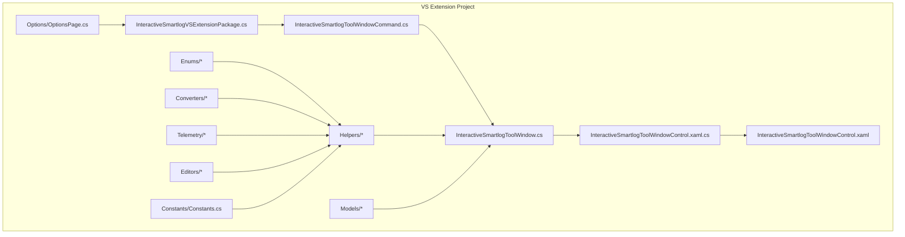
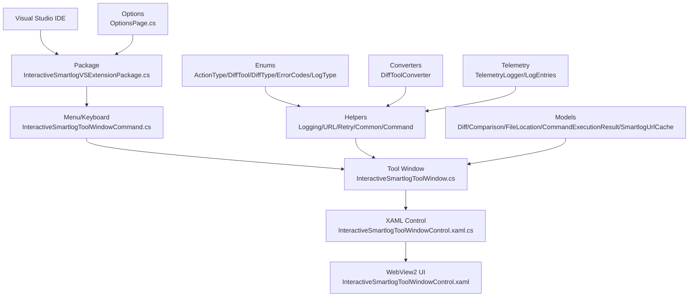
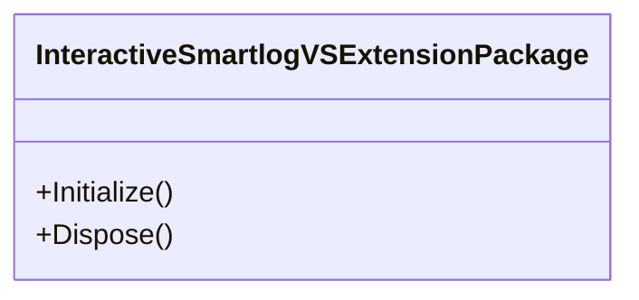
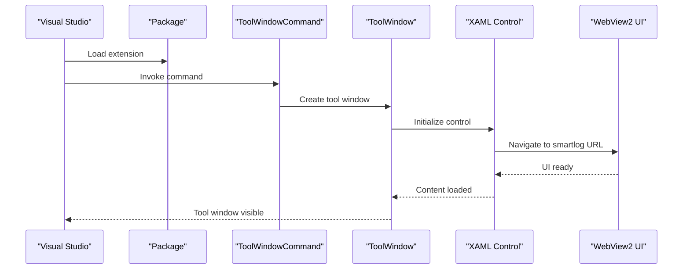
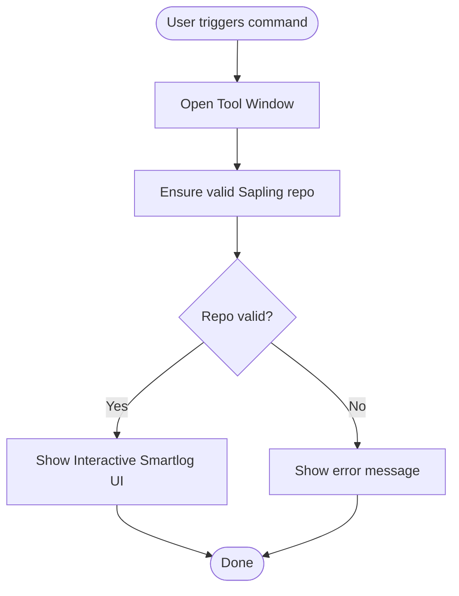
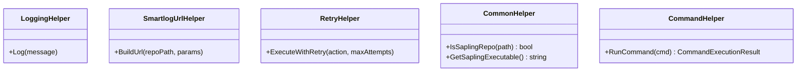
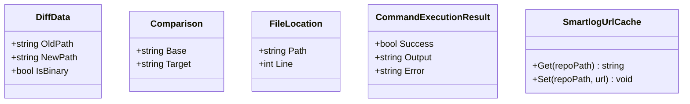
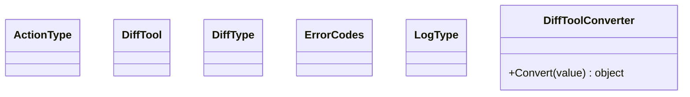
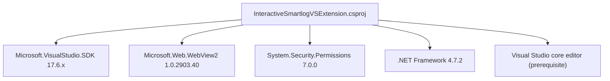

# Visual Studio Extension

<cite>
**Referenced Files in This Document**
- [README.md](file://addons/vs/README.md)
- [CONTRIBUTING.md](file://addons/vs/CONTRIBUTING.md)
- [InteractiveSmartlogVSExtension.sln](file://addons/vs/InteractiveSmartlogVSExtension/InteractiveSmartlogVSExtension.sln)
- [InteractiveSmartlogVSExtension.csproj](file://addons/vs/InteractiveSmartlogVSExtension/InteractiveSmartlogVSExtension/InteractiveSmartlogVSExtension.csproj)
- [source.extension.vsixmanifest](file://addons/vs/InteractiveSmartlogVSExtension/InteractiveSmartlogVSExtension/source.extension.vsixmanifest)
- [InteractiveSmartlogVSExtensionPackage.cs](file://addons/vs/InteractiveSmartlogVSExtension/InteractiveSmartlogVSExtension/InteractiveSmartlogVSExtensionPackage.cs)
- [InteractiveSmartlogToolWindow.cs](file://addons/vs/InteractiveSmartlogVSExtension/InteractiveSmartlogVSExtension/ToolWindows/InteractiveSmartlogToolWindow.cs)
- [InteractiveSmartlogToolWindowControl.xaml.cs](file://addons/vs/InteractiveSmartlogVSExtension/InteractiveSmartlogVSExtension/ToolWindows/InteractiveSmartlogToolWindowControl.xaml.cs)
- [InteractiveSmartlogToolWindowControl.xaml](file://addons/vs/InteractiveSmartlogVSExtension/InteractiveSmartlogVSExtension/ToolWindows/InteractiveSmartlogToolWindowControl.xaml)
- [InteractiveSmartlogCommands.cs](file://addons/vs/InteractiveSmartlogVSExtension/InteractiveSmartlogVSExtension/Commands/InteractiveSmartlogCommands.cs)
- [InteractiveSmartlogToolWindowCommand.cs](file://addons/vs/InteractiveSmartlogVSExtension/InteractiveSmartlogVSExtension/Commands/InteractiveSmartlogToolWindowCommand.cs)
- [OptionsPage.cs](file://addons/vs/InteractiveSmartlogVSExtension/InteractiveSmartlogVSExtension/Options/OptionsPage.cs)
- [LoggingHelper.cs](file://addons/vs/InteractiveSmartlogVSExtension/InteractiveSmartlogVSExtension/Helpers/LoggingHelper.cs)
- [SmartlogUrlHelper.cs](file://addons/vs/InteractiveSmartlogVSExtension/InteractiveSmartlogVSExtension/Helpers/SmartlogUrlHelper.cs)
- [RetryHelper.cs](file://addons/vs/InteractiveSmartlogVSExtension/InteractiveSmartlogVSExtension/Helpers/RetryHelper.cs)
- [CommonHelper.cs](file://addons/vs/InteractiveSmartlogVSExtension/InteractiveSmartlogVSExtension/Helpers/CommonHelper.cs)
- [CommandHelper.cs](file://addons/vs/InteractiveSmartlogVSExtension/InteractiveSmartlogVSExtension/Helpers/CommandHelper.cs)
- [TelemetryLogger.cs](file://addons/vs/InteractiveSmartlogVSExtension/InteractiveSmartlogVSExtension/Telemetry/TelemetryLogger.cs)
- [LogEntries.cs](file://addons/vs/InteractiveSmartlogVSExtension/InteractiveSmartlogVSExtension/Telemetry/LogEntries.cs)
- [DiffToolConverter.cs](file://addons/vs/InteractiveSmartlogVSExtension/InteractiveSmartlogVSExtension/Converters/DiffToolConverter.cs)
- [DiffData.cs](file://addons/vs/InteractiveSmartlogVSExtension/InteractiveSmartlogVSExtension/Models/DiffData.cs)
- [Comparison.cs](file://addons/vs/InteractiveSmartlogVSExtension/InteractiveSmartlogVSExtension/Models/Comparison.cs)
- [FileLocation.cs](file://addons/vs/InteractiveSmartlogVSExtension/InteractiveSmartlogVSExtension/Models/FileLocation.cs)
- [CommandExecutionResult.cs](file://addons/vs/InteractiveSmartlogVSExtension/InteractiveSmartlogVSExtension/Models/CommandExecutionResult.cs)
- [SmartlogUrlCache.cs](file://addons/vs/InteractiveSmartlogVSExtension/InteractiveSmartlogVSExtension/Models/SmartlogUrlCache.cs)
- [FilePickerEditor.cs](file://addons/vs/InteractiveSmartlogVSExtension/InteractiveSmartlogVSExtension/Editors/FilePickerEditor.cs)
- [Constants.cs](file://addons/vs/InteractiveSmartlogVSExtension/InteractiveSmartlogVSExtension/Constants/Constants.cs)
- [ActionType.cs](file://addons/vs/InteractiveSmartlogVSExtension/InteractiveSmartlogVSExtension/Enums/ActionType.cs)
- [DiffTool.cs](file://addons/vs/InteractiveSmartlogVSExtension/InteractiveSmartlogVSExtension/Enums/DiffTool.cs)
- [DiffType.cs](file://addons/vs/InteractiveSmartlogVSExtension/InteractiveSmartlogVSExtension/Enums/DiffType.cs)
- [ErrorCodes.cs](file://addons/vs/InteractiveSmartlogVSExtension/InteractiveSmartlogVSExtension/Enums/ErrorCodes.cs)
- [LogType.cs](file://addons/vs/InteractiveSmartlogVSExtension/InteractiveSmartlogVSExtension/Enums/LogType.cs)
</cite>

## Table of Contents
1. [Introduction](#introduction)
2. [Project Structure](#project-structure)
3. [Core Components](#core-components)
4. [Architecture Overview](#architecture-overview)
5. [Detailed Component Analysis](#detailed-component-analysis)
6. [Dependency Analysis](#dependency-analysis)
7. [Performance Considerations](#performance-considerations)
8. [Troubleshooting Guide](#troubleshooting-guide)
9. [Conclusion](#conclusion)
10. [Appendices](#appendices)

## Introduction
This document describes the SAPLING SCM Visual Studio extension that provides an Interactive Smartlog tool window integrated into Visual Studio. It enables developers to view commit history, manage changes, and perform source control operations directly from the IDE. The extension relies on the Sapling SCM CLI being installed on the system and communicates with a WebView2-hosted UI to present the interactive smartlog interface.

Key capabilities:
- Launches an Interactive Smartlog tool window from Visual Studio
- Integrates with WebView2 to render the smartlog UI
- Provides commands and menu items to open the tool window and reload content
- Includes logging, telemetry, and helper utilities for robust operation

Limitations compared to the VS Code extension:
- This repository focuses on the Visual Studio extension; specific feature parity is not documented here. Refer to the VS Code extension documentation for a complete comparison of features.

Supported Visual Studio versions:
- Visual Studio 2022 (Community, Professional, Enterprise)
- Minimum Visual Studio version requirement is 17.0 as defined in the project configuration

## Project Structure
The extension is organized as a Visual Studio SDK project with XAML-based tool window, command handlers, helpers, models, converters, enums, and telemetry/logging components.

**Diagram sources**
- [InteractiveSmartlogVSExtensionPackage.cs](file://addons/vs/InteractiveSmartlogVSExtension/InteractiveSmartlogVSExtension/InteractiveSmartlogVSExtensionPackage.cs)
- [InteractiveSmartlogToolWindowCommand.cs](file://addons/vs/InteractiveSmartlogVSExtension/InteractiveSmartlogVSExtension/Commands/InteractiveSmartlogToolWindowCommand.cs)
- [InteractiveSmartlogToolWindow.cs](file://addons/vs/InteractiveSmartlogVSExtension/InteractiveSmartlogVSExtension/ToolWindows/InteractiveSmartlogToolWindow.cs)
- [InteractiveSmartlogToolWindowControl.xaml.cs](file://addons/vs/InteractiveSmartlogVSExtension/InteractiveSmartlogVSExtension/ToolWindows/InteractiveSmartlogToolWindowControl.xaml.cs)
- [InteractiveSmartlogToolWindowControl.xaml](file://addons/vs/InteractiveSmartlogVSExtension/InteractiveSmartlogVSExtension/ToolWindows/InteractiveSmartlogToolWindowControl.xaml)
- [Helpers](file://addons/vs/InteractiveSmartlogVSExtension/InteractiveSmartlogVSExtension/Helpers)
- [Models](file://addons/vs/InteractiveSmartlogVSExtension/InteractiveSmartlogVSExtension/Models)
- [Enums](file://addons/vs/InteractiveSmartlogVSExtension/InteractiveSmartlogVSExtension/Enums)
- [Converters](file://addons/vs/InteractiveSmartlogVSExtension/InteractiveSmartlogVSExtension/Converters)
- [Telemetry](file://addons/vs/InteractiveSmartlogVSExtension/InteractiveSmartlogVSExtension/Telemetry)
- [Editors](file://addons/vs/InteractiveSmartlogVSExtension/InteractiveSmartlogVSExtension/Editors)
- [OptionsPage.cs](file://addons/vs/InteractiveSmartlogVSExtension/InteractiveSmartlogVSExtension/Options/OptionsPage.cs)
- [Constants.cs](file://addons/vs/InteractiveSmartlogVSExtension/InteractiveSmartlogVSExtension/Constants/Constants.cs)

**Section sources**
- [InteractiveSmartlogVSExtension.sln](file://addons/vs/InteractiveSmartlogVSExtension/InteractiveSmartlogVSExtension.sln)
- [InteractiveSmartlogVSExtension.csproj](file://addons/vs/InteractiveSmartlogVSExtension/InteractiveSmartlogVSExtension/InteractiveSmartlogVSExtension.csproj)

## Core Components
- Package and registration: The extension package initializes the tool window and registers commands.
- Tool window: Hosts the WebView2-based UI and manages lifecycle events.
- Commands: Provide menu entries and keyboard shortcuts to open the tool window and reload content.
- Helpers: Provide logging, URL construction, retries, and common utilities.
- Models: Define data structures for diffs, comparisons, locations, command results, and URL caching.
- Converters and enums: Support UI conversion and categorization of actions/tools/types.
- Options page: Exposes configuration settings in Visual Studio options.
- Telemetry: Logs usage and diagnostic events.

**Section sources**
- [InteractiveSmartlogVSExtensionPackage.cs](file://addons/vs/InteractiveSmartlogVSExtension/InteractiveSmartlogVSExtension/InteractiveSmartlogVSExtensionPackage.cs)
- [InteractiveSmartlogToolWindow.cs](file://addons/vs/InteractiveSmartlogVSExtension/InteractiveSmartlogVSExtension/ToolWindows/InteractiveSmartlogToolWindow.cs)
- [InteractiveSmartlogToolWindowControl.xaml.cs](file://addons/vs/InteractiveSmartlogVSExtension/InteractiveSmartlogVSExtension/ToolWindows/InteractiveSmartlogToolWindowControl.xaml.cs)
- [InteractiveSmartlogToolWindowCommand.cs](file://addons/vs/InteractiveSmartlogVSExtension/InteractiveSmartlogVSExtension/Commands/InteractiveSmartlogToolWindowCommand.cs)
- [LoggingHelper.cs](file://addons/vs/InteractiveSmartlogVSExtension/InteractiveSmartlogVSExtension/Helpers/LoggingHelper.cs)
- [SmartlogUrlHelper.cs](file://addons/vs/InteractiveSmartlogVSExtension/InteractiveSmartlogVSExtension/Helpers/SmartlogUrlHelper.cs)
- [RetryHelper.cs](file://addons/vs/InteractiveSmartlogVSExtension/InteractiveSmartlogVSExtension/Helpers/RetryHelper.cs)
- [CommonHelper.cs](file://addons/vs/InteractiveSmartlogVSExtension/InteractiveSmartlogVSExtension/Helpers/CommonHelper.cs)
- [CommandHelper.cs](file://addons/vs/InteractiveSmartlogVSExtension/InteractiveSmartlogVSExtension/Helpers/CommandHelper.cs)
- [DiffToolConverter.cs](file://addons/vs/InteractiveSmartlogVSExtension/InteractiveSmartlogVSExtension/Converters/DiffToolConverter.cs)
- [DiffData.cs](file://addons/vs/InteractiveSmartlogVSExtension/InteractiveSmartlogVSExtension/Models/DiffData.cs)
- [Comparison.cs](file://addons/vs/InteractiveSmartlogVSExtension/InteractiveSmartlogVSExtension/Models/Comparison.cs)
- [FileLocation.cs](file://addons/vs/InteractiveSmartlogVSExtension/InteractiveSmartlogVSExtension/Models/FileLocation.cs)
- [CommandExecutionResult.cs](file://addons/vs/InteractiveSmartlogVSExtension/InteractiveSmartlogVSExtension/Models/CommandExecutionResult.cs)
- [SmartlogUrlCache.cs](file://addons/vs/InteractiveSmartlogVSExtension/InteractiveSmartlogVSExtension/Models/SmartlogUrlCache.cs)
- [OptionsPage.cs](file://addons/vs/InteractiveSmartlogVSExtension/InteractiveSmartlogVSExtension/Options/OptionsPage.cs)
- [TelemetryLogger.cs](file://addons/vs/InteractiveSmartlogVSExtension/InteractiveSmartlogVSExtension/Telemetry/TelemetryLogger.cs)
- [LogEntries.cs](file://addons/vs/InteractiveSmartlogVSExtension/InteractiveSmartlogVSExtension/Telemetry/LogEntries.cs)

## Architecture Overview
The extension follows Visual Studio SDK patterns:
- Package registration and MEF composition
- Tool window with XAML control
- Command handlers for UI activation
- WebView2 hosting for the interactive UI
- Helper utilities for logging, retries, and URL management
- Telemetry and options integration

**Diagram sources**
- [InteractiveSmartlogVSExtensionPackage.cs](file://addons/vs/InteractiveSmartlogVSExtension/InteractiveSmartlogVSExtension/InteractiveSmartlogVSExtensionPackage.cs)
- [InteractiveSmartlogToolWindowCommand.cs](file://addons/vs/InteractiveSmartlogVSExtension/InteractiveSmartlogVSExtension/Commands/InteractiveSmartlogToolWindowCommand.cs)
- [InteractiveSmartlogToolWindow.cs](file://addons/vs/InteractiveSmartlogVSExtension/InteractiveSmartlogVSExtension/ToolWindows/InteractiveSmartlogToolWindow.cs)
- [InteractiveSmartlogToolWindowControl.xaml.cs](file://addons/vs/InteractiveSmartlogVSExtension/InteractiveSmartlogVSExtension/ToolWindows/InteractiveSmartlogToolWindowControl.xaml.cs)
- [InteractiveSmartlogToolWindowControl.xaml](file://addons/vs/InteractiveSmartlogVSExtension/InteractiveSmartlogVSExtension/ToolWindows/InteractiveSmartlogToolWindowControl.xaml)
- [Helpers](file://addons/vs/InteractiveSmartlogVSExtension/InteractiveSmartlogVSExtension/Helpers)
- [Models](file://addons/vs/InteractiveSmartlogVSExtension/InteractiveSmartlogVSExtension/Models)
- [Enums](file://addons/vs/InteractiveSmartlogVSExtension/InteractiveSmartlogVSExtension/Enums)
- [Converters](file://addons/vs/InteractiveSmartlogVSExtension/InteractiveSmartlogVSExtension/Converters)
- [Telemetry](file://addons/vs/InteractiveSmartlogVSExtension/InteractiveSmartlogVSExtension/Telemetry)
- [OptionsPage.cs](file://addons/vs/InteractiveSmartlogVSExtension/InteractiveSmartlogVSExtension/Options/OptionsPage.cs)

## Detailed Component Analysis

### Package and Registration
- Initializes the extension and exposes MEF components.
- Registers tool window and commands for activation.

**Diagram sources**
- [InteractiveSmartlogVSExtensionPackage.cs](file://addons/vs/InteractiveSmartlogVSExtension/InteractiveSmartlogVSExtension/InteractiveSmartlogVSExtensionPackage.cs)

**Section sources**
- [InteractiveSmartlogVSExtensionPackage.cs](file://addons/vs/InteractiveSmartlogVSExtension/InteractiveSmartlogVSExtension/InteractiveSmartlogVSExtensionPackage.cs)

### Tool Window Lifecycle
- Creates and hosts the tool window.
- Manages WebView2 navigation and lifecycle events.
- Coordinates with helpers and models for data and UI updates.

**Diagram sources**
- [InteractiveSmartlogToolWindowCommand.cs](file://addons/vs/InteractiveSmartlogVSExtension/InteractiveSmartlogVSExtension/Commands/InteractiveSmartlogToolWindowCommand.cs)
- [InteractiveSmartlogToolWindow.cs](file://addons/vs/InteractiveSmartlogVSExtension/InteractiveSmartlogVSExtension/ToolWindows/InteractiveSmartlogToolWindow.cs)
- [InteractiveSmartlogToolWindowControl.xaml.cs](file://addons/vs/InteractiveSmartlogVSExtension/InteractiveSmartlogVSExtension/ToolWindows/InteractiveSmartlogToolWindowControl.xaml.cs)
- [InteractiveSmartlogToolWindowControl.xaml](file://addons/vs/InteractiveSmartlogVSExtension/InteractiveSmartlogVSExtension/ToolWindows/InteractiveSmartlogToolWindowControl.xaml)

**Section sources**
- [InteractiveSmartlogToolWindow.cs](file://addons/vs/InteractiveSmartlogVSExtension/InteractiveSmartlogVSExtension/ToolWindows/InteractiveSmartlogToolWindow.cs)
- [InteractiveSmartlogToolWindowControl.xaml.cs](file://addons/vs/InteractiveSmartlogVSExtension/InteractiveSmartlogVSExtension/ToolWindows/InteractiveSmartlogToolWindowControl.xaml.cs)
- [InteractiveSmartlogToolWindowControl.xaml](file://addons/vs/InteractiveSmartlogVSExtension/InteractiveSmartlogVSExtension/ToolWindows/InteractiveSmartlogToolWindowControl.xaml)

### Commands and Menus
- Provides menu items and keyboard shortcuts to open the tool window.
- Supports reloading the view to refresh content.

**Diagram sources**
- [InteractiveSmartlogToolWindowCommand.cs](file://addons/vs/InteractiveSmartlogVSExtension/InteractiveSmartlogVSExtension/Commands/InteractiveSmartlogToolWindowCommand.cs)
- [InteractiveSmartlogCommands.cs](file://addons/vs/InteractiveSmartlogVSExtension/InteractiveSmartlogVSExtension/Commands/InteractiveSmartlogCommands.cs)

**Section sources**
- [InteractiveSmartlogToolWindowCommand.cs](file://addons/vs/InteractiveSmartlogVSExtension/InteractiveSmartlogVSExtension/Commands/InteractiveSmartlogToolWindowCommand.cs)
- [InteractiveSmartlogCommands.cs](file://addons/vs/InteractiveSmartlogVSExtension/InteractiveSmartlogVSExtension/Commands/InteractiveSmartlogCommands.cs)

### Helpers and Utilities
- Logging: Centralized logging for diagnostics.
- URL helpers: Construct URLs for the WebView2 UI.
- Retry logic: Robustness for transient failures.
- Common utilities: Shared functionality across components.

**Diagram sources**
- [LoggingHelper.cs](file://addons/vs/InteractiveSmartlogVSExtension/InteractiveSmartlogVSExtension/Helpers/LoggingHelper.cs)
- [SmartlogUrlHelper.cs](file://addons/vs/InteractiveSmartlogVSExtension/InteractiveSmartlogVSExtension/Helpers/SmartlogUrlHelper.cs)
- [RetryHelper.cs](file://addons/vs/InteractiveSmartlogVSExtension/InteractiveSmartlogVSExtension/Helpers/RetryHelper.cs)
- [CommonHelper.cs](file://addons/vs/InteractiveSmartlogVSExtension/InteractiveSmartlogVSExtension/Helpers/CommonHelper.cs)
- [CommandHelper.cs](file://addons/vs/InteractiveSmartlogVSExtension/InteractiveSmartlogVSExtension/Helpers/CommandHelper.cs)

**Section sources**
- [LoggingHelper.cs](file://addons/vs/InteractiveSmartlogVSExtension/InteractiveSmartlogVSExtension/Helpers/LoggingHelper.cs)
- [SmartlogUrlHelper.cs](file://addons/vs/InteractiveSmartlogVSExtension/InteractiveSmartlogVSExtension/Helpers/SmartlogUrlHelper.cs)
- [RetryHelper.cs](file://addons/vs/InteractiveSmartlogVSExtension/InteractiveSmartlogVSExtension/Helpers/RetryHelper.cs)
- [CommonHelper.cs](file://addons/vs/InteractiveSmartlogVSExtension/InteractiveSmartlogVSExtension/Helpers/CommonHelper.cs)
- [CommandHelper.cs](file://addons/vs/InteractiveSmartlogVSExtension/InteractiveSmartlogVSExtension/Helpers/CommandHelper.cs)

### Models and Data Structures
- DiffData, Comparison, FileLocation: Represent UI data and selections.
- CommandExecutionResult: Encapsulates command outcomes.
- SmartlogUrlCache: Caches constructed URLs for performance.

**Diagram sources**
- [DiffData.cs](file://addons/vs/InteractiveSmartlogVSExtension/InteractiveSmartlogVSExtension/Models/DiffData.cs)
- [Comparison.cs](file://addons/vs/InteractiveSmartlogVSExtension/InteractiveSmartlogVSExtension/Models/Comparison.cs)
- [FileLocation.cs](file://addons/vs/InteractiveSmartlogVSExtension/InteractiveSmartlogVSExtension/Models/FileLocation.cs)
- [CommandExecutionResult.cs](file://addons/vs/InteractiveSmartlogVSExtension/InteractiveSmartlogVSExtension/Models/CommandExecutionResult.cs)
- [SmartlogUrlCache.cs](file://addons/vs/InteractiveSmartlogVSExtension/InteractiveSmartlogVSExtension/Models/SmartlogUrlCache.cs)

**Section sources**
- [DiffData.cs](file://addons/vs/InteractiveSmartlogVSExtension/InteractiveSmartlogVSExtension/Models/DiffData.cs)
- [Comparison.cs](file://addons/vs/InteractiveSmartlogVSExtension/InteractiveSmartlogVSExtension/Models/Comparison.cs)
- [FileLocation.cs](file://addons/vs/InteractiveSmartlogVSExtension/InteractiveSmartlogVSExtension/Models/FileLocation.cs)
- [CommandExecutionResult.cs](file://addons/vs/InteractiveSmartlogVSExtension/InteractiveSmartlogVSExtension/Models/CommandExecutionResult.cs)
- [SmartlogUrlCache.cs](file://addons/vs/InteractiveSmartlogVSExtension/InteractiveSmartlogVSExtension/Models/SmartlogUrlCache.cs)

### Enums and Converters
- ActionType, DiffTool, DiffType, ErrorCodes, LogType: Categorize operations and states.
- DiffToolConverter: Converts tool identifiers for UI binding.

**Diagram sources**
- [ActionType.cs](file://addons/vs/InteractiveSmartlogVSExtension/InteractiveSmartlogVSExtension/Enums/ActionType.cs)
- [DiffTool.cs](file://addons/vs/InteractiveSmartlogVSExtension/InteractiveSmartlogVSExtension/Enums/DiffTool.cs)
- [DiffType.cs](file://addons/vs/InteractiveSmartlogVSExtension/InteractiveSmartlogVSExtension/Enums/DiffType.cs)
- [ErrorCodes.cs](file://addons/vs/InteractiveSmartlogVSExtension/InteractiveSmartlogVSExtension/Enums/ErrorCodes.cs)
- [LogType.cs](file://addons/vs/InteractiveSmartlogVSExtension/InteractiveSmartlogVSExtension/Enums/LogType.cs)
- [DiffToolConverter.cs](file://addons/vs/InteractiveSmartlogVSExtension/InteractiveSmartlogVSExtension/Converters/DiffToolConverter.cs)

**Section sources**
- [ActionType.cs](file://addons/vs/InteractiveSmartlogVSExtension/InteractiveSmartlogVSExtension/Enums/ActionType.cs)
- [DiffTool.cs](file://addons/vs/InteractiveSmartlogVSExtension/InteractiveSmartlogVSExtension/Enums/DiffTool.cs)
- [DiffType.cs](file://addons/vs/InteractiveSmartlogVSExtension/InteractiveSmartlogVSExtension/Enums/DiffType.cs)
- [ErrorCodes.cs](file://addons/vs/InteractiveSmartlogVSExtension/InteractiveSmartlogVSExtension/Enums/ErrorCodes.cs)
- [LogType.cs](file://addons/vs/InteractiveSmartlogVSExtension/InteractiveSmartlogVSExtension/Enums/LogType.cs)
- [DiffToolConverter.cs](file://addons/vs/InteractiveSmartlogVSExtension/InteractiveSmartlogVSExtension/Converters/DiffToolConverter.cs)

### Options and Configuration
- OptionsPage exposes configuration settings in Visual Studio options.
- Constants centralize version and identity information.

**Section sources**
- [OptionsPage.cs](file://addons/vs/InteractiveSmartlogVSExtension/InteractiveSmartlogVSExtension/Options/OptionsPage.cs)
- [Constants.cs](file://addons/vs/InteractiveSmartlogVSExtension/InteractiveSmartlogVSExtension/Constants/Constants.cs)

### Telemetry and Logging
- TelemetryLogger records structured events.
- LogEntries defines telemetry payloads.
- LoggingHelper provides unified logging.

**Section sources**
- [TelemetryLogger.cs](file://addons/vs/InteractiveSmartlogVSExtension/InteractiveSmartlogVSExtension/Telemetry/TelemetryLogger.cs)
- [LogEntries.cs](file://addons/vs/InteractiveSmartlogVSExtension/InteractiveSmartlogVSExtension/Telemetry/LogEntries.cs)
- [LoggingHelper.cs](file://addons/vs/InteractiveSmartlogVSExtension/InteractiveSmartlogVSExtension/Helpers/LoggingHelper.cs)

## Dependency Analysis
External dependencies and integration points:
- Microsoft.VisualStudio.SDK: Visual Studio SDK targeting version 17.6.36389
- Microsoft.Web.WebView2: WebView2 runtime support
- System.Security.Permissions: Security permissions
- .NET Framework 4.7.2: Target framework
- Visual Studio core editor component: Prerequisite for installation

**Diagram sources**
- [InteractiveSmartlogVSExtension.csproj](file://addons/vs/InteractiveSmartlogVSExtension/InteractiveSmartlogVSExtension/InteractiveSmartlogVSExtension.csproj)

**Section sources**
- [InteractiveSmartlogVSExtension.csproj](file://addons/vs/InteractiveSmartlogVSExtension/InteractiveSmartlogVSExtension/InteractiveSmartlogVSExtension.csproj)
- [source.extension.vsixmanifest](file://addons/vs/InteractiveSmartlogVSExtension/InteractiveSmartlogVSExtension/source.extension.vsixmanifest)

## Performance Considerations
- Use SmartlogUrlCache to avoid recomputation of URLs.
- Employ RetryHelper for transient failures during command execution.
- Minimize blocking calls on the UI thread; offload heavy operations to background threads.
- Keep WebView2 navigation efficient; avoid unnecessary reloads.

## Troubleshooting Guide
Common issues and resolutions:
- Tool window does not load:
  - Ensure a valid Sapling repository is opened in Visual Studio.
  - Verify the extension is enabled and the tool window is accessible via View > Other Windows > Interactive Smartlog.
- UI hangs or slow response:
  - Check for blocking calls or thread access violations.
  - Use logging to identify bottlenecks.
- Activity log inspection:
  - Launch Visual Studio with the /log flag to generate an activity log.
  - Review the activity log file for errors.

Diagnostic resources:
- Output window labeled "ISL for Visual Studio" for logs.
- Activity log under %APPDATA%\Microsoft\VisualStudio\<version>\ActivityLog.xml.

**Section sources**
- [CONTRIBUTING.md](file://addons/vs/CONTRIBUTING.md)
- [LoggingHelper.cs](file://addons/vs/InteractiveSmartlogVSExtension/InteractiveSmartlogVSExtension/Helpers/LoggingHelper.cs)

## Conclusion
The SAPLING SCM Visual Studio extension integrates an Interactive Smartlog tool window powered by WebView2, enabling developers to manage source control operations within Visual Studio. It leverages a modular architecture with helpers, models, converters, and telemetry to provide a robust and extensible foundation. Installation requires Visual Studio 2022 and the Sapling SCM CLI, with WebView2 runtime support.

## Appendices

### Installation and Setup
- Install Visual Studio 2022 (Community, Professional, or Enterprise).
- Install the WebView2 runtime.
- Install Sapling SCM CLI on your machine.
- Open the solution file and build the extension locally for testing.

**Section sources**
- [README.md](file://addons/vs/README.md)
- [CONTRIBUTING.md](file://addons/vs/CONTRIBUTING.md)
- [source.extension.vsixmanifest](file://addons/vs/InteractiveSmartlogVSExtension/InteractiveSmartlogVSExtension/source.extension.vsixmanifest)

### Supported Visual Studio Versions
- Visual Studio 2022 (Community, Professional, Enterprise)
- Minimum Visual Studio version: 17.0
- Target framework: .NET Framework 4.7.2

**Section sources**
- [source.extension.vsixmanifest](file://addons/vs/InteractiveSmartlogVSExtension/InteractiveSmartlogVSExtension/source.extension.vsixmanifest)
- [InteractiveSmartlogVSExtension.csproj](file://addons/vs/InteractiveSmartlogVSExtension/InteractiveSmartlogVSExtension/InteractiveSmartlogVSExtension.csproj)

### Configuration and Customization
- Options page: Expose configuration settings in Visual Studio options.
- Constants: Centralize version and identity information.
- Environment checks: Use CommonHelper to validate repository and executable presence.

**Section sources**
- [OptionsPage.cs](file://addons/vs/InteractiveSmartlogVSExtension/InteractiveSmartlogVSExtension/Options/OptionsPage.cs)
- [Constants.cs](file://addons/vs/InteractiveSmartlogVSExtension/InteractiveSmartlogVSExtension/Constants/Constants.cs)
- [CommonHelper.cs](file://addons/vs/InteractiveSmartlogVSExtension/InteractiveSmartlogVSExtension/Helpers/CommonHelper.cs)

### Extending the Extension
- Add new commands: Extend command handlers and menus.
- Enhance UI: Modify XAML and code-behind for the tool window.
- Integrate new features: Use helpers and models to encapsulate functionality.
- Contribute: Follow contribution guidelines for building, testing, and debugging.

**Section sources**
- [CONTRIBUTING.md](file://addons/vs/CONTRIBUTING.md)
- [InteractiveSmartlogToolWindowCommand.cs](file://addons/vs/InteractiveSmartlogVSExtension/InteractiveSmartlogVSExtension/Commands/InteractiveSmartlogToolWindowCommand.cs)
- [InteractiveSmartlogToolWindowControl.xaml.cs](file://addons/vs/InteractiveSmartlogVSExtension/InteractiveSmartlogVSExtension/ToolWindows/InteractiveSmartlogToolWindowControl.xaml.cs)