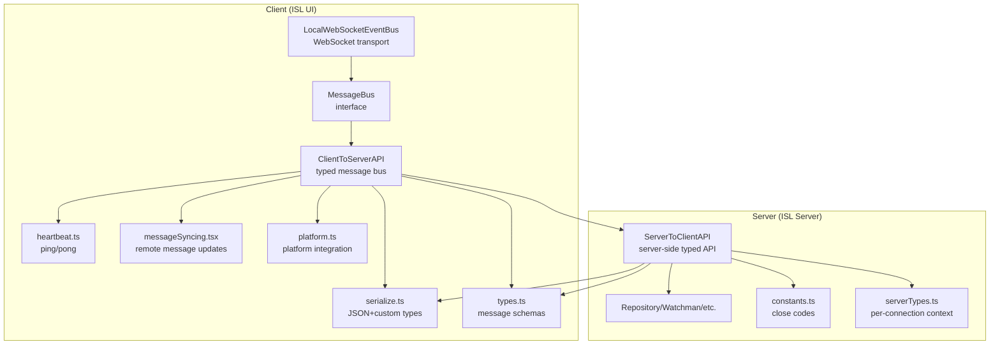
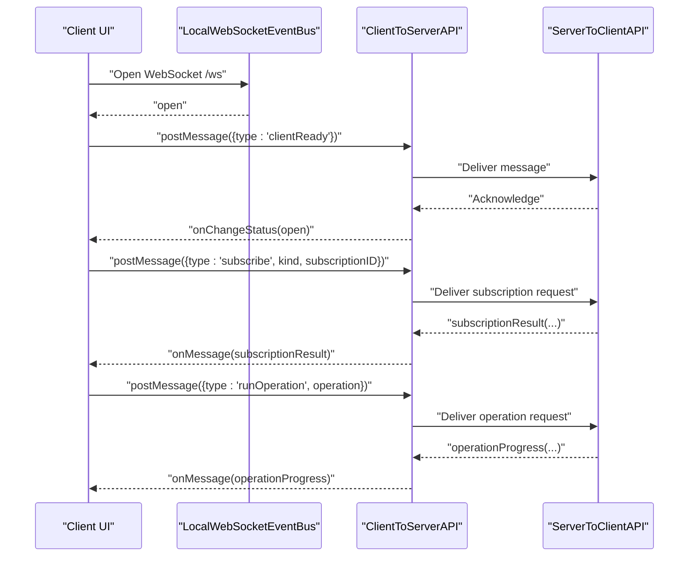
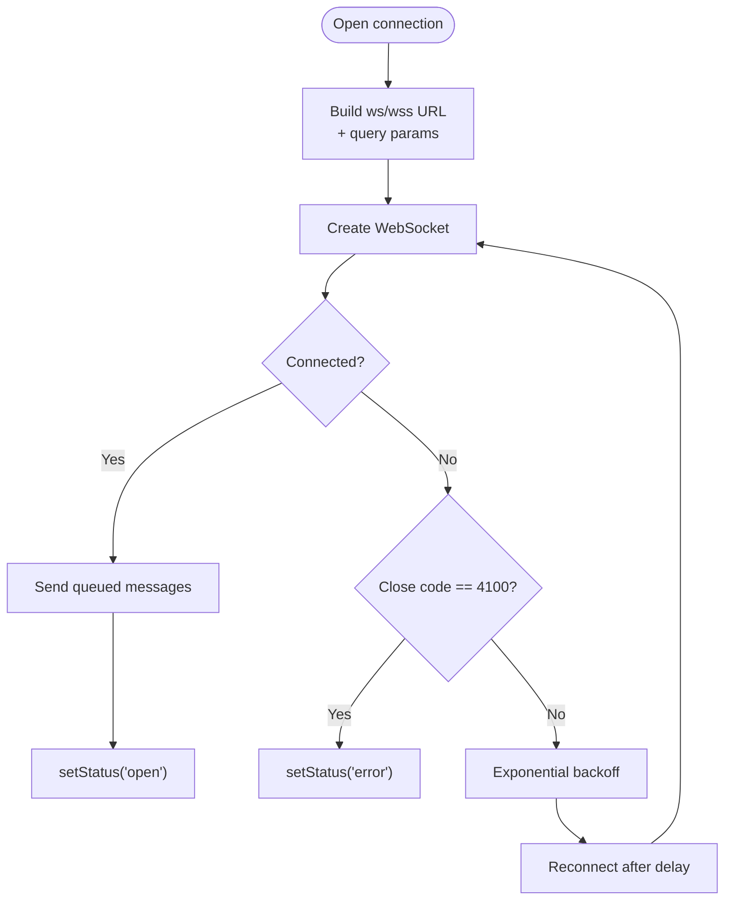
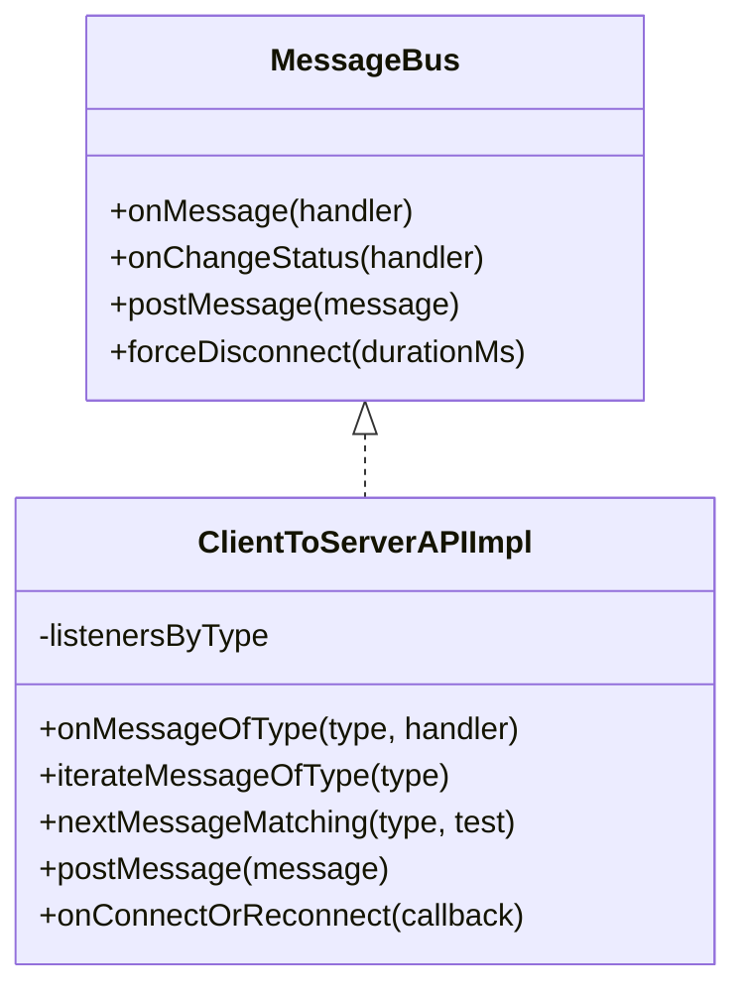
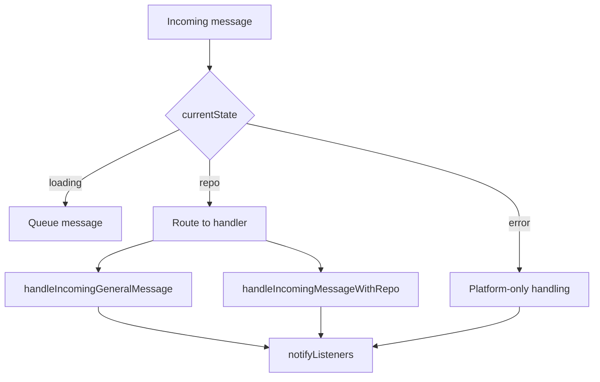
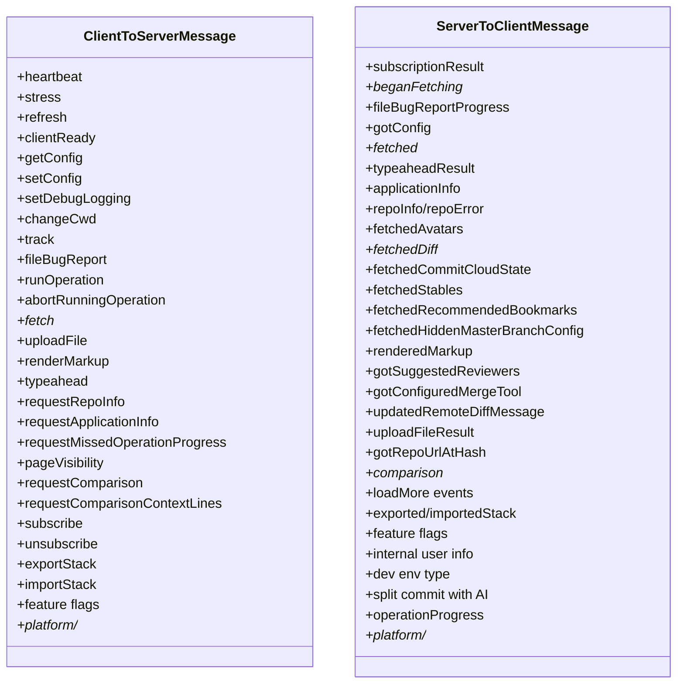
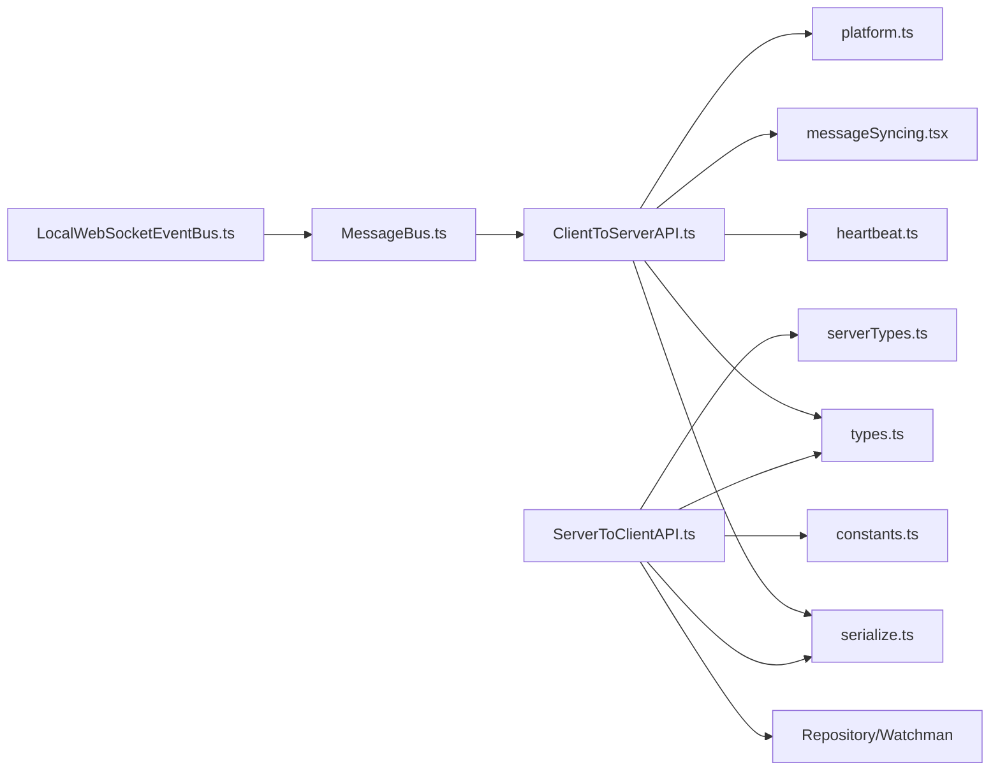

# Communication Protocols and APIs

<cite>
**Referenced Files in This Document**
- [LocalWebSocketEventBus.ts](file://addons/isl/src/LocalWebSocketEventBus.ts)
- [MessageBus.ts](file://addons/isl/src/MessageBus.ts)
- [ClientToServerAPI.ts](file://addons/isl/src/ClientToServerAPI.ts)
- [ServerToClientAPI.ts](file://addons/isl-server/src/ServerToClientAPI.ts)
- [types.ts](file://addons/isl/src/types.ts)
- [serialize.ts](file://addons/isl/src/serialize.ts)
- [platform.ts](file://addons/isl/src/platform.ts)
- [constants.ts](file://addons/isl-server/src/constants.ts)
- [heartbeat.ts](file://addons/isl/src/heartbeat.ts)
- [messageSyncing.tsx](file://addons/isl/src/messageSyncing.tsx)
- [serverTypes.ts](file://addons/isl-server/src/serverTypes.ts)
</cite>

## Table of Contents
1. [Introduction](#introduction)
2. [Project Structure](#project-structure)
3. [Core Components](#core-components)
4. [Architecture Overview](#architecture-overview)
5. [Detailed Component Analysis](#detailed-component-analysis)
6. [Dependency Analysis](#dependency-analysis)
7. [Performance Considerations](#performance-considerations)
8. [Troubleshooting Guide](#troubleshooting-guide)
9. [Conclusion](#conclusion)
10. [Appendices](#appendices)

## Introduction
This document describes the communication protocols and APIs used by ISL (Interactive Smartlog) for real-time, bidirectional messaging between the client and server. It covers WebSocket-based transport, message formats, event types, state synchronization, command execution patterns, response handling, notification broadcasting, and update propagation. It also documents message queuing, retry logic, error recovery, authentication, security considerations, API versioning and backward compatibility, and debugging and monitoring approaches.

## Project Structure
ISL’s communication is implemented across two primary layers:
- Client-side (addons/isl): WebSocket transport abstraction, typed message bus, client-to-server API, serialization utilities, and platform integration.
- Server-side (addons/isl-server): Server-to-client API, repository access, subscriptions, and platform-specific handlers.

**Diagram sources**
- [LocalWebSocketEventBus.ts:13-178](file://addons/isl/src/LocalWebSocketEventBus.ts#L13-L178)
- [MessageBus.ts:18-26](file://addons/isl/src/MessageBus.ts#L18-L26)
- [ClientToServerAPI.ts:35-245](file://addons/isl/src/ClientToServerAPI.ts#L35-L245)
- [ServerToClientAPI.ts:71-1392](file://addons/isl-server/src/ServerToClientAPI.ts#L71-L1392)
- [serialize.ts:48-140](file://addons/isl/src/serialize.ts#L48-L140)
- [types.ts:987-1333](file://addons/isl/src/types.ts#L987-L1333)
- [heartbeat.ts:30-66](file://addons/isl/src/heartbeat.ts#L30-L66)
- [messageSyncing.tsx:32-46](file://addons/isl/src/messageSyncing.tsx#L32-L46)
- [platform.ts:30-119](file://addons/isl/src/platform.ts#L30-L119)
- [constants.ts:12-12](file://addons/isl-server/src/constants.ts#L12-L12)
- [serverTypes.ts:17-36](file://addons/isl-server/src/serverTypes.ts#L17-L36)

**Section sources**
- [LocalWebSocketEventBus.ts:13-178](file://addons/isl/src/LocalWebSocketEventBus.ts#L13-L178)
- [MessageBus.ts:18-26](file://addons/isl/src/MessageBus.ts#L18-L26)
- [ClientToServerAPI.ts:35-245](file://addons/isl/src/ClientToServerAPI.ts#L35-L245)
- [ServerToClientAPI.ts:71-1392](file://addons/isl-server/src/ServerToClientAPI.ts#L71-L1392)
- [serialize.ts:48-140](file://addons/isl/src/serialize.ts#L48-L140)
- [types.ts:987-1333](file://addons/isl/src/types.ts#L987-L1333)
- [heartbeat.ts:30-66](file://addons/isl/src/heartbeat.ts#L30-L66)
- [messageSyncing.tsx:32-46](file://addons/isl/src/messageSyncing.tsx#L32-L46)
- [platform.ts:30-119](file://addons/isl/src/platform.ts#L30-L119)
- [constants.ts:12-12](file://addons/isl-server/src/constants.ts#L12-L12)
- [serverTypes.ts:17-36](file://addons/isl-server/src/serverTypes.ts#L17-L36)

## Core Components
- WebSocket transport and reconnection:
  - Client maintains a WebSocket connection with exponential backoff and automatic reconnection. Messages sent while disconnected are queued and replayed upon reconnection.
- Typed message bus:
  - A generic MessageBus interface abstracts transport and exposes onMessage, onChangeStatus, and postMessage.
- Client-to-server API:
  - Provides typed event listeners, async iterators over message streams, and helpers for connect/reconnect callbacks.
- Server-to-client API:
  - Handles incoming client messages, queues messages until a repository is ready, routes to appropriate handlers, and broadcasts subscription updates.
- Serialization:
  - Extends JSON to support Map, Set, Date, Error, and undefined via custom markers.
- Message schemas:
  - Defines all client-to-server and server-to-client message types, including subscriptions, operations, and platform-specific messages.
- Heartbeat and monitoring:
  - Periodic ping/pong with timeout detection for liveness checks.
- Message synchronization:
  - Explicit update flows for remote code review messages with request/response matching.

**Section sources**
- [LocalWebSocketEventBus.ts:13-178](file://addons/isl/src/LocalWebSocketEventBus.ts#L13-L178)
- [MessageBus.ts:18-26](file://addons/isl/src/MessageBus.ts#L18-L26)
- [ClientToServerAPI.ts:35-245](file://addons/isl/src/ClientToServerAPI.ts#L35-L245)
- [ServerToClientAPI.ts:71-1392](file://addons/isl-server/src/ServerToClientAPI.ts#L71-L1392)
- [serialize.ts:48-140](file://addons/isl/src/serialize.ts#L48-L140)
- [types.ts:987-1333](file://addons/isl/src/types.ts#L987-L1333)
- [heartbeat.ts:30-66](file://addons/isl/src/heartbeat.ts#L30-L66)
- [messageSyncing.tsx:32-46](file://addons/isl/src/messageSyncing.tsx#L32-L46)

## Architecture Overview
The client and server communicate over a WebSocket endpoint. The client wraps the transport in a typed message bus and dispatches typed messages. The server validates readiness, queues messages until a repository is selected, and routes messages to handlers. Subscriptions propagate updates to the client. The server tracks per-connection context and logs analytics.

**Diagram sources**
- [LocalWebSocketEventBus.ts:56-119](file://addons/isl/src/LocalWebSocketEventBus.ts#L56-L119)
- [ClientToServerAPI.ts:179-185](file://addons/isl/src/ClientToServerAPI.ts#L179-L185)
- [ServerToClientAPI.ts:354-534](file://addons/isl-server/src/ServerToClientAPI.ts#L354-L534)
- [types.ts:1041-1042](file://addons/isl/src/types.ts#L1041-L1042)

**Section sources**
- [LocalWebSocketEventBus.ts:56-119](file://addons/isl/src/LocalWebSocketEventBus.ts#L56-L119)
- [ClientToServerAPI.ts:179-185](file://addons/isl/src/ClientToServerAPI.ts#L179-L185)
- [ServerToClientAPI.ts:354-534](file://addons/isl-server/src/ServerToClientAPI.ts#L354-L534)
- [types.ts:1041-1042](file://addons/isl/src/types.ts#L1041-L1042)

## Detailed Component Analysis

### WebSocket Transport and Reconnection
- Transport: Uses a WebSocket URL constructed from the configured host with ws:// or wss:// based on the page protocol. Query parameters include optional token, cwd, sessionId, and platform name.
- Reconnection: Exponential backoff with a maximum cap; resets on successful open. Queues outbound messages until reconnected.
- Status reporting: Emits status changes to subscribers for UI feedback.
- Permanent closure: Server may close with a user-defined code indicating no reconnect should occur.

**Diagram sources**
- [LocalWebSocketEventBus.ts:56-137](file://addons/isl/src/LocalWebSocketEventBus.ts#L56-L137)
- [constants.ts:12-12](file://addons/isl-server/src/constants.ts#L12-L12)

**Section sources**
- [LocalWebSocketEventBus.ts:56-137](file://addons/isl/src/LocalWebSocketEventBus.ts#L56-L137)
- [constants.ts:12-12](file://addons/isl-server/src/constants.ts#L12-L12)

### Typed Message Bus and Client-to-Server API
- MessageBus interface abstracts transport and exposes:
  - onMessage(handler)
  - onChangeStatus(handler)
  - postMessage(message)
- ClientToServerAPIImpl:
  - Deserializes inbound messages and routes by type to registered listeners.
  - Provides async iterator over a specific message type for request/response patterns.
  - nextMessageMatching helper to wait for a matching response.
  - onConnectOrReconnect triggers on first open and after reconnect.
  - Serializes outbound messages before forwarding to the transport.

**Diagram sources**
- [MessageBus.ts:18-26](file://addons/isl/src/MessageBus.ts#L18-L26)
- [ClientToServerAPI.ts:35-245](file://addons/isl/src/ClientToServerAPI.ts#L35-L245)

**Section sources**
- [MessageBus.ts:18-26](file://addons/isl/src/MessageBus.ts#L18-L26)
- [ClientToServerAPI.ts:35-245](file://addons/isl/src/ClientToServerAPI.ts#L35-L245)

### Server-to-Client API and Message Routing
- Queuing: While no repository is active, incoming messages are queued and later processed after repository selection.
- Routing:
  - General messages (heartbeat, stress, changeCwd, requestRepoInfo, requestApplicationInfo, fileBugReport, track, clientReady).
  - Repository-bound messages (subscriptions, operations, config, diffs, uploads, comparisons, refresh, visibility, feature flags, etc.).
  - Platform-specific messages are delegated to platform handlers.
- Subscriptions:
  - Supports subscribing to uncommitted changes, smartlog commits, merge conflicts, submodules, and subscribed full repository branches.
  - Emits beganFetching events and subscriptionResult updates.
- Operation progress:
  - Streams operationProgress events and handles forgotten operations.

**Diagram sources**
- [ServerToClientAPI.ts:99-116](file://addons/isl-server/src/ServerToClientAPI.ts#L99-L116)
- [ServerToClientAPI.ts:225-262](file://addons/isl-server/src/ServerToClientAPI.ts#L225-L262)
- [ServerToClientAPI.ts:267-343](file://addons/isl-server/src/ServerToClientAPI.ts#L267-L343)
- [ServerToClientAPI.ts:354-534](file://addons/isl-server/src/ServerToClientAPI.ts#L354-L534)

**Section sources**
- [ServerToClientAPI.ts:99-116](file://addons/isl-server/src/ServerToClientAPI.ts#L99-L116)
- [ServerToClientAPI.ts:225-262](file://addons/isl-server/src/ServerToClientAPI.ts#L225-L262)
- [ServerToClientAPI.ts:267-343](file://addons/isl-server/src/ServerToClientAPI.ts#L267-L343)
- [ServerToClientAPI.ts:354-534](file://addons/isl-server/src/ServerToClientAPI.ts#L354-L534)

### Message Formats and Event Types
- Client-to-server messages:
  - Includes heartbeat, stress, refresh, clientReady, getConfig, setConfig, setDebugLogging, changeCwd, track, fileBugReport, runOperation, abortRunningOperation, fetch* family, uploadFile, renderMarkup, typeahead, requestRepoInfo, requestApplicationInfo, requestMissedOperationProgress, pageVisibility, requestComparison, requestComparisonContextLines, subscribe/unsubscribe, export/import stack, feature flags, internal user info, dev env type, split commit with AI, UI state, and platform-specific messages.
- Server-to-client messages:
  - Includes subscriptionResult for commits, uncommitted changes, merge conflicts, submodules, and subscribed full repo branches; beganFetching events; fileBugReportProgress; gotConfig; fetched* family; typeaheadResult; applicationInfo; repoInfo/repoError; fetchedAvatars; fetchedDiffSummaries/comments/LandInfo; fetchedCommitCloudState; fetchedStables; fetchedRecommendedBookmarks/fetchedHiddenMasterBranchConfig; renderedMarkup; gotSuggestedReviewers; gotConfiguredMergeTool; updatedRemoteDiffMessage; uploadFileResult; gotRepoUrlAtHash; comparison/comparisonContextLines; load-more commits events; exported/importedStack; feature flags; internal user info; dev env type; split commit with AI; operationProgress; platform-specific messages; and more.

**Diagram sources**
- [types.ts:987-1137](file://addons/isl/src/types.ts#L987-L1137)
- [types.ts:1154-1333](file://addons/isl/src/types.ts#L1154-L1333)

**Section sources**
- [types.ts:987-1137](file://addons/isl/src/types.ts#L987-L1137)
- [types.ts:1154-1333](file://addons/isl/src/types.ts#L1154-L1333)

### Serialization and Transport Encoding
- Custom serialization supports Map, Set, Date, Error, and undefined using a compact marker scheme. This enables transporting complex structures over JSON.
- Client and server both use the same serializer/deserializer to maintain compatibility.

**Section sources**
- [serialize.ts:48-140](file://addons/isl/src/serialize.ts#L48-L140)

### Authentication and Security
- Authentication:
  - Optional token passed as a query parameter on the WebSocket URL.
  - Optional cwd and sessionId parameters are also passed as query parameters.
  - Platform name is included to inform routing and handling.
- Security:
  - Uses wss:// when the page is served over https; falls back to ws:// otherwise.
  - Server may permanently close connections with a user-defined close code to prevent retries for unrecoverable errors (e.g., invalid token).
- Privacy:
  - Query parameters are not logged by default; sensitive data should be handled carefully.

**Section sources**
- [LocalWebSocketEventBus.ts:60-80](file://addons/isl/src/LocalWebSocketEventBus.ts#L60-L80)
- [constants.ts:12-12](file://addons/isl-server/src/constants.ts#L12-L12)
- [platform.ts:25-90](file://addons/isl/src/platform.ts#L25-L90)

### Command Execution Patterns and Response Handling
- Request/Response:
  - Clients send a request message and await a correlated response using nextMessageMatching or iterateMessageOfType.
- Streaming Updates:
  - Subscriptions emit ongoing updates via subscriptionResult and beganFetching events.
- Operation Progress:
  - runOperation streams operationProgress events; abortRunningOperation cancels or clears stale progress.

**Section sources**
- [ClientToServerAPI.ts:110-158](file://addons/isl/src/ClientToServerAPI.ts#L110-L158)
- [ServerToClientAPI.ts:525-540](file://addons/isl-server/src/ServerToClientAPI.ts#L525-L540)

### Notification Broadcasting and Update Propagation
- Subscriptions:
  - Clients subscribe to kinds of data; server emits beganFetching and subscriptionResult updates.
- Change propagation:
  - Repository watchers trigger updates; server forwards them to subscribed clients.
- Platform integrations:
  - Platform-specific messages enable opening files, diffs, external links, and more.

**Section sources**
- [ServerToClientAPI.ts:361-518](file://addons/isl-server/src/ServerToClientAPI.ts#L361-L518)
- [types.ts:841-865](file://addons/isl/src/types.ts#L841-L865)

### Message Queuing, Retry Logic, and Error Recovery
- Client:
  - Queues outgoing messages while disconnected; replays on reconnect.
  - Exponential backoff with capped delay; resets on open.
- Server:
  - Queues incoming messages until a repository is active; processes queued messages after activation.
  - Forgets stale operations if the client assumes an operation is still running but the server does not recognize it.
- Error handling:
  - Dedicated error short messages for concise server-to-client signaling.
  - Platform-specific messages for diagnostics and unsaved files.

**Section sources**
- [LocalWebSocketEventBus.ts:95-100](file://addons/isl/src/LocalWebSocketEventBus.ts#L95-L100)
- [ServerToClientAPI.ts:106-125](file://addons/isl-server/src/ServerToClientAPI.ts#L106-L125)
- [constants.ts:22-24](file://addons/isl-server/src/constants.ts#L22-L24)

### API Versioning, Backward Compatibility, and Migration
- Versioning:
  - ApplicationInfo includes platformName, version, and log file location for diagnostics.
- Backward compatibility:
  - Message schemas enumerate all supported types; additions should be additive to preserve compatibility.
  - Existing message types are preserved; new fields can be optional.
- Migration:
  - Use feature flags and bulk feature flag fetching to gate new capabilities.
  - Track analytics around feature adoption to guide migration.

**Section sources**
- [ServerToClientAPI.ts:304-313](file://addons/isl-server/src/ServerToClientAPI.ts#L304-L313)
- [types.ts:920-949](file://addons/isl/src/types.ts#L920-L949)

### Debugging Tools and Monitoring
- Heartbeat:
  - Periodic ping/pong with timeout detection and RTT measurement.
- Logging:
  - Optional traffic logging for messages; debug logging toggles via setDebugLogging.
- UI state:
  - Page visibility tracking and refresh triggers.
- Platform diagnostics:
  - Platform-specific messages for diagnostics, unsaved files, and suggested edits.

**Section sources**
- [heartbeat.ts:30-66](file://addons/isl/src/heartbeat.ts#L30-L66)
- [ClientToServerAPI.ts:18-18](file://addons/isl/src/ClientToServerAPI.ts#L18-L18)
- [ServerToClientAPI.ts:558-564](file://addons/isl-server/src/ServerToClientAPI.ts#L558-L564)
- [types.ts:841-865](file://addons/isl/src/types.ts#L841-L865)

## Dependency Analysis
- Client depends on:
  - LocalWebSocketEventBus for transport
  - ClientToServerAPI for typed messaging
  - serialize for encoding
  - types for schemas
  - platform for platform integration
- Server depends on:
  - ServerToClientAPI for routing and broadcasting
  - Repository/Watchman for data
  - constants for close codes
  - serverTypes for per-connection context

**Diagram sources**
- [LocalWebSocketEventBus.ts:13-178](file://addons/isl/src/LocalWebSocketEventBus.ts#L13-L178)
- [MessageBus.ts:18-26](file://addons/isl/src/MessageBus.ts#L18-L26)
- [ClientToServerAPI.ts:35-245](file://addons/isl/src/ClientToServerAPI.ts#L35-L245)
- [ServerToClientAPI.ts:71-1392](file://addons/isl-server/src/ServerToClientAPI.ts#L71-L1392)
- [serialize.ts:48-140](file://addons/isl/src/serialize.ts#L48-L140)
- [types.ts:987-1333](file://addons/isl/src/types.ts#L987-L1333)
- [heartbeat.ts:30-66](file://addons/isl/src/heartbeat.ts#L30-L66)
- [messageSyncing.tsx:32-46](file://addons/isl/src/messageSyncing.tsx#L32-L46)
- [platform.ts:30-119](file://addons/isl/src/platform.ts#L30-L119)
- [constants.ts:12-12](file://addons/isl-server/src/constants.ts#L12-L12)
- [serverTypes.ts:17-36](file://addons/isl-server/src/serverTypes.ts#L17-L36)

**Section sources**
- [LocalWebSocketEventBus.ts:13-178](file://addons/isl/src/LocalWebSocketEventBus.ts#L13-L178)
- [MessageBus.ts:18-26](file://addons/isl/src/MessageBus.ts#L18-L26)
- [ClientToServerAPI.ts:35-245](file://addons/isl/src/ClientToServerAPI.ts#L35-L245)
- [ServerToClientAPI.ts:71-1392](file://addons/isl-server/src/ServerToClientAPI.ts#L71-L1392)
- [serialize.ts:48-140](file://addons/isl/src/serialize.ts#L48-L140)
- [types.ts:987-1333](file://addons/isl/src/types.ts#L987-L1333)
- [heartbeat.ts:30-66](file://addons/isl/src/heartbeat.ts#L30-L66)
- [messageSyncing.tsx:32-46](file://addons/isl/src/messageSyncing.tsx#L32-L46)
- [platform.ts:30-119](file://addons/isl/src/platform.ts#L30-L119)
- [constants.ts:12-12](file://addons/isl-server/src/constants.ts#L12-L12)
- [serverTypes.ts:17-36](file://addons/isl-server/src/serverTypes.ts#L17-L36)

## Performance Considerations
- Minimize payload sizes by limiting fetched samples and using incremental updates via subscriptions.
- Batch operations and use throttled fetches to reduce server load.
- Prefer streaming updates (subscriptions) over polling.
- Use feature flags to gradually roll out heavier features.

## Troubleshooting Guide
- Connection issues:
  - Verify ws/wss scheme matches page protocol.
  - Check token validity; server may close with a non-reconnectable code for invalid tokens.
  - Inspect exponential backoff behavior and queued messages.
- Message delivery:
  - Use heartbeat to detect liveness and RTT.
  - Enable traffic logging temporarily to inspect message flow.
- Repository readiness:
  - Ensure changeCwd is sent and repo is loaded before sending repo-bound messages.
  - Expect beganFetching and subscriptionResult events for subscriptions.
- Platform-specific problems:
  - Use platform-specific messages to open files, diffs, and external links.
  - Check diagnostics and unsaved files notifications.

**Section sources**
- [LocalWebSocketEventBus.ts:105-137](file://addons/isl/src/LocalWebSocketEventBus.ts#L105-L137)
- [constants.ts:12-12](file://addons/isl-server/src/constants.ts#L12-L12)
- [heartbeat.ts:30-66](file://addons/isl/src/heartbeat.ts#L30-L66)
- [ServerToClientAPI.ts:106-125](file://addons/isl-server/src/ServerToClientAPI.ts#L106-L125)
- [types.ts:841-865](file://addons/isl/src/types.ts#L841-L865)

## Conclusion
ISL’s communication protocol combines a robust WebSocket transport with a strongly typed message bus, enabling reliable real-time updates, structured command execution, and flexible subscription-based data streams. The design emphasizes resilience through queuing and exponential backoff, clarity through typed schemas, and observability via heartbeats and logging. By following the patterns documented here, developers can extend the protocol safely and efficiently.

## Appendices
- Example message flows:
  - Heartbeat: client sends heartbeat; server responds with heartbeat; client measures RTT.
  - Subscription: client subscribes; server emits beganFetching and subscriptionResult; client renders updates.
  - Operation: client runs an operation; server streams progress; client handles completion or error.
- Security checklist:
  - Use wss:// in production.
  - Validate tokens server-side.
  - Avoid logging sensitive query parameters.
  - Limit platform-specific actions to trusted contexts.