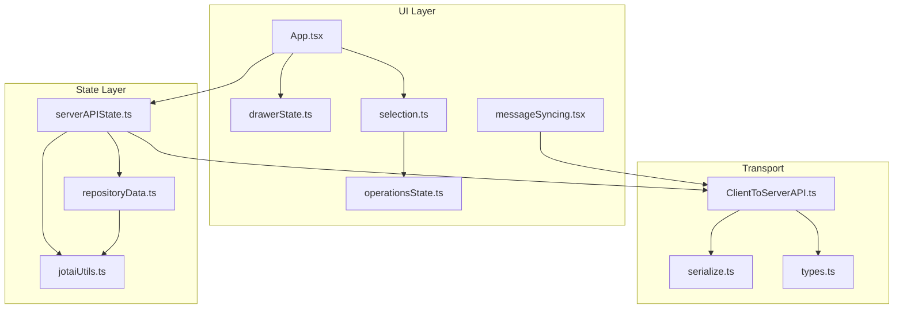
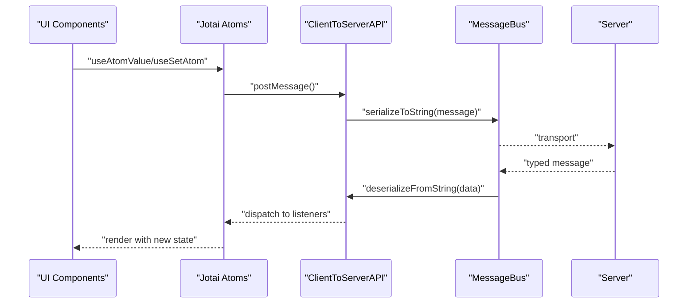
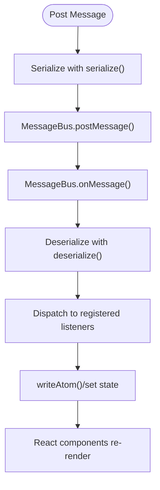
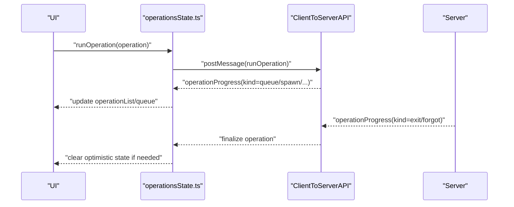
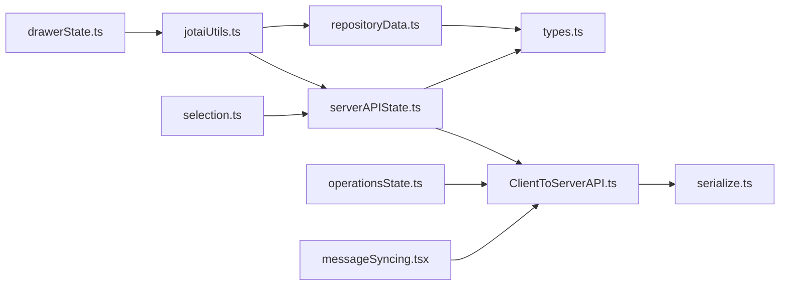

# Data Flow and State Management

<cite>
**Referenced Files in This Document**
- [App.tsx](file://addons/isl/src/App.tsx)
- [repositoryData.ts](file://addons/isl/src/repositoryData.ts)
- [serverAPIState.ts](file://addons/isl/src/serverAPIState.ts)
- [jotaiUtils.ts](file://addons/isl/src/jotaiUtils.ts)
- [serialize.ts](file://addons/isl/src/serialize.ts)
- [ClientToServerAPI.ts](file://addons/isl/src/ClientToServerAPI.ts)
- [types.ts](file://addons/isl/src/types.ts)
- [operationsState.ts](file://addons/isl/src/operationsState.ts)
- [selection.ts](file://addons/isl/src/selection.ts)
- [drawerState.ts](file://addons/isl/src/drawerState.ts)
- [messageSyncing.tsx](file://addons/isl/src/messageSyncing.tsx)
</cite>

## Table of Contents
1. [Introduction](#introduction)
2. [Project Structure](#project-structure)
3. [Core Components](#core-components)
4. [Architecture Overview](#architecture-overview)
5. [Detailed Component Analysis](#detailed-component-analysis)
6. [Dependency Analysis](#dependency-analysis)
7. [Performance Considerations](#performance-considerations)
8. [Troubleshooting Guide](#troubleshooting-guide)
9. [Conclusion](#conclusion)
10. [Appendices](#appendices)

## Introduction
This document explains the data flow and state management in ISL (Interactive Smartlog), focusing on the Jotai-based architecture, atom definitions, and state synchronization patterns. It covers repository data fetching, caching strategies, data transformation pipelines, serialization and deserialization for client-server communication, reactive programming patterns, subscriptions, and update propagation. It also includes best practices, performance optimizations, debugging approaches, validation and error handling, consistency guarantees, and guidelines for extending the state system and adding new data sources.

## Project Structure
ISL’s state management centers around Jotai atoms and derived values, with a thin client-to-server messaging layer built on top of a platform MessageBus. The main pieces are:
- Atoms and derived atoms for repository metadata, commits, DAG, uncommitted changes, merge conflicts, and operational state
- Utilities for atom families, persistence, and cleanup
- Client-to-server API wrapper for typed message passing and serialization
- Serialization utilities for transporting complex types across the wire
- UI state atoms for drawers and selection

**Diagram sources**
- [App.tsx:1-283](file://addons/isl/src/App.tsx#L1-L283)
- [drawerState.ts:1-67](file://addons/isl/src/drawerState.ts#L1-L67)
- [selection.ts:1-388](file://addons/isl/src/selection.ts#L1-L388)
- [operationsState.ts:1-575](file://addons/isl/src/operationsState.ts#L1-L575)
- [messageSyncing.tsx:1-46](file://addons/isl/src/messageSyncing.tsx#L1-L46)
- [repositoryData.ts:1-126](file://addons/isl/src/repositoryData.ts#L1-L126)
- [serverAPIState.ts:1-533](file://addons/isl/src/serverAPIState.ts#L1-L533)
- [jotaiUtils.ts:1-524](file://addons/isl/src/jotaiUtils.ts#L1-L524)
- [ClientToServerAPI.ts:1-245](file://addons/isl/src/ClientToServerAPI.ts#L1-L245)
- [serialize.ts:1-140](file://addons/isl/src/serialize.ts#L1-L140)
- [types.ts:1-800](file://addons/isl/src/types.ts#L1-L800)

**Section sources**
- [App.tsx:1-283](file://addons/isl/src/App.tsx#L1-L283)
- [serverAPIState.ts:1-533](file://addons/isl/src/serverAPIState.ts#L1-L533)
- [jotaiUtils.ts:1-524](file://addons/isl/src/jotaiUtils.ts#L1-L524)
- [ClientToServerAPI.ts:1-245](file://addons/isl/src/ClientToServerAPI.ts#L1-L245)
- [serialize.ts:1-140](file://addons/isl/src/serialize.ts#L1-L140)
- [types.ts:1-800](file://addons/isl/src/types.ts#L1-L800)

## Core Components
- Jotai atoms and derived atoms define the canonical state and computed values (e.g., repository info, commits, DAG, uncommitted changes, merge conflicts).
- Utilities provide atom families, persistence, cleanup, and lazy initialization to manage memory and lifecycle.
- Client-to-server API encapsulates message passing, typed subscriptions, and serialization/deserialization.
- Serialization supports complex types (Map, Set, Date, Error) for cross-process transport.
- UI state atoms persist drawer sizes and selection state.

Key responsibilities:
- State definition and derivation: repositoryData.ts, serverAPIState.ts
- Atom utilities and lifecycle: jotaiUtils.ts
- Transport and serialization: ClientToServerAPI.ts, serialize.ts
- UI state: drawerState.ts, selection.ts, messageSyncing.tsx

**Section sources**
- [repositoryData.ts:1-126](file://addons/isl/src/repositoryData.ts#L1-L126)
- [serverAPIState.ts:1-533](file://addons/isl/src/serverAPIState.ts#L1-L533)
- [jotaiUtils.ts:1-524](file://addons/isl/src/jotaiUtils.ts#L1-L524)
- [ClientToServerAPI.ts:1-245](file://addons/isl/src/ClientToServerAPI.ts#L1-L245)
- [serialize.ts:1-140](file://addons/isl/src/serialize.ts#L1-L140)
- [drawerState.ts:1-67](file://addons/isl/src/drawerState.ts#L1-L67)
- [selection.ts:1-388](file://addons/isl/src/selection.ts#L1-L388)
- [messageSyncing.tsx:1-46](file://addons/isl/src/messageSyncing.tsx#L1-L46)

## Architecture Overview
The system follows a reactive, Jotai-driven architecture:
- UI components subscribe to atoms via hooks.
- Atoms derive state from server messages and platform events.
- ClientToServerAPI handles typed message exchange, subscription lifecycles, and async message iteration.
- Serialization converts complex types to JSON-compatible structures for transport.

**Diagram sources**
- [ClientToServerAPI.ts:179-207](file://addons/isl/src/ClientToServerAPI.ts#L179-L207)
- [serialize.ts:89-139](file://addons/isl/src/serialize.ts#L89-L139)
- [serverAPIState.ts:50-65](file://addons/isl/src/serverAPIState.ts#L50-L65)

## Detailed Component Analysis

### Jotai Utilities and Lifecycle
- atomFamilyWeak: A Jotai atom family with periodic cleanup to prevent memory leaks, with optional strong cache.
- localStorageBackedAtom and localStorageBackedAtomFamily: Persist state to platform storage with eviction and per-key separation.
- atomResetOnDepChange: Resets atom value when a dependency changes (e.g., cwd or repo root).
- atomWithOnChange, atomWithRefresh, atomLoadableWithRefresh: Helpers for change callbacks, forced refresh, and suspense-friendly async updates.
- readAtom/writeAtom/refreshAtom: Store-level helpers to centralize Jotai store usage.

Best practices:
- Prefer atomFamilyWeak for derived maps/sets to avoid leaks.
- Use atomResetOnDepChange for state scoped to cwd/repo boundaries.
- Wrap async initialization with lazyAtom or atomWithRefresh to leverage Suspense.

**Section sources**
- [jotaiUtils.ts:217-238](file://addons/isl/src/jotaiUtils.ts#L217-L238)
- [jotaiUtils.ts:307-371](file://addons/isl/src/jotaiUtils.ts#L307-L371)
- [jotaiUtils.ts:429-482](file://addons/isl/src/jotaiUtils.ts#L429-L482)
- [jotaiUtils.ts:205-215](file://addons/isl/src/jotaiUtils.ts#L205-L215)

### Repository Data and CWD Scope
- repositoryData holds repo info and cwd.
- serverCwd, repoRootAtom, repoRelativeCwd compute derived paths and scopes.
- atomResetOnCwdChange ensures atoms reset when cwd changes.
- Irrelevant commit filtering and display modes are derived from local storage-backed toggles.

Patterns:
- Derived atoms compute repo-relative paths and relevance checks.
- Local storage-backed toggles persist user preferences.

**Section sources**
- [repositoryData.ts:14-126](file://addons/isl/src/repositoryData.ts#L14-L126)

### Server API State and Subscriptions
- repositoryInfoOrError/repositoryInfo expose validated repo info and typed updates.
- Subscriptions for smartlog commits, uncommitted changes, merge conflicts, submodules, and full-repo branches.
- subscriptionEffect manages unique subscription IDs, subscribe/unsubscribe lifecycle, and data updates.
- latestDag composes commits, successor map, bookmarks, and filters to produce a DAG with previews and recommendations.
- isFetching* flags track loading states for commits, uncommitted changes, and additional commits.
- Commits shown range and application info are synchronized from server.

Data transformation pipeline:
- Server sends subscriptionResult with typed data.
- writeAtom updates latest*Data atoms.
- latestDag rebuilds DAG from commits and successor map.
- SuccessionTracker detects new successions and updates previews.

**Section sources**
- [serverAPIState.ts:50-65](file://addons/isl/src/serverAPIState.ts#L50-L65)
- [serverAPIState.ts:177-209](file://addons/isl/src/serverAPIState.ts#L177-L209)
- [serverAPIState.ts:260-333](file://addons/isl/src/serverAPIState.ts#L260-L333)
- [serverAPIState.ts:335-378](file://addons/isl/src/serverAPIState.ts#L335-L378)
- [serverAPIState.ts:391-432](file://addons/isl/src/serverAPIState.ts#L391-L432)
- [serverAPIState.ts:452-461](file://addons/isl/src/serverAPIState.ts#L452-L461)

### Client-to-Server Communication and Serialization
- ClientToServerAPIImpl wraps MessageBus, deserializes inbound messages, serializes outbound messages, and exposes typed listeners and async iterators.
- serialize/deserialize support Map, Set, Date, Error, and nested structures.
- nextMessageMatching and iterateMessageOfType provide structured async flows for request-response and streaming.

**Diagram sources**
- [ClientToServerAPI.ts:179-207](file://addons/isl/src/ClientToServerAPI.ts#L179-L207)
- [serialize.ts:48-139](file://addons/isl/src/serialize.ts#L48-L139)

**Section sources**
- [ClientToServerAPI.ts:1-245](file://addons/isl/src/ClientToServerAPI.ts#L1-L245)
- [serialize.ts:1-140](file://addons/isl/src/serialize.ts#L1-L140)

### Operations State and Optimistic Updates
- operationList tracks current and historical operations, with inline progress per commit hash.
- Queuing and progress messages update state reactively; exit/forgot messages finalize operations.
- queuedOperationsErrorAtom captures queue failures and preserves the queue for user awareness.
- runOperationImpl enqueues operations and awaits completion via nextMessageMatching.

**Diagram sources**
- [operationsState.ts:435-464](file://addons/isl/src/operationsState.ts#L435-L464)
- [operationsState.ts:105-104](file://addons/isl/src/operationsState.ts#L105-L104)
- [operationsState.ts:364-405](file://addons/isl/src/operationsState.ts#L364-L405)

**Section sources**
- [operationsState.ts:1-575](file://addons/isl/src/operationsState.ts#L1-L575)

### Selection and Drawer State
- selectedCommits maintains a Set of commit hashes; selection reacts to succession changes.
- selectedCommitInfos derives visible commit info from selected hashes and DAG.
- drawerState persists and restores drawer sizes and collapsed state, with auto-collapse on small screens.

**Section sources**
- [selection.ts:45-91](file://addons/isl/src/selection.ts#L45-L91)
- [selection.ts:52-73](file://addons/isl/src/selection.ts#L52-L73)
- [drawerState.ts:16-67](file://addons/isl/src/drawerState.ts#L16-L67)

### Message Syncing State
- messageSyncingEnabledState derives from code review provider and override state.
- updateRemoteMessage coordinates server updates and error propagation.

**Section sources**
- [messageSyncing.tsx:20-46](file://addons/isl/src/messageSyncing.tsx#L20-L46)

## Dependency Analysis
- UI depends on atoms via hooks; atoms depend on Jotai store and platform APIs.
- serverAPIState registers disposables and cleanups for subscriptions and config.
- ClientToServerAPI depends on platform message bus and serialize utilities.
- repositoryData and serverAPIState coordinate repository info and cwd-scoped resets.

**Diagram sources**
- [jotaiUtils.ts:1-524](file://addons/isl/src/jotaiUtils.ts#L1-L524)
- [serverAPIState.ts:1-533](file://addons/isl/src/serverAPIState.ts#L1-L533)
- [repositoryData.ts:1-126](file://addons/isl/src/repositoryData.ts#L1-L126)
- [ClientToServerAPI.ts:1-245](file://addons/isl/src/ClientToServerAPI.ts#L1-L245)
- [serialize.ts:1-140](file://addons/isl/src/serialize.ts#L1-L140)
- [types.ts:1-800](file://addons/isl/src/types.ts#L1-L800)
- [selection.ts:1-388](file://addons/isl/src/selection.ts#L1-L388)
- [operationsState.ts:1-575](file://addons/isl/src/operationsState.ts#L1-L575)
- [drawerState.ts:1-67](file://addons/isl/src/drawerState.ts#L1-L67)
- [messageSyncing.tsx:1-46](file://addons/isl/src/messageSyncing.tsx#L1-L46)

**Section sources**
- [serverAPIState.ts:50-65](file://addons/isl/src/serverAPIState.ts#L50-L65)
- [jotaiUtils.ts:307-371](file://addons/isl/src/jotaiUtils.ts#L307-L371)

## Performance Considerations
- Use atomFamilyWeak for derived maps/sets to bound memory growth and periodically clear caches.
- atomResetOnDepChange prevents stale state across cwd changes.
- reuseEqualObjects in latestDag reduces unnecessary renders by preserving equal objects.
- Lazy initialization via lazyAtom and atomWithRefresh avoids heavy computations until needed.
- Avoid excessive writes; batch updates with writeAtom and minimize intermediate derivations.
- Use loadable variants (atomLoadableWithRefresh) when Suspense is not desired.

[No sources needed since this section provides general guidance]

## Troubleshooting Guide
- Debugging state:
  - Use readAtom/writeAtom to inspect and modify state in tests or dev tools.
  - Utilize serializeAtomsState and getUiState to capture UI state for diagnostics.
- Message traffic:
  - Enable debugLogMessageTraffic to log incoming/outgoing messages.
- Subscription issues:
  - Verify subscriptionID uniqueness and proper subscribe/unsubscribe lifecycle.
  - Use nextMessageMatching to correlate requests with responses.
- Error handling:
  - Repository errors are modeled as RepositoryError union; surface appropriate UI for each variant.
  - Operation progress messages include exit codes and warnings; handle non-zero exits and “forgot” messages.

**Section sources**
- [serverAPIState.ts:489-499](file://addons/isl/src/serverAPIState.ts#L489-L499)
- [ClientToServerAPI.ts:18-28](file://addons/isl/src/ClientToServerAPI.ts#L18-L28)
- [types.ts:228-241](file://addons/isl/src/types.ts#L228-L241)
- [operationsState.ts:213-283](file://addons/isl/src/operationsState.ts#L213-L283)

## Conclusion
ISL’s state system leverages Jotai for fine-grained, reactive state with robust utilities for persistence, lifecycle, and memory management. The client-to-server API provides typed, asynchronous communication with serialization for complex data. Subscriptions drive continuous updates, while derived atoms and DAG transformations ensure correctness and performance. The architecture supports optimistic updates, error handling, and extensibility for new data sources and UI behaviors.

[No sources needed since this section summarizes without analyzing specific files]

## Appendices

### Best Practices for State Extensions
- Define new atoms close to their consumers; keep atoms small and composable.
- Use atomFamilyWeak for derived maps/sets keyed by external identifiers.
- Persist user-facing toggles with localStorageBackedAtom; use atomResetOnDepChange for repo/cwd-scoped state.
- Encapsulate async initialization with lazyAtom or atomWithRefresh; expose loadable variants when needed.
- Model server interactions with typed messages and subscriptionEffect; ensure subscribe/unsubscribe symmetry.

[No sources needed since this section provides general guidance]