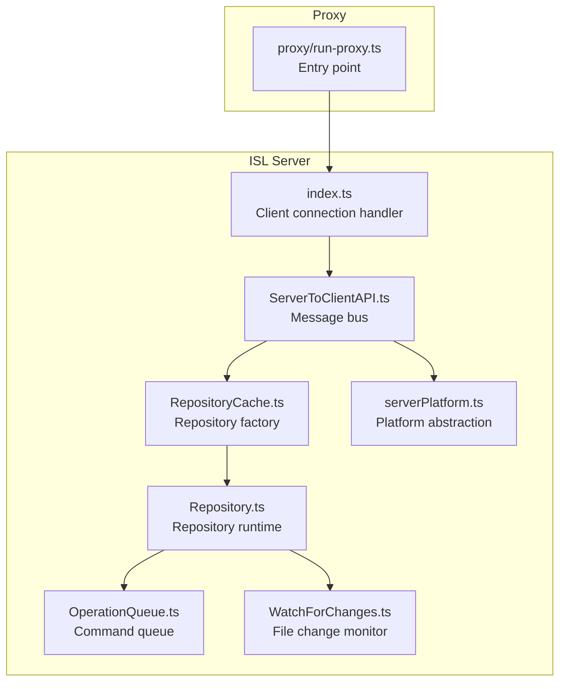
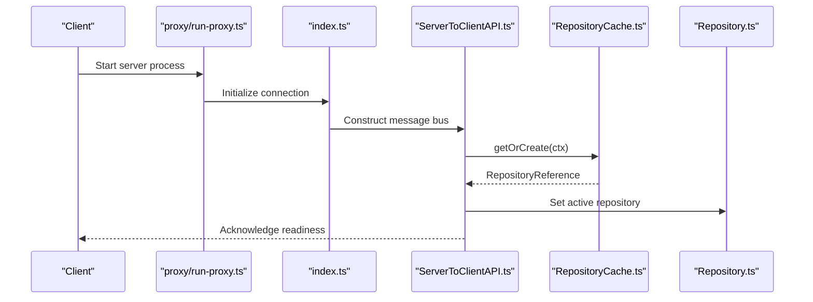
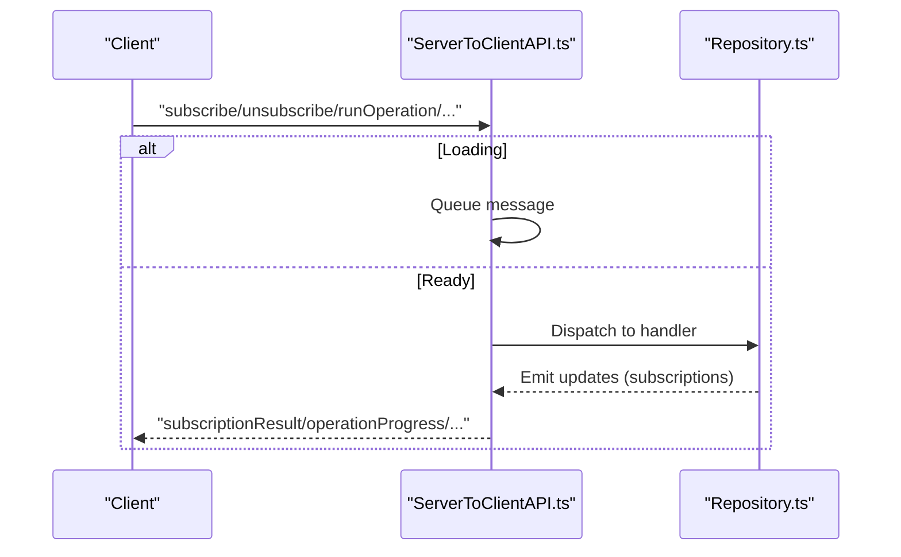
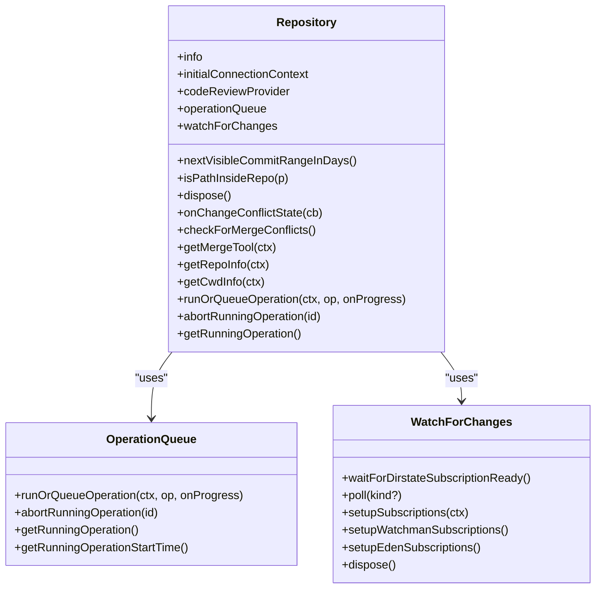
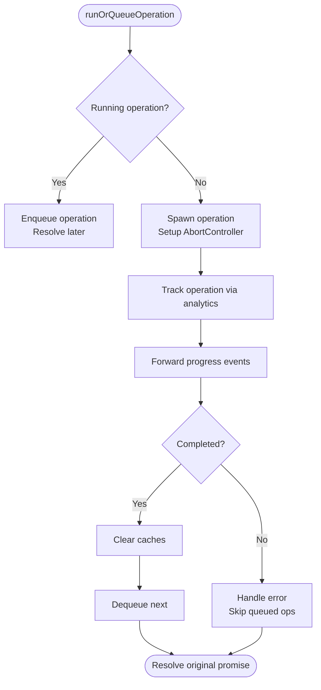
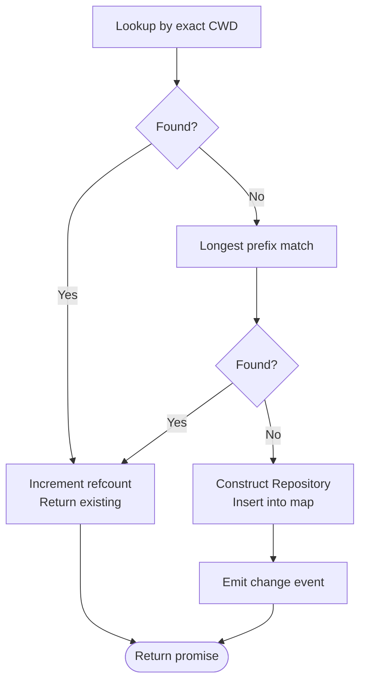
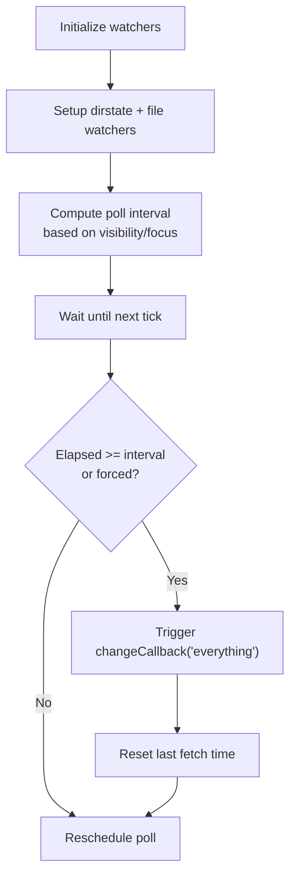
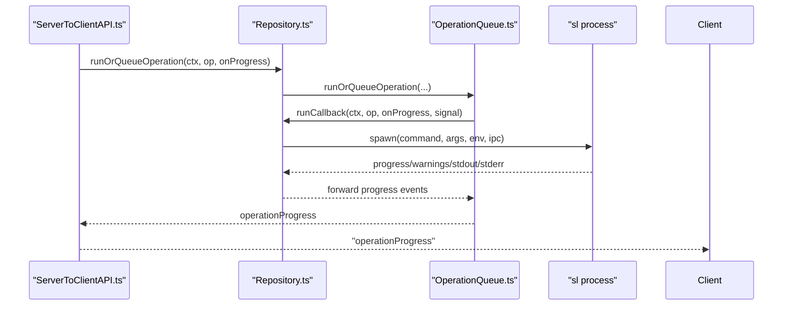
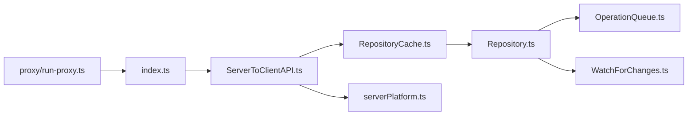

# ISL Server Architecture

<cite>
**Referenced Files in This Document**
- [README.md](file://addons/isl-server/README.md)
- [package.json](file://addons/isl-server/package.json)
- [index.ts](file://addons/isl-server/src/index.ts)
- [Repository.ts](file://addons/isl-server/src/Repository.ts)
- [OperationQueue.ts](file://addons/isl-server/src/OperationQueue.ts)
- [RepositoryCache.ts](file://addons/isl-server/src/RepositoryCache.ts)
- [WatchForChanges.ts](file://addons/isl-server/src/WatchForChanges.ts)
- [ServerToClientAPI.ts](file://addons/isl-server/src/ServerToClientAPI.ts)
- [serverPlatform.ts](file://addons/isl-server/src/serverPlatform.ts)
- [run-proxy.ts](file://addons/isl-server/proxy/run-proxy.ts)
</cite>

## Table of Contents
1. [Introduction](#introduction)
2. [Project Structure](#project-structure)
3. [Core Components](#core-components)
4. [Architecture Overview](#architecture-overview)
5. [Detailed Component Analysis](#detailed-component-analysis)
6. [Dependency Analysis](#dependency-analysis)
7. [Performance Considerations](#performance-considerations)
8. [Troubleshooting Guide](#troubleshooting-guide)
9. [Conclusion](#conclusion)

## Introduction
This document describes the Interactive Smartlog (ISL) server architecture and backend components. It explains server initialization, repository management, WebSocket-like message bus, operation queueing and background processing, command execution pipeline, repository caching, file change monitoring, real-time update propagation, platform abstraction, and proxy entry points. It also covers performance optimization strategies, memory management, scalability considerations, API endpoints and message protocols, error handling mechanisms, and troubleshooting guidance.

## Project Structure
The ISL server is implemented as a Node.js module bundled with Rollup. The primary entry point is a proxy server that starts the ISL server and routes messages between the client and the repository runtime. The server exposes a typed message bus to the client and manages repository lifecycle, background tasks, and platform-specific integrations.

**Diagram sources**
- [index.ts:60-82](file://addons/isl-server/src/index.ts#L60-L82)
- [ServerToClientAPI.ts:71-116](file://addons/isl-server/src/ServerToClientAPI.ts#L71-L116)
- [RepositoryCache.ts:138-203](file://addons/isl-server/src/RepositoryCache.ts#L138-L203)
- [Repository.ts:113-364](file://addons/isl-server/src/Repository.ts#L113-L364)
- [OperationQueue.ts:25-181](file://addons/isl-server/src/OperationQueue.ts#L25-L181)
- [WatchForChanges.ts:41-150](file://addons/isl-server/src/WatchForChanges.ts#L41-L150)
- [serverPlatform.ts:25-38](file://addons/isl-server/src/serverPlatform.ts#L25-L38)
- [run-proxy.ts:8-10](file://addons/isl-server/proxy/run-proxy.ts#L8-L10)

**Section sources**
- [README.md:1-17](file://addons/isl-server/README.md#L1-L17)
- [package.json:37-44](file://addons/isl-server/package.json#L37-L44)
- [run-proxy.ts:8-10](file://addons/isl-server/proxy/run-proxy.ts#L8-L10)

## Core Components
- Client connection handler: Establishes a logger, platform, and analytics session, then constructs the message bus and sets the active repository for the given working directory.
- Message bus: Deserializes client messages, queues messages until a repository is ready, and dispatches to appropriate handlers.
- Repository cache: Reference-counted factory that creates or reuses repository instances by repository root, enabling sharing across multiple connections and CWDs.
- Repository runtime: Central orchestration of background tasks, command execution, change detection, and real-time updates.
- Operation queue: Serializes command execution, tracks progress, supports abort, and clears caches after completion.
- Change monitor: Watches for repository state and file changes using Watchman or EdenFS, with adaptive polling and throttling.
- Platform abstraction: Encapsulates platform-specific actions (e.g., opening files or folders) and integrates with the message bus.

**Section sources**
- [index.ts:60-82](file://addons/isl-server/src/index.ts#L60-L82)
- [ServerToClientAPI.ts:71-262](file://addons/isl-server/src/ServerToClientAPI.ts#L71-L262)
- [RepositoryCache.ts:116-242](file://addons/isl-server/src/RepositoryCache.ts#L116-L242)
- [Repository.ts:113-364](file://addons/isl-server/src/Repository.ts#L113-L364)
- [OperationQueue.ts:25-181](file://addons/isl-server/src/OperationQueue.ts#L25-L181)
- [WatchForChanges.ts:41-150](file://addons/isl-server/src/WatchForChanges.ts#L41-L150)
- [serverPlatform.ts:25-38](file://addons/isl-server/src/serverPlatform.ts#L25-L38)

## Architecture Overview
The ISL server initializes a client connection, constructs a message bus, and binds it to a repository instance selected by the client’s working directory. The repository coordinates background tasks (fetching commits, uncommitted changes, merge conflicts, submodules), change monitoring, and command execution via a queue. Platform-specific actions are delegated to the platform abstraction.

**Diagram sources**
- [run-proxy.ts:8-10](file://addons/isl-server/proxy/run-proxy.ts#L8-L10)
- [index.ts:60-82](file://addons/isl-server/src/index.ts#L60-L82)
- [ServerToClientAPI.ts:168-192](file://addons/isl-server/src/ServerToClientAPI.ts#L168-L192)
- [RepositoryCache.ts:138-203](file://addons/isl-server/src/RepositoryCache.ts#L138-L203)

## Detailed Component Analysis

### Client Connection and Initialization
- Creates a logger (file or stdout) and platform, logs connection metadata, and initializes analytics.
- Constructs the message bus and sets the active repository for the provided working directory.

**Section sources**
- [index.ts:60-82](file://addons/isl-server/src/index.ts#L60-L82)

### Message Bus and Protocol
- Queues messages until a repository is loaded.
- Supports general messages (heartbeat, readiness, repo/app info, bug report) and repository-bound messages (subscriptions, operations, config, diffs, refresh).
- Emits typed subscription results and operation progress events.

**Diagram sources**
- [ServerToClientAPI.ts:99-116](file://addons/isl-server/src/ServerToClientAPI.ts#L99-L116)
- [ServerToClientAPI.ts:225-262](file://addons/isl-server/src/ServerToClientAPI.ts#L225-L262)
- [ServerToClientAPI.ts:354-517](file://addons/isl-server/src/ServerToClientAPI.ts#L354-L517)

**Section sources**
- [ServerToClientAPI.ts:71-262](file://addons/isl-server/src/ServerToClientAPI.ts#L71-L262)
- [ServerToClientAPI.ts:354-800](file://addons/isl-server/src/ServerToClientAPI.ts#L354-L800)

### Repository Management and Lifecycle
- Provides repository info discovery, CWD validation, and platform-specific code review provider integration.
- Manages background tasks: uncommitted changes, smartlog commits, merge conflicts, submodules, and branch subscriptions.
- Implements rate limiting and throttling to avoid overfetching and noisy filesystem events.
- Applies configuration in the background and tracks head commit changes.

**Diagram sources**
- [Repository.ts:113-364](file://addons/isl-server/src/Repository.ts#L113-L364)
- [OperationQueue.ts:25-181](file://addons/isl-server/src/OperationQueue.ts#L25-L181)
- [WatchForChanges.ts:41-150](file://addons/isl-server/src/WatchForChanges.ts#L41-L150)

**Section sources**
- [Repository.ts:113-364](file://addons/isl-server/src/Repository.ts#L113-L364)
- [Repository.ts:377-384](file://addons/isl-server/src/Repository.ts#L377-L384)
- [Repository.ts:399-468](file://addons/isl-server/src/Repository.ts#L399-L468)
- [Repository.ts:516-622](file://addons/isl-server/src/Repository.ts#L516-L622)

### Operation Queue System
- Serializes operations, tracks spawn/progress/stdout/stderr/warning/exit events, and supports abort.
- Clears caches after finishing to manage memory.
- Queues subsequent operations and resolves deferred promises for enqueued items.

**Diagram sources**
- [OperationQueue.ts:47-145](file://addons/isl-server/src/OperationQueue.ts#L47-L145)

**Section sources**
- [OperationQueue.ts:25-181](file://addons/isl-server/src/OperationQueue.ts#L25-L181)

### Repository Cache Mechanism
- Reference-counted factory keyed by repository root, enabling reuse across multiple CWDs and connections.
- Supports longest-prefix match for nested repositories (e.g., submodules).
- Emits active repository changes and allows clearing for testing.

**Diagram sources**
- [RepositoryCache.ts:138-203](file://addons/isl-server/src/RepositoryCache.ts#L138-L203)

**Section sources**
- [RepositoryCache.ts:116-242](file://addons/isl-server/src/RepositoryCache.ts#L116-L242)

### File Change Monitoring and Real-time Updates
- Uses Watchman or EdenFS to subscribe to repository state and file changes.
- Adapts polling intervals based on visibility/focus and platform health.
- Throttles frequent file change events to prevent overfetching.

**Diagram sources**
- [WatchForChanges.ts:104-150](file://addons/isl-server/src/WatchForChanges.ts#L104-L150)
- [WatchForChanges.ts:169-325](file://addons/isl-server/src/WatchForChanges.ts#L169-L325)
- [WatchForChanges.ts:348-552](file://addons/isl-server/src/WatchForChanges.ts#L348-L552)

**Section sources**
- [WatchForChanges.ts:41-150](file://addons/isl-server/src/WatchForChanges.ts#L41-L150)
- [WatchForChanges.ts:169-325](file://addons/isl-server/src/WatchForChanges.ts#L169-L325)
- [WatchForChanges.ts:348-552](file://addons/isl-server/src/WatchForChanges.ts#L348-L552)

### Command Execution Pipeline
- Normalizes operation arguments (e.g., repo-relative paths, stdin injection).
- Spawns the underlying command with optional IPC progress and environment overrides.
- Streams progress and warnings back to the client and triggers immediate refresh after operations.

**Diagram sources**
- [ServerToClientAPI.ts:525-534](file://addons/isl-server/src/ServerToClientAPI.ts#L525-L534)
- [Repository.ts:630-642](file://addons/isl-server/src/Repository.ts#L630-L642)
- [OperationQueue.ts:95-126](file://addons/isl-server/src/OperationQueue.ts#L95-L126)
- [Repository.ts:762-800](file://addons/isl-server/src/Repository.ts#L762-L800)

**Section sources**
- [Repository.ts:630-642](file://addons/isl-server/src/Repository.ts#L630-L642)
- [Repository.ts:656-708](file://addons/isl-server/src/Repository.ts#L656-L708)
- [Repository.ts:762-800](file://addons/isl-server/src/Repository.ts#L762-L800)
- [OperationQueue.ts:95-126](file://addons/isl-server/src/OperationQueue.ts#L95-L126)

### Proxy System and Entry Points
- The proxy entry point parses arguments and starts the main server loop.
- Bundled with Rollup into the final distribution for the target platform.

**Section sources**
- [run-proxy.ts:8-10](file://addons/isl-server/proxy/run-proxy.ts#L8-L10)
- [README.md:8-9](file://addons/isl-server/README.md#L8-L9)
- [package.json:39-43](file://addons/isl-server/package.json#L39-L43)

### Platform Abstractions
- Defines a platform interface for platform-specific actions (e.g., opening files/folders).
- Provides a browser platform implementation that spawns editors and handles platform differences.

**Section sources**
- [serverPlatform.ts:25-38](file://addons/isl-server/src/serverPlatform.ts#L25-L38)
- [serverPlatform.ts:40-87](file://addons/isl-server/src/serverPlatform.ts#L40-L87)
- [serverPlatform.ts:89-131](file://addons/isl-server/src/serverPlatform.ts#L89-L131)
- [serverPlatform.ts:151-165](file://addons/isl-server/src/serverPlatform.ts#L151-L165)

## Dependency Analysis
- The message bus depends on the repository cache to resolve the active repository and on the platform abstraction for platform-specific actions.
- The repository composes the operation queue and change monitor, and interacts with code review providers.
- The proxy entry point depends on the index initializer.

**Diagram sources**
- [run-proxy.ts:8-10](file://addons/isl-server/proxy/run-proxy.ts#L8-L10)
- [index.ts:60-82](file://addons/isl-server/src/index.ts#L60-L82)
- [ServerToClientAPI.ts:71-116](file://addons/isl-server/src/ServerToClientAPI.ts#L71-L116)
- [RepositoryCache.ts:138-203](file://addons/isl-server/src/RepositoryCache.ts#L138-L203)
- [Repository.ts:113-364](file://addons/isl-server/src/Repository.ts#L113-L364)
- [OperationQueue.ts:25-181](file://addons/isl-server/src/OperationQueue.ts#L25-L181)
- [WatchForChanges.ts:41-150](file://addons/isl-server/src/WatchForChanges.ts#L41-L150)
- [serverPlatform.ts:25-38](file://addons/isl-server/src/serverPlatform.ts#L25-L38)

**Section sources**
- [package.json:45-51](file://addons/isl-server/package.json#L45-L51)

## Performance Considerations
- Background throttling and staged throttlers reduce churn from high-frequency file changes.
- Adaptive polling adjusts intervals based on visibility/focus and platform health.
- Memory cleanup: caches are cleared after operation completion to reduce memory pressure.
- Reference counting avoids duplicate subscriptions and reduces repeated work across connections.
- Debouncing of rapid filesystem events minimizes redundant refresh cycles.

[No sources needed since this section provides general guidance]

## Troubleshooting Guide
Common issues and remedies:
- Watchman/EdenFS subscriptions failing: Check platform health and logs; the system falls back to polling with adjusted intervals.
- Overfetching or noisy refresh: Verify throttling stages and polling intervals; adjust visibility/focus behavior if needed.
- Operation stuck or slow: Use abort to cancel long-running operations; ensure progress events are flowing.
- Repository not found: Validate CWD and PATH; confirm command availability and repository roots.
- Merge conflicts detection: If conflicts are not detected, ensure the merge directory exists and re-check.

**Section sources**
- [WatchForChanges.ts:104-150](file://addons/isl-server/src/WatchForChanges.ts#L104-L150)
- [WatchForChanges.ts:229-236](file://addons/isl-server/src/WatchForChanges.ts#L229-L236)
- [OperationQueue.ts:104-126](file://addons/isl-server/src/OperationQueue.ts#L104-L126)
- [Repository.ts:426-442](file://addons/isl-server/src/Repository.ts#L426-L442)

## Conclusion
The ISL server provides a robust, modular architecture for managing repository state, streaming real-time updates, and executing commands safely and efficiently. Its design emphasizes separation of concerns, platform abstraction, and resilience against varying filesystem conditions. By leveraging caching, throttling, and adaptive polling, it scales across multiple connections and large repositories while maintaining responsiveness and reliability.