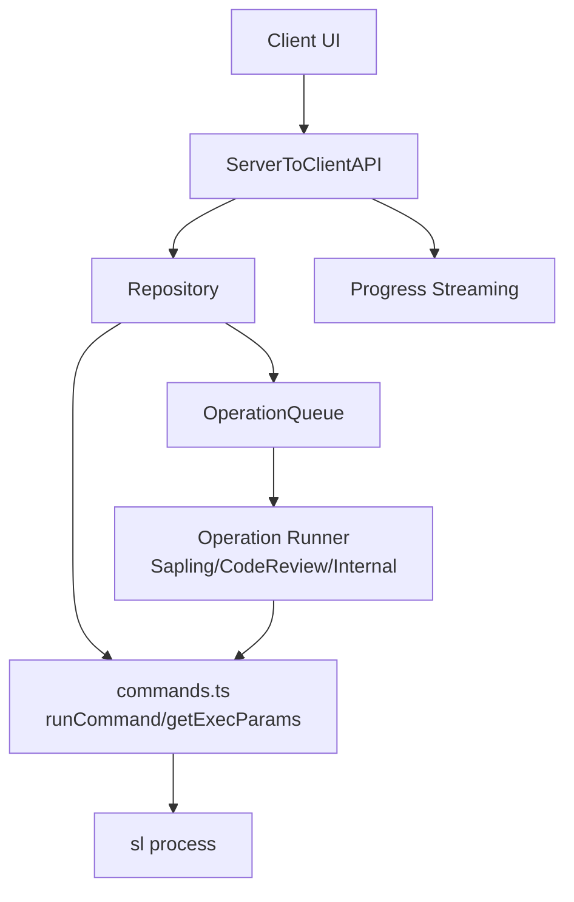
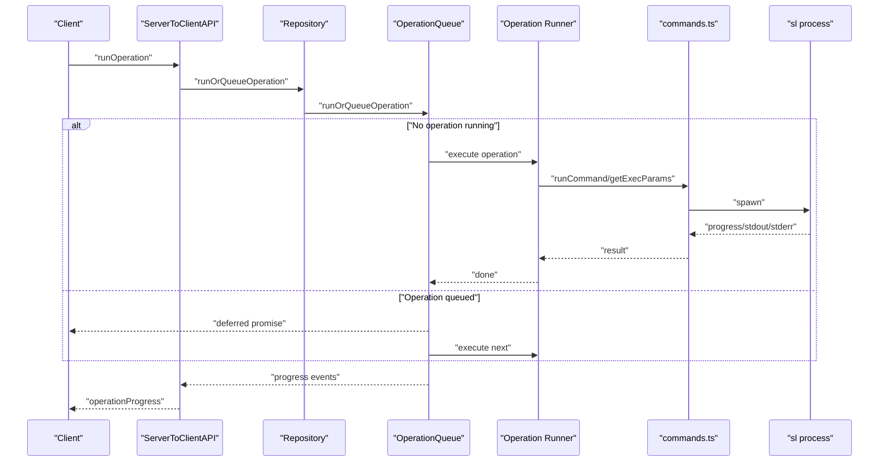
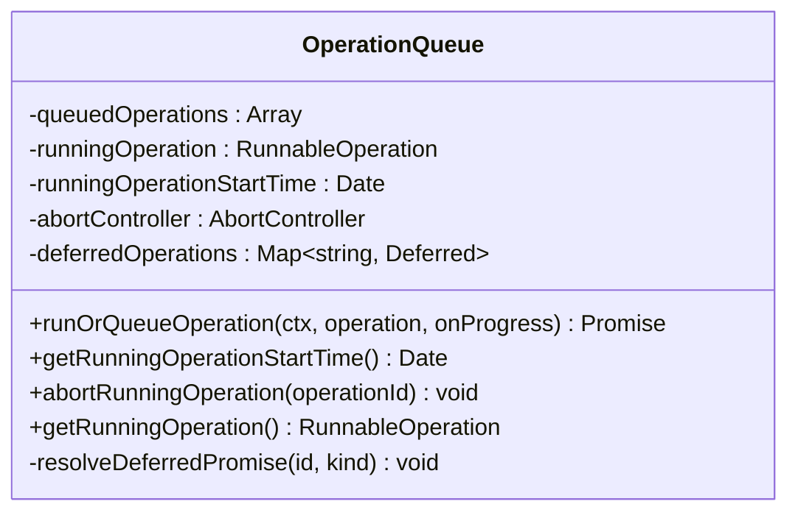
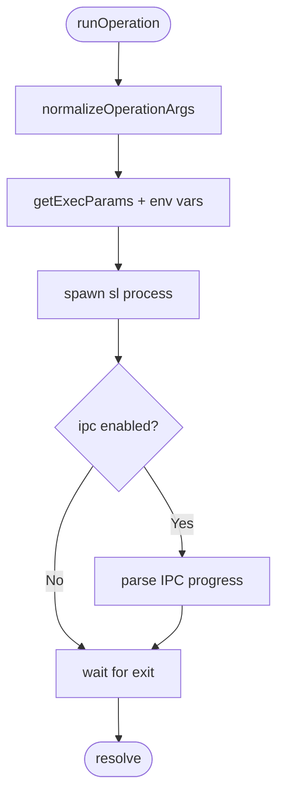
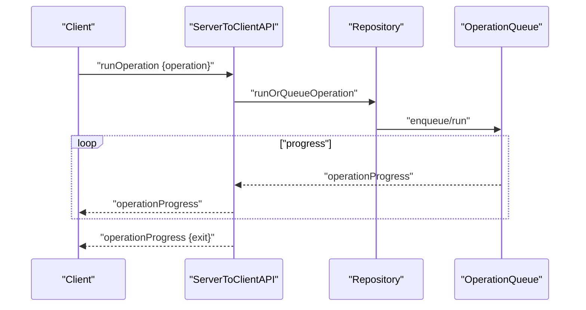
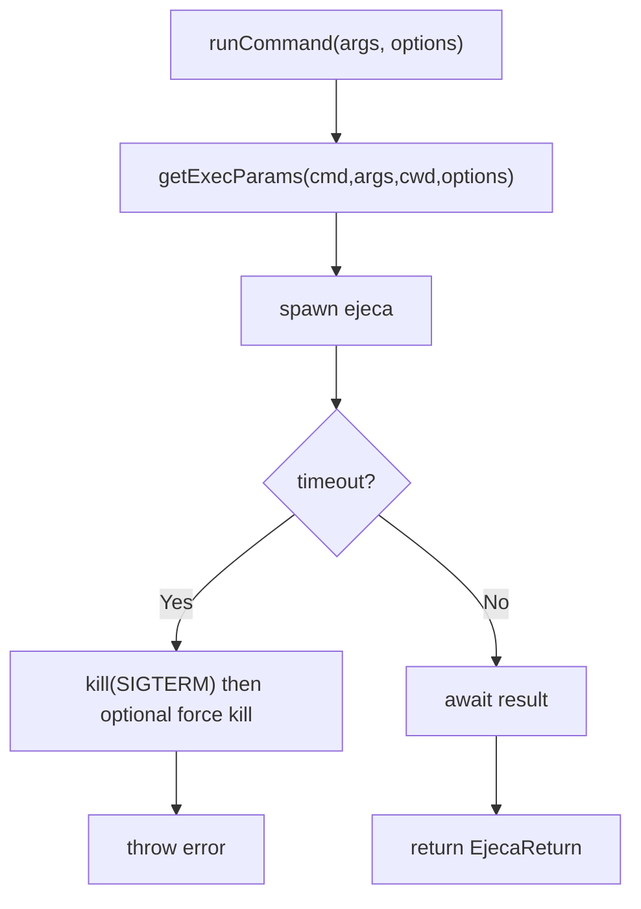
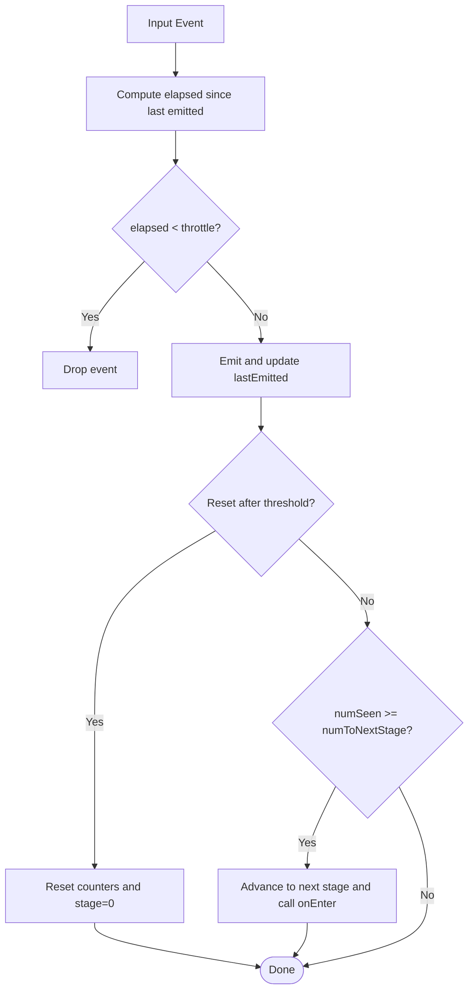
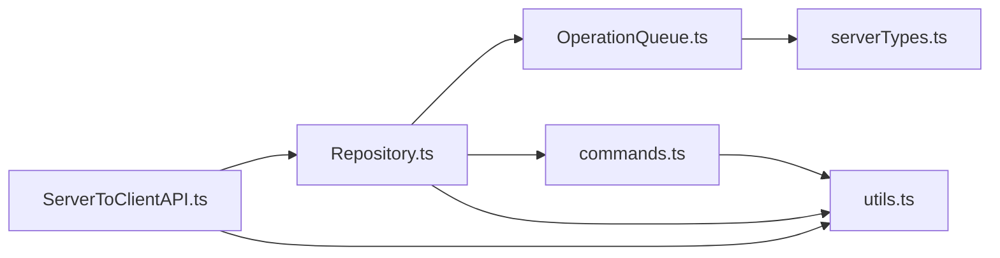

# Operation Queue and Background Processing

<cite>
**Referenced Files in This Document**
- [OperationQueue.ts](file://addons/isl-server/src/OperationQueue.ts)
- [StagedThrottler.ts](file://addons/isl-server/src/StagedThrottler.ts)
- [commands.ts](file://addons/isl-server/src/commands.ts)
- [Repository.ts](file://addons/isl-server/src/Repository.ts)
- [ServerToClientAPI.ts](file://addons/isl-server/src/ServerToClientAPI.ts)
- [serverTypes.ts](file://addons/isl-server/src/serverTypes.ts)
- [utils.ts](file://addons/isl-server/src/utils.ts)
</cite>

## Table of Contents
1. [Introduction](#introduction)
2. [Project Structure](#project-structure)
3. [Core Components](#core-components)
4. [Architecture Overview](#architecture-overview)
5. [Detailed Component Analysis](#detailed-component-analysis)
6. [Dependency Analysis](#dependency-analysis)
7. [Performance Considerations](#performance-considerations)
8. [Troubleshooting Guide](#troubleshooting-guide)
9. [Conclusion](#conclusion)

## Introduction
This document explains the operation queue system and background processing architecture used by the server-side ISL (Interactive Smartlog) addon. It covers how operations are registered, validated, scheduled, executed, and monitored; how concurrency is controlled; and how progress and errors are surfaced to the client. It also documents the staged throttler mechanism used to prevent system overload and provides practical guidance for queue management, throttling strategies, and troubleshooting.

## Project Structure
The operation queue and background processing live primarily in the server module of the ISL addon. Key files include:
- OperationQueue: serializes operation execution and manages a per-repository queue
- Repository: orchestrates command execution, parameter normalization, and progress reporting
- ServerToClientAPI: handles client messages, dispatches operations, and streams progress
- commands: provides command execution utilities, timeouts, and environment normalization
- StagedThrottler: incremental throttling for event-heavy scenarios
- serverTypes: defines the per-connection context used across the system
- utils: shared utilities including abort handling and JSON parsing helpers

**Diagram sources**
- [ServerToClientAPI.ts:525-534](file://addons/isl-server/src/ServerToClientAPI.ts#L525-L534)
- [Repository.ts:630-642](file://addons/isl-server/src/Repository.ts#L630-L642)
- [OperationQueue.ts:47-145](file://addons/isl-server/src/OperationQueue.ts#L47-L145)
- [commands.ts:52-93](file://addons/isl-server/src/commands.ts#L52-L93)

**Section sources**
- [ServerToClientAPI.ts:525-534](file://addons/isl-server/src/ServerToClientAPI.ts#L525-L534)
- [Repository.ts:630-642](file://addons/isl-server/src/Repository.ts#L630-L642)
- [OperationQueue.ts:25-182](file://addons/isl-server/src/OperationQueue.ts#L25-L182)
- [commands.ts:52-93](file://addons/isl-server/src/commands.ts#L52-L93)

## Core Components
- OperationQueue: Ensures single-concurrent execution of operations, queues subsequent operations, tracks progress, and handles aborts and cleanup.
- Repository: Normalizes operation arguments, constructs execution environments, runs commands, and integrates with the OperationQueue.
- ServerToClientAPI: Receives client requests, dispatches operations, and streams progress updates.
- commands: Provides runCommand, getExecParams, timeouts, and environment normalization.
- StagedThrottler: Increments throttling thresholds based on event frequency and reset timing.
- serverTypes: Defines RepositoryContext used across the system.
- utils: Utilities for abort handling, JSON parsing, and serialized async execution.

**Section sources**
- [OperationQueue.ts:25-182](file://addons/isl-server/src/OperationQueue.ts#L25-L182)
- [Repository.ts:630-809](file://addons/isl-server/src/Repository.ts#L630-L809)
- [ServerToClientAPI.ts:525-534](file://addons/isl-server/src/ServerToClientAPI.ts#L525-L534)
- [commands.ts:52-250](file://addons/isl-server/src/commands.ts#L52-L250)
- [StagedThrottler.ts:20-72](file://addons/isl-server/src/StagedThrottler.ts#L20-L72)
- [serverTypes.ts:17-35](file://addons/isl-server/src/serverTypes.ts#L17-L35)
- [utils.ts:81-97](file://addons/isl-server/src/utils.ts#L81-L97)

## Architecture Overview
The system centers around a per-repository OperationQueue that serializes operations. The Repository normalizes arguments and executes commands via commands.ts, which wraps process execution with timeouts and environment normalization. ServerToClientAPI receives client messages, dispatches operations to the Repository, and streams progress back to the client. The staged throttler pattern can be applied to reduce event pressure in high-frequency scenarios.

**Diagram sources**
- [ServerToClientAPI.ts:525-534](file://addons/isl-server/src/ServerToClientAPI.ts#L525-L534)
- [Repository.ts:630-642](file://addons/isl-server/src/Repository.ts#L630-L642)
- [OperationQueue.ts:47-145](file://addons/isl-server/src/OperationQueue.ts#L47-L145)
- [commands.ts:52-93](file://addons/isl-server/src/commands.ts#L52-L93)

## Detailed Component Analysis

### OperationQueue
Responsibilities:
- Serialize operations to ensure only one runs at a time
- Queue subsequent operations and track deferred promises keyed by operation ID
- Stream progress events to the caller
- Abort running operations via AbortController
- Clear caches after completion and resolve deferred promises for enqueuers

Key behaviors:
- Progress mapping: translates internal progress kinds to standardized operationProgress messages
- Error handling: on error, clears the queue and resolves all queued deferreds as “skipped”
- Dequeueing: after completion, shifts the next operation from the queue and runs it asynchronously
- Memory hygiene: triggers cache clearing after finishing

**Diagram sources**
- [OperationQueue.ts:25-182](file://addons/isl-server/src/OperationQueue.ts#L25-L182)

**Section sources**
- [OperationQueue.ts:25-182](file://addons/isl-server/src/OperationQueue.ts#L25-L182)

### Repository
Responsibilities:
- Normalize operation arguments and stdin for safe execution
- Construct execution environments and options via getExecParams
- Enforce argument safety (blocklisted flags and revset misuse)
- Integrate with OperationQueue for execution and progress streaming
- Apply IPC progress parsing when enabled

Highlights:
- Argument normalization validates and converts repo-relative paths and stdin injection
- Blocklisted commands are rejected outright
- Progress events are forwarded to the caller and used to trigger immediate polling

**Diagram sources**
- [Repository.ts:762-809](file://addons/isl-server/src/Repository.ts#L762-L809)
- [commands.ts:186-250](file://addons/isl-server/src/commands.ts#L186-L250)

**Section sources**
- [Repository.ts:656-708](file://addons/isl-server/src/Repository.ts#L656-L708)
- [Repository.ts:762-809](file://addons/isl-server/src/Repository.ts#L762-L809)
- [commands.ts:186-250](file://addons/isl-server/src/commands.ts#L186-L250)

### ServerToClientAPI
Responsibilities:
- Deserialize incoming messages and route them appropriately
- Dispatch runOperation to the active Repository
- Stream operationProgress back to the client
- Track queueing and execution events for analytics

Key flows:
- runOperation: calls repo.runOrQueueOperation and forwards progress
- abortRunningOperation: aborts the running operation if IDs match
- Missed progress: sends “forgot” if the client reconnects after an operation completes

**Diagram sources**
- [ServerToClientAPI.ts:525-534](file://addons/isl-server/src/ServerToClientAPI.ts#L525-L534)
- [Repository.ts:630-642](file://addons/isl-server/src/Repository.ts#L630-L642)
- [OperationQueue.ts:65-93](file://addons/isl-server/src/OperationQueue.ts#L65-L93)

**Section sources**
- [ServerToClientAPI.ts:525-534](file://addons/isl-server/src/ServerToClientAPI.ts#L525-L534)
- [ServerToClientAPI.ts:345-349](file://addons/isl-server/src/ServerToClientAPI.ts#L345-L349)

### commands
Responsibilities:
- runCommand: spawns sl with normalized arguments and options, applies timeouts, and handles kills
- getExecParams: normalizes arguments, excludes interactive editors, sets encoding and automation flags, and injects progress IPC when requested
- findRoot/findRoots: repository discovery helpers
- getConfigs/setConfig: configuration retrieval and mutation

Important behaviors:
- Timeout handling: SIGTERM then optional forced kill after timeout
- Blackbox exclusion for read-only commands
- Status command locking to avoid watchman contention

**Diagram sources**
- [commands.ts:52-93](file://addons/isl-server/src/commands.ts#L52-L93)
- [commands.ts:186-250](file://addons/isl-server/src/commands.ts#L186-L250)

**Section sources**
- [commands.ts:52-93](file://addons/isl-server/src/commands.ts#L52-L93)
- [commands.ts:186-250](file://addons/isl-server/src/commands.ts#L186-L250)

### StagedThrottler
Purpose:
- Incrementally throttles event emission when bursts occur, then resets after inactivity

Mechanism:
- Maintains current stage index and counters for events and resets
- Compares elapsed time against current throttle threshold
- Emits only when outside the throttle window
- Resets to stage 0 after extended inactivity or advances to next stage based on thresholds

**Diagram sources**
- [StagedThrottler.ts:20-72](file://addons/isl-server/src/StagedThrottler.ts#L20-L72)

**Section sources**
- [StagedThrottler.ts:20-72](file://addons/isl-server/src/StagedThrottler.ts#L20-L72)

### serverTypes
Defines RepositoryContext used across the system:
- cmd: command to run (e.g., sl)
- cwd: working directory
- logger/tracker: per-connection logging and analytics
- knownConfigs/debug/verbose: runtime toggles and configuration cache
- cachedMergeTool: memoized merge tool resolution

**Section sources**
- [serverTypes.ts:17-35](file://addons/isl-server/src/serverTypes.ts#L17-L35)

### utils
Utilities supporting background processing:
- handleAbortSignalOnProcess: robustly handles aborts across platforms
- serializeAsyncCall: serializes async calls to ensure single-flight execution
- parseExecJson: safely parses JSON outputs from commands

**Section sources**
- [utils.ts:81-97](file://addons/isl-server/src/utils.ts#L81-L97)
- [utils.ts:42-73](file://addons/isl-server/src/utils.ts#L42-L73)
- [utils.ts:131-165](file://addons/isl-server/src/utils.ts#L131-L165)

## Dependency Analysis
High-level dependencies:
- ServerToClientAPI depends on Repository for operation execution
- Repository depends on OperationQueue for serialization and on commands.ts for process execution
- OperationQueue depends on RepositoryContext and progress callbacks
- StagedThrottler is a reusable utility that can be applied to event streams

**Diagram sources**
- [ServerToClientAPI.ts:525-534](file://addons/isl-server/src/ServerToClientAPI.ts#L525-L534)
- [Repository.ts:630-642](file://addons/isl-server/src/Repository.ts#L630-L642)
- [OperationQueue.ts:25-39](file://addons/isl-server/src/OperationQueue.ts#L25-L39)
- [commands.ts:52-93](file://addons/isl-server/src/commands.ts#L52-L93)
- [serverTypes.ts:17-35](file://addons/isl-server/src/serverTypes.ts#L17-L35)
- [utils.ts:81-97](file://addons/isl-server/src/utils.ts#L81-L97)

**Section sources**
- [ServerToClientAPI.ts:525-534](file://addons/isl-server/src/ServerToClientAPI.ts#L525-L534)
- [Repository.ts:630-642](file://addons/isl-server/src/Repository.ts#L630-L642)
- [OperationQueue.ts:25-39](file://addons/isl-server/src/OperationQueue.ts#L25-L39)
- [commands.ts:52-93](file://addons/isl-server/src/commands.ts#L52-L93)
- [serverTypes.ts:17-35](file://addons/isl-server/src/serverTypes.ts#L17-L35)
- [utils.ts:81-97](file://addons/isl-server/src/utils.ts#L81-L97)

## Performance Considerations
- Single-concurrency execution: OperationQueue prevents resource contention by ensuring only one operation runs at a time.
- Queue-based batching: Queued operations are resolved in FIFO order, reducing overhead from frequent process spawning.
- Timeout enforcement: commands.ts applies timeouts to prevent long-running operations from blocking the pipeline.
- Environment normalization: getExecParams avoids interactive prompts and sets encoding and automation flags to reduce variability.
- IPC progress: When enabled, Repository parses progress updates from the child process to keep the UI responsive.
- Cache clearing: OperationQueue clears caches after completion to manage memory usage.

[No sources needed since this section provides general guidance]

## Troubleshooting Guide
Common issues and remedies:
- Operation stuck or not responding
  - Verify the running operation ID and use abortRunningOperation to terminate it
  - Check for blocked signals on Windows versus Unix and rely on handleAbortSignalOnProcess behavior
- Queue not progressing after an error
  - OperationQueue clears the queue and resolves queued operations as “skipped”; confirm that deferred promises are resolved
- Excessive watchman contention
  - Status command is locked via getExecParams; ensure other commands are not bypassing this
- Timeout failures
  - Increase timeouts for long-running operations or split workloads
- Progress not updating
  - Ensure IPC is enabled and parseable; otherwise, rely on stdout/stderr events
- Parameter validation errors
  - normalizeOperationArgs rejects illegal flags and invalid revsets; adjust arguments accordingly

**Section sources**
- [OperationQueue.ts:104-125](file://addons/isl-server/src/OperationQueue.ts#L104-L125)
- [OperationQueue.ts:171-175](file://addons/isl-server/src/OperationQueue.ts#L171-L175)
- [Repository.ts:797-800](file://addons/isl-server/src/Repository.ts#L797-L800)
- [Repository.ts:762-809](file://addons/isl-server/src/Repository.ts#L762-L809)
- [utils.ts:81-97](file://addons/isl-server/src/utils.ts#L81-L97)
- [commands.ts:186-250](file://addons/isl-server/src/commands.ts#L186-L250)

## Conclusion
The operation queue and background processing architecture ensures predictable, safe, and observable execution of repository operations. OperationQueue serializes execution and provides robust progress and abort capabilities. Repository encapsulates argument normalization, environment setup, and progress parsing. ServerToClientAPI coordinates client-server communication and event streaming. The staged throttler offers a scalable pattern for managing event pressure. Together, these components deliver a resilient and observable background processing pipeline suitable for interactive development workflows.