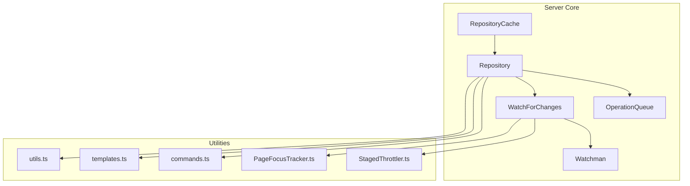
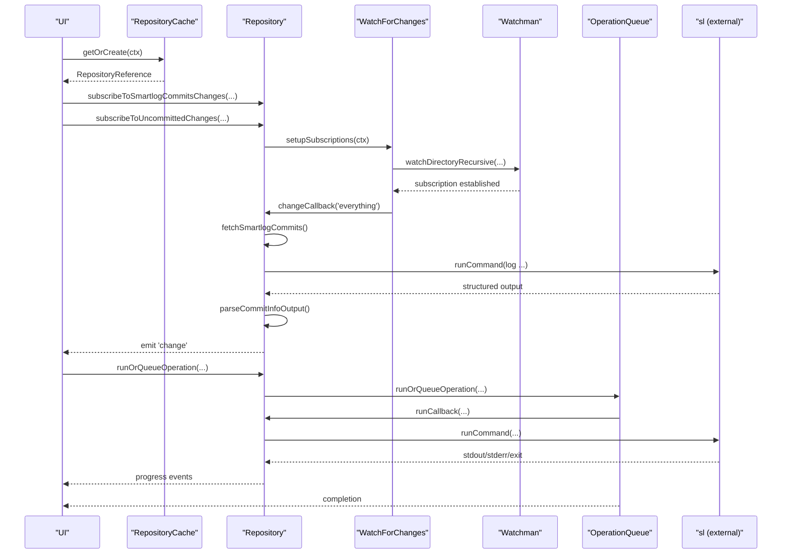
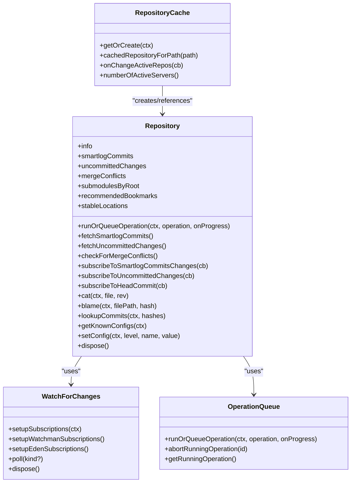
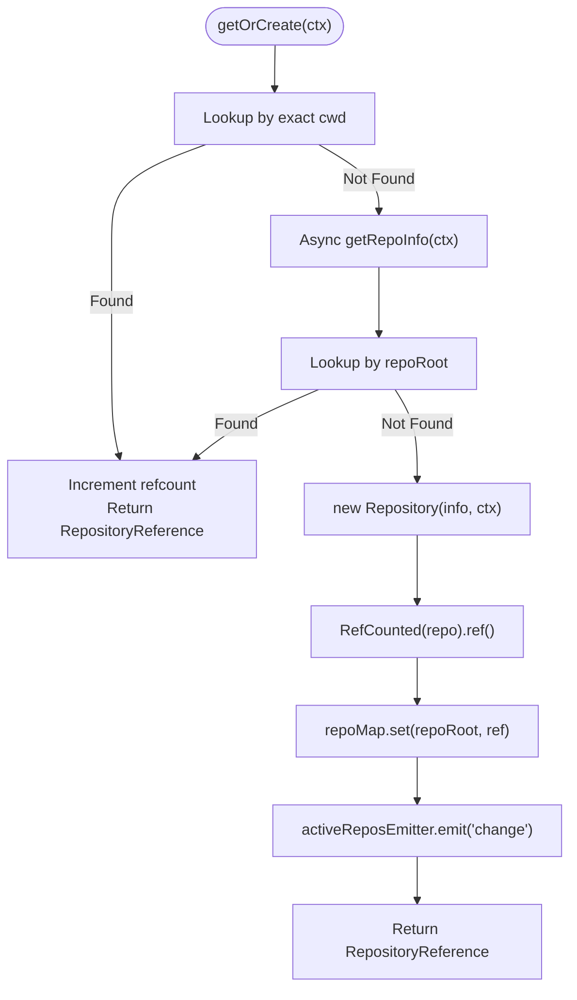
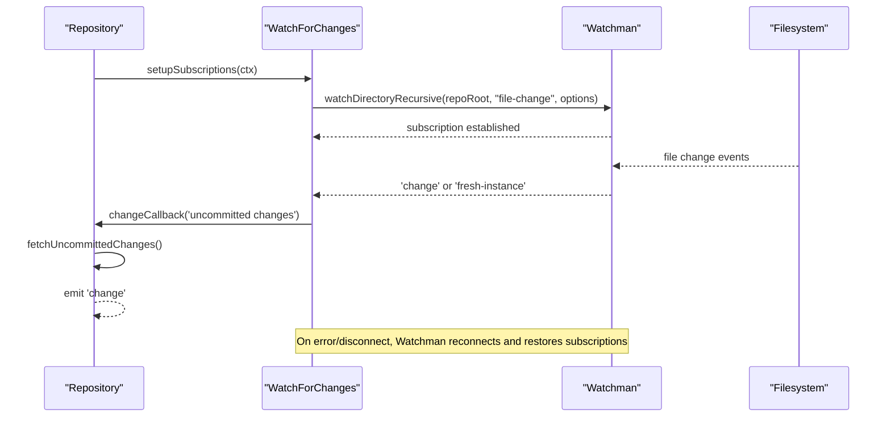
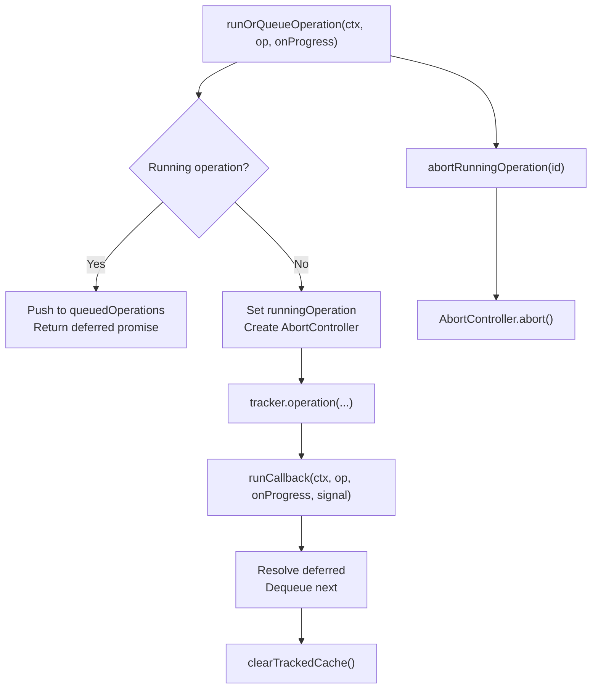
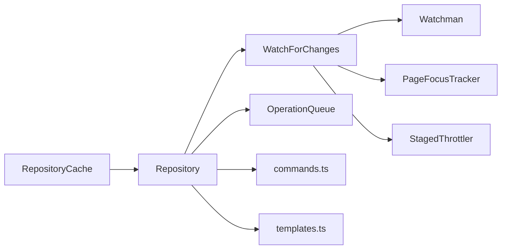

# Repository Management and Cache System

<cite>
**Referenced Files in This Document**
- [Repository.ts](file://addons/isl-server/src/Repository.ts)
- [RepositoryCache.ts](file://addons/isl-server/src/RepositoryCache.ts)
- [watchman.ts](file://addons/isl-server/src/watchman.ts)
- [WatchForChanges.ts](file://addons/isl-server/src/WatchForChanges.ts)
- [OperationQueue.ts](file://addons/isl-server/src/OperationQueue.ts)
- [StagedThrottler.ts](file://addons/isl-server/src/StagedThrottler.ts)
- [PageFocusTracker.ts](file://addons/isl-server/src/PageFocusTracker.ts)
- [commands.ts](file://addons/isl-server/src/commands.ts)
- [templates.ts](file://addons/isl-server/src/templates.ts)
- [constants.ts](file://addons/isl-server/src/constants.ts)
- [utils.ts](file://addons/isl-server/src/utils.ts)
</cite>

## Table of Contents
1. [Introduction](#introduction)
2. [Project Structure](#project-structure)
3. [Core Components](#core-components)
4. [Architecture Overview](#architecture-overview)
5. [Detailed Component Analysis](#detailed-component-analysis)
6. [Dependency Analysis](#dependency-analysis)
7. [Performance Considerations](#performance-considerations)
8. [Troubleshooting Guide](#troubleshooting-guide)
9. [Conclusion](#conclusion)

## Introduction
This document explains the repository management and caching system used by the ISL server. It covers the Repository class lifecycle, repository initialization, repository caching and reference counting, watchman integration for file change monitoring, real-time update propagation, cache invalidation strategies, and performance optimizations. It also provides practical examples of cache and repository operations and guidance for troubleshooting cache-related issues.

## Project Structure
The repository management and caching system is implemented primarily in the addons/isl-server/src directory. Key modules include:
- Repository: central class managing repository state, data fetching, and event emission
- RepositoryCache: reference-counted cache for Repository instances
- WatchForChanges: orchestrates file change monitoring via watchman and EdenFS
- watchman: low-level watchman client wrapper with reconnection and subscription management
- OperationQueue: serializes and tracks long-running operations
- Supporting utilities: commands, templates, constants, and throttling helpers

**Diagram sources**
- [Repository.ts:113-364](file://addons/isl-server/src/Repository.ts#L113-L364)
- [RepositoryCache.ts:116-242](file://addons/isl-server/src/RepositoryCache.ts#L116-L242)
- [WatchForChanges.ts:41-75](file://addons/isl-server/src/WatchForChanges.ts#L41-L75)
- [watchman.ts:64-112](file://addons/isl-server/src/watchman.ts#L64-L112)
- [OperationQueue.ts:25-182](file://addons/isl-server/src/OperationQueue.ts#L25-L182)
- [StagedThrottler.ts:20-73](file://addons/isl-server/src/StagedThrottler.ts#L20-L73)
- [PageFocusTracker.ts:13-56](file://addons/isl-server/src/PageFocusTracker.ts#L13-L56)
- [commands.ts:52-93](file://addons/isl-server/src/commands.ts#L52-L93)
- [templates.ts:74-132](file://addons/isl-server/src/templates.ts#L74-L132)

**Section sources**
- [Repository.ts:113-364](file://addons/isl-server/src/Repository.ts#L113-L364)
- [RepositoryCache.ts:116-242](file://addons/isl-server/src/RepositoryCache.ts#L116-L242)
- [WatchForChanges.ts:41-75](file://addons/isl-server/src/WatchForChanges.ts#L41-L75)
- [watchman.ts:64-112](file://addons/isl-server/src/watchman.ts#L64-L112)
- [OperationQueue.ts:25-182](file://addons/isl-server/src/OperationQueue.ts#L25-L182)
- [StagedThrottler.ts:20-73](file://addons/isl-server/src/StagedThrottler.ts#L20-L73)
- [PageFocusTracker.ts:13-56](file://addons/isl-server/src/PageFocusTracker.ts#L13-L56)
- [commands.ts:52-93](file://addons/isl-server/src/commands.ts#L52-L93)
- [templates.ts:74-132](file://addons/isl-server/src/templates.ts#L74-L132)

## Core Components
- Repository: encapsulates repository state, exposes APIs for fetching commits, uncommitted changes, submodules, and operations, and emits change events. It manages watch subscriptions and integrates with code review providers.
- RepositoryCache: reference-counted cache keyed by repository root path, enabling reuse of Repository instances across multiple connections and avoiding duplicate initialization work.
- WatchForChanges: coordinates file change monitoring via watchman and EdenFS, handles polling, throttling, and event-driven refreshes.
- watchman: wraps the watchman client, manages subscriptions, reconnects on failure, and restores subscriptions after disconnections.
- OperationQueue: serializes operations, tracks progress, supports abort, and frees memory after completion.
- Supporting utilities: commands for running sl commands, templates for parsing structured output, constants, and throttling helpers.

**Section sources**
- [Repository.ts:113-364](file://addons/isl-server/src/Repository.ts#L113-L364)
- [RepositoryCache.ts:116-242](file://addons/isl-server/src/RepositoryCache.ts#L116-L242)
- [WatchForChanges.ts:41-75](file://addons/isl-server/src/WatchForChanges.ts#L41-L75)
- [watchman.ts:64-112](file://addons/isl-server/src/watchman.ts#L64-L112)
- [OperationQueue.ts:25-182](file://addons/isl-server/src/OperationQueue.ts#L25-L182)
- [StagedThrottler.ts:20-73](file://addons/isl-server/src/StagedThrottler.ts#L20-L73)
- [PageFocusTracker.ts:13-56](file://addons/isl-server/src/PageFocusTracker.ts#L13-L56)
- [commands.ts:52-93](file://addons/isl-server/src/commands.ts#L52-L93)
- [templates.ts:74-132](file://addons/isl-server/src/templates.ts#L74-L132)

## Architecture Overview
The system follows a layered architecture:
- Presentation layer: UI connects to the server and subscribes to repository events.
- Repository layer: Repository manages state and exposes APIs for data retrieval and operations.
- Monitoring layer: WatchForChanges monitors file changes and triggers refreshes.
- Execution layer: OperationQueue serializes operations and handles progress reporting.
- Infrastructure layer: watchman provides file system event subscriptions; commands and templates parse structured output.

**Diagram sources**
- [RepositoryCache.ts:138-203](file://addons/isl-server/src/RepositoryCache.ts#L138-L203)
- [Repository.ts:314-364](file://addons/isl-server/src/Repository.ts#L314-L364)
- [WatchForChanges.ts:348-446](file://addons/isl-server/src/WatchForChanges.ts#L348-L446)
- [watchman.ts:119-168](file://addons/isl-server/src/watchman.ts#L119-L168)
- [OperationQueue.ts:47-145](file://addons/isl-server/src/OperationQueue.ts#L47-L145)
- [commands.ts:52-93](file://addons/isl-server/src/commands.ts#L52-L93)
- [templates.ts:74-132](file://addons/isl-server/src/templates.ts#L74-L132)

## Detailed Component Analysis

### Repository Class
Responsibilities:
- Manage repository state (merge conflicts, uncommitted changes, smartlog commits, submodules).
- Emit change events for subscribers.
- Initialize watch subscriptions and integrate with code review providers.
- Serialize and throttle operations and data fetches.
- Provide APIs for running commands, fetching data, and manipulating repository state.

Key behaviors:
- Initialization sets up watchers, code review provider, operation queue, and event emitters.
- Change callbacks coordinate refreshes for uncommitted changes, commits, and merge conflicts.
- Data fetching uses structured templates and parses output into typed models.
- Memory optimization via LRU caches and clearing tracked caches after operations.

**Diagram sources**
- [Repository.ts:113-364](file://addons/isl-server/src/Repository.ts#L113-L364)
- [WatchForChanges.ts:41-75](file://addons/isl-server/src/WatchForChanges.ts#L41-L75)
- [OperationQueue.ts:25-182](file://addons/isl-server/src/OperationQueue.ts#L25-L182)
- [RepositoryCache.ts:116-242](file://addons/isl-server/src/RepositoryCache.ts#L116-L242)

**Section sources**
- [Repository.ts:113-364](file://addons/isl-server/src/Repository.ts#L113-L364)
- [Repository.ts:864-924](file://addons/isl-server/src/Repository.ts#L864-L924)
- [Repository.ts:969-1044](file://addons/isl-server/src/Repository.ts#L969-L1044)
- [Repository.ts:1366-1410](file://addons/isl-server/src/Repository.ts#L1366-L1410)
- [Repository.ts:1692-1736](file://addons/isl-server/src/Repository.ts#L1692-L1736)

### RepositoryCache Mechanism
Responsibilities:
- Provide reference-counted access to Repository instances.
- Enable reuse of repositories across multiple connections and cwds.
- Maintain a map keyed by repository root path with longest-prefix match for nested repos.
- Emit change events when repositories are created or disposed.

Key behaviors:
- getOrCreate resolves repo info asynchronously, then either reuses an existing repository or creates a new one.
- Reference counting ensures timely disposal when no longer needed.
- Active repository enumeration and cache clearing for testing.

**Diagram sources**
- [RepositoryCache.ts:138-203](file://addons/isl-server/src/RepositoryCache.ts#L138-L203)
- [Repository.ts:516-597](file://addons/isl-server/src/Repository.ts#L516-L597)

**Section sources**
- [RepositoryCache.ts:116-242](file://addons/isl-server/src/RepositoryCache.ts#L116-L242)
- [Repository.ts:516-597](file://addons/isl-server/src/Repository.ts#L516-L597)

### Watchman Integration and Real-time Updates
Responsibilities:
- Establish watchman subscriptions for repository state and file changes.
- Handle reconnects and subscription restoration after client errors or disconnections.
- Coordinate polling intervals based on page visibility and focus.
- Apply staged throttling to reduce excessive refreshes.

Key behaviors:
- Watchman client manages status transitions and exponential backoff on reconnect.
- WatchForChanges sets up dirstate and file change subscriptions, deferring certain states.
- Staged throttler progressively increases throttling thresholds when events occur too frequently.

**Diagram sources**
- [WatchForChanges.ts:348-446](file://addons/isl-server/src/WatchForChanges.ts#L348-L446)
- [watchman.ts:190-275](file://addons/isl-server/src/watchman.ts#L190-L275)
- [StagedThrottler.ts:20-73](file://addons/isl-server/src/StagedThrottler.ts#L20-L73)

**Section sources**
- [WatchForChanges.ts:41-75](file://addons/isl-server/src/WatchForChanges.ts#L41-L75)
- [WatchForChanges.ts:169-237](file://addons/isl-server/src/WatchForChanges.ts#L169-L237)
- [WatchForChanges.ts:348-446](file://addons/isl-server/src/WatchForChanges.ts#L348-L446)
- [watchman.ts:64-112](file://addons/isl-server/src/watchman.ts#L64-L112)
- [watchman.ts:190-275](file://addons/isl-server/src/watchman.ts#L190-L275)
- [StagedThrottler.ts:20-73](file://addons/isl-server/src/StagedThrottler.ts#L20-L73)

### Repository State Management and Concurrent Access
- Event-driven state updates: Repository emits change events for commits, uncommitted changes, merge conflicts, and submodules.
- Concurrency control: OperationQueue serializes operations and supports abort; Repository uses serializeAsyncCall to serialize expensive fetches.
- Memory optimization: LRU caches for commits and tracked caches cleared after operations.

**Diagram sources**
- [OperationQueue.ts:47-145](file://addons/isl-server/src/OperationQueue.ts#L47-L145)
- [Repository.ts:880-924](file://addons/isl-server/src/Repository.ts#L880-L924)
- [Repository.ts:969-1044](file://addons/isl-server/src/Repository.ts#L969-L1044)

**Section sources**
- [OperationQueue.ts:25-182](file://addons/isl-server/src/OperationQueue.ts#L25-L182)
- [Repository.ts:880-924](file://addons/isl-server/src/Repository.ts#L880-L924)
- [Repository.ts:969-1044](file://addons/isl-server/src/Repository.ts#L969-L1044)

### Cache Invalidation Strategies
- Explicit invalidation: Repository invalidates submodule path cache when submodules change.
- Time-based refresh: WatchForChanges adjusts polling intervals based on visibility and focus.
- Operational refresh: After operations complete, Repository forces immediate polling to ensure UI consistency.
- Config-driven refresh: Hold-off refresh controlled by configuration to avoid noisy intermediate states.

**Section sources**
- [Repository.ts:1204-1206](file://addons/isl-server/src/Repository.ts#L1204-L1206)
- [WatchForChanges.ts:104-150](file://addons/isl-server/src/WatchForChanges.ts#L104-L150)
- [Repository.ts:630-642](file://addons/isl-server/src/Repository.ts#L630-L642)
- [Repository.ts:1727-1736](file://addons/isl-server/src/Repository.ts#L1727-L1736)

### Performance Optimizations
- Structured templates: templates.ts defines efficient templates for log and status to minimize payload sizes.
- Parallelism limits: RateLimiter controls concurrent cat calls; OperationQueue serializes operations to prevent resource contention.
- Debouncing and throttling: WatchForChanges uses debounce and staged throttling to reduce unnecessary refreshes.
- Memory cleanup: clearTrackedCache invoked after operations to free memory.

**Section sources**
- [templates.ts:35-69](file://addons/isl-server/src/templates.ts#L35-L69)
- [Repository.ts:1208-1219](file://addons/isl-server/src/Repository.ts#L1208-L1219)
- [OperationQueue.ts:140-142](file://addons/isl-server/src/OperationQueue.ts#L140-L142)
- [WatchForChanges.ts:371-403](file://addons/isl-server/src/WatchForChanges.ts#L371-L403)
- [StagedThrottler.ts:20-73](file://addons/isl-server/src/StagedThrottler.ts#L20-L73)

## Dependency Analysis
The system exhibits clear separation of concerns:
- Repository depends on WatchForChanges for monitoring and OperationQueue for execution.
- WatchForChanges depends on watchman for subscriptions and PageFocusTracker for visibility state.
- Repository uses commands and templates for structured data extraction.
- RepositoryCache depends on Repository for creation and reference counting.

**Diagram sources**
- [RepositoryCache.ts:116-242](file://addons/isl-server/src/RepositoryCache.ts#L116-L242)
- [Repository.ts:113-364](file://addons/isl-server/src/Repository.ts#L113-L364)
- [WatchForChanges.ts:41-75](file://addons/isl-server/src/WatchForChanges.ts#L41-L75)
- [watchman.ts:64-112](file://addons/isl-server/src/watchman.ts#L64-L112)
- [OperationQueue.ts:25-182](file://addons/isl-server/src/OperationQueue.ts#L25-L182)
- [commands.ts:52-93](file://addons/isl-server/src/commands.ts#L52-L93)
- [templates.ts:74-132](file://addons/isl-server/src/templates.ts#L74-L132)
- [PageFocusTracker.ts:13-56](file://addons/isl-server/src/PageFocusTracker.ts#L13-L56)
- [StagedThrottler.ts:20-73](file://addons/isl-server/src/StagedThrottler.ts#L20-L73)

**Section sources**
- [RepositoryCache.ts:116-242](file://addons/isl-server/src/RepositoryCache.ts#L116-L242)
- [Repository.ts:113-364](file://addons/isl-server/src/Repository.ts#L113-L364)
- [WatchForChanges.ts:41-75](file://addons/isl-server/src/WatchForChanges.ts#L41-L75)
- [watchman.ts:64-112](file://addons/isl-server/src/watchman.ts#L64-L112)
- [OperationQueue.ts:25-182](file://addons/isl-server/src/OperationQueue.ts#L25-L182)
- [commands.ts:52-93](file://addons/isl-server/src/commands.ts#L52-L93)
- [templates.ts:74-132](file://addons/isl-server/src/templates.ts#L74-L132)
- [PageFocusTracker.ts:13-56](file://addons/isl-server/src/PageFocusTracker.ts#L13-L56)
- [StagedThrottler.ts:20-73](file://addons/isl-server/src/StagedThrottler.ts#L20-L73)

## Performance Considerations
- Template efficiency: Using compact templates reduces bandwidth and parsing overhead.
- Concurrency control: Limiting simultaneous operations and cat calls prevents resource saturation.
- Visibility-aware polling: Adjusting polling intervals based on page focus reduces unnecessary refreshes.
- Memory hygiene: Clearing tracked caches after operations helps manage memory footprint.
- Debouncing/throttling: Minimizes repeated refreshes during bursts of file changes.

[No sources needed since this section provides general guidance]

## Troubleshooting Guide
Common issues and resolutions:
- Watchman connectivity problems:
  - Symptoms: frequent reconnects, missed events, or subscription cancellations.
  - Actions: verify watchman installation and permissions; check logs for reconnection attempts; ensure subscriptions are restored after errors.
  - Related code: watchman client error handling and reconnect logic.
- Excessive refreshes:
  - Symptoms: UI flickering or frequent reloads.
  - Actions: adjust polling intervals via page focus tracker; enable staged throttling; confirm debounce settings.
  - Related code: WatchForChanges polling and throttling.
- Operation timeouts or hangs:
  - Symptoms: long-running operations blocking UI.
  - Actions: verify timeouts; use abort capability; ensure operations are queued and serialized.
  - Related code: OperationQueue and runCommand wrappers.
- Cache inconsistencies:
  - Symptoms: stale data or incorrect state after operations.
  - Actions: ensure operational refresh after operations; invalidate caches when state changes; verify LRU eviction.
  - Related code: Repository disposal and cache invalidation.

**Section sources**
- [watchman.ts:190-275](file://addons/isl-server/src/watchman.ts#L190-L275)
- [WatchForChanges.ts:104-150](file://addons/isl-server/src/WatchForChanges.ts#L104-L150)
- [OperationQueue.ts:47-145](file://addons/isl-server/src/OperationQueue.ts#L47-L145)
- [Repository.ts:880-924](file://addons/isl-server/src/Repository.ts#L880-L924)
- [Repository.ts:1204-1206](file://addons/isl-server/src/Repository.ts#L1204-L1206)

## Conclusion
The repository management and caching system combines a robust Repository class with a reference-counted cache, intelligent file change monitoring via watchman and EdenFS, and careful concurrency control. It emphasizes performance through structured templates, throttling, and memory hygiene, while providing reliable real-time updates and operational safety through serialization and abort capabilities.