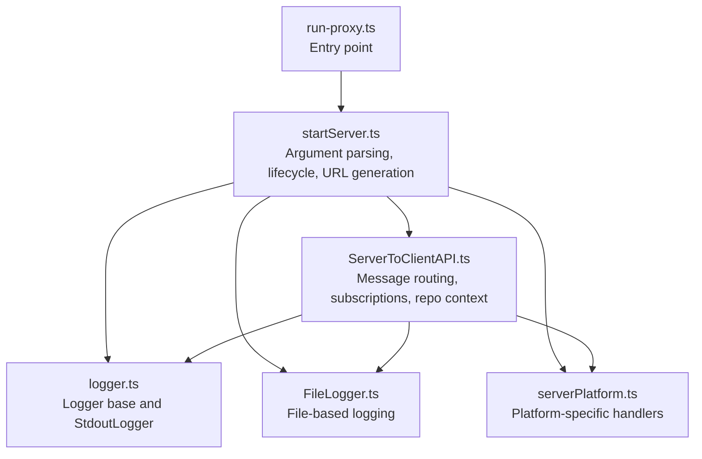
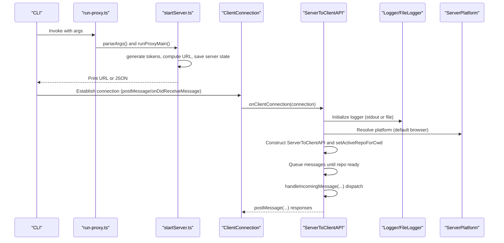
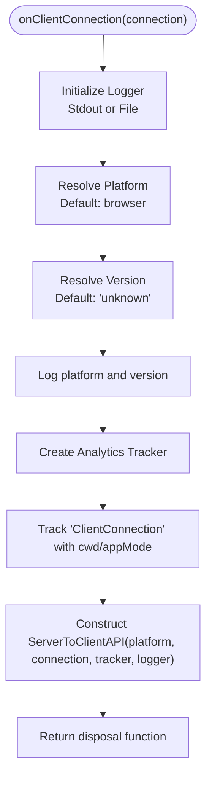
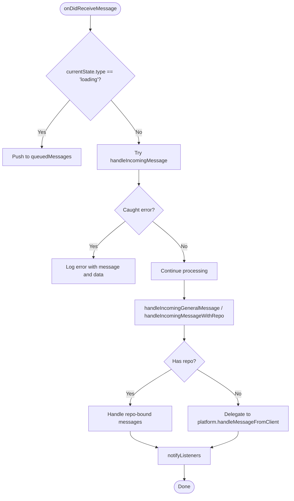
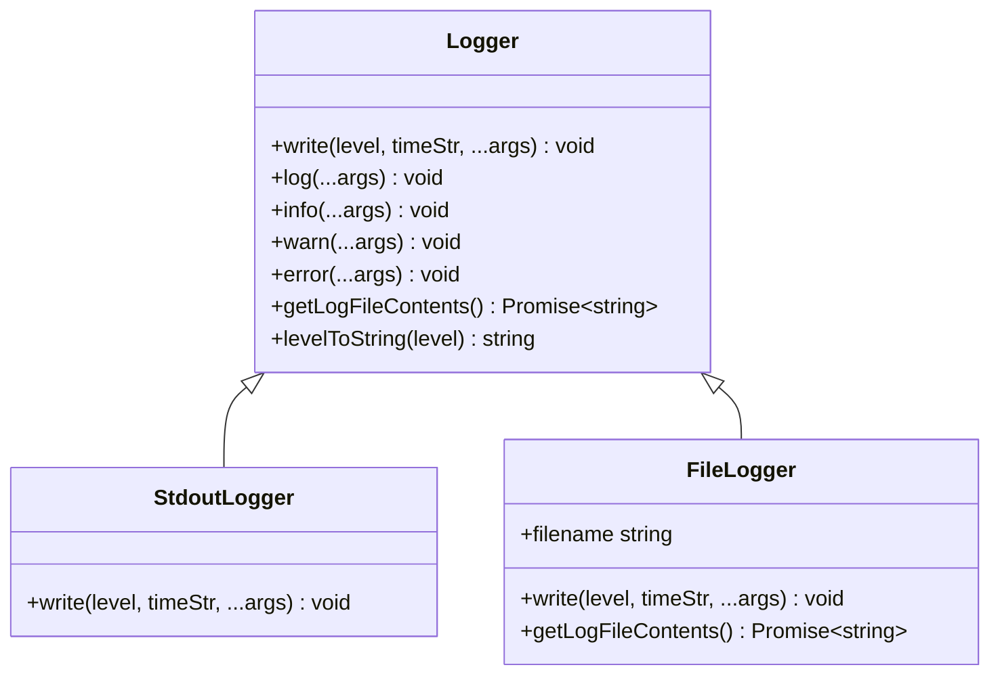
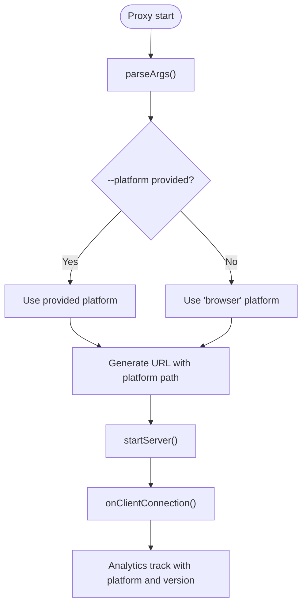
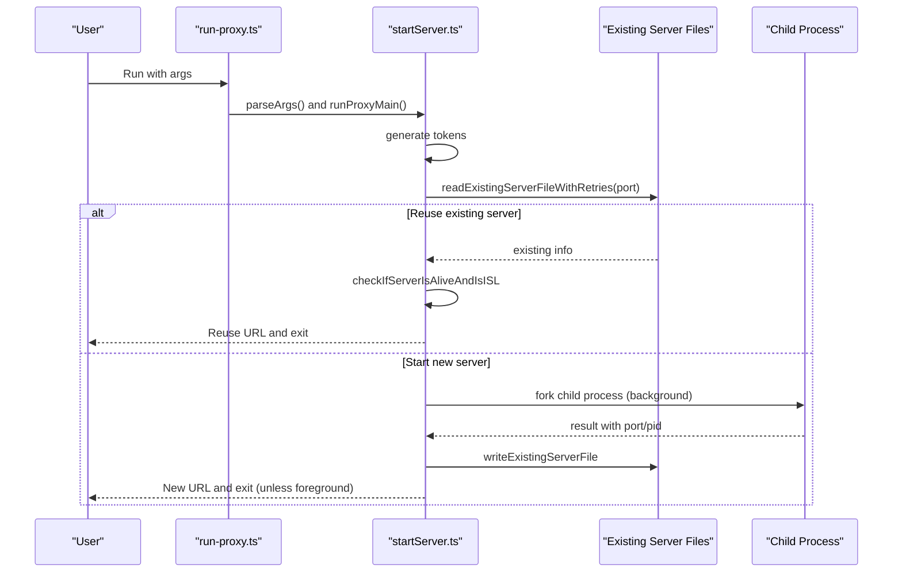
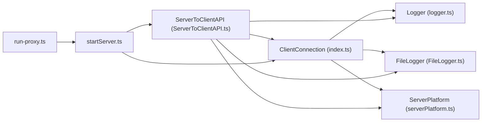

# Server Initialization and Connection Management

<cite>
**Referenced Files in This Document**
- [index.ts](file://addons/isl-server/src/index.ts)
- [ServerToClientAPI.ts](file://addons/isl-server/src/ServerToClientAPI.ts)
- [logger.ts](file://addons/isl-server/src/logger.ts)
- [FileLogger.ts](file://addons/isl-server/src/FileLogger.ts)
- [serverPlatform.ts](file://addons/isl-server/src/serverPlatform.ts)
- [run-proxy.ts](file://addons/isl-server/proxy/run-proxy.ts)
- [startServer.ts](file://addons/isl-server/proxy/startServer.ts)
</cite>

## Table of Contents
1. [Introduction](#introduction)
2. [Project Structure](#project-structure)
3. [Core Components](#core-components)
4. [Architecture Overview](#architecture-overview)
5. [Detailed Component Analysis](#detailed-component-analysis)
6. [Dependency Analysis](#dependency-analysis)
7. [Performance Considerations](#performance-considerations)
8. [Troubleshooting Guide](#troubleshooting-guide)
9. [Conclusion](#conclusion)

## Introduction
This document explains the ISL server initialization and client connection management system. It covers how the server starts, how client connections are established and managed, the message handling pipeline, platform detection, version tracking, logger configuration, and analytics integration. It also documents lifecycle management, error handling strategies, and resource cleanup procedures, with practical examples and troubleshooting guidance for common connection issues.

## Project Structure
The ISL server is implemented as a Node.js module packaged with Rollup and embedded into entry points. The primary entry point for the server is the proxy runner, which parses arguments, manages server lifecycle, and spawns or reuses a background server instance. The server initializes a ClientConnection handler that sets up logging, analytics, and the ServerToClientAPI for bidirectional messaging.

**Diagram sources**
- [run-proxy.ts:1-11](file://addons/isl-server/proxy/run-proxy.ts#L1-L11)
- [startServer.ts:1-754](file://addons/isl-server/proxy/startServer.ts#L1-L754)
- [ServerToClientAPI.ts:1-1392](file://addons/isl-server/src/ServerToClientAPI.ts#L1-L1392)
- [logger.ts:1-105](file://addons/isl-server/src/logger.ts#L1-L105)
- [FileLogger.ts:1-30](file://addons/isl-server/src/FileLogger.ts#L1-L30)
- [serverPlatform.ts:1-166](file://addons/isl-server/src/serverPlatform.ts#L1-L166)

**Section sources**
- [run-proxy.ts:1-11](file://addons/isl-server/proxy/run-proxy.ts#L1-L11)
- [startServer.ts:1-754](file://addons/isl-server/proxy/startServer.ts#L1-L754)

## Core Components
- ClientConnection interface: Defines the contract for client communication, including message posting, receiving, platform metadata, version, and readiness signaling.
- onClientConnection: Initializes logging, platform, version, analytics, and constructs ServerToClientAPI to manage the connection lifecycle.
- ServerToClientAPI: Central message bus that queues messages until a repository is ready, routes messages to platform or repository handlers, manages subscriptions, and performs resource cleanup.
- Logger hierarchy: Provides standardized logging with colored console output and file-based logging for persistent logs.
- ServerPlatform: Encapsulates platform-specific behaviors for handling client messages (e.g., opening files or folders).
- Proxy lifecycle: Parses CLI arguments, generates tokens, determines URL, manages reuse or replacement of existing servers, and optionally opens the browser.

**Section sources**
- [index.ts:20-83](file://addons/isl-server/src/index.ts#L20-L83)
- [ServerToClientAPI.ts:71-224](file://addons/isl-server/src/ServerToClientAPI.ts#L71-L224)
- [logger.ts:31-105](file://addons/isl-server/src/logger.ts#L31-L105)
- [FileLogger.ts:14-30](file://addons/isl-server/src/FileLogger.ts#L14-L30)
- [serverPlatform.ts:25-87](file://addons/isl-server/src/serverPlatform.ts#L25-L87)
- [startServer.ts:364-633](file://addons/isl-server/proxy/startServer.ts#L364-L633)

## Architecture Overview
The server initialization and connection management architecture centers around a single entry point that bootstraps the server, establishes a ClientConnection, and wires up analytics and logging. The ServerToClientAPI acts as a message router, deferring processing until a repository is resolved and managing subscriptions and disposables.

**Diagram sources**
- [run-proxy.ts:8-11](file://addons/isl-server/proxy/run-proxy.ts#L8-L11)
- [startServer.ts:364-633](file://addons/isl-server/proxy/startServer.ts#L364-L633)
- [index.ts:60-83](file://addons/isl-server/src/index.ts#L60-L83)
- [ServerToClientAPI.ts:93-116](file://addons/isl-server/src/ServerToClientAPI.ts#L93-L116)

## Detailed Component Analysis

### ClientConnection and onClientConnection
- Purpose: Establishes a typed connection channel with the client, initializes logging and analytics, and constructs the ServerToClientAPI.
- Key behaviors:
  - Chooses logger based on presence of a log file location; otherwise defaults to stdout.
  - Resolves platform and version; logs connection metadata.
  - Creates analytics tracker and emits a client connection event with context.
  - Returns a disposal function to clean up API resources.

**Diagram sources**
- [index.ts:60-83](file://addons/isl-server/src/index.ts#L60-L83)

**Section sources**
- [index.ts:20-83](file://addons/isl-server/src/index.ts#L20-L83)

### ServerToClientAPI: Message Handling and Lifecycle
- Message queueing: While the repository is loading, incoming messages are queued and replayed after the repository is ready.
- Dispatching:
  - General messages: Heartbeat, stress testing, analytics tracking, readiness, repository info, application info, bug reporting.
  - Repository-bound messages: Subscriptions, operations, config reads/writes, diffs, refresh, visibility, uploads, templates, and many provider-specific actions.
  - Platform messages: Handled even during loading/error states to support platform-specific operations.
- Lifecycle:
  - setActiveRepoForCwd: Switches repository context, ref/unref, and triggers initial fetches.
  - dispose: Cleans up listeners, subscriptions, and disposables; unrefs active repository.
- Error handling:
  - Errors during message handling are caught and logged; queued messages are retried after repository resolution.

**Diagram sources**
- [ServerToClientAPI.ts:93-116](file://addons/isl-server/src/ServerToClientAPI.ts#L93-L116)
- [ServerToClientAPI.ts:225-262](file://addons/isl-server/src/ServerToClientAPI.ts#L225-L262)
- [ServerToClientAPI.ts:267-343](file://addons/isl-server/src/ServerToClientAPI.ts#L267-L343)
- [ServerToClientAPI.ts:354-517](file://addons/isl-server/src/ServerToClientAPI.ts#L354-L517)

**Section sources**
- [ServerToClientAPI.ts:71-224](file://addons/isl-server/src/ServerToClientAPI.ts#L71-L224)
- [ServerToClientAPI.ts:225-517](file://addons/isl-server/src/ServerToClientAPI.ts#L225-L517)

### Logging and Logger Configuration
- Logger base: Standardized levels (log/info/warn/error) with ISO-like timestamps and colored output for console.
- FileLogger: Writes logs to a file for persistent diagnostics.
- Usage: The connection initializer selects FileLogger if a log file location is provided; otherwise uses StdoutLogger. Both conform to the Logger interface.

**Diagram sources**
- [logger.ts:31-105](file://addons/isl-server/src/logger.ts#L31-L105)
- [FileLogger.ts:14-30](file://addons/isl-server/src/FileLogger.ts#L14-L30)

**Section sources**
- [logger.ts:31-105](file://addons/isl-server/src/logger.ts#L31-L105)
- [FileLogger.ts:14-30](file://addons/isl-server/src/FileLogger.ts#L14-L30)
- [index.ts:60-83](file://addons/isl-server/src/index.ts#L60-L83)

### Platform Detection and Version Tracking
- Platform detection: The server defaults to a browser platform and delegates platform-specific actions to the ServerPlatform implementation. The proxy supports selecting a platform via CLI arguments.
- Version tracking: The connection’s version field is recorded during initialization and included in analytics events and application info responses.
- CLI options: The proxy exposes flags to set platform, sl version, and session ID, which influence URL construction and analytics.

**Diagram sources**
- [startServer.ts:96-258](file://addons/isl-server/proxy/startServer.ts#L96-L258)
- [startServer.ts:292-304](file://addons/isl-server/proxy/startServer.ts#L292-L304)
- [index.ts:60-83](file://addons/isl-server/src/index.ts#L60-L83)
- [serverPlatform.ts:25-87](file://addons/isl-server/src/serverPlatform.ts#L25-L87)

**Section sources**
- [serverPlatform.ts:25-87](file://addons/isl-server/src/serverPlatform.ts#L25-L87)
- [startServer.ts:96-258](file://addons/isl-server/proxy/startServer.ts#L96-L258)
- [index.ts:60-83](file://addons/isl-server/src/index.ts#L60-L83)

### Server Initialization and Proxy Lifecycle
- Argument parsing: Supports port binding, foreground/background execution, JSON output, stdout logging, platform selection, TLS, and more.
- Token generation: Secure tokens are generated for authentication and challenge-response verification.
- Server reuse: If a server is already running on the selected port, the proxy attempts to reuse it; otherwise it can kill and replace it.
- URL construction: Builds a URL with token, cwd, optional sessionId, and platform-specific index path.
- Optional browser launch: Attempts to open the URL using platform-appropriate commands.

**Diagram sources**
- [run-proxy.ts:8-11](file://addons/isl-server/proxy/run-proxy.ts#L8-L11)
- [startServer.ts:364-633](file://addons/isl-server/proxy/startServer.ts#L364-L633)

**Section sources**
- [run-proxy.ts:8-11](file://addons/isl-server/proxy/run-proxy.ts#L8-L11)
- [startServer.ts:364-633](file://addons/isl-server/proxy/startServer.ts#L364-L633)

## Dependency Analysis
- ClientConnection depends on:
  - Logger/FileLogger for output.
  - ServerPlatform for platform-specific actions.
  - Analytics tracker for telemetry.
- ServerToClientAPI depends on:
  - ClientConnection for message transport.
  - Logger/FileLogger for diagnostics.
  - ServerPlatform for platform actions.
  - Repository cache and repository instances for data operations.
- Proxy lifecycle depends on:
  - Child process forking and IPC.
  - File system for server state persistence.
  - Platform-specific opener commands for launching browsers.

**Diagram sources**
- [index.ts:20-83](file://addons/isl-server/src/index.ts#L20-L83)
- [ServerToClientAPI.ts:71-116](file://addons/isl-server/src/ServerToClientAPI.ts#L71-L116)
- [logger.ts:31-105](file://addons/isl-server/src/logger.ts#L31-L105)
- [FileLogger.ts:14-30](file://addons/isl-server/src/FileLogger.ts#L14-L30)
- [serverPlatform.ts:25-87](file://addons/isl-server/src/serverPlatform.ts#L25-L87)
- [run-proxy.ts:8-11](file://addons/isl-server/proxy/run-proxy.ts#L8-L11)
- [startServer.ts:364-633](file://addons/isl-server/proxy/startServer.ts#L364-L633)

**Section sources**
- [index.ts:20-83](file://addons/isl-server/src/index.ts#L20-L83)
- [ServerToClientAPI.ts:71-116](file://addons/isl-server/src/ServerToClientAPI.ts#L71-L116)
- [startServer.ts:364-633](file://addons/isl-server/proxy/startServer.ts#L364-L633)

## Performance Considerations
- Message queuing: Queuing messages while the repository is loading prevents unnecessary work and avoids race conditions.
- Subscription management: Subscriptions are tracked and disposed when switching repositories or closing the connection to prevent memory leaks.
- Background processes: Spawning external editors and tools in detached mode avoids blocking the server and prevents zombie processes.
- Logging overhead: Prefer file logging in production to reduce console overhead; use stdout only for development.

## Troubleshooting Guide
Common connection issues and resolutions:
- Port already in use:
  - The proxy detects an existing server and can reuse it if compatible. If incompatible (e.g., different command or sl version), it kills the old server and starts a new one.
  - Use the kill or force flags to terminate an existing server on the port.
- Illegal URL or browser open failure:
  - The proxy validates URLs and reports errors if the opener command is missing (e.g., xdg-open on Linux).
- No response from client:
  - Ensure the client sends a readiness signal; the server queues messages until ready.
- Missing logs:
  - Verify whether logs are written to a file or stdout; adjust the --stdout flag accordingly.
- Platform-specific actions failing:
  - Confirm platform-specific commands are available (e.g., open, explorer, notepad, xdg-open).

**Section sources**
- [startServer.ts:497-578](file://addons/isl-server/proxy/startServer.ts#L497-L578)
- [startServer.ts:640-665](file://addons/isl-server/proxy/startServer.ts#L640-L665)
- [startServer.ts:695-753](file://addons/isl-server/proxy/startServer.ts#L695-L753)
- [ServerToClientAPI.ts:106-115](file://addons/isl-server/src/ServerToClientAPI.ts#L106-L115)

## Conclusion
The ISL server initialization and connection management system provides a robust, extensible foundation for client-server communication. It supports flexible platform handling, strong logging and analytics integration, and careful lifecycle management with resource cleanup. By understanding the ClientConnection contract, ServerToClientAPI routing, and proxy lifecycle, developers can diagnose issues, extend platform behaviors, and optimize performance for diverse deployment scenarios.