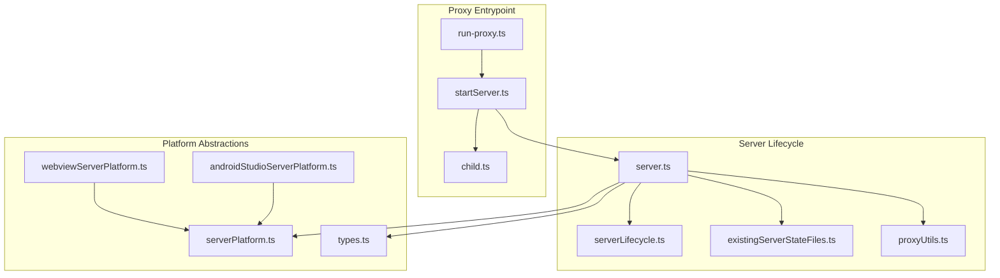
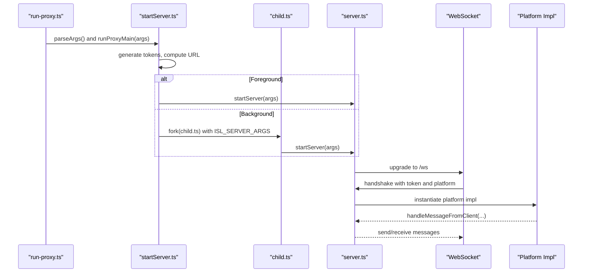
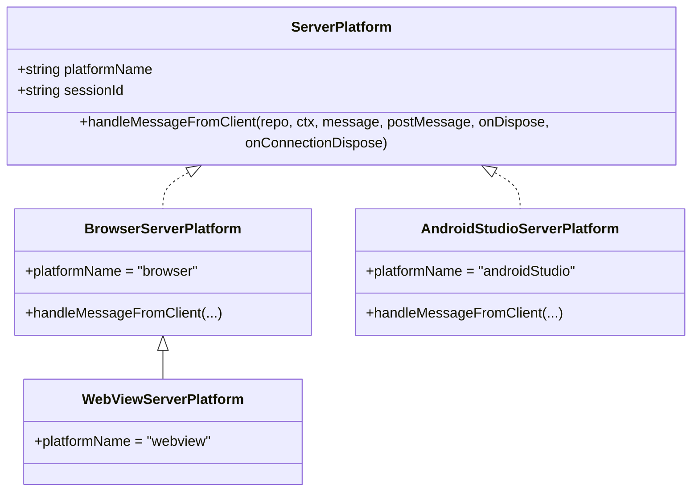
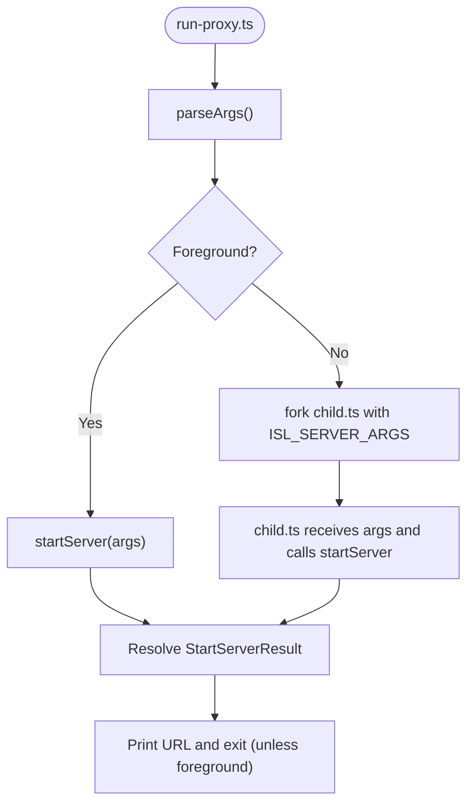
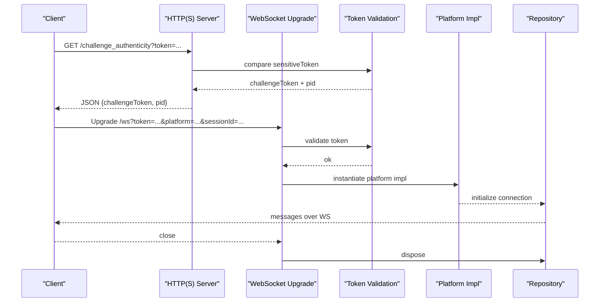
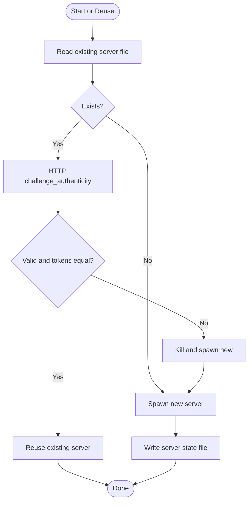
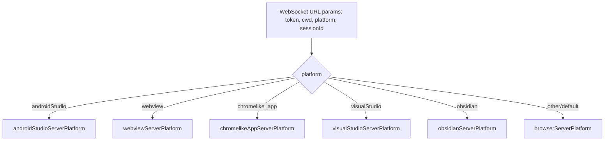
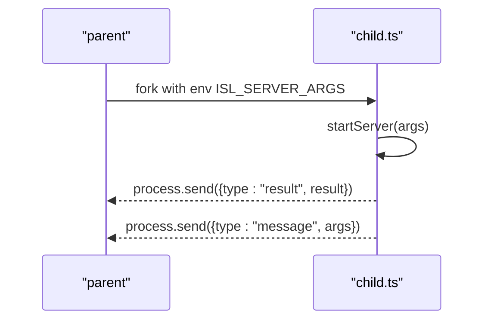
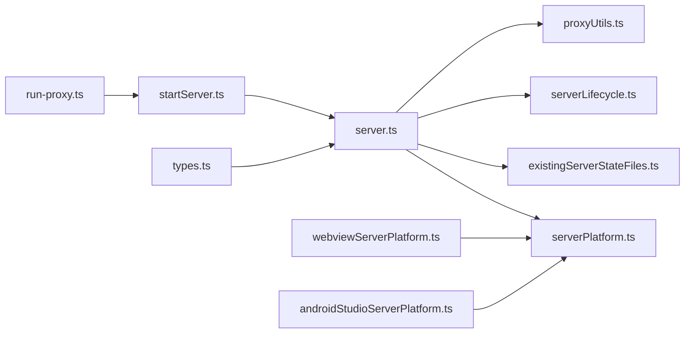

# Server Platform Abstractions and Proxy System

<cite>
**Referenced Files in This Document**
- [serverPlatform.ts](file://addons/isl-server/src/serverPlatform.ts)
- [types.ts](file://addons/isl/src/types.ts)
- [server.ts](file://addons/isl-server/proxy/server.ts)
- [startServer.ts](file://addons/isl-server/proxy/startServer.ts)
- [run-proxy.ts](file://addons/isl-server/proxy/run-proxy.ts)
- [child.ts](file://addons/isl-server/proxy/child.ts)
- [serverLifecycle.ts](file://addons/isl-server/proxy/serverLifecycle.ts)
- [existingServerStateFiles.ts](file://addons/isl-server/proxy/existingServerStateFiles.ts)
- [proxyUtils.ts](file://addons/isl-server/proxy/proxyUtils.ts)
- [webviewServerPlatform.ts](file://addons/isl-server/platform/webviewServerPlatform.ts)
- [androidStudioServerPlatform.ts](file://addons/isl-server/platform/androidStudioServerPlatform.ts)
</cite>

## Table of Contents
1. [Introduction](#introduction)
2. [Project Structure](#project-structure)
3. [Core Components](#core-components)
4. [Architecture Overview](#architecture-overview)
5. [Detailed Component Analysis](#detailed-component-analysis)
6. [Dependency Analysis](#dependency-analysis)
7. [Performance Considerations](#performance-considerations)
8. [Troubleshooting Guide](#troubleshooting-guide)
9. [Conclusion](#conclusion)

## Introduction
This document explains the server platform abstractions and the proxy system architecture used to run and embed the ISL (Interactive Smartlog) server across multiple platforms. It covers:
- The platform interface and platform-specific implementations
- The proxy entrypoint and server lifecycle orchestration
- Child process management and inter-process communication
- Platform detection, capability negotiation, and cross-platform compatibility
- Proxy utilities, server state management, and troubleshooting

## Project Structure
The relevant parts of the repository for this system are organized as:
- Platform abstractions and platform-specific handlers under addons/isl-server/src and addons/isl-server/platform
- Proxy entrypoint and server lifecycle under addons/isl-server/proxy
- Shared type definitions under addons/isl/src

**Diagram sources**
- [run-proxy.ts:1-11](file://addons/isl-server/proxy/run-proxy.ts#L1-L11)
- [startServer.ts:1-754](file://addons/isl-server/proxy/startServer.ts#L1-L754)
- [child.ts:1-69](file://addons/isl-server/proxy/child.ts#L1-L69)
- [server.ts:1-331](file://addons/isl-server/proxy/server.ts#L1-L331)
- [serverLifecycle.ts:1-117](file://addons/isl-server/proxy/serverLifecycle.ts#L1-L117)
- [existingServerStateFiles.ts:1-107](file://addons/isl-server/proxy/existingServerStateFiles.ts#L1-L107)
- [proxyUtils.ts:1-18](file://addons/isl-server/proxy/proxyUtils.ts#L1-L18)
- [serverPlatform.ts:1-166](file://addons/isl-server/src/serverPlatform.ts#L1-L166)
- [types.ts:1-1354](file://addons/isl/src/types.ts#L1-L1354)
- [webviewServerPlatform.ts:1-16](file://addons/isl-server/platform/webviewServerPlatform.ts#L1-L16)
- [androidStudioServerPlatform.ts:1-24](file://addons/isl-server/platform/androidStudioServerPlatform.ts#L1-L24)

**Section sources**
- [run-proxy.ts:1-11](file://addons/isl-server/proxy/run-proxy.ts#L1-L11)
- [startServer.ts:1-754](file://addons/isl-server/proxy/startServer.ts#L1-L754)
- [server.ts:1-331](file://addons/isl-server/proxy/server.ts#L1-L331)
- [serverPlatform.ts:1-166](file://addons/isl-server/src/serverPlatform.ts#L1-L166)
- [types.ts:1-1354](file://addons/isl/src/types.ts#L1-L1354)

## Core Components
- Platform abstraction: a ServerPlatform interface and a default browser-based implementation that handles platform-specific client messages (e.g., opening files or folders).
- Platform-specific implementations: thin wrappers that override behavior for specific hosts (e.g., WebView, Android Studio).
- Proxy entrypoint: a CLI that parses arguments, manages server reuse, spawns child processes, and opens URLs.
- Server lifecycle: HTTP(S) server with WebSocket transport, token-based authentication, platform negotiation, and repository connection.
- State management: persistent server metadata for reuse and liveness checks.
- Utilities: token comparison helpers and filesystem utilities for server state.

**Section sources**
- [serverPlatform.ts:25-166](file://addons/isl-server/src/serverPlatform.ts#L25-L166)
- [webviewServerPlatform.ts:12-16](file://addons/isl-server/platform/webviewServerPlatform.ts#L12-L16)
- [androidStudioServerPlatform.ts:10-24](file://addons/isl-server/platform/androidStudioServerPlatform.ts#L10-L24)
- [startServer.ts:364-754](file://addons/isl-server/proxy/startServer.ts#L364-L754)
- [server.ts:51-331](file://addons/isl-server/proxy/server.ts#L51-L331)
- [existingServerStateFiles.ts:14-107](file://addons/isl-server/proxy/existingServerStateFiles.ts#L14-L107)
- [proxyUtils.ts:10-18](file://addons/isl-server/proxy/proxyUtils.ts#L10-L18)

## Architecture Overview
The system separates concerns across layers:
- CLI layer: run-proxy orchestrates argument parsing, server reuse, and process spawning.
- Proxy layer: startServer coordinates server startup, token generation, URL construction, and optional browser opening.
- Server layer: server.ts runs an HTTP(S) server with WebSocket upgrades, validates tokens, negotiates platform, and delegates to platform handlers.
- Platform layer: platform-specific implementations extend the base ServerPlatform behavior.
- State and utilities: serverLifecycle and existingServerStateFiles manage liveness checks and persisted server metadata; proxyUtils provides secure token comparison.

**Diagram sources**
- [run-proxy.ts:8-11](file://addons/isl-server/proxy/run-proxy.ts#L8-L11)
- [startServer.ts:320-362](file://addons/isl-server/proxy/startServer.ts#L320-L362)
- [child.ts:48-57](file://addons/isl-server/proxy/child.ts#L48-L57)
- [server.ts:173-263](file://addons/isl-server/proxy/server.ts#L173-L263)

## Detailed Component Analysis

### Platform Abstraction and Implementations
- ServerPlatform interface defines the contract for platform-specific behavior, including a platformName and a method to handle client messages.
- Default browser implementation supports opening files and folders, with OS-specific commands and fallbacks.
- Platform-specific implementations (e.g., WebView, Android Studio) extend the base behavior and can override message handling.

**Diagram sources**
- [serverPlatform.ts:25-87](file://addons/isl-server/src/serverPlatform.ts#L25-L87)
- [webviewServerPlatform.ts:12-16](file://addons/isl-server/platform/webviewServerPlatform.ts#L12-L16)
- [androidStudioServerPlatform.ts:10-24](file://addons/isl-server/platform/androidStudioServerPlatform.ts#L10-L24)

**Section sources**
- [serverPlatform.ts:25-166](file://addons/isl-server/src/serverPlatform.ts#L25-L166)
- [webviewServerPlatform.ts:1-16](file://addons/isl-server/platform/webviewServerPlatform.ts#L1-L16)
- [androidStudioServerPlatform.ts:1-24](file://addons/isl-server/platform/androidStudioServerPlatform.ts#L1-L24)

### Proxy Entrypoint and Argument Parsing
- run-proxy.ts is the CLI entrypoint that invokes the main proxy logic.
- startServer.ts parses arguments, generates secure tokens, constructs URLs, and decides whether to run in foreground or background.
- Background mode uses child_process.fork with IPC to communicate results and logs.

**Diagram sources**
- [run-proxy.ts:8-11](file://addons/isl-server/proxy/run-proxy.ts#L8-L11)
- [startServer.ts:96-258](file://addons/isl-server/proxy/startServer.ts#L96-L258)
- [child.ts:48-57](file://addons/isl-server/proxy/child.ts#L48-L57)

**Section sources**
- [run-proxy.ts:1-11](file://addons/isl-server/proxy/run-proxy.ts#L1-L11)
- [startServer.ts:96-258](file://addons/isl-server/proxy/startServer.ts#L96-L258)
- [child.ts:1-69](file://addons/isl-server/proxy/child.ts#L1-L69)

### Server Lifecycle and WebSocket Negotiation
- server.ts starts an HTTP(S) server, serves static assets, exposes a challenge endpoint for authenticity verification, and upgrades connections to WebSocket.
- WebSocket connections require a token and optional platform/session parameters; platform implementations are loaded dynamically.
- The server tracks repository connections and disposes them on close, optionally triggering cleanup when no active servers remain.

**Diagram sources**
- [server.ts:139-263](file://addons/isl-server/proxy/server.ts#L139-L263)
- [serverLifecycle.ts:24-83](file://addons/isl-server/proxy/serverLifecycle.ts#L24-L83)

**Section sources**
- [server.ts:51-331](file://addons/isl-server/proxy/server.ts#L51-L331)
- [serverLifecycle.ts:1-117](file://addons/isl-server/proxy/serverLifecycle.ts#L1-L117)

### Server State Management and Reuse
- existingServerStateFiles.ts persists server metadata (tokens, log location, command, sl version, bind, TLS) per port in a restricted cache directory.
- serverLifecycle.ts reads and validates existing server files, performs a liveness check via the challenge endpoint, and compares challenge tokens securely.

**Diagram sources**
- [existingServerStateFiles.ts:88-107](file://addons/isl-server/proxy/existingServerStateFiles.ts#L88-L107)
- [serverLifecycle.ts:89-117](file://addons/isl-server/proxy/serverLifecycle.ts#L89-L117)
- [startServer.ts:497-633](file://addons/isl-server/proxy/startServer.ts#L497-L633)

**Section sources**
- [existingServerStateFiles.ts:1-107](file://addons/isl-server/proxy/existingServerStateFiles.ts#L1-L107)
- [serverLifecycle.ts:1-117](file://addons/isl-server/proxy/serverLifecycle.ts#L1-L117)
- [startServer.ts:497-633](file://addons/isl-server/proxy/startServer.ts#L497-L633)

### Cross-Platform Compatibility and Capability Negotiation
- Platform names are defined centrally and used to select platform implementations at runtime.
- The server negotiates platform via the platform query parameter on the WebSocket URL.
- The browser default implementation demonstrates OS-specific behaviors (open file/folder) and can be extended by platform-specific handlers.

**Diagram sources**
- [server.ts:202-225](file://addons/isl-server/proxy/server.ts#L202-L225)
- [types.ts:26-34](file://addons/isl/src/types.ts#L26-L34)

**Section sources**
- [server.ts:202-225](file://addons/isl-server/proxy/server.ts#L202-L225)
- [types.ts:26-34](file://addons/isl/src/types.ts#L26-L34)

### Inter-Process Communication and Security
- IPC between parent and child uses process.send with a defined message shape; errors are logged to a file.
- Token-based authentication secures WebSocket connections; a challenge endpoint verifies identity and returns a challenge token.
- Timing-safe token comparison prevents timing attacks.

**Diagram sources**
- [child.ts:36-57](file://addons/isl-server/proxy/child.ts#L36-L57)
- [server.ts:139-152](file://addons/isl-server/proxy/server.ts#L139-L152)
- [proxyUtils.ts:13-17](file://addons/isl-server/proxy/proxyUtils.ts#L13-L17)

**Section sources**
- [child.ts:1-69](file://addons/isl-server/proxy/child.ts#L1-L69)
- [server.ts:139-152](file://addons/isl-server/proxy/server.ts#L139-L152)
- [proxyUtils.ts:1-18](file://addons/isl-server/proxy/proxyUtils.ts#L1-L18)

## Dependency Analysis
- The proxy depends on the server module for lifecycle management and on platform modules for client message handling.
- The server depends on platform abstractions and type definitions for platform names and message schemas.
- State and lifecycle utilities are tightly coupled to the server’s HTTP and WebSocket logic.

**Diagram sources**
- [run-proxy.ts:8-11](file://addons/isl-server/proxy/run-proxy.ts#L8-L11)
- [startServer.ts:320-362](file://addons/isl-server/proxy/startServer.ts#L320-L362)
- [server.ts:51-331](file://addons/isl-server/proxy/server.ts#L51-L331)
- [serverPlatform.ts:25-87](file://addons/isl-server/src/serverPlatform.ts#L25-L87)
- [existingServerStateFiles.ts:88-107](file://addons/isl-server/proxy/existingServerStateFiles.ts#L88-L107)
- [serverLifecycle.ts:89-117](file://addons/isl-server/proxy/serverLifecycle.ts#L89-L117)
- [proxyUtils.ts:13-17](file://addons/isl-server/proxy/proxyUtils.ts#L13-L17)
- [webviewServerPlatform.ts:12-16](file://addons/isl-server/platform/webviewServerPlatform.ts#L12-L16)
- [androidStudioServerPlatform.ts:10-24](file://addons/isl-server/platform/androidStudioServerPlatform.ts#L10-L24)
- [types.ts:26-34](file://addons/isl/src/types.ts#L26-L34)

**Section sources**
- [server.ts:51-331](file://addons/isl-server/proxy/server.ts#L51-L331)
- [serverPlatform.ts:25-87](file://addons/isl-server/src/serverPlatform.ts#L25-L87)
- [types.ts:26-34](file://addons/isl/src/types.ts#L26-L34)

## Performance Considerations
- Token generation uses secure randomness; avoid repeated generation when reusing servers.
- Background mode detaches child processes and ignores stdio to prevent blocking; ensure logs are written to a file when needed.
- Static asset serving is optimized via a manifest-derived mapping; ensure build artifacts are present.
- Challenge endpoint uses a short timeout to avoid hanging on liveness checks.

[No sources needed since this section provides general guidance]

## Troubleshooting Guide
Common issues and resolutions:
- Port already in use: The proxy attempts to reuse an existing server if compatible; otherwise, it can kill and restart. Use --kill or --force to replace an existing server.
- Illegal URL or missing open command: Opening URLs is platform-dependent; ensure the platform supports the opener command or suppress opening with --no-open.
- TLS configuration: Provide both --cert and --key; otherwise, the server runs over HTTP.
- Liveness verification fails: The challenge endpoint requires the correct token; mismatch indicates a different or invalid server instance.
- Child process exceptions: Uncaught exceptions are appended to the server log file; check the log location printed by the proxy.

**Section sources**
- [startServer.ts:411-429](file://addons/isl-server/proxy/startServer.ts#L411-L429)
- [startServer.ts:695-753](file://addons/isl-server/proxy/startServer.ts#L695-L753)
- [server.ts:139-152](file://addons/isl-server/proxy/server.ts#L139-L152)
- [serverLifecycle.ts:24-83](file://addons/isl-server/proxy/serverLifecycle.ts#L24-L83)
- [child.ts:59-68](file://addons/isl-server/proxy/child.ts#L59-L68)

## Conclusion
The server platform abstractions and proxy system provide a robust, cross-platform foundation for running the ISL server. The platform interface cleanly separates host-specific behavior, while the proxy orchestrates lifecycle, reuse, and security. The combination of token-based authentication, platform negotiation, and stateful reuse ensures reliable operation across diverse environments.