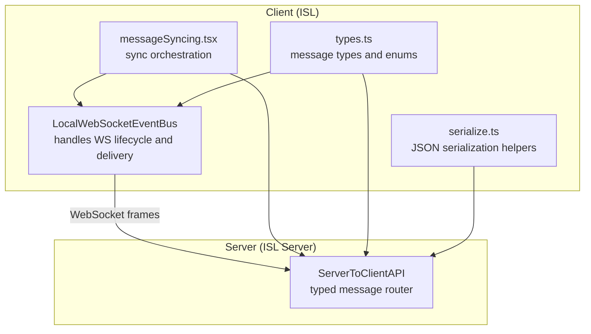
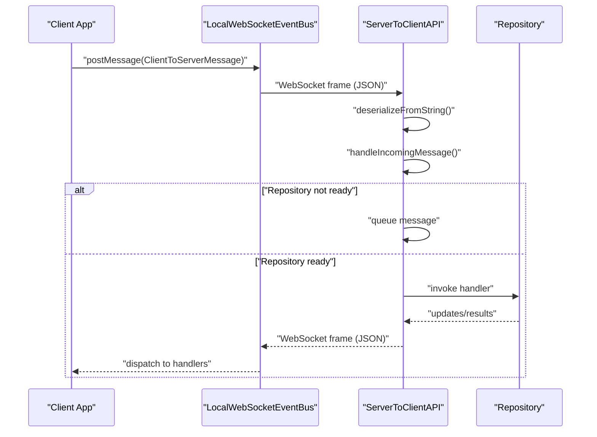
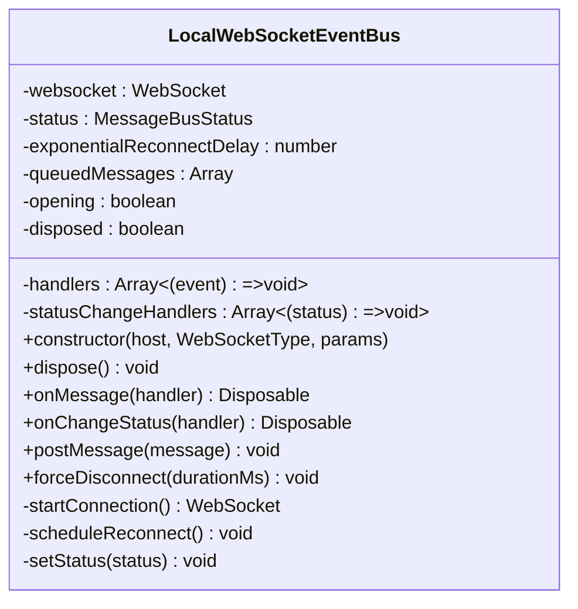
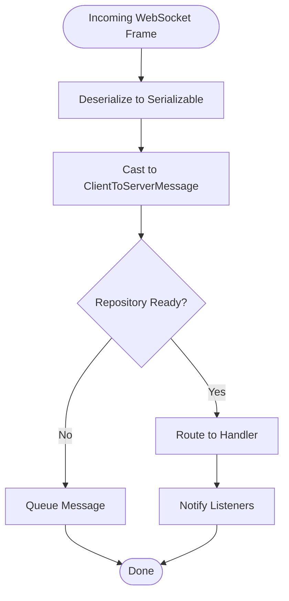
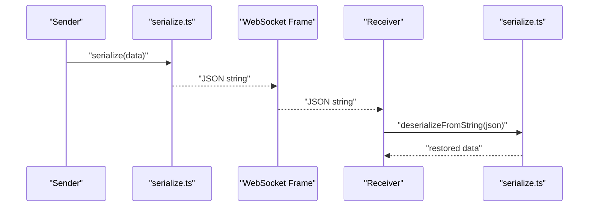
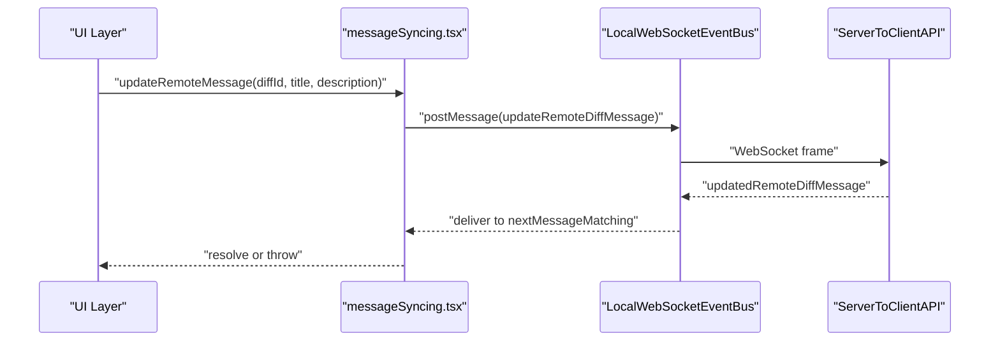
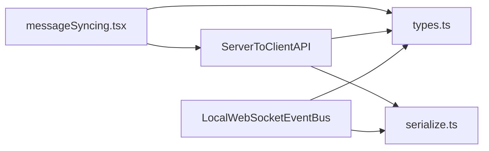

# WebSocket Communication and Real-time Updates

<cite>
**Referenced Files in This Document**
- [LocalWebSocketEventBus.ts](file://addons/isl/src/LocalWebSocketEventBus.ts)
- [ServerToClientAPI.ts](file://addons/isl-server/src/ServerToClientAPI.ts)
- [messageSyncing.tsx](file://addons/isl/src/messageSyncing.tsx)
- [types.ts](file://addons/isl/src/types.ts)
- [serialize.ts](file://addons/isl/src/serialize.ts)
</cite>

## Table of Contents
1. [Introduction](#introduction)
2. [Project Structure](#project-structure)
3. [Core Components](#core-components)
4. [Architecture Overview](#architecture-overview)
5. [Detailed Component Analysis](#detailed-component-analysis)
6. [Dependency Analysis](#dependency-analysis)
7. [Performance Considerations](#performance-considerations)
8. [Troubleshooting Guide](#troubleshooting-guide)
9. [Conclusion](#conclusion)

## Introduction
This document explains the WebSocket-based real-time communication system used by the application. It covers the client-side WebSocket event bus, the server-side API that handles bidirectional messaging, message serialization/deserialization, event distribution, message routing, synchronization protocols, and reliability features such as connection management and message queuing. Practical usage examples and troubleshooting guidance are included to help developers integrate and debug WebSocket-based features effectively.

## Project Structure
The WebSocket real-time system spans two primary areas:
- Client-side: A WebSocket event bus that manages connections, retries, and message delivery.
- Server-side: A typed message router that dispatches client requests to appropriate handlers and streams updates to clients.

**Diagram sources**
- [LocalWebSocketEventBus.ts:13-178](file://addons/isl/src/LocalWebSocketEventBus.ts#L13-L178)
- [ServerToClientAPI.ts:71-1392](file://addons/isl-server/src/ServerToClientAPI.ts#L71-L1392)
- [messageSyncing.tsx:1-46](file://addons/isl/src/messageSyncing.tsx#L1-L46)
- [types.ts:987-1333](file://addons/isl/src/types.ts#L987-L1333)
- [serialize.ts:1-140](file://addons/isl/src/serialize.ts#L1-L140)

**Section sources**
- [LocalWebSocketEventBus.ts:13-178](file://addons/isl/src/LocalWebSocketEventBus.ts#L13-L178)
- [ServerToClientAPI.ts:71-1392](file://addons/isl-server/src/ServerToClientAPI.ts#L71-L1392)
- [messageSyncing.tsx:1-46](file://addons/isl/src/messageSyncing.tsx#L1-L46)
- [types.ts:987-1333](file://addons/isl/src/types.ts#L987-L1333)
- [serialize.ts:1-140](file://addons/isl/src/serialize.ts#L1-L140)

## Core Components
- LocalWebSocketEventBus: Manages WebSocket lifecycle, exponential backoff reconnection, message queuing, and event distribution to registered handlers. It exposes APIs to post messages and subscribe to status changes.
- ServerToClientAPI: A typed message router that deserializes inbound messages, queues them until a repository context is ready, routes them to appropriate handlers, and streams updates to clients via subscriptions.
- Serialization utilities: Provide robust JSON serialization/deserialization for complex types (Maps, Sets, Dates, Errors) to ensure safe transport over WebSocket frames.
- Message types: Define the contract for client-to-server and server-to-client messages, including subscriptions, operations, and platform-specific messages.

Key responsibilities:
- Bidirectional communication: Clients send typed messages; server responds with typed updates/events.
- Reliability: Queuing during loading, exponential backoff on disconnect, and re-delivery after reconnect.
- Event distribution: Handlers receive messages and can broadcast updates to subscribers.

**Section sources**
- [LocalWebSocketEventBus.ts:13-178](file://addons/isl/src/LocalWebSocketEventBus.ts#L13-L178)
- [ServerToClientAPI.ts:71-1392](file://addons/isl-server/src/ServerToClientAPI.ts#L71-L1392)
- [serialize.ts:48-139](file://addons/isl/src/serialize.ts#L48-L139)
- [types.ts:987-1333](file://addons/isl/src/types.ts#L987-L1333)

## Architecture Overview
The system uses WebSocket frames carrying JSON-encoded messages. On the client, LocalWebSocketEventBus encapsulates the WebSocket connection and delivers incoming messages to registered handlers. On the server, ServerToClientAPI deserializes messages, enforces repository readiness, and dispatches to specialized handlers. Subscriptions enable continuous streaming of updates.

**Diagram sources**
- [LocalWebSocketEventBus.ts:139-170](file://addons/isl/src/LocalWebSocketEventBus.ts#L139-L170)
- [ServerToClientAPI.ts:99-116](file://addons/isl-server/src/ServerToClientAPI.ts#L99-L116)
- [ServerToClientAPI.ts:225-262](file://addons/isl-server/src/ServerToClientAPI.ts#L225-L262)
- [serialize.ts:137-139](file://addons/isl/src/serialize.ts#L137-L139)

## Detailed Component Analysis

### LocalWebSocketEventBus
Responsibilities:
- Construct WebSocket URL with query parameters (token, cwd, sessionId, platform).
- Manage connection lifecycle: open, close, and reconnect with exponential backoff.
- Queue outgoing messages while disconnected or reconnecting.
- Deliver incoming messages to registered handlers.
- Notify status changes (initializing, open, reconnecting, error).

Reliability features:
- Exponential backoff with maximum cap.
- Prevents multiple concurrent connection attempts.
- Replays queued messages upon reconnection.
- Supports forced disconnection with custom delay.

Usage patterns:
- Register message handlers via onMessage.
- Subscribe to status changes via onChangeStatus.
- Post messages via postMessage; they are queued if not currently open.

**Diagram sources**
- [LocalWebSocketEventBus.ts:13-178](file://addons/isl/src/LocalWebSocketEventBus.ts#L13-L178)

**Section sources**
- [LocalWebSocketEventBus.ts:39-178](file://addons/isl/src/LocalWebSocketEventBus.ts#L39-L178)

### ServerToClientAPI
Responsibilities:
- Deserialize inbound messages and route them to appropriate handlers.
- Queue messages until a repository context is established.
- Stream updates to clients via subscriptions (uncommitted changes, smartlog commits, merge conflicts, submodules, subscribed full repo branches).
- Handle platform-specific and code-review-provider-specific messages.
- Emit typed server-to-client messages (events, results, progress).

Processing logic:
- Separate handling for general messages and repository-bound messages.
- Repository readiness state machine: loading → repo/error.
- Subscription management with disposables for cleanup.

**Diagram sources**
- [ServerToClientAPI.ts:99-116](file://addons/isl-server/src/ServerToClientAPI.ts#L99-L116)
- [ServerToClientAPI.ts:225-262](file://addons/isl-server/src/ServerToClientAPI.ts#L225-L262)

**Section sources**
- [ServerToClientAPI.ts:71-224](file://addons/isl-server/src/ServerToClientAPI.ts#L71-L224)
- [ServerToClientAPI.ts:225-1356](file://addons/isl-server/src/ServerToClientAPI.ts#L225-L1356)

### Serialization and Message Contracts
Serialization:
- serialize/serializeToString converts complex types (Map, Set, Date, Error) into JSON-compatible structures.
- deserialize/deserializeFromString reconstructs complex types on the receiving end.

Message contracts:
- ClientToServerMessage and ServerToClientMessage enumerate all supported message types.
- SubscriptionResult and related event types define streaming updates.
- Platform-specific and code-review-provider-specific messages extend the base contracts.

**Diagram sources**
- [serialize.ts:48-91](file://addons/isl/src/serialize.ts#L48-L91)
- [serialize.ts:137-139](file://addons/isl/src/serialize.ts#L137-L139)

**Section sources**
- [serialize.ts:12-139](file://addons/isl/src/serialize.ts#L12-L139)
- [types.ts:987-1333](file://addons/isl/src/types.ts#L987-L1333)

### Message Syncing Orchestration
messageSyncing.tsx coordinates synchronization of remote messages (e.g., updating a diff’s title/description) with server responses. It posts a request and waits for a matching acknowledgment, throwing on errors.

**Diagram sources**
- [messageSyncing.tsx:32-45](file://addons/isl/src/messageSyncing.tsx#L32-L45)
- [LocalWebSocketEventBus.ts:152-158](file://addons/isl/src/LocalWebSocketEventBus.ts#L152-L158)
- [ServerToClientAPI.ts:922-933](file://addons/isl-server/src/ServerToClientAPI.ts#L922-L933)

**Section sources**
- [messageSyncing.tsx:1-46](file://addons/isl/src/messageSyncing.tsx#L1-L46)
- [ServerToClientAPI.ts:922-933](file://addons/isl-server/src/ServerToClientAPI.ts#L922-L933)

## Dependency Analysis
- LocalWebSocketEventBus depends on:
  - WebSocket implementation (browser or polyfill).
  - MessageBusStatus type for status reporting.
  - Logger for diagnostics.
- ServerToClientAPI depends on:
  - ClientConnection abstraction for transport.
  - Repository and RepositoryContext for operations.
  - Serialization utilities for message framing.
  - Platform-specific handlers for OS integrations.
- messageSyncing.tsx depends on:
  - Server API for posting messages and awaiting responses.
  - Code review provider state for enabling/disabling syncing.

**Diagram sources**
- [LocalWebSocketEventBus.ts:8-11](file://addons/isl/src/LocalWebSocketEventBus.ts#L8-L11)
- [ServerToClientAPI.ts:37-47](file://addons/isl-server/src/ServerToClientAPI.ts#L37-L47)
- [messageSyncing.tsx:10-12](file://addons/isl/src/messageSyncing.tsx#L10-L12)
- [types.ts:987-1333](file://addons/isl/src/types.ts#L987-L1333)
- [serialize.ts:1-140](file://addons/isl/src/serialize.ts#L1-L140)

**Section sources**
- [LocalWebSocketEventBus.ts:8-11](file://addons/isl/src/LocalWebSocketEventBus.ts#L8-L11)
- [ServerToClientAPI.ts:37-47](file://addons/isl-server/src/ServerToClientAPI.ts#L37-L47)
- [messageSyncing.tsx:10-12](file://addons/isl/src/messageSyncing.tsx#L10-L12)

## Performance Considerations
- Message serialization overhead: Prefer compact payloads and avoid unnecessary large objects. Use streaming subscriptions for frequent updates.
- Subscription volume: Limit the number of active subscriptions and unsubscribe when no longer needed to reduce server load.
- Reconnection backoff: Exponential backoff prevents thundering herd on server restarts; tune delays for your deployment.
- Queuing strategy: Messages queued during reconnect are sent sequentially; keep queued message sizes reasonable to avoid long replay bursts.

## Troubleshooting Guide
Common issues and resolutions:
- Connection drops and reconnection loops:
  - Verify server-side close codes; permanent failures (e.g., invalid token) halt retries.
  - Check client-side exponential backoff and ensure it caps appropriately.
- Messages not delivered:
  - Ensure repository readiness before sending repository-bound messages.
  - Confirm that handlers are registered before expecting events.
- Serialization errors:
  - Validate that only supported types are transmitted; use provided serialize helpers.
  - Inspect custom types for non-enumerable properties or cycles.
- Subscription not firing:
  - Confirm subscriptionID uniqueness and proper registration.
  - Verify repository context is set before subscribing.

Operational checks:
- Monitor status transitions: initializing → open → reconnecting → error.
- Inspect queued messages during loading states.
- Validate WebSocket URL construction (protocol, host, query parameters).

**Section sources**
- [LocalWebSocketEventBus.ts:105-137](file://addons/isl/src/LocalWebSocketEventBus.ts#L105-L137)
- [ServerToClientAPI.ts:106-115](file://addons/isl-server/src/ServerToClientAPI.ts#L106-L115)
- [serialize.ts:89-91](file://addons/isl/src/serialize.ts#L89-L91)

## Conclusion
The WebSocket communication system combines a resilient client-side event bus with a typed, extensible server-side router. Robust serialization, explicit message contracts, and subscription-based streaming enable reliable real-time updates across diverse platforms. By leveraging the provided components and following the troubleshooting guidance, developers can implement, extend, and maintain efficient bidirectional communication with strong reliability guarantees.