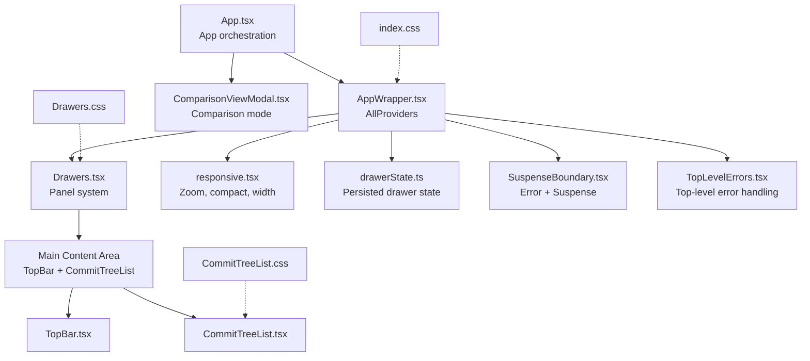
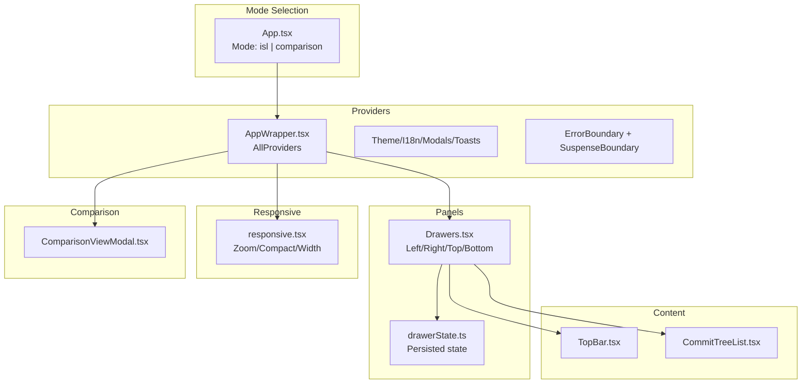
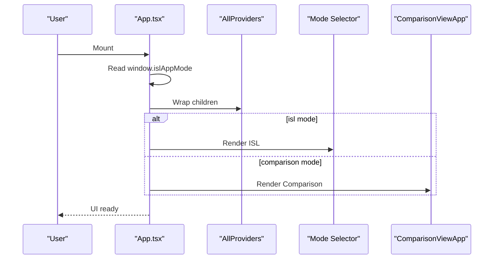
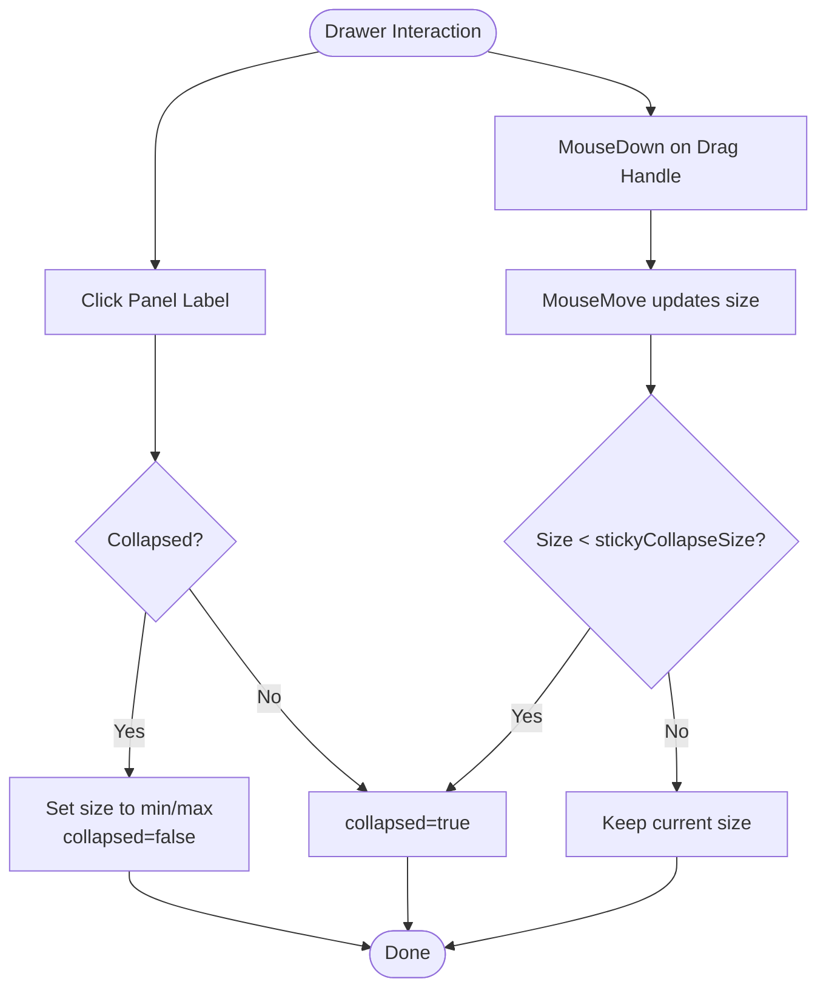
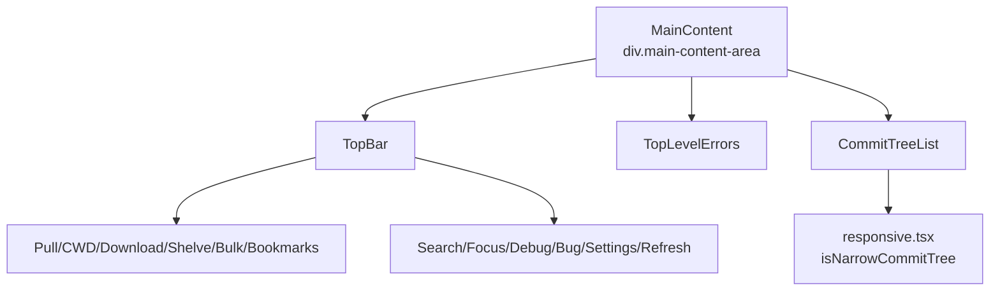
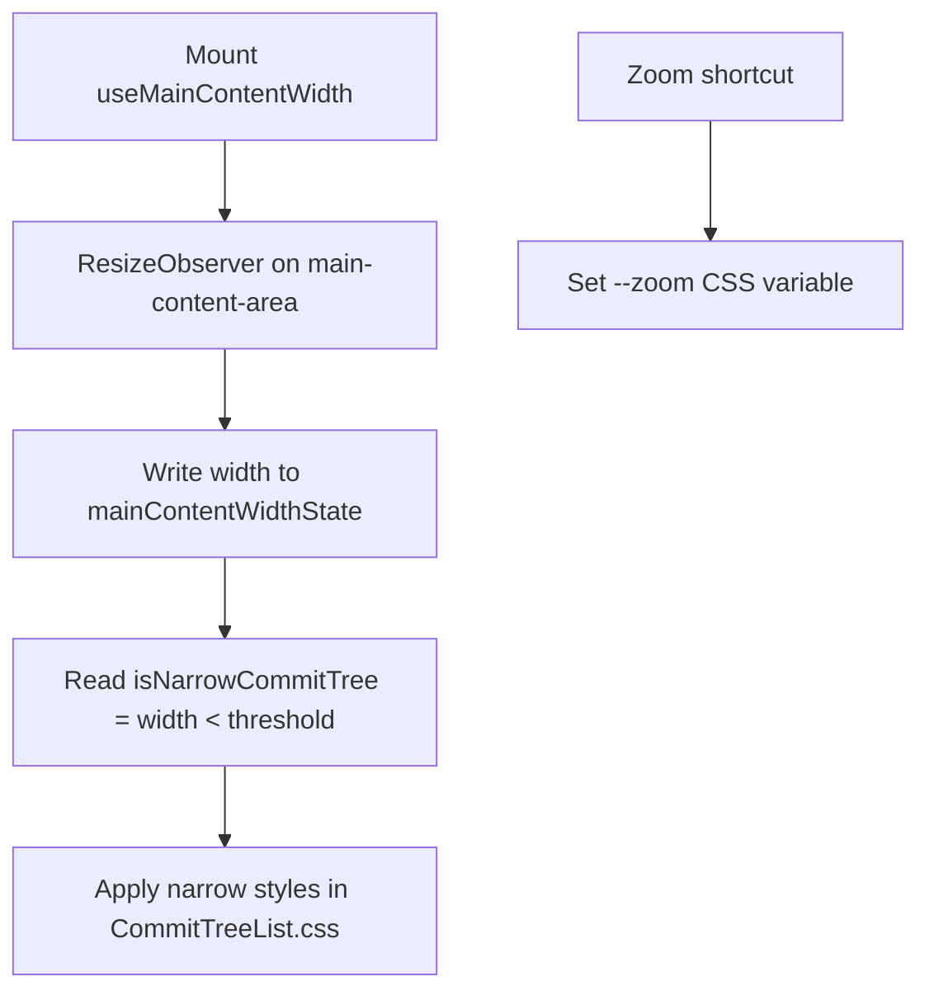
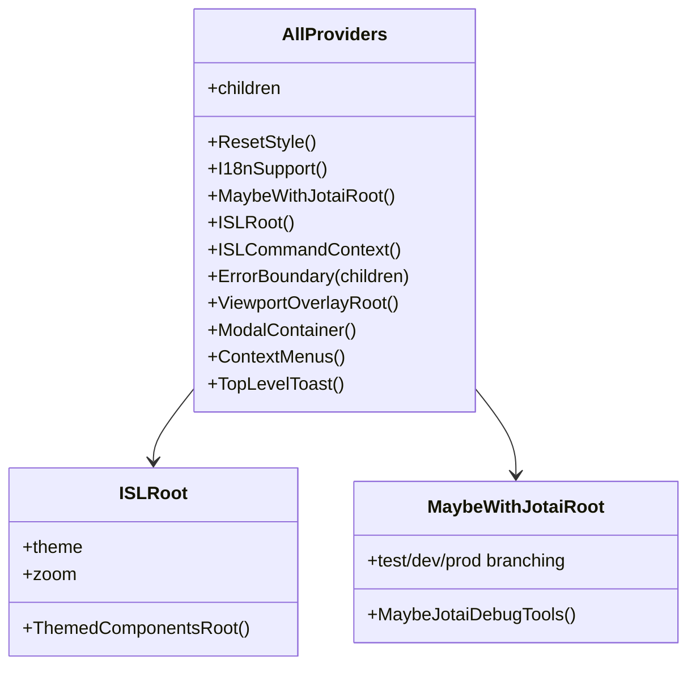
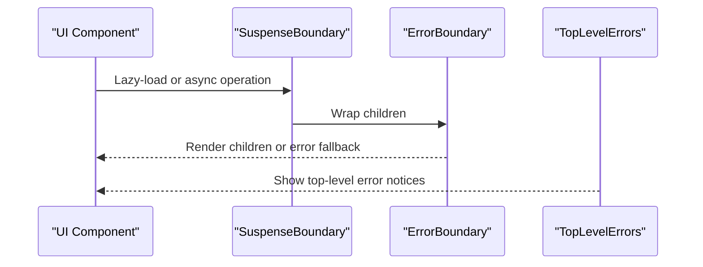
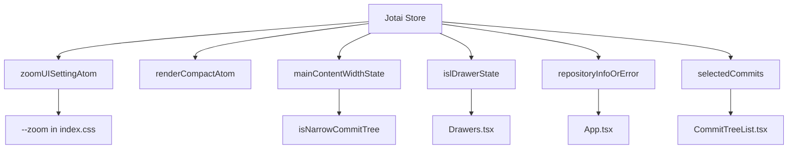
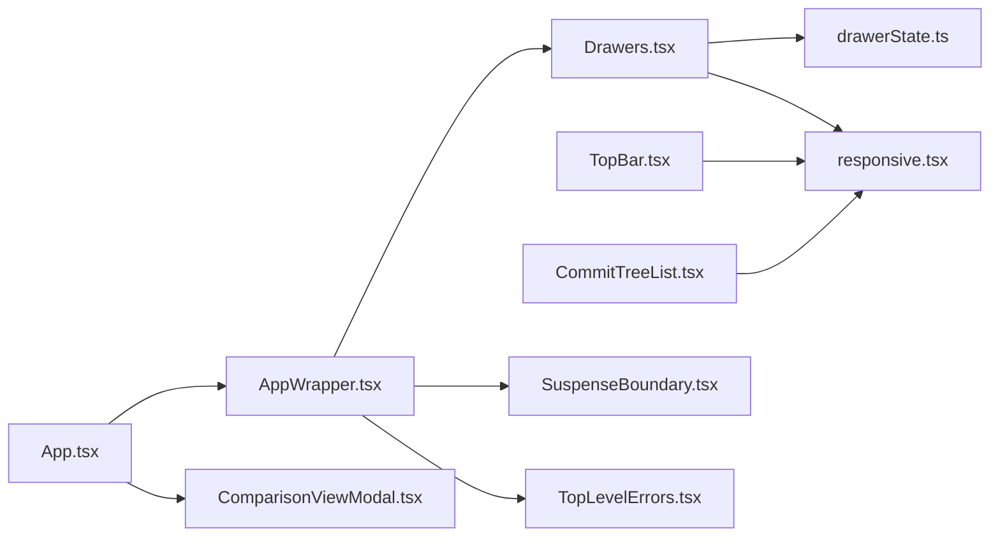

# Application Layout System

<cite>
**Referenced Files in This Document**
- [App.tsx](file://addons/isl/src/App.tsx)
- [AppWrapper.tsx](file://addons/isl/src/AppWrapper.tsx)
- [Drawers.tsx](file://addons/isl/src/Drawers.tsx)
- [responsive.tsx](file://addons/isl/src/responsive.tsx)
- [drawerState.ts](file://addons/isl/src/drawerState.ts)
- [ComparisonViewModal.tsx](file://addons/isl/src/ComparisonView/ComparisonViewModal.tsx)
- [TopBar.tsx](file://addons/isl/src/TopBar.tsx)
- [CommitTreeList.tsx](file://addons/isl/src/CommitTreeList.tsx)
- [SuspenseBoundary.tsx](file://addons/isl/src/SuspenseBoundary.tsx)
- [TopLevelErrors.tsx](file://addons/isl/src/TopLevelErrors.tsx)
- [index.css](file://addons/isl/src/index.css)
- [Drawers.css](file://addons/isl/src/Drawers.css)
- [CommitTreeList.css](file://addons/isl/src/CommitTreeList.css)
</cite>

## Table of Contents
1. [Introduction](#introduction)
2. [Project Structure](#project-structure)
3. [Core Components](#core-components)
4. [Architecture Overview](#architecture-overview)
5. [Detailed Component Analysis](#detailed-component-analysis)
6. [Dependency Analysis](#dependency-analysis)
7. [Performance Considerations](#performance-considerations)
8. [Troubleshooting Guide](#troubleshooting-guide)
9. [Conclusion](#conclusion)
10. [Appendices](#appendices)

## Introduction
This document explains the ISL application layout system. It covers the main App component architecture, layout modes (Interactive Smartlog vs Comparison), the Drawer system for left/right/top/bottom panels, responsive design implementation, and the main content area management. It also documents the AppWrapper provider system, error boundaries, and suspense handling. Finally, it details integration with Jotai state management and how components communicate through the layout system, with examples of layout customization, panel configuration, and responsive breakpoints.

## Project Structure
The layout system centers around a small set of core files:
- App orchestrates layout modes and wraps everything in providers.
- AppWrapper sets up global providers, theming, modals, toasts, and error/suspense boundaries.
- Drawers implements a flexible resizable/collapsible panel system.
- responsive.tsx manages UI zoom, compact rendering, and main content width.
- drawerState.ts persists and synchronizes drawer sizes and collapses.
- ComparisonViewModal handles the comparison view modal/app.
- TopBar and CommitTreeList compose the main content area.
- SuspenseBoundary and TopLevelErrors provide robust error/suspense handling.

**Diagram sources**
- [App.tsx:50-72](file://addons/isl/src/App.tsx#L50-L72)
- [AppWrapper.tsx:30-51](file://addons/isl/src/AppWrapper.tsx#L30-L51)
- [Drawers.tsx:35-81](file://addons/isl/src/Drawers.tsx#L35-L81)
- [responsive.tsx:19-70](file://addons/isl/src/responsive.tsx#L19-L70)
- [drawerState.ts:16-24](file://addons/isl/src/drawerState.ts#L16-L24)
- [ComparisonViewModal.tsx:38-52](file://addons/isl/src/ComparisonView/ComparisonViewModal.tsx#L38-L52)
- [TopBar.tsx:35-65](file://addons/isl/src/TopBar.tsx#L35-L65)
- [CommitTreeList.tsx:218-245](file://addons/isl/src/CommitTreeList.tsx#L218-L245)
- [SuspenseBoundary.tsx:15-26](file://addons/isl/src/SuspenseBoundary.tsx#L15-L26)
- [TopLevelErrors.tsx:112-124](file://addons/isl/src/TopLevelErrors.tsx#L112-L124)
- [index.css:14-57](file://addons/isl/src/index.css#L14-L57)
- [Drawers.css:8-43](file://addons/isl/src/Drawers.css#L8-L43)
- [CommitTreeList.css:130-141](file://addons/isl/src/CommitTreeList.css#L130-L141)

**Section sources**
- [App.tsx:50-72](file://addons/isl/src/App.tsx#L50-L72)
- [AppWrapper.tsx:30-51](file://addons/isl/src/AppWrapper.tsx#L30-L51)
- [Drawers.tsx:35-81](file://addons/isl/src/Drawers.tsx#L35-L81)
- [responsive.tsx:19-70](file://addons/isl/src/responsive.tsx#L19-L70)
- [drawerState.ts:16-24](file://addons/isl/src/drawerState.ts#L16-L24)
- [ComparisonViewModal.tsx:38-52](file://addons/isl/src/ComparisonView/ComparisonViewModal.tsx#L38-L52)
- [TopBar.tsx:35-65](file://addons/isl/src/TopBar.tsx#L35-L65)
- [CommitTreeList.tsx:218-245](file://addons/isl/src/CommitTreeList.tsx#L218-L245)
- [SuspenseBoundary.tsx:15-26](file://addons/isl/src/SuspenseBoundary.tsx#L15-L26)
- [TopLevelErrors.tsx:112-124](file://addons/isl/src/TopLevelErrors.tsx#L112-L124)
- [index.css:14-57](file://addons/isl/src/index.css#L14-L57)
- [Drawers.css:8-43](file://addons/isl/src/Drawers.css#L8-L43)
- [CommitTreeList.css:130-141](file://addons/isl/src/CommitTreeList.css#L130-L141)

## Core Components
- App: Determines layout mode via window.islAppMode and renders either the ISL layout with drawers and comparison modal or the standalone comparison app. It initializes client-server communication and wraps everything in AllProviders.
- AppWrapper: Provides global context including theme, i18n, modals, toasts, viewport overlay, and error/suspense boundaries. It conditionally enables Jotai devtools in development and test environments.
- Drawers: A generic panel container supporting left, right, top, and bottom panels with collapsible labels, draggable resizers, and per-panel error boundaries.
- responsive: Centralizes UI zoom, compact rendering, and main content width tracking via ResizeObserver. Exposes an atom to detect narrow commit tree widths.
- drawerState: Persists drawer sizes and collapse states to localStorage and auto-hides the right drawer on small screens.
- ComparisonViewModal: Lazy-loads and renders the comparison view in a modal or standalone app depending on mode.
- TopBar and CommitTreeList: Compose the main content area with toolbar controls and the commit graph.
- SuspenseBoundary and TopLevelErrors: Provide consistent error and loading boundaries across the app.

**Section sources**
- [App.tsx:50-72](file://addons/isl/src/App.tsx#L50-L72)
- [AppWrapper.tsx:30-51](file://addons/isl/src/AppWrapper.tsx#L30-L51)
- [Drawers.tsx:35-81](file://addons/isl/src/Drawers.tsx#L35-L81)
- [responsive.tsx:19-70](file://addons/isl/src/responsive.tsx#L19-L70)
- [drawerState.ts:16-24](file://addons/isl/src/drawerState.ts#L16-L24)
- [ComparisonViewModal.tsx:38-52](file://addons/isl/src/ComparisonView/ComparisonViewModal.tsx#L38-L52)
- [TopBar.tsx:35-65](file://addons/isl/src/TopBar.tsx#L35-L65)
- [CommitTreeList.tsx:218-245](file://addons/isl/src/CommitTreeList.tsx#L218-L245)
- [SuspenseBoundary.tsx:15-26](file://addons/isl/src/SuspenseBoundary.tsx#L15-L26)
- [TopLevelErrors.tsx:112-124](file://addons/isl/src/TopLevelErrors.tsx#L112-L124)

## Architecture Overview
The layout system is built around a layered architecture:
- Mode selection: App chooses between ISL and Comparison modes.
- Provider layer: AppWrapper installs global providers and UI scaffolding.
- Panel layer: Drawers composes main content with optional side panels.
- Content layer: TopBar and CommitTreeList render the primary UI.
- State layer: responsive and drawerState manage UI state via Jotai atoms.
- Error/suspense layer: SuspenseBoundary and TopLevelErrors wrap components for resilience.

**Diagram sources**
- [App.tsx:50-72](file://addons/isl/src/App.tsx#L50-L72)
- [AppWrapper.tsx:30-51](file://addons/isl/src/AppWrapper.tsx#L30-L51)
- [Drawers.tsx:35-81](file://addons/isl/src/Drawers.tsx#L35-L81)
- [responsive.tsx:19-70](file://addons/isl/src/responsive.tsx#L19-L70)
- [drawerState.ts:16-24](file://addons/isl/src/drawerState.ts#L16-L24)
- [ComparisonViewModal.tsx:38-52](file://addons/isl/src/ComparisonView/ComparisonViewModal.tsx#L38-L52)
- [TopBar.tsx:35-65](file://addons/isl/src/TopBar.tsx#L35-L65)
- [CommitTreeList.tsx:218-245](file://addons/isl/src/CommitTreeList.tsx#L218-L245)

## Detailed Component Analysis

### App Component and Modes
- Mode detection: window.islAppMode determines whether to render ISL with drawers and comparison modal or the comparison-only app.
- Initialization: Sends a client-ready message on first render.
- Providers: Wraps children in AllProviders to establish global context.
- ISL mode: Renders NullStateOrDrawers and ComparisonViewModal.
- Comparison mode: Renders ComparisonViewApp inside Suspense.

**Diagram sources**
- [App.tsx:50-72](file://addons/isl/src/App.tsx#L50-L72)
- [AppWrapper.tsx:30-51](file://addons/isl/src/AppWrapper.tsx#L30-L51)
- [ComparisonViewModal.tsx:54-68](file://addons/isl/src/ComparisonView/ComparisonViewModal.tsx#L54-L68)

**Section sources**
- [App.tsx:50-72](file://addons/isl/src/App.tsx#L50-L72)
- [App.tsx:74-80](file://addons/isl/src/App.tsx#L74-L80)
- [App.tsx:82-113](file://addons/isl/src/App.tsx#L82-L113)

### Drawer System: Panels, Resizing, and Collapsing
- Panels: Supports left, right, top, bottom panels with labels and error boundaries.
- Resizing: Mouse-driven resizers adjust panel size with min/max constraints and sticky collapse threshold.
- Collapsing: Clicking the label toggles expanded/collapsed state; auto-collapse occurs on small windows.
- Persistence: Drawer sizes and collapse states persist to localStorage and react to window resize/load.

**Diagram sources**
- [Drawers.tsx:86-186](file://addons/isl/src/Drawers.tsx#L86-L186)
- [drawerState.ts:28-49](file://addons/isl/src/drawerState.ts#L28-L49)

**Section sources**
- [Drawers.tsx:35-81](file://addons/isl/src/Drawers.tsx#L35-L81)
- [Drawers.tsx:86-186](file://addons/isl/src/Drawers.tsx#L86-L186)
- [drawerState.ts:16-24](file://addons/isl/src/drawerState.ts#L16-L24)
- [drawerState.ts:28-49](file://addons/isl/src/drawerState.ts#L28-L49)

### Main Content Area Management
- MainContent: Hosts TopBar, TopLevelErrors, and CommitTreeList inside a scrollable container.
- TopBar: Conditional rendering based on commit load state; provides actions like refresh, focus mode, settings, and bookmarks.
- CommitTreeList: Renders the DAG with responsive behavior controlled by isNarrowCommitTree; handles fetch errors and empty states.

**Diagram sources**
- [App.tsx:115-125](file://addons/isl/src/App.tsx#L115-L125)
- [TopBar.tsx:35-65](file://addons/isl/src/TopBar.tsx#L35-L65)
- [CommitTreeList.tsx:218-245](file://addons/isl/src/CommitTreeList.tsx#L218-L245)
- [responsive.tsx:65-70](file://addons/isl/src/responsive.tsx#L65-L70)

**Section sources**
- [App.tsx:115-125](file://addons/isl/src/App.tsx#L115-L125)
- [TopBar.tsx:35-65](file://addons/isl/src/TopBar.tsx#L35-L65)
- [CommitTreeList.tsx:218-245](file://addons/isl/src/CommitTreeList.tsx#L218-L245)

### Responsive Design Implementation
- Zoom: UI zoom level stored in localStorage and applied via a CSS variable; shortcuts adjust zoom.
- Compact rendering: A config-backed atom toggles compact layouts affecting narrow thresholds.
- Main content width: ResizeObserver tracks the main content container width; used to compute narrow commit tree state.
- Narrow commit tree: Thresholds differ for normal and compact modes; triggers responsive layout changes.

**Diagram sources**
- [responsive.tsx:41-60](file://addons/isl/src/responsive.tsx#L41-L60)
- [responsive.tsx:65-70](file://addons/isl/src/responsive.tsx#L65-L70)
- [responsive.tsx:23-28](file://addons/isl/src/responsive.tsx#L23-L28)
- [CommitTreeList.css:130-141](file://addons/isl/src/CommitTreeList.css#L130-L141)
- [index.css:46-52](file://addons/isl/src/index.css#L46-L52)

**Section sources**
- [responsive.tsx:19-70](file://addons/isl/src/responsive.tsx#L19-L70)
- [CommitTreeList.css:130-141](file://addons/isl/src/CommitTreeList.css#L130-L141)
- [index.css:46-52](file://addons/isl/src/index.css#L46-L52)

### AppWrapper Provider System
- AllProviders composes:
  - Reset styles and i18n support
  - Optional Jotai root for tests/dev
  - ISLRoot with theme and zoom variables
  - Command context, error boundary, viewport overlay, modals, context menus, and toasts
- Jotai devtools: Conditionally enabled in dev/test; exposes atoms devtools and debug values when enabled.

**Diagram sources**
- [AppWrapper.tsx:30-51](file://addons/isl/src/AppWrapper.tsx#L30-L51)
- [AppWrapper.tsx:58-68](file://addons/isl/src/AppWrapper.tsx#L58-L68)
- [AppWrapper.tsx:80-96](file://addons/isl/src/AppWrapper.tsx#L80-L96)
- [AppWrapper.tsx:99-110](file://addons/isl/src/AppWrapper.tsx#L99-L110)

**Section sources**
- [AppWrapper.tsx:30-51](file://addons/isl/src/AppWrapper.tsx#L30-L51)
- [AppWrapper.tsx:80-129](file://addons/isl/src/AppWrapper.tsx#L80-L129)

### Error Boundaries and Suspense Handling
- SuspenseBoundary: Wraps children with a default loading spinner and an error boundary.
- TopLevelErrors: Computes and displays top-level errors for server reconnection, authentication, and diff fetch failures.
- App-level error boundary: Installed at the top via AllProviders to catch unexpected errors.

**Diagram sources**
- [SuspenseBoundary.tsx:15-26](file://addons/isl/src/SuspenseBoundary.tsx#L15-L26)
- [TopLevelErrors.tsx:112-124](file://addons/isl/src/TopLevelErrors.tsx#L112-L124)
- [AppWrapper.tsx:38-44](file://addons/isl/src/AppWrapper.tsx#L38-L44)

**Section sources**
- [SuspenseBoundary.tsx:15-26](file://addons/isl/src/SuspenseBoundary.tsx#L15-L26)
- [TopLevelErrors.tsx:112-124](file://addons/isl/src/TopLevelErrors.tsx#L112-L124)
- [AppWrapper.tsx:38-44](file://addons/isl/src/AppWrapper.tsx#L38-L44)

### Integration with Jotai State Management
- AppWrapper: Optionally creates a scoped Jotai store in tests/dev and exposes devtools.
- responsive: Uses atoms for zoom, compact mode, and main content width; subscribes to width changes.
- drawerState: Persists drawer configuration to localStorage and reacts to window resize/load.
- App: Reads mode from window.islAppMode and uses atoms for repository state and drawer toggles.
- CommitTreeList: Subscribes to DAG and selection state; uses responsive atoms for narrow layout.

**Diagram sources**
- [AppWrapper.tsx:100-109](file://addons/isl/src/AppWrapper.tsx#L100-L109)
- [responsive.tsx:23-28](file://addons/isl/src/responsive.tsx#L23-L28)
- [responsive.tsx:21-21](file://addons/isl/src/responsive.tsx#L21-L21)
- [responsive.tsx:19-19](file://addons/isl/src/responsive.tsx#L19-L19)
- [responsive.tsx:65-70](file://addons/isl/src/responsive.tsx#L65-L70)
- [drawerState.ts:16-24](file://addons/isl/src/drawerState.ts#L16-L24)
- [App.tsx:82-113](file://addons/isl/src/App.tsx#L82-L113)
- [CommitTreeList.tsx:218-245](file://addons/isl/src/CommitTreeList.tsx#L218-L245)

**Section sources**
- [AppWrapper.tsx:80-129](file://addons/isl/src/AppWrapper.tsx#L80-L129)
- [responsive.tsx:19-70](file://addons/isl/src/responsive.tsx#L19-L70)
- [drawerState.ts:16-24](file://addons/isl/src/drawerState.ts#L16-L24)
- [App.tsx:82-113](file://addons/isl/src/App.tsx#L82-L113)
- [CommitTreeList.tsx:218-245](file://addons/isl/src/CommitTreeList.tsx#L218-L245)

### Examples and Customization

- Layout customization
  - Add a new panel: Extend Drawers with a new side and label; pass children and an error boundary.
  - Configure panel defaults: Adjust default sizes and collapse states in drawerState.
  - Modify responsive thresholds: Change narrow width constants in responsive and CSS.

- Panel configuration
  - Right panel (commit info): Configured in ISLDrawers with a label and content; toggle via keyboard command.
  - Left/top/bottom panels: Supported generically; configure similarly to right panel.

- Responsive breakpoints
  - Narrow commit tree: Controlled by isNarrowCommitTree; CSS applies narrow styles in CommitTreeList.css.
  - Compact mode: renderCompactAtom reduces thresholds for narrow behavior.

- Drawer behavior
  - Auto-collapse on small windows: Implemented in drawerState resize handlers.
  - Persisted sizing: Drawer sizes saved to localStorage and restored on load.

**Section sources**
- [Drawers.tsx:35-81](file://addons/isl/src/Drawers.tsx#L35-L81)
- [drawerState.ts:16-24](file://addons/isl/src/drawerState.ts#L16-L24)
- [drawerState.ts:28-49](file://addons/isl/src/drawerState.ts#L28-L49)
- [responsive.tsx:62-70](file://addons/isl/src/responsive.tsx#L62-L70)
- [CommitTreeList.css:130-141](file://addons/isl/src/CommitTreeList.css#L130-L141)
- [App.tsx:90-113](file://addons/isl/src/App.tsx#L90-L113)

## Dependency Analysis
Key dependencies and relationships:
- App depends on AppWrapper for providers and on comparison modal/app for comparison mode.
- Drawers depends on drawerState for persisted configuration and on responsive for panel sizing.
- responsive depends on jotaiUtils for config/localStorage-backed atoms.
- TopBar and CommitTreeList depend on serverAPIState and selection atoms for data/state.
- SuspenseBoundary and TopLevelErrors depend on error boundaries and error atoms.

**Diagram sources**
- [App.tsx:50-72](file://addons/isl/src/App.tsx#L50-L72)
- [AppWrapper.tsx:30-51](file://addons/isl/src/AppWrapper.tsx#L30-L51)
- [ComparisonViewModal.tsx:38-52](file://addons/isl/src/ComparisonView/ComparisonViewModal.tsx#L38-L52)
- [Drawers.tsx:35-81](file://addons/isl/src/Drawers.tsx#L35-L81)
- [drawerState.ts:16-24](file://addons/isl/src/drawerState.ts#L16-L24)
- [responsive.tsx:19-70](file://addons/isl/src/responsive.tsx#L19-L70)
- [TopBar.tsx:35-65](file://addons/isl/src/TopBar.tsx#L35-L65)
- [CommitTreeList.tsx:218-245](file://addons/isl/src/CommitTreeList.tsx#L218-L245)
- [SuspenseBoundary.tsx:15-26](file://addons/isl/src/SuspenseBoundary.tsx#L15-L26)
- [TopLevelErrors.tsx:112-124](file://addons/isl/src/TopLevelErrors.tsx#L112-L124)

**Section sources**
- [App.tsx:50-72](file://addons/isl/src/App.tsx#L50-L72)
- [AppWrapper.tsx:30-51](file://addons/isl/src/AppWrapper.tsx#L30-L51)
- [Drawers.tsx:35-81](file://addons/isl/src/Drawers.tsx#L35-L81)
- [responsive.tsx:19-70](file://addons/isl/src/responsive.tsx#L19-L70)
- [drawerState.ts:16-24](file://addons/isl/src/drawerState.ts#L16-L24)
- [TopBar.tsx:35-65](file://addons/isl/src/TopBar.tsx#L35-L65)
- [CommitTreeList.tsx:218-245](file://addons/isl/src/CommitTreeList.tsx#L218-L245)
- [SuspenseBoundary.tsx:15-26](file://addons/isl/src/SuspenseBoundary.tsx#L15-L26)
- [TopLevelErrors.tsx:112-124](file://addons/isl/src/TopLevelErrors.tsx#L112-L124)

## Performance Considerations
- Drawer resizing uses debounced mousemove handlers to minimize re-renders while maintaining responsiveness.
- ResizeObserver in responsive.tsx efficiently tracks main content width without polling.
- Lazy loading of comparison view avoids heavy bundle overhead when not needed.
- CSS zoom and compact rendering reduce DOM complexity and improve perceived performance on smaller screens.

[No sources needed since this section provides general guidance]

## Troubleshooting Guide
- Drawer not resizing or collapsing:
  - Verify mouse events are not captured by parent containers (drag-and-drop prevention in AppWrapper).
  - Check drawerState persistence and window resize listeners.
- Panels appear too small or collapsed:
  - Review narrow thresholds and compact mode settings.
  - Confirm AUTO_CLOSE_MAX_SIZE logic in drawerState.
- Top-level errors not visible:
  - Ensure TopLevelErrors subscribes to reconnectStatus and diff fetch errors.
  - Confirm error boundaries are wrapping components.
- Comparison view not opening:
  - Verify comparison mode atoms and lazy import resolution.
  - Check modal dismissal and escape command bindings.

**Section sources**
- [AppWrapper.tsx:70-78](file://addons/isl/src/AppWrapper.tsx#L70-L78)
- [drawerState.ts:28-49](file://addons/isl/src/drawerState.ts#L28-L49)
- [responsive.tsx:62-70](file://addons/isl/src/responsive.tsx#L62-L70)
- [TopLevelErrors.tsx:112-124](file://addons/isl/src/TopLevelErrors.tsx#L112-L124)
- [ComparisonViewModal.tsx:38-52](file://addons/isl/src/ComparisonView/ComparisonViewModal.tsx#L38-L52)

## Conclusion
The ISL layout system combines a clear mode-driven architecture with a flexible panel system, robust error/suspense handling, and Jotai-powered responsive state. AppWrapper centralizes providers and devtools, Drawers offers resizable/collapsible panels with persistence, and responsive.tsx and drawerState coordinate UI behavior across breakpoints. Components communicate through atoms and commands, enabling a cohesive and maintainable layout.

[No sources needed since this section summarizes without analyzing specific files]

## Appendices

### Responsive Breakpoints Reference
- Narrow commit tree thresholds:
  - Normal mode: 800px
  - Compact mode: 300px
- Minimum drawer size: 100px
- Sticky collapse threshold: 60px
- Auto-close threshold: 700px (right drawer)

**Section sources**
- [responsive.tsx:62-70](file://addons/isl/src/responsive.tsx#L62-L70)
- [Drawers.tsx:83-84](file://addons/isl/src/Drawers.tsx#L83-L84)
- [drawerState.ts:13-14](file://addons/isl/src/drawerState.ts#L13-L14)