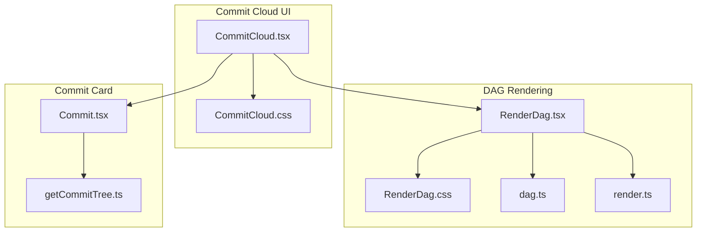
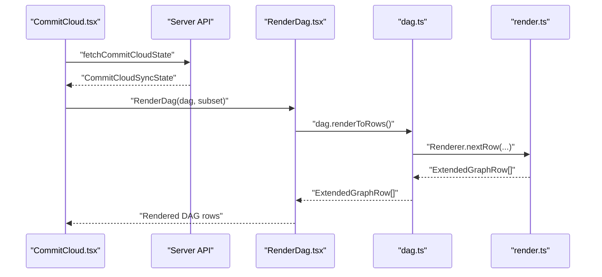
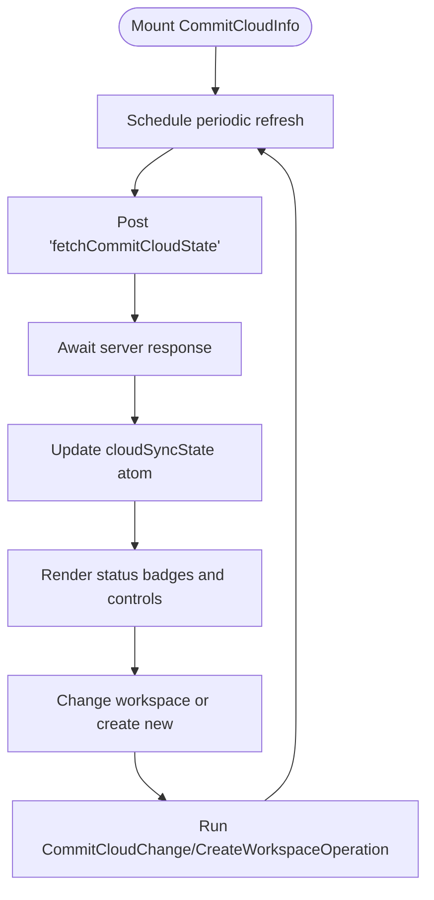
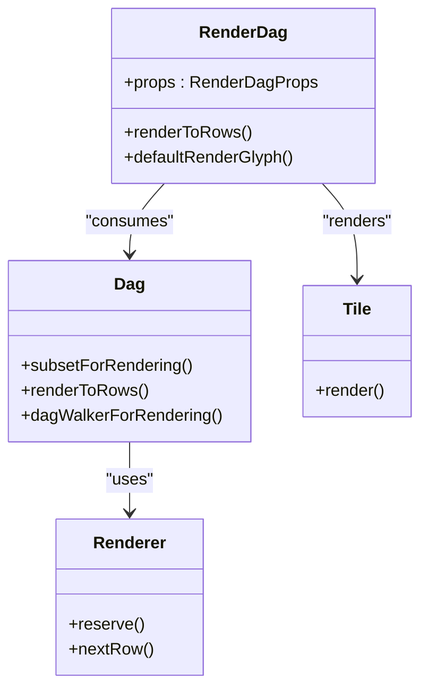
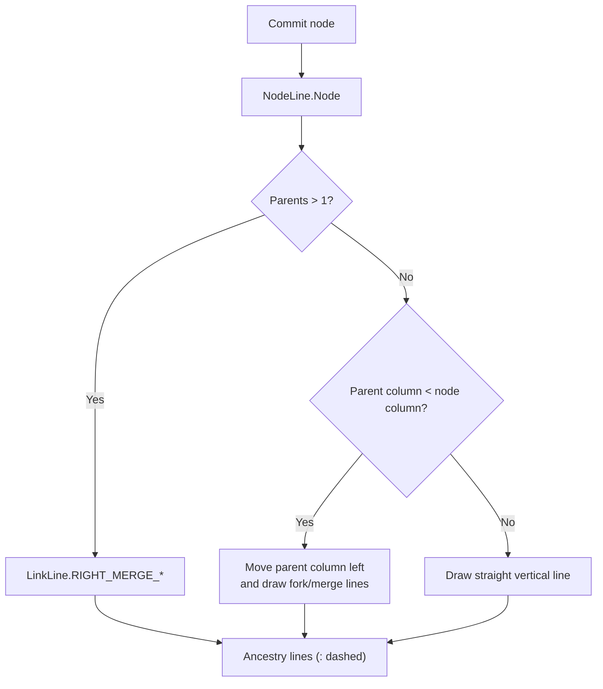
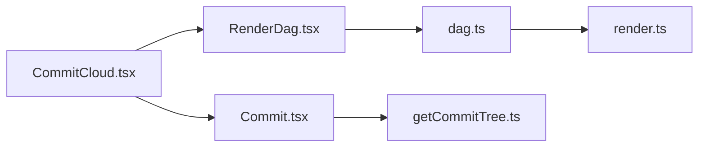

# Commit Cloud Display

<cite>
**Referenced Files in This Document**
- [CommitCloud.tsx](file://addons/isl/src/CommitCloud.tsx)
- [CommitCloud.css](file://addons/isl/src/CommitCloud.css)
- [RenderDag.tsx](file://addons/isl/src/RenderDag.tsx)
- [RenderDag.css](file://addons/isl/src/RenderDag.css)
- [dag.ts](file://addons/isl/src/dag/dag.ts)
- [render.ts](file://addons/isl/src/dag/render.ts)
- [Commit.tsx](file://addons/isl/src/Commit.tsx)
- [getCommitTree.ts](file://addons/isl/src/getCommitTree.ts)
</cite>

## Table of Contents
1. [Introduction](#introduction)
2. [Project Structure](#project-structure)
3. [Core Components](#core-components)
4. [Architecture Overview](#architecture-overview)
5. [Detailed Component Analysis](#detailed-component-analysis)
6. [Dependency Analysis](#dependency-analysis)
7. [Performance Considerations](#performance-considerations)
8. [Troubleshooting Guide](#troubleshooting-guide)
9. [Conclusion](#conclusion)

## Introduction
This document explains the commit cloud display system in the Sapling ISL (Interactive Smartlog) addon. It focuses on the CommitCloud component architecture, the underlying DAG rendering engine that powers the visual commit relationships, and the styling system used to present commits. While the repository does not implement a dedicated “commit cloud” layout algorithm or explicit clustering for overlapping commits, the rendering pipeline provides a robust foundation for visualizing dense commit histories with zoom-aware rendering and performance optimizations.

## Project Structure
The commit cloud display is implemented as part of the ISL UI and integrates with the DAG rendering subsystem:
- CommitCloud.tsx: Provides the UI for commit cloud status, workspace switching, and sync controls.
- CommitCloud.css: Styles the commit cloud panel and related UI elements.
- RenderDag.tsx: Core DAG renderer that computes and renders commit relationships with lines and glyphs.
- RenderDag.css: Styles for the DAG rendering container and tiles.
- dag.ts: High-level DAG API used by RenderDag, including rendering helpers and caches.
- render.ts: Low-level renderer that computes column assignments, link lines, and ancestry lines.
- Commit.tsx: Individual commit card component used within DAG views and commit cloud contexts.
- getCommitTree.ts: Utilities for building hierarchical commit trees used elsewhere in the UI.

**Diagram sources**
- [CommitCloud.tsx:1-340](file://addons/isl/src/CommitCloud.tsx#L1-L340)
- [CommitCloud.css:1-79](file://addons/isl/src/CommitCloud.css#L1-L79)
- [RenderDag.tsx:1-725](file://addons/isl/src/RenderDag.tsx#L1-L725)
- [RenderDag.css:1-45](file://addons/isl/src/RenderDag.css#L1-L45)
- [dag.ts:1-849](file://addons/isl/src/dag/dag.ts#L1-L849)
- [render.ts:1-753](file://addons/isl/src/dag/render.ts#L1-L753)
- [Commit.tsx:1-1114](file://addons/isl/src/Commit.tsx#L1-L1114)
- [getCommitTree.ts:1-133](file://addons/isl/src/getCommitTree.ts#L1-L133)

**Section sources**
- [CommitCloud.tsx:1-340](file://addons/isl/src/CommitCloud.tsx#L1-L340)
- [CommitCloud.css:1-79](file://addons/isl/src/CommitCloud.css#L1-L79)
- [RenderDag.tsx:1-725](file://addons/isl/src/RenderDag.tsx#L1-L725)
- [RenderDag.css:1-45](file://addons/isl/src/RenderDag.css#L1-L45)
- [dag.ts:1-849](file://addons/isl/src/dag/dag.ts#L1-L849)
- [render.ts:1-753](file://addons/isl/src/dag/render.ts#L1-L753)
- [Commit.tsx:1-1114](file://addons/isl/src/Commit.tsx#L1-L1114)
- [getCommitTree.ts:1-133](file://addons/isl/src/getCommitTree.ts#L1-L133)

## Core Components
- CommitCloud.tsx
  - Provides the commit cloud status panel, workspace dropdown, and sync controls.
  - Integrates with server API to fetch and refresh commit cloud state.
  - Uses operation runners to change workspace and sync commit cloud.
- RenderDag.tsx
  - Computes and renders commit rows with glyphs, link lines, and ancestry lines.
  - Supports custom renderers for commits and glyphs.
  - Uses caching to optimize repeated renders.
- dag.ts
  - High-level DAG API with rendering helpers, sorting, and filtering.
  - Implements subsetForRendering to prune unnamed public commits and obsolete stacks.
- render.ts
  - Low-level renderer computing columns, link lines, and ancestry lines.
  - Manages column assignment and horizontal/vertical line drawing.
- Commit.tsx
  - Individual commit card used within DAG views and commit cloud contexts.
  - Handles actions, context menus, and presentation of commit metadata.

**Section sources**
- [CommitCloud.tsx:65-340](file://addons/isl/src/CommitCloud.tsx#L65-L340)
- [RenderDag.tsx:117-725](file://addons/isl/src/RenderDag.tsx#L117-L725)
- [dag.ts:227-250](file://addons/isl/src/dag/dag.ts#L227-L250)
- [render.ts:499-753](file://addons/isl/src/dag/render.ts#L499-L753)
- [Commit.tsx:155-655](file://addons/isl/src/Commit.tsx#L155-L655)

## Architecture Overview
The commit cloud display relies on RenderDag to visualize commit relationships. RenderDag consumes a DAG (dag.ts) and uses the renderer (render.ts) to compute the layout. CommitCloud.tsx orchestrates the UI around this rendering pipeline.

**Diagram sources**
- [CommitCloud.tsx:73-87](file://addons/isl/src/CommitCloud.tsx#L73-L87)
- [RenderDag.tsx:129-154](file://addons/isl/src/RenderDag.tsx#L129-L154)
- [dag.ts:566-581](file://addons/isl/src/dag/dag.ts#L566-L581)
- [render.ts:523-751](file://addons/isl/src/dag/render.ts#L523-L751)

## Detailed Component Analysis

### CommitCloud Component
- Responsibilities
  - Fetch and display commit cloud status, including last backup time and sync errors.
  - Allow changing and creating workspaces via dropdown and input.
  - Trigger sync operations and reflect pending operations.
- Data flow
  - Uses a server API to fetch commit cloud state periodically.
  - Maintains state with jotai atoms and updates UI reactively.
- Interaction
  - Buttons and dropdowns trigger operations that change workspace or sync state.
  - Loading and error states are surfaced to the user.

**Diagram sources**
- [CommitCloud.tsx:65-266](file://addons/isl/src/CommitCloud.tsx#L65-L266)

**Section sources**
- [CommitCloud.tsx:65-266](file://addons/isl/src/CommitCloud.tsx#L65-L266)

### DAG Rendering Engine
- RenderDag.tsx
  - Converts a DAG into rows with left-side lines and right-side commit bodies.
  - Supports custom renderCommit, renderCommitExtras, and renderGlyph callbacks.
  - Uses Tiles to draw edges and glyphs efficiently.
- dag.ts
  - Provides subsetForRendering to reduce noise by hiding unnamed public commits and obsolete stacks.
  - Exposes renderToRows and dagWalkerForRendering for efficient rendering.
- render.ts
  - Computes columns, assigns parents to columns, and generates link lines and ancestry lines.
  - Handles merges, forks, and indirect ancestors with dashed lines.

**Diagram sources**
- [RenderDag.tsx:117-725](file://addons/isl/src/RenderDag.tsx#L117-L725)
- [dag.ts:227-250](file://addons/isl/src/dag/dag.ts#L227-L250)
- [render.ts:499-753](file://addons/isl/src/dag/render.ts#L499-L753)

**Section sources**
- [RenderDag.tsx:117-725](file://addons/isl/src/RenderDag.tsx#L117-L725)
- [dag.ts:227-250](file://addons/isl/src/dag/dag.ts#L227-L250)
- [render.ts:499-753](file://addons/isl/src/dag/render.ts#L499-L753)

### Visual Representation of Commit Relationships
- Glyphs and Tiles
  - RegularGlyph renders circles with optional avatar fills and obsoletion indicators.
  - YouAreHereGlyph replaces the tile for the current commit.
- Lines and Layout
  - NodeLine, LinkLine, and PadLine encode the connection types.
  - Renderer.nextRow computes horizontal/vertical lines, merges, and ancestry.
- Zoom-aware rendering
  - Tiles use scalable viewBox and stroke widths to remain crisp at different zoom levels.

**Diagram sources**
- [render.ts:523-751](file://addons/isl/src/dag/render.ts#L523-L751)
- [RenderDag.tsx:537-571](file://addons/isl/src/RenderDag.tsx#L537-L571)

**Section sources**
- [render.ts:278-751](file://addons/isl/src/dag/render.ts#L278-L751)
- [RenderDag.tsx:537-571](file://addons/isl/src/RenderDag.tsx#L537-L571)

### Styling System and Color Coding
- CommitCloud.css
  - Defines layout and spacing for the commit cloud panel.
  - Styles dropdowns, buttons, and backup status badges.
- RenderDag.css
  - Sets flex layout for rows and left/right sides.
  - Hides SVG pattern definitions off-screen for reuse.
- Color coding
  - Draft commits may use avatar fills; obsoleted commits show a diagonal slash.
  - “You are here” commits use a distinct color for the surrounding glyph.

**Section sources**
- [CommitCloud.css:8-79](file://addons/isl/src/CommitCloud.css#L8-L79)
- [RenderDag.css:8-45](file://addons/isl/src/RenderDag.css#L8-L45)
- [RenderDag.tsx:661-700](file://addons/isl/src/RenderDag.tsx#L661-L700)

### Clustering and Overlap Handling
- The repository does not implement a dedicated clustering algorithm for overlapping commits in the commit cloud display.
- The DAG renderer minimizes overlap by assigning parents to columns and drawing horizontal/vertical lines accordingly.
- For dense histories, consider:
  - Using subsetForRendering to prune unnecessary nodes.
  - Limiting the rendered set to recent commits or a focused range.
  - Leveraging the renderer’s column assignment to reduce visual clutter.

**Section sources**
- [dag.ts:227-250](file://addons/isl/src/dag/dag.ts#L227-L250)
- [render.ts:523-751](file://addons/isl/src/dag/render.ts#L523-L751)

### Zoom-aware Rendering
- Tiles scale with viewBox and stroke widths to maintain clarity across zoom levels.
- The renderer uses fractional coordinates and preserves aspect ratios when needed.

**Section sources**
- [RenderDag.tsx:479-534](file://addons/isl/src/RenderDag.tsx#L479-L534)
- [render.ts:500-534](file://addons/isl/src/dag/render.ts#L500-L534)

### Customization Examples
- Custom commit renderer
  - Pass a renderCommit function to RenderDag to customize how commit bodies appear.
- Custom glyph renderer
  - Pass a renderGlyph function to RenderDag to replace the default circle with custom visuals.
- Custom clustering
  - While no built-in clustering exists, you can pre-process the DAG subset (e.g., collapse obsolete stacks) before rendering.

**Section sources**
- [RenderDag.tsx:23-73](file://addons/isl/src/RenderDag.tsx#L23-L73)
- [dag.ts:227-250](file://addons/isl/src/dag/dag.ts#L227-L250)

### Screen Size Optimization
- The UI uses flexible layouts and spacing tokens to adapt to narrow screens.
- Commit cards adjust actions and layout based on screen width.

**Section sources**
- [Commit.tsx:191-191](file://addons/isl/src/Commit.tsx#L191-L191)

## Dependency Analysis
The commit cloud UI depends on the DAG rendering pipeline. RenderDag consumes the DAG API and uses the low-level renderer to produce rows. CommitCloud orchestrates state and operations.

**Diagram sources**
- [CommitCloud.tsx:1-340](file://addons/isl/src/CommitCloud.tsx#L1-L340)
- [RenderDag.tsx:1-725](file://addons/isl/src/RenderDag.tsx#L1-L725)
- [dag.ts:1-849](file://addons/isl/src/dag/dag.ts#L1-L849)
- [render.ts:1-753](file://addons/isl/src/dag/render.ts#L1-L753)
- [Commit.tsx:1-1114](file://addons/isl/src/Commit.tsx#L1-L1114)
- [getCommitTree.ts:1-133](file://addons/isl/src/getCommitTree.ts#L1-L133)

**Section sources**
- [CommitCloud.tsx:1-340](file://addons/isl/src/CommitCloud.tsx#L1-L340)
- [RenderDag.tsx:1-725](file://addons/isl/src/RenderDag.tsx#L1-L725)
- [dag.ts:1-849](file://addons/isl/src/dag/dag.ts#L1-L849)
- [render.ts:1-753](file://addons/isl/src/dag/render.ts#L1-L753)
- [Commit.tsx:1-1114](file://addons/isl/src/Commit.tsx#L1-L1114)
- [getCommitTree.ts:1-133](file://addons/isl/src/getCommitTree.ts#L1-L133)

## Performance Considerations
- Caching
  - dag.ts caches subsetForRendering, defaultSortAscIndex, and renderToRows to avoid recomputation.
- Subset pruning
  - subsetForRendering hides unnamed public commits and obsolete stacks to reduce rendering workload.
- Memoization
  - RenderDag uses React.memo to prevent unnecessary re-renders of rows and tiles.
- Scalability
  - For very large histories, limit the rendered set to a focused range and rely on pagination or range selection.

**Section sources**
- [dag.ts:684-689](file://addons/isl/src/dag/dag.ts#L684-L689)
- [dag.ts:227-250](file://addons/isl/src/dag/dag.ts#L227-L250)
- [RenderDag.tsx:418-427](file://addons/isl/src/RenderDag.tsx#L418-L427)

## Troubleshooting Guide
- Commit cloud disabled or errors
  - Check for isDisabled and syncError fields in the commit cloud state.
  - Inspect workspaceError for workspace-related failures.
- Sync status badges
  - Pending or failed backups are indicated by icons and tooltips listing affected commits.
- Workspace operations
  - Changing or creating workspaces triggers operations; UI reflects pending states until completion.

**Section sources**
- [CommitCloud.tsx:108-130](file://addons/isl/src/CommitCloud.tsx#L108-L130)
- [CommitCloud.tsx:268-318](file://addons/isl/src/CommitCloud.tsx#L268-L318)
- [CommitCloud.tsx:183-202](file://addons/isl/src/CommitCloud.tsx#L183-L202)

## Conclusion
The commit cloud display leverages a robust DAG rendering pipeline to visualize commit relationships effectively. While a dedicated clustering algorithm is not implemented, the renderer’s column assignment and subset pruning provide strong foundations for handling dense histories. The styling system and customization hooks enable flexible presentation tailored to different screen sizes and user preferences.