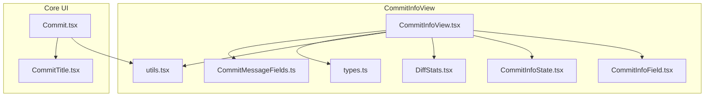
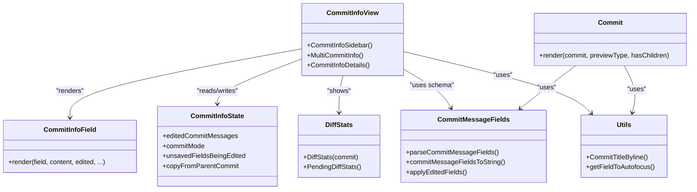
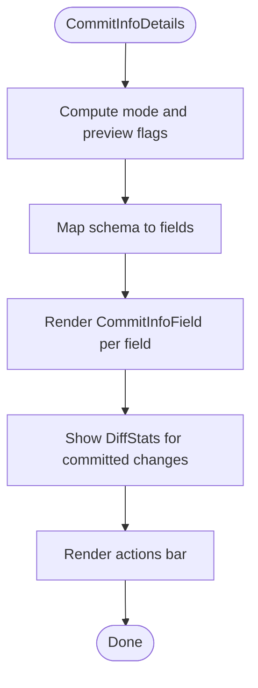
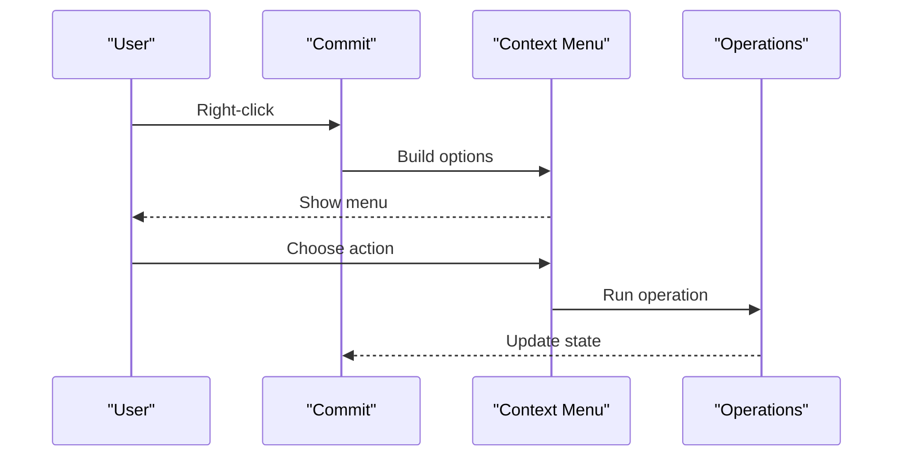
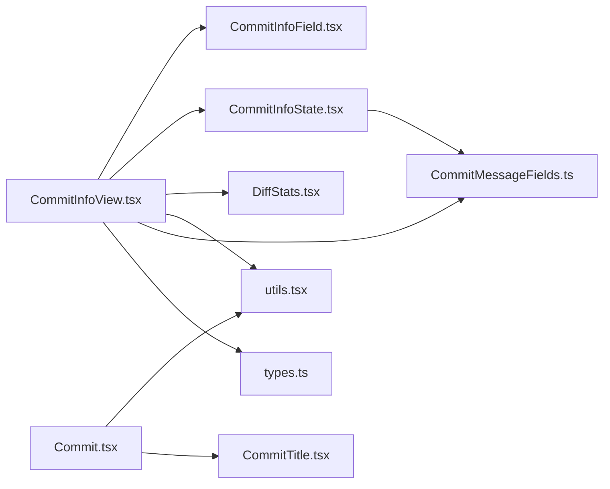

# Commit Information Panel

<cite>
**Referenced Files in This Document**
- [CommitInfoView.tsx](file://addons/isl/src/CommitInfoView/CommitInfoView.tsx)
- [Commit.tsx](file://addons/isl/src/Commit.tsx)
- [CommitInfoField.tsx](file://addons/isl/src/CommitInfoView/CommitInfoField.tsx)
- [CommitInfoState.tsx](file://addons/isl/src/CommitInfoView/CommitInfoState.tsx)
- [DiffStats.tsx](file://addons/isl/src/CommitInfoView/DiffStats.tsx)
- [CommitTitle.tsx](file://addons/isl/src/CommitTitle.tsx)
- [utils.tsx](file://addons/isl/src/CommitInfoView/utils.tsx)
- [types.ts](file://addons/isl/src/CommitInfoView/types.ts)
- [CommitMessageFields.ts](file://addons/isl/src/CommitInfoView/CommitMessageFields.ts)
</cite>

## Table of Contents
1. [Introduction](#introduction)
2. [Project Structure](#project-structure)
3. [Core Components](#core-components)
4. [Architecture Overview](#architecture-overview)
5. [Detailed Component Analysis](#detailed-component-analysis)
6. [Dependency Analysis](#dependency-analysis)
7. [Performance Considerations](#performance-considerations)
8. [Troubleshooting Guide](#troubleshooting-guide)
9. [Conclusion](#conclusion)

## Introduction
This document explains the commit information panel system used in the interactive smartlog (ISL) interface. It focuses on the CommitInfoView component architecture, how commit details are presented, and how the sidebar renders commit cards. It covers commit metadata display, file change summaries, commit title formatting, author and timestamp presentation, and branch/bookmark indicators. It also provides practical guidance for customizing commit card appearance, adding new metadata fields, implementing custom commit actions, integrating with selection states, comparison views, and real-time updates.

## Project Structure
The commit information panel lives primarily under the CommitInfoView module and integrates with broader ISL components for selection, previews, code review, and operations.



**Diagram sources**
- [CommitInfoView.tsx](file://addons/isl/src/CommitInfoView/CommitInfoView.tsx)
- [CommitInfoField.tsx](file://addons/isl/src/CommitInfoView/CommitInfoField.tsx)
- [CommitInfoState.tsx](file://addons/isl/src/CommitInfoView/CommitInfoState.tsx)
- [CommitMessageFields.ts](file://addons/isl/src/CommitInfoView/CommitMessageFields.ts)
- [DiffStats.tsx](file://addons/isl/src/CommitInfoView/DiffStats.tsx)
- [utils.tsx](file://addons/isl/src/CommitInfoView/utils.tsx)
- [types.ts](file://addons/isl/src/CommitInfoView/types.ts)
- [Commit.tsx](file://addons/isl/src/Commit.tsx)
- [CommitTitle.tsx](file://addons/isl/src/CommitTitle.tsx)

**Section sources**
- [CommitInfoView.tsx](file://addons/isl/src/CommitInfoView/CommitInfoView.tsx)
- [Commit.tsx](file://addons/isl/src/Commit.tsx)

## Core Components
- CommitInfoSidebar: Renders either a loading state, a multi-commit list, or a single commit details view.
- CommitInfoDetails: Displays commit message fields, remote tracking branch, pending/uncommitted changes, and committed file changes.
- CommitInfoField: Renders a single commit message field in either read-only or editor mode, with hover actions and tokenized editing for “field” type.
- Commit: Renders a single commit card in lists, including title, date, branch/bookmark indicators, and contextual actions.
- DiffStats: Shows significant lines of code for committed changes.
- CommitTitleByline: Formats author, phase badge, and relative timestamp for the commit title area.
- CommitMessageFields and schema: Define the structure of commit message fields, parsing, merging, and editing behavior.
- CommitInfoState: Manages edited commit messages, selection-driven modes (commit/amend), and persistence across selections and successors.

**Section sources**
- [CommitInfoView.tsx](file://addons/isl/src/CommitInfoView/CommitInfoView.tsx)
- [CommitInfoField.tsx](file://addons/isl/src/CommitInfoView/CommitInfoField.tsx)
- [Commit.tsx](file://addons/isl/src/Commit.tsx)
- [DiffStats.tsx](file://addons/isl/src/CommitInfoView/DiffStats.tsx)
- [utils.tsx](file://addons/isl/src/CommitInfoView/utils.tsx)
- [types.ts](file://addons/isl/src/CommitInfoView/types.ts)
- [CommitMessageFields.ts](file://addons/isl/src/CommitInfoView/CommitMessageFields.ts)
- [CommitInfoState.tsx](file://addons/isl/src/CommitInfoView/CommitInfoState.tsx)

## Architecture Overview
The commit information panel is reactive and driven by Jotai atoms. It responds to selection changes, commit previews, and server-provided data such as diff summaries and commit templates. The sidebar switches between multi-commit and single-commit views, and the single-commit view renders a structured set of fields and actions.

```mermaid
sequenceDiagram
participant User as "User"
participant Sidebar as "CommitInfoSidebar"
participant Details as "CommitInfoDetails"
participant Field as "CommitInfoField"
participant State as "CommitInfoState"
participant Schema as "CommitMessageFields"
participant Diff as "DiffStats"
User->>Sidebar : Select commit(s)
Sidebar->>Details : Render single or multi view
Details->>State : Read mode, edited fields, selection
Details->>Schema : Load field schema and defaults
Details->>Field : Render each field (title, textarea, field, custom)
Field->>State : Start editing, set edited field
Details->>Diff : Show diff stats for committed changes
Details-->>User : Rendered commit info with actions
```

**Diagram sources**
- [CommitInfoView.tsx](file://addons/isl/src/CommitInfoView/CommitInfoView.tsx)
- [CommitInfoField.tsx](file://addons/isl/src/CommitInfoView/CommitInfoField.tsx)
- [CommitInfoState.tsx](file://addons/isl/src/CommitInfoView/CommitInfoState.tsx)
- [CommitMessageFields.ts](file://addons/isl/src/CommitInfoView/CommitMessageFields.ts)
- [DiffStats.tsx](file://addons/isl/src/CommitInfoView/DiffStats.tsx)

## Detailed Component Analysis

### CommitInfoView.tsx
Responsibilities:
- Decide whether to show a loading state, multi-commit list, or single commit details.
- Manage commit mode (commit vs amend), optimistic previews, and remote tracking branch banners.
- Render commit message fields via CommitInfoField, pending/uncommitted changes, and committed file changes.
- Provide actions bar with submit, draft/publish checkboxes, and amend/commit operations.

Key behaviors:
- Uses commitInfoViewCurrentCommits to derive the current commit(s) and switches UI accordingly.
- Applies schema filtering to hide read-only fields in commit mode.
- Integrates with code review provider for remote tracking branch and submission actions.
- Handles fold preview banner and actions for combine operations.
- Computes “unsaved edited message” state and trims noop edits when switching commits.

**Section sources**
- [CommitInfoView.tsx](file://addons/isl/src/CommitInfoView/CommitInfoView.tsx)

### CommitInfoField.tsx
Responsibilities:
- Render a single commit message field in read-only or editor mode.
- Support tokenized editing for “field” type and long-form editing for “textarea” and “title”.
- Provide hover actions: edit, copy from parent, and AI generation buttons when enabled.
- Wrap long content with SeeMoreContainer for readability.

Rendering logic:
- Title fields use a dedicated editor and display a small caps header with milestone icon.
- Tokenized fields render clickable tokens and optional copy-to-clipboard.
- Custom fields render custom editor/display components supplied by schema.

**Section sources**
- [CommitInfoField.tsx](file://addons/isl/src/CommitInfoView/CommitInfoField.tsx)

### CommitInfoState.tsx
Responsibilities:
- Persist edited commit messages per commit hash or “head” for new commit mode.
- Track which fields are being edited and whether there are unsaved changes.
- Manage commit mode (commit vs amend) and enforce constraints (e.g., public commits cannot be amended).
- Copy values from parent commit context into current edited message.
- React to operation exits and recover edited messages on failure.

Integration:
- Uses succession tracker to migrate edited messages when commits are rewritten.
- Reads commitMessageFieldsSchema to compute edited vs latest fields.

**Section sources**
- [CommitInfoState.tsx](file://addons/isl/src/CommitInfoView/CommitInfoState.tsx)

### Commit.tsx
Responsibilities:
- Render a single commit card in lists, including title, date, branch/bookmark indicators, and contextual actions.
- Provide context menu with actions like copy hash, browse repo, submit, publish, rebase, amend-to, split, hide, goto.
- Show “irrelevant to CWD” indicator and inline progress for in-flight operations.
- Render unsaved edited message indicator and successor info badges.

UI highlights:
- Head commit styling and “you are here” label.
- Branching PRs and remote bookmarks display.
- Narrow vs wide layouts adapt actions visibility.

**Section sources**
- [Commit.tsx](file://addons/isl/src/Commit.tsx)

### DiffStats.tsx
Responsibilities:
- Display significant lines of code for committed changes.
- Provide loading and resolved views, with tooltip explaining significance.

**Section sources**
- [DiffStats.tsx](file://addons/isl/src/CommitInfoView/DiffStats.tsx)

### utils.tsx
Responsibilities:
- Provide shared UI utilities for commit info: title byline, small caps headers, sections, overflow ellipsis, and token click handlers.
- Compute which field should receive autofocus when editing starts.

**Section sources**
- [utils.tsx](file://addons/isl/src/CommitInfoView/utils.tsx)

### types.ts
Responsibilities:
- Define commit message field types, field configurations, and typeahead kinds.
- Describe the shape of edited messages and fields being edited.

**Section sources**
- [types.ts](file://addons/isl/src/CommitInfoView/types.ts)

### CommitMessageFields.ts
Responsibilities:
- Parse commit messages into structured fields based on schema.
- Merge, compare, and stringify commit message fields.
- Detect conflicting fields when merging and compute edited subsets.

**Section sources**
- [CommitMessageFields.ts](file://addons/isl/src/CommitInfoView/CommitMessageFields.ts)

### CommitTitle.tsx
Responsibilities:
- Render a concise commit title with tooltip for full message.
- Provide a temporary placeholder title when needed.

**Section sources**
- [CommitTitle.tsx](file://addons/isl/src/CommitTitle.tsx)

## Architecture Overview



**Diagram sources**
- [CommitInfoView.tsx](file://addons/isl/src/CommitInfoView/CommitInfoView.tsx)
- [CommitInfoField.tsx](file://addons/isl/src/CommitInfoView/CommitInfoField.tsx)
- [Commit.tsx](file://addons/isl/src/Commit.tsx)
- [DiffStats.tsx](file://addons/isl/src/CommitInfoView/DiffStats.tsx)
- [CommitInfoState.tsx](file://addons/isl/src/CommitInfoView/CommitInfoState.tsx)
- [CommitMessageFields.ts](file://addons/isl/src/CommitInfoView/CommitMessageFields.ts)
- [utils.tsx](file://addons/isl/src/CommitInfoView/utils.tsx)

## Detailed Component Analysis

### CommitInfoView Rendering Flow
- CommitInfoSidebar decides between loading, multi-commit list, or single commit details.
- CommitInfoDetails:
  - Determines mode (commit/amend), optimistic previews, and remote tracking branch.
  - Renders fields via CommitInfoField, applying schema and edited state.
  - Shows pending/uncommitted changes and committed file diffs.
  - Provides actions bar with submit, draft/publish, and amend/commit operations.



**Diagram sources**
- [CommitInfoView.tsx](file://addons/isl/src/CommitInfoView/CommitInfoView.tsx)
- [CommitInfoField.tsx](file://addons/isl/src/CommitInfoView/CommitInfoField.tsx)
- [DiffStats.tsx](file://addons/isl/src/CommitInfoView/DiffStats.tsx)

**Section sources**
- [CommitInfoView.tsx](file://addons/isl/src/CommitInfoView/CommitInfoView.tsx)

### Commit Card Rendering and Actions
- Commit renders title, date, branch/bookmark indicators, and contextual actions.
- Context menu includes copy hash, browse repo, submit, publish, rebase, amend-to, split, hide, goto.
- Narrow layout moves actions below the row; wide layout places them inline.



**Diagram sources**
- [Commit.tsx](file://addons/isl/src/Commit.tsx)

**Section sources**
- [Commit.tsx](file://addons/isl/src/Commit.tsx)

### Metadata Display and Formatting
- Author and timestamp: displayed via CommitTitleByline with relative date and tooltip for absolute time.
- Title formatting: one-line truncated title with tooltip for full message.
- Branch/bookmark indicators: remote bookmarks and branching PR badges; local and remote bookmarks display.
- Public commit badge: indicates immutable commits.

**Section sources**
- [utils.tsx](file://addons/isl/src/CommitInfoView/utils.tsx)
- [CommitTitle.tsx](file://addons/isl/src/CommitTitle.tsx)
- [Commit.tsx](file://addons/isl/src/Commit.tsx)

### File Change Summaries
- Pending/uncommitted changes: shown with selection counts and pending diff stats.
- Committed changes: file count badge, diff stats, and list of changed files with open-all actions.
- Open-all behavior distinguishes generated vs non-generated files.

**Section sources**
- [CommitInfoView.tsx](file://addons/isl/src/CommitInfoView/CommitInfoView.tsx)
- [DiffStats.tsx](file://addons/isl/src/CommitInfoView/DiffStats.tsx)
- [Commit.tsx](file://addons/isl/src/Commit.tsx)

### Customization Examples

- Customize commit card appearance:
  - Adjust CSS classes applied to commit rows and preview states.
  - Modify narrow/wide layout behavior by toggling responsive flags.
  - Add or modify icons and tooltips for commit metadata.

- Add new metadata fields:
  - Extend the field schema with a new FieldConfig entry (type, icon, key, and optional typeaheadKind/formatting).
  - Provide custom editor/display components for “custom” type fields.
  - Ensure parsing and stringification logic handles the new field consistently.

- Implement custom commit actions:
  - Add new context menu items in the Commit component’s context menu builder.
  - Wire actions to run operations via useRunOperation and warning checks where appropriate.

- Integrate with selection states and previews:
  - Use selection atoms to determine which commits are selected and drive the sidebar.
  - Respect preview types to disable actions during previews (e.g., fold preview).
  - Update edited commit messages when successors rewrite commits.

- Real-time updates:
  - Subscribe to server messages for commit templates and draft messages.
  - React to operation exits to recover edited messages on failures.
  - Track diffs and refresh diff summaries when active diff changes.

**Section sources**
- [CommitInfoState.tsx](file://addons/isl/src/CommitInfoView/CommitInfoState.tsx)
- [Commit.tsx](file://addons/isl/src/Commit.tsx)
- [CommitMessageFields.ts](file://addons/isl/src/CommitInfoView/CommitMessageFields.ts)
- [CommitInfoView.tsx](file://addons/isl/src/CommitInfoView/CommitInfoView.tsx)

## Dependency Analysis



**Diagram sources**
- [CommitInfoView.tsx](file://addons/isl/src/CommitInfoView/CommitInfoView.tsx)
- [CommitInfoField.tsx](file://addons/isl/src/CommitInfoView/CommitInfoField.tsx)
- [CommitInfoState.tsx](file://addons/isl/src/CommitInfoView/CommitInfoState.tsx)
- [DiffStats.tsx](file://addons/isl/src/CommitInfoView/DiffStats.tsx)
- [utils.tsx](file://addons/isl/src/CommitInfoView/utils.tsx)
- [CommitMessageFields.ts](file://addons/isl/src/CommitInfoView/CommitMessageFields.ts)
- [Commit.tsx](file://addons/isl/src/Commit.tsx)
- [CommitTitle.tsx](file://addons/isl/src/CommitTitle.tsx)
- [types.ts](file://addons/isl/src/CommitInfoView/types.ts)

**Section sources**
- [CommitInfoView.tsx](file://addons/isl/src/CommitInfoView/CommitInfoView.tsx)
- [Commit.tsx](file://addons/isl/src/Commit.tsx)

## Performance Considerations
- Minimize re-renders by using memoization and equality checks in Commit component.
- Defer heavy computations (e.g., significant lines of code) until diff summaries are available.
- Avoid unnecessary schema recomputation by deriving from atoms and caching parsed fields.
- Use selective rendering for multi-commit lists and only render visible actions in narrow layouts.

## Troubleshooting Guide
- Edited message not persisting:
  - Verify editedCommitMessages atom family keys and that succession tracking migrates edits on commit rewriting.
- Fields not appearing in commit mode:
  - Ensure schema excludes read-only fields when in commit mode.
- Remote tracking branch banner not showing:
  - Confirm code review provider supplies diff summaries and remote tracking branch.
- Actions disabled during previews:
  - Preview types like fold preview intentionally disable actions; ensure UI reflects preview state.
- Uncommitted changes not updating:
  - Check selection state and uncommitted changes atoms; ensure previews are accounted for.

**Section sources**
- [CommitInfoState.tsx](file://addons/isl/src/CommitInfoView/CommitInfoState.tsx)
- [CommitInfoView.tsx](file://addons/isl/src/CommitInfoView/CommitInfoView.tsx)
- [Commit.tsx](file://addons/isl/src/Commit.tsx)

## Conclusion
The commit information panel system combines a flexible field schema, reactive state management, and rich UI components to present and edit commit metadata. It supports both single and multi-commit views, integrates with selection and preview states, and provides robust mechanisms for real-time updates and error recovery. Extensibility is achieved through schema customization, custom field components, and context menu actions.