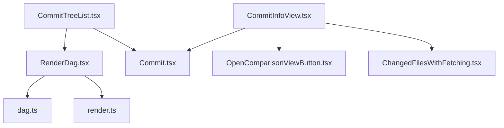
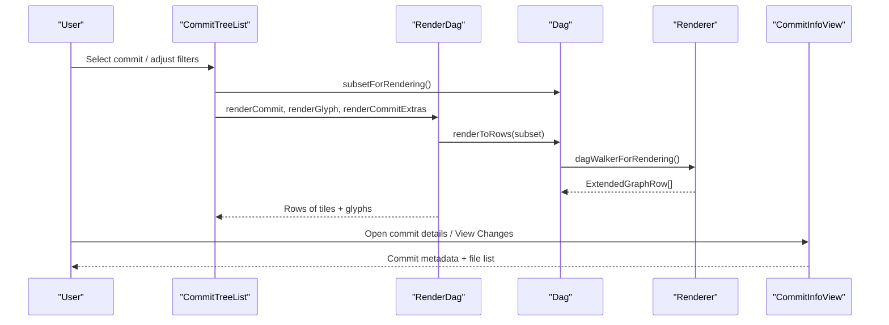
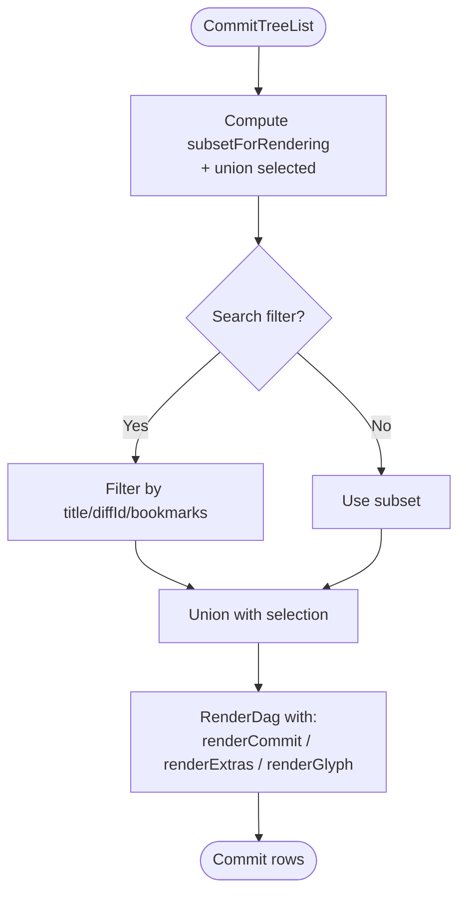
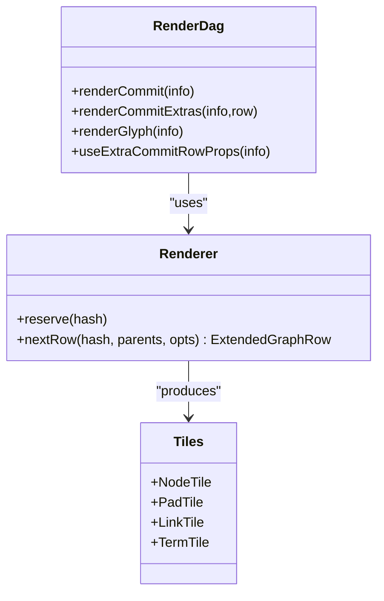
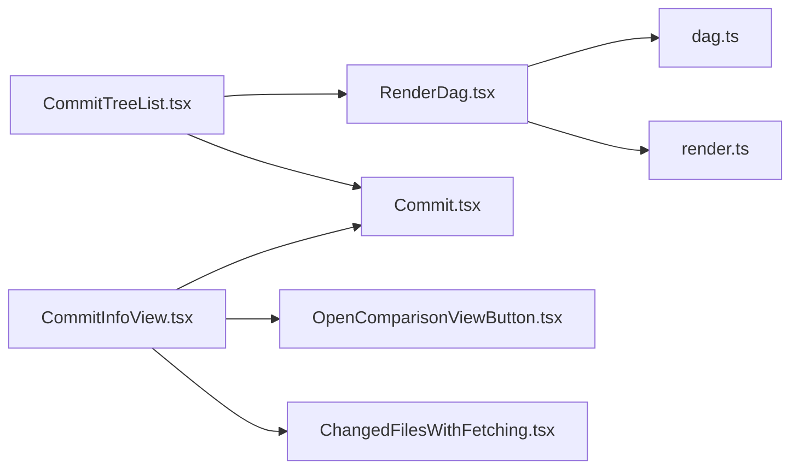

# Commit Visualization

<cite>
**Referenced Files in This Document**
- [CommitTreeList.tsx](file://addons/isl/src/CommitTreeList.tsx)
- [RenderDag.tsx](file://addons/isl/src/RenderDag.tsx)
- [CommitInfoView.tsx](file://addons/isl/src/CommitInfoView/CommitInfoView.tsx)
- [dag.ts](file://addons/isl/src/dag/dag.ts)
- [render.ts](file://addons/isl/src/dag/render.ts)
- [Commit.tsx](file://addons/isl/src/Commit.tsx)
- [OpenComparisonViewButton.tsx](file://addons/isl/src/ComparisonView/OpenComparisonViewButton.tsx)
- [ChangedFilesWithFetching.tsx](file://addons/isl/src/ChangedFilesWithFetching.tsx)
</cite>

## Table of Contents
1. [Introduction](#introduction)
2. [Project Structure](#project-structure)
3. [Core Components](#core-components)
4. [Architecture Overview](#architecture-overview)
5. [Detailed Component Analysis](#detailed-component-analysis)
6. [Dependency Analysis](#dependency-analysis)
7. [Performance Considerations](#performance-considerations)
8. [Troubleshooting Guide](#troubleshooting-guide)
9. [Conclusion](#conclusion)
10. [Appendices](#appendices)

## Introduction
This document explains the commit visualization system used in the Interactive Smartlog (ISL) addon. It focuses on:
- The CommitTreeList component architecture and how it orchestrates DAG rendering and selection
- The RenderDag graph layout engine and tile-based SVG rendering
- The CommitInfoView sidebar for commit details and file change visualization
- Customization patterns for themes, attributes, and filters
- Integration with comparison views and real-time updates

## Project Structure
The commit visualization spans several modules:
- CommitTreeList: renders the main commit graph and manages selection/search/filtering
- RenderDag: the DAG layout engine and SVG tile renderer
- dag/dag and dag/render: DAG model, rendering walker, and graph row builder
- CommitInfoView: sidebar for commit details, actions, and file lists
- ComparisonView and ChangedFilesWithFetching: integration with diff/changes display
- Commit: individual commit card with actions and context menu

**Diagram sources**
- [CommitTreeList.tsx:118-177](file://addons/isl/src/CommitTreeList.tsx#L118-L177)
- [RenderDag.tsx:117-155](file://addons/isl/src/RenderDag.tsx#L117-L155)
- [dag.ts:565-581](file://addons/isl/src/dag/dag.ts#L565-L581)
- [render.ts:499-752](file://addons/isl/src/dag/render.ts#L499-L752)
- [CommitInfoView.tsx:116-135](file://addons/isl/src/CommitInfoView/CommitInfoView.tsx#L116-L135)
- [Commit.tsx:155-655](file://addons/isl/src/Commit.tsx#L155-L655)
- [OpenComparisonViewButton.tsx:18-42](file://addons/isl/src/ComparisonView/OpenComparisonViewButton.tsx#L18-L42)
- [ChangedFilesWithFetching.tsx:34-99](file://addons/isl/src/ChangedFilesWithFetching.tsx#L34-L99)

**Section sources**
- [CommitTreeList.tsx:1-268](file://addons/isl/src/CommitTreeList.tsx#L1-L268)
- [RenderDag.tsx:1-725](file://addons/isl/src/RenderDag.tsx#L1-L725)
- [dag.ts:1-849](file://addons/isl/src/dag/dag.ts#L1-L849)
- [render.ts:1-753](file://addons/isl/src/dag/render.ts#L1-L753)
- [CommitInfoView.tsx:1-1209](file://addons/isl/src/CommitInfoView/CommitInfoView.tsx#L1-L1209)
- [Commit.tsx:1-1114](file://addons/isl/src/Commit.tsx#L1-L1114)
- [OpenComparisonViewButton.tsx:1-58](file://addons/isl/src/ComparisonView/OpenComparisonViewButton.tsx#L1-L58)
- [ChangedFilesWithFetching.tsx:1-126](file://addons/isl/src/ChangedFilesWithFetching.tsx#L1-L126)

## Core Components
- CommitTreeList: Computes a rendering subset of the DAG, applies filters (search, cwd relevance), and delegates rendering to RenderDag. It wires selection callbacks, progress overlays, and contextual actions (stack actions, fetching additional commits).
- RenderDag: The layout engine that converts a DAG into rows of tiles. It builds NodeLine, LinkLine, and AncestryLine segments, and renders glyphs (commit markers) inside or replacing tiles. It supports custom renderers for commits, extras, and glyphs.
- dag/dag: Provides the DAG model, rendering walker, and row generation. It caches subsets and sorts commits efficiently.
- dag/render: Implements the graph layout algorithm that assigns columns, resolves merges/forks, and computes line segments for edges.
- CommitInfoView: Presents commit details, actions, and file lists. Integrates with comparison views and handles diff summaries and file loading.
- Commit: Individual commit card with context menu, actions, and indicators (unsaved edits, obsoletion, relevance to working directory).
- ComparisonView and ChangedFilesWithFetching: Provide “View Changes” integration and lazy-loading of full file lists for commits.

**Section sources**
- [CommitTreeList.tsx:98-177](file://addons/isl/src/CommitTreeList.tsx#L98-L177)
- [RenderDag.tsx:117-155](file://addons/isl/src/RenderDag.tsx#L117-L155)
- [dag.ts:565-581](file://addons/isl/src/dag/dag.ts#L565-L581)
- [render.ts:499-752](file://addons/isl/src/dag/render.ts#L499-L752)
- [CommitInfoView.tsx:116-458](file://addons/isl/src/CommitInfoView/CommitInfoView.tsx#L116-L458)
- [Commit.tsx:155-655](file://addons/isl/src/Commit.tsx#L155-L655)
- [OpenComparisonViewButton.tsx:18-42](file://addons/isl/src/ComparisonView/OpenComparisonViewButton.tsx#L18-L42)
- [ChangedFilesWithFetching.tsx:34-99](file://addons/isl/src/ChangedFilesWithFetching.tsx#L34-L99)

## Architecture Overview
The visualization pipeline:
- CommitTreeList builds a rendering subset from the DAG, applies filters, and passes it to RenderDag.
- RenderDag uses dag/dag’s walker to produce ExtendedGraphRow arrays and constructs tiles for edges and glyphs.
- Each commit row is rendered via a customizable renderCommit function and optional renderCommitExtras.
- CommitInfoView displays details for the selected commit(s), integrates with comparison views, and lazily loads file lists.

**Diagram sources**
- [CommitTreeList.tsx:64-96](file://addons/isl/src/CommitTreeList.tsx#L64-L96)
- [RenderDag.tsx:117-155](file://addons/isl/src/RenderDag.tsx#L117-L155)
- [dag.ts:565-581](file://addons/isl/src/dag/dag.ts#L565-L581)
- [render.ts:499-752](file://addons/isl/src/dag/render.ts#L499-L752)
- [CommitInfoView.tsx:116-135](file://addons/isl/src/CommitInfoView/CommitInfoView.tsx#L116-L135)

## Detailed Component Analysis

### CommitTreeList: Rendering orchestration and filters
Responsibilities:
- Builds a rendering subset from the DAG, optionally condensing obsolete stacks and hiding irrelevant commits relative to the current working directory.
- Applies a search filter across commit title, diff ID, and bookmarks.
- Wires selection callbacks, keyboard shortcuts, and contextual actions (stack actions, fetching additional commits).
- Delegates rendering to RenderDag with custom renderers for commit body, extras, and glyphs.

Key behaviors:
- Subset computation via subsetForRendering and union with selected commits.
- Search filter checks title, diff ID, and bookmark sets.
- Conditional extras rendering for root-like nodes and draft stack roots.
- Glyph customization for “You are here” and highlighted commits.

**Diagram sources**
- [CommitTreeList.tsx:64-96](file://addons/isl/src/CommitTreeList.tsx#L64-L96)
- [CommitTreeList.tsx:118-177](file://addons/isl/src/CommitTreeList.tsx#L118-L177)

**Section sources**
- [CommitTreeList.tsx:49-96](file://addons/isl/src/CommitTreeList.tsx#L49-L96)
- [CommitTreeList.tsx:118-217](file://addons/isl/src/CommitTreeList.tsx#L118-L217)

### RenderDag: Graph layout engine and tile rendering
Responsibilities:
- Converts DAG rows into ExtendedGraphRow structures with NodeLine, LinkLine, and AncestryLine segments.
- Renders edges using SVG tiles with precise line drawing and optional gaps for intersections.
- Supports custom commit renderers, extras renderers, and glyph renderers (including “replace-tile” for irregular layouts like “You are here”).
- Uses memoization to avoid unnecessary re-renders.

Key structures:
- Tiles: NodeTile, PadTile, LinkTile, TermTile encapsulate SVG paths for edges.
- LinkLine, NodeLine, PadLine enums encode segment types and flags.
- Renderer class computes column assignments, handles merges/forks, and generates lines.

**Diagram sources**
- [RenderDag.tsx:117-155](file://addons/isl/src/RenderDag.tsx#L117-L155)
- [render.ts:499-752](file://addons/isl/src/dag/render.ts#L499-L752)
- [RenderDag.tsx:479-535](file://addons/isl/src/RenderDag.tsx#L479-L535)

**Section sources**
- [RenderDag.tsx:117-725](file://addons/isl/src/RenderDag.tsx#L117-L725)
- [render.ts:1-753](file://addons/isl/src/dag/render.ts#L1-L753)

### dag/dag: DAG model and rendering walker
Responsibilities:
- Maintains commit DAG and mutation DAG, supports add/remove/replace operations.
- Provides subsetForRendering to hide unnamed public commits and obsolete stacks.
- Exposes renderToRows that yields ExtendedGraphRow via a walker.
- Caches expensive computations (roots, heads, sort indices, subsets, render rows).

Highlights:
- Efficient sorting and indexing for large DAGs.
- Support for “grandparents” and fallback connection logic for backward compatibility.
- Successor/predecessor traversal on mutation graph with followSuccessors semantics.

**Section sources**
- [dag.ts:227-250](file://addons/isl/src/dag/dag.ts#L227-L250)
- [dag.ts:565-651](file://addons/isl/src/dag/dag.ts#L565-L651)
- [dag.ts:684-689](file://addons/isl/src/dag/dag.ts#L684-L689)

### dag/render: Graph layout algorithm
Responsibilities:
- Assigns columns to nodes and parents, resolving merges and forks.
- Computes horizontal/vertical link lines and ancestry lines with proper dashes and gaps.
- Generates ExtendedGraphRow with derived fields (pre/post lines, indirect ancestor detection).

Key logic:
- Column assignment prefers existing columns or adjacent ones to reduce crossings.
- Horizontal lines span between outermost ancestors/parents; vertical lines connect to node.
- Ancestry lines collapse repeated “:” per branch.

**Section sources**
- [render.ts:499-752](file://addons/isl/src/dag/render.ts#L499-L752)

### CommitInfoView: Sidebar and file visualization
Responsibilities:
- Displays commit details, actions, and file lists for selected commit(s).
- Integrates with comparison views via OpenComparisonViewButton.
- Lazily fetches full file lists for commits and augments basic metadata.
- Shows banners for remote tracking branches, message syncing, and relevance to working directory.

Integration points:
- OpenComparisonViewButton triggers comparison view for committed diffs.
- ChangedFilesWithFetching loads all changed files on demand and shows a preview list.

**Section sources**
- [CommitInfoView.tsx:116-458](file://addons/isl/src/CommitInfoView/CommitInfoView.tsx#L116-L458)
- [OpenComparisonViewButton.tsx:18-42](file://addons/isl/src/ComparisonView/OpenComparisonViewButton.tsx#L18-L42)
- [ChangedFilesWithFetching.tsx:34-99](file://addons/isl/src/ChangedFilesWithFetching.tsx#L34-L99)

### Commit: Individual commit card
Responsibilities:
- Renders commit title/date, bookmarks, and indicators (unsaved edits, obsoletion, relevance).
- Provides context menu actions (copy hash, browse repo, submit/update diff, rebase, split, hide, goto).
- Integrates with preview states and inline progress indicators.

**Section sources**
- [Commit.tsx:155-655](file://addons/isl/src/Commit.tsx#L155-L655)

## Dependency Analysis
High-level dependencies:
- CommitTreeList depends on dag/dag for subset computation and on RenderDag for rendering.
- RenderDag depends on dag/dag for rows and on dag/render for layout.
- CommitInfoView depends on Commit for selection and on comparison/view components for diff display.
- Commit depends on selection, previews, and context menu utilities.

**Diagram sources**
- [CommitTreeList.tsx:104-115](file://addons/isl/src/CommitTreeList.tsx#L104-L115)
- [RenderDag.tsx:117-155](file://addons/isl/src/RenderDag.tsx#L117-L155)
- [dag.ts:565-581](file://addons/isl/src/dag/dag.ts#L565-L581)
- [render.ts:499-752](file://addons/isl/src/dag/render.ts#L499-L752)
- [Commit.tsx:155-655](file://addons/isl/src/Commit.tsx#L155-L655)
- [CommitInfoView.tsx:116-135](file://addons/isl/src/CommitInfoView/CommitInfoView.tsx#L116-L135)
- [OpenComparisonViewButton.tsx:18-42](file://addons/isl/src/ComparisonView/OpenComparisonViewButton.tsx#L18-L42)
- [ChangedFilesWithFetching.tsx:34-99](file://addons/isl/src/ChangedFilesWithFetching.tsx#L34-L99)

**Section sources**
- [CommitTreeList.tsx:1-268](file://addons/isl/src/CommitTreeList.tsx#L1-L268)
- [RenderDag.tsx:1-725](file://addons/isl/src/RenderDag.tsx#L1-L725)
- [dag.ts:1-849](file://addons/isl/src/dag/dag.ts#L1-L849)
- [render.ts:1-753](file://addons/isl/src/dag/render.ts#L1-L753)
- [CommitInfoView.tsx:1-1209](file://addons/isl/src/CommitInfoView/CommitInfoView.tsx#L1-L1209)
- [Commit.tsx:1-1114](file://addons/isl/src/Commit.tsx#L1-L1114)
- [OpenComparisonViewButton.tsx:1-58](file://addons/isl/src/ComparisonView/OpenComparisonViewButton.tsx#L1-L58)
- [ChangedFilesWithFetching.tsx:1-126](file://addons/isl/src/ChangedFilesWithFetching.tsx#L1-L126)

## Performance Considerations
- Caching: dag/dag caches subsetForRendering, sort indices, and renderToRows to minimize recomputation during updates.
- Memoization: RenderDag and Commit use React.memo to avoid re-rendering unchanged rows and commit cards.
- Lazy loading: CommitInfoView and ChangedFilesWithFetching defer loading of full file lists until requested.
- Conditional rendering: CommitTreeList hides irrelevant commits and applies search filters to reduce DOM size.
- Tile rendering: RenderDag uses SVG tiles with minimal DOM overhead and precise edge drawing.

[No sources needed since this section provides general guidance]

## Troubleshooting Guide
Common issues and remedies:
- No commits found: CommitTreeList shows a friendly error and offers to create an initial commit when appropriate.
- Fetch errors: CommitTreeList surfaces fetch errors and allows retrying operations.
- Missing file lists for public commits: CommitInfoView prompts to load all files on demand.
- Selection not updating: Ensure selection atoms are subscribed and selection callbacks are wired in CommitTreeList.

**Section sources**
- [CommitTreeList.tsx:247-268](file://addons/isl/src/CommitTreeList.tsx#L247-L268)
- [ChangedFilesWithFetching.tsx:62-99](file://addons/isl/src/ChangedFilesWithFetching.tsx#L62-L99)

## Conclusion
The commit visualization system combines a flexible DAG model with a robust layout engine and a rich sidebar interface. It balances performance with interactivity through caching, memoization, and lazy loading, while offering extensibility via custom renderers and filters.

[No sources needed since this section summarizes without analyzing specific files]

## Appendices

### Customization Examples

- Customizing visualization themes
  - Adjust CSS variables used by tiles and glyphs (e.g., foreground/background, focus border) to align with light/dark themes.
  - Modify glyph rendering by providing a custom renderGlyph to RenderDag.

- Adding new commit attributes
  - Extend the commit info model in the DAG to include new fields.
  - Update Commit to render the new attribute and CommitInfoView to display it.

- Implementing custom filtering
  - Add predicates to CommitTreeList’s subset computation to include or exclude commits based on new criteria.
  - Wire the filter UI to update the filter atom and trigger a re-render.

- Integration with comparison views
  - Use OpenComparisonViewButton to open committed diffs and head changes.
  - Use ChangedFilesWithFetching to lazily load full file lists and integrate with diff summaries.

**Section sources**
- [RenderDag.tsx:718-724](file://addons/isl/src/RenderDag.tsx#L718-L724)
- [CommitTreeList.tsx:64-96](file://addons/isl/src/CommitTreeList.tsx#L64-L96)
- [OpenComparisonViewButton.tsx:18-42](file://addons/isl/src/ComparisonView/OpenComparisonViewButton.tsx#L18-L42)
- [ChangedFilesWithFetching.tsx:34-99](file://addons/isl/src/ChangedFilesWithFetching.tsx#L34-L99)