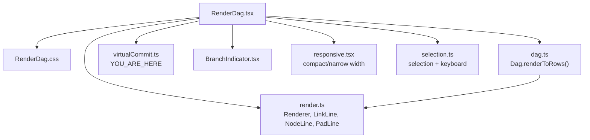
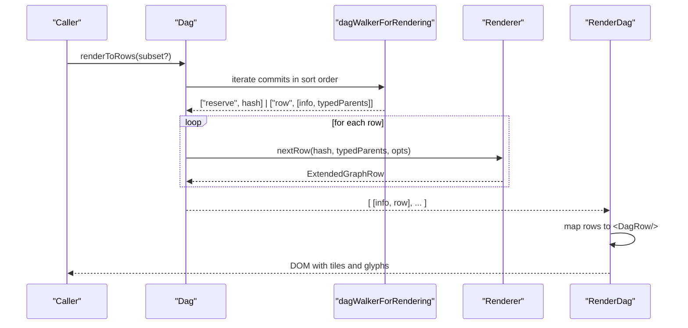
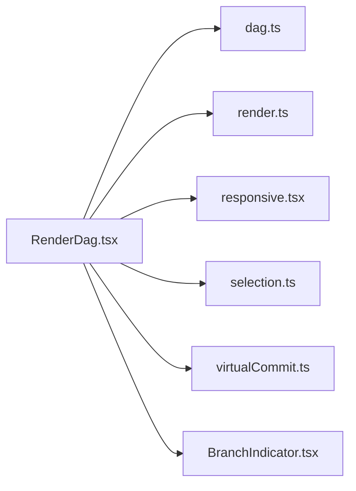

# DAG Rendering Engine

<cite>
**Referenced Files in This Document**
- [RenderDag.tsx](file://addons/isl/src/RenderDag.tsx)
- [RenderDag.css](file://addons/isl/src/RenderDag.css)
- [render.ts](file://addons/isl/src/dag/render.ts)
- [dag.ts](file://addons/isl/src/dag/dag.ts)
- [virtualCommit.ts](file://addons/isl/src/dag/virtualCommit.ts)
- [responsive.tsx](file://addons/isl/src/responsive.tsx)
- [BranchIndicator.tsx](file://addons/isl/src/BranchIndicator.tsx)
- [selection.ts](file://addons/isl/src/selection.ts)
</cite>

## Table of Contents
1. [Introduction](#introduction)
2. [Project Structure](#project-structure)
3. [Core Components](#core-components)
4. [Architecture Overview](#architecture-overview)
5. [Detailed Component Analysis](#detailed-component-analysis)
6. [Dependency Analysis](#dependency-analysis)
7. [Performance Considerations](#performance-considerations)
8. [Troubleshooting Guide](#troubleshooting-guide)
9. [Conclusion](#conclusion)

## Introduction
This document explains the Directed Acyclic Graph (DAG) rendering engine used to visualize commit history in the ISL interface. It covers the RenderDag component architecture, the graph layout algorithm, the glyph system for commit symbols and branch indicators, responsive rendering for narrow layouts, and integration with selection states, hover effects, and keyboard navigation. It also provides practical guidance for customizing render functions, implementing new glyph types, and optimizing performance for large repositories.

## Project Structure
The DAG rendering engine is implemented primarily in the isl addon. The key files are:
- RenderDag.tsx: The main React component that renders the DAG rows and tiles.
- RenderDag.css: Styles for the layout and positioning of rows and lines.
- dag.ts: The Dag class orchestrating commit data, subset filtering, and rendering pipeline.
- render.ts: The graph layout algorithm that computes per-row line segments (node, link, ancestry, termination).
- virtualCommit.ts: Virtual commit representation for “You are here”.
- responsive.tsx: Responsive configuration and compact rendering toggles.
- BranchIndicator.tsx: A reusable branch indicator glyph component.
- selection.ts: Selection state, keyboard navigation, and interaction hooks.

**Diagram sources**
- [RenderDag.tsx:117-155](file://addons/isl/src/RenderDag.tsx#L117-L155)
- [RenderDag.css:8-44](file://addons/isl/src/RenderDag.css#L8-L44)
- [render.ts:499-752](file://addons/isl/src/dag/render.ts#L499-L752)
- [dag.ts:566-581](file://addons/isl/src/dag/dag.ts#L566-L581)
- [virtualCommit.ts:17-31](file://addons/isl/src/dag/virtualCommit.ts#L17-L31)
- [BranchIndicator.tsx:8-32](file://addons/isl/src/BranchIndicator.tsx#L8-L32)
- [responsive.tsx:62-69](file://addons/isl/src/responsive.tsx#L62-L69)
- [selection.ts:93-190](file://addons/isl/src/selection.ts#L93-L190)

**Section sources**
- [RenderDag.tsx:117-155](file://addons/isl/src/RenderDag.tsx#L117-L155)
- [RenderDag.css:8-44](file://addons/isl/src/RenderDag.css#L8-L44)
- [dag.ts:566-581](file://addons/isl/src/dag/dag.ts#L566-L581)
- [render.ts:499-752](file://addons/isl/src/dag/render.ts#L499-L752)
- [virtualCommit.ts:17-31](file://addons/isl/src/dag/virtualCommit.ts#L17-L31)
- [responsive.tsx:62-69](file://addons/isl/src/responsive.tsx#L62-L69)
- [BranchIndicator.tsx:8-32](file://addons/isl/src/BranchIndicator.tsx#L8-L32)
- [selection.ts:93-190](file://addons/isl/src/selection.ts#L93-L190)

## Core Components
- RenderDag: The primary component that converts commit data into visual rows and tiles. It supports custom render functions for commits, extras, and glyphs, and integrates with selection and responsive settings.
- Renderer (render.ts): Implements the graph layout algorithm that computes per-row line segments for node, link, ancestry, and termination lines.
- Dag (dag.ts): Manages commit data, subsets for rendering, and the walking pipeline that feeds Renderer with typed ancestors.
- Glyph system: Built-in glyphs for regular commits and “You are here”, plus extensible renderGlyph hook to replace or embed custom glyphs.
- Responsive rendering: Compact mode and narrow-width thresholds to adapt the layout for constrained screens.
- Selection and keyboard: Hooks to integrate selection state, keyboard navigation, and actions.

**Section sources**
- [RenderDag.tsx:23-155](file://addons/isl/src/RenderDag.tsx#L23-L155)
- [render.ts:499-752](file://addons/isl/src/dag/render.ts#L499-L752)
- [dag.ts:566-651](file://addons/isl/src/dag/dag.ts#L566-L651)
- [responsive.tsx:62-69](file://addons/isl/src/responsive.tsx#L62-L69)
- [selection.ts:93-319](file://addons/isl/src/selection.ts#L93-L319)

## Architecture Overview
The rendering pipeline transforms commit data into a sequence of rows, each composed of left-side lines (node/link/ancestry/terminator) and a right-side commit body. The Renderer computes the line segments per row, and RenderDag composes tiles and glyphs into a responsive grid.

**Diagram sources**
- [dag.ts:566-651](file://addons/isl/src/dag/dag.ts#L566-L651)
- [render.ts:523-751](file://addons/isl/src/dag/render.ts#L523-L751)
- [RenderDag.tsx:129-146](file://addons/isl/src/RenderDag.tsx#L129-L146)

## Detailed Component Analysis

### RenderDag Component
RenderDag orchestrates the rendering of the DAG:
- Converts commit data to rows via Dag.renderToRows.
- Computes author avatars for draft commits and injects SVG patterns.
- Renders each row with a flexible layout supporting:
  - Pre-node, node, and post-node lines.
  - Optional link lines, term lines, and ancestry lines.
  - Extras below the commit body.
- Supports custom render functions:
  - renderCommit: customize commit body.
  - renderCommitExtras: render additional content below a commit.
  - renderGlyph: customize the glyph (symbol) inside/outside the tile.
  - useExtraCommitRowProps: attach row-level attributes (e.g., selection styling).

Layout behavior:
- “You are here” commits replace the tile with a dynamic label element and shift commit placement.
- Conditional visibility of row2 (extras/link/ancestry) based on content.

Performance:
- Uses React.memo on row rendering and memoized tiles to minimize re-renders.
- AnimatedReorderGroup animates row reorder transitions.

Integration:
- Uses selection hooks to compute row attributes for selection highlights.
- Reads responsive state to adjust compactness.

**Section sources**
- [RenderDag.tsx:117-155](file://addons/isl/src/RenderDag.tsx#L117-L155)
- [RenderDag.tsx:173-427](file://addons/isl/src/RenderDag.tsx#L173-L427)
- [RenderDag.tsx:479-535](file://addons/isl/src/RenderDag.tsx#L479-L535)
- [RenderDag.tsx:537-598](file://addons/isl/src/RenderDag.tsx#L537-L598)
- [RenderDag.tsx:718-724](file://addons/isl/src/RenderDag.tsx#L718-L724)

### Graph Layout Algorithm (Renderer)
The Renderer computes per-row line segments:
- NodeLine: vertical connectors for node, parent, ancestor, or blank.
- LinkLine: horizontal/vertical/fork/merge lines connecting parents/ancestors.
- PadLine: ancestry lines (“|” for direct, “:” for indirect).
- TermLine: terminator lines for anonymous parents (“~”).

Key steps:
- Assign a column to the node, preferring existing or empty slots.
- Build nodeLine, linkLine, ancestryLine, and termLine arrays aligned to columns.
- Resolve merges and forks across columns, marking horizontal/vertical edges.
- Convert ancestor columns to parents to avoid redundant “:” lines.
- Compute parentColumns and linkLineFromNode to distinguish node-originated edges.

Optimization:
- Uses bitflags for LinkLine to efficiently encode edges.
- Resets column state after each row to prevent cross-row interference.

**Section sources**
- [render.ts:33-100](file://addons/isl/src/dag/render.ts#L33-L100)
- [render.ts:278-345](file://addons/isl/src/dag/render.ts#L278-L345)
- [render.ts:499-751](file://addons/isl/src/dag/render.ts#L499-L751)

### Dag Rendering Pipeline
Dag coordinates the rendering pipeline:
- renderToRows caches computed rows for performance.
- dagWalkerForRendering yields reserve and row events:
  - reserve: reserve a column for public commits to keep them indented.
  - row: [info, typedParents] for Renderer.nextRow.
- Typed ancestors:
  - directParents: present in render set.
  - indirectParents: ancestors present in render set.
  - anonymousParents: missing parents (rendered as “~”).
- Subset calculation:
  - subsetForRendering filters out unnamed public commits not directly connected to draft children and condenses obsolete stacks.

**Section sources**
- [dag.ts:566-581](file://addons/isl/src/dag/dag.ts#L566-L581)
- [dag.ts:588-651](file://addons/isl/src/dag/dag.ts#L588-L651)
- [dag.ts:227-250](file://addons/isl/src/dag/dag.ts#L227-L250)

### Glyph System
Built-in glyphs:
- RegularGlyph: circle with optional obsoleted slash and avatar fill for draft commits.
- defaultRenderGlyph: selects RegularGlyph or replaces tile with YouAreHereGlyph for “you are here”.

Customization:
- renderGlyph(info) returns either:
  - ['inside-tile', JSX.Element]: render inside the fixed-size tile.
  - ['replace-tile', JSX.Element]: replace the tile with a dynamic element and shift commit layout.

BranchIndicator:
- A reusable SVG component for branch indicators.

**Section sources**
- [RenderDag.tsx:661-700](file://addons/isl/src/RenderDag.tsx#L661-L700)
- [RenderDag.tsx:718-724](file://addons/isl/src/RenderDag.tsx#L718-L724)
- [BranchIndicator.tsx:8-32](file://addons/isl/src/BranchIndicator.tsx#L8-L32)

### Responsive Rendering
Responsive behavior:
- renderCompactAtom toggles compact mode.
- isNarrowCommitTree compares current width against thresholds (compact vs. normal).
- useMainContentWidth tracks container width via ResizeObserver.
- zoomUISettingAtom adjusts global zoom via CSS variable.

Effects:
- Adjusts widths and spacing to fit narrow layouts.
- Enables compact rendering for dense displays.

**Section sources**
- [responsive.tsx:19-28](file://addons/isl/src/responsive.tsx#L19-L28)
- [responsive.tsx:41-69](file://addons/isl/src/responsive.tsx#L41-L69)

### Selection States, Hover Effects, and Keyboard Navigation
Selection:
- selectedCommits atom stores selected hashes.
- useCommitSelection computes isSelected and onClickToSelect with multi-select, shift-range, and overrideSelection.
- Public commits and virtual commits are excluded from selection.

Keyboard navigation:
- useArrowKeysToChangeSelection moves selection up/down with optional extension.
- Integrates with OpenDetails command to reveal commit details.

Hover and extras:
- useExtraCommitRowProps allows attaching hover/selection styles to row divs.
- renderCommitExtras can render contextual overlays below commits.

**Section sources**
- [selection.ts:45-91](file://addons/isl/src/selection.ts#L45-L91)
- [selection.ts:93-190](file://addons/isl/src/selection.ts#L93-L190)
- [selection.ts:227-319](file://addons/isl/src/selection.ts#L227-L319)

## Dependency Analysis
RenderDag depends on:
- Dag for rows and commit metadata.
- Renderer for line segment computation.
- Responsive atoms for layout decisions.
- Selection atoms for row styling and callbacks.
- Virtual commit for “you are here” behavior.
- BranchIndicator for optional branch visuals.

**Diagram sources**
- [RenderDag.tsx:117-155](file://addons/isl/src/RenderDag.tsx#L117-L155)
- [dag.ts:566-581](file://addons/isl/src/dag/dag.ts#L566-L581)
- [render.ts:523-751](file://addons/isl/src/dag/render.ts#L523-L751)
- [responsive.tsx:62-69](file://addons/isl/src/responsive.tsx#L62-L69)
- [selection.ts:93-190](file://addons/isl/src/selection.ts#L93-L190)
- [virtualCommit.ts:17-31](file://addons/isl/src/dag/virtualCommit.ts#L17-L31)
- [BranchIndicator.tsx:8-32](file://addons/isl/src/BranchIndicator.tsx#L8-L32)

**Section sources**
- [RenderDag.tsx:117-155](file://addons/isl/src/RenderDag.tsx#L117-L155)
- [dag.ts:566-581](file://addons/isl/src/dag/dag.ts#L566-L581)
- [render.ts:523-751](file://addons/isl/src/dag/render.ts#L523-L751)
- [responsive.tsx:62-69](file://addons/isl/src/responsive.tsx#L62-L69)
- [selection.ts:93-190](file://addons/isl/src/selection.ts#L93-L190)
- [virtualCommit.ts:17-31](file://addons/isl/src/dag/virtualCommit.ts#L17-L31)
- [BranchIndicator.tsx:8-32](file://addons/isl/src/BranchIndicator.tsx#L8-L32)

## Performance Considerations
- Memoization:
  - React.memo on DagRow and Tile components prevents unnecessary re-renders.
  - LRU caches for roots, heads, all, subsetForRendering, defaultSortAscIndex, and renderToRows reduce recomputation.
- Efficient line encoding:
  - Bitflags in LinkLine enable compact representation of edges.
- Deferred rendering:
  - AnimatedReorderGroup batches row animations.
- Subset filtering:
  - subsetForRendering trims unnamed public commits and obsolete stacks to reduce visual clutter and computation.
- Virtual commits:
  - Special-case handling for “you are here” avoids heavy layout shifts.

Recommendations:
- Keep renderCommit/renderGlyph static to avoid re-renders; use hooks inside to fetch state.
- Prefer subsetForRendering to limit the number of commits rendered.
- Use compact mode and responsive thresholds to reduce tile count on small screens.

**Section sources**
- [RenderDag.tsx:418-427](file://addons/isl/src/RenderDag.tsx#L418-L427)
- [RenderDag.tsx:535-535](file://addons/isl/src/RenderDag.tsx#L535-L535)
- [dag.ts:684-689](file://addons/isl/src/dag/dag.ts#L684-L689)
- [dag.ts:227-250](file://addons/isl/src/dag/dag.ts#L227-L250)
- [render.ts:278-345](file://addons/isl/src/dag/render.ts#L278-L345)

## Troubleshooting Guide
Common issues and resolutions:
- Missing or incorrect lines:
  - Verify typedParents construction in dagWalkerForRendering. Anonymous parents are represented as blocked ancestors to render “~”.
  - Ensure Renderer.reset() is invoked after each row to avoid cross-row artifacts.
- “You are here” not replacing tile:
  - Confirm renderGlyph returns ['replace-tile', ...] for info.isYouAreHere.
- Excessive re-renders:
  - Wrap renderCommit/renderCommitExtras/renderGlyph with stable functions; rely on hooks for state updates.
- Selection not applying:
  - Ensure selectedCommits excludes public and virtual commits; verify useCommitSelection key modifiers and shift-range logic.
- Narrow layout problems:
  - Toggle renderCompactAtom and adjust main content width; confirm isNarrowCommitTree threshold.

**Section sources**
- [dag.ts:607-651](file://addons/isl/src/dag/dag.ts#L607-L651)
- [render.ts:729-731](file://addons/isl/src/dag/render.ts#L729-L731)
- [RenderDag.tsx:718-724](file://addons/isl/src/RenderDag.tsx#L718-L724)
- [selection.ts:100-172](file://addons/isl/src/selection.ts#L100-L172)
- [responsive.tsx:62-69](file://addons/isl/src/responsive.tsx#L62-L69)

## Conclusion
The DAG rendering engine combines a robust layout algorithm with a flexible, extensible rendering pipeline. RenderDag composes tiles and glyphs into a responsive, interactive visualization, while Dag and Renderer handle the heavy lifting of column assignment, edge computation, and subset filtering. With memoization, caching, and responsive controls, it scales effectively to large repositories. Developers can customize glyphs, commit bodies, and extras, and integrate selection and keyboard navigation seamlessly.