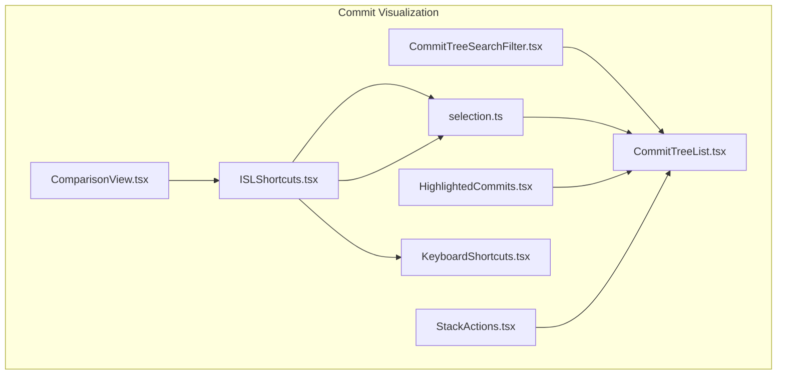
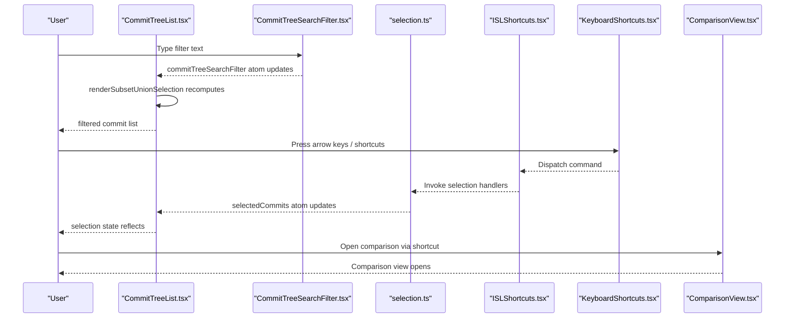
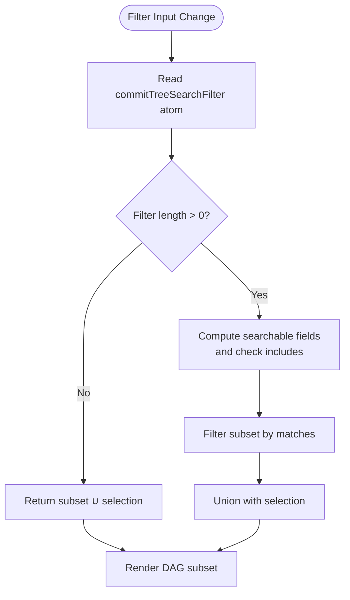
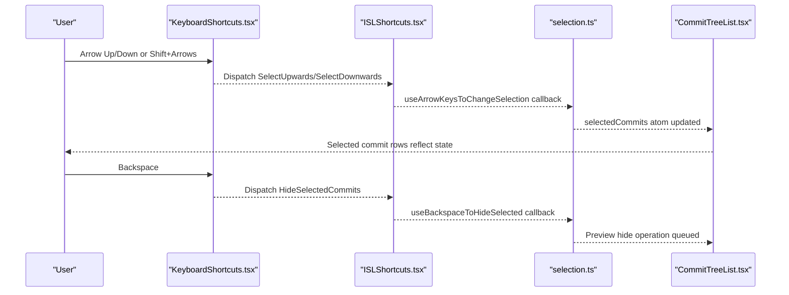
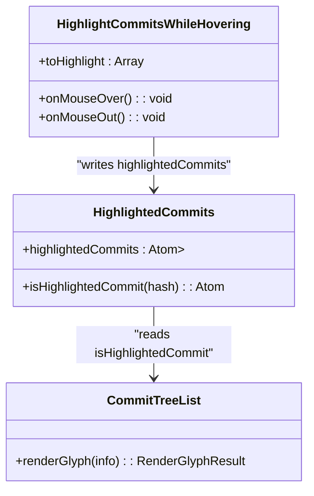
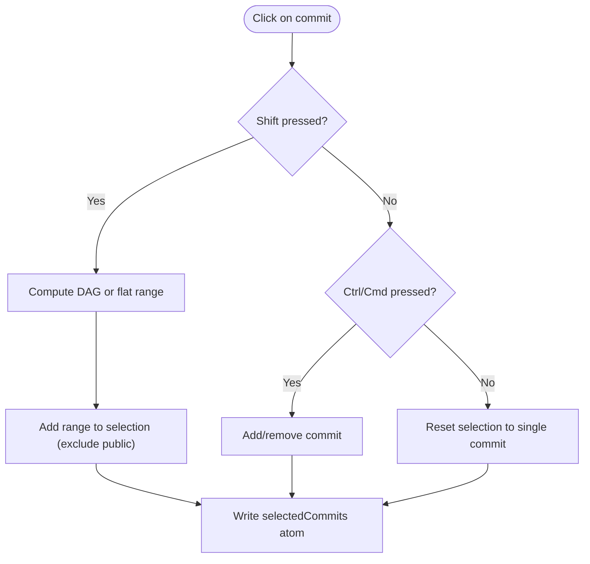
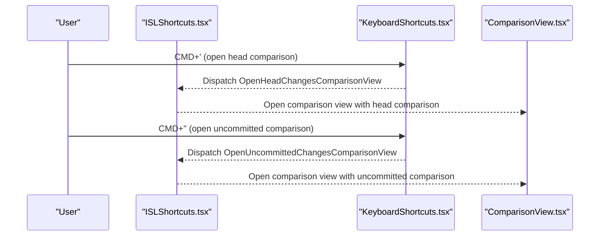
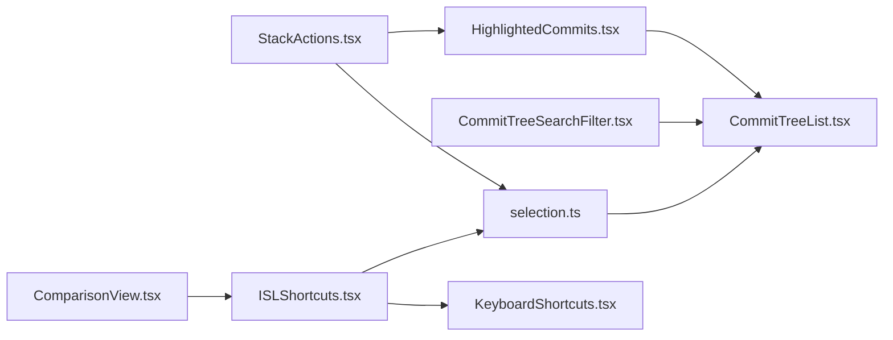

# Interactive Controls and Navigation

<cite>
**Referenced Files in This Document**
- [CommitTreeList.tsx](file://addons/isl/src/CommitTreeList.tsx)
- [CommitTreeSearchFilter.tsx](file://addons/isl/src/CommitTreeSearchFilter.tsx)
- [selection.ts](file://addons/isl/src/selection.ts)
- [HighlightedCommits.tsx](file://addons/isl/src/HighlightedCommits.tsx)
- [ISLShortcuts.tsx](file://addons/isl/src/ISLShortcuts.tsx)
- [SelectAllCommits.tsx](file://addons/isl/src/SelectAllCommits.tsx)
- [KeyboardShortcuts.tsx](file://addons/components/KeyboardShortcuts.tsx)
- [StackActions.tsx](file://addons/isl/src/StackActions.tsx)
- [ComparisonView.tsx](file://addons/isl/src/ComparisonView/ComparisonView.tsx)
</cite>

## Table of Contents
1. [Introduction](#introduction)
2. [Project Structure](#project-structure)
3. [Core Components](#core-components)
4. [Architecture Overview](#architecture-overview)
5. [Detailed Component Analysis](#detailed-component-analysis)
6. [Dependency Analysis](#dependency-analysis)
7. [Performance Considerations](#performance-considerations)
8. [Troubleshooting Guide](#troubleshooting-guide)
9. [Conclusion](#conclusion)

## Introduction
This document explains the interactive controls and navigation system for commit visualization in the interactive smartlog (ISL). It covers:
- Search and filtering mechanisms integrated into the commit list
- Keyboard navigation and selection management
- Commit highlighting and selection states
- Multi-select functionality and selection modes
- Real-time filtering performance and result highlighting
- Integration with comparison views and stack operations

## Project Structure
The interactive commit visualization spans several modules:
- Commit list rendering and filtering
- Selection and keyboard navigation
- Search/filter UI and state
- Highlighting utilities
- Keyboard shortcuts framework
- Comparison view integration
- Stack actions and operations

**Diagram sources**
- [CommitTreeList.tsx:77-96](file://addons/isl/src/CommitTreeList.tsx#L77-L96)
- [CommitTreeSearchFilter.tsx:21-115](file://addons/isl/src/CommitTreeSearchFilter.tsx#L21-L115)
- [selection.ts:45-91](file://addons/isl/src/selection.ts#L45-L91)
- [HighlightedCommits.tsx:14-18](file://addons/isl/src/HighlightedCommits.tsx#L14-L18)
- [ISLShortcuts.tsx:21-45](file://addons/isl/src/ISLShortcuts.tsx#L21-L45)
- [KeyboardShortcuts.tsx:132-159](file://addons/components/KeyboardShortcuts.tsx#L132-L159)
- [StackActions.tsx:42-258](file://addons/isl/src/StackActions.tsx#L42-L258)
- [ComparisonView.tsx:74-178](file://addons/isl/src/ComparisonView/ComparisonView.tsx#L74-L178)

**Section sources**
- [CommitTreeList.tsx:1-268](file://addons/isl/src/CommitTreeList.tsx#L1-L268)
- [CommitTreeSearchFilter.tsx:1-116](file://addons/isl/src/CommitTreeSearchFilter.tsx#L1-L116)
- [selection.ts:1-388](file://addons/isl/src/selection.ts#L1-L388)
- [HighlightedCommits.tsx:1-61](file://addons/isl/src/HighlightedCommits.tsx#L1-L61)
- [ISLShortcuts.tsx:1-114](file://addons/isl/src/ISLShortcuts.tsx#L1-L114)
- [KeyboardShortcuts.tsx:1-160](file://addons/components/KeyboardShortcuts.tsx#L1-L160)
- [StackActions.tsx:1-371](file://addons/isl/src/StackActions.tsx#L1-L371)
- [ComparisonView.tsx:1-465](file://addons/isl/src/ComparisonView/ComparisonView.tsx#L1-L465)

## Core Components
- CommitTreeList renders the DAG subset for display, applies filters, and binds selection callbacks.
- CommitTreeSearchFilter provides the filter input and toggles the filter dropdown.
- selection manages selection state, keyboard-driven navigation, and bulk actions.
- HighlightedCommits maintains a set of highlighted commits for hover feedback.
- ISLShortcuts defines keyboard shortcuts and exposes a command dispatcher.
- KeyboardShortcuts provides the low-level command dispatcher and modifier handling.
- StackActions integrates stack-level operations and highlights related commits.
- ComparisonView provides comparison UI and supports opening comparisons from commit actions.

**Section sources**
- [CommitTreeList.tsx:77-96](file://addons/isl/src/CommitTreeList.tsx#L77-L96)
- [CommitTreeSearchFilter.tsx:21-115](file://addons/isl/src/CommitTreeSearchFilter.tsx#L21-L115)
- [selection.ts:45-91](file://addons/isl/src/selection.ts#L45-L91)
- [HighlightedCommits.tsx:14-18](file://addons/isl/src/HighlightedCommits.tsx#L14-L18)
- [ISLShortcuts.tsx:21-45](file://addons/isl/src/ISLShortcuts.tsx#L21-L45)
- [KeyboardShortcuts.tsx:132-159](file://addons/components/KeyboardShortcuts.tsx#L132-L159)
- [StackActions.tsx:42-258](file://addons/isl/src/StackActions.tsx#L42-L258)
- [ComparisonView.tsx:74-178](file://addons/isl/src/ComparisonView/ComparisonView.tsx#L74-L178)

## Architecture Overview
The system combines reactive state (Jotai atoms), UI components, and keyboard commands to deliver an interactive commit visualization experience.

**Diagram sources**
- [CommitTreeList.tsx:77-96](file://addons/isl/src/CommitTreeList.tsx#L77-L96)
- [CommitTreeSearchFilter.tsx:94-112](file://addons/isl/src/CommitTreeSearchFilter.tsx#L94-L112)
- [selection.ts:227-319](file://addons/isl/src/selection.ts#L227-L319)
- [ISLShortcuts.tsx:21-45](file://addons/isl/src/ISLShortcuts.tsx#L21-L45)
- [KeyboardShortcuts.tsx:71-114](file://addons/components/KeyboardShortcuts.tsx#L71-L114)
- [ComparisonView.tsx:180-245](file://addons/isl/src/ComparisonView/ComparisonView.tsx#L180-L245)

## Detailed Component Analysis

### Search and Filtering Mechanism
- Filter atom: A Jotai atom holds the current filter string.
- Real-time filtering: The render subset computation merges the DAG subset with the current selection and applies a filter predicate that checks commit title, diff ID, bookmarks, and remote bookmarks.
- UI: A dropdown-triggered filter input updates the atom and clears the filter when empty.

**Diagram sources**
- [CommitTreeList.tsx:77-96](file://addons/isl/src/CommitTreeList.tsx#L77-L96)
- [CommitTreeSearchFilter.tsx:94-112](file://addons/isl/src/CommitTreeSearchFilter.tsx#L94-L112)

**Section sources**
- [CommitTreeList.tsx:77-96](file://addons/isl/src/CommitTreeList.tsx#L77-L96)
- [CommitTreeSearchFilter.tsx:21-115](file://addons/isl/src/CommitTreeSearchFilter.tsx#L21-L115)

### Keyboard Navigation and Selection Management
- Selection state: A Jotai atom stores the set of selected commit hashes.
- Individual toggle key: Platform-aware modifier for toggling individual selections.
- Shift-range selection: Computes a range using DAG methods or fallback sorting indices.
- Arrow keys: Handlers move the selection up/down and optionally extend it with Shift.
- Backspace: Triggers a preview operation to hide the most recent selection.
- Rebase onto stack base: Builds revsets from selected commits and either a single or bulk rebase operation.

**Diagram sources**
- [selection.ts:227-319](file://addons/isl/src/selection.ts#L227-L319)
- [selection.ts:321-351](file://addons/isl/src/selection.ts#L321-L351)
- [selection.ts:353-387](file://addons/isl/src/selection.ts#L353-L387)
- [ISLShortcuts.tsx:21-45](file://addons/isl/src/ISLShortcuts.tsx#L21-L45)
- [KeyboardShortcuts.tsx:71-114](file://addons/components/KeyboardShortcuts.tsx#L71-L114)

**Section sources**
- [selection.ts:45-91](file://addons/isl/src/selection.ts#L45-L91)
- [selection.ts:100-190](file://addons/isl/src/selection.ts#L100-L190)
- [selection.ts:227-319](file://addons/isl/src/selection.ts#L227-L319)
- [selection.ts:321-351](file://addons/isl/src/selection.ts#L321-L351)
- [selection.ts:353-387](file://addons/isl/src/selection.ts#L353-L387)
- [ISLShortcuts.tsx:21-45](file://addons/isl/src/ISLShortcuts.tsx#L21-L45)
- [KeyboardShortcuts.tsx:132-159](file://addons/components/KeyboardShortcuts.tsx#L132-L159)

### Commit Highlighting System and Selection States
- Highlighted commits: A Jotai atom tracks a set of highlighted hashes.
- Hover highlighting: A utility component sets the highlight set on mouseover and clears it on mouseout.
- Glyph overlay: The commit glyph renderer draws a highlight ring around selected/highlighted commits.

**Diagram sources**
- [HighlightedCommits.tsx:14-18](file://addons/isl/src/HighlightedCommits.tsx#L14-L18)
- [HighlightedCommits.tsx:28-59](file://addons/isl/src/HighlightedCommits.tsx#L28-L59)
- [CommitTreeList.tsx:203-216](file://addons/isl/src/CommitTreeList.tsx#L203-L216)

**Section sources**
- [HighlightedCommits.tsx:14-18](file://addons/isl/src/HighlightedCommits.tsx#L14-L18)
- [HighlightedCommits.tsx:28-59](file://addons/isl/src/HighlightedCommits.tsx#L28-L59)
- [CommitTreeList.tsx:203-216](file://addons/isl/src/CommitTreeList.tsx#L203-L216)

### Multi-Select Functionality and Modes
- Shift selection: Uses DAG range or fallback sort indices to select contiguous ranges.
- Ctrl/Cmd toggle: Adds/removes commits from the selection set depending on modifier.
- Select all: A shortcut selects all non-obsolete draft commits and opens the sidebar for bulk actions.

**Diagram sources**
- [selection.ts:111-139](file://addons/isl/src/selection.ts#L111-L139)
- [selection.ts:141-168](file://addons/isl/src/selection.ts#L141-L168)
- [SelectAllCommits.tsx:32-50](file://addons/isl/src/SelectAllCommits.tsx#L32-L50)

**Section sources**
- [selection.ts:111-168](file://addons/isl/src/selection.ts#L111-L168)
- [SelectAllCommits.tsx:22-50](file://addons/isl/src/SelectAllCommits.tsx#L22-L50)

### Integration with Comparison Views and Stack Operations
- Comparison view: Provides a picker to switch between Uncommitted, Head, and Stack comparisons, with reload and expand/collapse controls.
- Keyboard shortcuts: Dedicated commands open uncommitted/head comparison views and rebase onto stack base.
- Stack actions: Buttons for submit/resubmit, edit stack, suggested rebase, and absorb integrate with selection and highlight utilities.

**Diagram sources**
- [ISLShortcuts.tsx:24-25](file://addons/isl/src/ISLShortcuts.tsx#L24-L25)
- [KeyboardShortcuts.tsx:71-114](file://addons/components/KeyboardShortcuts.tsx#L71-L114)
- [ComparisonView.tsx:180-245](file://addons/isl/src/ComparisonView/ComparisonView.tsx#L180-L245)

**Section sources**
- [ISLShortcuts.tsx:24-25](file://addons/isl/src/ISLShortcuts.tsx#L24-L25)
- [ComparisonView.tsx:180-245](file://addons/isl/src/ComparisonView/ComparisonView.tsx#L180-L245)
- [StackActions.tsx:42-258](file://addons/isl/src/StackActions.tsx#L42-L258)

## Dependency Analysis
- CommitTreeList depends on:
  - commitTreeSearchFilter atom for filtering
  - selectedCommits atom for unioning with subset
  - isHighlightedCommit atom for glyph overlay
  - selection hooks for row callbacks and keyboard navigation
- selection module depends on:
  - dagWithPreviews for commit graph queries
  - platform for confirm dialogs
  - operation APIs for preview/execution
- ISLShortcuts composes KeyboardShortcuts and registers commands.
- StackActions integrates with selection and highlight utilities for stack-level operations.

**Diagram sources**
- [CommitTreeList.tsx:77-96](file://addons/isl/src/CommitTreeList.tsx#L77-L96)
- [selection.ts:45-91](file://addons/isl/src/selection.ts#L45-L91)
- [ISLShortcuts.tsx:21-45](file://addons/isl/src/ISLShortcuts.tsx#L21-L45)
- [KeyboardShortcuts.tsx:132-159](file://addons/components/KeyboardShortcuts.tsx#L132-L159)
- [StackActions.tsx:42-258](file://addons/isl/src/StackActions.tsx#L42-L258)
- [ComparisonView.tsx:74-178](file://addons/isl/src/ComparisonView/ComparisonView.tsx#L74-L178)

**Section sources**
- [CommitTreeList.tsx:77-96](file://addons/isl/src/CommitTreeList.tsx#L77-L96)
- [selection.ts:45-91](file://addons/isl/src/selection.ts#L45-L91)
- [ISLShortcuts.tsx:21-45](file://addons/isl/src/ISLShortcuts.tsx#L21-L45)
- [KeyboardShortcuts.tsx:132-159](file://addons/components/KeyboardShortcuts.tsx#L132-L159)
- [StackActions.tsx:42-258](file://addons/isl/src/StackActions.tsx#L42-L258)
- [ComparisonView.tsx:74-178](file://addons/isl/src/ComparisonView/ComparisonView.tsx#L74-L178)

## Performance Considerations
- Real-time filtering: The filter predicate runs against searchable fields and unions with selection to minimize DOM churn.
- Sorting and range selection: Uses DAG-provided sort indices and range computations to avoid expensive manual traversal.
- Highlighting: Hover-based highlighting writes a small set atom and relies on component re-rendering.
- Comparison view: Debounces heavy operations and caches parsed diffs keyed by comparison identity.

[No sources needed since this section provides general guidance]

## Troubleshooting Guide
- No commits found: The commit list displays an error notice and offers creating an initial commit when appropriate.
- Filter not clearing: Ensure the filter atom is reset to an empty string and the dropdown is dismissed.
- Selection not updating: Verify keyboard shortcuts are not focused on text inputs and that selection handlers are registered.
- Rebase confirmation: Bulk rebase prompts for confirmation; ensure the base commit is correctly identified.

**Section sources**
- [CommitTreeList.tsx:247-267](file://addons/isl/src/CommitTreeList.tsx#L247-L267)
- [CommitTreeSearchFilter.tsx:94-112](file://addons/isl/src/CommitTreeSearchFilter.tsx#L94-L112)
- [selection.ts:321-351](file://addons/isl/src/selection.ts#L321-L351)
- [selection.ts:353-387](file://addons/isl/src/selection.ts#L353-L387)

## Conclusion
The interactive commit visualization integrates a robust filtering pipeline, keyboard-driven navigation, and selection management with a clean highlighting system. The architecture leverages reactive atoms and command dispatchers to keep UI updates efficient and predictable. Extensions such as stack actions and comparison views integrate seamlessly with the selection and filtering layers, enabling advanced workflows like multi-commit rebase and contextual file comparison.