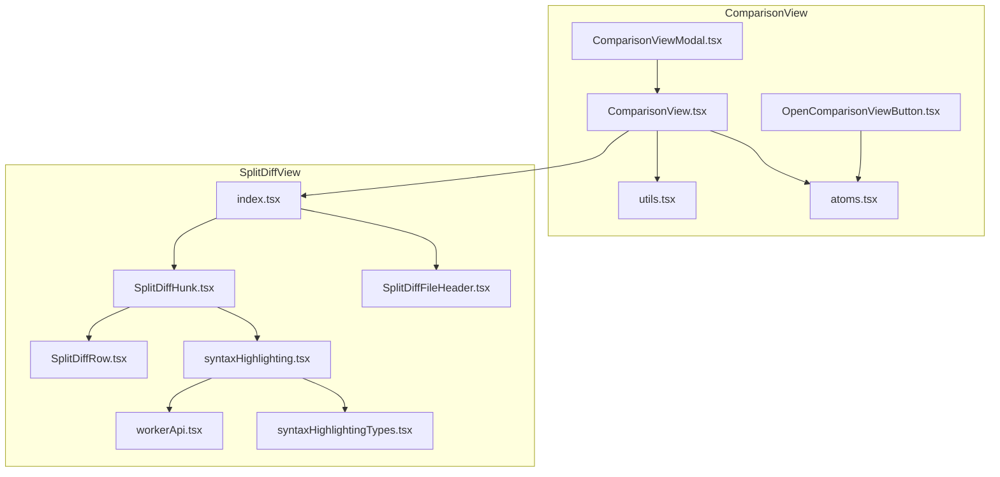
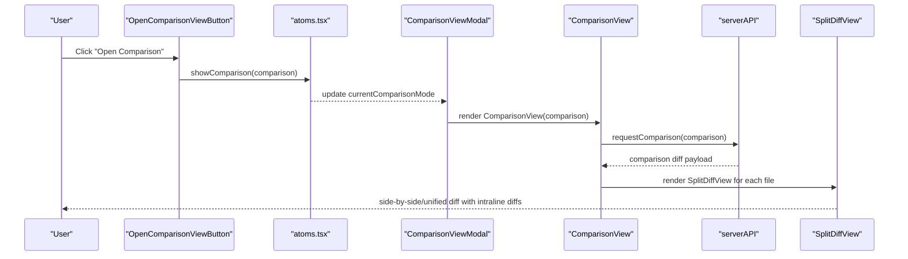
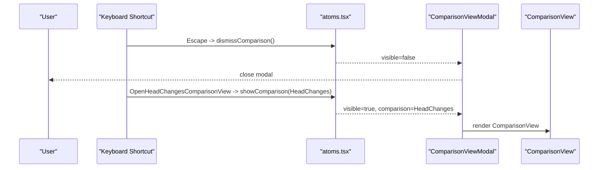
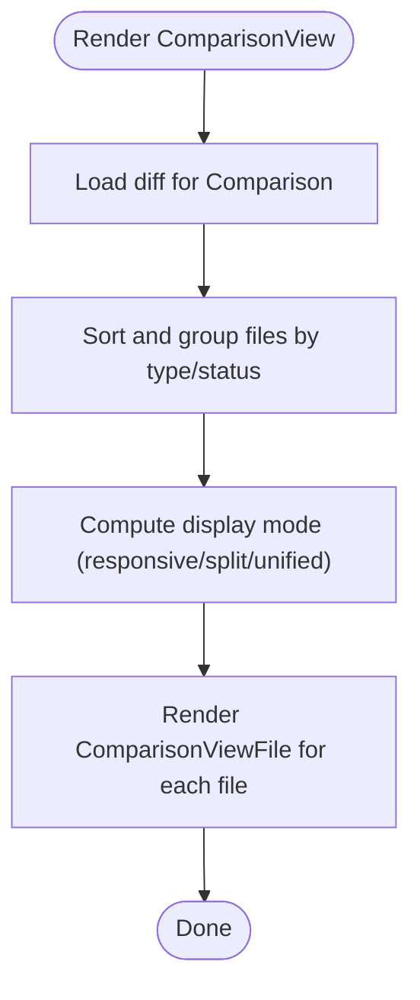
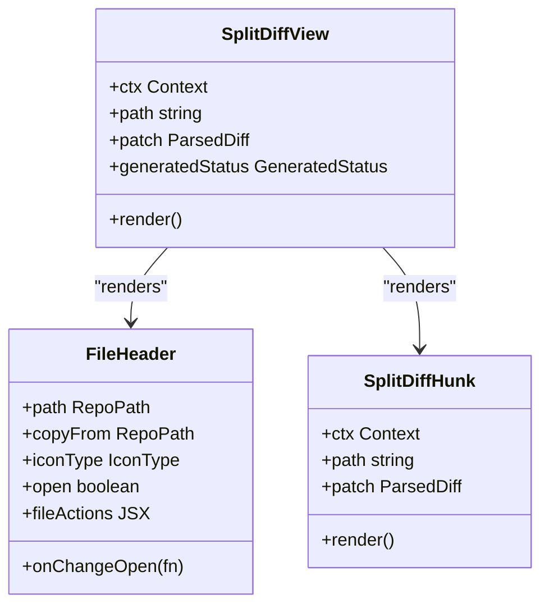
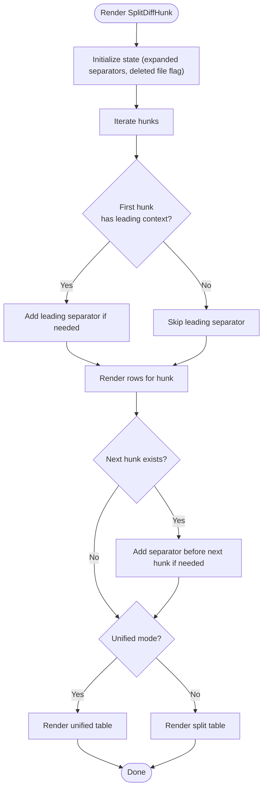
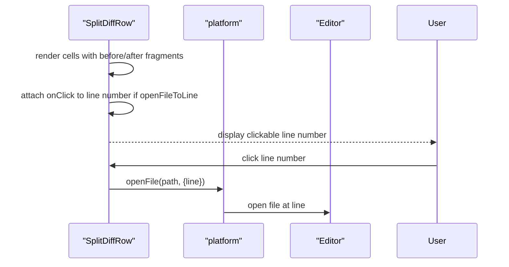
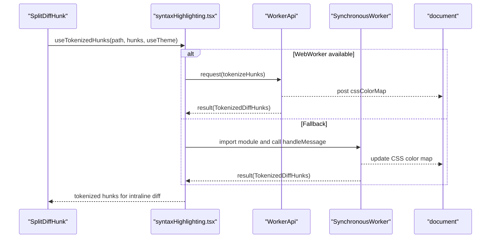
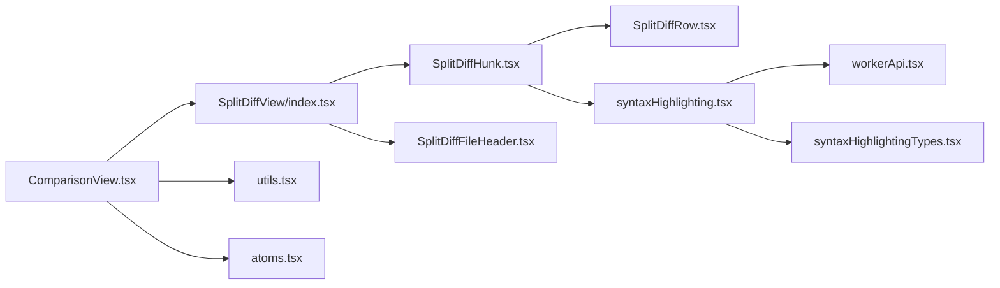

# Comparison Views

<cite>
**Referenced Files in This Document**
- [ComparisonView.tsx](file://addons/isl/src/ComparisonView/ComparisonView.tsx)
- [ComparisonViewModal.tsx](file://addons/isl/src/ComparisonView/ComparisonViewModal.tsx)
- [OpenComparisonViewButton.tsx](file://addons/isl/src/ComparisonView/OpenComparisonViewButton.tsx)
- [SplitDiffView/index.tsx](file://addons/isl/src/ComparisonView/SplitDiffView/index.tsx)
- [SplitDiffView/SplitDiffHunk.tsx](file://addons/isl/src/ComparisonView/SplitDiffView/SplitDiffHunk.tsx)
- [SplitDiffView/SplitDiffRow.tsx](file://addons/isl/src/ComparisonView/SplitDiffView/SplitDiffRow.tsx)
- [SplitDiffView/SplitDiffFileHeader.tsx](file://addons/isl/src/ComparisonView/SplitDiffView/SplitDiffFileHeader.tsx)
- [SplitDiffView/syntaxHighlighting.tsx](file://addons/isl/src/ComparisonView/SplitDiffView/syntaxHighlighting.tsx)
- [SplitDiffView/workerApi.tsx](file://addons/isl/src/ComparisonView/SplitDiffView/workerApi.tsx)
- [SplitDiffView/syntaxHighlightingTypes.tsx](file://addons/isl/src/ComparisonView/SplitDiffView/syntaxHighlightingTypes.tsx)
- [atoms.tsx](file://addons/isl/src/ComparisonView/atoms.tsx)
- [utils.tsx](file://addons/isl/src/ComparisonView/utils.tsx)
</cite>

## Table of Contents
1. [Introduction](#introduction)
2. [Project Structure](#project-structure)
3. [Core Components](#core-components)
4. [Architecture Overview](#architecture-overview)
5. [Detailed Component Analysis](#detailed-component-analysis)
6. [Dependency Analysis](#dependency-analysis)
7. [Performance Considerations](#performance-considerations)
8. [Troubleshooting Guide](#troubleshooting-guide)
9. [Conclusion](#conclusion)
10. [Appendices](#appendices)

## Introduction
This document explains the comparison view system used to visualize diffs in the application. It covers:
- The ComparisonViewModal architecture for full-screen comparison viewing
- Side-by-side and unified file comparison via SplitDiffView
- Intraline difference rendering, syntax highlighting, and interactive features
- Modal system integration, keyboard navigation, and zoom controls
- Practical examples for customizing layouts, adding new comparison types, and optimizing performance for large diffs
- Integration with commit selection and file navigation

## Project Structure
The comparison view system is primarily located under addons/isl/src/ComparisonView and addons/isl/src/ComparisonView/SplitDiffView. Key areas:
- ComparisonView: orchestrates data loading, file grouping, and display modes
- SplitDiffView: renders individual file diffs in split/unified views
- Syntax highlighting: offloads tokenization to a worker for performance
- Modal and atoms: manage visibility and keyboard shortcuts

**Diagram sources**
- [ComparisonView.tsx:1-465](file://addons/isl/src/ComparisonView/ComparisonView.tsx#L1-L465)
- [ComparisonViewModal.tsx:1-69](file://addons/isl/src/ComparisonView/ComparisonViewModal.tsx#L1-L69)
- [OpenComparisonViewButton.tsx:1-58](file://addons/isl/src/ComparisonView/OpenComparisonViewButton.tsx#L1-L58)
- [SplitDiffView/index.tsx:1-119](file://addons/isl/src/ComparisonView/SplitDiffView/index.tsx#L1-L119)
- [SplitDiffView/SplitDiffHunk.tsx:1-593](file://addons/isl/src/ComparisonView/SplitDiffView/SplitDiffHunk.tsx#L1-L593)
- [SplitDiffView/SplitDiffRow.tsx:1-142](file://addons/isl/src/ComparisonView/SplitDiffView/SplitDiffRow.tsx#L1-L142)
- [SplitDiffView/SplitDiffFileHeader.tsx:1-175](file://addons/isl/src/ComparisonView/SplitDiffView/SplitDiffFileHeader.tsx#L1-L175)
- [SplitDiffView/syntaxHighlighting.tsx:1-228](file://addons/isl/src/ComparisonView/SplitDiffView/syntaxHighlighting.tsx#L1-L228)
- [SplitDiffView/workerApi.tsx:1-104](file://addons/isl/src/ComparisonView/SplitDiffView/workerApi.tsx#L1-L104)
- [SplitDiffView/syntaxHighlightingTypes.tsx:1-52](file://addons/isl/src/ComparisonView/SplitDiffView/syntaxHighlightingTypes.tsx#L1-L52)
- [atoms.tsx:1-39](file://addons/isl/src/ComparisonView/atoms.tsx#L1-L39)
- [utils.tsx:1-42](file://addons/isl/src/ComparisonView/utils.tsx#L1-L42)

**Section sources**
- [ComparisonView.tsx:1-465](file://addons/isl/src/ComparisonView/ComparisonView.tsx#L1-L465)
- [ComparisonViewModal.tsx:1-69](file://addons/isl/src/ComparisonView/ComparisonViewModal.tsx#L1-L69)
- [OpenComparisonViewButton.tsx:1-58](file://addons/isl/src/ComparisonView/OpenComparisonViewButton.tsx#L1-L58)
- [SplitDiffView/index.tsx:1-119](file://addons/isl/src/ComparisonView/SplitDiffView/index.tsx#L1-L119)
- [SplitDiffView/SplitDiffHunk.tsx:1-593](file://addons/isl/src/ComparisonView/SplitDiffView/SplitDiffHunk.tsx#L1-L593)
- [SplitDiffView/SplitDiffRow.tsx:1-142](file://addons/isl/src/ComparisonView/SplitDiffView/SplitDiffRow.tsx#L1-L142)
- [SplitDiffView/SplitDiffFileHeader.tsx:1-175](file://addons/isl/src/ComparisonView/SplitDiffView/SplitDiffFileHeader.tsx#L1-L175)
- [SplitDiffView/syntaxHighlighting.tsx:1-228](file://addons/isl/src/ComparisonView/SplitDiffView/syntaxHighlighting.tsx#L1-L228)
- [SplitDiffView/workerApi.tsx:1-104](file://addons/isl/src/ComparisonView/SplitDiffView/workerApi.tsx#L1-L104)
- [SplitDiffView/syntaxHighlightingTypes.tsx:1-52](file://addons/isl/src/ComparisonView/SplitDiffView/syntaxHighlightingTypes.tsx#L1-L52)
- [atoms.tsx:1-39](file://addons/isl/src/ComparisonView/atoms.tsx#L1-L39)
- [utils.tsx:1-42](file://addons/isl/src/ComparisonView/utils.tsx#L1-L42)

## Core Components
- ComparisonView: loads diff data for a selected Comparison, groups files by type and generation status, manages collapsed state, and selects display mode (responsive, split, unified).
- SplitDiffView: renders a single file’s diff with optional generated content banner, file actions, and a table of hunks.
- SplitDiffHunk: renders hunks with separators, supports expanding hidden context lines, and computes intraline differences.
- SplitDiffRow: renders a single row with optional line numbers and click-to-open behavior.
- SplitDiffFileHeader: displays file path with copy-from semantics, icons, and actions.
- Syntax highlighting: tokenizes hunks/lines in a worker and applies CSS color maps.
- Modal and atoms: manage full-screen modal presentation, keyboard shortcuts, and visibility state.

**Section sources**
- [ComparisonView.tsx:74-178](file://addons/isl/src/ComparisonView/ComparisonView.tsx#L74-L178)
- [SplitDiffView/index.tsx:25-104](file://addons/isl/src/ComparisonView/SplitDiffView/index.tsx#L25-L104)
- [SplitDiffView/SplitDiffHunk.tsx:36-172](file://addons/isl/src/ComparisonView/SplitDiffView/SplitDiffHunk.tsx#L36-L172)
- [SplitDiffView/SplitDiffRow.tsx:24-95](file://addons/isl/src/ComparisonView/SplitDiffView/SplitDiffRow.tsx#L24-L95)
- [SplitDiffView/SplitDiffFileHeader.tsx:42-147](file://addons/isl/src/ComparisonView/SplitDiffView/SplitDiffFileHeader.tsx#L42-L147)
- [SplitDiffView/syntaxHighlighting.tsx:92-142](file://addons/isl/src/ComparisonView/SplitDiffView/syntaxHighlighting.tsx#L92-L142)
- [ComparisonViewModal.tsx:38-69](file://addons/isl/src/ComparisonView/ComparisonViewModal.tsx#L38-L69)
- [atoms.tsx:15-39](file://addons/isl/src/ComparisonView/atoms.tsx#L15-L39)

## Architecture Overview
The system follows a layered architecture:
- Presentation layer: ComparisonView and SplitDiffView components
- Data layer: Jotai atoms for comparison state and server communication
- Rendering layer: SplitDiffHunk and SplitDiffRow for efficient row rendering
- Highlighting layer: WebWorker-based syntax highlighting with fallbacks
- Interaction layer: Modal, keyboard shortcuts, and platform integrations

**Diagram sources**
- [OpenComparisonViewButton.tsx:18-42](file://addons/isl/src/ComparisonView/OpenComparisonViewButton.tsx#L18-L42)
- [atoms.tsx:28-34](file://addons/isl/src/ComparisonView/atoms.tsx#L28-L34)
- [ComparisonViewModal.tsx:38-52](file://addons/isl/src/ComparisonView/ComparisonViewModal.tsx#L38-L52)
- [ComparisonView.tsx:53-61](file://addons/isl/src/ComparisonView/ComparisonView.tsx#L53-L61)
- [SplitDiffView/index.tsx:25-104](file://addons/isl/src/ComparisonView/SplitDiffView/index.tsx#L25-L104)

## Detailed Component Analysis

### ComparisonViewModal and Modal System
- ComparisonViewModal wraps ComparisonView inside a Modal and registers keyboard shortcuts (Escape to dismiss, commands to open specific comparisons).
- ComparisonViewApp provides an app-root variant without modal framing.
- Visibility and current comparison are managed by atoms; platform.openDedicatedComparison can delegate to an external viewer.

**Diagram sources**
- [ComparisonViewModal.tsx:22-36](file://addons/isl/src/ComparisonView/ComparisonViewModal.tsx#L22-L36)
- [ComparisonViewModal.tsx:38-69](file://addons/isl/src/ComparisonView/ComparisonViewModal.tsx#L38-L69)
- [atoms.tsx:28-39](file://addons/isl/src/ComparisonView/atoms.tsx#L28-L39)

**Section sources**
- [ComparisonViewModal.tsx:1-69](file://addons/isl/src/ComparisonView/ComparisonViewModal.tsx#L1-L69)
- [atoms.tsx:15-39](file://addons/isl/src/ComparisonView/atoms.tsx#L15-L39)

### ComparisonView: Data Loading, Grouping, and Display Modes
- Loads diff data via serverAPI and caches it per Comparison using an atom family.
- Groups files by generated status and sorts by type and path.
- Manages collapsed state per file and default expansion thresholds.
- Chooses display mode: responsive (split/unified based on width), split, or unified.

**Diagram sources**
- [ComparisonView.tsx:53-61](file://addons/isl/src/ComparisonView/ComparisonView.tsx#L53-L61)
- [ComparisonView.tsx:118-165](file://addons/isl/src/ComparisonView/ComparisonView.tsx#L118-L165)
- [utils.tsx:19-42](file://addons/isl/src/ComparisonView/utils.tsx#L19-L42)
- [ComparisonView.tsx:374-396](file://addons/isl/src/ComparisonView/ComparisonView.tsx#L374-L396)

**Section sources**
- [ComparisonView.tsx:74-178](file://addons/isl/src/ComparisonView/ComparisonView.tsx#L74-L178)
- [utils.tsx:11-17](file://addons/isl/src/ComparisonView/utils.tsx#L11-L17)
- [utils.tsx:19-42](file://addons/isl/src/ComparisonView/utils.tsx#L19-L42)
- [ComparisonView.tsx:374-396](file://addons/isl/src/ComparisonView/ComparisonView.tsx#L374-L396)

### SplitDiffView: File-Level Rendering and Actions
- Renders file header with icon, path, and actions (open diff, open file).
- Supports generated file banners and “Show anyway” toggle.
- Delegates table rendering to SplitDiffHunk.

**Diagram sources**
- [SplitDiffView/index.tsx:25-104](file://addons/isl/src/ComparisonView/SplitDiffView/index.tsx#L25-L104)
- [SplitDiffView/SplitDiffFileHeader.tsx:42-147](file://addons/isl/src/ComparisonView/SplitDiffView/SplitDiffFileHeader.tsx#L42-L147)
- [SplitDiffView/SplitDiffHunk.tsx:30-34](file://addons/isl/src/ComparisonView/SplitDiffView/SplitDiffHunk.tsx#L30-L34)

**Section sources**
- [SplitDiffView/index.tsx:25-104](file://addons/isl/src/ComparisonView/SplitDiffView/index.tsx#L25-L104)
- [SplitDiffView/SplitDiffFileHeader.tsx:42-147](file://addons/isl/src/ComparisonView/SplitDiffView/SplitDiffFileHeader.tsx#L42-L147)

### SplitDiffHunk: Hunk Rendering, Separators, and Intraline Differences
- Iterates hunks, groups lines into common/removed/added sets, and renders rows.
- Supports expanding hidden context lines with “Expand lines” buttons.
- Computes intraline differences either via character diff or tokenized intraline diff.
- Applies syntax highlighting via tokenized hunks/lines.

**Diagram sources**
- [SplitDiffView/SplitDiffHunk.tsx:36-172](file://addons/isl/src/ComparisonView/SplitDiffView/SplitDiffHunk.tsx#L36-L172)
- [SplitDiffView/SplitDiffHunk.tsx:475-503](file://addons/isl/src/ComparisonView/SplitDiffView/SplitDiffHunk.tsx#L475-L503)
- [SplitDiffView/SplitDiffHunk.tsx:510-564](file://addons/isl/src/ComparisonView/SplitDiffView/SplitDiffHunk.tsx#L510-L564)

**Section sources**
- [SplitDiffView/SplitDiffHunk.tsx:36-172](file://addons/isl/src/ComparisonView/SplitDiffView/SplitDiffHunk.tsx#L36-L172)
- [SplitDiffView/SplitDiffHunk.tsx:436-470](file://addons/isl/src/ComparisonView/SplitDiffView/SplitDiffHunk.tsx#L436-L470)
- [SplitDiffView/SplitDiffHunk.tsx:577-592](file://addons/isl/src/ComparisonView/SplitDiffView/SplitDiffHunk.tsx#L577-L592)

### SplitDiffRow: Line Numbers and Click-to-Open
- Renders left/right line numbers and content cells.
- Adds “clickable” class for line numbers when openFileToLine is available.
- Prevents commenting on expanded (common) rows to match platform constraints.

**Diagram sources**
- [SplitDiffView/SplitDiffRow.tsx:24-95](file://addons/isl/src/ComparisonView/SplitDiffView/SplitDiffRow.tsx#L24-L95)
- [ComparisonView.tsx:413-421](file://addons/isl/src/ComparisonView/ComparisonView.tsx#L413-L421)

**Section sources**
- [SplitDiffView/SplitDiffRow.tsx:24-95](file://addons/isl/src/ComparisonView/SplitDiffView/SplitDiffRow.tsx#L24-L95)
- [ComparisonView.tsx:413-421](file://addons/isl/src/ComparisonView/ComparisonView.tsx#L413-L421)

### Syntax Highlighting: Worker-Based Tokenization
- Offloads tokenization to a WebWorker for performance; falls back to synchronous worker in constrained environments.
- Applies CSS color map updates to reflect theme colors.
- Provides hooks to tokenize hunks and arbitrary content chunks.

**Diagram sources**
- [SplitDiffView/syntaxHighlighting.tsx:92-113](file://addons/isl/src/ComparisonView/SplitDiffView/syntaxHighlighting.tsx#L92-L113)
- [SplitDiffView/workerApi.tsx:49-103](file://addons/isl/src/ComparisonView/SplitDiffView/workerApi.tsx#L49-L103)
- [SplitDiffView/syntaxHighlighting.tsx:31-83](file://addons/isl/src/ComparisonView/SplitDiffView/syntaxHighlighting.tsx#L31-L83)

**Section sources**
- [SplitDiffView/syntaxHighlighting.tsx:92-142](file://addons/isl/src/ComparisonView/SplitDiffView/syntaxHighlighting.tsx#L92-L142)
- [SplitDiffView/workerApi.tsx:18-47](file://addons/isl/src/ComparisonView/SplitDiffView/workerApi.tsx#L18-L47)
- [SplitDiffView/syntaxHighlightingTypes.tsx:17-52](file://addons/isl/src/ComparisonView/SplitDiffView/syntaxHighlightingTypes.tsx#L17-L52)

### Modal System, Keyboard Navigation, and Zoom Controls
- Modal: ComparisonViewModal renders ComparisonView inside a Modal and lazily loads the view.
- Keyboard: ComparisonViewModal registers Escape to dismiss and commands to open specific comparisons.
- Zoom: No explicit zoom controls are present in the comparison view; adjust browser zoom or use platform-provided scaling.

**Section sources**
- [ComparisonViewModal.tsx:38-52](file://addons/isl/src/ComparisonView/ComparisonViewModal.tsx#L38-L52)
- [ComparisonViewModal.tsx:22-36](file://addons/isl/src/ComparisonView/ComparisonViewModal.tsx#L22-L36)

### Integration with Commit Selection and File Navigation
- ComparisonView passes a Context object to SplitDiffView with:
  - openFile: opens the file in the platform editor
  - openFileToLine: opens a specific line when comparison is against head
  - fetchAdditionalLines: retrieves hidden context lines on demand
  - useComparisonInvalidationKeyHook: ensures cache invalidation when head changes
- File navigation integrates with platform.openDiff and platform.clipboardCopy.

**Section sources**
- [ComparisonView.tsx:413-456](file://addons/isl/src/ComparisonView/ComparisonView.tsx#L413-L456)
- [SplitDiffView/index.tsx:59-86](file://addons/isl/src/ComparisonView/SplitDiffView/index.tsx#L59-L86)

## Dependency Analysis
- ComparisonView depends on:
  - serverAPI for diff retrieval
  - Jotai atoms for state and persistence
  - Shared utilities for parsing and sorting
- SplitDiffView depends on:
  - SplitDiffHunk for rendering
  - SplitDiffRow for row composition
  - SplitDiffFileHeader for file metadata
  - Syntax highlighting hooks for tokenization
- Syntax highlighting depends on:
  - WorkerApi for messaging
  - SynchronousWorker fallback
  - TextMate grammar styles

**Diagram sources**
- [ComparisonView.tsx:1-44](file://addons/isl/src/ComparisonView/ComparisonView.tsx#L1-L44)
- [SplitDiffView/index.tsx:1-26](file://addons/isl/src/ComparisonView/SplitDiffView/index.tsx#L1-L26)
- [SplitDiffView/SplitDiffHunk.tsx:1-27](file://addons/isl/src/ComparisonView/SplitDiffView/SplitDiffHunk.tsx#L1-L27)
- [SplitDiffView/syntaxHighlighting.tsx:1-22](file://addons/isl/src/ComparisonView/SplitDiffView/syntaxHighlighting.tsx#L1-L22)
- [SplitDiffView/workerApi.tsx:1-12](file://addons/isl/src/ComparisonView/SplitDiffView/workerApi.tsx#L1-L12)
- [SplitDiffView/syntaxHighlightingTypes.tsx:1-10](file://addons/isl/src/ComparisonView/SplitDiffView/syntaxHighlightingTypes.tsx#L1-L10)
- [utils.tsx:1-10](file://addons/isl/src/ComparisonView/utils.tsx#L1-L10)
- [atoms.tsx:1-14](file://addons/isl/src/ComparisonView/atoms.tsx#L1-L14)

**Section sources**
- [ComparisonView.tsx:1-44](file://addons/isl/src/ComparisonView/ComparisonView.tsx#L1-L44)
- [SplitDiffView/index.tsx:1-26](file://addons/isl/src/ComparisonView/SplitDiffView/index.tsx#L1-L26)
- [SplitDiffView/SplitDiffHunk.tsx:1-27](file://addons/isl/src/ComparisonView/SplitDiffView/SplitDiffHunk.tsx#L1-L27)
- [SplitDiffView/syntaxHighlighting.tsx:1-22](file://addons/isl/src/ComparisonView/SplitDiffView/syntaxHighlighting.tsx#L1-L22)
- [SplitDiffView/workerApi.tsx:1-12](file://addons/isl/src/ComparisonView/SplitDiffView/workerApi.tsx#L1-L12)
- [SplitDiffView/syntaxHighlightingTypes.tsx:1-10](file://addons/isl/src/ComparisonView/SplitDiffView/syntaxHighlightingTypes.tsx#L1-L10)
- [utils.tsx:1-10](file://addons/isl/src/ComparisonView/utils.tsx#L1-L10)
- [atoms.tsx:1-14](file://addons/isl/src/ComparisonView/atoms.tsx#L1-L14)

## Performance Considerations
- Intraline diff cost control: Character diff is capped by a maximum combined line length to avoid expensive computations.
- Lazy loading: ComparisonView uses React.lazy and Suspense for modal rendering.
- Efficient rendering: SplitDiffHunk uses memoization and renders only visible hunks; separators defer loading of additional lines.
- Syntax highlighting offload: Tokenization runs in a WebWorker; fallback to synchronous worker avoids blocking UI.
- Cache invalidation: useComparisonInvalidationKeyHook ensures context lines are re-fetched when the head commit changes.

Recommendations:
- Prefer split view for large diffs to reduce horizontal scrolling.
- Keep unified view for small diffs to compare before/after side-by-side.
- Use responsive mode to adapt to screen width automatically.
- Avoid excessive manual expansion of large files; rely on default thresholds.

**Section sources**
- [SplitDiffView/SplitDiffHunk.tsx:28](file://addons/isl/src/ComparisonView/SplitDiffView/SplitDiffHunk.tsx#L28)
- [SplitDiffView/SplitDiffHunk.tsx:436-470](file://addons/isl/src/ComparisonView/SplitDiffView/SplitDiffHunk.tsx#L436-L470)
- [ComparisonViewModal.tsx:20](file://addons/isl/src/ComparisonView/ComparisonViewModal.tsx#L20)
- [SplitDiffView/syntaxHighlighting.tsx:31-83](file://addons/isl/src/ComparisonView/SplitDiffView/syntaxHighlighting.tsx#L31-L83)
- [ComparisonView.tsx:440-450](file://addons/isl/src/ComparisonView/ComparisonView.tsx#L440-L450)

## Troubleshooting Guide
Common issues and resolutions:
- Empty or missing diffs: ComparisonView filters out empty patches; verify the server response and ensure the comparison type is supported.
- Syntax highlighting not applied: Ensure the worker initializes and receives the CSS color map; check environment-specific worker availability.
- Click-to-open not working: openFileToLine is only enabled for comparisons against head; confirm the comparison type and platform capabilities.
- Expanded context lines fail to load: Verify fetchAdditionalLines implementation and network connectivity; check error notices in the UI.

**Section sources**
- [utils.tsx:11-17](file://addons/isl/src/ComparisonView/utils.tsx#L11-L17)
- [SplitDiffView/syntaxHighlighting.tsx:71-78](file://addons/isl/src/ComparisonView/SplitDiffView/syntaxHighlighting.tsx#L71-L78)
- [ComparisonView.tsx:418-421](file://addons/isl/src/ComparisonView/ComparisonView.tsx#L418-L421)
- [SplitDiffView/SplitDiffHunk.tsx:539-546](file://addons/isl/src/ComparisonView/SplitDiffView/SplitDiffHunk.tsx#L539-L546)

## Conclusion
The comparison view system provides a robust, modular solution for visualizing diffs. It separates concerns across layers, leverages workers for performance, and offers flexible display modes. With clear integration points for platform features and extensibility for new comparison types, it supports both everyday development workflows and specialized use cases.

## Appendices

### Customizing Comparison Layouts
- Choose display mode:
  - Responsive: automatically switches between split and unified based on viewport width.
  - Split: side-by-side comparison for readability.
  - Unified: compact view for dense diffs.
- Adjust default expansion:
  - Modify the accumulated size threshold to control when files start collapsed by default.

**Section sources**
- [ComparisonView.tsx:68-72](file://addons/isl/src/ComparisonView/ComparisonView.tsx#L68-L72)
- [ComparisonView.tsx:336-346](file://addons/isl/src/ComparisonView/ComparisonView.tsx#L336-L346)
- [ComparisonView.tsx:374-396](file://addons/isl/src/ComparisonView/ComparisonView.tsx#L374-L396)

### Adding New Comparison Types
- Extend the picker options in ComparisonViewHeader to include new types.
- Ensure serverAPI handles the new comparison type and returns appropriate diffs.
- Provide labels and titles via shared i18n utilities.

**Section sources**
- [ComparisonView.tsx:180-184](file://addons/isl/src/ComparisonView/ComparisonView.tsx#L180-L184)
- [ComparisonView.tsx:235-244](file://addons/isl/src/ComparisonView/ComparisonView.tsx#L235-L244)

### Optimizing Performance for Large Diffs
- Use split view for large files to minimize horizontal scrolling.
- Rely on lazy loading and separators to defer loading of hidden context lines.
- Avoid unnecessary re-renders by memoizing tokenized content and using stable keys.

**Section sources**
- [SplitDiffView/SplitDiffHunk.tsx:102-128](file://addons/isl/src/ComparisonView/SplitDiffView/SplitDiffHunk.tsx#L102-L128)
- [SplitDiffView/SplitDiffHunk.tsx:577-592](file://addons/isl/src/ComparisonView/SplitDiffView/SplitDiffHunk.tsx#L577-L592)